# درسنامه جامع و خودآموز مقدمات آمار، مقیاس‌ها و شاخص‌های آماری

> [!abstract] شناسنامه کنکوری و اهداف آموزشی
> - **بودجه‌بندی سالانه:** ۱ تا ۳ تست قطعی در هر دوره کنکور ارشد مدیریت (در سال ۱۴۰۴: ۳ تست مستقیم؛ ۱۴.۱٪ کل سوالات آمار).
> - **درجه دشواری:** روان، تحلیلی و فرمول‌محور با بازدهی ۱۰۰٪ تستی.
> - **پیش‌نیازها:** پیوست ۱ ریاضیات پایه (قوانین توان، جبر مجموعه‌ها، مفهوم سیگما و مشتق/انتگرال مقدماتی).
> - **هدف درسنامه:** آموزش صفر تا صد و خودآموز مفاهیم ریاضیات پایه، مقیاس‌های سنجش، شاخص‌های تمرکز (میانگین‌ها، میانه، نما)، شاخص‌های پراکندگی (واریانس، انحراف معیار، ضریب تغییرات، نمره استاندارد $Z$)، شاخص‌های شکل توزیع (چولگی و کشیدگی) به صورت کاملاً خودکفا و بدون نیاز به هیچ کتاب رفرنس دیگر.

---

## نقشه مفهومی درسنامه

```mermaid
flowchart TD
    Root(["فصل ۱: مقدمات، مقیاس‌ها و شاخص‌های آماری"]) --> M0["۰. یادآوری ابزارهای ریاضی پایه"]
    Root --> M1["۱. تعاریف بنیادین و مقیاس‌های چهارگانه سنجش"]
    Root --> M2["۲. شاخص‌های سنجش مرکزیت داده‌ها"]
    Root --> M3["۳. شاخص‌های سنجش پراکندگی و موقعیت نسبی"]
    Root --> M4["۴. شاخص‌های شکل توزیع (چولگی و کشیدگی)"]
    Root --> M5["۵. کپسول مرور سریع و فرمول‌های طلایی"]
    
    M0 --> M0_1["توان و رادیکال و فاکتوریل"]
    M0 --> M0_2["جبر مجموعه‌ها و تفاضل متقارن"]
    M0 --> M0_3["مشتق و انتگرال در آمار"]

    M1 --> M1_1["جامعه، نمونه و صفت"]
    M1 --> M1_2["اسمی، ترتیبی، فاصله‌ای و نسبتی"]

    M2 --> M2_1["میانگین حسابی و ویژگی‌های سیگما"]
    M2 --> M2_2["میانگین هندسی و کاربرد در رشد/تورم"]
    M2 --> M2_3["میانگین هارمونیک و سرعت متوسط"]
    M2 --> M2_4["میانه، کمینه‌سازی قدر مطلق و میانگین پیراسته"]
    M2 --> M2_5["مُد و توزیع‌های چندوجهی"]

    M3 --> M3_1["دامنه تغییرات و انحراف متوسط"]
    M3 --> M3_2["واریانس، انحراف معیار و نیمه‌واریانس"]
    M3 --> M3_3["ضریب تغییرات و سنجش ریسک"]
    M3 --> M3_4["نمره استاندارد Z و ترکیب جوامع"]

    M4 --> M4_1["ضریب چولگی و ترتیب شاخص‌ها"]
    M4 --> M4_2["کشیدگی گشتاوری و ضریب کشیدگی"]
```



---

## ۰. یادآوری ابزارهای ریاضی پایه مورد نیاز آمار (پیوست ۱)

برای تسلط بر فرمول‌های آماری و حل تست‌های بدون ماشین حساب، مرور چند قانون ساده جبری ضروری است:

### ۰.۱. قوانین توان و رادیکال
- **ضرب با پایه‌های یکسان:** توان‌ها جمع می‌شوند:
  $$a^n \times a^m = a^{n+m} \quad \longrightarrow \quad 7^2 \times 7^3 = 7^5$$
- **توان منفی:** پایه را معکوس می‌کند:
  $$a^{-n} = \frac{1}{a^n} \quad \longrightarrow \quad 2^{-5} = \frac{1}{2^5} = \frac{1}{32}$$
  $$\left(\frac{a}{b}\right)^{-n} = \left(\frac{b}{a}\right)^n = \frac{b^n}{a^n} \quad \longrightarrow \quad \left(\frac{2}{3}\right)^{-6} = \left(\frac{3}{2}\right)^6 = \frac{3^6}{2^6}$$
- **ارتباط توان کسری و رادیکال:**
  $$\sqrt[n]{b} = b^{\frac{1}{n}} \quad \longrightarrow \quad \sqrt[5]{32} = 32^{\frac{1}{5}} = (2^5)^{\frac{1}{5}} = 2$$

### ۰.۲. فاکتوریل و اولویت محاسبات
- **فاکتوریل ($n!$):** ضرب متوالی اعداد طبیعی از $n$ تا ۱:
  $$n! = n \times (n-1) \times \dots \times 2 \times 1 \quad , \quad 5! = 120 \quad , \quad 0! = 1$$
- **اولویت اعمال ریاضی:** ۱) درون پرانتز، ۲) توان و رادیکال، ۳) ضرب و تقسیم، ۴) جمع و تفریق (از چپ به راست).

### ۰.۳. قدر مطلق ($\lvert X \rvert$)
عددی غیرمنفی تولید می‌کند؛ ورودی منفی را مثبت کرده و ورودی مثبت یا صفر را بدون تغییر رها می‌سازد:
$$\lvert -8 \rvert = 8 \quad , \quad \lvert 8 \rvert = 8$$

### ۰.۴. مشتق و انتگرال در حد کاربرد آمار
- **مشتق چندجمله‌ای:** شیب خط مماس بر نمودار:
  $$\frac{d}{dx}(X^n) = n X^{n-1} \quad \longrightarrow \quad \frac{d}{dx}(3x^3 + 6x + 1) = 9x^2 + 6$$
- **انتگرال چندجمله‌ای (پادمشتق و مساحت زیر منحنی چگالی):**
  $$\int X^n \, dx = \frac{X^{n+1}}{n+1} \quad (n \neq -1)$$
  $$\int \frac{1}{X} \, dx = \ln \lvert X \rvert \quad (n = -1)$$
  $$\int_1^2 (x^{-1} + 3) \, dx = \left[ \ln x + 3x \right]_1^2 = (\ln 2 + 6) - (\ln 1 + 3) = \ln 2 + 3$$

### ۰.۵. نظریه مجموعه‌ها و جبر پیشامدها
در تحلیل آماری و بخصوص احتمال، اعضای یک کل با منطق زیر دسته‌بندی می‌شوند:
- **متمم ($A'$ یا $A^c$):** تمام اعضایی که در مجموعه مرجع هستند ولی عضو $A$ نیستند.
- **اشتراک ($A \cap B$):** اعضایی که **هم** در $A$ و **هم** در $B$ حضور دارند.
- **اجتماع ($A \cup B$):** اعضایی که حداقل در یکی از دو مجموعه $A$ یا $B$ هستند:
  $$n(A \cup B) = n(A) + n(B) - n(A \cap B)$$
- **تفاضل ($A - B$):** اعضایی که در $A$ هستند ولی در $B$ حضور ندارند ($A \cap B'$).
- **تفاضل متقارن ($A \ \Delta \ B$):** اعضایی که دقیقاً و منحصراً در یکی از دو مجموعه هستند:
  $$A \ \Delta \ B = (A - B) \cup (B - A) = (A \cup B) - (A \cap B)$$

---

## ۱. تعاریف بنیادین و مقیاس‌های چهارگانه اندازه‌گیری (سطوح سنجش)

### ۱.۱. مفاهیم پایه به زبان ساده
- **جامعه آماری (Population):** کل مجموعه از عناصر، افراد یا اقلام که مورد پژوهش قرار می‌گیرند. تعداد اعضای جامعه با $N$ نمایش داده می‌شود.
  - *صفت مشترک (ثابت):* ویژگی بنیادینی که سبب شده این اعضا در کنار هم قرار گیرند (مثلاً همه داوطلبان کنکور ارشد مدیریت ۱۴۰۴).
  - *صفت متغیر:* ویژگی‌هایی که باعث تفاوت اعضای جامعه از یکدیگر می‌شود (مانند نمره تراز، ساعت مطالعه روزانه، رشته کارشناسی).
- **نمونه آماری (Sample):** زیرمجموعه‌ای معرف و تصادفی از جامعه که با $n$ مشخص شده و نتایج بررسی آن به کل جامعه تعمیم داده می‌شود (مشت نمونه خروار).
- **آمار توصیفی (Descriptive Statistics):** ابزارها و روش‌هایی که صرفاً به گردآوری، خلاصه‌سازی، رسم نمودار و توصیف داده‌های موجود می‌پردازند؛ **در آمار توصیفی هیچ‌گونه تعمیمی به فراتر از داده‌ها صورت نمی‌گیرد.**
- **آمار استنباطی (Inferential Statistics):** فنونی که با مطالعه نمونه، احکام و پارامترهای کل جامعه را با حاشیه خطای مشخص تخمین می‌زنند. پل اتصال آمار توصیفی به استنباطی، علم **احتمالات** است.

### ۱.۲. مقیاس‌های چهارگانه اندازه‌گیری (چهارگانه استیونز)

طراحان کنکور عاشق طرح سوال از تفاوت ظریف این ۴ مقیاس هستند:

```
[اسمی (Nominal)] ---> [ترتیبی (Ordinal)] ---> [فاصله‌ای (Interval)] ---> [نسبتی (Ratio)]
(فقط برچسب و دسته‌بندی)   (دارای رتبه و اولویت)     (فاصله‌ها معنی‌دار، صفر قراردادی) (صفر مطلق، نسبت‌ها معنی‌دار)
```

1. **مقیاس اسمی (Nominal):**
   - *تعریف:* ساده‌ترین سطح سنجش؛ اعداد یا اسامی صرفاً نقش برچسب و کدگذاری دارند.
   - *عملیات مجاز:* فقط شمارش تعداد (فراوانی) و تعیین مُد (نما). جمع و تفریق یا میانگین‌گیری بی‌معنی است.
   - *مثال‌ها:* گروه خونی ($A, B, AB, O$)، جنسیت (مرد/زن)، استان محل سکونت، شماره پیراهن بازیکنان فوتبال، شماره دانشجویی، کد ملی.
2. **مقیاس ترتیبی یا رتبه‌ای (Ordinal):**
   - *تعریف:* علاوه بر ویژگی برچسب‌گذاری، امکان مرتب کردن داده‌ها به ترتیب بزرگی یا برتری وجود دارد، اما فاصله میان رتبه‌ها یکسان و قابل اندازه‌گیری دقیق نیست.
   - *شاخص مناسب:* میانه و صدک‌ها (علاوه بر مُد).
   - *مثال‌ها:* مقاطع تحصیلی (دیپلم، کارشناسی، کارشناسی ارشد، دکتری)، درجات نظامی (سروان، سرگرد، سرهنگ)، رتبه‌های ورزشی (طلا، نقره، برنز)، طبقات درآمدی (کم‌درآمد، متوسط، پردرآمد)، میزان رضایت مشتری (خیلی کم تا خیلی زیاد).
3. **مقیاس فاصله‌ای (Interval):**
   - *تعریف:* فاصله‌ها مشخص و یکسان است و جمع و تفریق مجاز است، اما **فاقد صفر مطلق** است. **نقطه صفر در این مقیاس کاملاً قراردادی (اعتباری) است** و عدم وجود صفت را نشان نمی‌دهد.
   - *نکته کلیدی کنکور:* در مقیاس فاصله‌ای، نسبت دو عدد معنا ندارد! برای مثال اگر دمای امروز ۲۰ درجه سلسیوس و دمای دیروز ۱۰ درجه باشد، نمی‌توان گفت هوا دقیقاً «دو برابر گرم‌تر» شده است؛ چون نقطه صفر سلسیوس قراردادی (نقطه انجماد آب) است نه نقطه توقف جنبش مولکولی.
   - *مثال‌ها:* دمای سانتی‌گراد (سلسیوس)، دمای فارنهایت، تاریخ تقویمی (سال شمسی/میلادی)، نمره هوش ($IQ$).
4. **مقیاس نسبتی یا نسبی (Ratio):**
   - *تعریف:* کامل‌ترین مقیاس سنجش که علاوه بر فواصل یکسان، دارای **صفر مطلق (حقیقی)** است. در صفر مطلق، خاصیت مورد سنجش کلاً غایب است. تمام اعمال ریاضی (جمع، تفریق، ضرب، تقسیم، نسبت‌گیری) در این مقیاس معتبر است.
   - *مثال‌ها:* وزن بر حسب کیلوگرم، طول به متر، درآمد به تومان، میزان فروش، سن افراد، دمای کلوین (صفر کلوین یعنی توقف کامل حرکت مولکول‌ها)، زمان سپری‌شده به ثانیه.

| شاخص مقایسه | اسمی (Nominal) | ترتیبی (Ordinal) | فاصله‌ای (Interval) | نسبتی (Ratio) |
| :--- | :--- | :--- | :--- | :--- |
| **تعریف صفت** | دسته‌بندی و برچسب | رتبه‌بندی کیفی | فواصل کمی معلوم | مقادیر کمی با صفر مطلق |
| **نوع نقطه صفر** | ندارد | ندارد | **صفر قراردادی** | **صفر مطلق** |
| **عملیات مجاز** | شمارش ($=$ و $\neq$) | مقایسه ترتیب ($>$ و $<$) | جمع و تفریق ($+$ و $-$) | همه اعمال حتی نسبت ($\times$ و $\div$) |
| **شاخص مرکزی مناسب**| مُد (نما) | میانه، صدک‌ها | میانگین حسابی | تمام میانگین‌ها (حسابی، هندسی، هارمونیک) |
| **مثال طلایی** | شماره پلاک، گروه خونی | مدرک تحصیلی، درجه نظامی | دمای سلسیوس، تقویم | قد، وزن، سود، دمای کلوین |

---

## ۲. شاخص‌های سنجش مرکزیت داده‌ها (گرایش مرکزی)

شاخص‌های تمرکز یک عدد منفرد هستند که سعی دارند مرکز ثقل یا نماینده کل داده‌ها را نشان دهند:

### ۲.۱. میانگین حسابی ($\mu_X$ یا $\bar{X}$)
عمومی‌ترین شاخص مرکزی؛ حاصل تقسیم جمع مقادیر بر تعداد آن‌ها:
$$\mu_X = \frac{\sum_{i=1}^N X_i}{N}$$

- **خواص طلایی سیگما و میانگین حسابی در تست‌ها:**
  1. مجموع انحرافات داده‌ها از میانگین حسابی همواره **دقیقاً صفر** است:
     $$\sum_{i=1}^N (X_i - \mu_X) = 0$$
     *نکته تستی:* هرگاه در صورت سوال دیدید $\sum(X_i - C) = 0$، بلافاصله نتیجه بگیرید که $C$ همان میانگین حسابی داده‌ها ($\mu = C$) است!
  2. مجموع مجذور انحرافات داده‌ها از میانگین حسابی، **حداقل مقدار ممکن** را دارد:
     $$\sum_{i=1}^N (X_i - a)^2 \quad \text{مینیمم است اگر و تنها اگر } a = \mu_X$$
  3. اثر تبدیلات خطی ($Y = aX + b$):
     $$\mu_Y = a\mu_X + b$$

### ۲.۲. میانگین هندسی ($\mu_G$)
- **تعریف و فرمول:** ریشه $N$-اُم حاصل‌ضرب داده‌ها:
  $$\mu_G = \sqrt[N]{X_1 \times X_2 \times \dots \times X_N}$$
- **کاربرد استراتژیک در کسب‌وکار و اقتصاد:** برای داده‌هایی که ماهیت **نرخ رشد، نسبت افزایش، تورم متوالی و بهره مرکب** دارند، میانگین حسابی گمراه‌کننده است و الزاماً باید از میانگین هندسی استفاده شود.
- *مثال واقعی:* اگر فروش استارتاپی در سال اول ۲ برابر، در سال دوم ۴ برابر و در سال سوم ۸ برابر شود، میانگین رشد سالانه برابر است با:
  $$\mu_G = \sqrt[3]{2 \times 4 \times 8} = \sqrt[3]{64} = 4 \text{ برابر}$$

### ۲.۳. میانگین هارمونیک یا همساز ($\mu_H$)
- **تعریف و فرمول ساده:** معکوسِ میانگینِ معکوسِ داده‌ها:
  $$\frac{1}{\mu_H} = \frac{\sum \frac{1}{X_i}}{N} \implies \mu_H = \frac{N}{\sum \frac{1}{X_i}}$$
- **حالت وزن‌دار (مسافت و سرعت):**
  $$\mu_H = \frac{\sum w_i}{\sum \frac{w_i}{X_i}}$$
- **کاربرد استراتژیک:** هرگاه متغیر از تقسیم دو یکا ساخته شده باشد (مانند سرعت بر حسب کیلومتر بر ساعت، قیمت واحد بر حسب ریال بر سهم، بازدهی به ازای هر ساعت) و اوزان بر اساس صورت کسر (مثلاً مسافت طی‌شده) مشخص شده باشد، سرعت یا نرخ متوسط از رابطه هارمونیک به دست می‌آید.

> [!important] نامساوی جاودانه میانگین‌ها برای داده‌های مثبت
> برای هر مجموعه از داده‌های مثبت، همواره رابطه ترتیبی زیر برقرار است:
> $$\mu_H \le \mu_G \le \mu_X$$
> $$\text{میانگین هارمونیک} \le \text{میانگین هندسی} \le \text{میانگین حسابی}$$
> تساوی تنها زمانی رخ می‌دهد که تمام داده‌ها با هم برابر باشند ($X_1 = X_2 = \dots = X_N$).

### ۲.۴. میانه ($Me$)
عددی که پس از مرتب‌سازی صعودی داده‌ها، دقیقاً در وسط قرار می‌گیرد؛ به طوری که ۵۰٪ داده‌ها از آن کوچک‌تر و ۵۰٪ داده‌ها از آن بزرگ‌ترند.
- **روش تعیین در داده‌های منفرد:**
  - اگر تعداد $N$ فرد باشد: دادۀ رتبه $\frac{N+1}{2}$.
  - اگر تعداد $N$ زوج باشد: میانگین دو دادۀ وسط، یعنی رتبه‌های $\frac{N}{2}$ و $\frac{N}{2} + 1$.
- **خاصیت کمینه‌سازی قدر مطلق (شاه‌کلید کنکور):**
  مجموع فواصل مطلق داده‌ها از یک نقطه $a$ زمانی به حداقل می‌رسد که $a$ برابر با **میانه** باشد:
  $$\min \sum_{i=1}^N \lvert X_i - a \rvert \iff a = Me$$
  *(مقایسه کنید با میانگین حسابی که $\sum(X_i - a)^2$ را مینیمم می‌کرد).*
- **ویژگی مقاومت در برابر داده‌های پرت:** میانه تحت تأثیر مقادیر بسیار بزرگ یا بسیار کوچک غیرعادی قرار نمی‌گیرد.

### ۲.۵. میانگین پیراسته (Trimmed Mean)
شاخصی مرکب که مزایای میانگین حسابی و میانه را با هم دارد؛ ابتدا درصد معینی از کوچک‌ترین و بزرگ‌ترین داده‌ها (مثلاً ۲۵٪ از بالا و ۲۵٪ از پایین) حذف می‌شوند تا داده‌های اکستریم و خطاهای ثبتی کنار بروند، سپس میانگین حسابی داده‌های باقیمانده محاسبه می‌گردد.

### ۲.۶. مُد یا نما ($Mo$)
دادهای که بیشترین فراوانی (تکرار) را در میان مشاهدات دارد.
- اگر دو یا چند داده دارای بیشترین تکرار مساوی باشند، توزیع چندمُدی (دومُدی) است.
- اگر تمام داده‌ها تکرار برابر داشته باشند، جامعه **فاقد مُد** است.
- تنها شاخص تمرکز قابل محاسبه برای متغیرهای مقیاس اسمی است.

---

## ۳. شاخص‌های سنجش پراکندگی، موقعیت نسبی و ترکیب جوامع

شاخص‌های تمرکز به تنهایی کافی نیستند؛ دو کلاس با میانگین نمره ۱۵ ممکن است یکی تماماً نمرات ۱۴ تا ۱۶ داشته باشد (پراکندگی اندک و یکدست) و دیگری از صفر تا ۲۰ پراکنده باشد.

### ۳.۱. دامنه تغییرات ($R$) و انحراف متوسط ($MD$)
- **دامنه تغییرات:** اختلاف بزرگ‌ترین و کوچک‌ترین داده:
  $$R = X_{\max} - X_{\min}$$
- **انحراف متوسط از میانگین ($MD$):** میانگین فاصله‌های مطلق داده‌ها از میانگین:
  $$MD = \frac{\sum_{i=1}^N \lvert X_i - \mu \rvert}{N}$$

### ۳.۲. واریانس ($\sigma^2$) و انحراف معیار ($\sigma$ یا $SD$)
- **واریانس:** میانگین مجذور انحرافات از میانگین حسابی:
  $$\sigma^2 = \frac{\sum_{i=1}^N (X_i - \mu)^2}{N} = \frac{\sum X_i^2}{N} - \mu^2$$
  *فرمول دوم به روش محاسباتی و تستی معروف است: (میانگین مربعات منهای مربع میانگین).*
- **انحراف معیار:** ریشه دوم (جذر) واریانس که هم‌واحد با خود داده‌هاست:
  $$\sigma = \sqrt{\sigma^2}$$
- **نیمه‌واریانس ($SV$):** واریانسی که منحصراً نوسانات منفی و نامطلوب (مثلاً سود یا فروش کمتر از تارگت) را می‌سنجد و در تحلیل ریسک سبد سرمایه‌گذاری کاربرد دارد:
  $$SV = \frac{\sum_{i=1}^k (X_i - \mu)^2}{k} \quad (\text{فقط برای داده‌های } X_i < \mu)$$

### ۳.۳. ضریب تغییرات ($CV$ یا ضریب پراکندگی)
- **فرمول:** نسبت انحراف معیار به میانگین:
  $$CV = \frac{\sigma}{\mu} \quad \implies \quad CV\% = \frac{\sigma}{\mu} \times 100$$
- **کاربرد حیاتی:** شاخصی بدون بعد (بدون یکا) است که برای **مقایسه پراکندگی دو جامعه با واحدهای سنجش مختلف** (مثلاً مقایسه نوسان قیمت مسکن به میلیارد تومان با نوسان قیمت تخم‌مرغ به هزار تومان) یا مقایسه ریسک نسبی به کار می‌رود.

### ۳.۴. نمره استاندارد یا تراز ($Z$)
- **فرمول:**
  $$Z_i = \frac{X_i - \mu}{\sigma}$$
- **تفسیر:** نشان می‌دهد یک داده چند انحراف معیار بالاتر یا پایین‌تر از میانگین جامعه قرار گرفته است. میانگین متغیر $Z$ همواره صفر و انحراف معیار آن همواره ۱ است.

### ۳.۵. فرمول ترکیب دو یا چند جامعه آماری (مخلوط داده‌ها)
اگر جامعه ۱ دارای $N_1$ عضو، میانگین $\mu_1$ و واریانس $\sigma_1^2$ باشد، و با جامعه ۲ با $N_2$ عضو، میانگین $\mu_2$ و واریانس $\sigma_2^2$ مخلوط شود:
1. **میانگین کل جامعه جدید ($\mu_t$):** میانگین موزون ساده:
   $$\mu_t = \frac{N_1 \mu_1 + N_2 \mu_2}{N_1 + N_2}$$
2. **واریانس کل جامعه جدید ($\sigma_t^2$):** شامل دو بخش (میانگین موزون واریانس‌ها + انحراف میانگین‌های گروهی از میانگین کل):
   $$\sigma_t^2 = \frac{N_1 \sigma_1^2 + N_2 \sigma_2^2}{N_1 + N_2} + \frac{N_1 (\mu_1 - \mu_t)^2 + N_2 (\mu_2 - \mu_t)^2}{N_1 + N_2}$$

---

## ۴. شاخص‌های سنجش شکل توزیع (چولگی و کشیدگی)

### ۴.۱. ضریب چولگی ($Sk$ یا Skewness)
چولگی یا کجی، عدم تقارن منحنی فراوانی نسبت به مرکز را اندازه می‌گیرد.

```
       توزیع متقارن                   چولگی به راست (مثبت)               چولگی به چپ (منفی)
          / \                                / \                                    / \
         /   \                              /   \                                  /   \
        /  |  \                            /  |  \____                        ____/  |  \
       /   |   \                          /   |       \                      /       |   \
     Mo = Me = \mu                      Mo < Me < \mu                      \mu < Me < Mo
```

- **حالت ۱: توزیع متقارن ($Sk = 0$):**
  $$\mu = Me = Mo$$
- **حالت ۲: چولگی به راست / مثبت ($Sk > 0$):**
  دم کشیده در سمت راست داده‌های بزرگ قرار دارد. چند داده بسیار بزرگ، میانگین حسابی را به سمت خود می‌کشند:
  $$Mo < Me < \mu \quad \text{یا به بیان نزولی: } \mu > Me > Mo$$
  اگر میانگین‌های دیگر هم وارد شوند (تلفیق با نامساوی میانگین‌ها):
  $$\mu_X > \mu_G > Me > Mo$$
- **حالت ۳: چولگی به چپ / منفی ($Sk < 0$):**
  دم کشیده در سمت چپ داده‌های بسیار کوچک قرار دارد. داده‌های کوچک میانگین را پایین می‌کشند:
  $$\mu < Me < Mo \quad \text{یا به بیان نزولی: } Mo > Me > \mu$$
  با حضور میانگین همساز:
  $$\mu_H \le \mu_G \le \mu_X < Me < Mo$$

- **روش‌های محاسبه ضریب چولگی:**
  1. *چولگی گشتاوری ($\alpha_3$):*
     $$Sk = \alpha_3 = \frac{\frac{\sum (X_i - \mu)^3}{N}}{\sigma^3}$$
  2. *چولگی اول پیرسون:*
     $$Sk_1 = \frac{\mu - Mo}{\sigma}$$
  3. *چولگی دوم پیرسون (پرتکرارترین فرمول کنکور):*
     $$Sk_2 = \frac{3(\mu - Me)}{\sigma}$$
     *(رابطه تقریبی پیرسون: $\mu - Mo \approx 3(\mu - Me)$).*

### ۴.۲. شاخص کشیدگی گشتاوری ($\alpha_4$) و ضریب کشیدگی ($E$)
میزان قله‌ای (تیز بودن) یا پخ و پهن (فلاتی بودن) توزیع داده‌ها را در مقایسه با منحنی زنگوله‌ای نرمال می‌سنجد:
- **کشیدگی گشتاوری ($\alpha_4$):**
  $$\alpha_4 = \frac{\frac{\sum (X_i - \mu)^4}{N}}{\sigma^4}$$
- **ضریب کشیدگی ($E$):**
  چون کشیدگی گشتاوری توزیع نرمال استاندارد دقیقاً برابر با ۳ است ($\alpha_4 = 3$)، ضریب کشیدگی مازاد به صورت زیر تعریف می‌شود:
  $$E = \alpha_4 - 3$$
  - اگر $E = 0$ ($\alpha_4 = 3$): کشیدگی متوسط و منطبق بر توزیع نرمال (مزوکورتیک).
  - اگر $E > 0$ ($\alpha_4 > 3$): قله تیزتر و کشیده‌تر از نرمال با دم‌های ضخیم (لپتوکورتیک).
  - اگر $E < 0$ ($\alpha_4 < 3$): قله پخ، هموار و فلات‌مانند (پلاتیکورتیک).

---

## ۵. کپسول مرور سریع و فرمول‌های طلایی

| ردیف | نام مفهوم یا رابطه | فرمول ریاضی منضبط | پیام آزمونی و تکنیک ۳۰ ثانیه‌ای |
| :---: | :--- | :--- | :--- |
| ۱ | نامساوی میانگین‌ها | $\mu_H \le \mu_G \le \mu_X$ | همیشه حسابی بزرگ‌تر یا مساوی هندسی، و هندسی بزرگ‌تر از هارمونیک است. |
| ۲ | چولگی دوم پیرسون | $Sk_2 = \frac{3(\mu - Me)}{\sigma}$ | اگر چولگی مثبت باشد: $\mu > Me$. اگر منفی باشد: $\mu < Me$. |
| ۳ | خاصیت کمینگی میانه | $\min \sum \lvert X_i - a \rvert \iff a = Me$ | هر جا سیگما با قدر مطلق دیدید و مینیمم خواست، جواب بدون شک میانه است. |
| ۴ | خاصیت کمینگی میانگین | $\min \sum (X_i - a)^2 \iff a = \mu$ | هر جا سیگما با توان ۲ دیدید و مینیمم خواست، جواب میانگین حسابی است. |
| ۵ | مجموع انحرافات از میانگین | $\sum(X_i - \mu) = 0$ | اگر $\sum(X_i - C) = 0$ داده شد، بلافاصله $C = \mu$ است. |
| ۶ | واریانس محاسباتی | $\sigma^2 = \frac{\sum X_i^2}{N} - \mu^2$ | نیازی به تفریق تک‌تک داده‌ها نیست؛ میانگین مربعات منهای مربع میانگین. |
| ۷ | ضریب تغییرات | $CV = \frac{\sigma}{\mu}$ | اگر داده‌ها در عدد مثبت $k$ ضرب شوند، $CV$ تغییر نمی‌کند. |
| ۸ | ضریب کشیدگی | $E = \frac{\sum (X_i - \mu)^4 / N}{\sigma^4} - 3$ | عدد منهای ۳ را هرگز فراموش نکنید؛ نرمال مبنای ۳ دارد. |
| ۹ | واریانس ترکیب دو جامعه | $\sigma_t^2 = \sum \frac{N_i \sigma_i^2}{N_t} + \sum \frac{N_i(\mu_i - \mu_t)^2}{N_t}$ | واریانس کل همیشه از میانگین واریانس‌ها بزرگ‌تر است مگر آنکه میانگین‌ها برابر باشند. |

---

## ۶. پرسش‌های بازیابی فعال ذهن

> [!question]- ۱. چرا در مقیاس فاصله‌ای (مانند دمای سلسیوس) نمی‌توان گفت دمای ۴۰ درجه، دو برابر گرم‌تر از ۲۰ درجه است؟
> زیرا نقطه صفر در مقیاس سلسیوس **قراردادی** است نه صفر مطلق. اگر همین دماها را به کلوین (مقیاس نسبتی با صفر مطلق) تبدیل کنیم، ۲۰ درجه سلسیوس برابر ۲۹۳.۱۵ کلوین و ۴۰ درجه سلسیوس برابر ۳۱۳.۱۵ کلوین خواهد بود که نسبت آن‌ها هرگز ۲ نیست.

> [!question]- ۲. اگر داده‌های آماری همگی در عدد ۳ ضرب شوند و سپس با ۵ جمع شوند ($Y = 3X + 5$)، چه تغییری در واریانس و ضریب تغییرات رخ می‌دهد؟
> - واریانس جدید: $\sigma_Y^2 = 3^2 \times \sigma_X^2 = 9\sigma_X^2$ (۹ برابر می‌شود و عدد ثابتثث ۵ هیچ اثری روی پراکندگی ندارد).
> - ضریب تغییرات ($CV$): چون انحراف معیار ۳ برابر می‌شود اما میانگین به صورت $\mu_Y = 3\mu_X + 5$ تغییر می‌کند، نسبت $\frac{\sigma}{\mu}$ دستخوش تغییر می‌شود؛ اما اگر عدد ۵ وجود نداشت ($Y = 3X$)، ضریب تغییرات کاملاً ثابت می‌ماند.

> [!question]- ۳. در یک شرکت داروسازی، توزیع سن بیماران دارای میانگین ۴۵ سال و میانه ۵۰ سال است. منحنی چولگی به کدام سمت است و مدیر بازاریابی داروها باید تمرکز خود را روی کدام قشر بگذارد؟
> چون $\mu < Me$ است ($45 < 50$)، چولگی به سمت چپ (منفی) است. این نشان می‌دهد دم کشیده در سمت سنین پایین است و بخش عمده بیماران در سنین بالاتر از ۴۵ سال متمرکز هستند.
