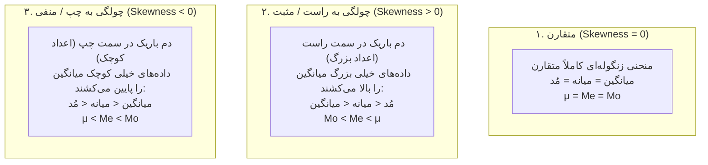

# درسنامه جامع و مفهومی مقدمات آمار، مقیاس‌ها و شاخص‌های آماری

> [!abstract] شناسنامه کنکوری و اهداف آموزشی
> - **بودجه‌بندی سالانه:** ۱ تا ۳ تست قطعی در هر دوره کنکور ارشد مدیریت (در سال ۱۴۰۴: ۳ تست مستقیم؛ معادل ۱۴.۱٪ کل سؤالات آمار).
> - **درجه دشواری:** روان، تحلیلی و فرمول‌محور با بازدهی ۱۰۰٪ تستی.
> - **پیش‌نیازها:** مرور ابزارهای ریاضی پایه (توان، مجموعه‌ها، مفهوم سیگما و مشتق/انتگرال مقدماتی).
> - **هدف درسنامه:** یادگیری عمیق، شهودی و خودآموز تمام مفاهیم، همراه با فلسفه پشت فرمول‌ها و ترجمه فارسی تک‌تک نمادها و روابط، تا هیچ نماد نامفهومی باقی نماند و حل تست‌ها بدون نیاز به ماشین‌حساب به یک بازی منطقی تبدیل شود.

---

## نقشه مفهومی درسنامه

---

## ۰. یادآوری ابزارهای ریاضی پایه مورد نیاز آمار

برای حل مسائل آمار بدون ماشین‌حساب و درک صحیح روابط، ابتدا ابزارهای جبری را با منطق ساده مرور می‌کنیم:

### ۰.۱. نماد سیگما ($\sum$) و قوانین جمع متوالی
علامت سیگما ($\sum$) یعنی جمع کردن اعضا پشت سر هم.
- **نمادگذاری:** $\sum_{i=1}^n X_i$ یعنی داده شماره ۱ تا داده شماره $n$ را با هم جمع کن:
  $$\sum_{i=1}^n X_i = X_1 + X_2 + \dots + X_n$$
- **قانون جمع یک عدد ثابت ($c$):** اگر یک عدد ثابت مانند $c$ را $n$ بار با خودش جمع کنیم، حاصل ضرب $n$ در $c$ می‌شود:
  $$\sum_{i=1}^n c = \underbrace{c + c + \dots + c}_{n \text{ بار}} = n \times c$$
  *معنای مفهومی:* اگر ۱۰ کارمند هر کدام ۵ میلیون تومان پاداش ثابت بگیرند، کل پاداش پرداختی برابر $10 \times 5 = 50$ میلیون تومان است.
- **قانون ضریب ثابت:** عدد ثابت ضرب‌شده در متغیر می‌تواند از سیگما بیرون بیاید:
  $$\sum_{i=1}^n (c \cdot X_i) = c \sum_{i=1}^n X_i$$

---

### ۰.۲. توان، رادیکال و ساده‌سازی کسری
- **ضرب با پایه‌های یکسان:** وقتی پایه‌ها یکی است، توان‌ها جمع می‌شوند:
  $$a^n \times a^m = a^{n+m} \quad \longrightarrow \quad 7^2 \times 7^3 = 7^{2+3} = 7^5$$
- **توان منفی:** توان منفی کسر را معکوس می‌کند (صورت و مخرج جابه‌جا می‌شوند):
  $$a^{-n} = \frac{1}{a^n} \quad \longrightarrow \quad 2^{-5} = \frac{1}{2^5} = \frac{1}{32}$$
  $$\left(\frac{a}{b}\right)^{-n} = \left(\frac{b}{a}\right)^n = \frac{b^n}{a^n} \quad \longrightarrow \quad \left(\frac{2}{3}\right)^{-4} = \left(\frac{3}{2}\right)^4 = \frac{3^4}{2^4} = \frac{81}{16}$$
- **ارتباط توان کسری و رادیکال:** توان صورت کسر، توان زیر رادیکال است و مخرج کسر، فرجه رادیکال:
  $$\sqrt[n]{b} = b^{\frac{1}{n}} \quad \longrightarrow \quad \sqrt[5]{32} = 32^{\frac{1}{5}} = (2^5)^{\frac{1}{5}} = 2^{5 \times \frac{1}{5}} = 2^1 = 2$$

---

### ۰.۳. فاکتوریل ($n!$) و اولویت محاسبات
- **فاکتوریل:** ضرب شمارش معکوس عدد طبیعی تا عدد ۱:
  $$n! = n \times (n-1) \times (n-2) \times \dots \times 2 \times 1$$
  - مقادیر پرکاربرد کنکور: $0! = 1$ ، $1! = 1$ ، $2! = 2$ ، $3! = 6$ ، $4! = 24$ ، $5! = 120$ ، $6! = 720$.
- **اولویت اعمال ریاضی:**
  1. اول پرانتز و کروشه باز و بسته
  2. توان و رادیکال
  3. ضرب و تقسیم
  4. جمع و تفریق

---

### ۰.۴. قدر مطلق ($\lvert X \rvert$)
- **فلسفه و مفهوم:** قدر مطلق یعنی فاصله فیزیکی عدد از مبدأ صفر روی محور اعداد. چون فاصله نمی‌تواند منفی باشد، خروجی قدر مطلق همیشه مثبت یا صفر است:
  $$\lvert -8 \rvert = 8 \quad , \quad \lvert +8 \rvert = 8 \quad , \quad \lvert 0 \rvert = 0$$

---

### ۰.۵. مشتق و انتگرال در حد کاربرد آمار
- **مشتق:** سرعت تغییرات یا شیب خط مماس بر نمودار تابع.
  - رابطه کلی: توان می‌آید پشت متغیر و یکی از توان کم می‌شود:
    $$\frac{d}{dx}(X^n) = n X^{n-1} \quad \longrightarrow \quad \frac{d}{dx}(3x^3 + 6x + 1) = 9x^2 + 6$$
- **انتگرال:** فرآیند برعکس مشتق و محاسبه مساحت سطح زیر منحنی (در توابع چگالی احتمال پیوسته مساحت کل باید برابر ۱ شود):
  $$\int X^n \, dx = \frac{X^{n+1}}{n+1} \quad (n \neq -1)$$
  $$\int \frac{1}{X} \, dx = \ln \lvert X \rvert \quad (n = -1)$$
  $$\int_1^2 (x^{-1} + 3) \, dx = \left[ \ln x + 3x \right]_1^2 = (\ln 2 + 6) - (\ln 1 + 3) = \ln 2 + 3$$

---

### ۰.۶. نظریه مجموعه‌ها و جبر پیشامدها
در تحلیل آماری و مبحث احتمال، داده‌ها و پیشامدها در قالب مجموعه‌ها دسته‌بندی می‌شوند:
- **متمم ($A'$ یا $A^c$):** هر چیزی در کل جامعه که عضو $A$ نباشد.
- **اشتراک ($A \cap B$):** اعضایی که هم‌زمان در هر دو دسته هستند (پیشامد مشترک).
- **اجتماع ($A \cup B$):** اعضایی که حداقل در یکی از دو دسته حضور دارند:
  $$n(A \cup B) = n(A) + n(B) - n(A \cap B)$$
  *فلسفه فرمول:* چون اشتراک یک بار در $A$ و یک بار در $B$ شمرده شده، باید یک بار کم شود تا دوبار محاسبه نشود.
- **تفاضل متقارن ($A \ \Delta \ B$):** اعضایی که منحصراً در $A$ یا منحصراً در $B$ هستند (اشتراک حذف می‌شود):
  $$A \ \Delta \ B = (A - B) \cup (B - A) = (A \cup B) - (A \cap B)$$

---

## ۱. تعاریف بنیادین و مقیاس‌های چهارگانه اندازه‌گیری

### ۱.۱. مفاهیم پایه
- **جامعه آماری (Population):** کل مجموعه از افراد یا اشیایی که ویژگی مشترکی دارند و می‌خواهیم درباره آن‌ها نظر دهیم. اندازه جامعه با حرف بزرگ $N$ نمایش داده می‌شود.
- **نمونه آماری (Sample):** بخش کوچکتری از جامعه که به صورت تصادفی و نماینده واقعی انتخاب می‌شود تا با مطالعه آن، ویژگی‌های کل جامعه را تخمین بزنیم. تعداد نمونه با حرف کوچک $n$ نشان داده می‌شود.
- **پارامتر در برابر آماره:**
  - **پارامتر (Parameter):** شاخصی عددی که برای کل **جامعه** محاسبه می‌شود (مانند میانگین جامعه $\mu$ یا انحراف معیار جامعه $\sigma$). معمولاً با حروف یونانی نمایش داده می‌شود.
  - **آماره (Statistic):** شاخصی عددی که از روی داده‌های **نمونه** به دست می‌آید (مانند میانگین نمونه $\bar{X}$ یا انحراف معیار نمونه $S$). با حروف انگلیسی نمایش داده می‌شود.
- **آمار توصیفی در برابر آمار استنباطی:**
  - *توصیفی:* خلاصه‌سازی، جدول‌بندی، رسم نمودار و گزارش داده‌های موجود بدون ادعای تعمیم به کل جامعه.
  - *استنباطی:* نتیجه‌گیری علمی و تخمین ویژگی‌های جامعه از روی نمونه با استفاده از علم احتمال.

---

### ۱.۲. مقیاس‌های چهارگانه سنجش (مقیاس‌های استیونز)

داده‌های آماری از نظر دقت و میزان اطلاعاتی که حمل می‌کنند به ۴ سطح تقسیم می‌شوند. هر سطح بالاتر، تمام امکانات سطوح قبلی را در خود دارد:

#### ۱. مقیاس اسمی (Nominal Scale)
- **فلسفه وجودی:** فقط برای تفکیک، برچسب زدن و دسته‌بندی افراد یا اشیاء است. عددها هیچ ارزش ریاضی ندارند.
- **عملیات مجاز ریاضی:** تنها شمارش تعداد (فراوانی) و پیدا کردن دسته‌ای که بیشترین تکرار را دارد (مُد یا نما). جمع و ضرب و میانگین کاملاً بی‌معنی است.
- **مثال‌های ملموس:** شماره پیراهن بازیکنان فوتبال (شماره ۹ از شماره ۴ بهتر یا دوبرابر نیست!)، کد ملی، گروه خونی ($A, B, AB, O$)، جنسیت، نام استان محل تولد، شماره پلاک خودرو.

#### ۲. مقیاس ترتیبی یا رتبه‌ای (Ordinal Scale)
- **فلسفه وجودی:** علاوه بر نام‌گذاری، داده‌ها دارای ترتیب، اولویت و سلسله‌مراتب هستند؛ می‌توان گفت چه کسی جلوتر یا بالاتر است، اما فاصله بین رتبه‌ها برابر نیست.
- **شاخص‌های مناسب:** علاوه بر مُد، می‌توان **میانه** و **صدک‌ها** را محاسبه کرد.
- **مثال‌های ملموس:** مقاطع تحصیلی (دیپلم، کارشناسی، کارشناسی ارشد، دکتری)، رتبه‌های ورزشی (نفر اول، دوم، سوم در مسابقه دو)، درجات نظامی (ستوان، سروان، سرگرد)، طیف رضایت مشتری (خیلی ناراضی، ناراضی، خنثی، راضی، خیلی راضی). فاصله نفر اول تا دوم شاید ۱ صدم ثانیه باشد ولی فاصله نفر دوم تا سوم ۱۰ ثانیه باشد!

#### ۳. مقیاس فاصله‌ای (Interval Scale)
- **فلسفه وجودی:** علاوه بر رتبه‌بندی، فاصله بین اعداد مشخص و یکسان است (فاصله بین دمای ۱۰ تا ۲۰ دقیقاً برابر با فاصله بین ۲۰ تا ۳۰ درجه است). جمع و تفریق مجاز است.
- **نقطه ضعف بزرگ و دام طراح کنکور (صفر قراردادی):** این مقیاس **فاقد صفر مطلق** است. صفر در این مقیاس یعنی نقطه آغاز دلخواه بر اساس قرارداد، نه نابودی صفت!
  - *مثال طلایی:* دمای صفر درجه سانتی‌گراد به معنای بی‌آهنگ شدن کامل دما نیست، بلکه فقط دمای یخ زدن آب است. به همین علت نمی‌توان گفت دمای ۴۰ درجه سلسیوس، دو برابر گرم‌تر از ۲۰ درجه است!
- **شاخص مناسب:** میانگین حسابی و انحراف معیار.
- **مثال‌ها:** دمای سانتی‌گراد، دمای فارنهایت، سال تقویمی (سال صفر میلادی یا هجری قراردادی است)، نمره بهره هوشی ($IQ$).

#### ۴. مقیاس نسبتی یا نسبی (Ratio Scale)
- **فلسفه وجودی:** کامل‌ترین مقیاس سنجش است. تمام خواص ۳ مقیاس قبل را دارد به‌علاوه **صفر مطلق و واقعی**. در صفر نسبتی، صفت به طور کامل غایب است.
- **عملیات مجاز:** همه اعمال ریاضی از جمله ضرب و تقسیم و نسبت‌گیری کاملاً دارای معنای فیزیکی است (مثلاً ۲۰ کیلوگرم دقیقاً ۲ برابر ۱۰ کیلوگرم سنگین‌تر است).
- **شاخص مناسب:** تمام شاخص‌های مرکزی شامل میانگین حسابی، هندسی و هارمونیک.
- **مثال‌ها:** وزن، قد، سود خالص شرکت به تومان، تعداد خطاهای سرور، میزان فروش ماهانه، سرعت خودرو، دمای کلوین (صفر کلوین یعنی توقف کامل حرکت مولکول‌ها).

| مقیاس سنجش | خاصیت بنیادین | نوع نقطه صفر | عملیات مجاز ریاضی | شاخص مرکزی ایده‌آل | نمونه واقعی |
| :--- | :--- | :--- | :--- | :--- | :--- |
| **اسمی** | برچسب و کد | ندارد | فقط شمارش فراوانی ($=$ و $\neq$) | مُد (نما) | شماره پیراهن، گروه خونی |
| **ترتیبی** | ترتیب و اولویت | ندارد | مقایسه رتبه ($>$ و $<$) | میانه، چارک‌ها | سطح تحصیلات، رتبه کنکور |
| **فاصله‌ای** | فواصل عددی برابر | **قراردادی** (اعتباری) | جمع و تفریق ($+$ و $-$) | میانگین حسابی | دمای سانتی‌گراد، تاریخ |
| **نسبتی** | فواصل یکسان + صفر حقیقی | **صفر مطلق** | تمام اعمال ریاضی ($\times$ و $\div$) | میانگین‌های حسابی، هندسی، هارمونیک | وزن، درآمد، قد، مسافت |

---

## ۲. شاخص‌های سنجش مرکزیت داده‌ها (گرایش مرکزی)

هدف از شاخص مرکزی، پیدا کردن یک عدد نماینده است که مرکز ثقل یا نقطه تعادل مشاهدات را به ما نشان دهد:

### ۲.۱. میانگین حسابی ($\mu$ یا $\bar{X}$)
- **فلسفه و تعریف:** اگر تمام داده‌ها دارایی‌های خود را روی هم بریزند و مساوی بین همه تقسیم شود، سهم هر نفر چقدر خواهد بود؟
- **فرمول ریاضی:**
  $$\mu = \frac{\sum_{i=1}^N X_i}{N}$$
- **فرمول به زبان فارسی روان:**
  $$\text{میانگین حسابی} = \frac{\text{مجموع تمام داده‌ها}}{\text{تعداد کل داده‌ها}}$$

- **ویژگی‌های فوق‌العاده حیاتی میانگین حسابی در تست‌های کنکور:**
  1. **مجموع انحرافات داده‌ها از میانگین حسابی همیشه صفر مطلق است:**
     $$\sum_{i=1}^N (X_i - \mu) = 0$$
     *فرمول فارسی:* $\text{مجموع (تک‌تک داده‌ها منهای میانگین)} = ۰$  
     *فلسفه مفهومی:* میانگین دقیقاً مرکز ثقل اهرم است. داده‌های بزرگتر از میانگین (انحراف مثبت) دقیقاً اثر داده‌های کوچکتر از میانگین (انحراف منفی) را خنثی می‌کنند.  
     *شاه‌کلید تستی:* هرگاه در تستی صورت سوال نوشت $\sum (X_i - C) = 0$، معطل نکنید؛ عدد $C$ قطعاً همان میانگین حسابی داده‌هاست ($\mu = C$).
  
  2. **خاصیت کمینه‌سازی مجذور انحرافات:**
     $$\min \sum_{i=1}^N (X_i - a)^2 \iff a = \mu$$
     *فرمول فارسی:* $\text{مجموع توان دوم (داده‌ها منهای } a \text{)} \quad \text{زمانی به حداقل می‌رسد که } a \text{ برابر با میانگین باشد.}$  
     *فلسفه:* میانگین خطای مربعات را به حداقل می‌رساند (اساس روش حداقل مربعات در رگرسیون).

  3. **تغییرات خطی داده‌ها ($Y = aX + b$):**
     اگر تمام داده‌ها در عدد $a$ ضرب و با عدد $b$ جمع شوند، میانگین نیز دقیقاً در $a$ ضرب و با $b$ جمع می‌شود:
     $$\mu_Y = a \mu_X + b$$
     *مثال:* اگر حقوق تمام کارمندان ۲ برابر شود و ۱ میلیون تومان پاداش اضافه شود، میانگین حقوق شرکت نیز دقیقاً ۲ برابر به علاوه ۱ میلیون خواهد شد.

---

### ۲.۲. میانگین هندسی ($\mu_G$ یا Geometric Mean)
- **فلسفه و کاربرد:** برای داده‌هایی که ماهیت **نرخ رشد، سود مرکب، تورم چندساله و نسبت‌های افزایشی** دارند، میانگین حسابی نتیجه غلط و دست‌بالا می‌دهد. در چنین مواردی باید از میانگین هندسی استفاده شود.
- **فرمول ریاضی:**
  $$\mu_G = \sqrt[N]{X_1 \times X_2 \times \dots \times X_N}$$
- **فرمول به زبان فارسی روان:**
  $$\text{میانگین هندسی} = \sqrt[\text{تعداد داده‌ها}]{\text{حاصل‌ضرب تمام داده‌ها در یکدیگر}}$$

- **مثال واقعی بازار:**  
  فرض کنید سرمایه شما در سال اول ۲ برابر ($X_1 = 2$)، در سال دوم ۴ برابر ($X_2 = 4$) و در سال سوم ۸ برابر ($X_3 = 8$) شده است. میانگین رشد سالانه چند برابر است؟
  $$\mu_G = \sqrt[3]{2 \times 4 \times 8} = \sqrt[3]{64} = 4 \text{ برابر در هر سال}$$
  *(اگر میانگین حسابی می‌گرفتید: $\frac{2+4+8}{3} = 4.66$ که کاملاً گمراه‌کننده بود؛ زیرا $1 \times 4 \times 4 \times 4 = 64$ سرمایه را می‌رساند).*

---

### ۲.۳. میانگین هارمونیک یا همساز ($\mu_H$ یا Harmonic Mean)
- **فلسفه و کاربرد:** هرگاه یک متغیر از **تقسیم دو کمیت بر یکدیگر** به دست آمده باشد (مانند سرعت خودرو که حاصل تقسیم مسافت بر زمان است: $\text{km/h}$، یا قیمت سهم که ریال بر تعداد است، یا بازدهی کاری به ازای هر ساعت) و اوزان بر اساس صورت کسر ثابت باشند، میانگین صحیح، میانگین هارمونیک است.
- **فرمول ریاضی ساده (بدون وزن):**
  $$\mu_H = \frac{N}{\sum_{i=1}^N \frac{1}{X_i}}$$
- **فرمول به زبان فارسی روان:**
  $$\text{میانگین هارمونیک} = \frac{\text{تعداد کل داده‌ها}}{\text{مجموع معکوس تک‌تک داده‌ها}}$$

- **فرمول حالت وزن‌دار (مسافت و سرعت):**
  $$\mu_H = \frac{\sum w_i}{\sum \frac{w_i}{X_i}} = \frac{\text{کل مسافت طی‌شده}}{\text{کل زمان سپری‌شده}}$$

- **مثال ملموس جاده‌ای:**  
  اگر فاصله تهران تا قزوین (۱۵۰ کیلومتر) را با سرعت $100 \text{ km/h}$ بروید و مسیر برگشت (همان ۱۵۰ کیلومتر) را به علت ترافیک با سرعت $50 \text{ km/h}$ برگردید، سرعت متوسط شما چقدر است؟
  - *اشتباه مهلک تستی:* میانگین حسابی بگیرید و بگویید: $\frac{100 + 50}{2} = 75$ (کاملاً غلط!).
  - *راهکار اصولی هارمونیک:*
    $$\mu_H = \frac{2}{\frac{1}{100} + \frac{1}{50}} = \frac{2}{\frac{1 + 2}{100}} = \frac{200}{3} \approx 66.6 \text{ km/h}$$
    *چرا؟* چون در مسیر برگشت زمان بیشتری با سرعت کم سپری شده است، پس سرعت کمتر، وزن زمانی بیشتری در کل سفر داشته است!

> [!important] نامساوی طلایی و مقایسه همیشگی میانگین‌ها
> برای هر مجموعه از داده‌های مثبت و نامساوی، همیشه و بدون استثناء ترتیب زیر برقرار است:
> $$\mu_H < \mu_G < \mu_X$$
> $$\text{میانگین هارمونیک} < \text{میانگین هندسی} < \text{میانگین حسابی}$$
> این سه میانگین تنها زمانی با هم دقیقاً مساوی می‌شوند که تمام داده‌های جامعه عددی یکسان باشند ($X_1 = X_2 = \dots = X_n$).

---

### ۲.۴. میانه ($Me$ یا Median)
- **فلسفه و مفهوم:** مقداری که پس از مرتب‌سازی داده‌ها از کوچک به بزرگ، دقیقاً در خط وسط می‌نشیند؛ به طوری که ۵۰٪ داده‌ها از آن کمتر و ۵۰٪ بیشتر هستند.
- **مزیت راهبردی:** **مقاومت در برابر داده‌های پرت (Outliers).** اگر در جمعی از دانشجویان با درآمد ماهانه ۱۰ میلیون تومان، یک میلیاردر با درآمد ۱۰ میلیارد تومان بنشیند، میانگین حسابی به صدها میلیون می‌رسد و تصویر جامعه را مخدوش می‌کند؛ اما میانه تکان نمی‌خورد و همان ۱۰ میلیون باقی می‌ماند!
- **روش تعیین در داده‌های منفرد:**
  - اگر تعداد $N$ فرد باشد: داده رتبه $\frac{N+1}{2}$.
  - اگر تعداد $N$ زوج باشد: میانگین دو داده وسطی (رتبه‌های $\frac{N}{2}$ و $\frac{N}{2} + 1$).

- **خاصیت کمینه‌سازی قدر مطلق (تله و شکار تست کنکور):**
  مجموع فواصل مطلق داده‌ها از یک عدد فرضی $a$، زمانی حداقل مقدار خود را دارد که $a$ برابر با **میانه** انتخاب شود:
  $$\min \sum_{i=1}^N \lvert X_i - a \rvert \iff a = Me$$
  *فرمول فارسی:* $\text{مجموع قدر مطلق (فاصله داده‌ها از } a \text{)} \quad \text{زمانی مینیمم است که } a = \text{میانه باشد.}$

---

### ۲.۵. میانگین پیراسته (Trimmed Mean)
- **فلسفه:** شاخصی ترکیبی که مزیت میانگین حسابی (استفاده از مقادیر عددی) را با مزیت میانه (مقاومت در برابر خطاهای ثبتی و ارقام پرت) جمع می‌کند.
- **روش محاسبه:** درصد مشخصی از داده‌های بسیار کوچک و بسیار بزرگ (مثلاً ۱۰٪ از پایین و ۱۰٪ از بالا) بریده و دور ریخته می‌شوند و از داده‌های باقیمانده، میانگین حسابی گرفته می‌شود.

---

### ۲.۶. مُد یا نما ($Mo$ یا Mode)
- **فلسفه و مفهوم:** داده‌ای که بیشترین تکرار (بزرگترین فراوانی) را دارد.
- **ویژگی‌ها:**
  - تنها شاخص مرکزی است که برای متغیرهای مقیاس اسمی (مانند پرفروش‌ترین رنگ خودرو یا شایع‌ترین گروه خونی) قابل استفاده است.
  - یک جامعه ممکن است تک‌مُدی، دومُدی، یا چندمُدی باشد.
  - اگر فراوانی تمام داده‌ها با هم برابر باشد، جامعه اصلاً **فاقد مُد** است.

---

## ۳. شاخص‌های سنجش پراکندگی، موقعیت نسبی و ترکیب جوامع

چرا شاخص‌های تمرکز به تنهایی کافی نیستند؟ فرض کنید دو صندوق سرمایه‌گذاری هر دو سالانه میانگین سود ۲۰٪ تولید کنند. اما صندوق الف همیشه بین ۱۹٪ تا ۲۱٪ نوسان می‌کند، در حالی که صندوق ب یک سال منفی ۳۰٪ می‌شود و سال بعد مثبت ۷۰٪! برای سنجش این نوسانات و ریسک، به **شاخص‌های پراکندگی** نیاز داریم:

### ۳.۱. دامنه تغییرات ($R$) و انحراف متوسط ($MD$)
- **دامنه تغییرات ($R$):** ساده‌ترین شاخص پراکندگی؛ اختلاف بین بیشترین و کمترین مقدار:
  $$R = X_{\max} - X_{\min}$$
  $$\text{دامنه تغییرات} = \text{بزرگترین داده} - \text{کوچکترین داده}$$
  *ایراد:* فقط وابسته به دو داده مرزی است و از نحوه توزیع داده‌های میانی هیچ خبری نمی‌دهد.

- **انحراف متوسط از میانگین ($MD$ یا Mean Deviation):**
  میانگین فاصله‌های مثبت داده‌ها از میانگین حسابی:
  $$MD = \frac{\sum_{i=1}^N \lvert X_i - \mu \rvert}{N}$$
  $$\text{انحراف متوسط} = \frac{\text{مجموع فاصله‌های قدر مطلقی داده‌ها از میانگین}}{\text{تعداد کل داده‌ها}}$$

---

### ۳.۲. واریانس ($\sigma^2$) و انحراف معیار ($\sigma$)

- **واریانس ($\sigma^2$ یا Variance):**
  میانگین مجذور (توان دوم) انحراف داده‌ها از میانگین حسابی:
  $$\sigma^2 = \frac{\sum_{i=1}^N (X_i - \mu)^2}{N}$$
  $$\text{واریانس} = \frac{\text{مجموع توان دوم (فاصله هر داده از میانگین)}}{\text{تعداد داده‌ها}}$$

- **فرمول سریع و محاسباتی واریانس در کنکور (شاه‌فرمول حل سریع):**
  در حل تست‌ها تفریق تک‌تک داده‌ها از میانگین وقت‌گیر است؛ از رابطه جبری زیر استفاده می‌کنیم:
  $$\sigma^2 = \frac{\sum_{i=1}^N X_i^2}{N} - \mu^2$$
  $$\text{واریانس} = (\text{میانگین مربعات داده‌ها}) - (\text{مربع میانگین})$$

- **انحراف معیار ($\sigma$ یا Standard Deviation):**
  چون واحد واریانس توان دو است (مثلاً اگر داده قد به سانتیمتر باشد، واریانس سانتی‌مترمربع می‌شود و درک آن ملموس نیست)، از آن جذر می‌گیریم تا واحدش مجدداً هم‌جنس با خود داده‌ها شود:
  $$\sigma = \sqrt{\sigma^2}$$
  $$\text{انحراف معیار} = \sqrt{\text{واریانس}}$$

- **نیمه‌واریانس ($SV$ یا Semi-Variance):**
  در بازارهای مالی و ریسک سرمایه‌گذاری، نوسانات مثبت (سود بالاتر از انتظار) خطرناک نیستند؛ آنچه خطرآفرین است نوسانات منفی (سود کمتر از میانگین) است. نیمه‌واریانس فقط داده‌های زیر میانگین را محاسبه می‌کند:
  $$SV = \frac{\sum (X_i - \mu)^2}{k} \quad (\text{منحصراً برای داده‌هایی که } X_i < \mu \text{ هستند})$$

- **قانون اثر تبدیلات خطی بر شاخص‌های پراکندگی ($Y = aX + b$):**
  - **جمع با عدد ثابت ($b$):** اگر تمام داده‌ها با یک عدد ثابت جمع شوند، پراکندگی آن‌ها هیچ تغییری نمی‌کند (فاصله بین داده‌ها حفظ می‌شود). پس $b$ روی واریانس و انحراف معیار هیچ اثری ندارد.
  - **ضرب در ضریب ($a$):**
    $$\sigma_Y^2 = a^2 \cdot \sigma_X^2 \quad , \quad \sigma_Y = \lvert a \rvert \cdot \sigma_X$$
    *فرمول به زبان ساده:* واریانس در $a^2$ ضرب می‌شود؛ انحراف معیار در قدر مطلق $a$ ضرب می‌شود.

---

### ۳.۳. ضریب تغییرات ($CV$ یا Coefficient of Variation)
- **فلسفه و ضرورت وجودی:** فرض کنید سهام شرکت الف دارای انحراف معیار ۵ تومان و میانگین قیمت ۵۰ تومان است. سهام شرکت ب انحراف معیار ۵۰ تومان و میانگین ۵۰۰۰ تومان دارد. کدام سهم پرنوسان‌تر و پرریسک‌تر است؟  
  اگر فقط انحراف معیار را ببینید، می‌گویید شرکت ب (۵۰ بیشتر از ۵ است). اما نسبت به قیمت خودش، شرکت الف ۱۰٪ نوسان دارد و شرکت ب فقط ۱٪ نوسان! برای این مقایسه عادلانه از ضریب تغییرات استفاده می‌شود.
- **فرمول ریاضی:**
  $$CV = \frac{\sigma}{\mu} \quad \implies \quad CV\% = \frac{\sigma}{\mu} \times 100$$
  $$\text{ضریب تغییرات} = \frac{\text{انحراف معیار}}{\text{میانگین حسابی}}$$

- **خواص طلایی ضریب تغییرات:**
  1. شاخصی بدون بعد (بدون یکا) است.
  2. امکان مقایسه پراکندگی دو جامعه با واحدهای کاملاً متفاوت (مثلاً مقایسه نوسان وزن نوزاد به کیلوگرم با قد بزرگسالان به متر) را به ما می‌دهد.
  3. **تغییرات مقیاس ($Y = kX$):** اگر همه داده‌ها در عدد مثبت $k$ ضرب شوند، چون صورت کسر ($\sigma$) و مخرج کسر ($\mu$) هر دو در $k$ ضرب می‌شوند، $k$ ساده شده و **ضریب تغییرات هیچ تغییری نمی‌کند ($CV_Y = CV_X$).**

---

### ۳.۴. نمره استاندارد ($Z$ یا Z-Score)
- **فلسفه و تعریف:** فرض کنید در درس زبان نمره ۱۶ گرفته‌اید و در درس تئوری مدیریت نمره ۱۸. در کدام درس عملکرد بهتری نسبت به کل شرکت‌کنندگان داشته‌اید؟  
  اگر میانگین زبان ۱۰ و میانگین تئوری ۱۹ باشد، نمره ۱۶ زبان یک شاهکار بوده و نمره ۱۸ تئوری زیر میانگین جامعه! نمره $Z$ این موقعیت نسبی را مشخص می‌کند:
- **فرمول ریاضی:**
  $$Z_i = \frac{X_i - \mu}{\sigma}$$
  $$\text{نمره استاندارد } Z = \frac{\text{نمره خام فرد} - \text{میانگین کل جامعه}}{\text{انحراف معیار جامعه}}$$
- **تفسیر:**
  - $Z = 0$: یعنی نمره فرد دقیقاً روی میانگین جامعه نشسته است.
  - $Z = +2$: یعنی نمره فرد به اندازه ۲ انحراف معیار از میانگین بالاتر است.
  - $Z = -1.5$: یعنی نمره فرد ۱.۵ انحراف معیار زیر میانگین است.
  - **خواص ثابت نمره استاندارد:** میانگین تمام داده‌های استانداردشده همیشه **صفر** و انحراف معیار آن‌ها همیشه **۱** است:
    $$\mu_Z = 0 \quad , \quad \sigma_Z = 1$$

---

### ۳.۵. ترکیب جوامع آماری (مخلوط کردن داده‌های دو گروه)
اگر داده‌های دو کلاس مختلف را با هم ادغام کنیم:
- کلاس اول: $N_1$ دانشجو با میانگین $\mu_1$ و واریانس $\sigma_1^2$
- کلاس دوم: $N_2$ دانشجو با میانگین $\mu_2$ و واریانس $\sigma_2^2$

1. **میانگین کل جامعه جدید ($\mu_t$):** میانگین موزون وزنی:
   $$\mu_t = \frac{N_1 \mu_1 + N_2 \mu_2}{N_1 + N_2}$$
   $$\text{میانگین کل} = \frac{(\text{تعداد اول} \times \text{میانگین اول}) + (\text{تعداد دوم} \times \text{میانگین دوم})}{\text{مجموع کل افراد}}$$

2. **واریانس کل جامعه جدید ($\sigma_t^2$):** شامل دو مؤلفه (میانگین وزنی واریانس‌ها + انحراف میانگین‌های گروهی از میانگین کل):
   $$\sigma_t^2 = \frac{N_1 \sigma_1^2 + N_2 \sigma_2^2}{N_1 + N_2} + \frac{N_1 (\mu_1 - \mu_t)^2 + N_2 (\mu_2 - \mu_t)^2}{N_1 + N_2}$$
   $$\text{واریانس کل} = (\text{میانگین وزنی واریانس‌ها}) + (\text{میانگین وزنی مجذور انحراف میانگین‌ها از میانگین کل})$$
   *نکته تستی:* واریانس جامعه کل، همیشه از میانگین واریانس‌ها بزرگ‌تر است مگر آنکه میانگین دو کلاس دقیقاً با هم برابر باشد ($\mu_1 = \mu_2$).

---

## ۴. شاخص‌های سنجش شکل توزیع (چولگی و کشیدگی)

علاوه بر مرکز و پراکندگی، باید بدانیم نمودار توزیع چه شکلی دارد: آیا متقارن است یا به یک سمت کشیده شده؟ آیا نوک‌تیز است یا پخ؟

### ۴.۱. ضریب چولگی (Skewness یا کجی منحنی)
چولگی نشان می‌دهد که دم بلند داده‌ها به کدام سمت کشیده شده است:

- **تحلیل مفهومی رفتار شاخص‌ها در چولگی مثبت (راست):**
  - **مُد ($Mo$)** روی بلندترین قله می‌نشیند (بیشترین تکرار).
  - **میانه ($Me$)** وسط مساحت را نگه می‌دارد (مقاوم است).
  - **میانگین حسابی ($\mu$)** به سمت چند داده نجومی و بزرگ کشیده شده و از همه بزرگتر می‌شود:
    $$\mu > Me > Mo \quad \text{یا به ترتیب صعودی: } Mo < Me < \mu$$
  - اگر میانگین هندسی هم حضور داشته باشد:
    $$\mu_X > \mu_G > Me > Mo$$

- **تحلیل مفهومی رفتار شاخص‌ها در چولگی منفی (چپ):**
  - داده‌های بسیار کوچک میانگین را پایین می‌کشند:
    $$\mu < Me < Mo \quad \text{یا به ترتیب صعودی: } \mu < Me < Mo$$

- **فرمول‌های محاسبه چولگی در تست‌ها:**
  1. **فرمول دوم پیرسون ($Sk_2$ - محبوب‌ترین فرمول طراحان):**
     $$Sk_2 = \frac{3(\mu - Me)}{\sigma}$$
     $$\text{چولگی دوم پیرسون} = \frac{۳ \times (\text{میانگین حسابی} - \text{میانه})}{\text{انحراف معیار}}$$
     *قانون طلایی:* علامت چولگی مستقیماً از تفاضل $(\mu - Me)$ به دست می‌آید! اگر میانگین بزرگتر از میانه باشد، چولگی قطعاً مثبت است.

  2. **فرمول اول پیرسون ($Sk_1$):**
     $$Sk_1 = \frac{\mu - Mo}{\sigma} = \frac{\text{میانگین} - \text{مُد}}{\text{انحراف معیار}}$$

  3. **چولگی گشتاوری ($\alpha_3$):** گشتاور سوم استانداردشده:
     $$\alpha_3 = \frac{\frac{\sum (X_i - \mu)^3}{N}}{\sigma^3} = \frac{\text{میانگین مکعب انحرافات}}{\text{انحراف معیار به توان ۳}}$$

---

### ۴.۲. شاخص کشیدگی (Kurtosis یا میزان نوک‌تیزی منحنی)
کشیدگی اندازه می‌گیرد که تمرکز داده‌ها در قله مرکزی چقدر تیز یا پهن است:
- **کشیدگی گشتاوری ($\alpha_4$):** گشتاور چهارم استانداردشده:
  $$\alpha_4 = \frac{\frac{\sum_{i=1}^N (X_i - \mu)^4}{N}}{\sigma^4} = \frac{\text{میانگین توان چهارم انحرافات}}{(\text{انحراف معیار})^4}$$
- **ضریب کشیدگی نسبی ($E$):**
  چون کشیدگی توزیع نرمال استاندارد دقیقاً عدد ۳ است ($\alpha_4 = 3$)، آن را مبنا قرار می‌دهیم و از ۳ کم می‌کنیم:
  $$E = \alpha_4 - 3$$
  $$\text{ضریب کشیدگی مازاد} = \text{کشیدگی گشتاوری} - ۳$$

- **تحلیل سه حالت کشیدگی:**
  1. **کشیدگی نرمال یا متوسط ($E = 0 \iff \alpha_4 = 3$):** انحنا و نوک قله استاندارد مانند توزیع نرمال است (مزوکورتیک).
  2. **کشیده و نوک‌تیز ($E > 0 \iff \alpha_4 > 3$):** داده‌ها در مرکز به شدت فشرده و نوک قله بسیار تیز است و دم‌ها امتداد بلندتری دارند (لپتوکورتیک).
  3. **پخ و فلات‌مانند ($E < 0 \iff \alpha_4 < 3$):** قله کوتاه، مسطح و شبیه تپه هموار است (پلاتیکورتیک).

---

## ۵. کپسول مرور سریع و فرمول‌های طلایی

| ردیف | نام مفهوم یا رابطه | فرمول ریاضی | فرمول و بیان سلیس فارسی | تکنیک و پیام آزمونی در ۳۰ ثانیه |
| :---: | :--- | :--- | :--- | :--- |
| ۱ | **نامساوی میانگین‌ها** | $\mu_H \le \mu_G \le \mu_X$ | $\text{هارمونیک} \le \text{هندسی} \le \text{حسابی}$ | همیشه میانگین حسابی بزرگ‌ترین و هارمونیک کوچک‌ترین است. |
| ۲ | **چولگی پیرسون** | $Sk = \frac{3(\mu - Me)}{\sigma}$ | $\frac{۳ \times (\text{میانگین} - \text{میانه})}{\text{انحراف معیار}}$ | اگر میانگین بزرگتر از میانه باشد $\rightarrow$ چولگی مثبت است. |
| ۳ | **کمینه‌سازی میانه** | $\min \sum \lvert X_i - a \rvert \iff a = Me$ | $\text{حداقل مجموع فاصله قدر مطلقی} \iff \text{میانه}$ | هر جا سیگما با قدر مطلق دیدید و کمترین مقدار را خواست $\rightarrow$ جواب میانه است. |
| ۴ | **کمینه‌سازی میانگین** | $\min \sum (X_i - a)^2 \iff a = \mu$ | $\text{حداقل مجموع توان دو انحرافات} \iff \text{میانگین}$ | هر جا سیگما با توان ۲ دیدید و کمترین مقدار را خواست $\rightarrow$ جواب میانگین حسابی است. |
| ۵ | **مجموع انحرافات** | $\sum (X_i - \mu) = 0$ | $\text{مجموع فاصله‌های خالص از میانگین} = ۰$ | اگر دیدید $\sum(X_i - C) = 0$ شده، بلافاصله نتیجه بگیرید $C$ همان میانگین است. |
| ۶ | **فرمول تستی واریانس** | $\sigma^2 = \frac{\sum X_i^2}{N} - \mu^2$ | $(\text{میانگین مربعات}) - (\text{مربع میانگین})$ | بدون تفریق داده‌ها، میانگین مجذورات را منهای مجذور میانگین کنید. |
| ۷ | **ضریب تغییرات** | $CV = \frac{\sigma}{\mu}$ | $\frac{\text{انحراف معیار}}{\text{میانگین}}$ | شاخص بدون بعد برای مقایسه ریسک؛ ضرب داده‌ها در عدد ثابت تغییری در آن نمی‌دهد. |
| ۸ | **ضریب کشیدگی** | $E = \alpha_4 - 3$ | $(\text{کشیدگی گشتاوری}) - ۳$ | نرمال مبنای ۳ دارد؛ همیشه منهای ۳ را لحاظ کنید. |
| ۹ | **نمره استاندارد Z** | $Z = \frac{X - \mu}{\sigma}$ | $\frac{\text{داده} - \text{میانگین}}{\text{انحراف معیار}}$ | موقعیت نسبی داده؛ میانگین آن همواره صفر و انحراف معیار آن ۱ است. |

---

## ۶. پرسش‌های بازیابی فعال ذهن (تست خودآموز)

> [!question]- ۱. چرا در مقیاس فاصله‌ای (مانند دمای سلسیوس) نمی‌توان گفت دمای ۴۰ درجه، دقیقاً دو برابر گرم‌تر از دمای ۲۰ درجه است؟
> **پاسخ تحلیلی:** زیرا نقطه صفر سلسیوس یک صفر **قراردادی** (نقطه انجماد آب) است نه صفر مطلق فیزیکی. اگر همین دماها را به کلوین (مقیاس نسبتی با صفر واقعی) ببریم:
> - دمای ۲۰ درجه سلسیوس برابر $20 + 273.15 = 293.15$ کلوین است.
> - دمای ۴۰ درجه سلسیوس برابر $40 + 273.15 = 313.15$ کلوین است.
> نسبت این دو برابر ۱.۰۶۸ است، نه ۲! بنابراین نسبت‌گیری فقط در مقیاس نسبتی مجاز است.

> [!question]- ۲. اگر داده‌های آماری همگی در عدد ۳ ضرب و با ۵ جمع شوند ($Y = 3X + 5$)، واریانس، انحراف معیار و ضریب تغییرات چه تغییری می‌کنند؟
> **پاسخ تحلیلی:**
> - عدد ثابت ۵ روی پراکندگی هیچ اثری ندارد (فقط نمودار را ۵ واحد به جلو هل می‌دهد بدون تغییر فاصله داده‌ها).
> - ضریب ۳ اثر خود را می‌گذارد:
>   - واریانس جدید: $\sigma_Y^2 = 3^2 \times \sigma_X^2 = 9\sigma_X^2$ (واریانس ۹ برابر می‌شود).
>   - انحراف معیار جدید: $\sigma_Y = \lvert 3 \rvert \times \sigma_X = 3\sigma_X$ (انحراف معیار ۳ برابر می‌شود).
>   - ضریب تغییرات: چون میانگین جدید $\mu_Y = 3\mu_X + 5$ است، نسبت $\frac{3\sigma_X}{3\mu_X + 5}$ دستخوش تغییر می‌شود (اگر عدد ۵ نبود، ۳ از صورت و مخرج خط می‌خورد و ثابت می‌ماند).

> [!question]- ۳. در یک شرکت فناوری، میانگین حقوق کارمندان ۴۵ میلیون تومان و میانه حقوق ۳۰ میلیون تومان است. توزیع حقوق چه چولگی دارد و این اختلاف به چه معناست؟
> **پاسخ تحلیلی:**
> چون میانگین از میانه بزرگتر است ($\mu > Me \implies 45 > 30$)، چولگی به سمت **راست (مثبت)** است.
> این پدیده نشان می‌دهد که اکثر کارمندان حقوقی نزدیک به ۳۰ میلیون تومان می‌گیرند، اما چند مدیر ارشد با درآمدهای نجومی (مثلاً ۲۰۰ تا ۳۰۰ میلیون) در سمت راست حضور دارند که میانگین کل شرکت را بالا کشیده‌اند.
