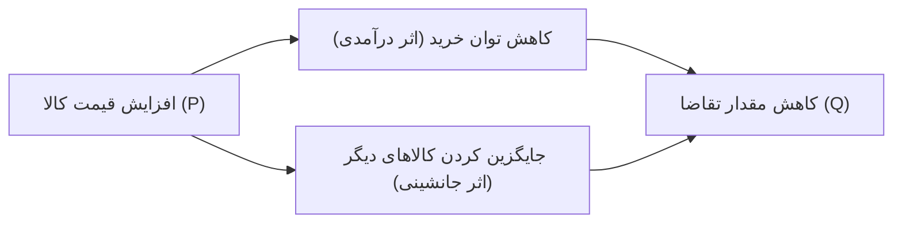
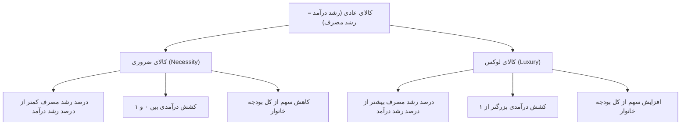
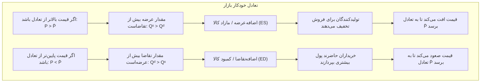

# فصل اول: تقاضا، عرضه و تعادل بازار (درسنامه جامع، مفهومی و خودآموز)

> [!abstract] شناسنامه کنکوری و نقشه راهبردی فصل
> - **جایگاه در کنکور سراسری کارشناسی ارشد مدیریت:** سالانه بین ۱ تا ۲ سؤال مستقیم و زیربنای مفهومی ۱۰۰٪ تست‌های فصول بعدی (کشش، بازار رقابت کامل و انحصار کامل).
> - **درجه اهمیت استراتژیک:** 🥉 **الفبای زرین و زیربنای معماری اقتصاد خرد**؛ هرگونه ضعف در فهم شیب‌ها، جابه‌جایی منحنی‌ها، مازاد رفاه و اثر مالیات، مانع تسلط بر شاه‌فصل‌های کشش و بازارها خواهد شد.
> - **مراجع تطبیق داده‌شده:** کتاب مرجع پوران پژوهش دکتر محسن نظری (صفحات ۸ تا ۱۹ الکترونیکی / ۱ تا ۱۲ چاپی) و کتاب بانک تست و نکات فوکا (صفحات ۹ تا ۲۰ الکترونیکی / ۱۱ تا ۲۲ چاپی).
> - **هدف آموزشی:** یادگیری عمیق، تصویری و بدون نیاز به حفظ طوطی‌وار فرمول‌ها؛ شناخت دقیق مکانیزم قیمت، رفتار مصرف‌کننده و تولیدکننده، مازادهای رفاهی، پایداری تعادل (والراس و مارشال) و مداخلات دولت (قیمت‌گذاری و مالیات).

---

## 🧭 فهرست موضوعی درسنامه
1. **شالوده بنیادین تقاضا:** تمایز نیاز و تقاضا، تابع تقاضا، قانون شیب منفی و تابع معکوس تقاضا
2. **کالبدشکافی تغییرات تقاضا:** تمایز حیاتی حرکت روی منحنی و انتقال منحنی تقاضا
3. **طبقه‌بندی کالاها:** کالای عادی، پست و مستقل بر اساس درآمد (منحنی‌های انجل)
4. **روابط متقابل کالاها:** جانشین، مکمل و مستقل بر اساس قیمت سایر کالاها
5. **حالات خاص و استثنایی تقاضا:** تقاضای عمودی، افقی و کالای گیفن با شیب مثبت
6. **شالوده بنیادین عرضه:** تعریف اقتصادی، تابع عرضه، قانون شیب مثبت و تابع معکوس عرضه
7. **کالبدشکافی تغییرات عرضه:** حرکت روی منحنی در برابر انتقال کل منحنی عرضه
8. **حالات خاص و استثنایی عرضه:** عرضه عمودی کوتاه‌مدت، افقی بلندمدت و منحنی عرضه کار به عقب برگشته
9. **تعادل بازار و مکانیزم خودکار قیمت‌ها:** شرط تعادل، اضافه تقاضا، اضافه عرضه و اثر جابه‌جایی‌های همزمان
10. **مازاد رفاه اقتصادی:** مازاد مصرف‌کننده ($CS$) و مازاد تولیدکننده ($PS$) به روش هندسی و انتگرالی
11. **نظریه پایداری تعادل؛ والراس در برابر مارشال:** متغیر تنظیم قیمت در برابر مقدار و ماتریس ۶ حالته شیب‌ها
12. **مداخلات دستوری دولت در قیمت‌ها:** تحلیل سقف قیمت ($P_c$)، صف، بازار سیاه و کف قیمت ($P_f$) و خرید تضمینی
13. **مالیات بر واحد و یارانه:** انتقال منحنی عرضه، سهم مالیاتی خریدار و فروشنده بر پایه شیب و کشش و زیان مرده رفاهی ($DWL$)
14. **استخراج تقاضا و عرضه کل بازار:** تجمیع افقی توابع انفرادی و تحلیل نقاط شکستگی
15. **کپسول نکات طلایی و کالبدشکافی تست‌های دام‌دار کنکور**

---

## ۱. شالوده بنیادین تقاضا

### ۱.۱. تمایز کلیدی نیاز و تقاضا
در زبان روزمره، مردم کلمات نیاز، خواسته و تقاضا را به جای هم به کار می‌برند؛ اما در علم اقتصاد خرد، **تقاضا** یک مفهوم کاملاً تخصصی و عملیاتی است:
- **نیاز:** یک کمبود فیزیولوژیک یا روانی است (مثلاً همه ما نیاز به حمل‌ونقل سریع یا هلیکوپتر شخصی داریم!).
- **تقاضا:** تمایل به خرید یک کالا است که **حتماً با قدرت پرداخت مالی (پول نقد) پشتیبانی شده باشد**.
اگر شما تمایل شدید به خرید یک خودروی آخرین مدل داشته باشید اما پول کافی برای خرید آن را نداشته باشید، از نظر اقتصاددانان شما **هیچ تقاضایی** در بازار آن خودرو ایجاد نکرده‌اید!

### ۱.۲. عوامل مؤثر بر تقاضای انفرادی (دسته‌بندی کمی و کیفی فوکا)
مقدار خرید یک کالا توسط یک فرد به عوامل متعددی بستگی دارد که در رفرنس فوکا به دو دسته تفکیک می‌شوند:
۱. **عوامل کمی (قابل اندازه‌گیری عددی مستقیم):** قیمت خود کالا ($P_x$)، درآمد مصرف‌کننده ($I$)، و قیمت سایر کالاهای مرتبط ($P_y$).
۲. **عوامل کیفی (غیرقابل اندازه‌گیری عددی مستقیم):** سلیقه و ترجیحات مصرف‌کننده ($T$)، مد، تبلیغات روانی و انتظارات روانی از آینده ($E$).

تابع ریاضی جامع تقاضا:
$$Q_x^d = F(P_x, I, P_y, A, E, T, \dots)$$

- متغیر $Q_x^d$: مقدار تقاضا از کالای $X$ در واحد زمان
- متغیر $P_x$: قیمت خود کالای $X$
- متغیر $I$: درآمد مصرف‌کننده
- متغیر $P_y$: قیمت سایر کالاهای مرتبط (جانشین یا مکمل)
- متغیر $A$: هزینه‌های تبلیغات و بازاریابی
- متغیر $E$: انتظارات مصرف‌کننده از قیمت‌ها و تورم در آینده
- متغیر $T$: سلیقه و ذائقه خریدار

### ۱.۳. تابع تقاضا و فرض حیاتی «سایر شرایط ثابت»
برای اینکه رفتار خریدار را به صورت علمی تحلیل کنیم، اقتصاددانان از فرض **ثابت ماندن سایر عوامل** استفاده می‌کنند؛ یعنی فرض می‌کنیم درآمد، سلیقه و قیمت سایر کالاها دست‌نخورده باقی بمانند و فقط **قیمت خود کالا** تغییر کند:

$$Q_x^d = f(P_x)$$

این رابطه را **تابع تقاضا** می‌نامند.

### ۱.۴. قانون تقاضا و شیب منفی
بین قیمت کالا ($P$) و مقدار تقاضای آن ($Q$) معمولاً یک **رابطه معکوس** وجود دارد: با افزایش قیمت کالا، مقدار تقاضا کاهش می‌یابد و با کاهش قیمت، مقدار تقاضا افزایش می‌یابد.
به همین دلیل، منحنی تقاضا همواره دارای **شیب منفی (نزولی)** است.



### ۱.۵. تابع معکوس تقاضا
در متون ریاضی، معمولاً متغیر وابسته در سمت چپ و متغیر مستقل در سمت راست قرار دارد:
$$Q_x^d = 10 - 2P_x$$
اما در رسم نمودارهای اقتصادی، به دلایل تاریخی که به آلفرد مارشال بازمی‌گردد، **قیمت ($P$) را روی محور عمودی** و **مقدار ($Q$) را روی محور افقی** رسم می‌کنیم!
اگر معادله فوق را بر حسب $P$ خلوت کنیم، **تابع معکوس تقاضا** به دست می‌آید:
$$2P_x = 10 - Q_x^d \implies P_x = 5 - \frac{1}{2}Q_x^d$$
- عدد ۵: عرض از مبدأ (حداکثر قیمتی که در آن تقاضا صفر می‌شود).
- ضریب منفی $\frac{1}{2}$: **شیب هندسی منحنی تقاضا روی نمودار** ($\frac{dP}{dQ} = -0.5$).

---

## ۲. کالبدشکافی تغییرات تقاضا: دام پرتکرار کنکور

یکی از پرتکرارترین تله‌های تستی کنکور ارشد، تمایز میان این دو عبارت است:

| بعد مقایسه | ۱. تغییر در «مقدار تقاضا» | ۲. تغییر در «تقاضا» |
|:--- |:--- |:--- |
| **عامل به وجود آورنده** | **منحصراً تغییر در قیمت خود کالا ($P_x$)** | **تغییر در هر عاملی به جز قیمت خود کالا** (درآمد، سلیقه، تبلیغات، قیمت سایر کالاها) |
| **نمایش هندسی** | **حرکت و لغزش روی همان منحنی تقاضای قبلی** (از یک نقطه به نقطه دیگر) | **انتقال و جابه‌جایی کامل منحنی تقاضا** به سمت راست یا چپ |
| **معنی افزایش** | با کاهش قیمت کالا، مقدار مصرف در راستای منحنی زیاد می‌شود. | در همان قیمت قبلی، خریداران خواهان مقدار بیشتری از کالا هستند (منحنی به راست/بالا شیفت می‌کند). |
| **معنی کاهش** | با افزایش قیمت کالا، مقدار مصرف روی منحنی کم می‌شود. | در همان قیمت قبلی، تمایل به خرید کم شده است (منحنی به چپ/پایین شیفت می‌کند). |

> ⚠️ **کپسول طلایی جهت‌ها در کنکور:** 
> - **انتقال به راست = انتقال به بالا = افزایش تقاضا** (به سمت بیرون) 
> - **انتقال به چپ = انتقال به پایین = کاهش تقاضا** (به سمت داخل)

---

## ۳. طبقه‌بندی کالاها بر اساس تغییر درآمد (منحنی‌های انجل)

اگر درآمد مصرف‌کننده ($I$) تغییر کند، منحنی تقاضا جابه‌جا می‌شود. بر اساس جهت این تغییر، کالاها به سه دسته تقسیم می‌شوند:

### ۳.۱. کالای عادی و تفکیک حیاتی «ضروری» در برابر «لوکس»

کالای عادی به هر کالایی گفته می‌شود که وقتی درآمد مصرف‌کننده ($I$) زیاد می‌شود، تقاضا و مصرف آن هم بیشتر شود؛ و برعکس، اگر درآمد افت کند، مصرفش کاهش یابد. یعنی رابطه بین درآمد و مقدار خرید **هم‌جهت (مستقیم)** است:

$$\frac{dQ_x^d}{dI} > 0$$

اما آیا مصرف تمام کالاهای عادی با یک شدت و به یک نسبت رشد می‌کند؟ قطعاً خیر! اینجاست که پای یک تفکیک سرنوشت‌ساز و فوق‌العاده کنکوری باز می‌شود: **کالای ضروری در برابر کالای لوکس**.



---

#### الف) کالای ضروری: چرایی شهودی و تحلیل رفتاری
- **شهود ملموس با متد فاینمن:** فرض کنید حقوق ماهانه شما از **۱۰ میلیون تومان** به **۳۰ میلیون تومان** برسد (یعنی **۲۰۰٪ رشد درآمد** یا سه برابر شدن حقوق!). آیا مصرف نان، پنیر، نمک، روغن مایع یا خمیردندان شما هم ۲۰۰٪ رشد می‌کند و ۳ برابر می‌شود؟! 
مسلماً نه! معده انسان گنجایش مشخصی دارد و نیازهای زیستی سقف دارند. شما اگر روزی ۱ قرص نان می‌خوردید، حالا نهایتاً ۱.۲ قرص نان می‌خورید یا کیفیت نان را ارتقا می‌دهید (مثلاً **۲۰٪ رشد مصرف**). 
نتیجه چیست؟ **درصد افزایش مصرف (۲۰٪) بسیار کمتر از درصد افزایش درآمد (۲۰۰٪) است.**
- **شرط کشش درآمدی ($e_I$):** 
 کشش درآمدی یعنی حساسیت درصد تغییر مقدار مصرف به درصد تغییر درآمد:
 $$e_I = \frac{\% \Delta Q}{\% \Delta I} = \frac{dQ}{dI} \times \frac{I}{Q}$$
 چون صورت کسر از مخرج کسر کوچکتر است، مقدار کشش همواره عددی **بین صفر و یک** خواهد بود:
 $$0 < e_I < 1$$
- **سرنوشت سهم از بودجه خانوار (قانون انگل):** 
 سهم هزینه این کالا از کل درآمد ($w = \frac{P \times Q}{I}$) با افزایش درآمد **کاهش می‌یابد**. خانواده‌های کم‌درآمد شاید ۴۰٪ تا ۵۰٪ از کل درآمدشان صرف خرید خوراک و نان پایه شود؛ اما یک فرد ثروتمند شاید کمتر از ۲٪ از درآمدش را خرج نان و نمک کند!
- **نمونه‌ها در دنیای واقعی:** نان، نمک، برنج پایه، آب و برق مصرفی منزل، شوینده‌های پایه، بنزین سهمیه‌ای روزمره.

---

#### ب) کالای لوکس و تجملاتی: چرایی شهودی و تحلیل رفتاری
- **شهود ملموس با متد فاینمن:** همان مثال حقوق را در نظر بگیرید. وقتی درآمد شما ۱۰ میلیون تومان بود، آیا به سفر خارجی، خرید ساعت مچی گران‌قیمت یا تعویض سالانه گوشی با پرچم‌دار آیفون فکر می‌کردید؟ اصلاً و ابداً (مصرف شما در حد صفر بود)! 
اما وقتی درآمد شما از ۱۰ به ۳۰ و سپس به ۱۰۰ میلیون تومان می‌رسد، ناگهان اقدام به خرید کنسول بازی، ثبت‌نام در تور مسافرتی و تعویض خودرو می‌کنید. مصرف این قبیل اقلام از صفر یا مقادیر ناچیز به ارقام چند برابری می‌رسد (مثلاً **۵۰۰٪ افزایش مصرف کالای لوکس** در ازای ۲۰۰٪ افزایش درآمد!). 
نتیجه چیست؟ **درصد افزایش مصرف (۵۰۰٪) به مراتب بیشتر از درصد افزایش درآمد (۲۰۰٪) است.**
- **شرط کشش درآمدی ($e_I$):** 
 چون صورت کسر ($\% \Delta Q$) از مخرج ($\% \Delta I$) بزرگتر است، کشش درآمدی همواره **اکیداً بزرگتر از یک** خواهد بود:
 $$e_I > 1$$
- **سرنوشت سهم از بودجه خانوار:** 
 با افزایش درآمد، سهم هزینه کالای لوکس از کل بودجه ($w = \frac{P \times Q}{I}$) **افزایش می‌یابد**. هر چه جامعه یا فرد ثروتمندتر شود، درصد بیشتری از حقوق ماهانه‌اش را صرف خدمات تفریحی، رستوران‌های شیک، سفرهای لوکس، مد و کالاهای برند می‌کند.
- **نمونه‌ها در دنیای واقعی:** خودروهای وارداتی و لوکس، تورهای گردشگری خارجی، جواهرات و زیورآلات طلا، گوشی‌های هوشمند پرچم‌دار، لباس‌های طراحی‌شده و برند مزونی.

---

#### ج) ماتریس مقایسه‌ای همه‌جانبه: ضروری در برابر لوکس

| شاخص مقایسه | کالای ضروری | کالای لوکس |
|:--- |:--- |:--- |
| **تعریف مفهومی** | کالای پایه برای بقا و گذران امور روزمره | کالای تجملاتی، رفاهی، تمایزبخش و ارتقای کیفیت زندگی |
| **رابطه درصد تغییرات** | درصد تغییر مصرف < درصد تغییر درآمد | درصد تغییر مصرف > درصد تغییر درآمد |
| **دامنه کشش درآمدی ($e_I$)** | $0 < e_I < 1$ | $e_I > 1$ |
| **سهم از بودجه خانوار با رشد درآمد** | **کاهش می‌یابد** (قانون انگل) | **افزایش می‌یابد** |
| **شکل هندسی منحنی انجل ($I$ عمودی, $Q$ افقی)** | به سمت محور درآمد ($I$) تحدب دارد (شیب افزایشی) | به سمت محور مقدار ($Q$) تحدب دارد (شیب کاهشی) |
| **عرض از مبدأ خط انجل مستقیم** | محور افقی ($Q$) را قطع می‌کند (عرض از مبدأ مثبت روی $Q$) | محور عمودی ($I$) را قطع می‌کند (عرض از مبدأ مثبت روی $I$) |

---

> [!danger] سه تله تستی پرتکرار طراحان کنکور ارشد
> ۱. **تله عادی بودن:** طراح می‌پرسد: «کالای لوکس کالای عادی است یا غیرعادی؟» **پاسخ:** کالای لوکس ۱۰۰٪ یک کالای عادی است! چون شرط عادی بودن فقط این است که کشش درآمدی مثبت باشد ($e_I > 0$). هم ضروری ($0 < e_I < 1$) و هم لوکس ($e_I > 1$) زیرمجموعه کالای عادی هستند.
> ۲. **تله سهم بودجه (قانون انگل):** طراح می‌پرسد: «اگر با افزایش درآمد، هزینه ریالی صرف‌شده برای نان افزایش یابد، آیا سهم آن از بودجه هم زیاد شده؟» **پاسخ خیر!** مبلغ ریالی شاید زیاد شود (چون نان باکیفیت‌تر خریدیم)، اما چون سرعت رشد درآمد بسیار بالاتر بوده، **نسبت و سهم نان به کل پول جیب شما قطعاً کمتر شده است**.
> ۳. **تله نسبی بودن کالا:** یک کالا ذاتاً و تا ابد لوکس یا ضروری نیست! یک کالا با تغییر سطح درآمد تغییر ماهیت می‌دهد. مثلاً یک خودروی معمولی ممکن است در درآمدهای بسیار پایین لوکس باشد؛ در طبقه متوسط ضروری شود؛ و برای میلیاردرها به یک **کالای پست** تبدیل گردد!

> [!question]- پرسش بازیابی فعال: چرا خط مستقیم انجلی که از مبدأ مختصات می‌گذرد نه لوکس است و نه ضروری؟
> اگر یک منحنی انجل خطی مستقیم باشد که از مبدأ مختصات ($0, 0$) بگذرد ($Q = c \cdot I$)، شیب آن ثابت و برابر $c$ است. در نتیجه کشش درآمدی آن در تمامی نقاط دقیقاً برابر یک است ($e_I = 1$). در این حالت، درصد افزایش مصرف دقیقاً با درصد افزایش درآمد برابر است و سهم کالا از بودجه خانوار در تمام سطوح درآمدی ثابت می‌ماند (مرز دقیق میان ضروری و لوکس).

---

### ۳.۲. کالای پست
کالایی است که با افزایش درآمد، مصرف‌کننده آن را کنار می‌گذارد و سراغ کالای باکیفیت‌تر می‌رود! یعنی رابطه بین درآمد و مصرف **معکوس (خلاف جهت)** است:
$$\frac{dQ_x^d}{dI} < 0$$
*مثال ملموس:* بلیط اتوبوس برون‌شهری در مقایسه با هواپیما، یا فست‌فودهای بی‌کیفیت خیابانی در مقایسه با غذای رستورانی مرغوب. وقتی درآمد دانشجویی فرد به درآمد یک مدیر ارشد ارتقا می‌یابد، مصرف فلافل و اتوبوس را کاهش می‌دهد!

> ⚠️ **تله فوق‌العاده تستی کنکور (تست ۹ فوکا): شیب منحنی انجل کالای گیفن چیست؟**
> کالای گیفن (Giffen Good) نوع خاص و افراطی از کالای پست است. بنابراین:
> - **در رابطه با قیمت کالا ($P$):** تقاضای آن شیب مثبت (صعودی) دارد.
> - **اما در رابطه با درآمد ($I$) و منحنی انجل:** مانند هر کالای پست دیگری، با افزایش درآمد تقاضای آن کم می‌شود؛ پس **منحنی انجل کالای گیفن دارای شیب منفی (نزولی)** است!

### ۳.۳. کالای مستقل از درآمد
کالایی که تغییر درآمد خریدار هیچ اثری بر مقدار تقاضای آن ندارد:
$$\frac{dQ_x^d}{dI} = 0$$
*مثال ملموس:* داروهای خاص که مصرف آن‌ها تابع بیماری است، نه پول توی جیب!

### ۳.۴. هندسه منحنی‌های انجل
منحنی انجل، رابطه بین **درآمد ($I$) روی محور عمودی** و **مقدار مصرف کالا ($Q$) روی محور افقی** را نشان می‌دهد:

| نوع کالا | وضعیت کشش درآمدی ($e_I$) | شکل هندسی منحنی انجل (محور عمودی $I$ و افقی $Q$) | رفتار منحنی تقاضا با افزایش درآمد |
|:--- |:---: |:--- |:--- |
| **کالای ضروری** | $0 < e_I < 1$ | **صعودی با تقعر به سمت محور عمودی ($I$)** (با رشد درآمد، مصرف به آرامی بالا می‌رود) | انتقال به سمت **راست** |
| **کالای لوکس** | $e_I > 1$ | **صعودی با تقعر به سمت محور افقی ($Q$)** (با رشد درآمد، مصرف با جهش بالا می‌رود) | انتقال به سمت **راست** |
| **کالای پست** | $e_I < 0$ | **نزولی (شیب منفی)** (با رشد درآمد، مقدار مصرف کاهش می‌یابد) | انتقال به سمت **چپ** |
| **مستقل از درآمد** | $e_I = 0$ | **خط کاملاً عمودی** (درآمد هر چقدر تغییر کند، مقدار مصرف ثابت است) | **بدون تغییر** |

---

## ۴. روابط متقابل کالاها بر اساس قیمت کالای مرتبط ($P_y$)

وقتی قیمت کالای دیگری مانند $Y$ تغییر کند، بر تقاضای کالای $X$ اثر می‌گذارد:

### ۴.۱. کالاهای جانشین
کالاهایی که می‌توانند در مصرف جایگزین یکدیگر شوند و نیاز مشابهی را برطرف کنند (مثل چای و قهوه، پپسی و کوکاکولا، سفر با اسنپ و سفر با تپسی):
- اگر قیمت گوشت گوسفند ($P_y$) افزایش یابد، مردم کمتر گوشت گوسفند می‌خرند و به جای آن تقاضا برای گوشت مرغ ($Q_x$) را زیاد می‌کنند.
- پس بین قیمت کالای $Y$ و تقاضای کالای جانشین $X$ رابطه **هم‌جهت (مستقیم)** برقرار است:
$$\frac{dQ_x^d}{dP_y} > 0$$
- **نتیجه انتقال:** افزایش قیمت کالای جانشین $\rightarrow$ انتقال تقاضای کالای $X$ به **راست**.

### ۴.۲. کالاهای مکمل
کالاهایی که برای ارضای یک نیاز باید **همراه با یکدیگر** مصرف شوند (مثل قند و چای، بنزین و خودرو، کنسول بازی و دسته بازی):
- اگر قیمت بنزین ($P_y$) به شدت گران شود، تمایل مردم به خرید و استفاده از خودروهای پرمصرف ($Q_x$) کاهش می‌یابد.
- پس رابطه بین قیمت کالای مکمل و تقاضای کالای اصلی **خلاف جهت (معکوس)** است:
$$\frac{dQ_x^d}{dP_y} < 0$$
- **نتیجه انتقال:** افزایش قیمت کالای مکمل $\rightarrow$ انتقال تقاضای کالای $X$ به **چپ**.

### ۴.۳. کالاهای مستقل
کالاهایی که هیچ ربطی به یکدیگر ندارند (مثل قیمت خودکار در تهران و تقاضای موز در مشهد!):
$$\frac{dQ_x^d}{dP_y} = 0$$

### ۴.۴. سایر عوامل انتقال‌دهنده تقاضا (انتظارات قیمتی و تبلیغات - صفحه ۱۱ رفرنس)
علاوه بر درآمد و قیمت سایر کالاها، دو عامل کلیدی دیگر در کتاب مرجع دکتر نظری باعث جابه‌جایی کل منحنی تقاضا می‌شوند:
۱. **انتظارات مصرف‌کنندگان از آینده قیمت‌ها ($E$):**
   - **انتظار افزایش قیمت در آینده:** مصرف‌کنندگان نگران گرانی شده و برای خرید پیش‌دستی می‌کنند $\rightarrow$ تقاضای فعلی به **راست** منتقل می‌شود.
   - **انتظار کاهش قیمت در آینده:** مصرف‌کنندگان خرید خود را به تعویق می‌اندازند تا ارزان‌تر بخرند $\rightarrow$ تقاضای فعلی به **چپ** منتقل می‌شود.
۲. **تبلیغات بازاریابی ($A$):**
   - **تبلیغات مثبت و آگاهی‌بخش:** کشش و تمایل مشتریان را ارتقا می‌دهد $\rightarrow$ تقاضا به **راست** منتقل می‌شود.
   - **تبلیغات منفی یا اخبار مسموم علیه کیفیت کالا:** مشتریان را فراری می‌دهد $\rightarrow$ تقاضا به **چپ** منتقل می‌شود.

| عامل تغییر | جهت تغییر عامل | جهت انتقال منحنی تقاضا ($D$) |
|:--- |:--- |:---: |
| **قیمت کالای جانشین ($P_y$)** | افزایش | انتقال به **راست** |
| **قیمت کالای جانشین ($P_y$)** | کاهش | انتقال به **چپ** |
| **قیمت کالای مکمل ($P_y$)** | افزایش | انتقال به **چپ** |
| **قیمت کالای مکمل ($P_y$)** | کاهش | انتقال به **راست** |
| **درآمد در کالای عادی ($I$)** | افزایش | انتقال به **راست** |
| **درآمد در کالای پست ($I$)** | افزایش | انتقال به **چپ** |
| **انتظار افزایش قیمت در آینده** | افزایش تورم انتظاری | انتقال به **راست** |
| **انتظار کاهش قیمت در آینده** | کاهش تورم انتظاری | انتقال به **چپ** |
| **تبلیغات مثبت** | اثر مثبت | انتقال به **راست** |
| **قیمت کالای مستقل** | هرگونه تغییر | **بدون انتقال (بی‌اثر)** |

---

## ۵. حالات خاص و استثنایی منحنی تقاضا

در حالت عادی منحنی تقاضا نزولی است، اما در ۳ وضعیت خاص هندسه متفاوتی پیدا می‌کند:

1. **تقاضای کاملاً بی‌کشش (خط عمودی):**
 - شیب خط: بی‌نهایت ($\frac{dP}{dQ} = \infty$).
 - مفهوم: مصرف‌کننده در هر قیمتی مجبور است دقیقاً همان مقدار مشخص را بخرد (مانند انسولین برای بیمار دیابتی یا داروی نجات‌بخش).
2. **تقاضای با کشش بی‌نهایت (خط کاملاً افقی):**
 - شیب خط: صفر ($\frac{dP}{dQ} = 0$).
 - مفهوم: تقاضا در سطح بازار رقابت کامل برای یک بنگاه انفرادی؛ در قیمت بازار هر چقدر بخواهد می‌فروشد، ولی اگر ۱ ریال قیمت را بالا ببرد تقاضایش صفر می‌شود!
3. **تقاضا با شیب مثبت (کالای گیفن /):**
 - شیب خط: مثبت (صعودی!).
 - مفهوم: کالای بسیار پستی که اثر درآمدی منفی آن، اثر جانشینی را خنثی کرده و با گران شدن، تقاضای آن بیشتر می‌شود (مانند سیب‌زمینی در قحطی ایرلند).

---

## ۶. شالوده بنیادین عرضه

### ۶.۱. تعریف اقتصادی عرضه
عرضه، مقدار کالا یا خدمتی است که بنگاه‌ها در هر سطح قیمت معین و در یک دوره زمانی مشخص، تمایل و توانایی فروش آن را در بازار دارند.

### ۶.۲. عوامل مؤثر بر عرضه بنگاه
مقدار عرضه تابعی است از قیمت خود کالا و عوامل درون‌سازمانی و محیطی:

$$Q_x^s = F(P_x, TC, T, E, P_z, \dots)$$

- متغیر $P_x$: قیمت خود کالا
- متغیر $TC$: هزینه‌های تولید (دستمزد، اجاره کارخانه، قیمت مواد اولیه)
- متغیر $T$: سطح دانش فنی و تکنولوژی تولید
- متغیر $E$: انتظارات تولیدکنندگان از آینده بازار
- متغیر $P_z$: قیمت کالاهای مرتبط در تولید (مثلاً زمین کشاورزی که می‌تواند برای گندم یا جو استفاده شود)

### ۶.۳. قانون عرضه و شیب مثبت
بین قیمت کالا ($P$) و مقدار عرضه آن ($Q$) رابطه **مستقیم (هم‌جهت)** وجود دارد: با افزایش قیمت، انگیزه سودآوری تولیدکننده بیشتر شده و مقدار عرضه را افزایش می‌دهد:

$$Q_x^s = f(P_x) \implies \frac{dQ_x^s}{dP_x} > 0$$

بنابراین، منحنی عرضه در حالت عادی دارای **شیب مثبت (صعودی)** است.

### ۶.۴. تابع معکوس عرضه
اگر تابع عرضه به صورت مقدار باشد:
$$Q_x^s = -20 + 10P_x$$
معکوس آن بر حسب قیمت روی محور عمودی عبارت است از:
$$10P_x = 20 + Q_x^s \implies P_x = 2 + 0.1Q_x^s$$
عدد ۲ حداقل قیمتی است که تولیدکننده حاضر است در آن وارد بازار شود و ضریب $0.1$ شیب مثبت منحنی عرضه روی نمودار است.

---

## ۷. کالبدشکافی تغییرات عرضه (حرکت در برابر انتقال)

| نوع تغییر | تعریف و سازوکار | عوامل ایجادکننده | نمایش روی نمودار |
|:--- |:--- |:--- |:--- |
| **تغییر در مقدار عرضه** | واکنش تولیدکننده به گران یا ارزان شدن محصول در بازار | **فقط تغییر قیمت خود کالا ($P_x$)** | حرکت از یک نقطه به نقطه دیگر روی **همان منحنی عرضه** |
| **تغییر در عرضه (انتقال عرضه)** | تغییر در کل ساختار و ظرفیت تولید در تمام قیمت‌ها | ۱. بهبود یا پسرفت تکنولوژی<br>۲. تغییر قیمت مواد اولیه و دستمزد<br>۳. مالیات یا یارانه دولتی<br>۴. شرایط جوی در کشاورزی | **انتقال کل منحنی عرضه** به سمت راست یا چپ |

> 📌 **قاعده طلایی شیفت عرضه:**
> - **بهبود تکنولوژی، کاهش دستمزد یا اعطای یارانه** $\rightarrow$ کاهش هزینه‌های تولید $\rightarrow$ **انتقال منحنی عرضه به راست (پایین)**.
> - **افزایش دستمزد، گران شدن مواد اولیه، اعمال مالیات یا خشکسالی** $\rightarrow$ افزایش هزینه تولید $\rightarrow$ **انتقال منحنی عرضه به چپ (بالا)**.

---

## ۸. حالات خاص منحنی عرضه

1. **عرضه کاملاً بی‌کشش (عمودی):**
 - در دوره بسیار کوتاه‌مدت که امکان هیچ‌گونه افزایش تولید وجود ندارد (مانند بازار ماهی تازه در پایان روز، صندلی‌های یک استادیوم فوتبال برای دربی، یا آثار باستانی و تابلوی مونالیزا).
2. **عرضه با کشش بی‌نهایت (افقی):**
 - در صنایعی با بازدهی ثابت نسبت به مقیاس و هزینه‌های ثابت در بلندمدت؛ بنگاه‌ها در یک قیمت مشخص حاضرند هر مقداری را عرضه کنند.
3. **منحنی عرضه با شیب منفی (عرضه معکوس کار):**
 - در بازار کار، در سطوح دستمزد بسیار بالا، با افزایش مجدد نرخ دستمزد، افراد ترجیح می‌دهند ساعات کمتری کار کنند و اوقات فراغت بیشتری داشته باشند (اثر درآمدی بر اثر جانشینی غلبه می‌کند).

---

## ۹. تعادل بازار و مکانیزم خودکار قیمت‌ها

### ۹.۱. مفهوم و شرط تعادل
تعادل حالتی از پایداری و آرامش است که در آن هیچ نیرویی در بازار انگیزه تغییر رفتار ندارد:

**شرط تعادل بازار:**
$$Q^d = Q^s \quad \Longleftrightarrow \quad P^d = P^s$$

نقطه تقاطع دو منحنی عرضه و تقاضا، **قیمت تعادلی ($\bar{P}$)** و **مقدار تعادلی ($\bar{Q}$)** را تعیین می‌کند.



### ۹.۲. تحلیل تغییر همزمان عرضه و تقاضا بر تعادل
یکی از سوالات تحلیلی پرتکرار کنکور، پیش‌بینی وضعیت قیمت و مقدار تعادلی هنگام شیفت همزمان منحنی‌هاست:

| ردیف | تغییر همزمان | اثر بر مقدار تعادلی ($Q$) | اثر بر قیمت تعادلی ($P$) | دلیل منطقی |
|:---: |:--- |:---: |:---: |:--- |
| **۱** | **افزایش تقاضا + افزایش عرضه** | **قطعاً افزایش** ($\uparrow$) | **مبهم** (بستگی به شدت شیفت دارد) | هر دو عامل مقدار را زیاد می‌کنند، اما تقاضا قیمت را بالا و عرضه قیمت را پایین می‌کشد. |
| **۲** | **کاهش تقاضا + کاهش عرضه** | **قطعاً کاهش** ($\downarrow$) | **مبهم** | هر دو عامل تولید را کم می‌کنند، اما تقاضا قیمت را پایین و کاهش عرضه قیمت را بالا می‌برد. |
| **۳** | **افزایش تقاضا + کاهش عرضه** | **مبهم** | **قطعاً افزایش** ($\uparrow$) | هر دو عامل فشار افزایشی بر قیمت دارند، اما تقاضا مقدار را بالا و کاهش عرضه مقدار را کم می‌کند. |
| **۴** | **کاهش تقاضا + افزایش عرضه** | **مبهم** | **قطعاً کاهش** ($\downarrow$) | هر دو عامل قیمت را می‌شکنند، اما تقاضا مقدار را کم و افزایش عرضه مقدار را زیاد می‌کند. |

---

## ۱۰. مازاد رفاه اقتصادی: مازاد مصرف‌کننده و تولیدکننده

### ۱۰.۱. مازاد مصرف‌کننده ($CS$)
- **مفهوم شهودی:** تصوری است که خریدار دارد مبنی بر اینکه سود کرده است! یعنی تفاوت بین حداکثر مبلغی که خریدار حاضر بود بپردازد، با آنچه واقعاً در بازار پرداخته است.
- **تعریف هندسی:** **سطح زیر منحنی تقاضا و بالای خط قیمت تعادلی بازار**.
- **فرمول محاسباتی در توابع خطی:**
$$CS = \frac{(P_{\max} - \bar{P}) \times \bar{Q}}{2}$$
*(در این رابطه $P_{\max}$ عرض از مبدأ قیمت در تابع تقاضاست)*
- **فرمول انتگرالی در توابع غیرخطی:**
  - انتگرال روی محور مقدار:
  $$CS = \int_0^{\bar{Q}} P^d(Q) \, dQ - (\bar{P} \times \bar{Q})$$
  - 🚀 **روش میانبر انتگرال مستقیم روی محور قیمت ($P$) بدون نیاز به معکوس‌سازی (صفحه ۲۳ رفرنس):**
  اگر تابع تقاضا به صورت $Q = f(P)$ باشد، مساحت مستقیماً با انتگرال معین روی محور عمودی قیمت به دست می‌آید:
  $$CS = \int_{\bar{P}}^{P_{\max}} Q^d(P) \, dP$$
  *(این فرمول نیاز به خلوت کردن $P$ را کاملاً حذف می‌کند و احتمال خطای جبری را به صفر می‌رساند!)*

> 💡 **نکات کنکوری مازاد مصرف‌کننده:**
> ۱. بین قیمت بازار و مازاد مصرف‌کننده **رابطه معکوس** وجود دارد (با گران شدن کالا، مازاد خریدار آب می‌رود). 
> ۲. بین کشش تقاضا و مازاد مصرف‌کننده رابطه معکوس وجود دارد: هرچه تقاضا عمودی‌تر و کم‌کشش‌تر باشد، مازاد مصرف‌کننده بزرگ‌تر است. 
> ۳. اگر تقاضا **کاملاً عمودی** باشد: $CS = \infty$ (بی‌نهایت). 
> ۴. اگر تقاضا **کاملاً افقی** باشد: $CS = 0$ (صفر مطلق).

### ۱۰.۲. مازاد تولیدکننده ($PS$)
- **مفهوم شهودی:** درآمد مازادی که تولیدکننده به دست می‌آورد، نسبت به حداقل قیمتی که برای جبران هزینه‌های متغیرش نیاز داشت.
- **تعریف هندسی:** **سطح بالای منحنی عرضه و زیر خط قیمت تعادلی بازار**.
- **فرمول محاسباتی در توابع خطی:**
$$PS = \frac{(\bar{P} - P_{\min}) \times \bar{Q}}{2}$$
*(در این رابطه $P_{\min}$ عرض از مبدأ قیمت در تابع عرضه است)*
- **فرمول انتگرالی در توابع غیرخطی:**
  - انتگرال روی محور مقدار:
  $$PS = (\bar{P} \times \bar{Q}) - \int_0^{\bar{Q}} P^s(Q) \, dQ$$
  - 🚀 **روش میانبر انتگرال مستقیم روی محور قیمت ($P$):**
  اگر تابع عرضه به صورت $Q = f(P)$ باشد:
  $$PS = \int_{P_{\min}}^{\bar{P}} Q^s(P) \, dP$$
  *(برای محاسبه تغییر مازاد تولیدکننده بین دو قیمت $P_1$ و $P_2$، کافی است انتگرال $\int_{P_1}^{P_2} Q^s(P) \, dP$ را محاسبه کنیم!)*

> 💡 **نکات کنکوری مازاد تولیدکننده:**
> ۱. بین قیمت بازار و مازاد تولیدکننده **رابطه مستقیم** وجود دارد. 
> ۲. هرچه منحنی عرضه کم‌کشش‌تر و عمودی‌تر باشد، مازاد تولیدکننده بیشتر است. 
> ۳. مجموع $CS + PS$ را **مازاد کل رفاه جامعه ($W$)** می‌نامند که در نقطه تعادل رقابتی به حداکثر مقدار ممکن می‌رسد.

---

## ۱۱. نظریه پایداری تعادل؛ والراس در برابر مارشال

یکی از مباحث تفکیک‌ساز رتبه‌های برتر، درک ریاضی و هندسی تفاوت پایداری لئون والراس و آلفرد مارشال است:

### ۱۱.۱. منطق پایداری والراس
- **مبنای نظری:** تنظیم بازار از طریق **تغییرات قیمت ($P$)** انجام می‌شود.
- **سازوکار:** اگر در قیمتی بالاتر از تعادل باشیم، باید اضافه‌عرضه داشته باشیم تا رقابت فروشندگان قیمت را به تعادل بازگرداند.
- **شرط ریاضی پایداری والراس:** مشتق تابع اضافه تقاضا نسبت به قیمت باید منفی باشد:
$$\frac{d(ED)}{dP} < 0 \implies \frac{dQ^d}{dP} - \frac{dQ^s}{dP} < 0 \implies \frac{dQ^d}{dP} < \frac{dQ^s}{dP}$$

### ۱۱.۲. منطق پایداری مارشال
- **مبنای نظری:** تنظیم بازار از طریق **تغییرات مقدار و تیراژ تولید ($Q$)** انجام می‌شود.
- **سازوکار:** تولیدکنندگان به قیمت تقاضا ($P^d$) و قیمت عرضه ($P^s$) نگاه می‌کنند؛ اگر در مقداری کمتر از تعادل، خریداران حاضر باشند قیمتی بالاتر از حداقل قیمت عرضه بپردازند ($P^d > P^s$)، تولیدکننده تیراژ را زیاد می‌کند تا به تعادل برسد.
- **شرط ریاضی پایداری مارشال:** شیب تابع معکوس تقاضا باید کمتر از شیب تابع معکوس عرضه باشد:
$$\frac{d(ED_q)}{dQ} < 0 \implies \frac{dP^d}{dQ} < \frac{dP^s}{dQ}$$

### ۱۱.۳. ماتریس طلایی ۶ حالته مقایسه پایداری والراس و مارشال

| حالت شیب‌ها | توصیف هندسی نمودار | پایداری والراس | پایداری مارشال | نکته تستی و شهودی |
|:--- |:--- |:---: |:---: |:--- |
| **۱. حالت کلاسیک و استاندارد** | عرضه شیب مثبت، تقاضا شیب منفی | **پایدار** | **پایدار** | هر دو مکانیزم بازار را به تعادل می‌رسانند. |
| **۲. حالت غیرعادی کامل** | عرضه شیب منفی، تقاضا شیب مثبت | **ناپایدار** | **ناپایدار** | بازار به سمت انفجار یا سقوط حرکت می‌کند. |
| **۳. هر دو شیب منفی** | منحنی عرضه پرشیب‌تر و عمودی‌تر از تقاضا است | **پایدار** | **ناپایدار** | در بالای تعادل اضافه‌عرضه داریم (والراس پایدار) اما شیب معکوس تقاضا بزرگ‌تر است. |
| **۴. هر دو شیب منفی** | منحنی تقاضا پرشیب‌تر و عمودی‌تر از عرضه است | **ناپایدار** | **پایدار** | برعکس حالت ۳؛ مارشال بازار را پایدار می‌کند. |
| **۵. هر دو شیب مثبت** | منحنی تقاضا پرشیب‌تر و بالاتر از عرضه است | **پایدار** | **ناپایدار** | والراس برنده تعادل است. |
| **۶. هر دو شیب مثبت** | منحنی عرضه پرشیب‌تر و بالاتر از تقاضا است | **ناپایدار** | **پایدار** | مارشال برنده تعادل است. |

> 📌 **شاه‌کلید طلایی طراحان کنکور:** 
> اگر در صورت مسئله تست، نامی از والراس یا مارشال برده نشد، **فرض پیش‌فرض علم اقتصاد همواره «پایداری والراس» است**.

---

## ۱۲. مداخلات دستوری دولت در قیمت‌ها (سقف و کف قیمت)

```mermaid
flowchart TD
 subgraph سیاست‌های تثبیت قیمت
 A["مداخله دولت در قیمت‌ها"]
 A --> B["قیمت سقف (Ceiling Price)"]
 A --> C["قیمت کف (Floor Price)"]
 
 B --> B1["هدف: حمایت از مصرف‌کننده"]
 B --> B2["شرط اثربخشی: باید زیر تعادل باشد (P_c < P̄)"]
 B --> B3["پیامدها: کمبود کالا، صف، کوپن، بازار سیاه"]
 
 C --> C1["هدف: حمایت از تولیدکننده / کارگر"]
 C --> C2["شرط اثربخشی: باید بالای تعادل باشد (P_f > P̄)"]
 C --> C3["پیامدها: مازاد کالا، تحمیل هزینه خرید تضمینی، بیکاری"]
 end
```

### ۱۲.۱. قیمت سقف ($P_c$)
- **حداکثر قیمتی** است که قانون اجازه می‌دهد کالا با آن فروخته شود (مثل قیمت مصوب مرغ، شیر یا اجاره مسکن).
- **شرط اثربخشی:** اگر دولت قیمت سقف را بالاتر از قیمت تعادلی بازار تعیین کند ($P_c \ge \bar{P}$)، هیچ اثری بر بازار ندارد (بی‌اثر است)! قیمت سقف فقط زمانی اثرگذار است که **پایین‌تر از قیمت تعادلی بازار** بسته شود ($P_c < \bar{P}$).
- **پیامدهای اقتصادی قیمت سقف:**
 1. مقدار تقاضا زیاد و مقدار عرضه کم می‌شود $\rightarrow$ **ایجاد کمبود کالا (اضافه‌تقاضا)**.
 2. تشکیل صف‌های طولانی و الزام به جیره‌بندی (کوپنی شدن).
 3. افت کیفیت کالا توسط تولیدکننده برای جبران ضرر.
 4. **شکل‌گیری بازار سیاه:** دلالان همان مقدار اندک کالای عرضه‌شده ($Q_s$) را از بازار رسمی به قیمت سقف می‌خرند و در بازار آزاد با حداکثر قیمتی که خریداران حاضرند بپردازند ($P_{\text{black}} = P^d(Q_s)$) می‌فروشند!

### ۱۲.۲. قیمت کف ($P_f$)
- **حداقل قیمتی** است که خریدار مجاز است بپردازد (مثل حداقل دستمزد قانون کار یا قیمت تضمینی خرید گندم از کشاورزان).
- **شرط اثربخشی:** فقط زمانی اثر دارد که **بالاتر از قیمت تعادلی بازار** وضع شود ($P_f > \bar{P}$). اگر پایین‌تر از تعادل باشد، بازار خودش در تعادل می‌ماند و قانون کف بی‌خاصیت است!
- **پیامدهای اقتصادی قیمت کف:**
 1. تولیدکنندگان عرضه را زیاد می‌کنند ولی مصرف‌کنندگان تقاضا را کاهش می‌دهند $\rightarrow$ **ایجاد مازاد عرضه**.
 2. در بازار کار: اعمال حداقل دستمزد بالاتر از تعادل $\rightarrow$ ایجاد **بیکاری** (عرضه نیروی کار بیش از تقاضای بنگاه‌هاست).
 3. در بازار کالا: اگر دولت خود مازاد کالا را نخرد، انبارها پر شده و بازار فرو می‌پاشد؛ بنابراین دولت مجبور به اجرای **سیاست مکمل خرید تضمینی** است که بار مالی سنگینی به بودجه عمومی تحمیل می‌کند:

**هزینه مالی دولت در خرید تضمینی:**
$$\text{Cost} = P_f \times (Q^s - Q^d)$$

---

## ۱۳. مالیات بر واحد ($t$) و یارانه ($s$): انتقال منحنی و سهم‌بندی

### ۱۳.۱. مکانیزم اقتصادی مالیات و یارانه بر واحد (دیدگاه رفرنس فوکا)
- **ماهیت اقتصادی مالیات:** انتقال بخشی از قدرت خرید از خانوارها و بنگاه‌ها به دولت است. در مالیات بر واحد ($t$)، منحنی عرضه به اندازه عمودی $t$ به سمت بالا و چپ منتقل می‌شود.
- **ماهیت اقتصادی یارانه:** انتقال قدرت خرید از دولت به خانوارها و بنگاه‌های اقتصادی است. در یارانه بر واحد ($s$)، منحنی عرضه به اندازه عمودی $s$ به سمت پایین و راست منتقل می‌شود و موجب افزایش تیراژ تولید و رفاه مصرف‌کننده می‌گردد.
- **هزینه مالی کل یارانه بر دوش بودجه دولت:**
$$\text{Total Subsidy} = s \times Q_s$$

#### 🔄 جدول تقارن طلایی فرمول‌های عرضه پس از مالیات ($t$) و یارانه ($s$)
قاعده فوکا: «علامت‌ها در یارانه دقیقاً برعکس و قرینه مالیات عمل می‌کنند»:

| نوع تابع عرضه | فرمول اولیه | پس از اعمال مالیات بر واحد ($t$) | پس از اعطای یارانه بر واحد ($s$) |
|:--- |:--- |:--- |:--- |
| **تابع مستقیم مقدار ($Q$)** | $Q^s = \alpha + \beta P$ | $Q^s = \alpha + \beta(P - t)$ | $Q^s = \alpha + \beta(P + s)$ |
| **تابع معکوس قیمت ($P$)** | $P^s = a + bQ$ | $P^s = a + bQ + t$ | $P^s = a + bQ - s$ |

### ۱۳.۲. تفکیک قیمت خریدار و فروشنده
پس از اعمال مالیات، نقطه تعادل جدیدی در تقاطع عرضه جدید با تقاضا شکل می‌گیرد ($E_1$):
- **قیمت پرداختی خریدار ($P_b$):** همان قیمت تعادلی جدید روی منحنی تقاضاست که از قیمت تعادلی اولیه بیشتر است ($P_b > P_0$).
- **قیمت دریافتی خالص فروشنده ($P_s$):** پس از پرداخت مالیات به دولت در جیب تولیدکننده می‌ماند:
$$P_s = P_b - t$$
- **درآمد مالیاتی دولت ($T$):**
$$T = t \times Q_t$$

### ۱۳.۳. سهم خریدار و فروشنده از مالیات (قانون کشش و شیب)
این یک واقعیت اقتصادی است که پرداخت‌کننده قانونی مالیات، لزوماً متحمل تمام بار مالیاتی نمی‌شود! بار مالیات بین خریدار و فروشنده تقسیم می‌شود:
- **سهم مصرف‌کننده (افزایش قیمت برای خریدار):** $\Delta P_d = P_b - P_0$
- **سهم تولیدکننده (کاهش عایدی خالص فروشنده):** $\Delta P_s = P_0 - P_s$
- **درصد انتقال مالیات به مصرف‌کننده:**
$$\text{Shift \%} = \frac{\Delta P}{t} \times 100$$
هر چه تولیدکننده بتواند قیمت را پس از مالیات بیشتر بالا ببرد، مقدار بیشتری از بار مالیات را به مصرف‌کننده منتقل کرده است. اگر قیمت دقیقاً به اندازه نرخ مالیات ($t$) بالا رود، ۱۰۰٪ مالیات به خریدار منتقل شده است.

> [!tip] تمایز کلیدی کنکوری: «انتقال مالیات» در برابر «فرار مالیاتی» (پانویس ص ۱۰ رفرنس دکتر نظری)
> - **انتقال مالیات (Tax Shifting):** یک پدیده کاملاً طبیعی، اقتصادی و قانونی است؛ تولیدکننده از طریق سازوکار بازار و قیمت، بخشی از بار مالیاتی را روی دوش مصرف‌کننده می‌اندازد و این کار به هیچ وجه جرم نیست.
> - **فرار مالیاتی (Tax Evasion):** یک عمل غیرقانونی و جرم کیفری و حقوقی است که در آن فرد یا بنگاه با حساب‌سازی، پنهان‌کاری درآمد و فاکتورسازی جعلی، از پرداخت مالیات قانونی سرپیچی می‌کند.

> 💎 **قاعده طلایی کشش در تحمل بار مالیات:** 
> **«هر کس کم‌کشش‌تر و وابسته‌تر باشد، مالیات بیشتری می‌پردازد!»** 
> - اگر تقاضا کم‌کشش‌تر از عرضه باشد (کالای ضروری خریدار): خریدار سهم بیشتری می‌دهد. 
> - اگر عرضه کم‌کشش‌تر از تقاضا باشد (تولیدکننده‌ای که امکان تغییر خط تولید ندارد): فروشنده سهم بیشتری می‌دهد. 
> - اگر تقاضا کاملاً عمودی باشد: **۱۰۰٪ مالیات را خریدار می‌پردازد**. 
> - اگر تقاضا کاملاً افقی باشد: **۱۰۰٪ مالیات را فروشنده می‌پردازد**.

#### 🚀 فرمول حل سریع تستی سهم مالیاتی از روی شیب معکوس:
اگر تابع معکوس تقاضا $P^d = a - bQ$ و تابع معکوس عرضه $P^s = \alpha + \beta Q$ باشد:

**سهم مصرف‌کننده از مالیات:**
$$\text{Share}_d = \frac{b}{b + \beta}$$

**سهم تولیدکننده از مالیات:**
$$\text{Share}_s = \frac{\beta}{b + \beta}$$

### ۱۳.۴. زیان مرده رفاهی ($DWL$)
برقراری مالیات باعث کاهش تیراژ تولید از $Q_0$ به $Q_t$ می‌شود. در نتیجه معاملاتی که می‌توانست برای طرفین سودمند باشد از بین می‌روند. این کاهش رفاه که نه به جیب مصرف‌کننده می‌رود، نه تولیدکننده و نه دولت، **زیان مرده (بار اضافی مالیات)** نام دارد که مساحت مثلث بین دو منحنی است:

$$DWL = \frac{t \times (Q_0 - Q_t)}{2}$$

---

## ۱۴. تجمیع توابع و استخراج تقاضا و عرضه کل بازار

### ۱۴.۱. اصل جمع افقی (با فرض استقلال مطلوبیت‌ها - صفحه ۱۱ فوکا)
برای به دست آوردن تقاضای کل بازار، باید **مقادیر تقاضای تک‌تک افراد را در هر قیمت معین به صورت افقی با هم جمع کنیم**:
$$Q_{\text{market}}^d = \sum_{i=1}^n Q_i^d(P)$$
- **فرض بنیادین جمع افقی:** استخراج تقاضای بازار از طریق جمع افقی بر این فرض استوار است که مطلوبیت و تابع تقاضای افراد **کاملاً مستقل از یکدیگر** باشد و اثرات جانبی متقابل مانند اثر مد (Bandwagon Effect)، اثر چشم و هم‌چشمی یا اثر اسنوب (Snob Effect) وجود نداشته باشد.
⚠️ **تله محاسباتی:** هرگز نباید قیمت‌ها ($P$) را با هم جمع کرد! حتماً باید توابع به صورت $Q = f(P)$ نوشته شده و سپس جمع شوند.

### ۱۴.۲. شکستگی در تابع تقاضای بازار
اگر افراد دارای قیمت‌های آستانه متفاوتی باشند (حداکثر قیمتی که توان خرید دارند)، تابع تقاضای بازار **چندضابطه‌ای و دارای شکستگی** می‌شود:
*مثال ملموس:*
- فرد الف: $Q_1 = 10 - 2P$ (برای $P \le 5$)
- فرد ب: $Q_2 = 20 - 2P$ (برای $P \le 10$)
اگر قیمت در بازار بالای ۵ باشد، فرد الف کلاً از بازار خارج است و تقاضای کل فقط برابر با تقاضای فرد ب است ($Q_t = 20 - 2P$). اما اگر قیمت به زیر ۵ برسد، هر دو نفر خرید می‌کنند و تقاضای کل برابر جمع هر دو می‌شود:
$$Q_t = Q_1 + Q_2 = (10 - 2P) + (20 - 2P) = 30 - 4P \quad (P \le 5)$$

### ۱۴.۳. مقایسه شیب تقاضای بازار با تقاضای انفرادی
- چون مقادیر با هم جمع می‌شوند، منحنی تقاضای کل بازار روی نمودار نسبت به منحنی‌های انفرادی **بسیار خوابیده‌تر، پهن‌تر و افقی‌تر** است.
- بنابراین قدر مطلق شیب نموداری معکوس ($\lvert \frac{dP}{dQ} \rvert$) در بازار **کمتر** از تک‌تک افراد است.

---

## ۱۵. کپسول نکات طلایی و کالبدشکافی تست‌های تیپیکال کنکور

> [!tip] ۵ فرمان طلایی برای شکار تست‌های فصل اول
> ۱. **تغییر قیمت خود کالا:** فقط لغزش روی منحنی است؛ هیچ شیفتی در منحنی رخ نمی‌دهد! 
> ۲. **انتقال به راست یعنی افزایش؛ انتقال به چپ یعنی کاهش:** در عرضه نیز شیفت به راست به معنی بهبود و کاهش هزینه است. 
> ۳. **قیمت سقف موثر باید زیر تعادل و قیمت کف موثر باید بالای تعادل باشد.** 
> ۴. **در پایداری، پیش‌فرض والراس است:** اگر در قیمت بالاتر از تعادل اضافه عرضه دیدید، تعادل والراسی پایدار است. 
> ۵. **برای محاسبه مالیات، سریع‌ترین راه، اضافه کردن $t$ به فرمول معکوس عرضه ($P^s + t$) است.**

---

### 📝 کارگاه تست‌های تثبیت و حل تحلیلی

#### تست نمونه ۱ (کنکور سراسری - محاسبه تعادل و مازاد رفاه)
> **صورت تست:** توابع تقاضا و عرضه در یک بازار رقابتی به صورت $P = 100 - Q$ و $P = 20 + Q$ است. مازاد رفاه مصرف‌کننده ($CS$) کدام است؟
> ۱) ۸۰۰ 
> ۲) ۱۶۰۰ 
> ۳) ۱۸۰۰ 
> ۴) ۳۲۰۰ 

**کالبدشکافی و حل گام‌به‌گام:**
۱) شرط تعادل: برابری دو تابع قیمت:
$$100 - Q = 20 + Q \implies 2Q = 80 \implies \bar{Q} = 40$$
۲) قیمت تعادلی بازار:
$$\bar{P} = 100 - 40 = 60$$
۳) عرض از مبدأ تقاضا (حداکثر قیمت در $Q=0$) برابر ۱۰۰ است.
۴) مساحت مثلث مازاد مصرف‌کننده:
$$CS = \frac{(100 - 60) \times 40}{2} = \frac{40 \times 40}{2} = 800$$
✅ **پاسخ صحیح: گزینه ۱.**

---

#### تست نمونه ۲ (کنکور ارشد - اثر برقراری مالیات و سهم مصرف‌کننده)
> **صورت تست:** در بازار یک کالا با توابع $P = 50 - 2Q$ و $P = 10 + 2Q$، دولت ۵ واحد مالیات بر هر واحد از تولیدکننده دریافت می‌کند. قیمت جدید پرداختی مصرف‌کننده و سهم او از مالیات چقدر است؟
> ۱) ۳۰ و ۲.۵ 
> ۲) ۳۲.۵ و ۲.۵ 
> ۳) ۳۵ و ۵ 
> ۴) ۲۷.۵ و ۲.۵ 

**کالبدشکافی و حل سریع:**
- **روش میانبر شیب:**
 ضریب تقاضا $b = 2$ و ضریب عرضه $\beta = 2$ است.
 سهم مصرف‌کننده:
 $$\frac{b}{b + \beta} = \frac{2}{2 + 2} = \frac{2}{4} = 0.5$$
 یعنی ۵۰٪ مالیات به خریدار منتقل می‌شود:
 $$\Delta P = 0.5 \times 5 = 2.5$$
- قیمت تعادل اولیه:
 $$50 - 2Q = 10 + 2Q \implies 4Q = 40 \implies Q_0 = 10 \implies P_0 = 30$$
- قیمت جدید خریدار:
 $$P_b = P_0 + 2.5 = 32.5$$
✅ **پاسخ صحیح: گزینه ۲.**

---

#### تست نمونه ۳ (کنکور سراسری ۷۳ - تعیین نرخ مالیات برای حداکثرسازی درآمد دولت)
> **صورت تست:** توابع عرضه و تقاضای کالای $X$ به صورت $Q = 40 - 2P$ و $P = 10 + 0.5Q$ است. اگر دولت بخواهد حداکثر درآمد ممکن را از طریق مالیات بر واحد ($t$) کسب نماید، باید نرخ مالیات را برابر با چه مقداری تعیین کند؟
> الف) $t = 4$
> ب) $t = 10$
> ج) $t = 5$
> د) $t = 2$

**کالبدشکافی و حل گام‌به‌گام:**
۱. تبدیل تابع تقاضا به فرم معکوس:
$$2P = 40 - Q \implies P^d = 20 - 0.5Q$$
۲. تابع عرضه جدید پس از برقراری مالیات بر واحد $t$:
$$P^s_{\text{new}} = 10 + 0.5Q + t$$
۳. تشکیل تعادل پس از مالیات ($P^d = P^s_{\text{new}}$):
$$20 - 0.5Q = 10 + 0.5Q + t \implies Q_t = 10 - t$$
۴. تابع کل درآمد مالیاتی دولت ($T = t \times Q_t$):
$$T(t) = t(10 - t) = 10t - t^2$$
۵. حداکثرسازی درآمد مالیاتی (مشتق نسبت به $t$ مساوی صفر):
$$\frac{dT}{dt} = 10 - 2t = 0 \implies 2t = 10 \implies t^* = 5$$
> 🚀 **فرمول میانبر کنکوری نرخ مالیات ماکزیمم‌کننده درآمد:** 
> اگر $P^d = a - bQ$ و $P^s = \alpha + \beta Q$ باشد:
> $$t^* = \frac{a - \alpha}{2}$$
> در اینجا $a = 20$ و $\alpha = 10$؛ بنابراین: $t^* = \frac{20 - 10}{2} = 5$!
✅ **پاسخ صحیح: گزینه ج.**

---

#### تست نمونه ۴ (کنکور سراسری ۷۰ و ۷۲ - تغییر مازاد رفاه مصرف‌کننده و تولیدکننده با تغییر قیمت)
> **صورت تست:** اگر تابع تقاضا به صورت $P = 80 - 2X$ باشد و قیمت از ۲۰ تومان به ۱۶ تومان کاهش یابد، اضافه رفاه مصرف‌کننده چه تغییری خواهد کرد؟
> الف) ۵۲ تومان
> ب) ۳۶ تومان
> ج) ۱۲۴ تومان
> د) ۱۱۶ تومان

**کالبدشکافی و حل به روش مساحت ذوزنقه:**
۱. در قیمت اول ($P_1 = 20$):
$$20 = 80 - 2X_1 \implies 2X_1 = 60 \implies X_1 = 30$$
۲. در قیمت دوم ($P_2 = 16$):
$$16 = 80 - 2X_2 \implies 2X_2 = 64 \implies X_2 = 32$$
۳. تغییر مازاد مصرف‌کننده برابر مساحت ذوزنقه ایجاد شده بین دو سطح قیمت در پشت منحنی تقاضاست:
$$\Delta CS = \frac{X_1 + X_2}{2} \times \lvert \Delta P \rvert = \frac{30 + 32}{2} \times (20 - 16) = 31 \times 4 = 124$$
چون قیمت ارزان شده، مازاد خریدار **۱۲۴ تومان افزایش** یافته است.
✅ **پاسخ صحیح: گزینه ج.**

---

#### تست نمونه ۵ (کنکور سراسری ۷۷ - اثر یارانه بر مقدار تولید تعادلی)
> **صورت تست:** توابع عرضه و تقاضا به ترتیب $P = 20 + 0.5X$ و $P = 100 - 2X$ است. اگر دولت به ازای هر واحد کالا $S$ تومان یارانه پرداخت کند و تولید بازار ۲ واحد افزایش یابد، نرخ یارانه ($S$) کدام است؟
> الف) ۲
> ب) ۶
> ج) ۴
> د) ۵

**کالبدشکافی و حل با فرمول میانبر شیب:**
- رابطه تغییر مقدار ناشی از یارانه واحد $S$ با شیب‌های معکوس:
$$\Delta X = \frac{S}{b + \beta}$$
که در آن $b = 2$ (شیب تقاضا) و $\beta = 0.5$ (شیب عرضه) است.
- جایگذاری مقادیر:
$$2 = \frac{S}{2 + 0.5} = \frac{S}{2.5} \implies S = 2 \times 2.5 = 5$$
✅ **پاسخ صحیح: گزینه د.**

---

#### تست نمونه ۶ (کنکور سراسری ۷۸ - تعادل غیرخطی و محاسبه مازاد تولیدکننده)
> **صورت تست:** اگر تابع تقاضا $P = \sqrt{49 - 6X}$ و تابع عرضه $P = X + 1$ باشد، مازاد رفاه تولیدکننده کدام است؟
> الف) ۱۸
> ب) ۱۰
> ج) ۸
> د) قابل محاسبه نیست

**کالبدشکافی و حل:**
۱. شرط تعادل:
$$\sqrt{49 - 6X} = X + 1 \implies 49 - 6X = (X + 1)^2 = X^2 + 2X + 1$$
$$X^2 + 8X - 48 = 0 \implies (X + 12)(X - 4) = 0 \implies \bar{X} = 4$$
۲. قیمت تعادلی:
$$\bar{P} = 4 + 1 = 5$$
۳. چون تابع عرضه خطی است ($P = 1 + X$ با عرض از مبدأ ۱)، مازاد تولیدکننده مساحت مثلث زیر قیمت تعادلی ۵ و بالای خط عرضه از ۰ تا ۴ است:
$$PS = \frac{(\bar{P} - P_{\min}) \times \bar{X}}{2} = \frac{(5 - 1) \times 4}{2} = \frac{4 \times 4}{2} = 8$$
✅ **پاسخ صحیح: گزینه ج.**

---

#### تست نمونه ۷ (کنکور سراسری ۸۳ - شاهکار ترکیب همزمان کف قیمت و یارانه بر واحد)
> **صورت تست:** منحنی عرضه کالایی $Q_x^s = -1 + P_x$ و منحنی تقاضا $Q_x^d = 9 - P_x$ است. اگر دولت به ازای هر واحد تولید یارانه معادل ۲ واحد به تولیدکننده پرداخت کند و همزمان سیاست کف قیمت برابر با $P = 5$ را اعمال نماید، مازاد عرضه محصول در بازار چه میزان خواهد بود؟
> الف) صفر
> ب) ۲ واحد
> ج) ۲- واحد
> د) ۴ واحد

**کالبدشکافی مفهومی و حل گام‌به‌گام:**
۱. در سیاست کف قیمت $P = 5$، قیمتی که خریدار در بازار می‌پردازد همان نرخ مصوب کف است:
$$P_d = 5 \implies Q_d = 9 - 5 = 4$$
۲. اما تولیدکننده علاوه بر دریافت ۵ واحد از خریدار، ۲ واحد نیز یارانه مستقیم از دولت دریافت می‌کند! بنابراین قیمت مؤثر عایدی فروشنده برابر است با:
$$P_s = P_d + S = 5 + 2 = 7$$
۳. مقدار تولید و عرضه با قیمت دریافتی ۷ واحد:
$$Q_s = -1 + P_s = -1 + 7 = 6$$
۴. محاسبه مازاد عرضه (تفاضل عرضه و تقاضا):
$$\text{Surplus} = Q_s - Q_d = 6 - 4 = 2$$
✅ **پاسخ صحیح: گزینه ب (۲ واحد).**

---

#### تست نمونه ۸ (کنکور سراسری ۸۲ و ۸۳ - تعیین نرخ یارانه برای تحقق هدف تیراژ)
> **صورت تست:** توابع عرضه و تقاضا به صورت $X_d = 90 - 10P$ و $X_s = 20P$ است. اگر دولت بخواهد میزان عرضه بازار را در سطح ۸۰ واحد تضمین و حفظ نماید، باید به ازای هر واحد چقدر یارانه پرداخت کند؟
> الف) ۱ واحد
> ب) ۱.۵ واحد
> ج) ۲ واحد
> د) ۳ واحد

**کالبدشکافی و حل با روش شکاف قیمتی ($S = P_s - P_d$):**
۱. قیمتی که تولیدکنندگان برای عرضه ۸۰ واحد طلب می‌کنند:
$$80 = 20P_s \implies P_s = 4$$
۲. حداکثر قیمتی که خریداران برای خرید ۸۰ واحد حاضرند بپردازند:
$$80 = 90 - 10P_d \implies 10P_d = 10 \implies P_d = 1$$
۳. دولت باید شکاف میان قیمت درخواستی فروشنده و تمایل پرداخت خریدار را با یارانه پر کند:
$$S = P_s - P_d = 4 - 1 = 3$$
✅ **پاسخ صحیح: گزینه د (۳ واحد).**

---

#### تست نمونه ۹ (کنکور سراسری ۸۴ و آزاد ۸۴ - شرط اثربخشی قیمت کف)
> **صورت تست:** توابع عرضه و تقاضای کالایی به صورت $P = 200 + Q$ و $P = 400 - 4Q$ است. کدام یک از قیمت‌های زیر می‌تواند به منزله «کف قیمت مؤثر» تلقی گردد؟
> الف) $P = 210$
> ب) $P = 220$
> ج) $P = 230$
> د) $P = 250$

**کالبدشکافی و حل سریع:**
- ابتدا قیمت تعادلی بازار آزاد را می‌یابیم:
$$200 + Q = 400 - 4Q \implies 5Q = 200 \implies \bar{Q} = 40 \implies \bar{P} = 200 + 40 = 240$$
- شرط حیاتی کف قیمت مؤثر (Floor Price): **باید اکیداً بالاتر از قیمت تعادلی تعیین شود ($P_f > \bar{P}$)**.
- در میان گزینه‌ها، تنها قیمت $P = 250$ بالاتر از ۲۴۰ است (سایر گزینه‌ها زیر ۲۴۰ بوده و هیچ اثری بر بازار ندارند).
✅ **پاسخ صحیح: گزینه د.**

---

### ۱۶. مدل تار عنکبوتی (Cobweb Model - نکته تست ۴۱ رفرنس نظری)
یکی از مباحث پویای تعادل در بازارهای کشاورزی:
- **فرض بنیادین:** تصمیم تولیدکننده و عرضه امسال تابع **قیمت‌های سال قبل** است (چون کاشت تا برداشت زمان می‌برد):
$$Q_t^s = f(P_{t-1})$$
- اما تقاضای امسال تابع **قیمت لحظه‌ای و جاری امسال** است:
$$Q_t^d = f(P_t)$$
- **شرط همگرایی و پایداری در مدل تار عنکبوتی:** بازار زمانی به سمت تعادل همگرا می‌شود که شیب معکوس عرضه بیشتر از شیب معکوس تقاضا باشد (منحنی عرضه عمودی‌تر و تقاضا خوابیده‌تر باشد: کشش تقاضا بیشتر از کشش عرضه).

---

## ❓ پرسش‌های بازیابی فعال ذهنی

> [!question] چرا اعمال قیمت سقف توسط دولت لزوماً به شکل‌گیری بازار سیاه ختم می‌شود؟
> > [!success]- مشاهده پاسخ تحلیلی
> > چون قیمت سقف زیر قیمت تعادلی وضع می‌شود، عرضه کاهش می‌یابد و کمبود ایجاد می‌شود. از آنجا که خریداران در سطح عرضه کاهش‌یافته حاضرند بر اساس منحنی تقاضا قیمتی به مراتب بالاتر بپردازند، شکاف قیمتی میان نرخ دستوری دولت و تمایل نهایی پرداخت مصرف‌کننده، رانت عظیمی خلق می‌کند که انگیزه دلالی و بازار سیاه را شکل می‌دهد.

> [!question] اگر کالایی دارای منحنی تقاضای کاملاً عمودی باشد، سهم مالیاتی تولیدکننده چقدر است؟
> > [!success]- مشاهده پاسخ تحلیلی
> > صفر درصد! وقتی تقاضا کاملاً عمودی است، کشش تقاضا صفر است؛ یعنی مصرف‌کننده به کالا وابستگی مطلق دارد و در هر قیمتی مجبور به خرید است. در این حالت، فروشنده تمام ۱۰۰ درصد بار مالیات را با افزایش مستقیم قیمت به خریدار منتقل می‌کند.

> [!question] در چه شرایطی پایداری تعادل از نظر والراس و مارشال با یکدیگر اختلاف پیدا می‌کنند؟
> > [!success]- مشاهده پاسخ تحلیلی
> > زمانی که شیب دو منحنی عرضه و تقاضا «هم‌علامت» باشند (یعنی هر دو شیب منفی یا هر دو شیب مثبت باشند). در این حالت، اینکه کدام منحنی نسبت به دیگری پرشیب‌تر و عمودی‌تر است، تعیین‌کننده تفاوت پایداری والراس و مارشال خواهد بود.
