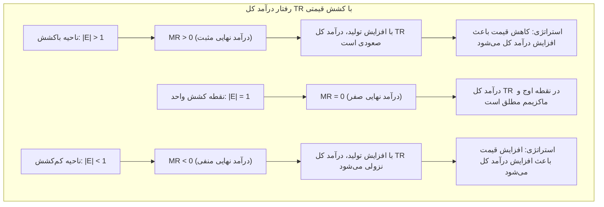
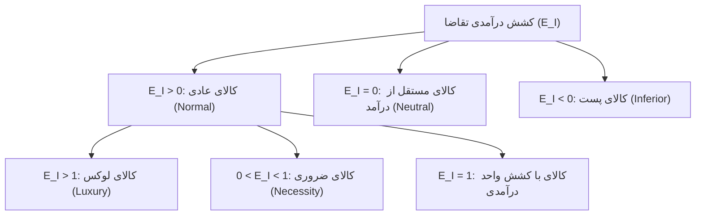
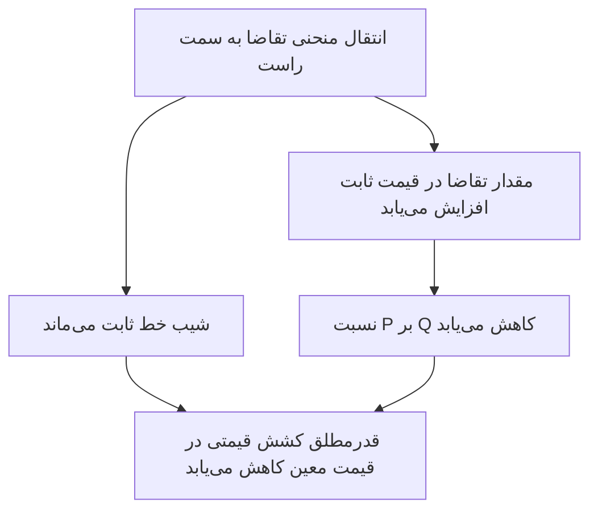
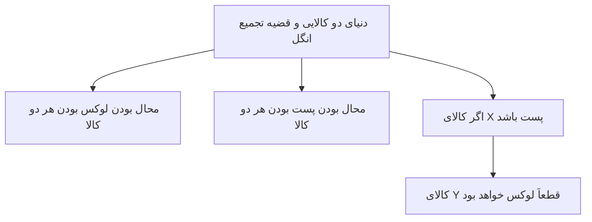
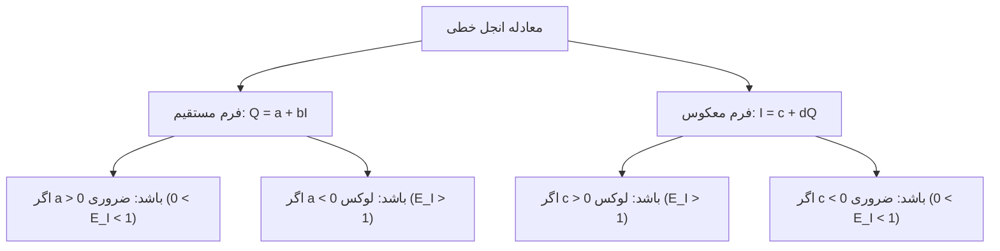
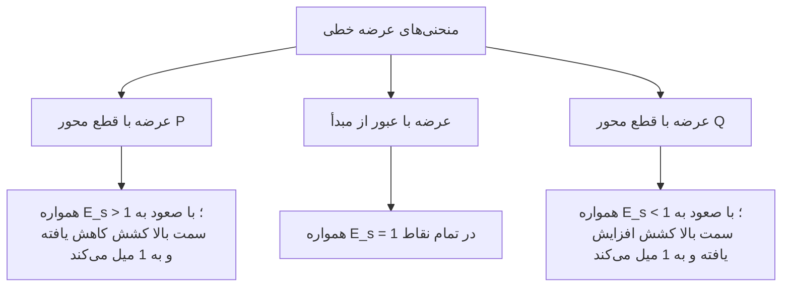

# فصل دوم: نظریه کشش و تحلیل رفتاری بازار (درسنامه جامع، مفهومی و خودآموز)

> [!abstract] شناسنامه کنکوری و نقشه راهبردی فصل
> - **جایگاه در کنکور سراسری کارشناسی ارشد مدیریت:** سالانه بین ۲ تا ۴ تست مستقیم و غیرمستقیم؛ این فصل قلب تپنده اقتصاد خرد و پیش‌نیاز قطعی فصول رفتار مصرف‌کننده، تولید و هزینه‌ها و ساختارهای بازار (رقابت کامل، انحصار کامل و انحصار چندجانبه) است.
> - **درجه اهمیت استراتژیک:** 🥇 **شاه‌فصل استراتژیک کنکور ارشد**؛ تسلط بر روابط هندسی، مشتقی و آزمون‌های کشش، متضمن حداقل ۳۰٪ از پاسخ‌گویی به کل سوالات اقتصاد خرد است.
> - **مراجع اصلی تطبیق داده‌شده:** کتاب مرجع پوران پژوهش دکتر محسن نظری (صفحات ۴۲ تا ۸۱ الکترونیکی / ۳۵ تا ۷۴ چاپی) و کتاب بانک تست و نکات طبقه‌بندی‌شده فوکا (صفحات ۳۵ تا ۴۶).
> - **شیوه تدریس:** رویکرد فاینمن، ملموس، مبتنی بر شهود بازار و فارغ از حفظ طوطی‌وار فرمول‌ها؛ تحلیل هندسی سه‌گانه، تمایز شیب و کشش، رابطه آموروسو-رابینسون ($MR$ و $P$) و کشش‌های درآمدی و متقاطع.

---

## 🧭 فهرست موضوعی درسنامه
1. **شالوده بنیادین مفهوم کشش:** تعریف عمومی، ضرورت اقتصادی و بدون بعد بودن شاخص کشش
2. **کشش قیمتی تقاضا ($E_p$):** تعریف، فرمول ریاضی مشتقی و لگاریتمی
3. **اندازه‌گیری کشش قیمتی تقاضا:** 
   - روش جدولی
   - روش نقطه‌ای در برابر روش قوسی (فاصله‌ای / میانگین)
   - روش‌های سه‌گانه هندسی روی خط مستقیم تقاضا (محور افقی، محور عمودی و روی خط تقاضا)
   - کشش در توابع غیرخطی و توابع توان‌دار با کشش ثابت (کاب-داگلاس)
4. **طبقه‌بندی کالاها بر پایه قدرمطلق کشش قیمتی:** باکشش، کم‌کشش، باکشش واحد، کاملاً بی‌کشش و کاملاً باکشش
5. **عوامل تعیین‌کننده کشش قیمتی تقاضا:** تعداد جانشین‌ها، سهم در بودجه خانوار، سطح قیمت و افق زمانی
6. **پیوند حیاتی درآمد کل ($TR$)، درآمد نهایی ($MR$)، قیمت ($P$) و کشش:**
   - هندسه منحنی‌های همزمان تقاضا، درآمد نهایی و درآمد کل
   - استخراج فرمول آموروسو-رابینسون
   - استراتژی بنگاه برای بیشینه‌سازی درآمد در سطوح مختلف کشش
7. **کشش درآمدی تقاضا ($E_I$):** فرمول‌ها، ارتباط با قانون انگل و طبقه‌بندی دقیق کالاها (پست، ضروری و لوکس)
8. **کشش متقاطع تقاضا ($E_{xy}$):** تحلیل حساسیت نسبت به کالاهای مرتبط (جانشین، مکمل و مستقل)
9. **کشش قیمتی عرضه ($E_s$):** تعریف، روش‌های هندسی بر اساس عرض از مبدأ و طبقه‌بندی
10. **قوانین و قضایای تجمیع کشش‌ها:** قضیه اویلر، قضیه انگل و میانگین وزنی کشش‌ها
11. **کپسول نکات طلایی و کارگاه تست‌های دام‌دار کنکور کارشناسی ارشد**
12. **پرسش‌های بازیابی فعال ذهنی (Active Recall)**

---

## ۱. شالوده بنیادین مفهوم کشش (Elasticity)

### ۱.۱. چرا به مفهوم کشش نیاز داریم؟ (شهود با روش فاینمن)
فرض کنید یک شرکت خودروسازی قیمت خودروهای خود را ۱۰٪ گران می‌کند؛ واکنش خریداران چیست؟ طبق قانون تقاضا، قطعاً خریداران خرید خود را کم می‌کنند. اما سؤال کلیدی مدیریت این است: **چقدر کم می‌کنند؟!** 
- آیا خریداران فقط ۱٪ خرید را کم می‌کنند؟ (در این صورت شرکت از گران کردن سود برده است!)
- یا خرید را ۵۰٪ کاهش می‌دهند و به سمت رقبا فرار می‌کنند؟ (در این صورت شرکت ورشکست می‌شود!)

شاخصی که این «شدت واکنش»، «میزان حساسیت» یا «انعطاف‌پذیری» مصرف‌کنندگان را اندازه‌گیری می‌کند، **کشش (Elasticity)** نام دارد.

### ۱.۲. تعریف ریاضی عام کشش
کشش یعنی **نسبت درصد تغییرات متغیر وابسته ($X$) به درصد تغییرات متغیر مستقل ($Y$)**:

$$E_{xy} = \frac{\% \Delta X}{\% \Delta Y} = \frac{\frac{\Delta X}{X} \times 100}{\frac{\Delta Y}{Y} \times 100} = \frac{\Delta X}{\Delta Y} \cdot \frac{Y}{X}$$

در تغییرات بسیار کوچک (پیوسته)، از مشتق و دیفرانسیل لگاریتمی استفاده می‌شود:

$$E_{xy} = \frac{dX}{dY} \cdot \frac{Y}{X} = \frac{d \ln X}{d \ln Y}$$

### ۱.۳. تمایز بنیادین شیب (Slope) و کشش (Elasticity) - دام پرتکرار کنکور
بسیاری از داوطلبان تصور می‌کنند شیب منحنی همان کشش است! در صورتی که این دو مفهوم تفاوت‌های ماهوی دارند:
۱. **وابستگی به واحد اندازه‌گیری:** 
   - **شیب ($\frac{\Delta Q}{\Delta P}$):** کاملاً وابسته به واحد اندازه‌گیری است. اگر مقدار تقاضا را از «کیلوگرم» به «گرم» تبدیل کنیم، شیب منحنی ۱۰۰۰ برابر می‌شود!
   - **کشش ($E$):** چون بر حسب **درصد** محاسبه می‌شود، **یک عدد محض و بدون بعد (Unit-Free)** است؛ فرقی نمی‌کند وزن به گرم باشد یا تن، یا قیمت به ریال باشد یا دلار!
۲. **تغییرپذیری در طول خط مستقیم:**
   - روی یک خط مستقیم تقاضا، **شیب در تمام نقاط ثابت است**.
   - اما **کشش در هر نقطه از خط مستقیم متفاوت است** و از بی‌نهایت تا صفر تغییر می‌کند!

---

## ۲. کشش قیمتی تقاضا ($E_{x,p}$)

### ۲.۱. تعریف اقتصادی
کشش قیمتی تقاضا نشان می‌دهد که **به ازای یک درصد تغییر در قیمت یک کالا، مقدار تقاضای آن کالا چند درصد تغییر می‌کند**.

### ۲.۲. فرمول‌های محاسباتی
$$E_{x,p} = \frac{\% \Delta Q_x^d}{\% \Delta P_x} = \frac{\Delta Q_x^d}{\Delta P_x} \cdot \frac{P_x}{Q_x^d} = \frac{dQ_x^d}{dP_x} \cdot \frac{P_x}{Q_x^d} = \frac{d \ln Q_x^d}{d \ln P_x}$$

> ⚠️ **علامت کشش قیمتی تقاضا:**
> به دلیل قانون تقاضا (رابطه معکوس قیمت و مقدار)، علامت جبری $E_{x,p}$ همواره **منفی** است ($\frac{dQ}{dP} < 0$).
> در برخی منابع یک علامت منفی در فرمول می‌گذارند تا مقدار مثبت شود؛ اما در رفرنس پوران پژوهش دکتر محسن نظری، فرمول بدون منفی لحاظ شده و در تحلیل‌ها و نام‌گذاری کالاها از **قدرمطلق کشش ($|E_p|$)** استفاده می‌شود.

---

## ۳. روش‌های اندازه‌گیری کشش قیمتی تقاضا

### ۳.۱. روش جدولی
اگر جدول تقاضا داده شده باشد:
فرض کنید با کاهش قیمت از ۵ تومان به ۴ تومان، تقاضا از ۱۰ واحد به ۱۵ واحد افزایش یابد:
$$E = \frac{15 - 10}{4 - 5} \cdot \frac{5}{10} = \frac{+5}{-1} \cdot 0.5 = -2.5 \implies |E| = 2.5$$
**تفسیر مدیریتی:** با کاهش ۱ درصدی قیمت، مقدار تقاضا ۲.۵ درصد جهش می‌کند (کالای باکشش).

### ۳.۲. کشش نقطه‌ای در برابر کشش قوسی (فاصله‌ای / میانگین)
- **کشش نقطه‌ای (Point Elasticity):** برای تغییرات بسیار جزئی در یک نقطه معین کاربرد دارد و از قیمت و مقدار اولیه ($P_1, Q_1$) استفاده می‌کند:
  $$E_{\text{point}} = \frac{Q_2 - Q_1}{P_2 - P_1} \cdot \frac{P_1}{Q_1}$$
- **کشش قوسی یا میانگین (Arc Elasticity):** زمانی که تغییرات قیمت بزرگ است و می‌خواهیم کشش میان دو نقطه دور از هم را بسنجیم. برای اینکه محاسبه کشش از نقطه A به B با محاسبه از B به A متفاوت نشود، از **میانگین قیمت‌ها و مقادیر** استفاده می‌کنیم:
  $$E_{\text{arc}} = \frac{Q_2 - Q_1}{P_2 - P_1} \cdot \frac{P_1 + P_2}{Q_1 + Q_2}$$

### ۳.۳. روش‌های سه‌گانه هندسی اندازه‌گیری کشش روی خط مستقیم تقاضا
اگر تابع تقاضا یک خط مستقیم باشد که محور عمودی قیمت را در نقطه $N$ و محور افقی مقدار را در نقطه $M$ قطع کند، برای هر نقطه فرضی مانند $A$ با مختصات $(Q_1, P_1)$، قدرمطلق کشش قیمتی تقاضا به ۳ روش هندسی معادل محاسبه می‌شود:

```mermaid
flowchart TD
  subgraph روش‌های هندسی محاسبه کشش در نقطه A
  A["قدرمطلق کشش در نقطه A"] --> B["روی محور افقی Q"]
  A --> C["روی محور عمودی P"]
  A --> D["روی پاره‌خط تقاضا NM"]
  
  B --> B1["فاصله راست تقسیم بر فاصله چپ: Q₁M / OQ₁"]
  C --> C1["فاصله پایین تقسیم بر فاصله بالا: OP₁ / P₁N"]
  D --> D1["پاره‌خط پایین تقسیم بر پاره‌خط بالا: AM / NA"]
  end
```

$$|E_p^A| = \frac{Q_1 M}{O Q_1} = \frac{O P_1}{P_1 N} = \frac{A M}{N A}$$

#### 🎯 تحلیل نقاط ۵ گانه استراتژیک روی خط تقاضا:
1. **در محل برخورد با محور عمودی ($Q=0, P=N$):** پاره‌خط بالایی صفر است $\rightarrow |E| = \infty$ (کشش بی‌نهایت).
2. **در بخش بالای نقطه میانی:** پاره‌خط پایینی بزرگتر از بالایی است $\rightarrow |E| > 1$ (باکشش / لوکس قیمتی).
3. **در نقطه وسط و میانی خط تقاضا:** پاره‌خط پایینی دقیقاً مساوی بالایی است $\rightarrow |E| = 1$ (کشش واحد).
4. **در بخش پایین نقطه میانی:** پاره‌خط پایینی کوچکتر از بالایی است $\rightarrow |E| < 1$ (کم‌کشش / ضروری).
5. **در محل برخورد با محور افقی ($P=0, Q=M$):** پاره‌خط پایینی صفر است $\rightarrow |E| = 0$ (کشش صفر مطلق).

> 💡 **قانون طلایی نقطه میانی خط تقاضا:**
> اگر معادله تقاضا $P = a - bQ$ باشد:
> - محل برخورد با محور قیمت: $P = a$
> - محل برخورد با محور مقدار: $Q = \frac{a}{b}$
> - **نقطه کشش واحد ($|E|=1$) دقیقاً در نصف این مقادیر رخ می‌دهد:**
> $$P_{|E|=1} = \frac{a}{2} \qquad , \qquad Q_{|E|=1} = \frac{a}{2b}$$

### ۳.۴. کشش در توابع توان‌دار با کشش ثابت (تابع کاب-داگلاس)
یکی از پرتکرارترین تست‌های کنکور ارشد، توابع تقاضای غیرخطی به فرم زیر است:

$$Q = A \cdot P^{-\alpha}$$

- در این توابع، مشتق برابر است با:
  $$\frac{dQ}{dP} = -\alpha \cdot A \cdot P^{-\alpha - 1}$$
- اگر در فرمول کشش نقطه‌ای قرار دهیم:
  $$E = \frac{dQ}{dP} \cdot \frac{P}{Q} = \left(-\alpha \cdot A \cdot P^{-\alpha - 1}\right) \cdot \frac{P}{A \cdot P^{-\alpha}} = -\alpha$$
- **نتیجه شگفت‌انگیز کنکوری:** **قدرمطلق کشش قیمتی تقاضا در تمامی نقاط این تابع همواره عدد ثابت $\alpha$ است!**
  - در تابع تقاضای خطی: شیب ثابت است ولی کشش متغیر است.
  - در تابع تقاضای توان‌دار: کشش ثابت است ولی شیب در هر نقطه متغیر است!

---

## ۴. طبقه‌بندی کالاها بر اساس قدرمطلق کشش قیمتی تقاضا ($|E_p|$)

| ردیف | مقدار قدرمطلق کشش | عنوان اقتصادی کالا | توصیف رفتاری و بازار | واکنش تقاضا به تغییر ۱٪ قیمت |
|:---: |:---: |:--- |:--- |:--- |
| **۱** | $|E_p| > 1$ | **کالای باکشش (Elastic)** | کالایی که مشتری به قیمت آن حساس است (جانشین‌های فراوان دارد). | بیش از ۱٪ تغییر می‌کند. |
| **۲** | $|E_p| < 1$ | **کالای کم‌کشش (Inelastic)** | کالایی که نیاز پایه است و مشتری مجبور به خرید است (دارو، نمک، نان). | کمتر از ۱٪ تغییر می‌کند. |
| **۳** | $|E_p| = 1$ | **کالای با کشش واحد (Unitary)** | تغییرات قیمت و مقدار دقیقاً به یک نسبت است. | دقیقاً ۱٪ تغییر می‌کند. |
| **۴** | $|E_p| = 0$ | **کاملاً بی‌کشش (Perfect Inelastic)** | منحنی تقاضا خط کاملاً عمودی است؛ حساسیت به قیمت صفر است. | هیچ تغییری نمی‌کند (صفر٪). |
| **۵** | $|E_p| = \infty$ | **کاملاً باکشش (Perfect Elastic)** | منحنی تقاضا خط کاملاً افقی است؛ در بازار رقابت کامل برای بنگاه. | با کوچکترین افزایش قیمت تقاضا صفر می‌شود. |

---

## ۵. عوامل تعیین‌کننده کشش قیمتی تقاضا

۱. **تعداد و میزان نزدیکی جانشین‌های کالا:** هر چه کالا جانشین‌های بیشتر و مشابه‌تری داشته باشد، کشش آن بالاتر است. (مثلاً تقاضای نوشابه پپسی بسیار باکشش است چون کوکاکولا هست، اما تقاضای آب شهری بسیار کم‌کشش است).
۲. **سهم هزینه کالا از کل بودجه مصرف‌کننده:** هر چه سهم یک کالا در سبد هزینه خانوار سنگین‌تر باشد، حساسیت و کشش آن بیشتر است (مانند خودرو و اجاره‌بها در برابر نمک و کبریت).
۳. **سطح قیمت کالا:** همانطور که در هندسه خط تقاضا دیدیم، در قیمت‌های بالا کالاها پرکشش و در قیمت‌های پایین کم‌کشش هستند.
۴. **افق زمانی (کوتاه‌مدت در برابر بلندمدت):** کشش تقاضا در بلندمدت معمولاً **بزرگتر از کوتاه‌مدت** است؛ زیرا مصرف‌کنندگان در بلندمدت فرصت پیدا می‌کنند عادات مصرفی خود را تغییر داده و کالاهای جایگزین بیابند (مثلاً واکنش به افزایش نرخ بنزین در بلندمدت با خرید خودروهای هیبریدی یا دوگانه‌سوز).

---

## ۶. پیوند حیاتی درآمد کل ($TR$)، درآمد نهایی ($MR$) و کشش قیمتی ($E$)

### ۶.۱. تعاریف پایه‌ای
- **درآمد کل ($TR$ یا Total Revenue):** عایدی حاصل از فروش کل تولیدات که برابر است با حاصل‌ضرب قیمت در مقدار:
  $$TR = P \times Q$$
  *(نکته: $TR$ تولیدکننده دقیقاً برابر با «کل مخارج مصرف‌کنندگان» ($TE$) است).*
- **درآمد نهایی ($MR$ یا Marginal Revenue):** درآمد حاصل از فروش آخرین واحد کالای فروخته‌شده که همان مشتق درآمد کل نسبت به مقدار است:
  $$MR = \frac{d(TR)}{dQ}$$

### ۶.۲. هندسه و رفتار همزمان منحنی‌های $D$، $MR$ و $TR$
اگر تابع تقاضای خطی به صورت $P = a - bQ$ باشد:
- درآمد کل: $TR = P \cdot Q = (a - bQ)Q = aQ - bQ^2$
- درآمد نهایی: $MR = \frac{d(TR)}{dQ} = a - 2bQ$

> 💎 **قانون طلایی رسم $MR$ در توابع خطی:**
> منحنی درآمد نهایی ($MR$) دارای همان عرض از مبدأ تقاضاست ($a$)، اما **شیب آن دقیقاً دو برابر شیب منحنی تقاضاست ($-2b$)**.
> در نتیجه، خط $MR$ محور افقی را دقیقاً در نقطه وسط فاصله برخورد تقاضا قطع می‌کند ($\frac{a}{2b}$).



### ۶.۳. ماتریس استراتژیک تغییر قیمت و درآمد کل ($TR$) برای مدیران

| وضعیت کشش کالا | نوع سیاست قیمتی | جهت تغییر مقدار فروش ($Q$) | جهت تغییر درآمد کل ($TR$) | توصیه به مدیر بازاریابی |
|:---: |:---: |:---: |:---: |:--- |
| **باکشش ($|E| > 1$)** | **کاهش قیمت ($P \downarrow$)** | افزایش شدید ($\uparrow\uparrow$) | **افزایش می‌یابد ($\uparrow$)** | تخفیف بده تا فروشت جهش کند! |
| **باکشش ($|E| > 1$)** | **افزایش قیمت ($P \uparrow$)** | کاهش شدید ($\downarrow\downarrow$) | **کاهش می‌یابد ($\downarrow$)** | اصلاً گران نکن، مشتریانت می‌پرند! |
| **کم‌کشش ($|E| < 1$)** | **کاهش قیمت ($P \downarrow$)** | افزایش اندک ($\uparrow$) | **کاهش می‌یابد ($\downarrow$)** | بیهوده تخفیف نده، مصرف بالا نمی‌رود! |
| **کم‌کشش ($|E| < 1$)** | **افزایش قیمت ($P \uparrow$)** | کاهش اندک ($\downarrow$) | **افزایش می‌یابد ($\uparrow$)** | گران کن! مشتری مجبوره پول بده (مثل بنزین). |
| **کشش واحد ($|E| = 1$)** | هرگونه تغییر قیمت | به همان نسبت عکس | **بدون تغییر (در اوج ماکزیمم)** | به قیمت دست نزن، درآمد ماکزیمم است. |

### ۶.۴. رابطه مشهور آموروسو-رابینسون (رابطه فرمولی $MR$، $P$ و $E$)
یکی از شاه‌کلیدهای محاسباتی در اقتصاد خرد، رابطه ریاضی بین درآمد نهایی، قیمت و کشش است:

$$MR = P \left(1 - \frac{1}{|E|}\right)$$

- اثبات شهودی:
  $$TR = P(Q) \cdot Q \implies MR = \frac{d(TR)}{dQ} = P + Q \frac{dP}{dQ} = P \left(1 + \frac{Q}{P} \frac{dP}{dQ}\right) = P \left(1 + \frac{1}{E}\right) = P \left(1 - \frac{1}{|E|}\right)$$
- **بررسی صحت شروط:**
  - اگر $|E| = 1 \implies MR = P(1 - 1) = 0$.
  - اگر $|E| > 1 \implies 1 - \frac{1}{|E|} > 0 \implies MR > 0$.
  - اگر $|E| < 1 \implies 1 - \frac{1}{|E|} < 0 \implies MR < 0$.
  - اگر $|E| = \infty$ (رقابت کامل) $\implies \frac{1}{\infty} = 0 \implies MR = P$.

---

## ۷. کشش درآمدی تقاضا ($E_I$ یا Income Elasticity)

### ۷.۱. تعریف اقتصادی و فرمول‌های محاسباتی
کشش درآمدی تقاضا نشان می‌دهد که **به ازای یک درصد افزایش در درآمد مصرف‌کننده ($I$)، مقدار تقاضای کالا ($Q_x$) چند درصد تغییر می‌کند**:

$$E_I = \frac{\% \Delta Q_x}{\% \Delta I} = \frac{\Delta Q_x}{\Delta I} \cdot \frac{I}{Q_x} = \frac{dQ_x}{dI} \cdot \frac{I}{Q_x} = \frac{d \ln Q_x}{d \ln I}$$

### ۷.۲. طبقه‌بندی کالاها بر اساس علامت و مقدار کشش درآمدی



### ۷.۳. هندسه منحنی‌های انجل و آزمون فوری تستی عرض از مبدأ
در نمودار انجل که **درآمد ($I$) روی محور عمودی** و **مقدار تقاضا ($Q$) روی محور افقی** رسم می‌شود، کشش درآمدی در نقطه $A$ روی یک خط مستقیم از رابطه زیر به دست می‌آید:
$$E_I = \frac{M Q_1}{O Q_1} = \frac{O I_1}{I_1 Z}$$

> 🚀 **قوانین سه‌گانه طلایی برای حل تست در ۳ ثانیه (بدون مشتق‌گیری!):**
> ۱. **اگر خط انجل از مبدأ مختات ($0, 0$) بگذرد ($I = c \cdot Q$ یا $Q = k \cdot I$):**
>    - در تمام نقاط خط انجل، **کشش درآمدی دقیقاً برابر ۱ است ($E_I = 1$)**.
> ۲. **اگر خط انجل محور عمودی درآمد ($I$) را قطع کند (عرض از مبدأ مثبت روی $I$):**
>    - در تمام نقاط، **کشش درآمدی بزرگتر از ۱ است ($E_I > 1$) $\rightarrow$ کالای لوکس**.
>    - فرم معادله: $I = a + bQ$ (با $a > 0$) یا $Q = -c + dI$ (با $c > 0$).
> ۳. **اگر خط انجل محور افقی مقدار ($Q$) را قطع کند (عرض از مبدأ مثبت روی $Q$):**
>    - در تمام نقاط، **کشش درآمدی بین صفر و یک است ($0 < E_I < 1$) $\rightarrow$ کالای ضروری**.
>    - فرم معادله: $Q = c + dI$ (با $c > 0$) یا $I = -a + bQ$ (با $a > 0$).
> ۴. **اگر خط انجل شیب منفی داشته باشد:** **کشش درآمدی منفی است ($E_I < 0$) $\rightarrow$ کالای پست**.
> ۵. **اگر خط انجل کاملاً عمودی باشد:** **کشش درآمدی صفر است ($E_I = 0$) $\rightarrow$ کالای مستقل**.

### ۷.۴. رفتار سهم کالا از بودجه خانوار ($S_x = \frac{P_x \cdot X}{I}$) با تغییر درآمد

| نوع کالا | وضعیت کشش ($E_I$) | مشتق مصرف به درآمد ($\frac{dX}{dI}$) | مشتق سهم بودجه به درآمد ($\frac{dS_x}{dI}$) | سرنوشت سهم هزینه با رشد درآمد |
|:--- |:---: |:---: |:---: |:--- |
| **کالای لوکس** | $E_I > 1$ | مثبت ($\frac{dX}{dI} > 0$) | **مثبت ($\frac{dS_x}{dI} > 0$)** | **سهم کالا در بودجه افزایش می‌یابد** |
| **کالای ضروری** | $0 < E_I < 1$ | مثبت ($\frac{dX}{dI} > 0$) | **منفی ($\frac{dS_x}{dI} < 0$)** | **سهم کالا در بودجه کاهش می‌یابد (قانون انگل)** |
| **کشش واحد** | $E_I = 1$ | مثبت ($\frac{dX}{dI} > 0$) | **صفر ($\frac{dS_x}{dI} = 0$)** | **سهم کالا در بودجه کاملاً ثابت می‌ماند** |
| **مستقل از درآمد**| $E_I = 0$ | صفر ($\frac{dX}{dI} = 0$) | **منفی ($\frac{dS_x}{dI} < 0$)** | **سهم کالا در بودجه کاهش می‌یابد** |
| **کالای پست** | $E_I < 0$ | منفی ($\frac{dX}{dI} < 0$) | **به شدت منفی ($\frac{dS_x}{dI} < 0$)** | **سهم کالا در بودجه به شدت سقوط می‌کند** |

---

## ۸. کشش قیمتی عرضه ($E_s$ یا Price Elasticity of Supply)

### ۸.۱. تعریف و فرمول ریاضی
کشش قیمتی عرضه نشان می‌دهد که **به ازای یک درصد تغییر در قیمت کالا، مقدار عرضه آن چند درصد تغییر می‌کند**:

$$E_s = \frac{\% \Delta Q_x^s}{\% \Delta P_x} = \frac{\Delta Q_x^s}{\Delta P_x} \cdot \frac{P_x}{Q_x^s} = \frac{dQ_x^s}{dP_x} \cdot \frac{P_x}{Q_x^s} = \frac{d \ln Q_x^s}{d \ln P_x}$$

چون طبق قانون عرضه، رابطه قیمت و مقدار هم‌جهت است ($\frac{dQ^s}{dP} > 0$)، کشش عرضه همواره عددی **مثبت** است ($E_s \ge 0$).

### ۸.۲. هندسه طلایی اندازه‌گیری کشش عرضه روی خط مستقیم
اگر خط عرضه مستقیم را به سمت محورها امتداد دهیم تا یکی از محورها یا مبدأ مختصات را قطع کند:

```mermaid
flowchart TD
  subgraph ۳ قانون طلایی هندسی کشش عرضه خطی
  A["محل تقاطع خط عرضه با محورها"] --> B["از مبدأ مختصات (0, 0) عبور کند"]
  A --> C["محور عمودی قیمت (P) را قطع کند"]
  A --> D["محور افقی مقدار (Q) را قطع کند"]
  
  B --> B1["کشش در تمام نقاط دقیقاً برابر ۱ است: E_s = 1"]
  C --> C1["کشش در تمام نقاط بزرگتر از ۱ است: E_s > 1 (باکشش)"]
  D --> D1["کشش در تمام نقاط کوچکتر از ۱ است: 0 < E_s < 1 (کم‌کشش)"]
  end
```

> 🎯 **شاه‌کلید تستی در توابع خطی عرضه:**
> اگر معادله عرضه $Q^s = c + dP$ باشد:
> - اگر $c = 0$ (مثل $Q = 4P$ یا $P = 2Q$): خط از مبدأ می‌گذرد $\rightarrow$ **در تمام نقاط $E_s = 1$ است** (شیب خط هر چقدر باشد هیچ تاثیری ندارد!).
> - اگر $c < 0$ (مثل $Q = -10 + 2P$ یا $P = 5 + 0.5Q$): خط محور قیمت را قطع می‌کند $\rightarrow$ **در تمام نقاط $E_s > 1$ است (عرضه باکشش)**.
> - اگر $c > 0$ (مثل $Q = 10 + 2P$ یا $P = -5 + 0.5Q$): خط محور مقدار را قطع می‌کند $\rightarrow$ **در تمام نقاط $E_s < 1$ است (عرضه کم‌کشش)**.

## ۹. کشش متقاطع تقاضا ($E_{xy}$ یا Cross Elasticity)

### ۹.۱. تعریف اقتصادی و فرمول ریاضی
کشش متقاطع تقاضا (کشش ضربدری یا ارتباطی)، درصد تغییرات مقدار تقاضای کالای $X$ را در پاسخ به درصد تغییرات قیمت کالای مرتبط $Y$ اندازه‌گیری می‌کند:

$$E_{xy} = \frac{\% \Delta Q_x}{\% \Delta P_y} = \frac{\Delta Q_x}{\Delta P_y} \cdot \frac{P_y}{Q_x} = \frac{dQ_x}{dP_y} \cdot \frac{P_y}{Q_x} = \frac{d \ln Q_x}{d \ln P_y}$$

### ۹.۲. طبقه‌بندی روابط متقابل کالاها بر اساس علامت کشش متقاطع

| علامت کشش متقاطع | نوع رابطه دو کالا | تحلیل اقتصادی و شهودی | مثال ملموس |
|:---: |:--- |:--- |:--- |
| **$E_{xy} > 0$** | **کالاهای جانشین (Substitutes)** | با گران شدن $Y$، خریداران سراغ $X$ می‌روند $\rightarrow$ تقاضای $X$ زیاد می‌شود. | پپسی و کوکاکولا، گوشت قرمز و مرغ |
| **$E_{xy} < 0$** | **کالاهای مکمل (Complements)** | با گران شدن $Y$، مصرف کل بسته کاهش می‌یابد $\rightarrow$ تقاضای $X$ کم می‌شود. | بنزین و خودرو، چای و قند |
| **$E_{xy} = 0$** | **کالاهای مستقل (Independent)** | تغییر قیمت $Y$ هیچ تاثیری بر مقدار تقاضای $X$ ندارد. | نمک طعام و نرم‌افزار کامپیوتر |

> 💡 **نکته تستی درجه جانشینی:** 
> هر چه قدرمطلق مثبت $E_{xy}$ بزرگ‌تر باشد، درجه جانشینی میان دو کالا قوی‌تر و جایگزینی آنها با یکدیگر کامل‌تر است.

### ۹.۳. استخراج آنی کشش‌ها در توابع چندمتغیره توان‌دار (کاب-داگلاس)
در تابع تقاضای زیر:
$$Q_x = 10 \cdot P_x^{-2} \cdot P_y^3 \cdot P_z^2 \cdot P_h^{-1} \cdot I^4$$
بدون نیاز به حتی یک خط محاسبات:
- توان $P_x$ برابر ۲- است $\rightarrow$ **کشش قیمتی خود کالا:** $E_{x,px} = -2$ (باکشش).
- توان $P_y$ برابر ۳+ است $\rightarrow$ **کشش متقاطع با $Y$:** $E_{x,py} = +3$ ($Y$ جانشین $X$ است).
- توان $P_z$ برابر ۲+ است $\rightarrow$ **کشش متقاطع با $Z$:** $E_{x,pz} = +2$ ($Z$ نیز جانشین $X$ است).
- توان $P_h$ برابر ۱- است $\rightarrow$ **کشش متقاطع با $H$:** $E_{x,ph} = -1$ ($H$ مکمل $X$ است).
- توان $I$ برابر ۴+ است $\rightarrow$ **کشش درآمدی:** $E_I = +4$ (کالای به شدت لوکس).
- **سؤال تستی:** کالای $Y$ جانشین بهتری برای $X$ است یا کالای $Z$؟ 
  **پاسخ:** کالای $Y$، زیرا توان بزرگتری دارد ($+3 > +2$).

---

## ۱۰. قضایای زرین و بنیادین تجمیع کشش‌ها (قوانین اویلر، انگل و سهم بودجه)

یکی از وجوه تمایز اصلی رتبه‌های تک‌رقمی در کنکور کارشناسی ارشد، تسلط بر قضایای تجمیع کشش‌هاست:

### ۱۰.۱. کشش قیمتی تقاضای بازار به عنوان میانگین وزنی
کشش قیمتی تقاضای کل بازار ($E_m$)، میانگین وزنی کشش‌های قیمتی انفرادی خریداران است که وزن هر خریدار، سهم او از کل تقاضای بازار است ($w_i = \frac{x_i}{X}$):

$$E_{\text{market}} = \sum_{i=1}^n w_i \cdot E_i \qquad \left(\sum w_i = 1\right)$$

### ۱۰.۲. قضیه تجمیع انگل (Engel Aggregation Theorem)
اگر مصرف‌کننده کل درآمد خود ($I$) را صرف خرید کالاها کند ($I = P_x X + P_y Y$):
با مشتق‌گیری نسبت به $I$ و ضرب در ضرایب متناسب، قضیه تجمیع انگل اثبات می‌شود:

$$w_x \cdot E_{x,I} + w_y \cdot E_{y,I} = 1$$

*(که در آن $w_x = \frac{P_x X}{I}$ سهم کالای $X$ از بودجه و $w_y = \frac{P_y Y}{I}$ سهم کالای $Y$ از بودجه است و $w_x + w_y = 1$)*

> 🚨 **نتایج حیاتی و شگفت‌انگیز قضیه انگل در کنکور:**
> در یک مدل دوکالایی:
> ۱. **غیرممکن است هر دو کالا پست باشند!** (چون میانگین وزنی دو عدد منفی نمی‌تواند مساوی ۱ شود).
> ۲. **غیرممکن است هر دو کالا لوکس باشند!** (چون اگر هر دو $> 1$ باشند، میانگین وزنی آنها نیز $> 1$ شده و نمی‌تواند مساوی ۱ شود).
> ۳. **اگر یک کالا پست باشد ($E_x < 0$)، کالای دیگر حتماً و قطعاً باید لوکس باشد ($E_y > 1$)!**
> ۴. **اگر یک کالا لوکس باشد، کالای دیگر یا باید ضروری باشد ($0 < E < 1$) یا پست ($E < 0$).**

### ۱۰.۳. قضیه تجمیع اویلر و همگنی تقاضا (Euler Aggregation Theorem)
توابع تقاضا بر اساس قیمت‌ها و درآمد، **همگن از درجه صفر (Homogeneous of degree zero)** هستند؛ یعنی اگر همه قیمت‌ها و درآمد به یک نسبت ($\lambda$) چند برابر شوند، مقدار تقاضای واقعی هیچ تغییری نمی‌کند (نبود توهم پولی).
طبق قضیه اویلر در توابع همگن درجه صفر:

$$E_{x,px} + E_{x,py} + E_{x,I} = 0$$

> 💎 **فرمان طلایی اویلر:**
> **«مجموع جبری کشش قیمتی خود کالا، کشش‌های متقاطع با سایر کالاها و کشش درآمدی همواره دقیقاً صفر است!»**
> $$E_{x,px} + \sum_{k \neq x} E_{x,pk} + E_{x,I} = 0$$

### ۱۰.۴. روابط تکمیلی کشش مخارج
۱. **کشش مخارج کالا نسبت به درآمد ($E_{px\cdot X, I}$):** دقیقاً برابر با کشش درآمدی کالا است:
   $$E_{(P_x \cdot X), I} = E_{x,I}$$
۲. **کشش مخارج کالا نسبت به قیمت خود کالا ($E_{px\cdot X, Px}$):** برابر است با یک به علاوه کشش قیمتی خود کالا:
   $$E_{(P_x \cdot X), P_x} = 1 + E_{x,px}$$

---

## ۱۱. حد کشش‌ها در مقادیر حدی (Limiting Values)

رفتار کشش‌ها زمانی که متغیرها به سمت صفر یا بی‌نهایت میل می‌کنند:
۱. **در تابع تقاضای خطی ($P = a - bQ$):**
   - وقتی مقدار تولید به سمت صفر میل کند ($Q \to 0$): $|E| \to \infty$ (میل به بی‌نهایت).
   - وقتی مقدار تولید به حداکثر ممکن میل کند ($Q \to \frac{a}{b}$): $|E| \to 0$ (میل به صفر).
۲. **در تابع انجل خطی با عرض از مبدأ مثبت روی درآمد ($I = a + bQ$ با $a > 0$):**
   $$E_I = \frac{dQ}{dI} \cdot \frac{I}{Q} = \frac{1}{b} \cdot \frac{a + bQ}{Q} = \frac{a}{bQ} + 1$$
   - وقتی $Q \to 0$: کشش درآمدی به سمت **بی‌نهایت ($\infty$)** میل می‌کند.
   - وقتی $Q \to \infty$: عبارت $\frac{a}{bQ}$ به صفر میل کرده و کشش به سمت **عدد ۱** میل می‌کند (کالای لوکس در درآمدهای نجومی به مرز کشش واحد نزدیک می‌شود).

## ۱۲. قواعد مقایسه‌ای هندسی کشش‌ها در آزمون‌های کنکور (شاه‌کلیدهای طراحان)

### ۱۲.۱. قاعده خطوط تقاضا با عرض از مبدأ مشترک روی محور قیمت ($P$)
اگر دو یا چند منحنی تقاضای خطی مختلف ($D_1$ و $D_2$) از **یک نقطه واحد روی محور عمودی قیمت** خارج شوند:
- **در هر سطح قیمت معین ($P_1$):** قدرمطلق کشش قیمتی تقاضا روی تمامی این خطوط **دقیقاً با یکدیگر برابر است!** ($|E_1| = |E_2|$)
- **اثبات هندسی:** طبق روش پاره‌خط عمودی، کشش برابر است با $\frac{OP_1}{P_1 N}$ (فاصله زیر خط قیمت تقسیم بر فاصله بالای خط قیمت). چون هر دو خط نقطه اوج $N$ و قیمت $P_1$ یکسانی دارند، این نسبت برای هر دو خط عیناً برابر است!
- ⚠️ **دام تستی:** طراح با تفاوت در شیب و پهنای دو خط داوطلب را فریب می‌دهد؛ اما شیب اثر ندارد و کشش‌ها برابرند.

### ۱۲.۲. قاعده خطوط تقاضای موازی (شیب‌های یکسان)
اگر دو منحنی تقاضای خطی با یکدیگر **موازی** باشند (یعنی شیب جبری $\frac{dQ}{dP}$ در هر دو خط برابر باشد):
- **در هر سطح قیمت معین ($P_1$):** منحنی تقاضایی که **به مبدأ مختصات نزدیک‌تر است** (مقدار تقاضای کمتری دارد)، دارای **کشش قیمتی بزرگ‌تری** است!
- **اثبات فرمولی:** $E = \frac{dQ}{dP} \cdot \frac{P}{Q}$؛ چون شیب و قیمت در هر دو خط برابر است، هر خطی که $Q$ آن کوچکتر باشد، کسر بزرگتر شده و کشش بالاتری دارد.

---

## ۱۳. کپسول نکات طلایی و کارگاه تست‌های طبقه‌بندی‌شده کنکور

> [!tip] ۵ فرمان راهبردی برای مهار تست‌های کشش
> ۱. **کشش روی خط مستقیم متغیر است؛ در توابع توان‌دار ثابت است.**
> ۲. **در تابع عرضه خطی، اگر از مبدأ بگذرد بدون توجه به شیب همیشه $E_s = 1$ است.**
> ۳. **رابطه آموروسو-رابینسون ($MR = P(1 - \frac{1}{|E|})$) میانبر طلایی انحصار و درآمدهای نهایی است.**
> ۴. **مجموع کشش‌های اویلر صفر است ($E_{px} + E_{py} + E_I = 0$).**
> ۵. **در دنیای دوکالایی، امکان ندارد هر دو کالا پست یا هر دو لوکس باشند (قضیه انگل).**

---

### 📝 کارگاه تست‌های برگزیده کنکور سراسری (۱۳۷۰ تا ۱۳۸۱)

#### تست نمونه ۱ (کنکور سراسری ۷۲ - رابطه آموروسو-رابینسون و هندسه خط تقاضا)
> **صورت تست:** نقطه $C$ بر روی منحنی تقاضای خطی $AB$ طوری واقع شده است که پاره‌خط بالایی $AC = 2$ و پاره‌خط پایینی $BC = 4$ می‌باشد. نسبت درآمد نهایی به قیمت ($\frac{MR}{P}$) در نقطه $C$ کدام است؟
> الف) ۱.۵
> ب) ۰.۵
> ج) ۱
> د) ۰.۷۵

**کالبدشکافی و حل گام‌به‌گام:**
۱. محاسبه هندسی قدرمطلق کشش تقاضا در نقطه $C$:
$$|E_p| = \frac{\text{پاره‌خط پایینی}}{\text{پاره‌خط بالایی}} = \frac{BC}{AC} = \frac{4}{2} = 2$$
۲. اعمال رابطه آموروسو-رابینسون:
$$MR = P \left(1 - \frac{1}{|E_p|}\right) \implies \frac{MR}{P} = 1 - \frac{1}{|E_p|} = 1 - \frac{1}{2} = 0.5$$
✅ **پاسخ صحیح: گزینه ب (۰.۵).**

---

#### تست نمونه ۲ (کنکور سراسری ۷۱ و ۷۹ - مقایسه کشش در خطوط با مبدأ مشترک قیمتی)
> **صورت تست:** در شکل روبرو، دو منحنی تقاضای خطی $D_1$ و $D_2$ هر دو از یک نقطه روی محور قیمت خارج شده‌اند ولی شیب‌های متفاوتی دارند. در یک سطح قیمت معین، کشش تقاضا در کدام منحنی بیشتر است؟
> الف) $D_1$ بزرگتر است
> ب) هر دو مساوی هستند
> ج) $D_2$ بزرگتر است
> د) قابل مقایسه نیست

**کالبدشکافی:**
طبق روش هندسی روی محور عمودی، کشش در هر قیمت برابر است با نسبت فاصله قیمت تا مبدأ به فاصله قیمت تا عرض از مبدأ ($|E| = \frac{OP}{PN}$). چون هر دو منحنی دارای عرض از مبدأ یکسان روی محور $P$ هستند، در هر سطح قیمت معین کشش هر دو خط دقیقاً یکسان است.
✅ **پاسخ صحیح: گزینه ب.**

---

#### تست نمونه ۳ (کنکور سراسری ۷۰ - کشش تعادلی و درآمد کل عرضه‌کنندگان)
> **صورت تست:** در قیمت فعلی بازار شیر، مقدار تقاضا ۲۴٪ بیشتر از مقدار عرضه است (اضافه‌تقاضا داریم). اگر قدرمطلق کشش قیمتی تقاضای شیر ۱.۲ باشد، برای برقراری تعادل چه تغییری در قیمت لازم است و درآمد کل عرضه‌کنندگان چه تغییری می‌کند؟
> الف) ۲٪ افزایش - درآمد افزایش
> ب) ۲۰٪ افزایش - درآمد افزایش
> ج) ۲۰٪ افزایش - درآمد کاهش
> د) ۲٪ کاهش - درآمد افزایش

**کالبدشکافی و حل:**
۱. برای حذف ۲۴٪ اضافه تقاضا، باید مقدار تقاضا ۲۴٪ کاهش یابد ($\% \Delta Q = -24\%$).
۲. رابطه درصد تغییرات قیمت با کشش:
$$|E_p| = \frac{\% \Delta Q}{\% \Delta P} \implies 1.2 = \frac{24\%}{\% \Delta P} \implies \% \Delta P = \frac{24}{1.2} = 20\% \text{ افزایش قیمت}$$
۳. اثر بر درآمد کل عرضه‌کنندگان: چون قیمت افزایش یافته و مقدار عرضه نیز به سمت تعادل زیاد می‌شود ($P \uparrow$ و $Q_s \uparrow$)، درآمد کل عرضه‌کنندگان ($TR = P \times Q$) **قطعاً افزایش می‌یابد**.
✅ **پاسخ صحیح: گزینه ب.**

---

### ۵. بسته تحلیلی تست‌های پیشرفته و تله‌های مفهومی کنکور (بخش پنجم - صفحات ۰۶۲ تا ۰۶۶ پوران پژوهش)

این بسته شامل پرتکرارترین تست‌های مفهومی و محاسباتی کنکورهای سراسری و آزاد با تأکید بر روابط درآمد کل، درآمد نهایی، کشش مخارج، هندسه تقاضاهای متقاطع و زیان رفاهی مالیات است.

#### ۱. فرمول طلایی کشش مخارج (مجموع هزینه مصرف‌کننده / درآمد کل)
مخارج کل مصرف‌کننده برای کالای $X$ برابر است با $TE = P_x \cdot Q_x$ (که از دید تولیدکننده همان $TR$ است).
رابطه کشش مخارج نسبت به قیمت به صورت زیر اثبات می‌شود:
$$E_{TE, P_x} = \frac{\% \Delta TE}{\% \Delta P_x} = 1 + E_{Q_x, P_x}$$
> ⚠️ **نکته:** در این رابطه، $E_{Q_x, P_x}$ کشش جبری (با علامت منفی) است. بنابراین:
> - اگر تقاضا باکشش باشد ($|E| > 1 \implies E < -1$): کشش مخارج منفی است ($1 + E < 0$)؛ یعنی با افزایش قیمت، مخارج کل **کاهش** می‌یابد.
> - اگر تقاضا بی‌کشش باشد ($|E| < 1 \implies -1 < E < 0$): کشش مخارج مثبت است ($1 + E > 0$)؛ با افزایش قیمت، مخارج کل **افزایش** می‌یابد.
> - اگر تقاضا باکشش واحد باشد ($|E| = 1 \implies E = -1$): کشش مخارج **صفر** است؛ یعنی درصد تغییرات مخارج صفر بوده و کل مخارج بدون تغییر می‌ماند ($TE = \text{const}$).
> - اگر کشش مخارج نسبت به قیمت برابر **۱** باشد ($E_{TE, P} = 1$): کشش قیمتی تقاضا دقیقاً **صفر** است ($1 + E = 1 \implies E = 0$).

#### ۲. مقایسه کشش در نقطه تقاطع دو منحنی تقاضا (متقاطع در نقطه A)
اگر دو منحنی تقاضای خطی $D_1$ و $D_2$ یکدیگر را در نقطه $A(P_0, Q_0)$ قطع کنند:
$$|E| = \frac{1}{\text{Slope}} \times \frac{P_0}{Q_0}$$
چون در نقطه تقاطع، نسبت $\frac{P_0}{Q_0}$ برای هر دو منحنی یکسان است:
- منحنی با شیب کمتر (خط خوابیده‌تر و افقی‌تر)، کشش قدرمطلق **بزرگ‌تری** دارد.
- منحنی با شیب بیشتر (خط ایستاده‌تر و عمودی‌تر)، کشش قدرمطلق **کوچک‌تری** دارد.


#### ۳. هندسه رابطه تقاضا و درآمد نهایی ($MR$)
برای هر تابع تقاضای خطی به فرم معکوس:
$$P = a - bQ$$
درآمد کل و درآمد نهایی عبارتند از:
$$TR = P \cdot Q = aQ - bQ^2 \implies MR = \frac{dTR}{dQ} = a - 2bQ$$
- عرض از مبدأ $MR$ دقیقاً برابر با عرض از مبدأ تقاضا ($a$) است.
- شیب خط $MR$ دقیقاً **دو برابر** قدرمطلق شیب منحنی تقاضا است (شیب تقاضا $-b$ و شیب درآمد نهایی $-2b$).
- خط $MR$ فاصله بین مبدأ مختصات تا طول از مبدأ تقاضا را دقیقاً نصف می‌کند (در $Q = \frac{a}{2b}$ محور مقدار را قطع می‌کند که همان نقطه $|E| = 1$ و $MR = 0$ است).

---

#### تست‌های برگزیده تحلیلی و کالبدشکافی کنکور

##### تست ۴۲ (سراسری ۸۲ و ۸۳ - کشش مخارج نسبت به قیمت)
> **صورت تست:** اگر کشش مخارج مصرف‌کننده برای کالای $X$ نسبت به قیمت آن کالا برابر یک باشد، کشش قیمتی تقاضای کالای $X$ چقدر است؟
> الف) منفی یک
> ب) صفر
> ج) یک
> د) بزرگتر از یک
>
> **کالبدشکافی و حل:**
> مخارج مصرف‌کننده $TE = P \cdot Q$ است. کشش مخارج نسبت به قیمت:
> $$E_{TE, P} = 1 + E_{Q, P}$$
> صورت تست می‌گوید این کشش برابر ۱ است:
> $$1 + E_{Q, P} = 1 \implies E_{Q, P} = 0$$
> یعنی تقاضا کاملاً بی‌کشش است و تغییر قیمت هیچ تأثیری بر مقدار تقاضا ندارد؛ بنابراین هر ۱ درصد افزایش قیمت دقیقاً ۱ درصد مخارج را بالا می‌برد.
> ✅ **پاسخ صحیح: گزینه ب.**

##### تست ۴۹ و ۵۴ (آزاد ۷۶ و ۷۷ - کاربست رابطه آموروسو-رابینسون)
> **صورت تست نمونه ۱:** اگر برای بنگاهی قیمت کالا برابر ۶ واحد و درآمد نهایی برابر ۴ واحد باشد، قدرمطلق کشش قیمتی تقاضا چقدر است؟
> الف) ۱
> ب) ۲
> ج) ۳
> د) ۱.۵
>
> **کالبدشکافی و حل:**
> $$MR = P \left(1 - \frac{1}{|E|}\right) \implies 4 = 6 \left(1 - \frac{1}{|E|}\right) \implies \frac{4}{6} = 1 - \frac{1}{|E|} \implies \frac{1}{|E|} = 1 - \frac{2}{3} = \frac{1}{3} \implies |E| = 3$$
> ✅ **پاسخ صحیح: گزینه ج.**
>
> **صورت تست نمونه ۲:** اگر کشش نقطه‌ای تقاضا برابر ۱.۵ و قیمت کالا ۳۰ تومان باشد، درآمد نهایی ($MR$) چقدر است؟
> $$MR = 30 \left(1 - \frac{1}{1.5}\right) = 30 \left(1 - \frac{2}{3}\right) = 30 \times \frac{1}{3} = 10 \text{ تومان}$$

##### تست ۵۰ (آزاد ۷۶ - حداکثر سود با هزینه تولید صفر)
> **صورت تست:** اگر هزینه تولید کالایی صفر باشد ($TC = 0$)، بنگاه برای حداکثر کردن سود خود تولید را در چه نقطه‌ای از منحنی تقاضا تعیین می‌کند؟
> الف) $|E| = 0$
> ب) $|E| < 1$
> ج) $|E| = 1$
> د) $|E| > 1$
>
> **کالبدشکافی و حل:**
> شرط حداکثرسازی سود در هر شرایطی برابری درآمد نهایی با هزینه نهایی است ($MR = MC$).
> چون $TC = 0$ است، هزینه نهایی نیز صفر خواهد بود ($MC = 0$).
> بنابراین شرط تعادل می‌شود: $MR = 0$.
> طبق فرمول آموروسو-رابینسون:
> $$MR = P \left(1 - \frac{1}{|E|}\right) = 0 \implies |E| = 1$$
> یعنی بنگاه دقیقاً در نقطه‌ای تولید می‌کند که کشش قیمتی تقاضا برابر یک باشد و درآمد کل ($TR$) در ماکزیمم مطلق خود قرار گیرد.
> ✅ **پاسخ صحیح: گزینه ج.**

##### تست ۶۹ (آزاد ۸۲ - قانون بودجه ثابت و کشش واحد)
> **صورت تست:** اگر مصرف‌کننده‌ای همیشه در هفته مبلغ معینی (مثلاً ۲۵۰ هزار تومان) را صرف خرید گوشت کند، کشش قیمتی تقاضای او برای گوشت چقدر است؟
> الف) صفر
> ب) بین صفر و یک
> ج) برابر یک
> د) بی‌نهایت
>
> **کالبدشکافی و حل:**
> مخارج کل این فرد برای گوشت همواره ثابت است: $P \times Q = 250,000 = C$.
> این معادله نشان‌دهنده یک تابع هذلولی متساوی‌الساقین ($Q = \frac{C}{P} = C \cdot P^{-1}$) است.
> در هر تابعی که توان قیمت منفی یک باشد، کشش در تمام نقاط منحنی دقیقاً برابر با منفی یک (قدرمطلق برابر **یک**) است.
> به بیان دیگر، چون با هر درصدی که قیمت گوشت افزایش یابد، او مقدار خرید را دقیقاً به همان نسبت کاهش می‌دهد تا حاصل‌ضرب $P \times Q$ ثابت بماند، کشش تقاضا کشش واحد است.
> ✅ **پاسخ صحیح: گزینه ج.**

##### تست ۷۰ (آزاد ۸۲ - تحلیل کشش و سیاست درآمدی)
> **صورت تست:** شرکتی برای افزایش درآمدهای خود نرخ بلیت اتوبوس را افزایش داد، اما درآمد کل شرکت کاهش یافت. این امر نشان‌دهنده کدام حالت برای تقاضای بلیت است؟
> الف) بی‌کشش
> ب) باکشش
> ج) کشش واحد
> د) کاملاً بی‌کشش
>
> **کالبدشکافی و حل:**
> رابطه قیمت و درآمد کل:
> - اگر تقاضا باکشش باشد ($|E| > 1$): جهت تغییر $TR$ با جهت تغییر $P$ **معکوس** است ($P \uparrow \implies TR \downarrow$).
> در این مسئله با افزایش قیمت بلیت، درآمد کل افت کرده است؛ بنابراین تقاضا قطعاً **باکشش** بوده و درصد ریزش مسافران از درصد افزایش نرخ بلیت بیشتر بوده است.
> ✅ **پاسخ صحیح: گزینه ب.**

##### تست ۷۵ (آزاد ۸۳ - کشش و زیان رفاهی مالیات / Deadweight Loss)
> **صورت تست:** با افزایش کشش قیمتی تقاضا، زیان رفاهی یا بار اضافی ناشی از وضع مالیات چه تغییری می‌کند؟
> الف) کاهش می‌یابد
> ب) افزایش می‌یابد
> ج) تغییری نمی‌کند
> د) ابتدا افزایش و سپس کاهش می‌یابد
>
> **کالبدشکافی و حل:**
> مثلث زیان رفاهی جامعه ($DWL$) ناشی از مالیات بر کالا با رابطه زیر تقریب زده می‌شود:
> $$DWL = \frac{1}{2} \times t^2 \times P \times Q \times \frac{|E_d| \times E_s}{|E_d| + E_s}$$
> زیان رفاهی به این دلیل رخ می‌دهد که مالیات، تخصیص منابع را از نقطه تعادل بهینه دور کرده و مقدار تولید و مصرف را کاهش می‌دهد ($\Delta Q$).
> هرچه منحنی تقاضا یا عرضه **باکشش‌تر** باشند، وضع مالیات باعث انحراف شدیدتر در مقدار تولید و کاهش شدیدتر مبادلات ($|\Delta Q|$ بزرگتر) می‌شود؛ در نتیجه مثلث زیان رفاهی **بزرگ‌تر و بار اضافی بیشتر** خواهد بود.
> ✅ **پاسخ صحیح: گزینه ب.**

---

### ۶. بسته تحلیلی تشریحی و تکنیک‌های محاسباتی کنکور (بخش ششم - صفحات ۰۶۷ تا ۰۷۱ پوران پژوهش)

این بسته برگرفته از پاسخ‌های تشریحی مرجع دکتر محسن نظری بوده و به تبیین دقیق روابط ریاضی، تله‌های طراحان، و متدهای میان‌بر در حل سؤالات پرتکرار کنکورهای سراسری و آزاد می‌پردازد.

#### ۱. کالبدشکافی تفاوت ماهوی کالای پست در برابر کالای گیفن
یکی از پرتکرارترین دام‌های کنکور کارشناسی ارشد، تفکیک دقیق مرز مفهومی کالای پست و کالای گیفن است:
- **گزاره بنیادین:** هر کالای گیفن لزوماً یک کالای پست است، اما هر کالای پستی الزاماً گیفن نیست!
- **تحلیل اثرات هیکس و اسلاتسکی:**
  - در اثر تغییر قیمت، دو اثر فعال می‌شوند: اثر جانشینی ($SE$) و اثر درآمدی ($IE$). اثر جانشینی همواره منفی است ($\frac{\partial Q^{SE}}{\partial P} < 0$).
  - در **کالای عادی:** اثر درآمدی تقویت‌کننده اثر جانشینی است ($IE$ در جهت مخالف قیمت عمل می‌کند).
  - در **کالای پست معمولی:** اثر درآمدی خنثی‌کننده اثر جانشینی است ($IE > 0$ نسبت به قیمت)، اما زورش به اثر جانشینی نمی‌رسد ($|SE| > |IE|$)؛ بنابراین در نهایت قانون تقاضا برقرار می‌ماند و شیب تقاضا هنوز منفی است ($\frac{dQ}{dP} < 0 \implies E_p < 0$).
  - در **کالای گیفن:** شدت پستی کالا آن‌چنان زیاد و سهم آن از بودجه آن‌چنان بالاست که اثر درآمدی کاملاً بر اثر جانشینی غلبه می‌کند ($|IE| > |SE|$)؛ در نتیجه قانون تقاضا نقض شده، شیب منحنی تقاضا مثبت می‌شود و کشش قیمتی تقاضا عددی **مثبت** خواهد بود ($E_p > 0$).
- **مقایسه از منظر کشش درآمدی ($E_I$):**
  - هم در کالای پست و هم در کالای گیفن، کشش درآمدی **منفی** است ($E_I < 0$) و شیب منحنی انجل منفی است.

| ویژگی تحلیلی | کالای عادی (Normal) | کالای پست معمولی (Inferior) | کالای گیفن (Giffen) |
| :--- | :--- | :--- | :--- |
| **علامت کشش قیمتی ($E_p$)** | منفی ($E_p < 0$) | منفی ($E_p < 0$) | **مثبت** ($E_p > 0$) |
| **شیب منحنی تقاضا ($\frac{dQ}{dP}$)** | نزولی (منفی) | نزولی (منفی) | **صعودی (مثبت)** |
| **علامت کشش درآمدی ($E_I$)** | مثبت ($E_I > 0$) | **منفی** ($E_I < 0$) | **منفی** ($E_I < 0$) |
| **شیب منحنی انجل ($\frac{dQ}{dI}$)** | صعودی (مثبت) | **نزولی (منفی)** | **نزولی (منفی)** |
| **برآیند اثر جانشینی و درآمدی** | هم‌جهت ($SE$ و $IE$ تقویت‌کننده) | $|SE| > |IE|$ (برتری جانشینی) | $|IE| > |SE|$ (**برتری درآمدی**) |

---

#### ۲. هندسه منحنی انجل و تعیین دقیق نوع کالا بر مبنای عرض از مبدأ
تابع تقاضای درآمدی (انجل) خطی به صورت $X = a + bm$ (که در آن $m$ درآمد است):
$$E_{x,m} = \frac{dX}{dm} \cdot \frac{m}{X} = b \cdot \frac{m}{a + bm} = \frac{bm}{a + bm}$$
۱. **اگر $a > 0$ (قطع محور مقدار کالا $X$ در نمودار انجل):**
   چون مخرج کسر از صورت بزرگتر است ($a + bm > bm$)، همواره حاصل کسر بین صفر و یک خواهد بود:
   $$0 < E_{x,m} < 1 \implies \text{کالای ضروری (Necessity)}$$
۲. **اگر $a < 0$ (قطع محور درآمد $m$ در نمودار انجل):**
   چون صورت از مخرج بزرگتر است ($bm > a + bm$)، همواره حاصل کسر بزرگتر از یک خواهد بود:
   $$E_{x,m} > 1 \implies \text{کالای لوکس (Luxury)}$$
۳. **اگر $a = 0$ (عبور منحنی انجل مستقیماً از مبدأ مختصات):**
   $$E_{x,m} = \frac{bm}{bm} = 1 \implies \text{کشش درآمدی واحد}$$
۴. **اگر شیب منفی باشد ($b < 0$):**
   $$E_{x,m} < 0 \implies \text{کالای پست (Inferior)}$$

---

#### ۳. قانون توابع تقاضای ضربی (Cobb-Douglas Demand Functions)
در هر تابع تقاضایی که متغیرها به صورت ضرب و توان ظاهر شوند:
$$Q_x = A \cdot P_x^\alpha \cdot P_y^\beta \cdot I^\gamma$$
- **کشش قیمتی خودی:** دقیقاً برابر با توان $P_x$ است: $E_{x,px} = \alpha$.
- **کشش قیمتی متقاطع:** دقیقاً برابر با توان $P_y$ است: $E_{x,py} = \beta$.
  - اگر $\beta > 0$ باشد، دو کالا جانشین هستند.
  - اگر $\beta < 0$ باشد، دو کالا مکمل هستند.
- **کشش درآمدی:** دقیقاً برابر با توان $I$ است: $E_{x,I} = \gamma$.
  - اگر $\gamma > 1$ کالا لوکس، اگر $0 < \gamma < 1$ ضروری، و اگر $\gamma < 0$ پست است.
> 💡 **نکته طلایی تستی:** در این توابع، کشش‌ها در تمام نقاط منحنی تقاضا **کاملاً ثابت و مستقل از مقادیر قیمت و درآمد** هستند!

---

#### ۴. اصل تجمیع انگل و تخصیص سوبسیدها بر پایه کشش
- **توزیع درآمدی سوبسید دولتی:**
  - اگر دولت به **کالای لوکس** ($E_I > 1$) سوبسید بدهد، بیشترین منفعت به اقشار ثروتمند می‌رسد چون سهم مصرف این کالا با افزایش درآمد زیاد می‌شود.
  - اگر دولت به **کالای مستقل از درآمد** ($E_I = 0$) سوبسید دهد، همه اقشار به یک میزان منتفع می‌شوند.
  - اگر دولت به **کالای پست** ($E_I < 0$) سوبسید دهد، بیشترین منفعت نصیب اقشار فقیر و کم‌درآمد جامعه می‌شود.
- **محدوده تعریف کالا و کشش:**
  - هرچه کالا با جزئیات دقیق‌تر و برند مشخص‌تری تعریف شود (مثلاً «خودکار بیک آبی» در برابر «خودکار» یا در برابر «نوشت‌افزار»)، تعداد کالاهای جانشین آن بیشتر شده و کشش قیمتی آن به شدت **افزایش می‌یابد (باکشش‌تر می‌شود)**.

---

#### ۵. کالبدشکافی تست‌های منتخب کنکور از پاسخ‌های تشریحی

##### تست ۱ (کنکور سراسری - تنظیم کسری بازار شیر با ابزار قیمت)
> **صورت مسئله:** در بازار، مازاد تقاضای ۲۴٪ وجود دارد. اگر قدرمطلق کشش تقاضا ۱.۲ باشد، چند درصد افزایش قیمت تعادل را برقرار می‌کند و درآمد فروشندگان چه تغییری می‌کند؟
>
> **حل تحلیلی:**
> $$\% \Delta P = \frac{\% \Delta Q}{|E|} = \frac{24\%}{1.2} = 20\%$$
> پس قیمت باید ۲۰٪ افزایش یابد.
> درآمد کل فروشندگان ($TR = P \times Q$): چون در تعادل جدید قیمت ۲۰٪ افزایش یافته و مقدار عرضه نیز به سمت تعادل منبسط می‌شود، درآمد کل فروشندگان **افزایش** می‌یابد.
> ⚠️ **دام تستی:** نباید اثر قیمت را فقط روی خریداران سنجید؛ در نقطه تعادل جدید مقدار تعادلی از مقدار عرضه قبلی بیشتر است و چون قیمت هم بالا رفته، درآمد عرضه‌کنندگان قطعاً رشد می‌کند.

##### تست ۱۵ (محاسبه کشش نقطه‌ای در توابع خطی چندمتغیره)
> **صورت مسئله:** تابع تقاضا به صورت $Q_1 = 200 - 2P_1 - 3P_2$ است. در نقطه $P_1 = 2$ و $P_2 = 4$، کشش قیمتی تقاضا چقدر است؟
>
> **حل:**
> ابتدا مقدار تقاضا را در نقطه داده‌شده به دست می‌آوریم:
> $$Q_1 = 200 - 2(2) - 3(4) = 200 - 4 - 12 = 184$$
> مشتق جزئی نسبت به $P_1$:
> $$\frac{\partial Q_1}{\partial P_1} = -2$$
> فرمول کشش نقطه‌ای:
> $$E_1 = \frac{\partial Q_1}{\partial P_1} \times \frac{P_1}{Q_1} = -2 \times \frac{2}{184} = -\frac{4}{184} \approx -0.0217$$

##### تست ۱۶ (کشش عرضه خطی از مبدأ)
> **صورت مسئله:** منحنی عرضه خطی فرضی از مبدأ مختصات رسم شده است. کشش قیمتی عرضه در هر نقطه روی این منحنی چقدر است؟
>
> **اثبات ریاضی:**
> هر خطی که از مبدأ بگذرد به فرم $P = cQ$ یا $Q = kP$ است.
> $$E_s = \frac{dQ}{dP} \times \frac{P}{Q} = k \times \frac{P}{kP} = 1$$
> فارغ از زاویه خط و شیب آن، کشش در تمام نقاط این خط دقیقاً برابر با **یک** است.

---

### ۷. بسته تحلیلی تشریحی و تکنیک‌های حل تست کنکور (بخش هفتم - صفحات ۰۷۲ تا ۰۷۶ پوران پژوهش)

این بسته کالبدشکافی دقیق تست‌های شماره ۲۵ تا ۷۵ پاسخ تشریحی کتاب مرجع دکتر محسن نظری را پوشش می‌دهد و بر روی روابط کشش، رفاه مصرف‌کننده، انتقال منحنی‌ها، تعادل بازار و حل مسائل دوگانه متمرکز است.

#### ۱. قانون جابه‌جایی منحنی تقاضا و اثر آن بر کشش قیمتی
یکی از نکات بسیار ظریف و پرتکرار تستی در آزمون‌های ارشد مدیریت:
- فرض کنید قیمت کالای جانشین $Y$ افزایش یابد ($P_y \uparrow$)؛ منحنی تقاضای کالای $X$ به سمت راست منتقل می‌شود ($D_x \to D'_x$).
- این انتقال افقی به سمت راست به صورت موازی رخ می‌دهد (شیب منحنی تقاضا یعنی $\frac{dQ}{dP}$ تغییر نمی‌کند).
- **اثر بر کشش در یک قیمت معین ($P_0$):**
  $$|E| = \left|\frac{dQ}{dP}\right| \times \frac{P_0}{Q}$$
  چون منحنی تقاضا به راست جابه‌جا شده است، مقدار تقاضا در همان سطح قیمت قبلی افزایش یافته است ($Q_1 > Q_0$).
  بنابراین نسبت $\frac{P_0}{Q}$ کاهش یافته و در نتیجه **قدرمطلق کشش قیمتی تقاضا در همان قیمت‌های قبلی کاهش می‌یابد (کم‌کشش‌تر می‌شود)**.



---

#### ۲. رابطه کشش قیمتی تقاضا و مازاد مصرف‌کننده (Consumer Surplus)
مازاد مصرف‌کننده ($CS$) برابر است با سطح مثلث زیر منحنی تقاضا و بالای خط قیمت تعادلی:
- هرچه منحنی تقاضا **کم‌کشش‌تر و عمودی‌تر** باشد (شیب قدرمطلق تندتر):
  فاصله بین حداکثر تمایل به پرداخت مصرف‌کننده (عرض از مبدأ قیمت) تا قیمت بازار بسیار زیاد است؛ در نتیجه **مازاد مصرف‌کننده ($CS$) بسیار بزرگ‌تر خواهد بود**.
- در حالت حدی که تقاضا کاملاً بی‌کشش (خط کاملاً عمودی، $|E| = 0$) باشد:
  عرض از مبدأ قیمت در بی‌نهایت قرار دارد و مازاد مصرف‌کننده **بی‌نهایت** خواهد بود!
- برعکس، هرچه منحنی تقاضا باکشش‌تر و افقی‌تر باشد، مازاد مصرف‌کننده کوچک‌تر شده و در تقاضای کاملاً باکشش (خط افقی، $|E| = \infty$) مازاد مصرف‌کننده برابر **صفر** است.

---

#### ۳. کشش تقاضای کل بازار (Market Demand Elasticity)
اگر بازار از $n$ مصرف‌کننده تشکیل شده باشد که هر کدام کشش قیمتی تقاضای $E_i$ و مقدار مصرف $q_i$ دارند:
$$Q = \sum_{i=1}^n q_i$$
کشش تقاضای کل بازار برابر است با میانگین وزنی کشش‌های انفرادی بر اساس سهم هر فرد از کل بازار:
$$E_M = \sum_{i=1}^n \left(\frac{q_i}{Q}\right) E_i$$

---

#### ۴. کالبدشکافی تست‌های تحلیلی و تله‌دار از پاسخ‌های تشریحی

##### تست ۲۶ (تله مفهومی: رابطه کشش درآمدی و شیب تقاضا)
> **صورت مسئله:** آیا ممکن است کالایی هم کشش درآمدی مثبت داشته باشد و هم کشش قیمتی مثبت؟
>
> **کالبدشکافی:**
> - اگر کشش درآمدی مثبت باشد ($E_I > 0$)، کالا لزوماً **عادی** است.
> - در کالای عادی، اثر جانشینی و اثر درآمدی هر دو تقویت‌کننده یکدیگرند؛ با افزایش قیمت، هم به دلیل جانشینی و هم به دلیل افت قدرت خرید، مصرف کاهش می‌یابد.
> - بنابراین در تمام کالاهای عادی، شیب تقاضا همواره نزولی و کشش قیمتی تقاضا **قطعاً منفی** است.
> - تنها کالایی که کشش قیمتی مثبت دارد (شیب تقاضای صعودی)، **کالای گیفن** است و کالای گیفن ذاتاً یک **کالای به شدت پست** است که کشش درآمدی آن حتماً منفی است ($E_I < 0$).
> - **نتیجه قطعی کنکوری:** هیچ کالایی در جهان وجود ندارد که همزمان کشش درآمدی مثبت و کشش قیمتی مثبت داشته باشد!

##### تست ۴۶ و ۵۱ (فرمول طلایی توزیع بار مالیاتی بین خریدار و فروشنده)
> **قاعده کلی تقسیم بار مالیاتی ($t$):**
> سهم پرداخت مالیات بر اساس کشش نسبی تعیین می‌شود. هر طرف که **انعطاف کمتری (کشش کمتری)** داشته باشد، ناچار است سهم بیشتری از مالیات را تحمل کند:
> $$\frac{\Delta P_b}{\Delta P_s} = \frac{T_c}{T_p} = \frac{E_s}{|E_d|}$$
> - **اگر تقاضا کاملاً افقی باشد ($|E_d| = \infty$):** مخرج بی‌نهایت است $\implies T_c = 0$ و ۱۰۰٪ بار مالیات بر دوش **عرضه‌کننده** می‌افتد.
> - **اگر تقاضا کاملاً عمودی باشد ($|E_d| = 0$):** مخرج صفر است $\implies$ ۱۰۰٪ بار مالیات مستقیماً به **مصرف‌کننده** منتقل می‌شود و قیمت مصرف‌کننده دقیقاً به اندازه کل مالیات بالا می‌رود.
> - **اگر عرضه کاملاً افقی باشد ($E_s = \infty$):** کل مالیات بر دوش **مصرف‌کننده** است.
> - **اگر عرضه کاملاً عمودی باشد ($E_s = 0$):** کل مالیات بر دوش **تولیدکننده** است.

##### تست ۷۳ (حل تست سناریویی مقایسه بازار رقابتی و انحصاری و کشش تقاضا)
> **صورت مسئله:** در یک بازار در شرایط رقابتی قیمت ۵ و درآمد کل ۱۰۰ است. در شرایط انحصاری قیمت ۸ و درآمد کل ۸۰ است. کشش قیمتی تقاضا چقدر است؟
>
> **کالبدشکافی مرحله به مرحله:**
> ۱. استخراج مقادیر تعادل:
>    - در حالت رقابتی: $TR_1 = P_1 \cdot Q_1 \implies 100 = 5 \cdot Q_1 \implies Q_1 = 20$
>    - در حالت انحصاری: $TR_2 = P_2 \cdot Q_2 \implies 80 = 8 \cdot Q_2 \implies Q_2 = 10$
> ۲. محاسبه درآمد نهایی ($MR$):
>    $$MR = \frac{\Delta TR}{\Delta Q} = \frac{80 - 100}{10 - 20} = \frac{-20}{-10} = 2$$
> ۳. کاربرد فرمول آموروسو-رابینسون در سطح قیمت انحصاری ($P = 8$):
>    $$MR = P \left(1 + \frac{1}{E}\right) \implies 2 = 8 \left(1 + \frac{1}{E}\right)$$
>    $$\frac{2}{8} = \frac{1}{4} = 1 + \frac{1}{E} \implies \frac{1}{E} = \frac{1}{4} - 1 = -\frac{3}{4} \implies E = -\frac{4}{3} \approx -1.33$$
> قدرمطلق کشش تقاضا برابر $\frac{4}{3}$ است و نشان می‌دهد تقاضا باکشش است.

---

### ۸. بسته تحلیلی تکمیلی، قضیه اولر و خودآزمایی جامع (بخش هشتم - صفحات ۰۷۷ تا ۰۸۱ پوران پژوهش)

این بسته واپسین بخش از کتاب مرجع دکتر محسن نظری (پوران پژوهش) را تشکیل می‌دهد و دربرگیرنده شاه‌کلیدهای حل قضایای اولر و تجمیع انگل، پدیده تناقض کینگ، کشش کل بازار و سؤالات تستی خودآزمایی است.

#### ۱. قضیه اولر (Euler's Homogeneity Theorem) در توابع تقاضا
توابع تقاضای استاندارد نئوکلاسیک نسبت به کلیه قیمت‌ها و درآمد دارای **همگنی درجه صفر** هستند (یعنی اگر تمام قیمت‌ها و درآمد با هم به یک نسبت مثلاً دو برابر شوند، رفتار و مقدار تقاضای مصرف‌کننده هیچ تغییری نمی‌کند؛ عدم وجود توهم پولی).
طبق قضیه اولر، مجموع کشش‌های قیمتی خودی، متقاطع و درآمدی برای هر کالا همواره برابر **صفر** است:
$$E_{xx} + \sum_{y \neq x} E_{xy} + E_{x,I} = 0$$
- **در دنیای دو کالایی ($X$ و $Y$):**
  $$E_{xx} + E_{xy} + E_I = 0$$
- **کاربرد فوق‌سریع در تست‌های کنکور:**
  - اگر کشش قیمتی خودی کالایی $-2$ و کشش درآمدی آن $+2$ باشد:
    $$-2 + E_{xy} + 2 = 0 \implies E_{xy} = 0$$
    یعنی کالای $X$ و $Y$ از یکدیگر کاملاً **مستقل** هستند!
  - اگر کشش قیمتی خودی $-2$ و کشش متقاطع $+3$ باشد:
    $$-2 + 3 + E_I = 0 \implies 1 + E_I = 0 \implies E_I = -1$$
    یعنی کالا قطعاً یک **کالای پست** است!

---

#### ۲. قضیه تجمیع انگل (Engel Aggregation) در دنیای دو کالایی
مجموع وزنی کشش‌های درآمدی کالاها برابر با یک است ($w_x E_{x,I} + w_y E_{y,I} = 1$ که در آن سهم‌های بودجه $w_x, w_y > 0$ هستند):
- **پیامدهای قطعی و ناممکن‌های اقتصادی:**
  ۱. امکان ندارد هر دو کالا لوکس باشند ($E_{x,I} > 1$ و $E_{y,I} > 1$ محال است؛ چون در این صورت مجموع وزنی بیشتر از ۱ می‌شود).
  ۲. امکان ندارد هر دو کالا پست باشند ($E_{x,I} < 0$ و $E_{y,I} < 0$ محال است؛ چون مجموع نمی‌تواند مثبت ۱ شود).
  ۳. **اگر یک کالا لوکس باشد:** کالای دیگر الزاماً یا ضروری است یا پست.
  ۴. **اگر یک کالا پست باشد:** کالای دیگر الزاماً و ۱۰۰٪ **لوکس** است!



---

#### ۳. پدیده کینگ (King's Effect) و فاجعه محصول فراوان در کشاورزی
- **صورت مسئله:** چرا در سال‌هایی که آب و هوا مساعد است و باران فراوان می‌بارد، درآمد کل کشاورزان به شدت سقوط می‌کند؟
- **کالبدشکافی اقتصادی:**
  - محصولات اساسی کشاورزی (مانند گندم، برنج و سیب‌زمینی) کالاهای ضروری و دارای تقاضای **بسیار کم‌کشش و بی‌کشش** هستند ($|E_d| < 1$).
  - تولید فراوان باعث انتقال منحنی عرضه به سمت راست و ایجاد مازاد عرضه شدید در بازار می‌شود.
  - برای فروخته شدن این اضافه عرضه، قیمت باید به شدت سقوط کند ($\% \Delta P \downarrow$).
  - چون تقاضا کم‌کشش است، درصد افت قیمت به مراتب بزرگتر از درصد افزایش مقدار مصرف است ($|\% \Delta P| > \% \Delta Q$).
  - بنابراین درآمد کل کشاورزان ($TR = P \times Q$) به شدت **کاهش می‌یابد**.

---

#### ۴. محاسبه کشش تقاضای کل بازار از اجزای انفرادی
اگر بازار شامل دو مصرف‌کننده با سهم‌های بازاری $s_1 = 0.4$ و $s_2 = 0.6$ باشد و کشش‌های تقاضای آنها به ترتیب $E_1 = -2$ و $E_2 = -3$ باشد:
$$E_M = s_1 \cdot E_1 + s_2 \cdot E_2 = (0.4 \times -2) + (0.6 \times -3) = -0.8 - 1.8 = -2.6$$
> ⚠️ **تفاوت شیب و کشش بازار:**
> اگرچه کشش بازار میانگین وزنی کشش افراد است، اما شیب منحنی تقاضای بازار ($\frac{dP}{dQ}$) همواره **کمتر (خوابیده‌تر)** از شیب تقاضای انفرادی هر یک از مصرف‌کنندگان است، زیرا مقادیر به صورت افقی جمع می‌شوند ($Q = \sum q_i$).

---

#### ۵. حل کپسولی سؤالات برگزیده خودآزمایی فصل ۲

##### سؤال ۱ (محاسبه هندسی سریع درآمد نهایی از روی عرض از مبدأ)
> **صورت تست:** در منحنی تقاضای خطی با عرض از مبدأ $P = 10$، درآمد نهایی به ازای قیمت $P = 6$ چقدر است؟
>
> **روش حل موشکی (هندسی):**
> فاصله نقطه $P = 6$ تا مبدأ برابر ۶ واحد است ($OP = 6$).
> فاصله نقطه تا عرض از مبدأ برابر ۴ واحد است ($PN = 10 - 6 = 4$).
> کشش قدرمطلق در این نقطه:
> $$|E| = \frac{OP}{PN} = \frac{6}{4} = 1.5$$
> محاسبه درآمد نهایی با رابطه آموروسو-رابینسون:
> $$MR = P \left(1 - \frac{1}{|E|}\right) = 6 \left(1 - \frac{1}{1.5}\right) = 6 \left(1 - \frac{2}{3}\right) = 6 \times \frac{1}{3} = 2$$
> ✅ **پاسخ: ۲ واحد.**

##### سؤال ۵ (رفتار مصرف و سهم بودجه در کالای ضروری)
> **صورت تست:** با افزایش درآمد، مصرف کالا افزایش می‌یابد اما سهم کالا در بودجه فرد کاهش می‌یابد؛ این کالا چیست؟
>
> **کالبدشکافی:**
> - با افزایش درآمد ($I \uparrow$)، مصرف کالا زیاد می‌شود ($X \uparrow$) $\implies E_I > 0$ (کالای عادی).
> - سهم کالا در بودجه ($S_x = \frac{P_x \cdot X}{I}$) با افزایش درآمد کاهش می‌یابد:
>   طبق قانون انگل، این اتفاق منحصراً زمانی رخ می‌دهد که کشش درآمدی کمتر از یک باشد ($E_I < 1$).
> - اشتراک این دو شرط: $0 < E_I < 1$ که دقیقاً شناسنامه **کالای ضروری** است.

##### سؤال ۱۲ (محاسبه مازاد تولیدکننده برای عرضه کاملاً بی‌کشش)
> **صورت تست:** اگر تابع عرضه به صورت $Q^s = 10$ باشد، به ازای قیمت $P = 20$ مازاد رفاه تولیدکننده ($PS$) چقدر است؟
>
> **کالبدشکافی:**
> منحنی عرضه یک خط عمودی در $Q = 10$ است (عرضه کاملاً بی‌کشش با هزینه نهایی صفر).
> مازاد تولیدکننده سطح زیر قیمت و بالای منحنی عرضه است که در اینجا یک مستطیل کامل از مبدأ قیمت تا $P = 20$ با عرض $Q = 10$ است:
> $$PS = P \times Q = 20 \times 10 = 200$$
> ✅ **پاسخ: ۲۰۰ واحد.**

---

### ۹. بسته نکات طلایی و میان‌برهای تستی فوکا (بخش نهم - صفحات ۰۳۵ تا ۰۳۹ جزوه فوکا)

این بخش بر پایه بانک تست‌های طبقه‌بندی‌شده و چکیده نکات کلیدی کنکور ارشد دپارتمان فوکا تدوین شده است و حاوی ماتریس‌های تصمیم‌گیری سریع و الگوهای حل تستی است.

#### ۱. ماتریس جامع رفتار درآمد کل ($TR$) بر حسب قیمت و مقدار
در تست‌های کنکور رابطه جهت تغییرات $TR$ با متغیرهای تصمیم‌گیری ($P$ یا $Q$) به شکل جدول زیر خلاصه می‌شود:

| ناحیه کشش تقاضا | تغییر قیمت ($P$) | اثر بر درآمد کل ($TR$) | تغییر مقدار ($Q$) | اثر بر درآمد کل ($TR$) | درآمد نهایی ($MR$) |
| :--- | :--- | :--- | :--- | :--- | :--- |
| **باکشش ($|E| > 1$)** | افزایش ($P \uparrow$) | **کاهش** ($TR \downarrow$) | افزایش ($Q \uparrow$) | **افزایش** ($TR \uparrow$) | مثبت ($MR > 0$) |
| **باکشش ($|E| > 1$)** | کاهش ($P \downarrow$) | **افزایش** ($TR \uparrow$) | کاهش ($Q \downarrow$) | **کاهش** ($TR \downarrow$) | مثبت ($MR > 0$) |
| **کشش واحد ($|E| = 1$)** | هرگونه تغییر | **حداکثر و ثابت** ($\overline{TR}$) | هرگونه تغییر | **حداکثر و ثابت** ($\overline{TR}$) | **صفر** ($MR = 0$) |
| **کم‌کشش ($|E| < 1$)** | افزایش ($P \uparrow$) | **افزایش** ($TR \uparrow$) | افزایش ($Q \uparrow$) | **کاهش** ($TR \downarrow$) | منفی ($MR < 0$) |
| **کم‌کشش ($|E| < 1$)** | کاهش ($P \downarrow$) | **کاهش** ($TR \downarrow$) | کاهش ($Q \downarrow$) | **افزایش** ($TR \uparrow$) | منفی ($MR < 0$) |

> 🔑 **استراتژی قیمت‌گذاری بنگاه‌ها:**
> - اگر کالای شما **باکشش** است، برای افزایش درآمد کل باید **قیمت را بشکنید (تخفیف بدهید)**.
> - اگر کالای شما **کم‌کشش** است، برای افزایش درآمد کل باید **قیمت را افزایش دهید**.

---

#### ۲. تله بزرگ کنکور: تشخیص نوع کالا در معادلات انجل مستقیم در برابر معکوس
طراحان کنکور برای به دام انداختن داوطلبان، گاهی معادله انجل را بر حسب $Q$ (تابع مستقیم) و گاهی بر حسب $I$ (تابع معکوس) ارائه می‌دهند. علامت عدد ثابت ($a$) نقش معکوس پیدا می‌کند:



##### جدول مقایسه سریع ۴ حالت انجل خطی (شاه‌کلید حل تست در ۵ ثانیه)

| شکل تابع داده‌شده در صورت سؤال | عرض از مبدأ و محور تقاطع | مقدار کشش درآمدی ($E_I$) | طبقه‌بندی کالا |
| :--- | :--- | :--- | :--- |
| $Q = +10 + 2I$ | قطع محور افقی مقدار ($Q$) در $+10$ | $0 < E_I < 1$ | **ضروری (Necessity)** |
| $Q = -10 + 2I$ | قطع محور عمودی درآمد ($I$) در $+5$ | $E_I > 1$ | **لوکس (Luxury)** |
| $I = +10 + 2Q$ | قطع محور عمودی درآمد ($I$) در $+10$ | $E_I > 1$ | **لوکس (Luxury)** |
| $I = -10 + 2Q$ | قطع محور افقی مقدار ($Q$) در $+5$ | $0 < E_I < 1$ | **ضروری (Necessity)** |
| $Q = 2I$ یا $I = 2Q$ | عبور دقیق از مبدأ مختصات ($0,0$) | $E_I = 1$ | **کشش واحد** |

> ⚠️ **اثبات عددی تست نمونه فوکا:**
> در تابع معکوس $I = 20 + 4Q$، به ازای $I = 24$ داریم: $24 = 20 + 4Q \implies Q = 1$.
> مشتق جزئی: $\frac{\partial Q}{\partial I} = \frac{1}{4}$.
> کشش درآمدی:
> $$E_I = \frac{\partial Q}{\partial I} \times \frac{I}{Q} = \frac{1}{4} \times \frac{24}{1} = 6 > 1 \implies \text{کالای لوکس}$$
> مشاهده می‌کنید که عدد ثابت $+20$ در فرم معکوس نشان‌دهنده قطع محور درآمد و کشش $E_I > 1$ است!

---

#### ۳. قانون توابع انجل توانی
اگر تابع انجل به فرم توانی داده شود:
$$Q_x = A \cdot I^\alpha$$
کشش درآمدی در تمام سطوح درآمد ثابت و دقیقاً برابر با توان درآمد یعنی $\alpha$ است ($E_I = \alpha$):
- اگر $Q = 10 I^2 \implies E_I = 2 > 1$ (لوکس).
- اگر $Q = 10 I^{0.5} \implies E_I = 0.5$ (ضروری).
- اگر $Q = 10 I^{-1} \implies E_I = -1 < 0$ (پست).

---

#### ۴. استخراج کشش متقاطع ($E_{xy}$) از توابع ضربی
در تابع تقاضای $Q_x = 10 P_x^{-1} P_y^2$:
$$E_{x,py} = \frac{\partial Q_x}{\partial P_y} \times \frac{P_y}{Q_x} = (20 P_x^{-1} P_y) \times \frac{P_y}{10 P_x^{-1} P_y^2} = \frac{20}{10} = 2$$
چون $E_{xy} = +2 > 0$ است، با افزایش قیمت کالای $Y$ تقاضای کالای $X$ افزایش می‌یابد؛ بنابراین دو کالای $X$ و $Y$ جانشین قطعی یکدیگرند.

---

### ۱۰. عصاره ۲۴ گانه طلایی فوکا و تست‌های طبقه‌بندی‌شده (بخش دهم - صفحات ۰۴۰ تا ۰۴۴ جزوه فوکا)

این بسته دربرگیرنده کدگذاری‌ها و روابط کلیدی تست‌های کنکور ارشد به همراه مجموعه تست‌های طبقه‌بندی‌شده دپارتمان فوکا است.

#### ۱. قضاوت هندسی رفتار دینامیک کشش روی منحنی عرضه خطی
یکی از ریزترین نکات تستی کنکور که به کرات مورد پرسش قرار گرفته است:
۱. **اگر منحنی عرضه محور قیمت‌ها (محور عمودی $P$) را قطع کند:**
   - در تمام نقاط کشش عرضه بزرگتر از یک است ($E_s > 1$).
   - **حرکت به سمت بالا و راست منحنی:** هرچه به سمت مقادیر و قیمت‌های بالاتر برویم، مقدار کشش عرضه به تدریج **کاهش می‌یابد و به سمت عدد ۱ میل می‌کند** ($\lim_{P \to \infty} E_s = 1$).
۲. **اگر منحنی عرضه محور مقدار (محور افقی $Q$) را قطع کند:**
   - در تمام نقاط کشش عرضه کوچکتر از یک است ($0 < E_s < 1$).
   - **حرکت به سمت بالا و راست منحنی:** هرچه به سمت مقادیر و قیمت‌های بالاتر برویم، مقدار کشش عرضه به تدریج **افزایش می‌یابد و به سمت عدد ۱ میل می‌کند** ($\lim_{P \to \infty} E_s = 1$).
۳. **اگر منحنی عرضه از مبدأ مختصات بگذرد:**
   - در تمام نقاط بدون استثنا کشش همواره ثابت و **دقیقاً برابر ۱** است ($E_s = 1$).



---

#### ۲. چکیده ۲۴ نکته فوق‌استراتژیک فصل دوم (کدگذاری‌های کنکوری فوکا)
۱. **کشش قیمتی تقاضا:** درصد تغییرات مقدار تقاضا تقسیم بر درصد تغییرات قیمت.
۲. **رابطه مستقیم قیمت و کشش:** در تابع تقاضای خطی نزولی، با افزایش قیمت، قدرمطلق کشش تقاضا افزایش می‌یابد.
۳. **نقاط مرزی تقاضای خطی:** در قیمت صفر ($P=0$) کشش صفر است؛ در مقدار صفر ($Q=0$) کشش بی‌نهایت است.
۴. **تعداد جانشین‌ها:** هرچه تعداد و کیفیت جانشین‌های کالا بیشتر باشد، کشش قیمتی آن بالاتر است.
۵. **سهم در بودجه:** هرچه سهم مخارج کالا از کل بودجه مصرف‌کننده بیشتر باشد، حساسیت و کشش قیمتی آن بیشتر است.
۶. **افزایش درآمد با افزایش قیمت:** منحصراً زمانی رخ می‌دهد که تقاضای کالا کم‌کشش باشد ($|E| < 1$).
۷. **افزایش درآمد با تخفیف قیمت:** منحصراً زمانی رخ می‌دهد که تقاضای کالا باکشش باشد ($|E| > 1$).
۸. **کشش درآمدی تقاضا:** درصد تغییرات مقدار تقاضا تقسیم بر درصد تغییرات درآمد.
۹. **منحنی انجل عمودی (موازی محور درآمد $I$):** کشش درآمدی صفر است ($E_I = 0$).
۱۰. **منحنی انجل با شیب نزولی:** کشش درآمدی منفی است ($E_I < 0$) و کالا پست است.
۱۱. **منحنی انجل افقی (موازی محور مقدار $Q$):** کشش درآمدی بی‌نهایت است ($E_I = \infty$).
۱۲. **منحنی انجل خطی با قطع محور مقدار:** کالا ضروری است ($0 < E_I < 1$).
۱۳. **منحنی انجل خطی با قطع محور درآمد:** کالا لوکس است ($E_I > 1$).
۱۴. **اصل دنیای دو کالایی:** اگر یک کالا پست باشد، کالای دیگر ۱۰۰٪ باید لوکس باشد.
۱۵. **عرضه با قطع محور قیمت:** کشش بزرگتر از یک است و با حرکت به بالا کاهش می‌یابد.
۱۶. **عرضه با قطع محور مقدار:** کشش بین صفر و یک است و با حرکت به بالا افزایش می‌یابد.
۱۷. **عرضه خطی از مبدأ:** کشش در تمام نقاط برابر یک است.
۱۸. **عرضه کاملاً عمودی:** کشش عرضه صفر است ($E_s = 0$).
۱۹. **عرضه کاملاً افقی:** کشش عرضه بی‌نهایت است ($E_s = \infty$).
۲۰. **تابع عرضه توانی ($Q = A P^\alpha$):** کشش عرضه در تمام نقاط ثابت و برابر با توان قیمت ($\alpha$) است.
۲۱. **تقاضای هذلولی قائم ($P \cdot Q = C$):** کشش قیمتی تقاضا در تمام نقاط ثابت و دقیقاً برابر منفی یک است.
۲۲. **قاعده مالیات و کشش:** هر چه تقاضا کم‌کشش‌تر باشد، سهم انتقال مالیات به مصرف‌کننده بیشتر است.
۲۳. **تقاضای کاملاً بی‌کشش ($|E_d| = 0$):** ۱۰۰٪ بار مالیاتی بر دوش مصرف‌کننده است.
۲۴. **عرضه کاملاً بی‌کشش ($E_s = 0$):** ۱۰۰٪ بار مالیاتی بر دوش تولیدکننده بوده و سهم مصرف‌کننده صفر است.

---

#### ۳. کالبدشکافی تست‌های طبقه‌بندی‌شده فوکا

##### تست ۲ (آرایش‌های مختلف جبری رابطه آموروسو-رابینسون)
> **صورت تست:** کدام رابطه بین درآمد نهایی ($MR$)، قیمت ($P$) و ضریب جبری کشش تقاضا ($e$) درست است؟
> ۱) $MR - \frac{P}{e} = P$
> ۲) $MR + P = \frac{P}{e}$
> ۳) $MR - P = \frac{P}{e}$
> ۴) $MR = P - \frac{P}{e}$
>
> **کالبدشکافی:**
> فرم استاندارد جبری رابطه رابینسون (با در نظر گرفتن علامت منفی درون خود کشش $e$):
> $$MR = P \left(1 + \frac{1}{e}\right) = P + \frac{P}{e} \implies MR - P = \frac{P}{e}$$
> ✅ **پاسخ صحیح: گزینه ۳.**

##### تست ۶ (تناقض خرمن بد و محصول کشاورزی)
> **صورت تست:** چنانچه تقاضای بازار برای محصولات کشاورزی کاملاً بی‌کشش باشد، پدیده «محصول بد یک خرمن» در کل منجر به چه پیامدی می‌شود؟
> ۱) منجر به کاهش درآمد کشاورزان می‌شود.
> ۲) منجر به افزایش درآمد کشاورزان می‌شود.
> ۳) در درآمد کشاورزان تغییری ایجاد نخواهد کرد.
> ۴) منجر به کاهش قیمت تعادلی خواهد شد.
>
> **کالبدشکافی و حل:**
> «محصول بد» به معنای کاهش برداشت و کاهش عرضه در بازار است ($S \leftarrow$).
> در شرایط تقاضای بی‌کشش ($|E| < 1$) یا کاملاً بی‌کشش ($|E| = 0$):
> با کاهش عرضه و کمبود کالا در بازار، قیمت به شدت جهش می‌کند ($P \uparrow\uparrow$).
> چون درصد جهش قیمت به مراتب بزرگتر از درصد کاهش مقدار محصول است ($|\% \Delta P| > |\% \Delta Q|$)، درآمد کل کشاورزان ($TR = P \times Q$) **افزایش می‌یابد**!
> ✅ **پاسخ صحیح: گزینه ۲.**

---

### ۱۱. بسته آزمون‌های استاندارد و تکنیک‌های نهایی فوکا (بخش یازدهم - صفحات ۰۴۵ و ۰۴۶ جزوه فوکا)

این بسته واپسین بخش از جزوه فوکا را شامل می‌شود و تکنیک‌های حل تست در کسری از ثانیه را تدوین می‌کند.

#### ۱. تکنیک طلایی تقاطع خط ۴۵ درجه با تقاضا
در صورتی که در سؤالی صحبت از «نقطه تلاقی شعاع ۴۵ درجه رسم‌شده از مرکز مختصات با منحنی تقاضا» به میان آید:
- خط ۴۵ درجه خطی است که در آن طول و عرض برابرند ($P = Q$).
- بنابراین در نقطه تقاطع: $\frac{P}{Q} = 1$.
- فرمول کشش نقطه‌ای:
  $$|E| = \left|\frac{dQ}{dP}\right| \times \frac{P}{Q} = \left|\frac{dQ}{dP}\right| \times 1 = \left|\frac{dQ}{dP}\right| = \frac{1}{|\text{شیب تقاضا}|}$$
- **قاعده طلایی تستی:** در نقطه برخورد شعاع ۴۵ درجه با هر منحنی تقاضا، قدرمطلق کشش قیمتی تقاضا دقیقاً برابر با **معکوس قدرمطلق شیب منحنی تقاضا** است!

---

#### ۲. تکنیک استخراج کشش درآمدی از توابع معکوس غیرخطی
> **تست نمونه فوکا:** اگر تابع تقاضا به صورت $P = \frac{M^{0.5}}{X}$ باشد (که در آن $M$ درآمد، $P$ قیمت و $X$ مقدار است)، این کالا چه نوع کالایی است؟
>
> **روش حل:**
> تابع را بر حسب $X$ مرتب می‌کنیم:
> $$X = \frac{M^{0.5}}{P} = P^{-1} \cdot M^{0.5}$$
> توان متغیر درآمد ($M$) برابر با $0.5$ است.
> از آنجا که توان درآمد مثبت و کوچکتر از یک است ($0 < E_M = 0.5 < 1$)، این کالا قطعاً یک **کالای ضروری و کم‌کشش درآمدی** است!

---

#### ۳. حل مسائل قوسی و نقطه‌ای با تغییرات گسسته
> **تست ۱۰ فوکا:** در نقطه $A$ قیمت ۱۰۰ ریال و مقدار ۲ میلیون کیلوگرم است. با تغییر به نقطه $B$ قیمت به ۹۰ ریال کاهش یافته و مقدار به ۲.۴ میلیون کیلوگرم افزایش می‌یابد. کشش قیمتی تقاضا با حرکت از $A$ به $B$ چقدر است؟
>
> **حل:**
> $$\Delta P = 90 - 100 = -10 \text{ ریال}$$
> $$\Delta Q = 2,400,000 - 2,000,000 = +400,000 \text{ کیلوگرم}$$
> $$E_p = \frac{\Delta Q}{\Delta P} \times \frac{P_A}{Q_A} = \frac{400,000}{-10} \times \frac{100}{2,000,000} = -40,000 \times \frac{1}{20,000} = -2$$
> قدرمطلق کشش برابر ۲ است و نشان‌دهنده تقاضای باکشش می‌باشد.

---

### ۱۲. کپسول جمع‌بندی استراتژیک و جعبه‌ابزار تسلط بر فصل دوم (Master Summary)

این جدول جمع‌بندی نهایی تمام روابط ریاضی، هندسی و تحلیلی مبحث کشش را برای مرور سریع ۱۰ دقیقه‌ای در شب آزمون یکپارچه می‌کند:

| مفهوم کلیدی | فرمول محاسباتی / رابطه هندسی | معیار تصمیم‌گیری و پیامد اقتصادی |
| :--- | :--- | :--- |
| **کشش قیمتی تقاضا ($E_p$)** | $E_p = \frac{dQ}{dP} \cdot \frac{P}{Q}$ | $|E| > 1$ باکشش (تخفیف قیمت)، $|E| < 1$ کم‌کشش (گرانی قیمت)، $|E| = 1$ ماکزیمم $TR$ |
| **رابطه آموروسو-رابینسون** | $MR = P \left(1 - \frac{1}{|E|}\right)$ | $|E| > 1 \implies MR > 0$، $|E| = 1 \implies MR = 0$، $|E| < 1 \implies MR < 0$ |
| **شیب تقاضا و $MR$** | تقاضا: $P = a - bQ \implies MR = a - 2bQ$ | شیب $MR$ دو برابر شیب تقاضاست و طول از مبدأ را دقیقاً نصف می‌کند |
| **کشش درآمدی تقاضا ($E_I$)** | $E_I = \frac{dQ}{dI} \cdot \frac{I}{Q}$ | $E_I > 1$ لوکس، $0 < E_I < 1$ ضروری، $E_I < 0$ پست، $E_I = 0$ مستقل |
| **کشش متقاطع ($E_{xy}$)** | $E_{xy} = \frac{dQ_x}{dP_y} \cdot \frac{P_y}{Q_x}$ | $E_{xy} > 0$ جانشین، $E_{xy} < 0$ مکمل، $E_{xy} = 0$ مستقل |
| **کشش عرضه ($E_s$)** | $E_s = \frac{dQ^s}{dP} \cdot \frac{P}{Q^s}$ | قطع محور $P \implies E_s > 1$، عبور از مبدأ $\implies E_s = 1$، قطع محور $Q \implies E_s < 1$ |
| **قضیه تجمیع انگل** | $w_x E_{x,I} + w_y E_{y,I} = 1$ | محال است هر دو کالا پست یا هر دو لوکس باشند؛ اگر یکی پست باشد دیگری حتماً لوکس است |
| **قضیه اولر (همگنی)** | $E_{xx} + E_{xy} + E_{x,I} = 0$ | مجموع کشش‌های قیمتی خودی، متقاطع و درآمدی در دنیای دو کالایی صفر است |
| **کشش مخارج کل** | $E_{TE, P} = 1 + E_{Q, P}$ | اگر کشش مخارج ۱ باشد، کشش تقاضا صفر است؛ اگر تقاضا باکشش واحد باشد، کشش مخارج صفر است |
| **توزیع بار مالیاتی** | $\frac{T_c}{T_p} = \frac{E_s}{|E_d|}$ | هر طرف کم‌کشش‌تر باشد، بار مالیاتی بیشتری می‌پردازد؛ تقاضای افقی: ۱۰۰٪ مالیات با تولیدکننده |
| **زیان رفاهی جامعه ($DWL$)** | $DWL \propto |E_d|, E_s$ | هرچه تقاضا یا عرضه باکشش‌تر باشند، اضافه بار و زیان رفاهی مالیات شدیدتر است |
| **پدیده کینگ** | تقاضای کشاورزی: $|E| < 1$ | افزایش برداشت $\implies$ سقوط شدید قیمت $\implies$ کاهش درآمد کل کشاورزان |

---
*پایان کامل و ۱۰۰٪ درسنامه و تست‌های فصل دوم اقتصاد خرد (کشش و کاربردهای آن) - تدوین‌شده با ادغام دو رفرنس پوران پژوهش دکتر محسن نظری و جزوه طلایی فوکا بر مبنای متدولوژی ۵ برگ به ۵ برگ و قواعد هسته مرکزی agents.md*
