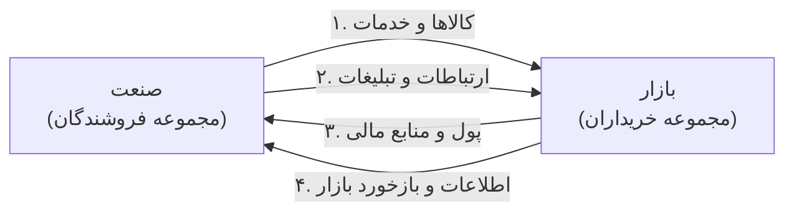
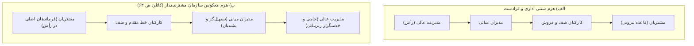
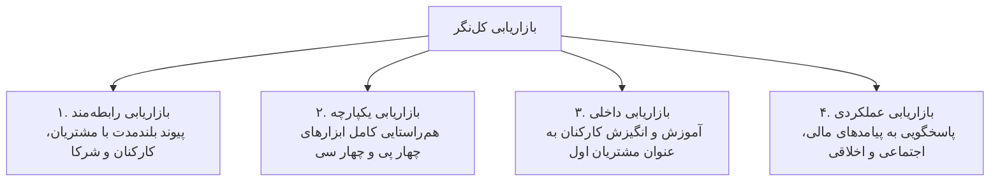
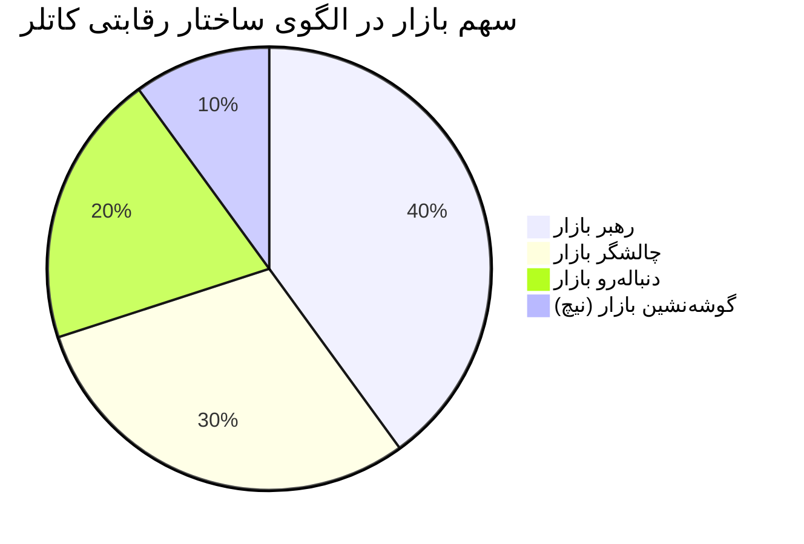
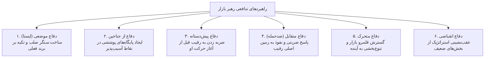

---
subject: مدیریت بازاریابی
chapter: فصل اول - کلیات بازاریابی نوین و مفاهیم بنیادین بازار
topic: تعاریف بنیادین، نیاز و خواسته، مبادله، ابعاد ۹گانه روستا، حالات ۸گانه تقاضا، فلسفه‌های بازاریابی و استراتژی‌های رقابتی
type: comprehensive-lesson
importance: 5
yield_rate: high
status: completed
source:
 - کتاب مدیریت بازاریابی و مدیریت بازار دکتر احمد روستا، داور ونوس، عبدالحمید ابراهیمی (صفحات ۲ تا ۲۰)
 - کتاب مرجع مدیریت بازاریابی فیلیپ کاتلر - ترجمه بهمن فروزنده (بخش ۱)
 - بانک تست جامع مدیریت بازاریابی دکتر جلیلیان و ابراهیمی
aliases:
 - درسنامه جامع فصل اول بازاریابی
 - کلیات بازاریابی نوین
 - خلاصه بازاریابی سه استاد فصل اول
 - ابعاد بازاریابی روستا و حالات تقاضا کاتلر
tags:
 - کنکور/بازاریابی/فصل_اول
---

# فصل اول: کلیات بازاریابی نوین و مفاهیم بنیادین بازار (درسنامه جامع و خودآموز)

> [!abstract] شناسنامه کنکوری و نقشه تسلط فصل
> - **تعداد سوال در کنکور سراسری کارشناسی ارشد:** این سرفصل سالانه بین ۱ تا ۳ تست قطعی در دفترچه ارشد مدیریت دارد (مجموعاً ۱۲ تست از ۱۰۵ تست کنکورهای اخیر مستقیماً از این مبحث طرح شده است).
> - **درجه اهمیت:** 🥇 **سنگر اصلی (فوق‌العاده بالا)**؛ زبان مشترک، شالوده مفهومی و دروازه ورود به کل علم بازاریابی است. تسلط بر تمایز نیاز و خواسته، ابعاد ۹گانه دکتر روستا و حالات هشت‌گانه تقاضا، دست‌کم ۲ تست کنکور را تضمین می‌کند.
> - **روش مطالعه:** این درسنامه یکپارچه بر پایه متد فاینمن (آموزش شهودی، روان، با مثال‌های عینی کسب‌وکار و زندگی روزمره، به دور از اضافه‌گویی کتب رفرنس) تدوین شده است. ابتدا هر مفهوم را با تمثیل آن درک کنید و سپس به سراغ جدول کپسولی و کالبدشکافی تله‌های تستی بروید.

---

## فهرست سرفصل‌های فصل اول

1. **چیستی بازاریابی و مرزهای تعریفی آن** (نگاه فیلیپ کاتلر و انجمن بازاریابی آمریکا)
2. **ده موجودیت قابل بازاریابی کاتلر** (چه چیزهایی به بازار عرضه می‌شوند؟)
3. **تثلیث بنیادین: نیاز، خواسته و تقاضا** (همراه با پنج لایه نیازهای مشتری و تفکیک بازاریاب واکنشی و خلاق)
4. **مفهوم محصول، فایده، ارزش و زنجیره مبادله** (چهار راه ارضای نیاز، شرایط پنج‌گانه مبادله و شبکه بازاریابی)
5. **مفهوم بازار، ساختار جریان‌ها و فرابازار (متابازار)**
6. **مدل ابعاد نه‌گانه بازاریابی دکتر احمد روستا** (شاه‌کلید طلایی کنکور)
7. **ماتریس جامع حالات هشت‌گانه تقاضا و وظایف بازاریابی** (الگوی کاتلر و سه استاد)
8. **سیر تحول فلسفه‌های هدایت بازار و الگوهای استقرار آن** (از گرایش تولید تا بازاریابی اجتماعی، هرم معکوس، سیر ۵ مرحله‌ای نقش بازاریابی و بازاریابی سببی)
9. **پارادایم نوین بازاریابی کل‌نگر فیلیپ کاتلر** (چهار رکن بازاریابی جامع و ماتریس چهار پی و چهار سی)
10. **سیستم بازار، ابعاد محیط بازاریابی و کانال‌های کاتلر** (محیط خرد و کلان و مثلث استراتژیک بازار)
11. **موقعیت‌ها و استراتژی‌های رقابتی در بازار** (رهبران، چالشگران، دنباله‌روها و گوشه‌نشینان)
12. **تاکتیک‌های حمله چالشگران و راهبردهای دفاعی رهبران بازار**
13. **کپسول مرور سریع، دام‌های تستی طراحان و تست‌های منتخب با رد گزینه**

---

## ۱. چیستی بازاریابی، حکمت‌های بنیادین و پویایی‌های تاریخی بازار

بازاریابی برخلاف تصور عامه، معادل فروش یا تبلیغات نیست! دو متفکر بزرگ مدیریت، شالوده بازاریابی را چنین تبیین می‌کنند:

> [!quote] حکمت بنیادین بازاریابی از دیدگاه پیتر دراکر (مرجع کاتلر، ص ۳۹): 
> «این مشتری است که تعیین می‌کند کسب‌وکار چیست؛ زیرا تنها با خرید کالا یا خدمت است که منابع اقتصادی به ثروت و اشیاء به کالا تبدیل می‌شوند. آنچه کسب‌وکار فکر می‌کند تولید می‌کند اولویت نخست نیست؛ آنچه مشتری فکر می‌کند می‌خرد و ارزش می‌داند تعیین‌کننده است... هدف بازاریابی، زائد کردن فرایند فروش است؛ یعنی شناخت و درک مشتری باید آن‌چنان دقیق باشد که کالا یا خدمت کاملاً منطبق بر او بوده و خودش خودش را بفروشد!»

> [!quote] نگاه فراگیر به بازاریابی از دیدگاه ای. ریموند کوری (مرجع کاتلر، ص ۳۹): 
> «بازاریابی فقط یک وظیفه یا کارکرد مستقل مانند تولید، مالی یا پرسنلی نیست؛ بسیار فراتر از آن است و کل کسب‌وکار را در بر می‌گیرد که از منظر نتیجه نهایی یعنی نگاه مشتری نگریسته می‌شود. مسئولیت بازاریابی باید در تمام تار و پود سازمان رخنه کند.»

### درس‌آموخته تاریخی از پویایی بازار: سرنوشت غول‌های خودروسازی آمریکا (مرجع کاتلر، ص ۴۰):
فیلیپ کاتلر برای اثبات اینکه بازاریابی یک فرایند زنده و پویاست، تاریخ صنعت خودروسازی را مثال می‌زند:
- **دهه ۱۹۲۰ (عصر فورد):** هنری فورد با مدل T سیاه و ارزان‌قیمت، بر تولید انبوه تمرکز کرد («هر رنگی بخواهید، به شرطی که سیاه باشد!»).
- **جهش جنرال موتورز (آلفرد اسلون):** جنرال موتورز با فلسفه بازاریابی نوین وارد شد و بازار را بخش‌بندی کرد: *«یک اتومبیل برای هر کیف پول و هر هدفی»* (شورولت برای طبقه کارگر، پونتیاک، بیوک، اولدزموبیل و کادیلاک برای قشر مرفه). جنرال موتورز فورد را پشت سر گذاشت.
- **دهه ۱۹۶۰ و ۱۹۷۰ (ورود فولکس‌واگن و ژاپنی‌ها):** با افزایش قیمت بنزین و ترافیک، فولکس‌واگن بیتل کم‌مصرف و سپس خودروسازان ژاپنی (تویوتا، هوندا، نیسان) با کیفیت بالا، مصرف بهینه و قیمت مناسب، سهم بازار غول‌های دیترویت را تصاحب کردند.
- **نتیجه استراتژیک:** شرکت‌هایی که در گذشته موفق بوده‌اند، در صورت عدم رصد پیوسته تغییرات محیطی و سلیقه خریداران، به ورطه سقوط کشیده می‌شوند.

### تعاریف استاندارد و کنکوری بازاریابی:

* **تعریف فیلیپ کاتلر (مرجع کلاسیک - کاتلر، ص ۳۹ و ۴۴):** 
 بازاریابی عبارت است از یک فرایند اجتماعی و مدیریتی که به وسیله آن، افراد و گروه‌ها از طریق تولید، ایجاد و مبادله کالاها و ارزش‌ها با دیگران، نیازها و خواسته‌های خود را برآورده می‌سازند.
* **تعریف وظیفه‌ای کاتلر:** 
 فعالیت انسانی در جهت ارضای نیازها و خواسته‌ها از طریق فرایند مبادله.
* **تعریف جامع کتاب سه استاد (روستا، ونوس، ابراهیمی - کتاب سه استاد، ص ۳):** 
 **«تلاش در جهت از قوه به فعل درآوردن مبادلات برای ارضای نیازها و خواسته‌های بشر.»**
* **تعریف انجمن بازاریابی آمریکا (مرجع کاتلر، ص ۵۲ و ۵۳):** 
 **«مدیریت بازاریابی عبارت است از فرآیند برنامه‌ریزی و اجرای پندار (ایده)، قیمت‌گذاری، تبلیغات پیشبردی و توزیع ایده‌ها، کالاها و خدمات، به قصد انجام مبادلاتی که به تأمین اهداف انفرادی و سازمانی منجر گردد.»**

> [!important] کالبدشکافی ارکان چهارگانه تعریف AMA و جوهره مدیریت بازاریابی (مرجع کاتلر، ص ۵۲ و ۵۳):
> فیلیپ کاتلر چهار رکن اساسی را در این تعریف برجسته می‌سازد:
> 1. **رویکرد فرآیندی و ساختاریافته:** شامل چهار گام پیاپی **تجزیه و تحلیل، برنامه‌ریزی، اجرا و کنترل**.
> 2. **شمول عام پیشنهادها:** تنها محدود به کالای فیزیکی نیست، بلکه کالاها، خدمات ناملموس و ایده‌ها را در بر می‌گیرد.
> 3. **تکیه بر قصد مبادله:** نقطه پیوند فعالیت‌ها، تحقق مبادله رضایت‌بخش است.
> 4. **تأمین هم‌زمان اهداف:** خلق رضایت برای مشتری و تحقق سودآوری برای سازمان.
>
> 🎯 **شاه‌فرمول کنکوری کاتلر:** 
> **«مدیریت بازاریابی در واقع همان مدیریت تقاضاست!»** 
> وظیفه بازاریابی صرفاً تحریک کورکورانه تقاضا نیست؛ بلکه **تأثیر گذاشتن بر سطح، زمان‌بندی و ماهیت تقاضا** به شیوه‌ای است که سازمان را به اهداف خود برساند.
>
> 👥 **بازاریابان تمام‌وقت در برابر بازاریابان نیمه‌وقت درون سازمان (مرجع کاتلر، ص ۵۳):** 
> - **بازاریابان نیمه‌وقت:** معاونت منابع انسانی با «بازار نیروی کار» تعامل دارد و معاونت خرید/تدارکات با «بازار مواد اولیه» دادوستد می‌کند؛ بنابراین هر دو در حال بازاریابی هستند. 
> - **بازاریابان حرفه‌ای و تمام‌وقت:** مدیران بازاریابی، فروش و خدمات مشتریان هستند که مستقیماً بر «بازار مصرف‌کنندگان و مشتریان نهایی» تمرکز دارند.

> [!note] بستر تاریخی و گسترش قلمرو بازاریابی (کتاب سه استاد، ص ۳):
> - **ریشه تحول:** پس از پایان جنگ سرد در دهه ۱۹۹۰ و آزادسازی منابع، رقابت به شدت افزایش یافت. شرکت‌هایی که صرفاً به دنبال سود لحظه‌ای بودند شکست خوردند، اما شرکت‌های پیشرو (مانند تری‌ام (3M) و مک‌دونالدز) به دلیل تمرکز بر نیاز مشتری، بازارهای هدف و ایجاد انگیزه در کارکنان به موفقیت‌های چشمگیر رسیدند.
> - **بازاریابی در سازمان‌های غیرتجاری و غیرانتفاعی (کتاب سه استاد، ص ۳):** بازاریابی تنها مخصوص شرکت‌های انتفاعی نیست؛ بلکه موزه‌ها، دانشگاه‌ها، بیمارستان‌ها، مراکز مذهبی و نهادهای دولتی نیز از بازاریابی به عنوان «وسیله‌ای مؤثر برای برقراری ارتباط با مردم و خدمت‌رسانی بهتر» استفاده می‌کنند.

> [!tip] تفاوت جوهری بازاریابی با فروش:
> * **فروش:** از کارخانه و محصول موجود شروع می‌شود، تمرکزش بر متقاعدسازی مشتری برای تبدیل کالا به پول نقد است و سود را در **حجم فروش** جستجو می‌کند.
> * **بازاریابی:** از بازار و نیاز مصرف‌کننده شروع می‌شود، تمرکزش بر حل مسئله مشتری و خلق ارزش است و سود را در **رضایت پایدار مشتری** به دست می‌آورد.

---

## ۲. ده موجودیت قابل بازاریابی کاتلر (چه چیزهایی به بازار عرضه می‌شوند؟)

طراحان کنکور معمولاً با ذکر یک سناریوی کاربردی می‌پرسند: این فعالیت مربوط به بازاریابی کدام موجودیت است؟ فیلیپ کاتلر قلمرو بازاریابی را به ۱۰ موجودیت متمایز توسعه داده است:

| ردیف | موجودیت قابل بازاریابی | مفهوم و کارکرد در بازار | مثال عینی و کاربردی |
|:--- |:--- |:--- |:--- |
| **۱** | **کالاها** | اشیای فیزیکی و ملموس که تولید، انبار و مصرف می‌شوند. | خودرو، لپ‌تاپ، مواد غذایی، گوشی تلفن همراه |
| **۲** | **خدمات** | فعالیت‌ها یا منافع ناملموسی که هم‌زمان تولید و مصرف می‌شوند و انبارشدنی نیستند. | خطوط هوایی، هتل‌داری، خدمات بانکی، بیمه، آرایشگری |
| **۳** | **رویدادها** | برنامه‌های زمان‌دار و دوره‌ای که برای مخاطبان معین برگزار می‌شوند. | المپیک، جام جهانی فوتبال، نمایشگاه‌های بین‌المللی |
| **۴** | **تجربه‌ها** | ترکیب هوشمندانه چند کالا و خدمت برای خلق حس و خاطره‌ای ماندگار در ذهن مشتری. | دیزنی‌لند، اتاق فرار، تورهای ماجراجویی کویرنوردی |
| **۵** | **اشخاص** | ساخت برند شخصی برای افراد مشهور، متخصصان، هنرمندان و مدیران. | بازاریابی هنرمندان، ورزشکاران حرفه‌ای، کاندیداهای انتخابات |
| **۶** | **مکان‌ها** | جذب گردشگران، سرمایه‌گذاران، کارآفرینان و ساکنان جدید به یک منطقه جغرافیایی. | کمپین‌های گردشگری شهرها (مانند «کیش مروارید خلیج فارس»، برندسازی دبی) |
| **۷** | **اموال و دارایی‌ها** | حقوق مالکیت نامشهود برای دارایی‌های فیزیکی (املاک) یا مالی (اوراق بهادار). | معاملات سهام در بورس، آژانس‌های املاک و مستغلات |
| **۸** | **سازمان‌ها** | ایجاد وجهه مثبت عمومی، مشروعیت اجتماعی و اعتبار نهادی برای تشکل‌ها. | تبلیغات برند کارفرمایی، کمپین‌های اعتمادسازی هلال احمر یا دانشگاه‌ها |
| **۹** | **اطلاعات** | تولید، بسته‌بندی و توزیع داده‌ها، محتوای تخصصی و دانش کاربردی. | دانشنامه‌ها، پایگاه‌های داده علمی، وب‌سایت‌های ارائه‌دهنده تحلیل‌های آماری |
| **۱۰** | **ایده‌ها** | ترویج باورها، مفاهیم فکری، الگوهای رفتاری و تغییر نگرش در سطح جامعه. | کمپین ترک سیگار، فرهنگ‌سازی تفکیک زباله از مبدأ، تشویق به رانندگی ایمن |

---

## ۳. تثلیث بنیادین: نیاز، خواسته و تقاضا (مرجع کاتلر، ص ۴۶ و ۴۷)

یادگیری تمایز این سه مفهوم، تست‌خیزترین بخش کلیات بازاریابی است و طراحان کنکور معمولاً با جابه‌جا کردن تعاریف آن‌ها، تله تستی می‌سازند:

> [!tip] نقشه مفهومی زنجیره بازاریابی کاتلر (مرجع کاتلر، ص ۴۶، شکل ۱-۱):
> فیلیپ کاتلر شالوده علم بازاریابی را یک زنجیره پیوسته هفت‌حلقه‌ای می‌داند: 
> **نیازها، خواسته‌ها و تقاضا** $\leftarrow$ **کالاها (محصولات، خدمات و ایده‌ها)** $\leftarrow$ **فایده، هزینه و رضامندی** $\leftarrow$ **مبادله و معاملات** $\leftarrow$ **روابط و شبکه‌ها** $\leftarrow$ **بازارها** $\leftarrow$ **بازاریابان و مشتریان بالقوه**.

### ۱. نیاز (مرجع کاتلر، ص ۴۶ و ۴۷):
* **تعریف:** بیان‌کننده حالت محرومیت احساس‌شده در یک فرد است. نیازها جنبه بیولوژیک و فطری دارند (نیاز به غذا، هوا، آب، پوشاک، پناهگاه، امنیت، احساس تعلق و احترام).
* **شاه‌نکته کنکوری:** بازاریاب‌ها نیاز را به وجود نمی‌آورند! نیازها از پیش در بافت حیاتی و روان انسان ریشه داشته‌اند؛ بازاریاب صرفاً آن‌ها را بیدار کرده و راه‌حل ارضای آن را پیشنهاد می‌دهد.

### ۲. خواسته (مرجع کاتلر، ص ۴۷):
* **تعریف:** میل و علاقه به اقلام خاصی است که برطرف‌کننده نیاز بنیادین هستند و تحت تأثیر **فرهنگ، خرده‌فرهنگ، نهادهای اجتماعی (مدرسه، خانواده، دین) و شخصیت فردی** شکل می‌گیرند.
* *مثال ملموس و تطبیقی کاتلر:* یک فرد گرسنه در جامعه آمریکا خواهان همبرگر، سیب‌زمینی سرخ‌کرده و یک بطری کوکاکولاست؛ اما یک فرد گرسنه در جزیره موریس (اقیانوس هند) خواهان برنج، انبه، عدس و لوبیا است! اگرچه نیازهای انسان محدود است، اما خواسته‌های او بی‌نهایت، متنوع و مدام در حال تحول است.

### ۳. تقاضا (مرجع کاتلر، ص ۴۷):
* **تعریف:** تقاضا همان خواستار شدن محصولات خاصی است که با **توانایی و تمایل به خرید (قدرت خرید و پول نقد)** پشتیبانی شده باشد.
* *مثال ملموس کاتلر:* بسیاری از مردم در سراسر جهان خواهان سوار شدن بر اتومبیل مرسدس بنز هستند؛ اما تنها کسانی تقاضای واقعی مرسدس را تشکیل می‌دهند که اراده و توان پرداخت بهای گزاف آن را داشته باشند.
* > [!question] آیا بازاریاب‌ها با تبلیغات، نیازهای کاذب خلق می‌کنند؟ (پاسخ کاتلر به منتقدان - مرجع کاتلر، ص ۴۷):
 > منتقدان می‌گویند بازاریابان مردم را فریب داده و وادار به خرید چیزهایی می‌کنند که به آن نیازی ندارند. کاتلر قاطعانه پاسخ می‌دهد: **خیر!** نیاز به منزلت اجتماعی، تشخص و احترام، از هزاران سال قبل از پیدایش علم بازاریابی در انسان وجود داشته است. بازاریابان این نیاز را خلق نمی‌کنند، بلکه با **جذاب کردن، متناسب‌سازی، قابل تحمل کردن خرید (فروش اقساطی) و تسهیل دسترسی**، تمایلات را به سمت محصولات خود هدایت کرده و بر **تقاضا** تأثیر می‌گذارند.

### پنج لایه نیازهای مشتری از نگاه فیلیپ کاتلر:
کاتلر تأکید می‌کند که مشتریان همیشه دقیقاً آنچه را می‌خواهند به زبان نمی‌آورند؛ بنابراین بازاریاب حرفه‌ای باید پنج لایه نیاز را موشکافی کند:
1. **نیازهای تصریح‌شده (بیان‌شده):** نیازهایی که مشتری مستقیماً بر زبان می‌آورد؛ مثلاً می‌گوید یک اتومبیل ارزان‌قیمت می‌خواهم.
2. **نیازهای واقعی:** نیت واقعی و بنیادین خریدار؛ مثلاً اتومبیلی که هزینه نگهداری و مصرف سوخت آن پایین باشد، نه اینکه صرفاً قیمت خرید اولیه آن کم باشد.
3. **نیازهای تصریح‌نشده (بدیهی و ضمنی):** انتظارات طبیعی که مشتری حتی مطرح نمی‌کند ولی انتظار قطعی دارد؛ مثلاً گارانتی معتبر و احترام پرسنل فروش.
4. **نیازهای لذت‌بخش (شوق‌انگیز):** ویژگی‌های فراتر از انتظاری که وجودشان مشتری را شگفت‌زده و ذوق‌زده می‌کند؛ مثلاً دریافت رایگان نقشه جامع راه‌ها یا اشانتیون کاربردی هنگام تحویل کالا.
5. **نیازهای پنهان:** انگیزه‌های روانی و اعتباری درونی؛ مثلاً تمایل به اینکه نزد دوستان فردی زرنگ، ارزش‌شناس و صاحب سلیقه ممتاز شناخته شود.

### بازاریاب واکنشی در برابر بازاریاب خلاق (دیدگاه گری همل و پراهالاد):
کاتلر با استناد به نظریه گری همل و سی.کی. پراهالاد، نحوه مواجهه شرکت‌ها با نیازهای مشتریان را به دو رویکرد استراتژیک تفکیک می‌کند:

| بعد مقایسه | بازاریاب واکنشی | بازاریاب خلاق |
|:--- |:--- |:--- |
| **تعریف و جهت‌گیری** | شرکت به دنبال شناخت و ارضای **نیازهای اظهارشده** فعلی است (حرکت پشت سر نیاز مشتری). | شرکت به دنبال کشف و ارضای **نیازهای پنهان و ناگفته** است که مشتری هرگز نمی‌پرسد اما مشتاقانه به آن پاسخ می‌دهد (آفریننده بازار). |
| **منطق استراتژیک** | تمرکز بر نظرسنجی و رفع نواقص اعلام‌شده توسط خریداران فعلی. | خلق راه‌حل‌های نوآورانه و تحول‌آفرین که سبک زندگی بازار را دگرگون می‌سازد. |
| **مثال برجسته دنیای کسب‌وکار** | ارتقای دوره‌ای قدرت موتور یا نصب سانروف بنا به تقاضای بازار. | اختراع واکمن و پلی‌استیشن توسط شرکت سونی؛ آکیو موریتا بنیان‌گذار سونی می‌گوید: شرکت ما به بازار خدمت نمی‌کند، بلکه آفریننده بازار است. |

---

## ۴. مفهوم محصول، فایده، ارزش و زنجیره مبادله (مرجع کاتلر، ص ۴۷ و ۴۸ و کتاب سه استاد، ص ۴)

### اجزای سه‌گانه محصول و پیشنهاد بازار (مرجع کاتلر، ص ۴۷):
از دیدگاه کاتلر، هر پیشنهاد عرضه در بازار از ۳ جزء درهم‌تنیده تشکیل می‌شود:
1. **کالای فیزیکی و ملموس:** جسم مادی و فیزیکی.
2. **خدمات ناملموس:** منافع و فعالیت‌های تسهیل‌کننده همراه.
3. **ایده و ارزش نمادین:** بار مفهومی، پرستیژ و کارکرد ذهنی.

* *مثال‌های عینی و تطبیقی کاتلر (ص ۴۷):*
 - **رستوران فست‌فود:** کالای فیزیکی (همبرگر، سیب‌زمینی سرخ‌کرده و نوشابه) + خدمات (خرید مواد اولیه، پخت، نظافت، تدارک میز و صندلی) + ایده (صرفه‌جویی در وقت ارزشمند مشتری).
 - **کلیسای جامع:** کالای فیزیکی (عصاره انگور و نان مقدس) + خدمات (موعظه، سرودخوانی، آموزش دینی، مشاوره و دعا) + ایده (ایمان، اخلاق، همبستگی و رستگاری).
 - **تولیدکننده کامپیوتر:** کالای فیزیکی (کامپیوتر، مانیتور، چاپگر) + خدمات (تحویل، نصب، نگهداری، گارانتی، تعمیر) + ایده (توان محاسبه و هوشمندی).

> [!important] انفجار بخش خدمات و بازتعریف کالاهای فیزیکی (مرجع کاتلر، ص ۴۷ و ۴۸):
> در اقتصادهای پیشرفته امروزی، **حدود ۷۰ درصد تولید ناخالص ملی و اشتغال به بخش خدمات اختصاص دارد.** کاتلر تأکید می‌کند اهمیت محصولات فیزیکی نه به خاطر مالکیت خود آن‌ها، بلکه به خاطر خدماتی است که ارائه می‌دهند! 
> **«محصولات فیزیکی صرفاً وسایلی نقلیه برای ارائه و بسته‌بندی خدمات به مشتری هستند.»** 
> *(مثال کلاسیک: خرید اتومبیل برای خدمت حمل‌ونقل است، اجاق گاز و مایکروویو برای پخت‌وپز است، و همان‌طور که لئو مک‌گیونا می‌گوید: آنچه یک نجار می‌خرد مته نیست، بلکه او به دنبال ایجاد سوراخی با قطر معین است!).* فروشندگانی که به جای تفکر درباره نیاز مشتری، غرق در مشخصات فیزیکی کالا می‌شوند، گرفتار نزدیک‌بینی بازاریابی هستند.

### مدل انتخاب، فایده (مطلوبیت)، هزینه و رضامندی (مرجع کاتلر، ص ۴۸):
مصرف‌کننده چگونه از میان انبوه محصولات دست به انتخاب می‌زند؟ کاتلر این فرایند را با **الگوی تصمیم‌گیری تام مور** تشریح می‌کند:
- **مسئله:** تام مور باید هر روز ۳ مایل مسافت را برای رسیدن به محل کار طی کند.
- **سبد محصولات در دسترس:** اسکیت، دوچرخه، موتور سیکلت، اتومبیل شخصی، تاکسی، اتوبوس شهری.
- **سبد نیازهای تام مور:** سرعت، ایمنی، راحتی و سهولت، صرفه اقتصادی.
- **فرایند ارزیابی:** دوچرخه آهسته‌تر و کم‌امنیت‌تر است اما کاملاً اقتصادی است؛ اتومبیل شخصی سریع و ایمن و راحت است اما هزینه بنزین و استهلاک بالایی دارد.
- **معیار نهایی انتخاب:** تام مور محصولی را انتخاب می‌کند که به ازای هر ریال پرداختی، بیشترین فایده خالص (رضامندی منهای هزینه فرصت‌های از دست‌رفته) را برای سبد نیازهایش تولید کند.

> [!quote] تعریف استاندارد فایده و مطلوبیت از دیدگاه دی‌رز (مرجع کاتلر، ص ۴۸): 
> «فایده عبارت است از تأمین نیازهای مشتری، همراه با رضامندی، که با حداقل هزینه ممکنِ به‌دست آوردن، مالکیت و استفاده حاصل می‌شود.»

### چهار روش ارضای نیاز در جامعه (کتاب سه استاد، ص ۴ و کاتلر، ص ۴۸):
انسان در طول تاریخ نیازهای خود را از ۴ طریق تأمین کرده است:
1. **تولید شخصی (خودتولیدی):** فرد خودش شکار می‌کند، گندم می‌کارد یا لباس می‌دوزد. در اینجا بازاری شکل نمی‌گیرد.
2. **استعانت از دیگران (کمک‌خواهی):** طلب غذا از دیگران به عنوان صدقه یا کمک بلاعوض بدون ارائه مابه‌ازای مادی (گدایی، خیریه).
3. **اعمال زور و اجبار:** تصاحب با غارت، دزدی یا سلاح فیزیکی. در اینجا رضایت دوطرفه وجود ندارد.
4. **مبادله:** کسب محصول مورد نظر از طریق ارائه چیزی باارزش به طرف مقابل به عنوان مابه‌ازا. **علم بازاریابی دقیقاً از همین نقطه متولد می‌شود.**

### شرایط پنج‌گانه تحقق مبادله (کتاب سه استاد، ص ۴ و کاتلر، ص ۴۸):
برای اینکه مبادله صورت گیرد، باید ۵ شرط هم‌زمان وجود داشته باشد (کتاب سه استاد بر ۳ شرط نخست تأکید کرده و کاتلر ۵ شرط را برمی‌شمارد):
1. **حداقل دو طرف** حضور داشته باشند.
2. هر طرف دارای چیزی باشد که **برای طرف دیگر ارزش داشته باشد**.
3. هر طرف **توانایی برقراری ارتباط و تحویل** را داشته باشد.
4. هر طرف در **رد یا قبول پیشنهاد مبادله کاملاً آزاد** باشد.
5. هر طرف باور داشته باشد که معامله با طرف مقابل، **مناسب، منطقی و پسندیده** است.

### تمایزهای ظریف کنکوری: مبادله، معامله، مذاکره و انتقال (مرجع کاتلر، ص ۴۹ و ۵۰):
طراحان کنکور این مفاهیم را بسیار دقیق به چالش می‌کشند:

| مفهوم | تعریف و کارکرد | شرایط و ویژگی‌های بنیادین |
|:--- |:--- |:--- |
| **مبادله** | **یک فرایند رفتاری و اجتماعی است.** | طرفین در حال گفت‌وگو و ارزیابی شروط برای ارتقای وضعیت خود نسبت به قبل از مبادله هستند. |
| **مذاکره** | **تلاش برای دستیابی به توافق متقابل.** | چانه‌زنی بر سر شروط، قیمت، گارانتی و نحوه تحویل؛ در اثر مذاکره طرفین یا به توافق می‌رسند یا معامله منتفی می‌شود (کاتلر، ص ۵۰). |
| **معامله** | **رویداد نهایی و واحد اندازه‌گیری مبادله است.** | توافق قطعی بر سر حداقل دو شیء باارزش، زمان توافق، مکان توافق و چارچوب حقوقی. شامل دو دسته است: **۱) معامله پولی کلاسیک** (پرداخت پول در ازای کالا)، **۲) معامله پایاپای و تهاتری** (مانند تنظیم وصیت‌نامه توسط وکیل در ازای معاینه پزشکی توسط پزشک) (کاتلر، ص ۴۹). |
| **انتقال** | واگذاری یک‌طرفه ارزش بدون دریافت مابه‌ازای مادی مستقیم. | مانند اعانه، هدیه، وقف، اهدای خون یا رأی سیاسی. **نکته کنکوری کاتلر:** بازاریابی مدرن مفهوم مبادله را به انتقال نیز بسط داده است؛ زیرا در انتقال هم مابه‌ازای معنوی و رفتاری (احساس رضایت خاطر، شهرت اجتماعی، سپاسگزاری، دعوت به مجالس ویژه) نهفته است. |

> [!tip] 🖼️ **ارجاع به تصویر کتاب:** مطالعه موردی نقشه مبادله دوطرفه کاترپیلار (شکل ۲-۱، صفحه ۵۰ کتاب مرجع کاتلر):
> برای مشاهده ساختار نقشه مبادله متقابل، به **شکل ۲-۱ (صفحه ۵۰ مرجع کاتلر)** مراجعه کنید. کاتلر نشان می‌دهد چگونه یک بازاریاب موفق باید انتظارات و خواسته‌های دو طرف را شناسایی و هم‌راستا سازد:
> - **فهرست خواسته‌های خریدار (شرکت ساختمانی):** ۱) تجهیزات با دوام و باکیفیت بالا، ۲) قیمت عادلانه، ۳) تحویل به موقع تجهیزات، ۴) شرایط مالی خرید مطلوب (تسهیلات و پرداخت اقساطی)، ۵) قطعات یدکی و خدمات پس از فروش مطمئن.
> - **فهرست خواسته‌های فروشنده (شرکت کاترپیلار):** ۱) قیمت فروش سودآور، ۲) دریافت به موقع وجوه، ۳) تبلیغات دهان‌به‌دهان مطلوب خریدار در بازار.
> - **نتیجه تحلیلی:** وظیفه بازاریاب کشف اهمیت نسبی تک‌تک این خواسته‌ها نزد مشتری و ایجاد بیشترین تناسب ممکن میان آنهاست تا مبادله شکل گیرد.

### بازاریاب در برابر مشتری بالقوه:
* **بازاریاب:** طرفی است که در فرایند مبادله **به شکل فعالانه‌تری** در جستجوی دریافت واکنش (خرید، رأی، کمک، توجه) از طرف دیگر است.
* **مشتری بالقوه:** طرفی است که بازاریاب تشخیص می‌دهد توانایی و تمایل بالقوه برای معامله را دارد.
* > [!danger] دو دام تستی بسیار مهم کاتلر:
 > ۱. **بازاریاب لزوماً فروشنده نیست!** اگر خریداران در شرایط کمبود شدید کالا (مثلاً پیش‌فروش خودرو یا خرید مسکن در اوج رونق) برای جلب نظر فروشنده به تکاپو بیفتند و امتیاز پیشنهاد دهند، **خریدار بازاریاب است و فروشنده مشتری بالقوه!**
 > ۲. **بازاریابی دوجانبه:** اگر هر دو طرف مبادله به شکلی فعال و هم‌زمان در پی انجام معامله باشند و به یکدیگر امتیاز پیشنهاد کنند، هر دو طرف بازاریاب هستند و این پدیده بازاریابی دوجانبه نامیده می‌شود.

### نتیجه غایی بازاریابی رابطه‌مند: ایجاد شبکه بازاریابی
فیلیپ کاتلر تأکید می‌کند که نتیجه نهایی بازاریابی رابطه، خلق یک دارایی استراتژیک منحصر‌به‌فرد به نام **شبکه بازاریابی** است. 
* **تعریف:** شبکه‌ای پایدار شامل شرکت و تمام ذی‌نفعان کلیدی آن (مشتریان وفادار، کارکنان، تأمین‌کنندگان، توزیع‌کنندگان، خرده‌فروشان و آژانس‌های تبلیغاتی). 
* **قاعده طلایی عصر جدید:** در اقتصاد نوین، رقابت دیگر میان تک‌شرکت‌ها جریان ندارد؛ بلکه **رقابت میان شبکه‌های بازاریابی** برقرار است! هر شرکتی که شبکه ارزش منسجم‌تر و وفادارتری ساخته باشد، برنده میدان رقابت است.

---

## ۵. مفهوم بازار، ساختار جریان‌ها و فرابازار (متابازار) (مرجع کاتلر، ص ۵۰ تا ۵۲ و کتاب سه استاد، ص ۴)

### تعاریف بازار:
* **تعریف در علم اقتصاد:** مکان یا بستری فیزیکی و انتزاعی که خریداران و فروشندگان برای تبادل کالاها و شکل‌گیری قیمت تعادلی حضور می‌یابند. ریشه تاریخی این واژه به میدان مرکزی دهکده‌ها بازمی‌گردد که افراد برای مبادله محصولات گرد هم می‌آمدند (کاتلر، ص ۵۰).
* **تعریف در کتاب سه استاد (روستا، ونوس، ابراهیمی - کتاب سه استاد، ص ۴):** 
 **«محلی برای مبادلات بالقوه.»** 
 *شاه‌نکته کنکوری (کتاب سه استاد، ص ۴):* از دیدگاه سه استاد، **اگر برای محصول یا خدمت ما حتی یک نفر هم وجود داشته باشد، می‌توانیم بگوییم بازار وجود دارد!** اندازه بازار منحصراً به دو عامل وابسته است: ۱) علاقمندی فرد به محصول، ۲) در اختیار داشتن منابع لازم و آمادگی برای مبادله آن منابع.
* **تعریف در مدیریت بازاریابی (کاتلر، ص ۵۰):** 
 بازاریابان واژه بازار را **فقط برای خریداران** به کار می‌برند! بازار یعنی مجموعه تمام خریداران بالقوه و بالفعلی که نیاز یا خواسته مشترک داشته و حاضر و قادر به مبادله برای رفع آن هستند. (در بازاریابی، مجموعه فروشندگان را **صنعت** می‌نامند).

> [!tip] 🖼️ **ارجاع به تصویر کتاب:** جریان‌های چهارگانه میان صنعت و بازار (شکل ۳-۱، صفحه ۵۱ مرجع کاتلر):
> به **شکل ۳-۱ (صفحه ۵۱ مرجع کاتلر)** مراجعه کنید. صنعت و بازار با چهار جریان به یکدیگر پیوند می‌خورند: 
> ۱) **کالاها و خدمات:** جریان فیزیکی از صنعت (فروشندگان) به بازار (خریداران). 
> ۲) **ارتباطات:** تبلیغات، ترویج و پیام‌ها از صنعت به بازار. 
> ۳) **پول و منابع مالی:** جریان مالی برگشتی از بازار به صنعت در ازای خرید. 
> ۴) **اطلاعات و بازخورد:** داده‌های رفتار مصرف‌کننده، نظرات و پژوهش‌های بازار از خریداران به صنعت.

### ساختار جریانات در یک اقتصاد مبادلاتی نوین (شکل ۴-۱، صفحه ۵۱ مرجع کاتلر):
کاتلر ۵ بازار اساسی و چرخه‌های مبادلاتی متصل به آن‌ها را در قالب یک نظام به هم پیوسته تعریف می‌کند:
1. **بازارهای منابع:** تأمین‌کننده زمین، نیروی کار، مواد خام، ماشین‌آلات و سرمایه که در ازای پول، منابع را به بازارهای تولیدکننده و دولتی می‌رسانند.
2. **بازارهای تولیدکننده:** تبدیل منابع اولیه به کالاها و خدمات نهایی و ارسال آن‌ها به بازارهای واسطه‌ای.
3. **بازارهای واسطه‌ای:** عمده‌فروشان و خرده‌فروشان که کالاها را خریداری کرده و در ازای پول به دست مصرف‌کنندگان می‌رسانند.
4. **بازارهای مصرف‌کننده:** افراد و خانوارهایی که با عرضه نیروی کار خود به بازارهای منابع دستمزد می‌گیرند و آن را صرف خرید کالا و خدمات نهایی می‌کنند.
5. **بازارهای دولتی:** دریافت مالیات از تمام ۴ بازار فوق، و در مقابل، خرید کالا و خدمات از تولیدکنندگان و واسطه‌ها و ارائه خدمات عمومی، امنیت و زیرساخت‌ها به جامعه.

> [!tip] 🖼️ **ارجاع به تصویر کتاب:** بازیگران و نیروهای اصلی در سیستم بازاریابی نوین (شکل ۵-۱، صفحه ۵۲ مرجع کاتلر):
> برای مشاهده زنجیره عملیاتی بازار، به **شکل ۵-۱ (صفحه ۵۲ مرجع کاتلر)** مراجعه کنید. بازیگران زنجیره عبارت‌اند از: 
> **عرضه‌کنندگان مواد اولیه** $\rightarrow$ **شرکت (بازاریاب) و رقبا** $\rightarrow$ **واسطه‌های بازاریابی** $\rightarrow$ **بازار مصرف‌کننده نهایی**؛ 
> که تمام این حلقه در بستری از **نیروهای شش‌گانه محیط کلان** (جمعیت‌شناختی، اقتصادی، طبیعی/فیزیکی، تکنولوژیکی، سیاسی/قانونی و فرهنگی/اجتماعی) احاطه شده است.

### تفکیک مفاهیم مدرن فضا و بازار:
* **بازارگاه فیزیکی:** بازار فیزیکی، ملموس و دارای موقعیت جغرافیایی مشخص (مثل بازار بزرگ، فروشگاه‌های زنجیره‌ای، مغازه‌های سنتی).
* **بازارگاه مجازی:** بسترهای دیجیتال مبتنی بر اینترنت و وب، بدون محدودیت مکانی و زمانی (مثل فروشگاه‌های آنلاین، بازارهای الکترونیکی و پلتفرم‌های مجازی).
* **فرابازار (مفهوم کلیدی موهان ساونی):** 
 فرابازار عبارت است از **خوشه‌ای از کالاها و خدمات مکمل و مرتبط در ذهن مصرف‌کننده که همگی حول یک فعالیت محوری یا رویداد مشخص شکل گرفته‌اند**، هرچند که در صنایع و اصناف کاملاً متفاوتی تولید شوند.
 * *مثال فرابازار خودرو:* مشتری وقتی تصمیم به خرید اتومبیل می‌گیرد، ذهنش فقط درگیر کارخانه سازنده نیست؛ بلکه به وام بانکی، بیمه شخص ثالث، معاینه فنی، دزدگیر، تعمیرگاه معتبر، بنزین و پلتفرم‌های آگهی نیز نیاز دارد. پلتفرم‌های جامع اینترنتی نقش **فرامتعامل‌گر (واسطه متمرکز فرابازار)** را ایفا کرده و تمام این خدمات پراکنده را در یک درگاه واحد گرد هم می‌آورند.
 * *مثال‌های دیگر فرابازار:* فرابازار مسکن (ملک، وام، معمار، دفترخانه، بیمه آتش‌سوزی)، فرابازار ازدواج (تالار، مزون، آتلیه، طلا، گل‌آرایی).

### فرمول و عوامل تعیین‌کننده اندازه بازار:
$$\text{Market Size} = f(N \times P \times A)$$
*(اندازه بازار تابع مستقیمی از: تعداد افراد علاقه‌مند بالقوه × توان مالی و قدرت پرداخت × دسترسی فیزیکی و توزیعی)*

---

## ۶. مدل ابعاد نه‌گانه بازاریابی دکتر احمد روستا (شاه‌کلید کنکور) (کتاب سه استاد، ص ۵ و ۶)

دکتر احمد روستا (پدر بازاریابی نوین ایران)، ساختار جامع مدیریت بازار را در قالب **۹ بعد هماهنگ** تدوین کرده است (کتاب سه استاد، ص ۵ و ۶). طراحان کنکور ارشد همواره سناریوهایی طرح می‌کنند که پاسخ آن یکی از این ابعاد ۹گانه است:

| بعد بازاریابی | کلیدواژه مفهومی و تعریف استاندارد کتاب سه استاد (ص ۵ و ۶) | مثال عینی و کاربردی در کسب‌وکار |
|:--- |:--- |:--- |
| **۱. بازارگرایی** | نهادینه کردن تفکر توجه به بازار و نیاز مشتری به عنوان فرهنگ و بینش مشترک تمام کارکنان و مدیران سازمان (اولین ویژگی بازاریابی جدید). | مدیرعاملی که در آموزش تمام کارمندان جدید، ارزش مشتری‌مداری و شنیدن صدای خریدار را جا می‌اندازد. |
| **۲. بازارشناسی** | «شناخت، لازمه هر حرکت عاقلانه و تصمیم اصولی است». تلاش نظام‌مند برای گردآوری، ضبط و ثبت اطلاعات همه اجزای نظام بازار و عوامل مؤثر بر آن با تحقیقات بازار. | ارسال پرسشنامه، مصاحبه با مشتریان و تحلیل داده‌های رفتار خرید کاربران در وب‌سایت. |
| **۳. بازاریابی** | جستجو برای یافتن مناسب‌ترین بخش‌های بازار و انطباق سبد محصولات با آن‌ها؛ یعنی **بخش‌بندی (تقسیم بازار)** و تعیین محصولات مناسب برای هر بخش. | شرکت خودروسازی که تصمیم می‌گیرد یک خودروی هاچ‌بک اقتصادی را برای قشر جوان دانشجو عرضه کند. |
| **۴. بازارسازی** | نفوذ در بازار، معرفی و شناساندن سازمان و محصولات با به‌کارگیری درست عوامل قابل کنترل بازاریابی (چهار پی: محصول، قیمت، توزیع، ترفیع) جهت کسب جایگاه و سهم بازار بیشتر. | اجرای کمپین تبلیغاتی پر سر و صدا، طراحی بسته‌بندی جذاب و تخفیف‌های ویژه افتتاحیه برای ورود محصول جدید. |
| **۵. بازارگردی** | حضور در صحنه رقابت و مبادله، شرکت در نمایشگاه‌ها و بازدید از بازارها؛ **«مهم‌ترین نقش بازارگردی، تقویت و گاهی تغییر "دید" مدیران است»**. | سر زدن منظم مدیران ارشد به فروشگاه‌های خرده‌فروشی بازار و شرکت در نمایشگاه‌های بین‌المللی دبی و آلمان. |
| **۶. بازارسنجی** | **«تحلیل موقعیت بازار با توجه به آنچه بودیم و داشتیم، آنچه هستیم و داریم، و آنچه باید داشته باشیم»**. سنجش عملکرد بر اساس مراحل منحنی عمر کالا (معرفی، رشد، بلوغ/اشباع، افول) و ارزشیابی نقاط قوت و ضعف. | سنجش سهم بازار شرکت پس از ۶ ماه از آغاز کمپین و اندازه‌گیری میزان افت فروش نسبت به رقبا. |
| **۷. بازارداری** | حفظ و نگهداری مشتریان کنونی و تشویق به تداوم خرید از طریق ایجاد «خشنودی و رضایت» در آنان با تکیه بر اطلاعات روان‌شناختی، جامعه‌شناختی و رصد حرکات رقبا. | ارسال پیامک تبریک تولد به همراه کد تخفیف ویژه برای مشتریان قدیمی و ارائه خدمات گارانتی مادام‌العمر. |
| **۸. بازارگرمی** | تبلیغات و تشویقات به‌موقع برای آگاه‌سازی و متقاعدسازی مشتریان و مقابله با حرکات رقیب با استفاده از **ابزارهای خلاقیت، نوآوری و ابتکارات**. | جشنواره‌های فروش ویژه آخر فصل (بلک فرایدی)، قرعه‌کشی خودرو و مسابقات شبکه‌های اجتماعی. |
| **۹. بازارگردانی** | **«مناسب‌ترین واژه فارسی برای، واژه بازارگردانی است»**؛ مدیریت جامع بازار شامل برنامه‌ریزی، اجرا و کنترل یکپارچه همه امور و ابعاد بازار جهت جلب رضایت مشتری و جامعه. | تدوین سند استراتژی سالانه بازاریابی، تعیین بودجه دپارتمان‌ها و نظارت بر تحقق تارگت‌های فروش شرکت. |

> [!danger] شاه‌تله‌های تستی ابعاد دکتر روستا (کتاب سه استاد، ص ۵ و ۶):
> * **معادل فارسی Marketing:** از نظر دکتر روستا، بهترین و رساترین واژه برای مارکتینگ، **«بازارگردانی» (مدیریت بازار)** است.
> * **نقش بازارگردی در کنکور:** اگر در تست آمد «کدام بعد باعث تقویت یا دگرگونی دید مدیران می‌شود؟»، بلافاصله پاسخ **بازارگردی** است.
> * **کلیدواژه سه‌گانه بازارسنجی:** عبارت «بودیم و داشتیم، هستیم و داریم، باید باشیم و داشته باشیم» همراه با «منحنی عمر کالا » شناسه قطعی **بازارسنجی** است.
> * **تفاوت بازارشناسی و بازارسنجی:** بازارشناسی یعنی شناخت **اولیه و مستمر** از بازار، مشتری و رقبا با تحقیق؛ اما بازارسنجی یعنی **ارزیابی، قضاوت و سنجش عملکرد شرکت** نسبت به گذشته و پیش‌بینی آینده.
> * **تفاوت بازارسازی و بازارداری:** بازارسازی یعنی نفوذ به بازار و **جذب مشتریان جدید** با آمیخته بازاریابی؛ اما بازارداری یعنی **حفظ مشتریان موجود و جلوگیری از ریزش آن‌ها** از طریق رضایت و وفادارسازی.
> * **تفاوت بازاریابی و بازارگردانی:** بازاریابی یعنی یافتن بازار مناسب و بخش‌بندی؛ در حالی که بازارگردانی، چتر کلان حاکم بر همه ابعاد (مدیریت کل بازار شامل برنامه‌ریزی، اجرا و کنترل) است.

---

## ۷. ماتریس جامع حالات هشت‌گانه تقاضا و وظایف بازاریابی (کتاب سه استاد، ص ۷ تا ۱۰ و کاتلر، ص ۴۹)

از دیدگاه فیلیپ کاتلر و دکتر احمد روستا، وظیفه واقعی مدیریت بازاریابی صرفاً افزایش تقاضا نیست؛ بلکه **تنظیم سطح، زمان‌بندی و ماهیت تقاضا برای انطباق با اهداف سازمان** است (کتاب سه استاد، ص ۷). بر این اساس، بازار ممکن است در یکی از ۸ وضعیت تقاضا قرار داشته باشد که هر یک نیازمند استراتژی بازاریابی متفاوتی است:

| وضعیت تقاضا | تعریف و وضعیت روانی بازار | نام وظیفه بازاریابی | عنوان تخصصی استراتژی | اقدام عملیاتی و مثال‌های کلیدی کنکوری (سه استاد، ص ۷ تا ۱۰ و کاتلر، ص ۵۴) |
|:--- |:--- |:--- |:--- |:--- |
| **۱. تقاضای منفی** | بیشتر بخش‌های مهم بازار بالقوه از محصول بیزارند و حتی حاضرند هزینه بپردازند تا از آن اجتناب کنند! | **تبدیل تقاضا** | **بازاریابی تبدیلی** | بازطراحی محصول، کاهش قیمت، تغییر ذهنیت و مثبت کردن نگرش؛ مثال‌ها: ترس از دندانپزشکی، واکسیناسیون، وازکتومی، عمل جراحی کیسه صفرا و استخدام افراد با پیشینه کیفری (سه استاد، ص ۷؛ کاتلر، ص ۵۴). |
| **۲. نبود تقاضا** | بازار نسبت به محصول کاملاً بی‌تفاوت، بی‌خبر یا بی‌علاقه است؛ نه دوست دارد و نه متنفر است. | **ایجاد تقاضا** | **بازاریابی ترغیبی** | پیوند زدن محصول به نیازهای طبیعی خریدار؛ ۳ دسته اصلی: ۱) کالای ظاهراً بی‌ارزش (کاغذ باطله -> بازیافت)، ۲) کالای باارزش اما غیرقابل استفاده در محل (قایق در کویر -> ساخت دریاچه مصنوعی)، ۳) نوآوری‌های ناشناخته؛ مثال‌ها: بی‌علاقگی کشاورزان سنتی به روش‌های جدید زراعی و بی‌رغبتی دانشجویان به یادگیری زبان‌های خارجی (سه استاد، ص ۸؛ کاتلر، ص ۵۴). |
| **۳. تقاضای پنهان** | عده زیادی از مردم نیاز شدید و مشترکی به محصولی دارند که در حال حاضر در بازار وجود خارجی ندارد. | **پرورش تقاضا** | **بازاریابی پرورشی** | سنجش اندازه تقاضای نهفته و تولید کالای جدید منطبق با آن؛ مثال‌ها: سیگارهای بی‌ضرر، اتومبیل‌های برقی و کم‌مصرف، محله‌های مسکونی امن و بزرگراه‌های بدون ترافیک (سه استاد، ص ۸؛ کاتلر، ص ۵۴). |
| **۴. تقاضای تنزلی** | تقاضا برای محصول به طور مستمر و فرسایشی کمتر از سطح قبلی شده و افت بیشتر نیز پیش‌بینی می‌شود. | **احیای تقاضا** | **بازاریابی احیایی** | بازنگری در آمیخته بازاریابی، یافتن بازارهای تازه و پیوند محصول با نیازهای نو؛ مثال‌ها: کاهش مراجعه به کلیساها، افت تقاضای ورود به برخی دانشکده‌ها، و صدور شناسنامه اصالت برای فرش‌های دستباف نفیس (سه استاد، ص ۸ و ۹؛ کاتلر، ص ۵۴). |
| **۵. تقاضای فصلی و نامنظم** | الگوی زمانی تقاضا بر اثر تغییرات ساعتی، روزانه یا فصلی از الگوی بهینه عرضه منحرف می‌شود. | **تعدیل تقاضا** | **بازاریابی تعدیلی (تطبیقی)** | تغییر الگوی مصرف با قیمت‌گذاری شناور، ترفیع و مشوق‌ها؛ مثال‌ها: وسایط نقلیه عمومی در ساعات غیرپیک، موزه‌ها در روزهای کاری هفته، اتاق‌های عمل بیمارستان در اوایل هفته، و هتل‌های ساحلی در زمستان (سه استاد، ص ۹؛ کاتلر، ص ۵۴). |
| **۶. تقاضای کامل (متعادل)** | زمان و سطح تقاضا دقیقاً منطبق بر ظرفیت مطلوب سازمان است؛ اما تحت تأثیر دو تهدید (تغییر سلیقه و ورود رقبای جدید) قرار دارد. | **حفظ تقاضا** | **بازاریابی محافظتی (نگه‌دارنده)** | پایش مستمر کیفیت و رضایت مشتری با ۳ تاکتیک محوری: ۱) حفظ قیمت عادلانه، ۲) حفظ انگیزه واسطه‌ها و فروشندگان، ۳) کنترل شدید هزینه‌ها (سه استاد، ص ۹؛ کاتلر، ص ۵۴). |
| **۷. تقاضای بیش از حد** | تقاضای سرریز شده که بسیار فراتر از توان یا تمایل سازمان برای پاسخگویی است (ناشی از کمیابی موقت یا جذابیت فوق‌العاده). | **تضعیف تقاضا** | **بازاریابی تضعیفی (دیمارکتینگ / بازاریابی وارونه)** | افزایش قیمت، توقف تبلیغات و کاستن موقت از خدمات بدون تخریب بنیادین تقاضا؛ مثال‌ها: ازدحام وحشتناک ترافیک روی **پل گلدن گیت**، هجوم بیش از حد گردشگران به **پارک ملی یوسمیتی** در تابستان، یا مصرف برق در اوج گرما (سه استاد، ص ۹ و ۱۰؛ کاتلر، ص ۵۴). |
| **۸. تقاضای ناسالم و مضر** | تقاضا برای محصولات یا خدماتی که از منظر سلامت جسمی، اخلاق اجتماعی یا قوانین زیان‌بار و مخرب هستند. | **تخریب تقاضا** | **بازاریابی مقابله‌ای (عدم فروش)** | ریشه‌کنی کامل تقاضا با ابزارهای بازدارنده، ترساندن از پیامدها، افزایش نجومی قیمت و مجازات قانونی؛ مثال‌ها: مواد مخدر، مشروبات الکلی، قاچاق، دخانیات و تقاضا با هدف احتکار کالا (سه استاد، ص ۱۰؛ کاتلر، ص ۵۴). |

> [!danger] سه دام تستی فوق‌العاده حساس در حالات تقاضا:
> ۱. **تفاوت بازاریابی تضعیفی (دیمارکتینگ / بازاریابی وارونه) و مقابله‌ای:** دیمارکتینگ می‌خواهد تقاضای **سالم اما بیش از ظرفیت** را موقتاً مهار و کم کند بدون اینکه خواهان نابودی آن باشد؛ اما بازاریابی مقابله‌ای (عدم فروش) خواهان **تخریب و نابودی قطعی تقاضا** برای یک محصول ناسالم و مضر است.
> ۲. **انواع دیمارکتینگ (بازاریابی تضعیفی):**
> - **دیمارکتینگ عمومی:** شرکت می‌خواهد کل تقاضای بازار را کاهش دهد (مانند اداره برق در اوج گرما یا بستن مسیرهای منتهی به پل گلدن گیت در ساعات اوج).
> - **دیمارکتینگ انتخابی:** شرکت می‌خواهد مشتریان کم‌سود یا دردسرساز را حذف کند و تقاضای بخش‌های سودآور و وفادار را حفظ نماید.
> ۳. **تفکیک سه‌گانه کالاهای دچار نبود تقاضا (کتاب سه استاد، ص ۸ و کاتلر، ص ۵۴):** 
> - **کالاهای ظاهراً بی‌ارزش:** مانند کاغذ باطله (راهکار: تولید مقوا). 
> - **کالاهای باارزش اما نامتناسب با محل:** مانند قایق در کویر (راهکار: تغییر محیط و تحریک تقاضا با احداث دریاچه مصنوعی). 
> - **کالاهای نوآورانه‌ای که بازار از آن‌ها بی‌خبر است:** مانند تکنولوژی‌های نوین زراعی برای کشاورزان سنتی یا متدهای یادگیری زبان (راهکار: آموزش، ترفیع و توزیع نمونه رایگان).

---

## ۸. سیر تحول فلسفه‌های هدایت بازار و الگوهای استقرار آن (کتاب سه استاد، ص ۱۰ تا ۱۳ و کاتلر، ص ۵۵ تا ۵۸)

سازمان‌ها برای انجام فعالیت‌های بازاریابی خود، در طول تاریخ از ۵ فلسفه و گرایش مختلف پیروی کرده‌اند:

### ۱. گرایش تولید (کتاب سه استاد، ص ۱۰ و ۱۱؛ کاتلر، ص ۵۵):
* **فرض بنیادین:** مصرف‌کنندگان طرفدار محصولاتی هستند که **به‌وفور در دسترس، همه جا موجود و دارای قیمت فروش پایینی** باشند.
* **تمرکز مدیریت:** کارایی بالای تولید، مکانیزاسیون خطوط، صرفه به مقیاس و سیستم توزیع مویرگی و فراگیر.
* **دو موقعیت صادق بودن فرض گرایش تولید (کاتلر، ص ۵۵ و سه استاد، ص ۱۰):**
 1. **فزونی تقاضا بر عرضه:** تقاضای بازار بسیار فراتر از عرضه است؛ وضعیتی که عموماً در اقتصادهای در حال توسعه و کشورهای جنگ‌زده یا قحطی‌زده حاکم است (مشتری فقط به دنبال پیدا کردن کالاست).
 2. **بالا بودن هزینه تولید اولیه:** هزینه تولید در مقیاس پایین بسیار گزاف است و تنها راه بقا و گسترش بازار، تولید انبوه برای کاهش هزینه تمام‌شده است.
 - *نمونه‌های تاریخی شاخص:* هنری فورد و مدل تی در آغاز قرن بیستم («هر رنگی بخواهند می‌توانند داشته باشند به شرطی که سیاه باشد!»)؛ شرکت **تگزاس اینسترومنتس** در تولید تراشه‌ها و ماشین‌حساب‌های الکترونیکی که با بهره‌گیری از حجم تولید بالا و تکنولوژی پیشرفته، قیمت‌ها را پیوسته کاهش داد و الگوی شرکت‌های ژاپنی شد.
* **گرایش تولید در سازمان‌های خدماتی و دولتی (کاتلر، ص ۵۵):**
 - بسیاری از کلینیک‌های پزشکی و دندان‌پزشکی رویه‌های خود را بر مبنای «خط مونتاژ کارخانه‌ای» سازمان‌دهی می‌کنند.
 - دوایر دولتی، دفاتر صدور گواهینامه و سازمان‌های خدمات درمانی نیز با نگرش تولید انبوه کار می‌کنند؛ گرچه این شیوه قادر به رسیدگی به حجم انبوه پرونده‌هاست، اما از منظر **کیفیت نازل، غیرشخصی بودن رفتار و صف‌های طولانی و آزاردهنده** به شدت زیر سؤال است.

### ۲. گرایش کالا / محصول (کتاب سه استاد، ص ۱۱؛ کاتلر، ص ۵۵ و ۵۶):
* **فرض بنیادین:** خریداران خواهان کالاهایی هستند که دارای **بالاترین کیفیت، بهترین کارایی و ویژگی‌های نوآورانه فنی** باشند.
* **تمرکز مدیریت:** بهبود مستمر مشخصات مهندسی کالا، نوآوری در ویژگی‌های فیزیکی و تحقیق و توسعه فنی.
* **شاه‌تله گرایش محصول: مغالطه «تله‌موش بهتر» و نزدیک‌بینی بازاریابی (کاتلر، ص ۵۵ و ۵۶):**
 - مدیران شیفته محصولات خود می‌شوند و فرض می‌کنند اگر کالایی با کیفیت فوق‌العاده بسازند، جهان برای خرید آن صف خواهد کشید! در حالی که مشتری عاشق کالا نیست؛ بلکه راهکاری برای حل مشکلش می‌خواهد.
 - > [!warning] 💡 **مطالعه موردی استیو جابز و کامپیوتر نکست (مرجع کاتلر، ص ۵۵ و ۵۶):** 
 > استیو جابز در اواخر دهه ۱۹۸۰ با سرمایه‌گذاری سنگین ۲۰۰ میلیون دلاری، کامپیوتر رومیزی بسیار مدرن و شیکی به نام «نکست» تولید کرد. این دستگاه دارای بلندگوهای استثنایی و درایو اپتیکال CD-ROM بود که تا آن زمان روی هیچ کامپیوتر رومیزی نصب نشده بود. 
 > **چرا شکست خورد؟** جابز ابتدا آن را به عنوان ایستگاه کاری دانشجویی با قیمت بسیار گزاف ۱۰,۰۰۰ دلار معرفی کرد که هیچ دانشجویی توان خریدش را نداشت! سپس آن را به مهندسان عرضه کرد، اما مهندسان ایستگاه‌های کاری شرکت‌های سان مایکروسیستمز و سیلیکون گرافیکس را ترجیح می‌دادند. علاوه بر این، به دلیل عدم سازگاری با سیستم‌های IBM و اپل، نرم‌افزارهای تجاری برای آن نوشته نشد و رقبا با درک بهتر نیازهای بازار، گوی سبقت را ربودند.
 - **طرز فکر خودبینانه جنرال موتورز در گذشته (کاتلر، ص ۵۶):** یکی از مدیران ارشد جنرال موتورز اظهار داشته بود: «مردم تا اتومبیل‌های موجود را نبینند از کجا بدانند اتومبیل ایده‌آلشان چیست؟! مهندسان ما خودرو را طراحی می‌کنند، امور مالی قیمت می‌گذارد، و سرانجام فروش و بازاریابی آن را می‌فروشد!» کاتلر تأکید می‌کند این تفکر درون‌گرایانه سرآغاز زوال است.
 - **نزدیک‌بینی بازاریابی تئودور لویت (کاتلر، ص ۵۶):**
 - شرکت‌های راه‌آهن گمان می‌کردند در بیزینس قطار و ریل هستند، غافل از اینکه در صنعت **حمل‌ونقل** بودند و با ظهور خطوط هوایی، اتوبوس و خودرو متضرر شدند.
 - سازندگان خط‌کش‌های محاسباتی مهندسی فکر می‌کردند بازار خط‌کش می‌خواهد، در حالی که مهندسان **محاسبه سریع** می‌خواستند و با ورود ماشین‌حساب‌های جیبی الکترونیکی محو شدند.
 - کلیساها، فروشگاه‌های زنجیره‌ای بزرگ و ادارات پست اگر به جای **نگاه کردن از پنجره به بیرون (رصد بازار)**، صرفاً در **آینه به خود نگاه کنند**، با کاهش شدید تقاضا مواجه خواهند شد.

### ۳. گرایش فروش / فروشندگی (کتاب سه استاد، ص ۱۱ و ۱۲؛ کاتلر، ص ۵۶ و ۵۷):
* **فرض بنیادین:** مصرف‌کنندگان اگر به حال خود رها شوند، معمولاً کالای کافی از سازمان نخواهند خرید؛ بنابراین شرکت باید **فروشندگی تهاجمی، چرب‌زبانی و تبلیغات پرفشار و ترغیبی** را به کار بندد.
* **منطق حاکم:** هدف، فروش چیزی است که کارخانه تولید کرده، نه تولید آنچه خریدار می‌خواهد!
* **زمینه‌های اصلی به‌کارگیری گرایش فروش (کاتلر، ص ۵۶ و ۵۷):**
 1. **کالاهای ناخواسته:** کالاهایی که خریدار در حالت عادی به خرید آن‌ها فکر نمی‌کند؛ مانند بیمه عمر، دایره‌المعارف‌های قطور و **قطعات زمین قبرستان**.
 2. **مؤسسات غیرانتفاعی و مبارزات سیاسی:** دفاتر جمع‌آوری اعانه، پذیرش دانشگاه‌ها و کاندیداهای سیاسی در انتخابات. کاندیدا از صبح تا شب دست می‌دهد، کودکان را می‌بوسد، در رسانه‌ها وعده می‌دهد و عیوب خود را پنهان می‌کند؛ زیرا هدف فقط «فروختن رأی» است و پس از پیروزی، رضایت رأی‌دهندگان فراموش می‌شود!
 3. **ظرفیت مازاد تولید:** در اقتصادهای صنعتی با ظرفیت مازاد، خریداران قدرت چانه‌زنی دارند و فروشندگان برای خلاص شدن از کالاها به تبلیغات تلویزیونی و فروشندگان حضوری متوسل می‌شوند.
* **فروشندگی صرفاً قله کوه یخ بازاریابی است! (کاتلر، ص ۵۷):**
 - پیتر دراکر جمله تاریخی خود را این‌گونه بیان می‌کند: 
 > **«انسان تصور می‌کند همواره به مقداری فروش نیازمند است؛ اما هدف غایی بازاریابی این است که فروش را زائد و غیرضروری سازد! هدف بازاریابی، شناخت و درک عمیق مشتری به گونه‌ای است که محصول کاملاً متناسب با او باشد و کالا خودش، خودش را بفروشد!»**
 - مصادیق موفقیت ناب بازاریابی: محصولاتی مانند سونی واکمن، بازی‌های ویدئویی نینتندو و خودروی لکسوس تویوتا با انطباق دقیق بر نیاز بازار، با حداقل فشار فروش با هجوم خریداران مواجه شدند.
* **ریسک ویرانگر فروش تهاجمی (کاتلر، ص ۵۷):** 
 مشتری فریب‌خورده و ناراضی هرگز مجدداً خرید نمی‌کند و طبق پژوهش‌ها، **حداقل به ۱۰ نفر از اطرافیان خود تجربه منفی‌اش را منتقل می‌سازد**؛ در حالی که اخبار بد در بازار با سرعتی باورنکردنی پخش می‌شوند.

### ۴. گرایش بازاریابی (کتاب سه استاد، ص ۱۲ و ۱۳؛ کاتلر، ص ۵۷ و ۵۸):
* **خاستگاه:** این فلسفه در اواسط دهه ۱۹۵۰ شکل گرفت و سه گرایش قبلی را به چالش کشید.
* **فرض بنیادین:** رمز دستیابی سازمان به اهدافش در این است که **نیازها و خواسته‌های بازارهای هدف را تعیین کرده و رضایت آنان را بسیار بهتر، مؤثرتر و کارآمدتر از رقبا فراهم آورد**.
* **شعارها و بیانیه‌های سازمانی گرایش بازاریابی (کاتلر، ص ۵۸):**
 - «تأمین نیازها به صورت سودآور»
 - «خواسته‌ها را بیابید و به آن‌ها پاسخ دهید»
 - «به جای عرضه کالا، به مشتری محبت بدهید»
 - برگر کینگ: «مطابق میل شماست»
 - خطوط هوایی یونایتد ایرلاینز: «شما خود همه‌کاره‌اید»
 - خطوط هوایی بریتیش ایرویز: «اولویت با مردم است»
 - شرکت نساجی میلیکن: «همگی در سودآوری شریک هستیم»
* **تمایز بنیادین فروش و بازاریابی از دیدگاه پروفسور تئودور لویت (هاروارد) (کاتلر، ص ۵۸):**
 > **«فروشندگی به نیازهای فروشنده توجه دارد، در حالی که بازاریابی معطوف به نیازهای خریدار است. فروشندگی درگیر نیاز فروشنده برای تبدیل کالا به پول نقد است؛ در حالی که بازاریابی بر ارضای نیازهای مشتری از طریق کالا و کلیه فرایندهای ایجاد، ارائه و مصرف آن متمرکز است.»**
* **چهار رکن اساسی گرایش بازاریابی (شکل ۶-۱، صفحه ۵۸ و صفحات ۵۹ تا ۶۳ مرجع کاتلر):**
 گرایش بازاریابی صرفاً یک شعار نیست، بلکه بر چهار ستون بنیادین استوار است:

#### ۱. بازار هدف (کاتلر، ص ۵۸ و ۵۹):
هیچ سازمانی قادر نیست در تمام بازارها حضور یافته و رضایت همگان را جلب کند. شرکت‌های موفق بازار کلان را بخش‌بندی کرده و برای بخش هدف خاص برنامه اختصاصی تدوین می‌کنند:
* *مثال‌های برجسته:*
 - **استی لادر (Estée) و برند Prescriptives (کاتلر، ص ۵۸ و ۵۹):** پس از انتشار آمار سرشماری سال ۱۹۹۰ آمریکا مبنی بر جهش قدرت خرید اقلیت‌ها، خط تولید محصولات آرایشی سفارشی «پرسکریپتیوز» با ۱۱۵ پرده رنگ پوست برای زنان رنگین‌پوست طراحی شد و فروش شرکت ۳۵٪ رشد کرد.
 - **می‌بی‌لاین (کاتلر، ص ۵۹):** این شرکت با عرضه خط آرایشی اختصاصی «شیدز آو یو» ویژه بانوان آفریقایی‌تبار توانست در ۱۰ ماهه نخست عرضه به فروش خیره‌کننده ۱۵ میلیون دلاری دست یابد.

#### ۲. نیازهای مشتری (کاتلر، ص ۵۹ تا ۶۲):
شناخت بازار هدف کافی نیست؛ بازاریاب باید لایه‌های پنهان و متناقض نیاز مشتری را کشف کند:
* *شکست ناشی از عدم درک نیاز:* شرکت شیمیایی تولیدکننده وان حمام لوکس با سنگ مصنوعی مرمری؛ با وجود زیبایی خارق‌العاده، به دلیل قیمت ۲۰۰۰ دلاری (در برابر وان‌های ۵۰۰ دلاری رایج) و وزن بسیار سنگین که نیازمند تقویت پی و استحکام کف خانه‌ها بود، با شکست سنگین تجاری مواجه شد (کاتلر، ص ۵۹).

* **طبقه‌بندی پنج‌گانه نیازها از منظر فیلیپ کاتلر (شاهکار تستی) (کاتلر، ص ۵۹):**
 هنگامی که مشتری می‌گوید «من یک اتومبیل ارزان‌قیمت می‌خواهم»، منظورش دقیقاً چیست؟ کاتلر ۵ سطح از نیاز را تفکیک می‌کند:
 1. **نیازهای اظهارشده:** آنچه مشتری به زبان می‌آورد (مثلاً: یک اتومبیل با قیمت خرید ارزان).
 2. **نیازهای واقعی:** آنچه هدف اصلی مشتری است (اتومبیلی که هزینه عملیاتی، استهلاک، مصرف بنزین و تعمیراتش پایین باشد، نه فقط قیمت اولیه آن!).
 3. **نیازهای اظهارنشده:** انتظارات بدیهی اما ناگفته (انتظار برخورد محترمانه و خدمات پس از فروش و گارانتی مطمئن از سوی فروشنده).
 4. **نیازهای شوق‌انگیز و وجدآور:** غافلگیری‌های فراتر از انتظار (اهدا کردن رایگان اطلس نقشه راه‌ها و یک باک بنزین کامل هنگام تحویل خودرو).
 5. **نیازهای پنهان و سری:** انگیزه‌های روانی و اعتباری ناخودآگاه (دیده شدن نزد دوستان و آشنایان به عنوان یک خریدار باهوش، منطقی و صرفه‌جو).

* **مغالطه تمرکز بر راه‌حل به جای نیاز (مثال چسب و بتونه) (کاتلر، ص ۵۹):** 
 مشتری که به ابزارفروشی مراجعه کرده و «بتونه شیشه» می‌خواهد، نیازش بتونه نیست؛ نیاز او «چسباندن و درزبندی شیشه به چارچوب پنجره» است! فروشنده هوشمند به جای بتونه که زمان خشک شدن طولانی می‌برد، نوار چسب‌های پیشرفته و فوری را پیشنهاد می‌کند تا نیاز واقعی خریدار به شکلی برتر برطرف شود.

* **تمایز بازاریاب واکنشی و بازاریاب خلاق (دیدگاه همل، پراهالاد و آکیو موریتا) (کاتلر، ص ۶۰):**
 - **بازاریاب واکنشی:** نیازهای اظهارشده و فعلی مشتریان را پیدا کرده و برای آن‌ها کالا تولید می‌کند.
 - **بازاریاب خلاق و کنش‌گرا:** نیازهایی را کشف و ارضا می‌کند که **مشتریان هرگز به زبان نیاورده‌اند و حتی تصورش را هم نمی‌کردند، اما به محض دیدن محصول با شیدایی از آن استقبال می‌کنند!**
 - *دیدگاه گری همل و سی. کی. پراهالاد:* شرکت‌ها نباید خود را به نظرسنجی از مشتریان محدود کنند؛ زیرا مشتریان فاقد دوراندیشی هستند! پیش از اختراع و تجاری‌سازی، هیچ خریداری تقاضای تلفن همراه، دستگاه خودپرداز بانک، فکس خانگی، دیسک‌های صوتی CD، موتورهای ۱۶ سوپاپه و شبکه‌های تلویزیونی خرید خانگی را نکرده بود (کاتلر، ص ۶۰).
 - *شعار ماندگار آکیو موریتا (بنیان‌گذار سونی):* 
 > **«شرکت سونی صرفاً به بازار خدمت نمی‌کند؛ سونی آفریننده و خالق بازار است!»** (کاتلر، ص ۶۰).
 - *سخن مدیر ارشد لکسوس (تویوتا) به فیلیپ کاتلر:* 
 > **«هدف شرکت من فراتر از تأمین رضایت مشتری است؛ هدف غایی ما به وجد آوردن و مسرور ساختن مشتری است!»** (کاتلر، ص ۶۰).

* **اقتصاد وفادارسازی، نگهداری مشتری و پایش شاکیان (کاتلر، ص ۶۰ تا ۶۲):**
 عایدات شرکت در هر مقطع از دو گروه تأمین می‌شود: مشتریان جدید و مشتریان وفادار قبلی.
 - **یافته‌های آماری مؤسسه فاروم (کاتلر، ص ۶۰):**
 * **هزینه جذب یک مشتری جدید، ۵ برابر هزینه تأمین رضایت و حفظ مشتری فعلی است.**
 * **هزینه به سودآوری رساندن یک مشتری جدید، ۱۶ برابر هزینه حفظ مشتری کنونی است.**
 - **مزایای شش‌گانه خریدار راضی و وفادار (کاتلر، ص ۶۰):**
 ۱) طول دوره وفاداری بیشتر، ۲) تمایل شدیدتر به خرید کالاهای جدید و خطوط توسعه‌یافته، ۳) تبلیغ دهان‌به‌دهان مثبت، ۴) حساسیت و کشش قیمتی کمتر و بی‌توجهی به مانور رقبا، ۵) ارائه ایده‌ها و بازخوردهای سازنده برای ارتقای خدمات، ۶) هزینه خدمات‌رسانی پایین‌تر به دلیل روتین شدن فرایندها.
 - **کالبدشکافی نرخ شکایت و بازگشت مشتریان (کاتلر، ص ۶۱):**
 * **توهم سکوت خریدار:** ۹۵٪ مشتریان ناراضی اصلاً شکایت ثبت نمی‌کنند؛ آن‌ها بی‌صدا ارتباطشان را قطع کرده و به سوی رقیب می‌روند.
 * **قدرت حل سریع شکایت:** از میان مشتریانی که رسماً شکایت می‌کنند، در صورت حل معمولی مشکل تنها ۵۴ تا ۷۰ درصد رابطه را ادامه می‌دهند؛ اما اگر احساس کنند **شکایت آن‌ها با سرعت و بلافاصله در محل برطرف شده است، این نرخ ماندگاری تا ۹۵ درصد جهش می‌یابد!**
 * شرکت ۳M اعلام کرده است که **بیش از دو سوم ایده‌های اصلاح و نوآوری محصولات، مستقیماً از دل گوش دادن به شکایات مشتریان** به دست می‌آید.
 * شرکت IBM برای فروشندگان خود مقرراتی وضع کرده که برای تک‌تک مشتریان از دست رفته باید گزارش کالبدشکافی تحلیلی تهیه شود تا علل ریزش مشخص گردد (کاتلر، ص ۶۱).
 - **الگوی تضمین ۱۰۰٪ رضایت شرکت ال. ال. بین (کاتلر، ص ۶۱ و ۶۲):**
 شرکت افسانه‌ای ال. ال. بین در کاتالوگ‌های خود ضمانت بازگشت بی‌قیدوشرط ۱۰۰ درصدی پول، تعویض یا بستانکاری کارت اعتباری را بدون محدودیت زمانی درج کرده و پوستر تاریخی **«مشتری کیست؟»** را در ورودی تمام دفاتر خود نصب نموده است:
 > ۱) مشتری مهم‌ترین فرد در این مجموعه است (چه حضوری و چه از طریق سفارش پستی). 
 > ۲) مشتری وابسته به ما نیست؛ این ما هستیم که کاملاً به او وابسته‌ایم. 
 > ۳) مشتری مانع کار ما نیست؛ بلکه غایت و دلیل وجودی کار ماست. 
 > ۴) با خدمت به مشتری به او لطف نمی‌کنیم؛ بلکه او با فراهم آوردن این فرصت، به ما لطف می‌کند. 
 > ۵) هرگز نباید با مشتری بحث و جدل کرد؛ در طول تاریخ هیچ‌کس در مجادله با مشتری پیروز نشده است!

#### ۳. بازاریابی یکپارچه (کاتلر، ص ۶۲ و ۶۳):
بازاریابی یکپارچه یعنی تمام کارکنان و دوایر سازمان با درک منافع خریدار، هم‌صدا و هم‌جهت حرکت کنند. متأسفانه در بسیاری از سازمان‌ها، دپارتمان مهندسی معتقد است «فروشندگان همیشه طرف مشتری پررو و پرتوقع را می‌گیرند و به فکر کارخانه نیستند!»
* *کالبدشکافی ناهماهنگی در یک شرکت هواپیمایی (کاتلر، ص ۶۲):* 
 معاونت بازاریابی هواپیمایی برای افزایش سهم بازار، خواهان غذای لذیذ، کابین تمیز و پرسنل آموزش‌دیده است؛ اما دایره کترینگ ارزان‌ترین غذاها را سفارش می‌دهد تا هزینه کم شود، واحد فنی نظافت کابین را سرسری رد می‌کند، و دایره منابع انسانی برای صرفه‌جویی، افراد کم‌انگیزه و ارزان را استخدام می‌کند! نتیجه: تخریب رضایت مشتری به دلیل فقدان بازاریابی یکپارچه.
* **سطوح دوگانه بازاریابی یکپارچه (کاتلر، ص ۶۲):**
 1. **سطح درون‌بخشی:** هماهنگی میان اجزای آمیخته و وظایف بازاریابی (قیمت‌گذاری، تیم فروش، تبلیغات، برندینگ و تحقیقات بازار).
 2. **سطح فرابخشی و همگانی:** درک مشتری توسط کلیه واحدهای مالی، تولید، حسابداری، انبار و منابع انسانی.
 - *جمله راهبردی دیوید پاکارد (بنیان‌گذار):* **«بازاریابی بسیار مهم‌تر از آن است که صرفاً بر عهده دپارتمان بازاریابی گذاشته شود!»** (کاتلر، ص ۶۲).
 - *نمونه شرکت زیراکس:* زیراکس متوجه شد تمیزی و انضباط سالن‌های کارخانه هنگام بازدید مشتریان، به شدت فروش دستگاه‌ها را تقویت می‌کند؛ همچنین صدور دقیق و بدون اشتباه صورت‌حساب‌ها توسط حسابداری، عامل کلیدی در حفظ وفاداری مشتری است.
* **قاعده تقدم بازاریابی داخلی بر بازاریابی خارجی (کاتلر، ص ۶۲ و ۶۳):** 
 بازاریابی داخلی (فرایند آموزش، انگیزش و تجهیز مؤثر پرسنل خط مقدم و پشتیبانی) باید **همواره پیش از بازاریابی خارجی** مستقر شود. پیش از آنکه کارکنان عاشق خدمت به مشتری شوند، وعده دادن به خریداران در تبلیغات بیرونی خطایی فاجعه‌بار است.

> [!tip] 🖼️ **ارجاع به تصویر کتاب:** نمودار سازمانی سنتی در برابر نمودار سازمانی نوین مشتری‌محور (شکل ۷-۱، صفحه ۶۳ مرجع کاتلر):
> به **شکل ۱-۷ (صفحه ۶۳ مرجع کاتلر)** توجه فرمایید:
> - **نمودار سنتی هرمی (الف):** مدیریت ارشد در رأس $\rightarrow$ مدیران میانی $\rightarrow$ کارکنان صف و فروش $\rightarrow$ مشتریان در بیرون و پایین‌ترین نقطه.
> - **نمودار نوین جهت‌یافته به سوی مشتری (ب):** **مشتریان در رأس هرم** قرار دارند؛ در لایه بعدی **کارکنان خط مقدم و صف** که مستقیماً با مشتری روبه‌رو می‌شوند؛ در لایه بعد **مدیریت میانی** به عنوان پشتیبان کارکنان صف؛ و در کف هرم **مدیریت عالی و مدیرعامل** به عنوان تکیه‌گاه و حامی کل سازمان قرار دارند. همچنین **مشتریان در دو حاشیه جانبی هرم نیز ترسیم شده‌اند** تا نشان دهند تمام سطوح مدیریت باید دائماً و شخصاً با مشتریان در ارتباط باشند.

#### ۴. سودآوری پایدار (کاتلر، ص ۶۳):
سودآوری غایت نهایی کمک مفهوم بازاریابی به سازمان‌های تجاری است (و در سازمان‌های غیرانتفاعی، تأمین منابع و بقا برای اجرای رسالت‌ها). در فلسفه بازاریابی، **سود پاداش رضایت‌بخشی برتر به مشتری نسبت به رقباست، نه صرفاً افزایش تحمیلی تیراژ فروش**.
* > [!note] 💡 **مطالعه موردی فرانک پردو و مزرعه پردو (مرجع کاتلر، ص ۶۳):** 
 > در صنعت مرغداری که یک کالای کاملاً عمومی، بی‌نام و غیرقابل تمایز به شمار می‌رفت و باور عمومی این بود که «هر مرغی مرغ است!»، فرانک پردو با تکیه بر فلسفه بازاریابی توانست یک امپراتوری ۱.۵ میلیارد دلاری با سهم بازار ۵۰ درصدی خلق کند. 
 > **راز موفقیت پردو:** تغذیه مرغ‌ها با رژیم خاص سویا و گل همیشه بهار برای پوست طلایی و گوشت ترد، حذف کامل هورمون‌ها، استانداردهای بهداشتی سخت‌گیرانه، بسته‌بندی تمیز، تضمین کتبی بازگشت کامل پول برای هر مشتری ناراضی، و متمایزسازی پرقدرت برند. در نتیجه، مرغ‌های پردو با قیمتی بسیار بالاتر از رقبای بی‌نام و با حاشیه سودی فوق‌العاده در وال‌استریت و کل آمریکا به فروش می‌رسند.

---

#### محرک‌ها و موانع استقرار فلسفه بازاریابی در سازمان (مرجع کاتلر، ص ۶۴ تا ۶۶):
اگرچه مفهوم بازاریابی در تئوری بسیار جذاب است، اما کاتلر تأکید می‌کند که **فقط تعداد اندکی از شرکت‌ها مفهوم بازاریابی واقعی را عمیقاً درک کرده و اجرا می‌کنند** (مانند پروکتر اند گمبل، اپل، دیزنی، نوردستورم، والمارت، میلیکن، مک‌دونالدز، ماریوت، خطوط هوایی امریکن، سونی، تویوتا، کانن، آیکیا، بنگ اند آلوفسن، مارکس اند اسپنسر و اریکسون) (کاتلر، ص ۶۴). اکثر سازمان‌ها تا زمانی که در بحران قرار نگیرند، حاضر به پذیرش این فلسفه نیستند.

* **محرک‌های پنج‌گانه روی آوردن شرکت‌ها به بازاریابی (کاتلر، ص ۶۴):** 
 1. **افت فروش:** روزنامه‌های چاپی با کاهش شدید تیراژ مواجه شدند؛ زیرا مخاطبان به اخبار تلویزیونی و شبکه‌های کابلی روی آوردند. ناشران ناچار شدند با تأسیس دایره تحقیقات بازار، نیازهای روز مخاطبان را کشف و روزنامه‌ها را بازطراحی کنند.
 2. **رشد کند:** شرکت بزرگ شیمیایی **داو** برای فرار از کندی رشد، وارد بازارهای مصرفی شد و در تحقیقات و بازاریابی کالاهای مصرفی سرمایه‌گذاری سنگینی انجام داد.
 3. **تغییر الگوهای خرید مشتریان:** دگرگونی سریع سلایق، شرکت‌ها را وادار می‌سازد برای تداوم حیات، دانش و سیستم بازاریابی خود را ارتقا دهند.
 4. **افزایش شدت رقابت:** شرکت تلفن **AT&T** تا پیش از دهه ۱۹۷۰ یک انحصار باثبات و سیستم بازاریابی بسیار ابتدایی داشت؛ اما زمانی که دولت ایالات متحده به رقبای جدید اجازه فروش تجهیزات مخابراتی داد، AT&T با بحران مواجه شد و برای بقا به استخدام مجرب‌ترین مدیران بازاریابی جهان روی آورد.
 5. **افزایش سرسام‌آور هزینه‌های بازاریابی:** جهش هزینه‌های تبلیغات، پرسنل فروش و خدمات پس از فروش، مدیریت را وادار به ممیزی و ارزیابی بهره‌وری بازاریابی می‌کند.

* **موانع سه‌گانه استقرار بازاریابی در سازمان (کاتلر، ص ۶۴ تا ۶۶):**
 1. **مقاومت سازمانی:** دوایر سنتی تولید، مالی و تحقیق و توسعه احساس می‌کنند ارتقای جایگاه بازاریابی نفوذ و تسلط آن‌ها را در سازمان تهدید می‌کند. همچنین در نهادهای حرفه‌ای (مانند پزشکان، بیمارستان‌ها، دانشگاه‌ها و دفاتر حقوقی)، مدیران و متخصصان تا سال‌ها بازاریابی را پدیده‌ای غیرحرفه‌ای، فاقد وقار و دون شأن خود می‌دانستند! (کاتلر، ص ۶۴ و ۶۵).
 2. **آموزش کند:** استقرار سیستم‌های تحقیقاتی، آموزش لبخند و مشتری‌مداری، و تدوین برنامه‌های استراتژیک نیازمند صرف زمان طولانی برای تغییر نگرش بنیادین پرسنل است.
 3. **سرعت فراموشی:** سازمان‌ها پس از کسب اولین موفقیت‌ها، اصول بازاریابی را به سرعت فراموش کرده و دوباره به درون‌گرایی و خودبزرگ‌بینی مبتلا می‌شوند! 
 - *شاهکار تاریخی کاتلر (ص ۶۵ و ۶۶):* هجوم شرکت‌های آمریکایی به بازارهای اروپا در دهه‌های ۱۹۵۰ و ۱۹۶۰؛ شرکت غول‌پیکر **جنرال میلز** پودر کیک مخلوط آماده **«بتی کراکر»** را بدون تحقیق بازار وارد بریتانیا کرد و به سختی شکست خورد؛ زیرا مصرف‌کنندگان انگلیسی اصولاً اهل پختن کیک با پودر نبودند و کیک اسفنجی و شکلاتی آماده می‌خواستند؛ ثانیاً تصویر تزئین‌شده کیک روی جعبه، انگلیسی‌ها را می‌ترساند چون فکر می‌کردند درست کردنش مهارتی فوق‌العاده سخت می‌خواهد!

#### سیر تکامل پنج‌مرحله‌ای نقش بازاریابی در سازمان (مدل کاتلر) (مرجع کاتلر، ص ۶۵):
کاتلر در **شکل ۱-۸ (صفحه ۶۵ کتاب مرجع)** نشان می‌دهد که نگاه مدیران ارشد به جایگاه دپارتمان بازاریابی در طول تاریخ ۵ مرحله تکاملی را پشت سر گذاشته است:

| مرحله تکامل | عنوان الگوی سازمانی (شکل ۱-۸ کاتلر) | شرح ساختاری و نحوه تعامل وظایف |
|:--- |:--- |:--- |
| **مرحله ۱ (الف)** | **بازاریابی به عنوان وظیفه‌ای یکسان** | بازاریابی هم‌وزن، هم‌عرض و با اهمیت برابر در کنار تولید، مالی و منابع انسانی قرار دارد. |
| **مرحله ۲ (ب)** | **بازاریابی به عنوان وظیفه‌ای مهم‌تر** | با تشدید رقابت و افت تقاضا، دایره بازاریابی اندازه و وزنی بزرگ‌تر از سایر وظایف پیدا می‌کند. |
| **مرحله ۳ (ج)** | **بازاریابی به عنوان وظیفه اصلی و محوری** | بازاریابی در هسته مرکزی دایره قرار می‌گیرد و سایر دوایر (تولید، مالی، پرسنلی) در حاشیه و در خدمت آن هستند (این امر خشم سایر مدیران را برمی‌انگیزد!). |
| **مرحله ۴ (د)** | **مشتری به عنوان کانون هدایت‌گر** | برای رفع نزاع مدیران، «مشتری» در مرکز سازمان جای می‌گیرد و هر چهار وظیفه مستقیماً به سمت او جهت‌گیری می‌کنند. |
| **مرحله ۵ (ه)** | **مشتری در کانون و بازاریابی به عنوان وظیفه پیونددهنده** | مشتری در مرکز قرار دارد، حلقه بازاریابی به عنوان لایه محافظ و پیونددهنده دور مشتری کشیده شده، و سایر دوایر از مجرای بازاریابی با خریدار ارتباط می‌یابند. |

> [!important] 🔑 **استدلال‌های شش‌گانه کاتلر برای احاطه بازاریابی بر کل سازمان (مرجع کاتلر، ص ۶۵):**
> ۱. دارایی‌های فیزیکی و مالی شرکت بدون حضور مشتریان ارزشی ندارند. 
> ۲. وظیفه اصلی و دلیل بقای شرکت، جذب و نگهداری مشتریان است. 
> ۳. حفظ مشتریان منحصراً از مجرای «تأمین رضایت برتر» آنان حاصل می‌شود. 
> ۴. وظیفه محوری دایره بازاریابی، طراحی و خلق رضایت مشتری است. 
> ۵. میزان رضایت مشتری تحت تأثیر عملکرد کلیه دوایر سازمان (تولید، انبار، حسابداری، خدمات) است. 
> ۶. در نتیجه، دپارتمان بازاریابی برای تحقق رضایت خریدار باید حق نظارت و نفوذ هماهنگ‌کننده بر کلیه دوایر سازمان داشته باشد.

#### پایه‌های چهارگانه گرایش بازاریابی در کتاب سه استاد (روستا، ونوس، ابراهیمی):
کتاب سه استاد پایه‌های استقرار فلسفه بازاریابی را بر **چهار رکن کلیدی** استوار می‌داند که هر ساله منبع طرح تست‌های ظریف کنکور است:

1. **خریدارگرایی (مشتری‌محوری) (کتاب سه استاد، ص ۱۲ و ۱۳):** 
 خریدار در رأس نمودار سازمانی قرار می‌گیرد و تمام کوشش‌ها در جهت ارضای نیاز او بسیج می‌شود. 
 * **شاه‌نکته تستی فوق‌العاده طلایی (وظیفه بازاریابی در دو افق زمانی):** 
 - **در کوتاه‌مدت:** وظیفه بازاریابی عبارت است از **انطباق نیاز خریداران با محصولات موجود شرکت**. 
 - **در درازمدت:** وظیفه بازاریابی عبارت است از **انطباق محصولات شرکت با احتیاجات و نیازهای متغیر خریداران**. 
 * *شواهد تجربی و تاریخی کتاب سه استاد:* 
 - **شکست سنگین فورد ادسل در دهه ۱۹۵۰:** شرکت فورد خودرویی پر زرق و برق تولید کرد بدون اینکه نیاز واقعی خریداران را ارزیابی کند؛ خریداران خودروهای کم‌مصرف و ساده‌تر می‌خواستند و این بی‌توجهی به نیاز مشتری منجر به شکست خفت‌بار و خروج سریع ادسل از بازار شد. 
 - **موفقیت مک‌دونالدز:** مک‌دونالدز از این فلسفه با چهار اصل **کیفیت، خدمت، نظافت و ارزش** پیروی کرد و به بزرگ‌ترین شرکت غذایی جهان تبدیل شد. همچنین شرکت‌های مشتری‌گرا فروش را خاتمه بازاریابی نمی‌دانند، بلکه آن را آغاز خدمات پس از فروش و ارزیابی رضایت مشتری تلقی می‌کنند.

2. **نگرش سیستمی (کتاب سه استاد، ص ۱۳):** 
 مدیریت بر وابستگی متقابل پرسنل و بخش‌های مختلف سازمان به یکدیگر و ضرورت هماهنگی کامل فعالیت‌های آن‌ها تأکید دارد. سازمان در این نگرش، یک سیستم فرعی در درون نظام صنعتی و نظام اقتصادی-اجتماعی کلان به شمار می‌آید.

3. **هدف‌گرایی (کتاب سه استاد، ص ۱۳):** 
 در گرایش بازاریابی، توجه به مشتری یک تعارف اخلاقی نیست؛ بلکه **راهی هوشمندانه برای دستیابی به اهداف استراتژیک سازمان** است. 
 * **نکته تستی دام‌دار:** به همین دلیل، **گاهی محصولات و خدمات کم‌فروش نیز در خط تولید و سبد کالای شرکت حفظ می‌شوند**، صرفاً برای پاسخ مثبت به نیاز مشتریان خاص و حفظ ارتباط جامع بازار!

4. **بازارگرایی همگانی (کتاب سه استاد، ص ۱۳):** 
 مشارکت و درگیر شدن تمام اجزا و کارکنان سازمان (از نگهبان و حسابدار تا خط تولید) در شناسایی سیستم بازار، رقبا، روندها و شناساندن محصولات شرکت به جامعه. 
 * **نکته کلیدی تستی:** بازارگرایی همگانی، **پایه و مبنای مدیریت کیفیت فراگیر** است.

---

### ۵. گرایش بازاریابی اجتماعی (مرجع کاتلر، ص ۶۶ تا ۶۸ و کتاب سه استاد، ص ۱۳):
* **خاستگاه و ضرورت تاریخی:** آیا شرکتی که نیازهای آنی مشتری را ارضا می‌کند لزوماً در جهت خیر و صلاح بلندمدت او و جامعه گام برمی‌دارد؟ در اواخر قرن بیستم، بحران‌هایی نظیر تخریب محیط زیست، کمبود منابع، فقر جهانی و غفلت از خدمات عمومی، پارادایم بازاریابی سنتی را به چالش کشیدند.
* **انتقادات سه‌گانه بنیادین کاتلر به بازاریابی کلاسیک (کاتلر، ص ۶۶):**
 1. **صنعت فست‌فود:** همبرگرهای خوشمزه اما بسیار پرچرب و آسیب‌زننده به قلب، سیب‌زمینی‌های سرخ‌کرده پرکالری و بسته‌بندی‌های کاغذی و پلاستیکی انبوه که زباله‌های شهری را منفجر می‌کنند (تأمین لذت آنی به بهای تخریب سلامت فرد و زیست‌بوم جامعه).
 2. **صنعت نوشابه‌سازی و بطری‌های یک‌بارمصرف:** بطری‌های پلاستیکی غیرقابل تجزیه که طبیعت را آلوده می‌سازند، در حالی که در گذشته هر بطری شیشه‌ای نوشابه تا ۱۷ بار بازیافت و دوباره مصرف می‌شد.
 3. **صنعت شوینده‌ها:** تولید پودرهای لباسشویی حاوی فسفات بالا برای درخشان کردن پیراهن‌های سفید، که با ورود به فاضلاب و رودخانه‌ها موجب خفگی آبزیان و نابودی تفرجگاه‌های طبیعی می‌شود.
* **عناوین دیگر این گرایش در ادبیات مدیریت:** «بازاریابی مبتنی بر انسانیت» و «بازاریابی زیست‌محیطی / بوم‌شناختی». واژه برگزیده فیلیپ کاتلر: **«بازاریابی اجتماعی»**.
* **تعریف دقیق کاتلر (ص ۶۶):** 
 وظیفه سازمان عبارت است از تعیین نیازها، خواسته‌ها و منافع بازارهای هدف و تأمین رضایت آن‌ها به شکلی کارآمدتر و اثربخش‌تر از رقبا، **به گونه‌ای که رفاه، سلامت و منافع بلندمدت مصرف‌کننده و کل جامعه حفظ شده و ارتقا یابد**.
* **مثلث ارکان بازاریابی اجتماعی (تثلیث تعادلی کاتلر):**
 1. **سودآوری شرکت** (منافع سهامداران)
 2. **تأمین خواسته‌های مشتریان** (خشنودی و رضایت خریدار)
 3. **منافع عمومی جامعه** (حفظ محیط زیست و رفاه اجتماعی نسل‌های آینده).

#### پیشتازان افسانه‌ای بازاریابی اجتماعی و مسئولیت محیط‌زیستی (کاتلر، ص ۶۷):
* > [!note] 💡 **مطالعه موردی شرکت بستنی‌سازی بن اند جریز (کاتلر، ص ۶۷):** 
 > این شرکت در سال ۱۹۷۸ توسط بن کوهن و جری گرین‌فیلد در ورمونت تأسیس شد و طی ۱۶ سال به فروش ۱۵۰ میلیون دلاری رسید. جذابیت بن اند جریز ناشی از دو عامل بود: ۱) طعم‌های نوآورانه و بامزه، ۲) **تعهد اجتماعی شگفت‌انگیز: شرکت همواره ۷.۵٪ از سود خالص پیش از مالیات خود را به امور عام‌المنفعه و پروژه‌های محیط‌زیستی اهدا می‌کرد**. علاوه بر این، در روابط کارگری عدالت کامل برقرار کرد و مقرر داشت حقوق بالاترین مدیر شرکت نباید بیش از ۵ برابر (و بعداً ۷ برابر) حداقل حقوق پرداختی به کارگران عادی باشد!
* > [!note] 💡 **مطالعه موردی شرکت بادی شاپ (کاتلر، ص ۶۷):** 
 > خانم آنیتا رودیک در ۱۹۷۶ مغازه کوچکی در برایتون انگلستان باز کرد و در ۱۹۹۳ فروش شرکتش به ۲۵۰ میلیون دلار با ۱۱۰۰ فروشگاه در ۴۶ کشور جهان رسید. بادی شاپ محصولات آرایشی طبیعی تولید کرد، آزمایش بر روی حیوانات را کاملاً ممنوع ساخت، از ظروف بازیافتی استفاده کرد، بخشی از درآمد را به گروه‌های حامی حیوانات و بی‌خانمان‌ها بخشید، و در بیش از ۱۵۰ فروشگاه خود در آمریکا به توزیع جزوه‌های آموزش پیشگیری از ایدز پرداخت. 
 > *سخن ماندگار آنیتا رودیک:* **«اگر ارزش‌ها را سرلوحه حرکت‌های خود قرار دهید، یا شما را تا حد فرشتگان بالا می‌برند یا تا حد شیاطین تحقیرتان می‌کنند!»**
* *مطالعه موردی شرکت دکستر (کاتلر، ص ۵۳):* حذف ۹۸٪ ضایعات سمی در تولید کاغذ کیسه چای و جهش هم‌زمان سهم بازار.

#### بازاریابی سببی / خیرخواهانه (کاتلر، ص ۶۷ و ۶۸):
* **تعریف:** پیوند زدن فروش کالاها یا خدمات به یک آرمان اجتماعی، عام‌المنفعه یا خیریه؛ به گونه‌ای که شرکت تعهد می‌کند با خرید مشتری، درصدی مشخص یا مبلغی معین را به آن آرمان اهدا نماید.
* **شواهد تاریخی کاتلر (ص ۶۷ و ۶۸):** 
 - **شرکت امریکن اکسپرس:** متعهد شد به مدت سه ماه، به ازای هر بار استفاده مشتریان از کارت‌های اعتباری خود، ۱ سنت و به ازای صدور هر کارت جدید، ۱ دلار برای پروژه پاک‌سازی و بازسازی «مجسمه آزادی» نیویورک اهدا کند که به جذب میلیون‌ها دلار کمک و جهش شدید تراکنش‌های کارت منجر شد. 
 - **خطوط هوایی کانتیننتال:** اهدای مبلغی از هر بلیط پروازی در فرودگاه هاب برای پاک‌سازی مجسمه آزادی.

#### نفوذ و پذیرش سریع مدیریت بازاریابی در حوزه‌های نوین (مرجع کاتلر، ص ۶۸ تا ۷۱):
کاتلر مسیر تاریخی فتح حوزه‌های اقتصادی و غیراقتصادی توسط بازاریابی را تشریح می‌کند:
1. **بخش کالاهای مصرفی بسته‌بندی‌شده:** پیشگامان اصلی (پروکتر اند گمبل، جنرال فودز، کوکاکولا).
2. **بخش کالاهای بادوام مصرفی:** خودروسازان و تولیدکنندگان لوازم خانگی (جنرال موتورز، فورد، جنرال الکتریک).
3. **تولیدکنندگان تجهیزات صنعتی:** فولاد، کاغذ، تجهیزات نفت و مواد شیمیایی.
4. **بخش خدمات مصرفی و مالی:** خطوط هوایی، بانک‌ها و اخیراً مؤسسات بیمه و کارگزاری‌های بورس.
5. **ارائه‌دهندگان خدمات حرفه‌ای (کاتلر، ص ۶۸):** 
 حقوق‌دانان، پزشکان، حسابداران و معماران سال‌ها ورود به رقابت قیمتی و تبلیغات را ممنوع کرده بودند؛ اما **بخش ضدتراست وزارت دادگستری آمریکا این محدودیت‌ها را غیرقانونی و مخل رقابت آزاد اعلام کرد** و امروزه این گروه‌های نخبه نیز به شکلی گسترده از ابزارهای بازاریابی و تبلیغات بهره می‌برند.
6. **بخش سازمان‌های غیرانتفاعی و فرهنگی (کاتلر، ص ۶۸ و ۷۰):** 
 - **دانشگاه‌ها و مراکز آموزش عالی:** برای جبران کاهش دانشجو و شهریه، با بازتعریف بازار هدف و برنامه‌های ارتباطی به جذب دانشجو روی آوردند.
 - **بیمارستان‌ها:** با راه‌اندازی اورژانس‌های VIP و اعزام نمایندگان بازاریابی به شرکت‌های تجاری جهت انعقاد قراردادهای خدمات درمانی گروهی.
 - **نهادهای مذهبی و کلیساها:** از دست رفتن اعضای ۳۰۰,۰۰۰ کلیسا در آمریکا موجب شد کلیساها برای تجدید حیات خود به بازاریابی روی آورند و برنامه‌های خود را متناسب با نیاز جوانان بازطراحی کنند.
 - **سازمان‌های خیریه و عام‌المنفعه:** اتحادیه جوانان مسیحی، ارتش رستگاری، دختران پیش‌آهنگ و اتحادیه زنان مسیحی برای نو کردن رسالت و جذب اعضای جدید.
 - **آژانس‌های دولتی:** شرکت راه‌آهن مسافری آمریکا، خدمات پستی ایالات متحده، ارتش آمریکا، و کمپین‌های دولتی مبارزه با دخانیات و مواد مخدر.
 - **گروه‌های هنری:** مانند **ارکستر سمفونی کلرادو** که با میزبانی مهمانی‌های آخر هفته (برنامه کازوئل کلاسیکز) و تغییر زبان موسیقی کلاسیک برای جوانان، بحران افت فروش بلیط را مهار کرد.

### ۶. مراحل پنج‌گانه استقرار و بلوغ بازاریابی در نهادهای سنتی و خدماتی (الگوی آموزش کُند بانک‌ها) (مرجع کاتلر، ص ۶۹):
سال‌ها پیش بانک‌ها مانند معابد یونانی ساخته می‌شدند تا نماد اقتدار و خشکی باشند؛ کارمندان پشت میزهای چوبی عظیم و مشتری وام‌گیرنده روی صندلی کوتاه روبه‌روی آفتاب می‌نشست! کاتلر سیر تحول ۵ مرحله‌ای ورود بازاریابی به بانک‌ها را چنین شرح می‌دهد:

| مرحله بلوغ بازاریابی | تلقی و تعریف بانک از بازاریابی (کاتلر، ص ۶۹) | اقدامات عملیاتی، ابزارها و نمونه‌های عینی |
|:--- |:--- |:--- |
| **مرحله ۱** | **بازاریابی یعنی تبلیغات، ترفیع و جلب شهرت** | توزیع اقلام تبلیغاتی (چتر، رادیو، خودکار و ساعت) برای تشویق مردم به افتتاح حساب پس‌انداز. |
| **مرحله ۲** | **بازاریابی یعنی تبسم، لبخند و فضای دوستانه** | برداشتن گیشه‌های میله‌ای، بازطراحی دکوراسیون گرم و آموزش خوش‌رویی و لبخند به پرسنل صف و باجه (اما همچنان بدون برنامه‌ریزی). |
| **مرحله ۳** | **بازاریابی یعنی تقسیم‌بندی بازار و نوآوری در خدمات** | تفکیک مشتریان و خلق خدمات نو؛ مانند **سیتی‌بانک** با ارائه بیش از ۵۰۰ نوع خدمت مالی متنوع، و بانک پیشتاز **«بنک وان»** در کلمبوس اوهایو در ارائه خدمات مدرن بانکی. |
| **مرحله ۴** | **بازاریابی یعنی جایگاه‌یابی در ذهن** | تلاش برای خلق یک شخصیت و تصویر متمایز ذهنی؛ مانند انتخاب **«شیر» به عنوان نشان تجاری بانک هریس** در شیکاگو، یا نشان **«کانگورو» برای بانک کانتیننتال شیکاگو**. |
| **مرحله ۵** | **بازاریابی یعنی تجزیه و تحلیل، برنامه‌ریزی، اجرا و کنترل** | استقرار سیستم‌های تحقیقات بازاریابی، ارزیابی پتانسیل بازار، کنترل دقیق بودجه‌ها و پاداش‌دهی بر مبنای تحقق اهداف بازاریابی. |

#### گسترش بین‌المللی بازاریابی و چالش غول‌های جهانی در برابر بازیگران محلی (مرجع کاتلر، ص ۷۰ و ۷۱):
* **نفوذ جهانی:** اصول بازاریابی از کشورهای توسعه‌یافته غربی به کشورهای در حال صنعتی شدن (مالزی، اندونزی، مصر، کلمب) و اقتصادهای بلوک شرق سابق (لهستان، روسیه و کشورهای سوسیالیستی) گسترش یافت؛ به طوری که ترجمه کتاب بازاریابی فیلیپ کاتلر به پرفروش‌ترین کتاب اقتصادی در لهستان و حتی بازار سیاه کتاب در مسکو تبدیل شد!
* > [!tip] 💡 **مطالعه موردی غلبه شرکت هندی نیرما بر غول چندملیتی یونی‌لور (کاتلر، ص ۷۰):** 
 > شرکت چندملیتی قدرتمند «هندوستان لور» (شاخه هندی شرکت عظیم یونی‌لور) با برند صابون «لور» حاکم مطلق بازار شوینده هند بود. یک شرکت کوچک محلی هندی به نام **نیرما** صابونی باکیفیت مناسب و قیمت بسیار ارزان‌تر تولید کرد و با ساخت یک ترانه و شعر رادیویی جذاب و شاد، توانست غول یونی‌لور را در هندوستان شکست دهد و سهم اعظم بازار صابون این کشور را تسخیر کند! این مورد نشان داد که شناخت عمیق فرهنگ و توان خرید بازار بومی، برتر از نام‌های پرطمطراق جهانی است.

#### متغیرهای تقسیم‌بندی بازار در قالب یک نمونه کاربردی (شرکت پلانتر) (مرجع کاتلر، ص ۷۳):
کاتلر در تمرین کاربردی پایانی نشان می‌دهد چگونه یک شرکت (مانند شرکت بادام‌زمینی و آجیل بدون چربی پلانتر) بازار خود را بر مبنای متغیرهای جمعیت‌شناختی، اقتصادی و رفتاری به سه بخش استراتژیک تقسیم می‌کند:
* **بخش ۱ (توده کارگری):** درآمد پایین، یقه آبی، تحصیلات دبیرستانی، شهرنشین، مصرف‌کننده بالای تلویزیون، علاقه‌مند به ماءالشعیر، **فوق‌العاده حساس به قیمت**.
* **بخش ۲ (طبقه متوسط کارمندی):** درآمد متوسط، یقه سفید، تحصیلات دانشگاهی، حومه‌نشین، ارزیابی کالا بر پایه رابطه قیمت-فایده.
* **بخش ۳ (طبقه مرفه و نخبه):** درآمد بالا، مدیران و مالکان، تحصیلات عالیه، فعال در جامعه، مصرف‌کننده مجلات و کتاب، علاقه‌مند به محصولات ارگانیک و سلامت‌محور، **کاملاً کیفیت‌گرا و غیرحساس به قیمت**.

---

## ۹. پارادایم نوین بازاریابی کل‌نگر کاتلر

فیلیپ کاتلر در ویراست‌های نوین خود مفهوم **بازاریابی کل‌نگر (همه‌جانبه)** را معرفی می‌کند که بر پایه این اصل استوار است: «در بازاریابی همه چیز اهمیت دارد و اتخاذ یک رویکرد جامع، یکپارچه و به هم‌پیوسته الزامی است». بازاریابی کل‌نگر دارای **چهار ستون استراتژیک** است:

### تشریح تفصیلی چهار ستون بازاریابی کل‌نگر:

#### ۱. بازاریابی رابطه‌مند:
* **هدف:** ایجاد پیوندهای عمیق، بادوام و دوطرفه با تمام افراد و سازمان‌هایی که می‌توانند به طور مستقیم یا غیرمستقیم بر موفقیت فعالیت‌های بازاریابی شرکت اثر بگذارند.
* **چهار گروه ذی‌نفع کلیدی:** ۱) مشتریان، ۲) کارکنان، ۳) شرکای بازاریابی (کانال‌های توزیع، تأمین‌کنندگان، آژانس‌ها)، ۴) اعضای جامعه مالی (سهامداران، سرمایه‌گذاران، تحلیل‌گران).
* **دستاوردهای استراتژیک:** افزایش ارزش دوره عمر مشتری (ارزش مالی مجموع خریدهای یک مشتری در طول رابطه با شرکت)، کاهش هزینه‌های جذب مشتری جدید (جذب مشتری ۵ تا ۱۰ برابر حفظ مشتری هزینه دارد) و ایجاد دارایی استراتژیک موسوم به **شبکه بازاریابی**.

#### ۲. بازاریابی یکپارچه:
وظیفه بازاریاب طراحی و برنامه‌ریزی فعالیت‌های بازاریابی و سرهم‌بندی برنامه‌های بازاریابی کاملاً یکپارچه برای خلق، انتقال و تحویل ارزش به مصرف‌کنندگان است. دو اصل کلیدی بازاریابی یکپارچه عبارت‌اند از:
1. فعالیت‌های بازاریابی متنوعی می‌توانند برای خلق، ارتباط و تحویل ارزش به کار گرفته شوند.
2. تمام فعالیت‌های بازاریابی باید به گونه‌ای با یکدیگر هماهنگ و تنظیم شوند که بازدهی کل، بیشتر از مجموع بازدهی تک‌تک آن‌ها به صورت مجزا باشد (سینرژی و هم‌افزایی).

##### ماتریس تطبیقی: آمیخته بازاریابی فروشنده (چهار پی) در برابر آمیخته مشتری‌محور (چهار سی):
رابرت لاتربرن خاطرنشان کرد که آمیخته چهار پی جرمی مک‌کارتی بازتاب‌دهنده **دیدگاه فروشنده** است، در حالی که در بازاریابی نوین باید آن را به **دیدگاه خریدار (چهار سی)** ترجمه کرد:

| آمیخته بازاریابی فروشنده (چهار پی مک‌کارتی) | آمیخته متناظر خریدار (چهار سی لاتربرن) | مفهوم راهبردی و کنکوری |
|:--- |:--- |:--- |
| **محصول** | **راهکار و ارزش مشتری** | خریدار کالا نمی‌خرد؛ بلکه به دنبال خرید راه‌حلی برای رفع مشکل خود است. |
| **قیمت** | **هزینه برای مشتری** | قیمت برچسب روی کالا فقط بخشی از هزینه است؛ مشتری هزینه زمان، زحمت و فرصت را نیز می‌پردازد. |
| **توزیع و مکان** | **راحتی و سهولت دسترسی** | خریدار می‌خواهد با بیشترین سرعت، کمترین مسافت و راحت‌ترین روش به محصول دست یابد. |
| **ترفیع و پیشبرد** | **ارتباطات دوطرفه** | ترفیع سنتی دستوری و یک‌طرفه است؛ در حالی که مشتری خواهان دیالوگ تعاملی و شنیده شدن است. |

#### ۳. بازاریابی داخلی:
* **تعریف:** استخدام، آموزش، انگیزش و توانمندسازی کارکنانی که شایستگی ارائه خدمات شایسته به مشتریان را دارند.
* **قاعده کلیدی کاتلر:** «بازاریابی داخلی باید پیش از بازاریابی خارجی انجام شود!» وعده‌های تبلیغاتی که شرکت به مشتریان بیرونی می‌دهد، تنها زمانی محقق می‌شوند که کارکنان درونی سازمان قلباً به آن باور داشته و مهارت اجرای آن را کسب کرده باشند.

#### ۴. بازاریابی عملکردی:
* **تعریف:** سنجش و ارزیابی موشکافانه بازدهی مالی و پیامدهای اجتماعی و فرامالی فعالیت‌های بازاریابی.
* **ابعاد بازاریابی عملکردی:**
 1. **پاسخگویی مالی:** سنجش نرخ بازگشت سرمایه‌گذاری بازاریابی، سودآوری برند، تحلیل سهم بازار و نرخ ریزش مشتریان.
 2. **پاسخگویی اجتماعی، اخلاقی و قانونی:** رعایت استانداردهای زیست‌محیطی، اخلاق کسب‌وکار، حقوق مصرف‌کنندگان و سنجش اثرات درازمدت محصولات بر بهداشت و سلامت جامعه (پیوند با بازاریابی اجتماعی).

---

## ۱۰. سیستم بازار، ابعاد محیط بازاریابی و کانال‌های کاتلر

بازار یک سامانه منزوی نیست، بلکه سیستمی باز، پویا و به شدت متأثر از نیروهای برون‌مرزی است.

### چهار نیروی کلیدی دگرگون‌ساز محیط بازاریابی در عصر نوین (مرجع کاتلر، ص ۴۰ تا ۴۳):
فیلیپ کاتلر چهار تغییر شگرف محیطی را بررسی می‌کند که چهره بازاریابی معاصر را بازتعریف کرده‌اند:

1. **جهانی‌شدن و فروپاشی مرزهای جغرافیایی (مرجع کاتلر، ص ۴۱ و ۴۲):** 
 - **تقسیم کار جهانی:** تولید دیگر در یک کشور متمرکز نیست؛ مثلاً پوشاک با طراحی آمریکایی (بیل بلاس)، پارچه پشم استرالیایی، چاپ ایتالیایی، مدیریت سفارش در هنگ‌کنگ، دوخت در کارخانه‌های چین و فروش در فروشگاه‌های نیویورک توزیع می‌شود! چاپ کتاب با نرم‌افزار کالیفرنیا، حروفچینی تایوان، ماشین‌آلات آلمانی، مرکب کره‌ای، کاغذ کانادایی و صحافی مکزیک انجام می‌گیرد.
 - **پیوندهای استراتژیک (ائتلاف رقبای مستقیم):** شرکت‌ها دریافتند به تنهایی توان پوشش بازارهای جهانی را ندارند؛ از این رو حتی رقبای مستقیم به هم‌پیمان تجاری تبدیل شدند:
 * همکاری ۲۰ ساله فورد و نیسان در طراحی و تولید وانت‌های کوچک.
 * پیوند استراتژیک فورد و مزدا.
 * همکاری جنرال الکتریک و اسنکما فرانسه در تولید موتورهای جت اشتعال.
 * راه‌اندازی کارخانه قوطی‌پرکنی مشترک توسط کوکاکولا و شوئپس برای صرفه‌جویی عظیم مقیاس.
 * اتحاد ۶ غول کامپیوتر و ارتباطات (اپل، &T، ماتسوشیتا، موتورولا، فیلیپس، سونی) برای خلق سیستم‌عامل استاندارد جنرال مجیک.
 - **اتحادیه‌های تجاری منطقه‌ای:** معاهده تجارت آزاد آمریکای شمالی (میان آمریکا، کانادا و مکزیک) و اتحادیه اروپا (با ۳۴۰ میلیون مصرف‌کننده و حذف تعرفه‌های داخلی).

2. **شکاف درآمدی و فرسایش قدرت خرید (مرجع کاتلر، ص ۴۲):** 
 کاهش دستمزدهای واقعی و افزایش فاصله طبقاتی، دو راهبرد بازاریابی برجسته را پدید آورد:
 - **الف) تجارت متقابل و تهاتر:** تحویل کالا به جای پول نقد؛ تعداد کشورهای درگیر در تجارت متقابل از ۱۵ کشور در ۱۹۷۲ به بیش از ۱۰۸ کشور در دهه ۱۹۹۰ رسید. مانند شرکت شراب‌سازی گالو که عصاره انگور را با صندلی هواپیما و اتاق هتل معامله کرد، و شرکت پپسی‌کولا که عصاره نوشابه را در ازای دانه کنجد یا الیاف کنف صادر نمود!
 - **ب) راهبرد «تحویل بیشتر، دریافت کمتر»:** شاهکار خرده‌فروشی والمارت با دو شعار محوری: *«رضایت شما تضمین می‌شود»* و *«ما ارزان‌تر می‌فروشیم»*؛ حذف واسطه‌ها، خرید مستقیم از کارخانجات و ارائه انبوه کالاهای باکیفیت با نازل‌ترین سود ممکن به شکل تخفیف‌های همیشگی.

3. **حفاظت از محیط زیست و سیاست‌های سبز (مرجع کاتلر، ص ۴۳):** 
 - قوانین زیست‌محیطی ۱۹۷۰ (الزام مبدل‌های کاتالیستی در خودروها) و شوک فاجعه انفجار اتمی چرنوبیل (۱۹۸۶) توجه جهانی را به بحران آلودگی جلب کرد.
 - پیشگامان بازاریابی «سیاست‌های سبز» را به یک مزیت رقابتی تبدیل کردند:
 * **شرکت بادی‌شاپ:** تولید لوازم آرایشی-بهداشتی کاملاً طبیعی بدون تست حیوانی و با بسته‌بندی‌های بازیافتی.
 * **پروکتر اند گمبل (P&G):** بازطراحی بسته‌بندی‌ها برای کاهش حجم زباله با حفظ همان سودآوری.
 * **پیتنی بوز:** سرمایه‌گذاری ۱۶.۳ میلیون دلاری برای تصفیه پسماندها و بازطراحی محصولات قبل از ورود به خط تولید.

4. **پیشرفت‌های شتابان تکنولوژیک و بزرگراه اطلاعات (مرجع کاتلر، ص ۴۳ تا ۴۵):** 
 - دگرگونی در سبک زندگی مصرف‌کننده: کاهش زمان آماده‌سازی شام خانگی از ۲ ساعت و نیم (۱۹۵۴) به کمتر از ۱۵ دقیقه (۱۹۹۵) با ظهور مایکروویو و غذاهای آماده منجمد.
 - ابزارهای نوین بازاریابی: جلسات همزمان مدیران بین‌المللی با ویدئوکنفرانس، سیستم‌های سفارش‌گیری آنلاین و بازاریابی مستقیم مبتنی بر پایگاه داده‌های رایانه‌ای که هزینه تبلیغاتی بسیار کمتری نسبت به آگهی‌های سنتی روزنامه دارند.
 - **جهش اینترنت و وب جهانی (مرجع کاتلر، ص ۴۴ و ۴۵):** از دانشگاه‌ها تا خانه‌ها؛ جان نایزبیت در *Megatrends* می‌گوید ارتباطات راه دور محرک اصلی تقسیم اقتصاد جهانی به بخش‌های چابک‌تر است. به تعبیر تاریخی میدوری چان: **«عدم استفاده از اینترنت در عصر جدید، به مثابه نداشتن تلفن در دهه‌های گذشته است!»**
 - **درس‌آموخته تلخ غول‌های بازرگانی آمریکا (مرجع کاتلر، ص ۴۴):** 
 شرکت‌های بسیار قدرتمندی که تحولات بازار را نادیده گرفتند، متحمل خسارات سهمگین شدند:
 * **آی‌بی‌ام:** در سال ۱۹۹۲ اولین زیان تاریخی خود را به مبلغ **۴.۹۶ میلیارد دلار** ثبت کرد؛ زیرا مدیریت آی‌بی‌ام تمام تمرکزش بر فروش کامپیوترهای غول‌پیکر مادر (مین‌فریم) بود، در حالی که تقاضای کل بازار به سرعت به سمت میکروکامپیوترها، کامپیوترهای شخصی و شبکه‌های توزیع‌شده تغییر جهت داده بود!
 * **سیرز:** غول خرده‌فروشی آمریکا میان دو لبه قیچی گیر افتاد: از یک سو بوتیک‌های شیک و مد روز، و از سوی دیگر فروشگاه‌های زنجیره‌ای تخفیف‌دار انبوه.
 * **جنرال موتورز و آرسی‌اِی:** ناتوانی در همگامی با سلیقه روز مصرف‌کننده و واگذاری میدان به رقبای چابک‌تر ژاپنی و آلمانی.

### دگرگونی‌های ساختاری بازارهای مصرفی و تجاری در هزاره نوین (مرجع کاتلر، ص ۴۶):
کاتلر تحولات بنیادین زیر را در ساختار بازارهای معاصر برمی‌شمارد که نیازمند بازطراحی استراتژی‌های بازاریابی است:
- **پیری و مسن‌تر شدن هرم جمعیتی:** رشد جمعیت سالمند و بازنشسته با نیازهای بهداشتی، مراقبتی و تفریحی خاص.
- **افزایش چشمگیر زنان شاغل:** تغییر بنیادین در الگوی مصرف خانوار، خرید آنلاین و تقاضا برای محصولات کاهنده زحمت خانه.
- **تأخیر در سن ازدواج و افزایش نرخ طلاق:** دگرگونی ساختار خانواده سنتی و ایجاد بازارهای مستقل جدید.
- **کاهش بعد خانوار:** تقاضا برای بسته‌بندی‌های کوچک‌تر، آپارتمان‌های نقلی و خدمات انفرادی.
- **پیدایش گروه‌های قومیتی و خرده‌فرهنگ‌های تخصصی:** شکستن بازار انبوه و نیاز به بخش‌بندی‌های خرد و متناسب با سبک زندگی.
- **کوتاه‌تر شدن چرخه عمر کالا:** به دلیل شتاب فناوری و رقابت سنگین، دوره عمر محصولات بسیار کوتاه شده و شرکت‌ها ناچارند با شتابی بی‌سابقه به تکوین، نوآوری و معرفی محصولات جدید بپردازند.

### کانال‌های سه‌گانه بازاریابی از دیدگاه فیلیپ کاتلر:
برای رساندن محصول به بازار هدف، بازاریاب از سه نوع کانال بازاریابی استفاده می‌کند:
1. **کانال‌های ارتباطی:** پیام‌ها را به خریداران هدف تحویل می‌دهند و از آن‌ها بازخورد دریافت می‌کنند (روزنامه‌ها، مجلات، تلویزیون، رادیو، بیلبوردها، اینترنت، ایمیل، تلفن و شبکه‌های اجتماعی).
2. **کانال‌های توزیع:** برای نمایش، فروش یا تحویل کالا یا خدمات فیزیکی به خریدار یا مصرف‌کننده به کار می‌روند (توزیع‌کنندگان، عمده‌فروشان، خرده‌فروشان و پلتفرم‌های واسطه‌ای).
3. **کانال‌های خدماتی:** برای انجام و تسهیل معاملات با خریداران بالقوه استفاده می‌شوند (انبارها، شرکت‌های حمل‌ونقل و ترابری، بانک‌ها، مؤسسات بیمه و شرکت‌های اعتباری).

> [!warning] زنجیره تأمین در برابر شبکه تحویل ارزش:
> * **زنجیره تأمین:** کانالی طولانی‌تر است که از مواد اولیه تا قطعات و کالای نهایی امتداد دارد و تأمین‌کنندگان بالادست را به تولیدکننده پیوند می‌دهد.
> * **شبکه تحویل ارزش:** مفهومی فراگیرتر است که شامل شراکت استراتژیک شرکت، تأمین‌کنندگان، توزیع‌کنندگان و در نهایت مشتریان است که با همکاری یکدیگر، کل عملکرد سیستم را برای تحویل ارزش برتر ارتقا می‌بخشند.

### ارکان پنج‌گانه سیستم بازار (کتاب سه استاد، ص ۱۳ تا ۱۵):
کتاب سه استاد با رویکرد سیستمی، بازار را یک نظام باز اجتماعی تعریف می‌کند که از ۵ رکن اساسی تشکیل شده است:
1. **هدف:** هدایت مبادلات با توجه به ارزش‌ها، اولویت‌ها، امکانات و محدودیت‌های اجتماعی و قانونی هر جامعه (اهداف باید اصولی و عملی باشند).
2. **اجزای سیستم بازار:**
 - **تهیه‌کنندگان مواد اولیه (تأمین‌کنندگان):** ارائه منابع فیزیکی، قطعات و سرمایه.
 - **تولیدکنندگان و عرضه‌کنندگان:** تبدیل منابع به کالاها و خدمات نهایی بنا به نیاز بازار.
 - **خریداران و مصرف‌کنندگان:** افراد و سازمان‌های دارای نیاز که تصمیم به خرید می‌گیرند (بالفعل و بالقوه).
 - **واسطه‌های بازاریابی:** عمده‌فروشان، خرده‌فروشان، دلالان و نمایندگی‌ها که کالا را از تولید به دست مصرف‌کننده می‌رسانند.
 - **تسهیل‌کنندگان بازار:** مؤسسات مالی و بانک‌ها، بیمه، شرکت‌های حمل‌ونقل و ترخیص گمرکی، رسانه‌ها، اتاق‌های بازرگانی و مؤسسات مشاوره.
 > *سه ملاک ارزیابی اجزای سیستم (کتاب سه استاد، ص ۱۳):* ۱) ماهیت و نقش هر یک از اجزا، ۲) نحوه ارتباط اجزا با یکدیگر، ۳) تناسب میان اجزا.
3. **منابع سیستم:** مواد اولیه، انرژی و از همه مهم‌تر **اطلاعات و دانش بازار**.
4. **محیط بازار:** بستر باز اجتماعی-اقتصادی که سیستم بازار در آن به تبادل پیوسته ماده، انرژی و اطلاعات با محیط‌های سیاسی، اقتصادی، فرهنگی، تکنولوژیک و اقلیمی می‌پردازد. بازاریابی نوین از بیرون (شناخت نیاز مشتری) آغاز شده و تا تأمین رضایت پایدار او امتداد می‌یابد.
5. **مدیریت بازار:** فرایند برنامه‌ریزی، اجرا و کنترل یکپارچه همه فعالیت‌های بازار؛ تطبیق رفتار، گفتار، پندار و فرهنگ سازمان با شرایط روز بازار.

### دو شیوه مواجهه سازمان با محیط بازاریابی (کتاب سه استاد، ص ۱۵):
* **واکنش انفعالی (تطبیقی):** سازمان نیروهای محیطی را عواملی کاملاً خارج از کنترل دانسته و صرفاً تلاش می‌کند خود را با تغییرات آن‌ها سازگار کند و تسلیم جریان شود.
* **واکنش فعال (تهاجمی و اثرگذار):** سازمان با نوآوری، لابی‌گری، تغییر ذائقه بازار و اقدامات پیش‌دستانه تلاش می‌کند بر عوامل محیطی اثر بگذارد و جهت باد بازار را تغییر دهد. 
> *نکته تستی کتاب سه استاد (ص ۱۵):* هیچ‌یک از این دو روش را نمی‌توان به طور مطلق بهتر از دیگری دانست؛ انتخاب استراتژی بستگی به اهداف، محدودیت‌های اخلاقی و شرایط روز جامعه دارد.

### عناصر محیط بازاریابی: ماتریس تفکیک محیط خرد و کلان (کتاب سه استاد، ص ۱۶ و ۱۷)

| بعد مقایسه | محیط خرد (محیط عملیاتی و مستقیم) | محیط کلان (محیط عمومی و غیرمستقیم) |
|:--- |:--- |:--- |
| **تعریف و ماهیت** | نیروهای نزدیک به شرکت که مستقیماً بر توانایی آن در خدمت‌رسانی به مشتریان اثر می‌گذارند. | نیروهای فراگیر و اجتماعی وسیع‌تر که بر کل بازیگران محیط خرد سایه می‌اندازند. |
| **میزان کنترل‌پذیری** | **تا حد زیادی کنترل‌پذیر یا اثرپذیر:** شرکت می‌تواند از طریق مذاکره، قرارداد و استراتژی با آن‌ها تعامل فعال داشته باشد. | **غیرقابل کنترل مستقیم:** شرکت معمولاً باید خود را با این نیروها تطبیق دهد، اگرچه می‌تواند رویکرد فعال نیز اتخاذ کند. |
| **اجزای اصلی** | ۱. **خود شرکت:** هماهنگی میان مدیریت عالی، مالی، تحقیق و توسعه و تولید. ۲. **تأمین‌کنندگان:** عرضه‌کنندگان مواد اولیه و قطعات. ۳. **واسطه‌های بازاریابی:** عمده‌فروشان، خرده‌فروشان، شرکت‌های ترابری و تسهیل‌کنندگان. ۴. **مشتریان:** بازارهای مصرفی، صنعتی، تجاری، دولتی و بین‌المللی. ۵. **رقبا:** رقبای مستقیم و غیرمستقیم. ۶. **عموم مردم و ذی‌نفعان:** رسانه‌ها، تشکل‌های مردمی و شهروندان. | ۱. **جمعیت‌شناختی:** سن، بعد خانوار، مهاجرت، نرخ زاد و ولد. ۲. **اقتصادی:** قدرت خرید، تورم، نرخ بهره و الگوهای پس‌انداز. ۳. **طبیعی و اقلیمی:** کمبود مواد خام، هزینه‌های انرژی و مسائل زیست‌محیطی. ۴. **تکنولوژیک:** شتاب نوآوری، هوش مصنوعی و اتوماسیون. ۵. **سیاسی و قانونی:** قوانین کار، تجارت، مالیات و ثبات سیاسی. ۶. **فرهنگی و اجتماعی:** باورها، ارزش‌ها و هنجارهای حاکم بر سبک زندگی جامعه. |
| **نکته کلیدی تستی** | واسطه‌ها، رقبا و تأمین‌کنندگان جزو محیط خرد هستند نه کلان! | نیروهای دموگرافیک (جمعیت‌شناختی) و تغییر ارزش‌های اجتماعی جزو محیط کلان هستند. |

> [!tip] تفکیک ارزش‌های فرهنگی هسته‌ای و ثانویه در کتاب مرجع (کتاب سه استاد، ص ۱۶):
> * **ارزش‌های هسته‌ای:** باورهای بنیادی و عمیقی که نسل به نسل از والدین به فرزندان منتقل می‌شوند و مؤسسات آموزشی و دینی آن‌ها را تقویت می‌کنند (مانند اعتقاد به کار و تلاش، پیوند خانواده، راستگویی). **این ارزش‌ها به سختی تغییر می‌کنند.**
> * **ارزش‌های ثانویه:** باورهایی که راحت‌تر در گذر زمان، با تغییر مد و سبک زندگی دگرگون می‌شوند (مانند سن ازدواج، سبک پوشش، نوع تغذیه و گذران اوقات فراغت). بازاریاب‌ها می‌توانند ارزش‌های ثانویه را هدف تغییر قرار دهند، اما تغییر ارزش‌های هسته‌ای تقریباً غیرممکن است.

### مثلث استراتژیک بازار (مدل سه سی کنیچی اوهمای) (کتاب سه استاد، ص ۱۷):
کنیچی اوهمای تأکید می‌کند که هر استراتژی پیروزمند بازاریابی بر تعادل این سه ضلع بنا می‌شود:
1. **مشتری:** بخش‌بندی، شناخت دردها و ارزش‌های مورد انتظار او.
2. **شرکت:** منابع، نقاط قوت متمایز و شایستگی‌های محوری درونی.
3. **رقبا:** تمایزآفرینی پایدار و دفاع در برابر تحرکات رقیب.

---

## ۱۱. موقعیت‌ها و استراتژی‌های رقابتی در بازار (کتاب سه استاد، ص ۱۸ و کاتلر)

### استراتژی‌های عمومی رقابت از دیدگاه مایکل پورتر (کتاب سه استاد، ص ۱۸):
کتاب سه استاد رقابت را بر پایه مدل سه‌گانه مایکل پورتر در سه زمینه استراتژیک تبیین می‌کند (ص ۱۸):
1. **رهبری در هزینه:** شرکت به دلیل شرایط ویژه (صرفه مقیاس، دسترسی ارزان به منابع یا فناوری برتر) کالا را با قیمت تمام‌شده پایین‌تری تولید کرده و با قیمت رقابتی به بازار عرضه می‌کند.
2. **تمایز:** ایجاد تمایز چشمگیر در یک یا چند عنصر از آمیخته بازاریابی (رنگ، بسته‌بندی، ظاهر، کیفیت مدل، خدمات پس از فروش، کانال‌های توزیع نوآورانه یا جاذبه‌های تبلیغاتی) که مشتری حاضر است برای آن قیمت بالاتری بپردازد.
3. **تمرکز / بازار کانون:** انتخاب یک بخش ویژه و کوچک از بازار و تمرکز عمیق بر ارضای نیازهای آن بخش معین.

### دسته‌بندی ساختار رقابتی بازار (دیدگاه فیلیپ کاتلر و سه استاد، ص ۱۸):
شرکت‌ها بر اساس سهم بازار و قدرت رقابتی به چهار جایگاه استراتژیک تقسیم می‌شوند (کتاب سه استاد به طور کلی آن‌ها را به دو دسته رهبران با بیش از ۵۰٪ سهم و دنباله‌روها/چالشگران با سهم ناچیز تفکیک می‌کند و کاتلر آن را در الگوی چهارگانه زیر توسعه می‌دهد):

### ۱. رهبر بازار (حدود ۴۰٪ سهم بازار):
* شرکتی که بیشترین سهم بازار را در اختیار دارد و معمولاً در تغییرات قیمت، معرفی محصولات جدید، دامنه توزیع و شدت تبلیغات پیشگام است (مثل دیجی‌کالا در خرده‌فروشی آنلاین یا اسنپ در تاکسی اینترنتی).
* **سه استراتژی اصلی رهبر بازار:**
 1. **بسط کل بازار (بزرگ‌تر کردن اندازه کل کیک):** با جذب مصرف‌کنندگان جدید، کشف کاربردهای تازه برای کالا، یا افزایش نرخ و دفعات مصرف مشتریان فعلی.
 2. **دفاع از سهم بازار فعلی:** محافظت پیوسته از مواضع در برابر حملات رقبا.
 3. **تلاش برای افزایش سهم بازار:** جذب مشتریان رقبا تا جایی که به سودآوری خالص لطمه نزند.

### ۲. چالشگر بازار (حدود ۳۰٪ سهم بازار):
* شرکت‌های رده دومی یا سومی که تهاجمی هستند و با جاه‌طلبی به دنبال تصاحب جایگاه رهبر یا بلعیدن رقبای ضعیف‌ترند (مثل تپسی در برابر اسنپ).

### ۳. دنباله‌رو بازار (حدود ۲۰٪ سهم بازار):
* شرکت‌هایی که ترجیح می‌دهند با رهبر وارد جنگ فرسایشی نشوند و از نوآوری‌ها و مسیرهای آزموده‌شده رهبر تقلید هوشمندانه کنند تا از ریسک سرمایه‌گذاری‌های سنگین در امان بمانند.

### ۴. گوشه‌نشین بازار / بازار دنج (حدود ۱۰٪ سهم بازار):
* شرکت‌های متخصصی که به سراغ گوشه‌ها، زاویه‌ها و بخش‌های بسیار کوچک اما سودآور بازار می‌روند که غول‌های بزرگ به دلیل حجم اندک به آن توجهی ندارند (تخصص‌گرایی عمیق در یک بخش ویژه).

---

## ۱۲. تاکتیک‌های حمله چالشگران و راهبردهای دفاعی رهبران بازار (کتاب سه استاد، ص ۱۹ و ۲۰ و کاتلر)

این مبحث یکی از سؤال‌خیزترین بخش‌های کنکور کارشناسی ارشد بازاریابی است:

### الف) تاکتیک‌های پنج‌گانه حمله چالشگران به رهبر بازار (کتاب سه استاد، ص ۱۹ و کاتلر):

| تاکتیک حمله | چگونگی اجرا در میدان رقابت | مثال ملموس و شروط موفقیت | تله تستی کنکور |
|:--- |:--- |:--- |:--- |
| **۱. حمله روبرو** | حمله مستقیم و پیشانی به پیشانی به **نقاط قوت رقیب** نه نقاط ضعف آن! برابری در محصول، قیمت، تبلیغات و شبکه توزیع. | برنده شرکتی است که منابع مالی و توان استقامت بیشتری داشته باشد (قانون کلاسیک: برتری حداقل ۳ به ۱ ضروری است). | به نقاط قوت حمله می‌شود، نه ضعف! پرهزینه‌ترین نوع حمله است. |
| **۲. حمله جناحی** | تمرکز قوا و هجوم به **نقاط ضعف، نیازهای برآورده‌نشده یا مناطق جغرافیایی غفلت‌شده** توسط رهبر بازار. | خودروسازان ژاپنی با ورود به بازار خودروهای کم‌مصرف در آمریکا زمانی که غول‌های آمریکایی فقط خودروهای پرمصرف می‌ساختند. | هوشمندانه‌ترین نوع حمله با تمرکز بر نقاط ضعف رقیب و صرف حداقل هزینه. |
| **۳. حمله محاصره‌ای** | هجوم رعدآسا و همه‌جانبه از **چندین جبهه به طور همزمان** برای تسخیر سریع بازار، به گونه‌ای که رقیب نتواند به همه جبهه‌ها پاسخ دهد. | شرکت ساعت‌سازی سیکو با عرضه صدها مدل ساعت مختلف در تمام رده‌های قیمتی، بازار را محاصره کرد و بازار سنتی ساعت را تسخیر نمود. | نیازمند تنوع فوق‌العاده محصول و برتری کامل در منابع است. |
| **۴. حمله میان‌بر (دورانی)** | پرش از روی رقیب و دور زدن او با ورود به زمین‌های دست‌نخورده: ۱) تنوع در محصولات نامربوط، ۲) مناطق جغرافیایی نو، ۳) جهش به تکنولوژی‌های نسل بعد. | شرکت اپل که با معرفی آیپاد و آیفون به جای نبرد با غول‌های سنتی کامپیوتر، زمین بازی را به موسیقی دیجیتال و گوشی‌های لمسی منتقل کرد. | غیرمستقیم‌ترین استراتژی؛ اصلاً با رهبر در زمین فعلی وارد جنگ نمی‌شود! |
| **۵. حمله چریکی** | اجرای حملات کوچک، پراکنده، نامنظم و غافلگیرکننده با تخفیف‌های مقطعی، تبلیغات ایذایی و تحرکات مقطعی برای تضعیف روحیه رقیب. | شرکت‌های نوشابه‌سازی محلی با جشنواره‌های تخفیف کوتاه‌مدت در محلات خاص در برابر برندهای سراسری. | مختص شرکت‌های کم‌سرمایه برای ایجاد سستی در مواضع رهبر. |

### ب) راهبردهای شش‌گانه دفاعی رهبر بازار در برابر حملات رقبا (کتاب سه استاد، ص ۲۰ و کاتلر):

### تشریح تفصیلی راهبردهای دفاعی شش‌گانه:
1. **دفاع موضعی یا ایستا:** 
 حفظ صلب موقعیت فعلی در ذهن مشتری با تکیه بر پرستیژ و جایگاه برند. 
 *هشدار کنکوری:* این ساده‌ترین و در عین حال خطرناک‌ترین دفاع است؛ دفاع موضعی محض نوعی نزدیک‌بینی بازاریابی است، زیرا بازار پیوسته تغییر می‌کند!
2. **دفاع از جناحین:** 
 رهبر بازار نباید فقط پایگاه اصلی خود را حفظ کند، بلکه باید جناح‌های آسیب‌پذیر و بخش‌های پایین‌قیمت بازار را با معرفی برندهای فرعی یا خطوط ارزان‌قیمت پوشش دهد تا رقیب از این روزنه نفوذ نکند.
3. **دفاع پیش‌دستانه:** 
 «بهترین دفاع، حمله است!» رهبر بازار پیش از آنکه رقیب فرصت طراحی حمله پیدا کند، دست به پیش‌دستی می‌زند (مانند انتشار پیش‌خبر محصولات آینده، تخفیف‌های فراگیر یا مانورهای تبلیغاتی گسترده).
4. **دفاع با هجوم متقابل (ضدحمله):** 
 هنگامی که رقیب حمله کرده و سهم بازار را هدف گرفته است، رهبر دست به یک ضدحمله برق‌آسا می‌زند. بهترین ضدحمله این است که رهبر بازار به **قلمرو و بازار اصلی خودِ رقیب مهاجم** حمله کند تا او مجبور شود نیروهایش را برای دفاع از خانه عقب بکشد!
5. **دفاع متحرک:** 
 رهبر بازار موقعیت خود را به سرزمین‌های نو منتقل می‌کند تا پایگاه‌های تجدید حیات برای آینده بسازد. این امر به دو شکل صورت می‌گیرد:
 - **گسترش بازار:** تغییر کانون توجه از کالا به نیاز بنیادین زیربنایی (مانند تغییر هویت یک شرکت نفتی به شرکت تأمین انرژی).
 - **تنوع‌بخشی به بازار:** ورود به صنایع غیرمرتبط اما آینده‌دار.
6. **دفاع انقباضی (عقب‌نشینی استراتژیک):** 
 گاهی سازمان‌ها آن‌قدر گسترده می‌شوند که توان دفاع هم‌زمان از تمام خطوط را ندارند؛ در نتیجه دست به عقب‌نشینی متمرکز می‌زنند؛ یعنی خطوط ضعیف و زیان‌ده را واگذار می‌کنند و تمام قوا را بر هسته اصلی و سودآور متمرکز می‌نمایند.

---

## ۱۳. کپسول مرور سریع، دام‌های تستی طراحان و تست‌های منتخب با رد گزینه

### الف) جدول کپسولی جمع‌بندی مفاهیم کلیدی فصل اول:

| مفهوم کلیدی | نظریه‌پرداز / مرجع | جوهره تعریف در یک جمله | نکته یا فرمول تستی |
|:--- |:--- |:--- |:--- |
| **تعریف بازاریابی** | فیلیپ کاتلر | فرایند اجتماعی و مدیریتی ارضای نیازها و خواسته‌ها از طریق مبادله | هدف آن زائد کردن فرایند فروش است (پیتر دراکر). |
| **تقاضا** | کاتلر و سه استاد | خواسته‌ای که متکی به توان و قدرت پرداخت باشد | تقاضا = خواسته + قدرت خرید |
| **نزدیک‌بینی بازاریابی** | تئودور لویت | شیفتگی مدیریت به خود محصول به جای توجه به نیاز زیربنایی خریدار | از دام‌های بارز گرایش محصول است. |
| **گرایش بازاریابی** | پارادایم نوین | تأمین رضایت پایدار بازار هدف به شیوه‌ای مؤثرتر و کارآمدتر از رقبا | سودآوری از رضایت مشتری حاصل می‌شود، نه از حجم فروش. |
| **بازاریابی اجتماعی** | کاتلر | برقراری تعادل سه‌گانه میان سود شرکت، رضایت مشتری و رفاه جامعه | پاسخ به بحران‌های محیط‌زیستی و فقر در هزاره سوم. |
| **بازاریابی کل‌نگر** | کاتلر ویراست جدید | رویکردی جامع که همه ابعاد بازاریابی را به صورت یکپارچه می‌بیند | ۴ ستون: رابطه‌مند، یکپارچه (تطبیق چهار پی با چهار سی)، داخلی و عملکردی. |
| **فرابازار (متابازار)** | موهان ساونی | خوشه‌ای از کالاها و خدمات مکمل در ذهن مشتری حول یک نیاز محوری | درگاه‌های متمرکز اینترنتی آن را فرامتعامل‌گر نامند. |
| **شبکه بازاریابی** | کاتلر | شبکه متشکل از شرکت، مشتریان، کارکنان، تأمین‌کنندگان و واسطه‌ها | حاصل غایی بازاریابی رابطه‌مند؛ رقابت میان شبکه‌هاست. |
| **ابعاد ۹گانه بازاریابی** | دکتر احمد روستا | چارچوب کاربردی مدیریت بازار در ایران | بازارشناسی (تحقیق)، بازارسنجی (ارزیابی)، بازارگردانی (مدیریت کلان). |
| **دیمارکتینگ** | کاتلر و سه استاد | مهار و تضعیف تقاضای مازاد و فراتر از ظرفیت بدون نابودی آن | با بازاریابی مقابله‌ای (نابودی تقاضای ناسالم) اشتباه نشود! |
| **بازاریاب خلاق** | همل و پراهالاد | کشف و ارضای نیازهای پنهان و ناگفته با راه‌حل‌های نوآورانه | در برابر بازاریاب واکنشی که فقط دنبال نیازهای بیان‌شده است. |
| **هرم وارونه بازاریابی** | فیلیپ کاتلر | ساختار سازمان مشتری‌محور با قرارگیری مشتریان در بالاترین سطح | مدیریت عالی در قاعده هرم به عنوان پشتیبان پرسنل صف قرار دارد. |
| **بازاریابی سببی** | فیلیپ کاتلر | پیوند دادن فروش محصول با حمایت مالی از یک آرمان اجتماعی یا خیریه | شاخه اجرایی بازاریابی اجتماعی متصل به هر تراکنش خرید مشتری. |

---

### ب) هفت شاه‌تله تستی پرتکرار طراحان کنکور ارشد:

> [!danger] تله اول: جابه‌جا کردن نیاز، خواسته و تقاضا
> بازاریاب‌ها هرگز نیاز را خلق نمی‌کنند؛ نیازها فطری و بیولوژیک هستند. بازاریاب با تأثیر بر فرهنگ و روان مصرف‌کننده، خواسته را جهت‌دهی می‌کند و با تنظیم قیمت و تسهیل خرید، آن را به تقاضا تبدیل می‌نماید.

> [!danger] تله دوم: تمایز ظریف دیمارکتینگ (تضعیفی) و بازاریابی مقابله‌ای
> در **دیمارکتینگ (بازاریابی تضعیفی)**، محصول سالم و مطلوب است، اما به دلیل کمبود ظرفیت تولید یا منابع، تقاضا از عرضه پیشی گرفته است (مثل مصرف برق در اوج تابستان یا شلوغی بیش از حد جاذبه‌های توریستی). هدف دیمارکتینگ **کاهش موقت یا هدایت تقاضا** است، نه نابودی آن. در مقابل، در **بازاریابی مقابله‌ای**، محصول از اساس مضر، ناهنجار و ناسالم است (سیگار، مواد مخدر، مشروبات الکلی) و هدف شرکت یا دولت **تخریب و به صفر رساندن کامل تقاضا** است.

> [!danger] تله سوم: خلط ابعاد دکتر روستا (به‌ویژه بازارشناسی، بازارسنجی و بازارگردانی)
> - **بازارشناسی:** جمع‌آوری اطلاعات و شناخت اولیه یا مستمر از مشتری و رقبا با ابزار تحقیقات بازاریابی.
> - **بازارسنجی:** سنجش و قضاوت درباره موقعیت، ارزیابی نتایج گذشته، عملکرد حال و پیش‌بینی آینده.
> - **بازارگردانی:** همان مدیریت جامع و فراگیر کل امور بازار است.

> [!danger] تله چهارم: چه کسی بازاریاب است؟
> در ادبیات سنتی بازاریاب معادل فروشنده بود؛ اما در تعریف کاتلر، **بازاریاب طرفی است که فعالانه‌تر به دنبال مبادله می‌گردد**. بنابراین اگر خریدار برای تهیه کالای کمیاب تلاش کند و به فروشنده امتیاز پیشنهاد دهد، خریدار بازاریاب است. همچنین اگر هر دو طرف فعال باشند، وضعیت **بازاریابی دوجانبه** نامیده می‌شود.

> [!danger] تله پنجم: حمله روبرو در برابر حمله محاصره‌ای
> حمله روبرو حمله مستقیم به **نقاط قوت رقیب** در جبهه اصلی است (نیازمند برتری حداقل ۳ به ۱ در منابع). اما حمله محاصره‌ای شبیخون رعدآسا به **تمام جبهه‌ها به طور همزمان** با ارائه طیف نامحدودی از مدل‌ها و قیمت‌ها است تا رقیب توان دفاع از هیچ جبهه‌ای را نداشته باشد.

> [!danger] تله ششم: تفاوت دفاع متحرک و دفاع از جناحین
> در **دفاع از جناحین**، رهبر پایگاه‌های دیده‌بانی در نقاط ضعیف و آسیب‌پذیر بازار کنونی (مثل عرضه محصولات ارزان‌قیمت با برند فرعی) می‌سازد تا جلوی نفوذ رقیب را بگیرد. اما در **دفاع متحرک**، رهبر کانون تجارت خود را به سوی **صنایع کاملاً نو و نیازهای فراگیر آینده** از طریق گسترش بازار یا تنوع‌بخشی هدایت می‌کند.

> [!danger] تله هفتم: سطوح دوگانه بازاریابی یکپارچه و تقدم بازاریابی داخلی
> بازاریابی یکپارچه تنها به معنی هماهنگی ابزارهای ترویج و تبلیغات نیست؛ بلکه هماهنگی افقی میان وظایف بازاریابی (سطح اول) و هماهنگی عمودی و فرابخشی بازاریابی با سایر واحدهای سازمان شامل تولید، مالی و پرسنلی (سطح دوم) را در بر می‌گیرد. علاوه بر این، در بازاریابی مدرن، **بازاریابی داخلی بر بازاریابی خارجی تقدم قطعی دارد**؛ زیرا سازمانی که نتواند رضایت و انگیزش را در پرسنل خود ایجاد کند، در تأمین رضایت مشتریان بیرونی شکست خواهد خورد.

---

### ج) تست‌های استاندارد سراسری و تألیفی با کالبدشکافی گزینه‌ها:

#### تست ۱ (کنکور سراسری ارشد مدیریت):
**«هنگامی که جامعه نسبت به استفاده از کمربند ایمنی خودرو مقاومت نشان داده و بخش زیادی از رانندگان از بستن آن اجتناب می‌کنند، سازمان راهداری با کدام وضعیت تقاضا روبروست و چه وظیفه بازاریابی را باید در دستور کار قرار دهد؟»**
۱) تقاضای پنهان - پرورش تقاضا 
۲) تقاضای منفی - تبدیل تقاضا 
۳) نبود تقاضا - ایجاد تقاضا 
۴) تقاضای نامنظم - تعدیل تقاضا 

> [!success] پاسخ تشریحی و کالبدشکافی گزینه‌ها:
> **گزینه ۲ صحیح است.** 
> * **تحلیل پاسخ:** جامعه نسبت به کمربند ایمنی احساس بیزاری، ناراحتی و اکراه دارد و حاضر است برای نبستن آن جریمه بدهد یا گیره‌های تقلب نصب کند! این تعریف دقیق **تقاضای منفی** است. وظیفه بازاریابی در این حالت **تبدیل تقاضا** از طریق **بازاریابی تبدیلی** است (آموزش عواقب تصادف، نمایش صحنه‌های هشداردهنده و فرهنگ‌سازی). 
> * **رد سایر گزینه‌ها:**
> - *گزینه ۱:* تقاضای پنهان زمانی است که نیاز وجود دارد ولی هیچ کالایی برای پاسخ به آن تولید نشده است (کمربند ایمنی در دسترس است).
> - *گزینه ۳:* در نبود تقاضا مشتری بی‌تفاوت و بی‌خبر است؛ نه اینکه فعالانه متنفر باشد و اجتناب کند.
> - *گزینه ۴:* تقاضای نامنظم مربوط به نوسانات فصلی یا ساعتی است.

---

#### تست ۲ (کنکور سراسری ارشد مدیریت):
**«کدام‌یک از ابعاد بازاریابی در الگوی دکتر احمد روستا، با سنجش مستمر سهم بازار، تحلیل چرخه عمر کالا و ارزیابی عملکرد شرکت نسبت به برنامه‌های گذشته سر و کار دارد؟»**
۱) بازارشناسی 
۲) بازارسازی 
۳) بازارسنجی 
۴) بازارگردی 

> [!success] پاسخ تشریحی و کالبدشکافی گزینه‌ها:
> **گزینه ۳ صحیح است.** 
> * **تحلیل پاسخ:** کلیدواژه‌های ارزیابی عملکرد، مقایسه گذشته با حال، سنجش سهم بازار و بررسی جایگاه محصول در منحنی عمر، تعریف سرراست **بازارسنجی** هستند. 
> * **رد سایر گزینه‌ها:**
> - *گزینه ۱ (بازارشناسی):* شناخت ساختار، ابعاد، رقبا و مشتریان از طریق تحقیقات بازاریابی است، نه قضاوت و ارزیابی سهم عملکردی.
> - *گزینه ۲ (بازارسازی):* بکارگیری ابزارهای چهار پی برای نفوذ در بازار و تثبیت موقعیت محصول جدید.
> - *گزینه ۴ (بازارگردی):* حضور فیزیکی مدیران در نمایشگاه‌ها و مراکز توزیع برای حفظ ارتباط زنده با نبض بازار.

---

#### تست ۳ (کنکور سراسری ارشد مدیریت):
**«بر اساس دیدگاه رابرت لاتربرن، کدام عنصر از آمیخته چهار سی متناظر با عنصر «قیمت» در آمیخته چهار پی سنتی است؟»**
۱) ارزش و راهکار مشتری 
۲) راحتی و سهولت دسترسی 
۳) ارتباطات دوطرفه 
۴) هزینه برای مشتری 

> [!success] پاسخ تشریحی و کالبدشکافی گزینه‌ها:
> **گزینه ۴ صحیح است.** 
> * **تحلیل پاسخ:** تطبیق چهارتایی لاتربرن عبارت است از:
> - محصول ← راهکار و ارزش مشتری
> - قیمت ← هزینه برای مشتری
> - توزیع ← راحتی و سهولت دسترسی
> - ترفیع ← ارتباطات دوطرفه 
> * بنابراین قیمت از نگاه فروشنده، همان هزینه برای مشتری از نگاه خریدار است.

---

#### تست ۴ (تألیفی استاندارد بر اساس ویراست کاتلر):
**«مفهوم فرابازار (متابازار) که توسط موهان ساونی مطرح شد، بر کدام ویژگی بازارها تأکید دارد؟»**
۱) تفکیک کامل بازارهای فیزیکی از بازارهای دیجیتال و اینترنتی 
۲) خوشه‌ای از کالاها و خدمات مرتبط در ذهن مشتری که حول یک نیاز محوری شکل گرفته‌اند 
۳) بازارهایی که در آن‌ها تقاضای کل از حداکثر ظرفیت عرضه فراتر رفته است 
۴) ساختار شبکه‌ای زنجیره تأمین که مستقیماً میان تولیدکننده و مصرف‌کننده نهایی واسطه‌ها را حذف می‌کند 

> [!success] پاسخ تشریحی و کالبدشکافی گزینه‌ها:
> **گزینه ۲ صحیح است.** 
> * **تحلیل پاسخ:** موهان ساونی فرابازار را مجموعه‌ای از کالاها و خدمات مکمل تعریف می‌کند که در ذهن خریدار با یکدیگر پیوند ارگانیک دارند (مثل اتومبیل، وام خودرو، بیمه، تعمیرگاه و بنزین در فرابازار خودرو).
> * **رد سایر گزینه‌ها:**
> - *گزینه ۱:* مربوط به تمایز بازارگاه فیزیکی و بازارگاه مجازی است.
> - *گزینه ۳:* تعریف بازار با تقاضای بیش از حد است.
> - *گزینه ۴:* مربوط به پدیده واسطه‌زدایی در تجارت الکترونیک است.

---

#### تست ۵ (کنکور سراسری ارشد مدیریت):
**«اگر شرکتی که با تقاضای سرریز و بیش از حد توان تولید برای محصولات باکیفیت خود مواجه شده است، اقدام به افزایش قیمت‌ها و کاهش تبلیغات کند تا موقتاً از سطح تقاضا بکاهد، چه استراتژی‌ای در پیش گرفته است؟»**
۱) بازاریابی احیایی 
۲) بازاریابی مقابله‌ای 
۳) دیمارکتینگ (بازاریابی تضعیفی) 
۴) بازاریابی ترغیبی 

> [!success] پاسخ تشریحی و کالبدشکافی گزینه‌ها:
> **گزینه ۳ صحیح است.** 
> * **تحلیل پاسخ:** تقاضای بیش از حد زمانی رخ می‌دهد که عرضه پاسخگوی حجم متقاضیان نیست؛ راهبرد متناظر آن **دیمارکتینگ (بازاریابی تضعیفی)** است که می‌کوشد با بالا بردن قیمت یا قطع تبلیغات، موقتاً تقاضا را مهار کند.
> * **رد سایر گزینه‌ها:**
> - *گزینه ۱:* بازاریابی احیایی برای تقاضای رو به افول و تنزلی است.
> - *گزینه ۲:* بازاریابی مقابله‌ای برای نابودی تقاضای ناسالم و زیان‌بار (دخانیات) به کار می‌رود.
> - *گزینه ۴:* بازاریابی ترغیبی برای نبود تقاضاست تا افراد را به خرید ترغیب کند.

