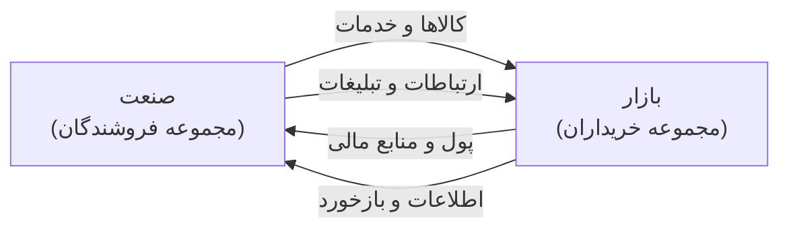
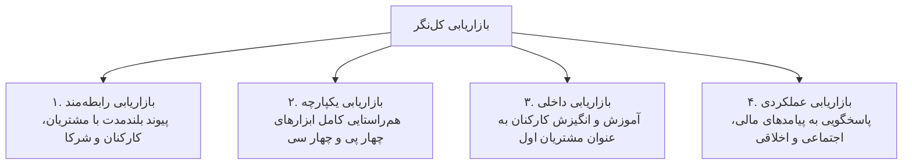
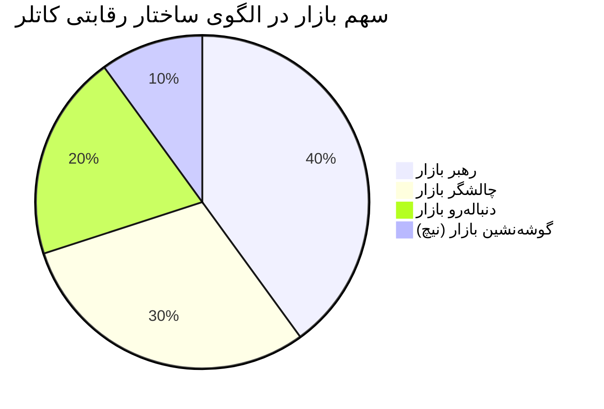
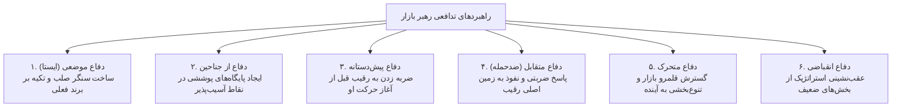

# فصل اول: کلیات بازاریابی نوین و مفاهیم بنیادین بازار (درسنامه جامع و خودآموز)

> [!abstract] شناسنامه کنکوری و نقشه تسلط فصل
> - **تعداد سوال در کنکور سراسری کارشناسی ارشد:** این سرفصل سالانه بین ۱ تا ۳ تست قطعی در دفترچه ارشد مدیریت دارد (مجموعاً ۱۲ تست از ۱۰۵ تست کنکورهای اخیر مستقیماً از این مبحث طرح شده است).
> - **درجه اهمیت:** 🥇 **سنگر اصلی (فوق‌العاده بالا)**؛ زبان مشترک، شالوده مفهومی و دروازه ورود به کل علم بازاریابی است. تسلط بر تمایز نیاز و خواسته، ابعاد ۹گانه دکتر روستا و حالات هشت‌گانه تقاضا، دست‌کم ۲ تست کنکور را تضمین می‌کند.
> - **روش مطالعه:** این درسنامه یکپارچه بر پایه متد فاینمن (آموزش شهودی، روان، با مثال‌های عینی کسب‌وکار و زندگی روزمره، به دور از اضافه‌گویی کتب رفرنس) تدوین شده است. ابتدا هر مفهوم را با تمثیل آن درک کنید و سپس به سراغ جدول کپسولی و کالبدشکافی تله‌های تستی بروید.

---

## فهرست سرفصل‌های فصل اول

1. **چیستی بازاریابی و مرزهای تعریفی آن** (نگاه فیلیپ کاتلر و انجمن بازاریابی آمریکا)
2. **ده موجودیت قابل بازاریابی کاتلر** (چه چیزهایی به بازار عرضه می‌شوند؟)
3. **تثلیث بنیادین: نیاز، خواسته و تقاضا** (همراه با پنج لایه نیازهای مشتری و تفکیک بازاریاب واکنشی و خلاق)
4. **مفهوم محصول، فایده، ارزش و زنجیره مبادله** (چهار راه ارضای نیاز، شرایط پنج‌گانه مبادله و شبکه بازاریابی)
5. **مفهوم بازار، ساختار جریان‌ها و فرابازار (متابازار)**
6. **مدل ابعاد نه‌گانه بازاریابی دکتر احمد روستا** (شاه‌کلید طلایی کنکور)
7. **ماتریس جامع حالات هشت‌گانه تقاضا و وظایف بازاریابی** (الگوی کاتلر و سه استاد)
8. **سیر تحول فلسفه‌های هدایت بازار و الگوهای استقرار آن** (از گرایش تولید تا بازاریابی اجتماعی، هرم معکوس، سیر ۵ مرحله‌ای نقش بازاریابی و بازاریابی سببی)
9. **پارادایم نوین بازاریابی کل‌نگر فیلیپ کاتلر** (چهار رکن بازاریابی جامع و ماتریس چهار پی و چهار سی)
10. **سیستم بازار، ابعاد محیط بازاریابی و کانال‌های کاتلر** (محیط خرد و کلان و مثلث استراتژیک بازار)
11. **موقعیت‌ها و استراتژی‌های رقابتی در بازار** (رهبران، چالشگران، دنباله‌روها و گوشه‌نشینان)
12. **تاکتیک‌های حمله چالشگران و راهبردهای دفاعی رهبران بازار**
13. **کپسول مرور سریع، دام‌های تستی طراحان و تست‌های منتخب با رد گزینه**

---

## ۱. چیستی بازاریابی، حکمت‌های بنیادین و پویایی‌های تاریخی بازار

بازاریابی برخلاف تصور عامه، معادل فروش یا تبلیغات نیست! دو متفکر بزرگ مدیریت، شالوده بازاریابی را چنین تبیین می‌کنند:

> [!quote] حکمت بنیادین بازاریابی از دیدگاه پیتر دراکر (مرجع کاتلر، ص ۳۹):  
> «این مشتری است که تعیین می‌کند کسب‌وکار چیست؛ زیرا تنها با خرید کالا یا خدمت است که منابع اقتصادی به ثروت و اشیاء به کالا تبدیل می‌شوند. آنچه کسب‌وکار فکر می‌کند تولید می‌کند اولویت نخست نیست؛ آنچه مشتری فکر می‌کند می‌خرد و ارزش می‌داند تعیین‌کننده است... هدف بازاریابی، زائد کردن فرایند فروش است؛ یعنی شناخت و درک مشتری باید آن‌چنان دقیق باشد که کالا یا خدمت کاملاً منطبق بر او بوده و خودش خودش را بفروشد!»

> [!quote] نگاه فراگیر به بازاریابی از دیدگاه ای. ریموند کوری (مرجع کاتلر، ص ۳۹):  
> «بازاریابی فقط یک وظیفه یا کارکرد مستقل مانند تولید، مالی یا پرسنلی نیست؛ بسیار فراتر از آن است و کل کسب‌وکار را در بر می‌گیرد که از منظر نتیجه نهایی یعنی نگاه مشتری نگریسته می‌شود. مسئولیت بازاریابی باید در تمام تار و پود سازمان رخنه کند.»

### درس‌آموخته تاریخی از پویایی بازار: سرنوشت غول‌های خودروسازی آمریکا (مرجع کاتلر، ص ۴۰):
فیلیپ کاتلر برای اثبات اینکه بازاریابی یک فرایند زنده و پویاست، تاریخ صنعت خودروسازی را مثال می‌زند:
- **دهه ۱۹۲۰ (عصر فورد):** هنری فورد با مدل T سیاه و ارزان‌قیمت، بر تولید انبوه تمرکز کرد («هر رنگی بخواهید، به شرطی که سیاه باشد!»).
- **جهش جنرال موتورز (آلفرد اسلون):** جنرال موتورز با فلسفه بازاریابی نوین وارد شد و بازار را بخش‌بندی کرد: *«یک اتومبیل برای هر کیف پول و هر هدفی»* (شورولت برای طبقه کارگر، پونتیاک، بیوک، اولدزموبیل و کادیلاک برای قشر مرفه). جنرال موتورز فورد را پشت سر گذاشت.
- **دهه ۱۹۶۰ و ۱۹۷۰ (ورود فولکس‌واگن و ژاپنی‌ها):** با افزایش قیمت بنزین و ترافیک، فولکس‌واگن بیتل کم‌مصرف و سپس خودروسازان ژاپنی (تویوتا، هوندا، نیسان) با کیفیت بالا، مصرف بهینه و قیمت مناسب، سهم بازار غول‌های دیترویت را تصاحب کردند.
- **نتیجه استراتژیک:** شرکت‌هایی که در گذشته موفق بوده‌اند، در صورت عدم رصد پیوسته تغییرات محیطی و سلیقه خریداران، به ورطه سقوط کشیده می‌شوند.

### تعاریف استاندارد و کنکوری بازاریابی:

* **تعریف فیلیپ کاتلر (مرجع کلاسیک - کاتلر، ص ۳۹ و ۴۴):**  
  بازاریابی عبارت است از یک فرایند اجتماعی و مدیریتی که به وسیله آن، افراد و گروه‌ها از طریق تولید، ایجاد و مبادله کالاها و ارزش‌ها با دیگران، نیازها و خواسته‌های خود را برآورده می‌سازند.
* **تعریف وظیفه‌ای کاتلر:**  
  فعالیت انسانی در جهت ارضای نیازها و خواسته‌ها از طریق فرایند مبادله.
* **تعریف جامع کتاب سه استاد (روستا، ونوس، ابراهیمی - کتاب سه استاد، ص ۳):**  
  **«تلاش در جهت از قوه به فعل درآوردن مبادلات برای ارضای نیازها و خواسته‌های بشر.»**
* **تعریف انجمن بازاریابی آمریکا (AMA):**  
  بازاریابی عبارت است از فعالیت، مجموعه نهادها و فرایندهایی برای ایجاد، ارتباط، تحویل و تبادل پیشنهادهایی که برای مشتریان، کارفرمایان، شرکا و در کل برای جامعه ارزش دارد.

> [!note] بستر تاریخی و گسترش قلمرو بازاریابی (کتاب سه استاد، ص ۳):
> - **ریشه تحول:** پس از پایان جنگ سرد در دهه ۱۹۹۰ و آزادسازی منابع، رقابت به شدت افزایش یافت. شرکت‌هایی که صرفاً به دنبال سود لحظه‌ای بودند شکست خوردند، اما شرکت‌های پیشرو (مانند تری‌ام (3M) و مک‌دونالدز) به دلیل تمرکز بر نیاز مشتری، بازارهای هدف و ایجاد انگیزه در کارکنان به موفقیت‌های چشمگیر رسیدند.
> - **بازاریابی در سازمان‌های غیرتجاری و غیرانتفاعی (کتاب سه استاد، ص ۳):** بازاریابی تنها مخصوص شرکت‌های انتفاعی نیست؛ بلکه موزه‌ها، دانشگاه‌ها، بیمارستان‌ها، مراکز مذهبی و نهادهای دولتی نیز از بازاریابی به عنوان «وسیله‌ای مؤثر برای برقراری ارتباط با مردم و خدمت‌رسانی بهتر» استفاده می‌کنند.

> [!tip] تفاوت جوهری بازاریابی با فروش:
> * **فروش:** از کارخانه و محصول موجود شروع می‌شود، تمرکزش بر متقاعدسازی مشتری برای تبدیل کالا به پول نقد است و سود را در **حجم فروش** جستجو می‌کند.
> * **بازاریابی:** از بازار و نیاز مصرف‌کننده شروع می‌شود، تمرکزش بر حل مسئله مشتری و خلق ارزش است و سود را در **رضایت پایدار مشتری** به دست می‌آورد.

---

## ۲. ده موجودیت قابل بازاریابی کاتلر (چه چیزهایی به بازار عرضه می‌شوند؟)

طراحان کنکور معمولاً با ذکر یک سناریوی کاربردی می‌پرسند: این فعالیت مربوط به بازاریابی کدام موجودیت است؟ فیلیپ کاتلر قلمرو بازاریابی را به ۱۰ موجودیت متمایز توسعه داده است:

| ردیف | موجودیت قابل بازاریابی | مفهوم و کارکرد در بازار | مثال عینی و کاربردی |
| :--- | :--- | :--- | :--- |
| **۱** | **کالاها** | اشیای فیزیکی و ملموس که تولید، انبار و مصرف می‌شوند. | خودرو، لپ‌تاپ، مواد غذایی، گوشی تلفن همراه |
| **۲** | **خدمات** | فعالیت‌ها یا منافع ناملموسی که هم‌زمان تولید و مصرف می‌شوند و انبارشدنی نیستند. | خطوط هوایی، هتل‌داری، خدمات بانکی، بیمه، آرایشگری |
| **۳** | **رویدادها** | برنامه‌های زمان‌دار و دوره‌ای که برای مخاطبان معین برگزار می‌شوند. | المپیک، جام جهانی فوتبال، نمایشگاه‌های بین‌المللی |
| **۴** | **تجربه‌ها** | ترکیب هوشمندانه چند کالا و خدمت برای خلق حس و خاطره‌ای ماندگار در ذهن مشتری. | دیزنی‌لند، اتاق فرار، تورهای ماجراجویی کویرنوردی |
| **۵** | **اشخاص** | ساخت برند شخصی برای افراد مشهور، متخصصان، هنرمندان و مدیران. | بازاریابی هنرمندان، ورزشکاران حرفه‌ای، کاندیداهای انتخابات |
| **۶** | **مکان‌ها** | جذب گردشگران، سرمایه‌گذاران، کارآفرینان و ساکنان جدید به یک منطقه جغرافیایی. | کمپین‌های گردشگری شهرها (مانند «کیش مروارید خلیج فارس»، برندسازی دبی) |
| **۷** | **اموال و دارایی‌ها** | حقوق مالکیت نامشهود برای دارایی‌های فیزیکی (املاک) یا مالی (اوراق بهادار). | معاملات سهام در بورس، آژانس‌های املاک و مستغلات |
| **۸** | **سازمان‌ها** | ایجاد وجهه مثبت عمومی، مشروعیت اجتماعی و اعتبار نهادی برای تشکل‌ها. | تبلیغات برند کارفرمایی، کمپین‌های اعتمادسازی هلال احمر یا دانشگاه‌ها |
| **۹** | **اطلاعات** | تولید، بسته‌بندی و توزیع داده‌ها، محتوای تخصصی و دانش کاربردی. | دانشنامه‌ها، پایگاه‌های داده علمی، وب‌سایت‌های ارائه‌دهنده تحلیل‌های آماری |
| **۱۰** | **ایده‌ها** | ترویج باورها، مفاهیم فکری، الگوهای رفتاری و تغییر نگرش در سطح جامعه. | کمپین ترک سیگار، فرهنگ‌سازی تفکیک زباله از مبدأ، تشویق به رانندگی ایمن |

---

## ۳. تثلیث بنیادین: نیاز، خواسته و تقاضا

یادگیری تمایز این سه مفهوم، تست‌خیزترین بخش کلیات بازاریابی است و طراحان کنکور معمولاً با جابه‌جا کردن تعاریف آن‌ها، تله تستی می‌سازند:

### ۱. نیاز:
* **تعریف:** بیان‌کننده حالت محرومیت احساس‌شده در یک فرد است. نیازها جنبه بیولوژیک و فطری دارند (گرسنگی، تشنگی، نیاز به پوشاک، امنیت، محبت و احترام).
* **شاه‌نکته کنکوری:** بازاریاب‌ها نیاز را به وجود نمی‌آورند! نیازها از پیش در کالبد انسان وجود داشته‌اند؛ بازاریاب صرفاً آن‌ها را بیدار کرده و راه ارضای آن را پیشنهاد می‌دهد.

### ۲. خواسته:
* **تعریف:** شکلی است که نیازهای انسانی تحت تأثیر **فرهنگ، خرده‌فرهنگ و شخصیت فردی** به خود می‌گیرند.
* *مثال ملموس:* یک جوان تهرانی و یک جوان قبیله‌ای در آمازون هر دو نیاز به غذا دارند؛ اما خواسته جوان تهرانی چلوکباب یا پیتزا است، در حالی که خواسته جوان آمازونی موز وحشی یا ماهی کباب‌شده روی سنگ است!

### ۳. تقاضا:
* **تعریف:** خواسته‌ای است که با **قدرت خرید (پول نقد و تمایل به پرداخت)** پشتیبانی شود.
* *مثال ملموس:* بسیاری از افراد خواسته سوار شدن بر مرسدس بنز یا خرید آخرین مدل آیفون را دارند، اما تقاضای واقعی شرکت مرسدس یا اپل، تنها شامل افرادی است که توان مالی و آمادگی پرداخت قیمت آن را دارند.

### پنج لایه نیازهای مشتری از نگاه فیلیپ کاتلر:
کاتلر تأکید می‌کند که مشتریان همیشه دقیقاً آنچه را می‌خواهند به زبان نمی‌آورند؛ بنابراین بازاریاب حرفه‌ای باید پنج لایه نیاز را موشکافی کند:
1. **نیازهای تصریح‌شده (بیان‌شده):** نیازهایی که مشتری مستقیماً بر زبان می‌آورد؛ مثلاً می‌گوید یک اتومبیل ارزان‌قیمت می‌خواهم.
2. **نیازهای واقعی:** نیت واقعی و بنیادین خریدار؛ مثلاً اتومبیلی که هزینه نگهداری و مصرف سوخت آن پایین باشد، نه اینکه صرفاً قیمت خرید اولیه آن کم باشد.
3. **نیازهای تصریح‌نشده (بدیهی و ضمنی):** انتظارات طبیعی که مشتری حتی مطرح نمی‌کند ولی انتظار قطعی دارد؛ مثلاً گارانتی معتبر و احترام پرسنل فروش.
4. **نیازهای لذت‌بخش (شوق‌انگیز):** ویژگی‌های فراتر از انتظاری که وجودشان مشتری را شگفت‌زده و ذوق‌زده می‌کند؛ مثلاً دریافت رایگان نقشه جامع راه‌ها یا اشانتیون کاربردی هنگام تحویل کالا.
5. **نیازهای پنهان:** انگیزه‌های روانی و اعتباری درونی؛ مثلاً تمایل به اینکه نزد دوستان فردی زرنگ، ارزش‌شناس و صاحب سلیقه ممتاز شناخته شود.

### بازاریاب واکنشی در برابر بازاریاب خلاق (دیدگاه گری همل و پراهالاد):
کاتلر با استناد به نظریه گری همل و سی.کی. پراهالاد، نحوه مواجهه شرکت‌ها با نیازهای مشتریان را به دو رویکرد استراتژیک تفکیک می‌کند:

| بعد مقایسه | بازاریاب واکنشی | بازاریاب خلاق |
| :--- | :--- | :--- |
| **تعریف و جهت‌گیری** | شرکت به دنبال شناخت و ارضای **نیازهای اظهارشده** فعلی است (حرکت پشت سر نیاز مشتری). | شرکت به دنبال کشف و ارضای **نیازهای پنهان و ناگفته** است که مشتری هرگز نمی‌پرسد اما مشتاقانه به آن پاسخ می‌دهد (آفریننده بازار). |
| **منطق استراتژیک** | تمرکز بر نظرسنجی و رفع نواقص اعلام‌شده توسط خریداران فعلی. | خلق راه‌حل‌های نوآورانه و تحول‌آفرین که سبک زندگی بازار را دگرگون می‌سازد. |
| **مثال برجسته دنیای کسب‌وکار** | ارتقای دوره‌ای قدرت موتور یا نصب سانروف بنا به تقاضای بازار. | اختراع واکمن و پلی‌استیشن توسط شرکت سونی؛ آکیو موریتا بنیان‌گذار سونی می‌گوید: شرکت ما به بازار خدمت نمی‌کند، بلکه آفریننده بازار است. |

---

## ۴. مفهوم محصول، فایده، ارزش و زنجیره مبادله

### اجزای سه‌گانه محصول (پیشنهاد بازار):
از دیدگاه کاتلر، هر پیشنهاد عرضه در بازار از ۳ جزء درهم‌تنیده تشکیل می‌شود:
1. **کالای فیزیکی و ملموس:** جسم فیزیکی (مثل بدنه خودرو، برگر خوراکی، قطعات سخت‌افزاری کامپیوتر).
2. **خدمات ناملموس:** منافع همراه (مثل گارانتی خودرو، تحویل غذا درب منزل، نصب و پشتیبانی نرم‌افزار).
3. **ایده و ارزش نمادین:** بار مفهومی و پرستیژ (مثل حس امنیت در خودرو ولوو، وجهه اجتماعی در آیفون، پیام صرفه‌جویی در مصرف سوخت).

> [!warning] مفهوم فایده و مطلوبیت از دیدگاه دی‌رز:
> **فایده و مطلوبیت:** برآورد ذهنی مصرف‌کننده از استعداد و توانایی کلی یک محصول برای تأمین نیازهای مشخص اوست. دی‌رز فایده را چنین تعریف می‌کند:  
> «ارضای نیازهای مشتری، همراه با رضامندی، که با حداقل هزینه ممکنِ به‌دست آوردن، تملک و استفاده حاصل می‌شود.» مصرف‌کننده برای ارضای نیاز خود، سبد نیازها (شامل سرعت، ایمنی، سهولت و اقتصاد) را با سبد انتخاب محصولات مقایسه می‌کند تا بیشترین ارزش خالص را به دست آورد.

### چهار روش ارضای نیاز در جامعه (کتاب سه استاد، ص ۴):
انسان در طول تاریخ نیازهای خود را از ۴ طریق تأمین کرده است:
1. **تولید شخصی (خودتولیدی):** فرد خودش شکار می‌کند، گندم می‌کارد یا لباس می‌دوزد. در اینجا بازاری شکل نمی‌گیرد.
2. **استعانت از دیگران (کمک‌خواهی):** طلب غذا از دیگران به عنوان صدقه یا کمک بلاعوض بدون ارائه مابه‌ازای مادی (گدایی، خیریه).
3. **اعمال زور و اجبار:** تصاحب با غارت، دزدی یا سلاح فیزیکی. در اینجا رضایت دوطرفه وجود ندارد.
4. **مبادله:** کسب محصول مورد نظر از طریق ارائه چیزی باارزش به طرف مقابل به عنوان مابه‌ازا. **علم بازاریابی دقیقاً از همین نقطه متولد می‌شود.**

### شرایط پنج‌گانه تحقق مبادله (کتاب سه استاد، ص ۴ و کاتلر، ص ۴۸):
برای اینکه مبادله صورت گیرد، باید ۵ شرط هم‌زمان وجود داشته باشد (کتاب سه استاد بر ۳ شرط نخست تأکید کرده و کاتلر ۵ شرط را برمی‌شمارد):
1. **حداقل دو طرف** حضور داشته باشند.
2. هر طرف دارای چیزی باشد که **برای طرف دیگر ارزش داشته باشد**.
3. هر طرف **توانایی برقراری ارتباط و تحویل** را داشته باشد.
4. هر طرف در **رد یا قبول پیشنهاد مبادله کاملاً آزاد** باشد.
5. هر طرف باور داشته باشد که معامله با طرف مقابل، **مناسب، منطقی و پسندیده** است.

### تمایزهای ظریف کنکوری: مبادله، معامله و انتقال
طراحان کنکور این سه مفهوم را بسیار دقیق به چالش می‌کشند:

| مفهوم | تعریف و کارکرد | شرایط و ویژگی‌های بنیادین |
| :--- | :--- | :--- |
| **مبادله** | **یک فرایند رفتاری و اجتماعی است.** | طرفین در حال گفت‌وگو، مذاکره و ارزیابی شروط مطلوب برای رسیدن به توافق هستند. |
| **معامله** | **رویداد نهایی و واحد اندازه‌گیری مبادله است.** | توافق قطعی بر سر حداقل دو شیء باارزش، زمان توافق، مکان توافق و چارچوب حقوقی و قراردادی. می‌تواند پولی یا غیرپولی (پایاپای و تهاتری) باشد. |
| **انتقال** | واگذاری یک‌طرفه ارزش بدون دریافت مابه‌ازای مادی مستقیم. | مانند اعانه، هدیه، وقف، اهدای خون یا رأی سیاسی. **نکته کنکوری:** بازاریابی مدرن مفهوم مبادله را به انتقال نیز بسط داده است؛ زیرا در انتقال هم مابه‌ازای معنوی و رفتاری (احساس رضایت خاطر، شهرت اجتماعی، سپاسگزاری) نهفته است. |

### بازاریاب در برابر مشتری بالقوه:
* **بازاریاب:** طرفی است که در فرایند مبادله **به شکل فعالانه‌تری** در جستجوی دریافت واکنش (خرید، رأی، کمک، توجه) از طرف دیگر است.
* **مشتری بالقوه:** طرفی است که بازاریاب تشخیص می‌دهد توانایی و تمایل بالقوه برای معامله را دارد.
* > [!danger] دو دام تستی بسیار مهم کاتلر:
  > ۱. **بازاریاب لزوماً فروشنده نیست!** اگر خریداران در شرایط کمبود شدید کالا (مثلاً پیش‌فروش خودرو یا خرید مسکن در اوج رونق) برای جلب نظر فروشنده به تکاپو بیفتند و امتیاز پیشنهاد دهند، **خریدار بازاریاب است و فروشنده مشتری بالقوه!**
  > ۲. **بازاریابی دوجانبه:** اگر هر دو طرف مبادله به شکلی فعال و هم‌زمان در پی انجام معامله باشند و به یکدیگر امتیاز پیشنهاد کنند، هر دو طرف بازاریاب هستند و این پدیده بازاریابی دوجانبه نامیده می‌شود.

### نتیجه غایی بازاریابی رابطه‌مند: ایجاد شبکه بازاریابی
فیلیپ کاتلر تأکید می‌کند که نتیجه نهایی بازاریابی رابطه، خلق یک دارایی استراتژیک منحصر‌به‌فرد به نام **شبکه بازاریابی** است.  
* **تعریف:** شبکه‌ای پایدار شامل شرکت و تمام ذی‌نفعان کلیدی آن (مشتریان وفادار، کارکنان، تأمین‌کنندگان، توزیع‌کنندگان، خرده‌فروشان و آژانس‌های تبلیغاتی).  
* **قاعده طلایی عصر جدید:** در اقتصاد نوین، رقابت دیگر میان تک‌شرکت‌ها جریان ندارد؛ بلکه **رقابت میان شبکه‌های بازاریابی** برقرار است! هر شرکتی که شبکه ارزش منسجم‌تر و وفادارتری ساخته باشد، برنده میدان رقابت است.

---

## ۵. مفهوم بازار، ساختار جریان‌ها و فرابازار (متابازار)

### تعاریف بازار:
* **تعریف در علم اقتصاد:** مکان یا بستری فیزیکی و انتزاعی که خریداران و فروشندگان برای تبادل کالاها و شکل‌گیری قیمت تعادلی حضور می‌یابند.
* **تعریف در کتاب سه استاد (روستا، ونوس، ابراهیمی - کتاب سه استاد، ص ۴):**  
  **«محلی برای مبادلات بالقوه.»**  
  *شاه‌نکته کنکوری (کتاب سه استاد، ص ۴):* از دیدگاه سه استاد، **اگر برای محصول یا خدمت ما حتی یک نفر هم وجود داشته باشد، می‌توانیم بگوییم بازار وجود دارد!** اندازه بازار منحصراً به دو عامل وابسته است: ۱) علاقمندی فرد به محصول، ۲) در اختیار داشتن منابع لازم و آمادگی برای مبادله آن منابع.
* **تعریف در مدیریت بازاریابی (کاتلر):**  
  بازاریابان واژه بازار را **فقط برای خریداران** به کار می‌برند! بازار یعنی مجموعه تمام خریداران بالقوه و بالفعلی که نیاز یا خواسته مشترک داشته و حاضر و قادر به مبادله برای رفع آن هستند. (در بازاریابی، مجموعه فروشندگان را **صنعت** می‌نامند).

### ساختار جریانات در یک اقتصاد مبادلاتی نوین:
کاتلر ۵ بازار اساسی و چرخه‌های مبادلاتی متصل به آن‌ها را تعریف می‌کند:
1. **بازارهای منابع:** تأمین‌کننده زمین، نیروی کار، مواد خام و پول.
2. **بازارهای تولیدکننده:** تبدیل منابع به کالاها و خدمات نهایی.
3. **بازارهای واسطه‌ای:** عمده‌فروشان و خرده‌فروشان توزیع‌کننده.
4. **بازارهای مصرف‌کننده:** افراد و خانوارهایی که کالا را به مصرف نهایی می‌رسانند.
5. **بازارهای دولتی:** دریافت مالیات از تمام بازارها و ارائه خدمات عمومی، زیرساخت‌ها و خریدهای دولتی.

### تفکیک مفاهیم مدرن فضا و بازار:
* **بازارگاه فیزیکی:** بازار فیزیکی، ملموس و دارای موقعیت جغرافیایی مشخص (مثل بازار بزرگ، فروشگاه‌های زنجیره‌ای، مغازه‌های سنتی).
* **بازارگاه مجازی:** بسترهای دیجیتال مبتنی بر اینترنت و وب، بدون محدودیت مکانی و زمانی (مثل فروشگاه‌های آنلاین، بازارهای الکترونیکی و پلتفرم‌های مجازی).
* **فرابازار (مفهوم کلیدی موهان ساونی):**  
  فرابازار عبارت است از **خوشه‌ای از کالاها و خدمات مکمل و مرتبط در ذهن مصرف‌کننده که همگی حول یک فعالیت محوری یا رویداد مشخص شکل گرفته‌اند**، هرچند که در صنایع و اصناف کاملاً متفاوتی تولید شوند.
  * *مثال فرابازار خودرو:* مشتری وقتی تصمیم به خرید اتومبیل می‌گیرد، ذهنش فقط درگیر کارخانه سازنده نیست؛ بلکه به وام بانکی، بیمه شخص ثالث، معاینه فنی، دزدگیر، تعمیرگاه معتبر، بنزین و پلتفرم‌های آگهی نیز نیاز دارد. پلتفرم‌های جامع اینترنتی نقش **فرامتعامل‌گر (واسطه متمرکز فرابازار)** را ایفا کرده و تمام این خدمات پراکنده را در یک درگاه واحد گرد هم می‌آورند.
  * *مثال‌های دیگر فرابازار:* فرابازار مسکن (ملک، وام، معمار، دفترخانه، بیمه آتش‌سوزی)، فرابازار ازدواج (تالار، مزون، آتلیه، طلا، گل‌آرایی).

### فرمول و عوامل تعیین‌کننده اندازه بازار:
$$\text{Market Size} = f(N \times P \times A)$$
*(اندازه بازار تابع مستقیمی از: تعداد افراد علاقه‌مند بالقوه × توان مالی و قدرت پرداخت × دسترسی فیزیکی و توزیعی)*

---

## ۶. مدل ابعاد نه‌گانه بازاریابی دکتر احمد روستا (شاه‌کلید کنکور) (کتاب سه استاد، ص ۵ و ۶)

دکتر احمد روستا (پدر بازاریابی نوین ایران)، ساختار جامع مدیریت بازار را در قالب **۹ بعد هماهنگ** تدوین کرده است (کتاب سه استاد، ص ۵ و ۶). طراحان کنکور ارشد همواره سناریوهایی طرح می‌کنند که پاسخ آن یکی از این ابعاد ۹گانه است:

| بعد بازاریابی | کلیدواژه مفهومی و تعریف استاندارد کتاب سه استاد (ص ۵ و ۶) | مثال عینی و کاربردی در کسب‌وکار |
| :--- | :--- | :--- |
| **۱. بازارگرایی** | نهادینه کردن تفکر توجه به بازار و نیاز مشتری به عنوان فرهنگ و بینش مشترک تمام کارکنان و مدیران سازمان (اولین ویژگی بازاریابی جدید). | مدیرعاملی که در آموزش تمام کارمندان جدید، ارزش مشتری‌مداری و شنیدن صدای خریدار را جا می‌اندازد. |
| **۲. بازارشناسی** | «شناخت، لازمه هر حرکت عاقلانه و تصمیم اصولی است». تلاش نظام‌مند برای گردآوری، ضبط و ثبت اطلاعات همه اجزای نظام بازار و عوامل مؤثر بر آن با تحقیقات بازار. | ارسال پرسشنامه، مصاحبه با مشتریان و تحلیل داده‌های رفتار خرید کاربران در وب‌سایت. |
| **۳. بازاریابی** | جستجو برای یافتن مناسب‌ترین بخش‌های بازار و انطباق سبد محصولات با آن‌ها؛ یعنی **بخش‌بندی (تقسیم بازار)** و تعیین محصولات مناسب برای هر بخش. | شرکت خودروسازی که تصمیم می‌گیرد یک خودروی هاچ‌بک اقتصادی را برای قشر جوان دانشجو عرضه کند. |
| **۴. بازارسازی** | نفوذ در بازار، معرفی و شناساندن سازمان و محصولات با به‌کارگیری درست عوامل قابل کنترل بازاریابی (چهار پی: محصول، قیمت، توزیع، ترفیع) جهت کسب جایگاه و سهم بازار بیشتر. | اجرای کمپین تبلیغاتی پر سر و صدا، طراحی بسته‌بندی جذاب و تخفیف‌های ویژه افتتاحیه برای ورود محصول جدید. |
| **۵. بازارگردی** | حضور در صحنه رقابت و مبادله، شرکت در نمایشگاه‌ها و بازدید از بازارها؛ **«مهم‌ترین نقش بازارگردی، تقویت و گاهی تغییر "دید" مدیران است»**. | سر زدن منظم مدیران ارشد به فروشگاه‌های خرده‌فروشی بازار و شرکت در نمایشگاه‌های بین‌المللی دبی و آلمان. |
| **۶. بازارسنجی** | **«تحلیل موقعیت بازار با توجه به آنچه بودیم و داشتیم، آنچه هستیم و داریم، و آنچه باید داشته باشیم»**. سنجش عملکرد بر اساس مراحل منحنی عمر کالا (معرفی، رشد، بلوغ/اشباع، افول) و ارزشیابی نقاط قوت و ضعف. | سنجش سهم بازار شرکت پس از ۶ ماه از آغاز کمپین و اندازه‌گیری میزان افت فروش نسبت به رقبا. |
| **۷. بازارداری** | حفظ و نگهداری مشتریان کنونی و تشویق به تداوم خرید از طریق ایجاد «خشنودی و رضایت» در آنان با تکیه بر اطلاعات روان‌شناختی، جامعه‌شناختی و رصد حرکات رقبا. | ارسال پیامک تبریک تولد به همراه کد تخفیف ویژه برای مشتریان قدیمی و ارائه خدمات گارانتی مادام‌العمر. |
| **۸. بازارگرمی** | تبلیغات و تشویقات به‌موقع برای آگاه‌سازی و متقاعدسازی مشتریان و مقابله با حرکات رقیب با استفاده از **ابزارهای خلاقیت، نوآوری و ابتکارات**. | جشنواره‌های فروش ویژه آخر فصل (بلک فرایدی)، قرعه‌کشی خودرو و مسابقات شبکه‌های اجتماعی. |
| **۹. بازارگردانی** | **«مناسب‌ترین واژه فارسی برای Marketing، واژه بازارگردانی است»**؛ مدیریت جامع بازار شامل برنامه‌ریزی، اجرا و کنترل یکپارچه همه امور و ابعاد بازار جهت جلب رضایت مشتری و جامعه. | تدوین سند استراتژی سالانه بازاریابی، تعیین بودجه دپارتمان‌ها و نظارت بر تحقق تارگت‌های فروش شرکت. |

> [!danger] شاه‌تله‌های تستی ابعاد دکتر روستا (کتاب سه استاد، ص ۵ و ۶):
> * **معادل فارسی Marketing:** از نظر دکتر روستا، بهترین و رساترین واژه برای مارکتینگ، **«بازارگردانی» (مدیریت بازار)** است.
> * **نقش بازارگردی در کنکور:** اگر در تست آمد «کدام بعد باعث تقویت یا دگرگونی دید مدیران می‌شود؟»، بلافاصله پاسخ **بازارگردی** است.
> * **کلیدواژه سه‌گانه بازارسنجی:** عبارت «بودیم و داشتیم، هستیم و داریم، باید باشیم و داشته باشیم» همراه با «منحنی عمر کالا (PLC)» شناسه قطعی **بازارسنجی** است.
> * **تفاوت بازارشناسی و بازارسنجی:** بازارشناسی یعنی شناخت **اولیه و مستمر** از بازار، مشتری و رقبا با تحقیق؛ اما بازارسنجی یعنی **ارزیابی، قضاوت و سنجش عملکرد شرکت** نسبت به گذشته و پیش‌بینی آینده.
> * **تفاوت بازارسازی و بازارداری:** بازارسازی یعنی نفوذ به بازار و **جذب مشتریان جدید** با آمیخته بازاریابی؛ اما بازارداری یعنی **حفظ مشتریان موجود و جلوگیری از ریزش آن‌ها** از طریق رضایت و وفادارسازی.
> * **تفاوت بازاریابی و بازارگردانی:** بازاریابی یعنی یافتن بازار مناسب و بخش‌بندی؛ در حالی که بازارگردانی، چتر کلان حاکم بر همه ابعاد (مدیریت کل بازار شامل برنامه‌ریزی، اجرا و کنترل) است.

---

## ۷. ماتریس جامع حالات هشت‌گانه تقاضا و وظایف بازاریابی (کتاب سه استاد، ص ۷ تا ۱۰ و کاتلر، ص ۴۹)

از دیدگاه فیلیپ کاتلر و دکتر احمد روستا، وظیفه واقعی مدیریت بازاریابی صرفاً افزایش تقاضا نیست؛ بلکه **تنظیم سطح، زمان‌بندی و ماهیت تقاضا برای انطباق با اهداف سازمان** است (کتاب سه استاد، ص ۷). بر این اساس، بازار ممکن است در یکی از ۸ وضعیت تقاضا قرار داشته باشد که هر یک نیازمند استراتژی بازاریابی متفاوتی است:

| وضعیت تقاضا | تعریف و وضعیت روانی بازار | نام وظیفه بازاریابی | عنوان تخصصی استراتژی | اقدام عملیاتی و مثال ملموس کنکوری |
| :--- | :--- | :--- | :--- | :--- |
| **۱. تقاضای منفی** | بیشتر بخش‌های مهم بازار بالقوه از محصول بیزارند و حتی حاضرند پول بدهند تا از آن اجتناب کنند! | **تبدیل تقاضا** | **بازاریابی تبدیلی** | بازطراحی محصول، کاهش قیمت، تغییر ذهنیت و تبدیل تقاضا از منفی به مثبت و هم‌سطح کردن با عرضه؛ مانند ترس از دندانپزشکی یا مسافرت با قطار در گذشته (سه استاد، ص ۷). |
| **۲. نبود تقاضا** | بازار نسبت به محصول بی‌تفاوت و بی‌خبر است؛ نه دوست دارد و نه متنفر است. | **ایجاد تقاضا** | **بازاریابی ترغیبی** | پیوند زدن محصول به نیازهای طبیعی؛ شامل ۳ دسته: ۱) کالای ظاهراً بی‌ارزش (کاغذ باطله -> تولید مقوا)، ۲) کالای باارزش اما غیرقابل استفاده در محل (قایق در کویر -> ساخت دریاچه مصنوعی)، ۳) کالای نوآورانه ناشناخته (آموزش و توزیع نمونه رایگان) (سه استاد، ص ۸). |
| **۳. تقاضای پنهان** | عده زیادی از مردم نیاز شدید و مشترکی به محصولی دارند که در حال حاضر وجود خارجی ندارد. | **پرورش تقاضا** | **بازاریابی پرورشی** | سنجش اندازه تقاضای نهفته، هماهنگی وظایف بازاریابی و تولید کالای جدید؛ مانند نیاز به سیگار بی‌ضرر، اتوبوس‌های پاک، بزرگراه‌های ایمن یا اتومبیل‌های برقی بی‌صدا (سه استاد، ص ۸). |
| **۴. تقاضای تنزلی** | تقاضا برای کالا به طور مستمر و کمتر از سطح قبلی است و کاهش بیشتر نیز پیش‌بینی می‌شود (به دلیل عدم بهسازی). | **احیای تقاضا** | **بازاریابی احیایی** | یافتن پیشنهادهای تازه برای پیوند محصول با خواسته‌های بازار؛ مانند **صدور شناسنامه اصالت برای فرش‌های دستباف نفیس** و بافت طرح‌های مطابق با سلیقه بازارهای مختلف، جلب مشتریان رقیب و نوآوری در توزیع و تبلیغ (سه استاد، ص ۸ و ۹). |
| **۵. تقاضای فصلی و نامنظم** | الگوی زمانی تقاضا بر اثر تغییرات فصلی یا ساعتی از الگوی عرضه دور می‌شود. | **تعدیل تقاضا** | **بازاریابی تعدیلی (تطبیقی)** | تغییر الگوی تقاضا با ایجاد انگیزه‌ها، تبلیغات، ترفیعات و انعطاف در قیمت‌گذاری؛ مانند هتل‌های شمال ایران در زمستان یا تخفیف بلیط سینما در سانس‌های صبحگاهی (سه استاد، ص ۹). |
| **۶. تقاضای کامل (متعادل)** | زمان و سطح تقاضا دقیقاً برابر با زمان و سطح مطلوب عرضه است؛ اما تحت تأثیر **دو نیروی فرسایشی (تغییر سلیقه بازار و رقابت شدید)** قرار دارد. | **حفظ تقاضا** | **بازاریابی محافظتی (نگه‌دارنده)** | حفظ کیفیت و رضایت مشتری با ۳ تاکتیک محوری کتاب سه استاد (ص ۹): **۱) حفظ قیمت درست، ۲) حفظ انگیزه در واسطه‌ها و فروشندگان، ۳) کنترل شدید هزینه‌ها**. |
| **۷. تقاضای بیش از حد** | تقاضای سرریز شده که بسیار فراتر از توان یا تمایل سازمان برای پاسخگویی است (ناشی از کمیابی موقت یا شهرت زیاد مقطعی). | **تضعیف تقاضا** | **بازاریابی تضعیفی (دیمارکتینگ / بازاریابی وارونه)** | افزایش قیمت‌ها، کاهش یا قطع تبلیغات و کاستن موقت از خدمات، ترفیعات و آسایش بدون نابود کردن کلی تقاضا؛ مانند دیمارکتینگ مصرف آب یا برق در پیک تابستان (سه استاد، ص ۹ و ۱۰). |
| **۸. تقاضای ناسالم و مضر** | هر نوع تقاضا برای محصولاتی که از نظر سلامت، اخلاق یا قانون زیان‌بار و زائد است (دخانیات، مشروبات الکلی یا **تقاضا با هدف احتکار**). | **تخریب تقاضا** | **بازاریابی مقابله‌ای (عدم فروش)** | ریشه‌کنی و به صفر رساندن تقاضا از طریق ایجاد وحشت از پیامدها، افزایش قیمت بازدارنده، منع تبلیغات و جریمه‌های سنگین (سه استاد، ص ۱۰). |

> [!danger] سه دام تستی فوق‌العاده حساس در حالات تقاضا:
> ۱. **تفاوت بازاریابی تضعیفی (دیمارکتینگ / بازاریابی وارونه) و مقابله‌ای:** دیمارکتینگ می‌خواهد تقاضای **سالم اما بیش از ظرفیت** را موقتاً مهار و کم کند بدون اینکه خواهان نابودی آن باشد؛ اما بازاریابی مقابله‌ای (عدم فروش) خواهان **تخریب و نابودی قطعی تقاضا** برای یک محصول ناسالم و مضر است.
> ۲. **انواع دیمارکتینگ (بازاریابی تضعیفی):**
>    - **دیمارکتینگ عمومی:** شرکت می‌خواهد کل تقاضای بازار را کاهش دهد (مانند اداره برق در اوج گرما).
>    - **دیمارکتینگ انتخابی:** شرکت می‌خواهد مشتریان کم‌سود یا دردسرساز را حذف کند و تقاضای بخش‌های سودآور و وفادار را حفظ نماید.
> ۳. **تفکیک سه‌گانه کالاهای دچار نبود تقاضا (کتاب سه استاد، ص ۸):**  
>    - **کالاهای ظاهراً بی‌ارزش:** مانند کاغذ باطله (راهکار: تولید مقوا).  
>    - **کالاهای باارزش اما نامتناسب با محل:** مانند قایق در کویر (راهکار: تغییر محیط و تحریک تقاضا با احداث دریاچه مصنوعی).  
>    - **کالاهای نوآورانه‌ای که بازار از آن‌ها بی‌خبر است:** مانند تکنولوژی‌های نسل نو (راهکار: آموزش، ترفیع و توزیع نمونه رایگان).

---

## ۸. سیر تحول فلسفه‌های هدایت بازار و الگوهای استقرار آن (کتاب سه استاد، ص ۱۰ تا ۱۳ و کاتلر، ص ۵۰ تا ۵۵)

سازمان‌ها برای انجام فعالیت‌های بازاریابی خود، در طول تاریخ از ۵ فلسفه و گرایش مختلف پیروی کرده‌اند:

### ۱. گرایش تولید:
* **فرض بنیادین:** مصرف‌کنندگان خواهان محصولاتی هستند که **به‌وفور در دسترس و قیمت پایینی** داشته باشند.
* **تمرکز مدیریت:** کارایی بالای تولید، تولید انبوه، توزیع فراگیر و کاهش هزینه‌های تمام‌شده.
* **دو موقعیت مناسب برای کاربرد گرایش تولید (کتاب سه استاد):**
  1. زمانی که تقاضای یک محصول بسیار بیشتر از عرضه آن است (مثل خط تولید فورد مدل تی در اوایل قرن بیستم: هر مشتری می‌تواند هر رنگ اتومبیلی بخواهد داشته باشد، به شرطی که سیاه باشد!).
  2. زمانی که هزینه تولید اولیه بسیار سنگین است و برای رسیدن به صرفه مقیاس و کاهش قیمت، ناچار به تولید انبوه هستیم (مانند ورود ماشین‌حساب‌های الکترونیکی جیبی توسط شرکت **تگزاس اینسترومنتس (Texas Instruments)** به بازار).

### ۲. گرایش محصول:
* **فرض بنیادین:** مصرف‌کنندگان خواهان محصولاتی هستند که **بالاترین کیفیت، کارایی، نوآوری و ویژگی‌های فنی** را داشته باشند.
* **تمرکز مدیریت:** بهبود مستمر کیفیت فنی، ارتقای ویژگی‌ها و مهندسی کالا.
* **شاه‌تله گرایش محصول (نزدیک‌بینی بازاریابی):**  
  تئودور لویت در مقاله تاریخی خود هشدار داد که گرایش محصول به **نزدیک‌بینی بازاریابی** منجر می‌شود؛ یعنی شرکت چنان عاشق خود محصول و ویژگی‌های فنی آن می‌شود که نیاز واقعی مشتری را فراموش می‌کند!  
  *مثال کلاسیک:* مدیری که سال‌ها وقت صرف ساخت بهترین و پیشرفته‌ترین تله‌موش فنری با لیزر و حسگر حرارتی می‌کند؛ در حالی که مشتری تله‌موش نمی‌خواهد، بلکه راهی تمیز و ارزان برای خلاص شدن از شر موش‌ها (مثل سم یا طعمه شیمیایی) می‌خواهد! یا شرکت‌های راه‌آهن که تصور می‌کردند در بیزینس راه‌آهن هستند، در حالی که در صنعت حمل‌ونقل بودند و با ظهور هواپیما و اتومبیل ورشکست شدند.

### ۳. گرایش فروش:
* **فرض بنیادین:** اگر مصرف‌کنندگان به حال خود رها شوند، معمولاً مقدار کافی از محصولات شرکت را نخواهند خرید؛ بنابراین شرکت باید **تلاش‌های فروش و ترفیع پرفشار و تهاجمی** انجام دهد.
* **منطق حاکم (کتاب سه استاد):** شرکت‌ها باور دارند محصولاتشان **«باید فروخته شود، نه اینکه خریداری شود!»** در این دیدگاه فروش نقش اساسی دارد و رضایت مشتری در مرتبه دوم اهمیت است؛ از این رو ریسک این روش بسیار بالاست.
* **شرایط کاربرد:**
  1. **کالاهای ناخواسته و تحمیلی:** کالاهایی که خریدار به طور عادی به فکر خرید آن‌ها نیست و هرگز خود به شرکت مراجعه نمی‌کند (مانند **شرکت‌های بیمه عمر**، قطعه قبر در آرامستان، دانشنامه‌های قطور).
  2. **ظرفیت مازاد کارخانه‌ها:** زمانی که عرضه بیش از تقاضاست و شرکت می‌خواهد انبارهای خود را خالی کند.

### ۴. گرایش بازاریابی:
* **فرض بنیادین:** کلید دستیابی به اهداف سازمانی عبارت است از **تعیین نیازها و خواسته‌های بازارهای هدف، و تأمین رضایت آن‌ها به شکلی مؤثرتر و کارآمدتر از رقبا**.
* **شعارها:** مشتری پادشاه است، عاشق مشتری باشید نه عاشق کالای خودتان.
* **چهار رکن اساسی گرایش بازاریابی:**
  1. **بازار هدف مشخص:** هیچ شرکتی توان پاسخگویی به تمام سلیقه‌ها در تمام بازارها را ندارد؛ انتخاب هوشمندانه بخش هدف ضروری است.
  2. **درک نیازهای عمیق مشتری:** تمایز میان نیازهای اظهارشده و نیازهای واقعی خریدار.
  3. **بازاریابی یکپارچه:** هماهنگی در دو سطح درون‌بخشی و فرابخشی.
  4. **سودآوری از طریق رضایت پایدار مشتری:** سود نتیجه ثانویه خلق ارزش برای خریدار است.

#### سطوح دوگانه بازاریابی یکپارچه در گرایش بازاریابی:
بازاریابی یکپارچه در دو سطح متمایز تحقق می‌یابد:
1. **سطح اول (هماهنگی درون‌بخشی):** وظایف گوناگون بازاریابی شامل پرسنل فروش، تبلیغات، تحقیقات بازار، قیمت‌گذاری و مدیریت محصول باید کاملاً با یکدیگر هماهنگ باشند و پیام واحدی مخابره کنند.
2. **سطح دوم (هماهنگی فرابخشی و بین‌دوایری):** دایره بازاریابی باید با سایر دوایر سازمان (تولید، مالی، تحقیق و توسعه، تدارکات و منابع انسانی) هم‌راستا باشد. همان‌طور که دیوید پاکارد، بنیان‌گذار هیولت پاکارد تأکید می‌کند: **بازاریابی بسیار مهم‌تر از آن است که صرفاً بر عهده دپارتمان بازاریابی گذاشته شود!** همه کارکنان و بخش‌ها باید در جهت خلق رضایت مشتری تلاش کنند.
* **قاعده تقدم بازاریابی داخلی:** بازاریابی داخلی بر بازاریابی خارجی تقدم دارد؛ عاقلانه نیست شرکتی پیش از آموزش، انگیزش و تجهیز کارکنان خود، به مشتریان بیرونی وعده ارائه خدمات عالی بدهد.

### ماتریس مقایسه‌ای تاریخی: گرایش فروش در برابر گرایش بازاریابی

| بعد مقایسه | گرایش فروش | گرایش بازاریابی |
| :--- | :--- | :--- |
| **نقطه آغاز (مبدأ)** | **کارخانه و خط تولید** | **بازار هدف و مشتریان** |
| **کانون تمرکز** | **محصولات موجود شرکت** | **نیازها و مسائل مشتری** |
| **ابزارها و روش‌ها** | **فروش پرفشار، چانه‌زنی و تبلیغات پر سر و صدا** | **بازاریابی یکپارچه (چهار پی) و خلق ارزش** |
| **هدف نهایی** | **کسب سود از طریق افزایش حجم فروش** | **کسب سود از طریق خشنودی و رضایت مشتری** |
| **افق زمانی** | کوتاه‌مدت (معامله لحظه‌ای) | بلندمدت (روابط پایدار و وفادارسازی) |

#### تحلیل اقتصادی رضایت مشتری، نگهداری و رفتار شاکیان (پژوهش شرکت فاروم):
حفظ مشتریان فعلی و جلب وفاداری آنان یکی از پایه‌های حیاتی سودآوری در بازاریابی نوین است:

| شاخص و متغیر رفتاری | یافته آماری و تجربی | دلالت استراتژیک برای مدیران و کنکور |
| :--- | :--- | :--- |
| **هزینه جذب مشتری جدید** | **۵ برابر** هزینه تأمین رضایت مشتری فعلی | صرف بودجه برای حفظ مشتریان فعلی بسیار اقتصادی‌تر از جذب مشتریان جدید است. |
| **هزینه سودآوری از مشتری جدید** | **۱۶ برابر** هزینه تأمین رضایت مشتری فعلی | تبدیل مشتری جدید به مرحله سودآوری خالص نیازمند صرف هزینه و زمان سنگین است. |
| **رفتار مشتریان ناراضی** | **۹۵ درصد هیچ شکایتی ثبت نمی‌کنند!** | عدم دریافت شکایت هرگز به معنای رضایت نیست؛ اکثر مشتریان بی‌صدا خرید را قطع می‌کنند. |
| **شانس بازگشت با حل شکایت** | **۵۴ تا ۷۰ درصد** در صورت حل مشکل، و **تا ۹۵ درصد** در صورت حل فوری در محل | ایجاد خطوط ارتباط مستقیم و رسیدگی درجا، مشتری ناراضی را به مشتری وفادار تبدیل می‌کند. |
| **تبلیغ دهان‌به‌دهان منفی** | هر مشتری ناراضی تجربه منفی خود را به **۵ تا ۱۱ نفر دیگر** منتقل می‌کند | هزینه انفعال در برابر نارضایتی به صورت تصاعدی به اعتبار برند ضربه می‌زند. |

#### هرم سازمانی سنتی در برابر هرم سازمان مشتری‌محور (هرم معکوس بازاریابی):
کاتلر نشان می‌دهد که شرکت‌های مشتری‌مدار ساختار هرمی سنتی را کاملاً دگرگون کرده‌اند:

| لایه ساختاری | ساختار هرم سنتی | ساختار هرم سازمان نوین (مشتری‌محور) |
| :--- | :--- | :--- |
| **رأس و بالاترین جایگاه** | مدیریت ارشد (مدیرعامل) | **مشتریان** (کانون غایی توجه و فرمانده واقعی سازمان) |
| **لایه دوم** | مدیران میانی | **کارکنان خط مقدم و صف** (در تماس مستقیم با خریداران) |
| **لایه سوم** | کارکنان صف | **مدیران میانی** (تسهیل‌کننده و پشتیبان کارکنان صف) |
| **قاعده و پایین‌ترین سطح** | مشتریان (در بیرون سازمان) | **مدیریت ارشد** (حامی زیربنایی کل مجموعه برای خدمت به مشتری) |
| **وضعیت حواشی هرم** | فاقد ارتباط جانبی | **مشتریان در دو طرف هرم حضور دارند** (تأکید بر درگیری مستقیم تمام مدیران با مشتریان) |

#### محرک‌ها و موانع سه‌گانه استقرار فلسفه بازاریابی در سازمان:
* **محرک‌های پنج‌گانه روی آوردن شرکت‌ها به بازاریابی:**  
  ۱) افت فروش، ۲) رشد کند، ۳) تغییر الگوهای خرید مشتریان، ۴) افزایش شدت رقابت، ۵) افزایش سرسام‌آور هزینه‌های تبلیغات و فروش.
* **موانع سه‌گانه استقرار بازاریابی در سازمان:**
  1. **مقاومت سازمانی:** برخی بخش‌ها مانند تولید، مالی و مهندسی احساس می‌کنند تقویت بازاریابی موقعیت و نفوذ آن‌ها را تضعیف می‌کند.
  2. **آموزش کند:** نهادینه کردن تفکر مشتری‌مداری در تمام سطوح پرسنل فرایندی تدریجی و زمان‌بر است.
  3. **سرعت فراموشی:** پس از دستیابی به موفقیت‌های اولیه، سازمان‌ها اصول مشتری‌مداری را به سرعت فراموش کرده و دوباره به عادات درون‌گرای سنتی بازمی‌گردند.

#### سیر تکامل پنج‌مرحله‌ای نقش بازاریابی در سازمان (مدل کاتلر):
نگاه مدیران ارشد به جایگاه سازمانی دپارتمان بازاریابی طی پنج مرحله تکامل یافته است:

| مرحله تکامل | عنوان الگوی سازمانی | شرح نحوه استقرار و تعامل وظایف |
| :--- | :--- | :--- |
| **مرحله ۱** | **بازاریابی به عنوان وظیفه‌ای یکسان** | بازاریابی هم‌وزن، هم‌عرض و با اهمیت برابر در کنار تولید، مالی و منابع انسانی قرار دارد. |
| **مرحله ۲** | **بازاریابی به عنوان وظیفه‌ای مهم‌تر** | با دشوارتر شدن فروش، دایره بازاریابی اهمیت وزنی و جایگاهی فراتر از سایر وظایف پیدا می‌کند. |
| **مرحله ۳** | **بازاریابی به عنوان وظیفه اصلی و محوری** | بازاریابی در کانون مرکزی قرار می‌گیرد و سایر دوایر (تولید، مالی، پرسنلی) در حاشیه و در خدمت آن هستند. |
| **مرحله ۴** | **مشتری به عنوان کانون هدایت‌گر** | مشتری در مرکز سازمان جای می‌گیرد و هر چهار وظیفه سنتی (شامل بازاریابی) مستقیماً به سمت او جهت‌گیری می‌کنند. |
| **مرحله ۵** | **مشتری در کانون و بازاریابی به عنوان نیروی پیونددهنده** | مشتری در هسته مرکزی است، حلقه بازاریابی به عنوان پوسته واسط دور مشتری کشیده شده، و سایر دوایر از مجرای بازاریابی با مشتری ارتباط می‌یابند. |

#### پایه‌های چهارگانه گرایش بازاریابی در کتاب سه استاد (روستا، ونوس، ابراهیمی):
کتاب سه استاد پایه‌های استقرار فلسفه بازاریابی را بر **چهار رکن کلیدی** استوار می‌داند که هر ساله منبع طرح تست‌های ظریف کنکور است:

1. **خریدارگرایی (مشتری‌محوری):**  
   خریدار در رأس نمودار سازمانی قرار می‌گیرد و تمام کوشش‌ها در جهت ارضای نیاز او بسیج می‌شود.  
   * **شاه‌نکته تستی فوق‌العاده طلایی (وظیفه بازاریابی در دو افق زمانی):**  
     - **در کوتاه‌مدت:** وظیفه بازاریابی عبارت است از **انطباق نیاز خریداران با محصولات موجود شرکت**.  
     - **در درازمدت:** وظیفه بازاریابی عبارت است از **انطباق محصولات شرکت با احتیاجات و نیازهای متغیر خریداران**.  
   * *شواهد تجربی و تاریخی کتاب سه استاد:*  
     - **شکست سنگین فورد ادسل (Edsel) در دهه ۱۹۵۰:** شرکت فورد خودرویی پر زرق و برق تولید کرد بدون اینکه نیاز واقعی خریداران را ارزیابی کند؛ خریداران خودروهای کم‌مصرف و ساده‌تر می‌خواستند و این بی‌توجهی به نیاز مشتری منجر به شکست خفت‌بار و خروج سریع ادسل از بازار شد.  
     - **موفقیت مک‌دونالدز:** مک‌دونالدز از این فلسفه با چهار اصل **کیفیت، خدمت، نظافت و ارزش (QSCV)** پیروی کرد و به بزرگ‌ترین شرکت غذایی جهان تبدیل شد. همچنین شرکت‌های مشتری‌گرا فروش را خاتمه بازاریابی نمی‌دانند، بلکه آن را آغاز خدمات پس از فروش و ارزیابی رضایت مشتری تلقی می‌کنند.

2. **نگرش سیستمی:**  
   مدیریت بر وابستگی متقابل پرسنل و بخش‌های مختلف سازمان به یکدیگر و ضرورت هماهنگی کامل فعالیت‌های آن‌ها تأکید دارد. سازمان در این نگرش، یک سیستم فرعی در درون نظام صنعتی و نظام اقتصادی-اجتماعی کلان به شمار می‌آید.

3. **هدف‌گرایی:**  
   در گرایش بازاریابی، توجه به مشتری یک تعارف اخلاقی نیست؛ بلکه **راهی هوشمندانه برای دستیابی به اهداف استراتژیک سازمان** است.  
   * **نکته تستی دام‌دار:** به همین دلیل، **گاهی محصولات و خدمات کم‌فروش نیز در خط تولید و سبد کالای شرکت حفظ می‌شوند**، صرفاً برای پاسخ مثبت به نیاز مشتریان خاص و حفظ ارتباط جامع بازار!

4. **بازارگرایی همگانی:**  
   مشارکت و درگیر شدن تمام اجزا و کارکنان سازمان (از نگهبان و حسابدار تا خط تولید) در شناسایی سیستم بازار، رقبا، روندها و شناساندن محصولات شرکت به جامعه.  
   * **نکته کلیدی تستی:** بازارگرایی همگانی، **پایه و مبنای مدیریت کیفیت فراگیر (TQM)** است.

### ۵. گرایش بازاریابی اجتماعی:
* **فرض بنیادین:** سازمان باید نیازها، خواسته‌ها و منافع بازارهای هدف را تعیین کند و رضایت آن‌ها را به شکلی تأمین نماید که **رفاه بلندمدت مشتری و کل جامعه** حفظ یا ارتقا یابد.
* **منطق پیدایش:** انتقاد از بازاریابی محض به دلیل نادیده گرفتن بحران‌های محیط زیستی، فقر، کمبود منابع، گرمایش زمین و آلودگی‌ها.
* **تثلیث ارکان بازاریابی اجتماعی:** برقراری توازن دقیق میان ۳ عامل:
  1. سودآوری شرکت (منافع اقتصادی)
  2. ارضای خواسته‌های مصرف‌کننده (رضایت مشتری)
  3. منافع بلندمدت عموم جامعه (مسئولیت اجتماعی و محیط زیست).
* *مثال ملموس:* شرکتی که نوشابه کم‌کالری با بسته‌بندی کاملاً تجزیه‌پذیر در طبیعت تولید می‌کند یا خودروسازی که خودروهای هیبریدی و برقی بدون آلایندگی عرضه می‌نماید.

#### بازاریابی سببی (حمایت از اهداف خیرخواهانه):
بازاریابی سببی یکی از ابزارهای اجرایی قدرتمند ذیل بازاریابی اجتماعی است:
* **تعریف:** استراتژی‌ای که در آن شرکت، خرید یک محصول را به حمایت مالی یا معنوی از یک هدف یا آرمان اجتماعی معین (مانند درمان بیماران خاص، مدرسه‌سازی یا نجات محیط زیست) پیوند می‌زند.
* **تفاوت با بازاریابی اجتماعی کلان:** بازاریابی اجتماعی یک فلسفه فراگیر کسب‌وکار برای حفظ رفاه جامعه است؛ اما بازاریابی سببی یک برنامه ترفیعی و کمپین ویژه است که در ازای هر تراکنش مشتری، درصدی را به خیریه اختصاص می‌دهد.
* **مثال‌های کلاسیک دنیای واقعی:** کمپین شرکت امریکن اکسپرس برای بازسازی مجسمه آزادی، سیاست شرکت بادی شاپ در رد آزمایش محصولات بر روی حیوانات، و اختصاص ۷.۵ درصد سود بستنی بن اند جریز به پروژه‌های عام‌المنفعه.

### ۶. مراحل پنج‌گانه استقرار و بلوغ بازاریابی در نهادهای سنتی و خدماتی (الگوی تکامل بانک‌ها):
کاتلر روند ورود و بلوغ تدریجی مفهوم بازاریابی در مؤسسات خدماتی و محافظه‌کار سنتی (مانند بانک‌ها، بیمارستان‌ها و مراکز آموزش عالی) را در ۵ مرحله زیر خلاصه می‌کند:

| مرحله بلوغ | تلقی و تعریف سازمان از بازاریابی | اقدامات عملیاتی و شواهد میدانی |
| :--- | :--- | :--- |
| **مرحله ۱** | **بازاریابی مساوی با تبلیغات و پیشبرد فروش** | برگزاری جشنواره‌ها و قرعه‌کشی با جوایز پر زرق و برق، پخش تیزرهای تبلیغاتی و چاپ پوستر. |
| **مرحله ۲** | **بازاریابی مساوی با تبسم و برخورد دوستانه** | آموزش خوش‌رویی و لبخند به پرسنل صف و باجه، بازطراحی دکوراسیون و دلپذیر ساختن فضای داخلی شعب. |
| **مرحله ۳** | **بازاریابی مساوی با بخش‌بندی بازار و نوآوری** | تفکیک مشتریان، طراحی خدمات و تسهیلات ویژه برای گروه‌ها و اصناف مختلف، و عرضه ابزارهای نوین بانکی. |
| **مرحله ۴** | **بازاریابی مساوی با جایگاه‌یابی در ذهن مخاطب** | خلق یک شخصیت متمایز، شعار هوشمندانه و تصویر ذهنی یکتا در مقایسه با سایر رقبا در صنعت. |
| **مرحله ۵** | **بازاریابی مساوی با سیستم‌های جامع مدیریت بازار** | استقرار فرایندهای تجزیه و تحلیل فرصت‌ها، برنامه‌ریزی استراتژیک، اجرا و سیستم‌های دقیق کنترل و ارزیابی بازاریابی. |

---

## ۹. پارادایم نوین بازاریابی کل‌نگر کاتلر

فیلیپ کاتلر در ویراست‌های نوین خود مفهوم **بازاریابی کل‌نگر (همه‌جانبه)** را معرفی می‌کند که بر پایه این اصل استوار است: «در بازاریابی همه چیز اهمیت دارد و اتخاذ یک رویکرد جامع، یکپارچه و به هم‌پیوسته الزامی است». بازاریابی کل‌نگر دارای **چهار ستون استراتژیک** است:

### تشریح تفصیلی چهار ستون بازاریابی کل‌نگر:

#### ۱. بازاریابی رابطه‌مند:
* **هدف:** ایجاد پیوندهای عمیق، بادوام و دوطرفه با تمام افراد و سازمان‌هایی که می‌توانند به طور مستقیم یا غیرمستقیم بر موفقیت فعالیت‌های بازاریابی شرکت اثر بگذارند.
* **چهار گروه ذی‌نفع کلیدی:** ۱) مشتریان، ۲) کارکنان، ۳) شرکای بازاریابی (کانال‌های توزیع، تأمین‌کنندگان، آژانس‌ها)، ۴) اعضای جامعه مالی (سهامداران، سرمایه‌گذاران، تحلیل‌گران).
* **دستاوردهای استراتژیک:** افزایش ارزش دوره عمر مشتری (ارزش مالی مجموع خریدهای یک مشتری در طول رابطه با شرکت)، کاهش هزینه‌های جذب مشتری جدید (جذب مشتری ۵ تا ۱۰ برابر حفظ مشتری هزینه دارد) و ایجاد دارایی استراتژیک موسوم به **شبکه بازاریابی**.

#### ۲. بازاریابی یکپارچه:
وظیفه بازاریاب طراحی و برنامه‌ریزی فعالیت‌های بازاریابی و سرهم‌بندی برنامه‌های بازاریابی کاملاً یکپارچه برای خلق، انتقال و تحویل ارزش به مصرف‌کنندگان است. دو اصل کلیدی بازاریابی یکپارچه عبارت‌اند از:
1. فعالیت‌های بازاریابی متنوعی می‌توانند برای خلق، ارتباط و تحویل ارزش به کار گرفته شوند.
2. تمام فعالیت‌های بازاریابی باید به گونه‌ای با یکدیگر هماهنگ و تنظیم شوند که بازدهی کل، بیشتر از مجموع بازدهی تک‌تک آن‌ها به صورت مجزا باشد (سینرژی و هم‌افزایی).

##### ماتریس تطبیقی: آمیخته بازاریابی فروشنده (چهار پی) در برابر آمیخته مشتری‌محور (چهار سی):
رابرت لاتربرن خاطرنشان کرد که آمیخته چهار پی جرمی مک‌کارتی بازتاب‌دهنده **دیدگاه فروشنده** است، در حالی که در بازاریابی نوین باید آن را به **دیدگاه خریدار (چهار سی)** ترجمه کرد:

| آمیخته بازاریابی فروشنده (چهار پی مک‌کارتی) | آمیخته متناظر خریدار (چهار سی لاتربرن) | مفهوم راهبردی و کنکوری |
| :--- | :--- | :--- |
| **محصول** | **راهکار و ارزش مشتری** | خریدار کالا نمی‌خرد؛ بلکه به دنبال خرید راه‌حلی برای رفع مشکل خود است. |
| **قیمت** | **هزینه برای مشتری** | قیمت برچسب روی کالا فقط بخشی از هزینه است؛ مشتری هزینه زمان، زحمت و فرصت را نیز می‌پردازد. |
| **توزیع و مکان** | **راحتی و سهولت دسترسی** | خریدار می‌خواهد با بیشترین سرعت، کمترین مسافت و راحت‌ترین روش به محصول دست یابد. |
| **ترفیع و پیشبرد** | **ارتباطات دوطرفه** | ترفیع سنتی دستوری و یک‌طرفه است؛ در حالی که مشتری خواهان دیالوگ تعاملی و شنیده شدن است. |

#### ۳. بازاریابی داخلی:
* **تعریف:** استخدام، آموزش، انگیزش و توانمندسازی کارکنانی که شایستگی ارائه خدمات شایسته به مشتریان را دارند.
* **قاعده کلیدی کاتلر:** «بازاریابی داخلی باید پیش از بازاریابی خارجی انجام شود!» وعده‌های تبلیغاتی که شرکت به مشتریان بیرونی می‌دهد، تنها زمانی محقق می‌شوند که کارکنان درونی سازمان قلباً به آن باور داشته و مهارت اجرای آن را کسب کرده باشند.

#### ۴. بازاریابی عملکردی:
* **تعریف:** سنجش و ارزیابی موشکافانه بازدهی مالی و پیامدهای اجتماعی و فرامالی فعالیت‌های بازاریابی.
* **ابعاد بازاریابی عملکردی:**
  1. **پاسخگویی مالی:** سنجش نرخ بازگشت سرمایه‌گذاری بازاریابی، سودآوری برند، تحلیل سهم بازار و نرخ ریزش مشتریان.
  2. **پاسخگویی اجتماعی، اخلاقی و قانونی:** رعایت استانداردهای زیست‌محیطی، اخلاق کسب‌وکار، حقوق مصرف‌کنندگان و سنجش اثرات درازمدت محصولات بر بهداشت و سلامت جامعه (پیوند با بازاریابی اجتماعی).

---

## ۱۰. سیستم بازار، ابعاد محیط بازاریابی و کانال‌های کاتلر

بازار یک سامانه منزوی نیست، بلکه سیستمی باز، پویا و به شدت متأثر از نیروهای برون‌مرزی است.

### چهار نیروی کلیدی دگرگون‌ساز محیط بازاریابی در عصر نوین (مرجع کاتلر، ص ۴۰ تا ۴۳):
فیلیپ کاتلر چهار تغییر شگرف محیطی را بررسی می‌کند که چهره بازاریابی معاصر را بازتعریف کرده‌اند:

1. **جهانی‌شدن و فروپاشی مرزهای جغرافیایی (مرجع کاتلر، ص ۴۱ و ۴۲):**  
   - **تقسیم کار جهانی:** تولید دیگر در یک کشور متمرکز نیست؛ مثلاً پوشاک با طراحی آمریکایی (بیل بلاس)، پارچه پشم استرالیایی، چاپ ایتالیایی، مدیریت سفارش در هنگ‌کنگ، دوخت در کارخانه‌های چین و فروش در فروشگاه‌های نیویورک توزیع می‌شود! چاپ کتاب با نرم‌افزار کالیفرنیا، حروفچینی تایوان، ماشین‌آلات آلمانی، مرکب کره‌ای، کاغذ کانادایی و صحافی مکزیک انجام می‌گیرد.
   - **پیوندهای استراتژیک (ائتلاف رقبای مستقیم):** شرکت‌ها دریافتند به تنهایی توان پوشش بازارهای جهانی را ندارند؛ از این رو حتی رقبای مستقیم به هم‌پیمان تجاری تبدیل شدند:
     * همکاری ۲۰ ساله فورد و نیسان در طراحی و تولید وانت‌های کوچک.
     * پیوند استراتژیک فورد و مزدا.
     * همکاری جنرال الکتریک و اسنکما (SNECMA) فرانسه در تولید موتورهای جت اشتعال.
     * راه‌اندازی کارخانه قوطی‌پرکنی مشترک توسط کوکاکولا و شوئپس برای صرفه‌جویی عظیم مقیاس.
     * اتحاد ۶ غول کامپیوتر و ارتباطات (اپل، AT&T، ماتسوشیتا، موتورولا، فیلیپس، سونی) برای خلق سیستم‌عامل استاندارد جنرال مجیک.
   - **اتحادیه‌های تجاری منطقه‌ای:** معاهده تجارت آزاد آمریکای شمالی (NAFTA میان آمریکا، کانادا و مکزیک) و اتحادیه اروپا (EU با ۳۴۰ میلیون مصرف‌کننده و حذف تعرفه‌های داخلی).

2. **شکاف درآمدی و فرسایش قدرت خرید (مرجع کاتلر، ص ۴۲):**  
   کاهش دستمزدهای واقعی و افزایش فاصله طبقاتی، دو راهبرد بازاریابی برجسته را پدید آورد:
   - **الف) تجارت متقابل و تهاتر (Barter / Countertrade):** تحویل کالا به جای پول نقد؛ تعداد کشورهای درگیر در تجارت متقابل از ۱۵ کشور در ۱۹۷۲ به بیش از ۱۰۸ کشور در دهه ۱۹۹۰ رسید. مانند شرکت شراب‌سازی گالو (Gallo) که عصاره انگور را با صندلی هواپیما و اتاق هتل معامله کرد، و شرکت پپسی‌کولا که عصاره نوشابه را در ازای دانه کنجد یا الیاف کنف صادر نمود!
   - **ب) راهبرد «تحویل بیشتر، دریافت کمتر» (Value for Money / EDLP):** شاهکار خرده‌فروشی والمارت (Walmart) با دو شعار محوری: *«رضایت شما تضمین می‌شود»* و *«ما ارزان‌تر می‌فروشیم»*؛ حذف واسطه‌ها، خرید مستقیم از کارخانجات و ارائه انبوه کالاهای باکیفیت با نازل‌ترین سود ممکن به شکل تخفیف‌های همیشگی.

3. **حفاظت از محیط زیست و سیاست‌های سبز (مرجع کاتلر، ص ۴۳):**  
   - قوانین زیست‌محیطی ۱۹۷۰ (الزام مبدل‌های کاتالیستی در خودروها) و شوک فاجعه انفجار اتمی چرنوبیل (۱۹۸۶) توجه جهانی را به بحران آلودگی جلب کرد.
   - پیشگامان بازاریابی «سیاست‌های سبز» را به یک مزیت رقابتی تبدیل کردند:
     * **شرکت بادی‌شاپ (The Body Shop):** تولید لوازم آرایشی-بهداشتی کاملاً طبیعی بدون تست حیوانی و با بسته‌بندی‌های بازیافتی.
     * **پروکتر اند گمبل (P&G):** بازطراحی بسته‌بندی‌ها برای کاهش حجم زباله با حفظ همان سودآوری.
     * **پیتنی بوز (Pitney Bowes):** سرمایه‌گذاری ۱۶.۳ میلیون دلاری برای تصفیه پسماندها و بازطراحی محصولات قبل از ورود به خط تولید.

4. **پیشرفت‌های شتابان تکنولوژیک و بزرگراه اطلاعات (مرجع کاتلر، ص ۴۳):**  
   - دگرگونی در سبک زندگی مصرف‌کننده: کاهش زمان آماده‌سازی شام خانگی از ۲ ساعت و نیم (۱۹۵۴) به کمتر از ۱۵ دقیقه (۱۹۹۵) با ظهور مایکروویو و غذاهای آماده منجمد.
   - ابزارهای نوین بازاریابی: جلسات همزمان مدیران بین‌المللی با ویدئوکنفرانس، سیستم‌های سفارش‌گیری آنلاین و بازاریابی مستقیم مبتنی بر پایگاه داده‌های رایانه‌ای که هزینه تبلیغاتی بسیار کمتری نسبت به آگهی‌های سنتی روزنامه دارند.

### کانال‌های سه‌گانه بازاریابی از دیدگاه فیلیپ کاتلر:
برای رساندن محصول به بازار هدف، بازاریاب از سه نوع کانال بازاریابی استفاده می‌کند:
1. **کانال‌های ارتباطی:** پیام‌ها را به خریداران هدف تحویل می‌دهند و از آن‌ها بازخورد دریافت می‌کنند (روزنامه‌ها، مجلات، تلویزیون، رادیو، بیلبوردها، اینترنت، ایمیل، تلفن و شبکه‌های اجتماعی).
2. **کانال‌های توزیع:** برای نمایش، فروش یا تحویل کالا یا خدمات فیزیکی به خریدار یا مصرف‌کننده به کار می‌روند (توزیع‌کنندگان، عمده‌فروشان، خرده‌فروشان و پلتفرم‌های واسطه‌ای).
3. **کانال‌های خدماتی:** برای انجام و تسهیل معاملات با خریداران بالقوه استفاده می‌شوند (انبارها، شرکت‌های حمل‌ونقل و ترابری، بانک‌ها، مؤسسات بیمه و شرکت‌های اعتباری).

> [!warning] زنجیره تأمین در برابر شبکه تحویل ارزش:
> * **زنجیره تأمین:** کانالی طولانی‌تر است که از مواد اولیه تا قطعات و کالای نهایی امتداد دارد و تأمین‌کنندگان بالادست را به تولیدکننده پیوند می‌دهد.
> * **شبکه تحویل ارزش:** مفهومی فراگیرتر است که شامل شراکت استراتژیک شرکت، تأمین‌کنندگان، توزیع‌کنندگان و در نهایت مشتریان است که با همکاری یکدیگر، کل عملکرد سیستم را برای تحویل ارزش برتر ارتقا می‌بخشند.

### ارکان پنج‌گانه سیستم بازار (کتاب سه استاد، ص ۱۳ تا ۱۵):
کتاب سه استاد با رویکرد سیستمی، بازار را یک نظام باز اجتماعی تعریف می‌کند که از ۵ رکن اساسی تشکیل شده است:
1. **هدف:** هدایت مبادلات با توجه به ارزش‌ها، اولویت‌ها، امکانات و محدودیت‌های اجتماعی و قانونی هر جامعه (اهداف باید اصولی و عملی باشند).
2. **اجزای سیستم بازار:**
   - **تهیه‌کنندگان مواد اولیه (تأمین‌کنندگان):** ارائه منابع فیزیکی، قطعات و سرمایه.
   - **تولیدکنندگان و عرضه‌کنندگان:** تبدیل منابع به کالاها و خدمات نهایی بنا به نیاز بازار.
   - **خریداران و مصرف‌کنندگان:** افراد و سازمان‌های دارای نیاز که تصمیم به خرید می‌گیرند (بالفعل و بالقوه).
   - **واسطه‌های بازاریابی:** عمده‌فروشان، خرده‌فروشان، دلالان و نمایندگی‌ها که کالا را از تولید به دست مصرف‌کننده می‌رسانند.
   - **تسهیل‌کنندگان بازار:** مؤسسات مالی و بانک‌ها، بیمه، شرکت‌های حمل‌ونقل و ترخیص گمرکی، رسانه‌ها، اتاق‌های بازرگانی و مؤسسات مشاوره.
   > *سه ملاک ارزیابی اجزای سیستم (کتاب سه استاد، ص ۱۳):* ۱) ماهیت و نقش هر یک از اجزا، ۲) نحوه ارتباط اجزا با یکدیگر، ۳) تناسب میان اجزا.
3. **منابع سیستم:** مواد اولیه، انرژی و از همه مهم‌تر **اطلاعات و دانش بازار**.
4. **محیط بازار:** بستر باز اجتماعی-اقتصادی که سیستم بازار در آن به تبادل پیوسته ماده، انرژی و اطلاعات با محیط‌های سیاسی، اقتصادی، فرهنگی، تکنولوژیک و اقلیمی می‌پردازد. بازاریابی نوین از بیرون (شناخت نیاز مشتری) آغاز شده و تا تأمین رضایت پایدار او امتداد می‌یابد.
5. **مدیریت بازار:** فرایند برنامه‌ریزی، اجرا و کنترل یکپارچه همه فعالیت‌های بازار؛ تطبیق رفتار، گفتار، پندار و فرهنگ سازمان با شرایط روز بازار.

### دو شیوه مواجهه سازمان با محیط بازاریابی (کتاب سه استاد، ص ۱۵):
* **واکنش انفعالی (تطبیقی):** سازمان نیروهای محیطی را عواملی کاملاً خارج از کنترل دانسته و صرفاً تلاش می‌کند خود را با تغییرات آن‌ها سازگار کند و تسلیم جریان شود.
* **واکنش فعال (تهاجمی و اثرگذار):** سازمان با نوآوری، لابی‌گری، تغییر ذائقه بازار و اقدامات پیش‌دستانه تلاش می‌کند بر عوامل محیطی اثر بگذارد و جهت باد بازار را تغییر دهد.  
> *نکته تستی کتاب سه استاد (ص ۱۵):* هیچ‌یک از این دو روش را نمی‌توان به طور مطلق بهتر از دیگری دانست؛ انتخاب استراتژی بستگی به اهداف، محدودیت‌های اخلاقی و شرایط روز جامعه دارد.

### عناصر محیط بازاریابی: ماتریس تفکیک محیط خرد و کلان (کتاب سه استاد، ص ۱۶ و ۱۷)

| بعد مقایسه | محیط خرد (محیط عملیاتی و مستقیم) | محیط کلان (محیط عمومی و غیرمستقیم) |
| :--- | :--- | :--- |
| **تعریف و ماهیت** | نیروهای نزدیک به شرکت که مستقیماً بر توانایی آن در خدمت‌رسانی به مشتریان اثر می‌گذارند. | نیروهای فراگیر و اجتماعی وسیع‌تر که بر کل بازیگران محیط خرد سایه می‌اندازند. |
| **میزان کنترل‌پذیری** | **تا حد زیادی کنترل‌پذیر یا اثرپذیر:** شرکت می‌تواند از طریق مذاکره، قرارداد و استراتژی با آن‌ها تعامل فعال داشته باشد. | **غیرقابل کنترل مستقیم:** شرکت معمولاً باید خود را با این نیروها تطبیق دهد، اگرچه می‌تواند رویکرد فعال نیز اتخاذ کند. |
| **اجزای اصلی** | ۱. **خود شرکت:** هماهنگی میان مدیریت عالی، مالی، تحقیق و توسعه و تولید. ۲. **تأمین‌کنندگان:** عرضه‌کنندگان مواد اولیه و قطعات. ۳. **واسطه‌های بازاریابی:** عمده‌فروشان، خرده‌فروشان، شرکت‌های ترابری و تسهیل‌کنندگان. ۴. **مشتریان:** بازارهای مصرفی، صنعتی، تجاری، دولتی و بین‌المللی. ۵. **رقبا:** رقبای مستقیم و غیرمستقیم. ۶. **عموم مردم و ذی‌نفعان:** رسانه‌ها، تشکل‌های مردمی و شهروندان. | ۱. **جمعیت‌شناختی:** سن، بعد خانوار، مهاجرت، نرخ زاد و ولد. ۲. **اقتصادی:** قدرت خرید، تورم، نرخ بهره و الگوهای پس‌انداز. ۳. **طبیعی و اقلیمی:** کمبود مواد خام، هزینه‌های انرژی و مسائل زیست‌محیطی. ۴. **تکنولوژیک:** شتاب نوآوری، هوش مصنوعی و اتوماسیون. ۵. **سیاسی و قانونی:** قوانین کار، تجارت، مالیات و ثبات سیاسی. ۶. **فرهنگی و اجتماعی:** باورها، ارزش‌ها و هنجارهای حاکم بر سبک زندگی جامعه. |
| **نکته کلیدی تستی** | واسطه‌ها، رقبا و تأمین‌کنندگان جزو محیط خرد هستند نه کلان! | نیروهای دموگرافیک (جمعیت‌شناختی) و تغییر ارزش‌های اجتماعی جزو محیط کلان هستند. |

> [!tip] تفکیک ارزش‌های فرهنگی هسته‌ای و ثانویه در کتاب مرجع (کتاب سه استاد، ص ۱۶):
> * **ارزش‌های هسته‌ای:** باورهای بنیادی و عمیقی که نسل به نسل از والدین به فرزندان منتقل می‌شوند و مؤسسات آموزشی و دینی آن‌ها را تقویت می‌کنند (مانند اعتقاد به کار و تلاش، پیوند خانواده، راستگویی). **این ارزش‌ها به سختی تغییر می‌کنند.**
> * **ارزش‌های ثانویه:** باورهایی که راحت‌تر در گذر زمان، با تغییر مد و سبک زندگی دگرگون می‌شوند (مانند سن ازدواج، سبک پوشش، نوع تغذیه و گذران اوقات فراغت). بازاریاب‌ها می‌توانند ارزش‌های ثانویه را هدف تغییر قرار دهند، اما تغییر ارزش‌های هسته‌ای تقریباً غیرممکن است.

### مثلث استراتژیک بازار (مدل سه سی کنیچی اوهمای) (کتاب سه استاد، ص ۱۷):
کنیچی اوهمای تأکید می‌کند که هر استراتژی پیروزمند بازاریابی بر تعادل این سه ضلع بنا می‌شود:
1. **مشتری:** بخش‌بندی، شناخت دردها و ارزش‌های مورد انتظار او.
2. **شرکت:** منابع، نقاط قوت متمایز و شایستگی‌های محوری درونی.
3. **رقبا:** تمایزآفرینی پایدار و دفاع در برابر تحرکات رقیب.

---

## ۱۱. موقعیت‌ها و استراتژی‌های رقابتی در بازار (کتاب سه استاد، ص ۱۸ و کاتلر)

### استراتژی‌های عمومی رقابت از دیدگاه مایکل پورتر (کتاب سه استاد، ص ۱۸):
کتاب سه استاد رقابت را بر پایه مدل سه‌گانه مایکل پورتر در سه زمینه استراتژیک تبیین می‌کند (ص ۱۸):
1. **رهبری در هزینه (Cost Leadership):** شرکت به دلیل شرایط ویژه (صرفه مقیاس، دسترسی ارزان به منابع یا فناوری برتر) کالا را با قیمت تمام‌شده پایین‌تری تولید کرده و با قیمت رقابتی به بازار عرضه می‌کند.
2. **تمایز (Differentiation):** ایجاد تمایز چشمگیر در یک یا چند عنصر از آمیخته بازاریابی (رنگ، بسته‌بندی، ظاهر، کیفیت مدل، خدمات پس از فروش، کانال‌های توزیع نوآورانه یا جاذبه‌های تبلیغاتی) که مشتری حاضر است برای آن قیمت بالاتری بپردازد.
3. **تمرکز / بازار کانون (Focus):** انتخاب یک بخش ویژه و کوچک از بازار و تمرکز عمیق بر ارضای نیازهای آن بخش معین.

### دسته‌بندی ساختار رقابتی بازار (دیدگاه فیلیپ کاتلر و سه استاد، ص ۱۸):
شرکت‌ها بر اساس سهم بازار و قدرت رقابتی به چهار جایگاه استراتژیک تقسیم می‌شوند (کتاب سه استاد به طور کلی آن‌ها را به دو دسته رهبران با بیش از ۵۰٪ سهم و دنباله‌روها/چالشگران با سهم ناچیز تفکیک می‌کند و کاتلر آن را در الگوی چهارگانه زیر توسعه می‌دهد):

### ۱. رهبر بازار (حدود ۴۰٪ سهم بازار):
* شرکتی که بیشترین سهم بازار را در اختیار دارد و معمولاً در تغییرات قیمت، معرفی محصولات جدید، دامنه توزیع و شدت تبلیغات پیشگام است (مثل دیجی‌کالا در خرده‌فروشی آنلاین یا اسنپ در تاکسی اینترنتی).
* **سه استراتژی اصلی رهبر بازار:**
  1. **بسط کل بازار (بزرگ‌تر کردن اندازه کل کیک):** با جذب مصرف‌کنندگان جدید، کشف کاربردهای تازه برای کالا، یا افزایش نرخ و دفعات مصرف مشتریان فعلی.
  2. **دفاع از سهم بازار فعلی:** محافظت پیوسته از مواضع در برابر حملات رقبا.
  3. **تلاش برای افزایش سهم بازار:** جذب مشتریان رقبا تا جایی که به سودآوری خالص لطمه نزند.

### ۲. چالشگر بازار (حدود ۳۰٪ سهم بازار):
* شرکت‌های رده دومی یا سومی که تهاجمی هستند و با جاه‌طلبی به دنبال تصاحب جایگاه رهبر یا بلعیدن رقبای ضعیف‌ترند (مثل تپسی در برابر اسنپ).

### ۳. دنباله‌رو بازار (حدود ۲۰٪ سهم بازار):
* شرکت‌هایی که ترجیح می‌دهند با رهبر وارد جنگ فرسایشی نشوند و از نوآوری‌ها و مسیرهای آزموده‌شده رهبر تقلید هوشمندانه کنند تا از ریسک سرمایه‌گذاری‌های سنگین در امان بمانند.

### ۴. گوشه‌نشین بازار / بازار دنج (حدود ۱۰٪ سهم بازار):
* شرکت‌های متخصصی که به سراغ گوشه‌ها، زاویه‌ها و بخش‌های بسیار کوچک اما سودآور بازار می‌روند که غول‌های بزرگ به دلیل حجم اندک به آن توجهی ندارند (تخصص‌گرایی عمیق در یک بخش ویژه).

---

## ۱۲. تاکتیک‌های حمله چالشگران و راهبردهای دفاعی رهبران بازار (کتاب سه استاد، ص ۱۹ و ۲۰ و کاتلر)

این مبحث یکی از سؤال‌خیزترین بخش‌های کنکور کارشناسی ارشد بازاریابی است:

### الف) تاکتیک‌های پنج‌گانه حمله چالشگران به رهبر بازار (کتاب سه استاد، ص ۱۹ و کاتلر):

| تاکتیک حمله | چگونگی اجرا در میدان رقابت | مثال ملموس و شروط موفقیت | تله تستی کنکور |
| :--- | :--- | :--- | :--- |
| **۱. حمله روبرو** | حمله مستقیم و پیشانی به پیشانی به **نقاط قوت رقیب** نه نقاط ضعف آن! برابری در محصول، قیمت، تبلیغات و شبکه توزیع. | برنده شرکتی است که منابع مالی و توان استقامت بیشتری داشته باشد (قانون کلاسیک: برتری حداقل ۳ به ۱ ضروری است). | به نقاط قوت حمله می‌شود، نه ضعف! پرهزینه‌ترین نوع حمله است. |
| **۲. حمله جناحی** | تمرکز قوا و هجوم به **نقاط ضعف، نیازهای برآورده‌نشده یا مناطق جغرافیایی غفلت‌شده** توسط رهبر بازار. | خودروسازان ژاپنی با ورود به بازار خودروهای کم‌مصرف در آمریکا زمانی که غول‌های آمریکایی فقط خودروهای پرمصرف می‌ساختند. | هوشمندانه‌ترین نوع حمله با تمرکز بر نقاط ضعف رقیب و صرف حداقل هزینه. |
| **۳. حمله محاصره‌ای** | هجوم رعدآسا و همه‌جانبه از **چندین جبهه به طور همزمان** برای تسخیر سریع بازار، به گونه‌ای که رقیب نتواند به همه جبهه‌ها پاسخ دهد. | شرکت ساعت‌سازی سیکو با عرضه صدها مدل ساعت مختلف در تمام رده‌های قیمتی، بازار را محاصره کرد و بازار سنتی ساعت را تسخیر نمود. | نیازمند تنوع فوق‌العاده محصول و برتری کامل در منابع است. |
| **۴. حمله میان‌بر (دورانی)** | پرش از روی رقیب و دور زدن او با ورود به زمین‌های دست‌نخورده: ۱) تنوع در محصولات نامربوط، ۲) مناطق جغرافیایی نو، ۳) جهش به تکنولوژی‌های نسل بعد. | شرکت اپل که با معرفی آیپاد و آیفون به جای نبرد با غول‌های سنتی کامپیوتر، زمین بازی را به موسیقی دیجیتال و گوشی‌های لمسی منتقل کرد. | غیرمستقیم‌ترین استراتژی؛ اصلاً با رهبر در زمین فعلی وارد جنگ نمی‌شود! |
| **۵. حمله چریکی** | اجرای حملات کوچک، پراکنده، نامنظم و غافلگیرکننده با تخفیف‌های مقطعی، تبلیغات ایذایی و تحرکات مقطعی برای تضعیف روحیه رقیب. | شرکت‌های نوشابه‌سازی محلی با جشنواره‌های تخفیف کوتاه‌مدت در محلات خاص در برابر برندهای سراسری. | مختص شرکت‌های کم‌سرمایه برای ایجاد سستی در مواضع رهبر. |

### ب) راهبردهای شش‌گانه دفاعی رهبر بازار در برابر حملات رقبا (کتاب سه استاد، ص ۲۰ و کاتلر):

### تشریح تفصیلی راهبردهای دفاعی شش‌گانه:
1. **دفاع موضعی یا ایستا:**  
   حفظ صلب موقعیت فعلی در ذهن مشتری با تکیه بر پرستیژ و جایگاه برند.  
   *هشدار کنکوری:* این ساده‌ترین و در عین حال خطرناک‌ترین دفاع است؛ دفاع موضعی محض نوعی نزدیک‌بینی بازاریابی است، زیرا بازار پیوسته تغییر می‌کند!
2. **دفاع از جناحین:**  
   رهبر بازار نباید فقط پایگاه اصلی خود را حفظ کند، بلکه باید جناح‌های آسیب‌پذیر و بخش‌های پایین‌قیمت بازار را با معرفی برندهای فرعی یا خطوط ارزان‌قیمت پوشش دهد تا رقیب از این روزنه نفوذ نکند.
3. **دفاع پیش‌دستانه:**  
   «بهترین دفاع، حمله است!» رهبر بازار پیش از آنکه رقیب فرصت طراحی حمله پیدا کند، دست به پیش‌دستی می‌زند (مانند انتشار پیش‌خبر محصولات آینده، تخفیف‌های فراگیر یا مانورهای تبلیغاتی گسترده).
4. **دفاع با هجوم متقابل (ضدحمله):**  
   هنگامی که رقیب حمله کرده و سهم بازار را هدف گرفته است، رهبر دست به یک ضدحمله برق‌آسا می‌زند. بهترین ضدحمله این است که رهبر بازار به **قلمرو و بازار اصلی خودِ رقیب مهاجم** حمله کند تا او مجبور شود نیروهایش را برای دفاع از خانه عقب بکشد!
5. **دفاع متحرک:**  
   رهبر بازار موقعیت خود را به سرزمین‌های نو منتقل می‌کند تا پایگاه‌های تجدید حیات برای آینده بسازد. این امر به دو شکل صورت می‌گیرد:
   - **گسترش بازار:** تغییر کانون توجه از کالا به نیاز بنیادین زیربنایی (مانند تغییر هویت یک شرکت نفتی به شرکت تأمین انرژی).
   - **تنوع‌بخشی به بازار:** ورود به صنایع غیرمرتبط اما آینده‌دار.
6. **دفاع انقباضی (عقب‌نشینی استراتژیک):**  
   گاهی سازمان‌ها آن‌قدر گسترده می‌شوند که توان دفاع هم‌زمان از تمام خطوط را ندارند؛ در نتیجه دست به عقب‌نشینی متمرکز می‌زنند؛ یعنی خطوط ضعیف و زیان‌ده را واگذار می‌کنند و تمام قوا را بر هسته اصلی و سودآور متمرکز می‌نمایند.

---

## ۱۳. کپسول مرور سریع، دام‌های تستی طراحان و تست‌های منتخب با رد گزینه

### الف) جدول کپسولی جمع‌بندی مفاهیم کلیدی فصل اول:

| مفهوم کلیدی | نظریه‌پرداز / مرجع | جوهره تعریف در یک جمله | نکته یا فرمول تستی |
| :--- | :--- | :--- | :--- |
| **تعریف بازاریابی** | فیلیپ کاتلر | فرایند اجتماعی و مدیریتی ارضای نیازها و خواسته‌ها از طریق مبادله | هدف آن زائد کردن فرایند فروش است (پیتر دراکر). |
| **تقاضا** | کاتلر و سه استاد | خواسته‌ای که متکی به توان و قدرت پرداخت باشد | تقاضا = خواسته + قدرت خرید |
| **نزدیک‌بینی بازاریابی** | تئودور لویت | شیفتگی مدیریت به خود محصول به جای توجه به نیاز زیربنایی خریدار | از دام‌های بارز گرایش محصول است. |
| **گرایش بازاریابی** | پارادایم نوین | تأمین رضایت پایدار بازار هدف به شیوه‌ای مؤثرتر و کارآمدتر از رقبا | سودآوری از رضایت مشتری حاصل می‌شود، نه از حجم فروش. |
| **بازاریابی اجتماعی** | کاتلر | برقراری تعادل سه‌گانه میان سود شرکت، رضایت مشتری و رفاه جامعه | پاسخ به بحران‌های محیط‌زیستی و فقر در هزاره سوم. |
| **بازاریابی کل‌نگر** | کاتلر ویراست جدید | رویکردی جامع که همه ابعاد بازاریابی را به صورت یکپارچه می‌بیند | ۴ ستون: رابطه‌مند، یکپارچه (تطبیق چهار پی با چهار سی)، داخلی و عملکردی. |
| **فرابازار (متابازار)** | موهان ساونی | خوشه‌ای از کالاها و خدمات مکمل در ذهن مشتری حول یک نیاز محوری | درگاه‌های متمرکز اینترنتی آن را فرامتعامل‌گر نامند. |
| **شبکه بازاریابی** | کاتلر | شبکه متشکل از شرکت، مشتریان، کارکنان، تأمین‌کنندگان و واسطه‌ها | حاصل غایی بازاریابی رابطه‌مند؛ رقابت میان شبکه‌هاست. |
| **ابعاد ۹گانه بازاریابی** | دکتر احمد روستا | چارچوب کاربردی مدیریت بازار در ایران | بازارشناسی (تحقیق)، بازارسنجی (ارزیابی)، بازارگردانی (مدیریت کلان). |
| **دیمارکتینگ** | کاتلر و سه استاد | مهار و تضعیف تقاضای مازاد و فراتر از ظرفیت بدون نابودی آن | با بازاریابی مقابله‌ای (نابودی تقاضای ناسالم) اشتباه نشود! |
| **بازاریاب خلاق** | همل و پراهالاد | کشف و ارضای نیازهای پنهان و ناگفته با راه‌حل‌های نوآورانه | در برابر بازاریاب واکنشی که فقط دنبال نیازهای بیان‌شده است. |
| **هرم وارونه بازاریابی** | فیلیپ کاتلر | ساختار سازمان مشتری‌محور با قرارگیری مشتریان در بالاترین سطح | مدیریت عالی در قاعده هرم به عنوان پشتیبان پرسنل صف قرار دارد. |
| **بازاریابی سببی** | فیلیپ کاتلر | پیوند دادن فروش محصول با حمایت مالی از یک آرمان اجتماعی یا خیریه | شاخه اجرایی بازاریابی اجتماعی متصل به هر تراکنش خرید مشتری. |

---

### ب) هفت شاه‌تله تستی پرتکرار طراحان کنکور ارشد:

> [!danger] تله اول: جابه‌جا کردن نیاز، خواسته و تقاضا
> بازاریاب‌ها هرگز نیاز را خلق نمی‌کنند؛ نیازها فطری و بیولوژیک هستند. بازاریاب با تأثیر بر فرهنگ و روان مصرف‌کننده، خواسته را جهت‌دهی می‌کند و با تنظیم قیمت و تسهیل خرید، آن را به تقاضا تبدیل می‌نماید.

> [!danger] تله دوم: تمایز ظریف دیمارکتینگ (تضعیفی) و بازاریابی مقابله‌ای
> در **دیمارکتینگ (بازاریابی تضعیفی)**، محصول سالم و مطلوب است، اما به دلیل کمبود ظرفیت تولید یا منابع، تقاضا از عرضه پیشی گرفته است (مثل مصرف برق در اوج تابستان یا شلوغی بیش از حد جاذبه‌های توریستی). هدف دیمارکتینگ **کاهش موقت یا هدایت تقاضا** است، نه نابودی آن. در مقابل، در **بازاریابی مقابله‌ای**، محصول از اساس مضر، ناهنجار و ناسالم است (سیگار، مواد مخدر، مشروبات الکلی) و هدف شرکت یا دولت **تخریب و به صفر رساندن کامل تقاضا** است.

> [!danger] تله سوم: خلط ابعاد دکتر روستا (به‌ویژه بازارشناسی، بازارسنجی و بازارگردانی)
> - **بازارشناسی:** جمع‌آوری اطلاعات و شناخت اولیه یا مستمر از مشتری و رقبا با ابزار تحقیقات بازاریابی.
> - **بازارسنجی:** سنجش و قضاوت درباره موقعیت، ارزیابی نتایج گذشته، عملکرد حال و پیش‌بینی آینده.
> - **بازارگردانی:** همان مدیریت جامع و فراگیر کل امور بازار است.

> [!danger] تله چهارم: چه کسی بازاریاب است؟
> در ادبیات سنتی بازاریاب معادل فروشنده بود؛ اما در تعریف کاتلر، **بازاریاب طرفی است که فعالانه‌تر به دنبال مبادله می‌گردد**. بنابراین اگر خریدار برای تهیه کالای کمیاب تلاش کند و به فروشنده امتیاز پیشنهاد دهد، خریدار بازاریاب است. همچنین اگر هر دو طرف فعال باشند، وضعیت **بازاریابی دوجانبه** نامیده می‌شود.

> [!danger] تله پنجم: حمله روبرو در برابر حمله محاصره‌ای
> حمله روبرو حمله مستقیم به **نقاط قوت رقیب** در جبهه اصلی است (نیازمند برتری حداقل ۳ به ۱ در منابع). اما حمله محاصره‌ای شبیخون رعدآسا به **تمام جبهه‌ها به طور همزمان** با ارائه طیف نامحدودی از مدل‌ها و قیمت‌ها است تا رقیب توان دفاع از هیچ جبهه‌ای را نداشته باشد.

> [!danger] تله ششم: تفاوت دفاع متحرک و دفاع از جناحین
> در **دفاع از جناحین**، رهبر پایگاه‌های دیده‌بانی در نقاط ضعیف و آسیب‌پذیر بازار کنونی (مثل عرضه محصولات ارزان‌قیمت با برند فرعی) می‌سازد تا جلوی نفوذ رقیب را بگیرد. اما در **دفاع متحرک**، رهبر کانون تجارت خود را به سوی **صنایع کاملاً نو و نیازهای فراگیر آینده** از طریق گسترش بازار یا تنوع‌بخشی هدایت می‌کند.

> [!danger] تله هفتم: سطوح دوگانه بازاریابی یکپارچه و تقدم بازاریابی داخلی
> بازاریابی یکپارچه تنها به معنی هماهنگی ابزارهای ترویج و تبلیغات نیست؛ بلکه هماهنگی افقی میان وظایف بازاریابی (سطح اول) و هماهنگی عمودی و فرابخشی بازاریابی با سایر واحدهای سازمان شامل تولید، مالی و پرسنلی (سطح دوم) را در بر می‌گیرد. علاوه بر این، در بازاریابی مدرن، **بازاریابی داخلی بر بازاریابی خارجی تقدم قطعی دارد**؛ زیرا سازمانی که نتواند رضایت و انگیزش را در پرسنل خود ایجاد کند، در تأمین رضایت مشتریان بیرونی شکست خواهد خورد.

---

### ج) تست‌های استاندارد سراسری و تألیفی با کالبدشکافی گزینه‌ها:

#### تست ۱ (کنکور سراسری ارشد مدیریت):
**«هنگامی که جامعه نسبت به استفاده از کمربند ایمنی خودرو مقاومت نشان داده و بخش زیادی از رانندگان از بستن آن اجتناب می‌کنند، سازمان راهداری با کدام وضعیت تقاضا روبروست و چه وظیفه بازاریابی را باید در دستور کار قرار دهد؟»**
۱) تقاضای پنهان - پرورش تقاضا  
۲) تقاضای منفی - تبدیل تقاضا  
۳) نبود تقاضا - ایجاد تقاضا  
۴) تقاضای نامنظم - تعدیل تقاضا  

> [!success] پاسخ تشریحی و کالبدشکافی گزینه‌ها:
> **گزینه ۲ صحیح است.**  
> * **تحلیل پاسخ:** جامعه نسبت به کمربند ایمنی احساس بیزاری، ناراحتی و اکراه دارد و حاضر است برای نبستن آن جریمه بدهد یا گیره‌های تقلب نصب کند! این تعریف دقیق **تقاضای منفی** است. وظیفه بازاریابی در این حالت **تبدیل تقاضا** از طریق **بازاریابی تبدیلی** است (آموزش عواقب تصادف، نمایش صحنه‌های هشداردهنده و فرهنگ‌سازی).  
> * **رد سایر گزینه‌ها:**
>   - *گزینه ۱:* تقاضای پنهان زمانی است که نیاز وجود دارد ولی هیچ کالایی برای پاسخ به آن تولید نشده است (کمربند ایمنی در دسترس است).
>   - *گزینه ۳:* در نبود تقاضا مشتری بی‌تفاوت و بی‌خبر است؛ نه اینکه فعالانه متنفر باشد و اجتناب کند.
>   - *گزینه ۴:* تقاضای نامنظم مربوط به نوسانات فصلی یا ساعتی است.

---

#### تست ۲ (کنکور سراسری ارشد مدیریت):
**«کدام‌یک از ابعاد بازاریابی در الگوی دکتر احمد روستا، با سنجش مستمر سهم بازار، تحلیل چرخه عمر کالا و ارزیابی عملکرد شرکت نسبت به برنامه‌های گذشته سر و کار دارد؟»**
۱) بازارشناسی  
۲) بازارسازی  
۳) بازارسنجی  
۴) بازارگردی  

> [!success] پاسخ تشریحی و کالبدشکافی گزینه‌ها:
> **گزینه ۳ صحیح است.**  
> * **تحلیل پاسخ:** کلیدواژه‌های ارزیابی عملکرد، مقایسه گذشته با حال، سنجش سهم بازار و بررسی جایگاه محصول در منحنی عمر، تعریف سرراست **بازارسنجی** هستند.  
> * **رد سایر گزینه‌ها:**
>   - *گزینه ۱ (بازارشناسی):* شناخت ساختار، ابعاد، رقبا و مشتریان از طریق تحقیقات بازاریابی است، نه قضاوت و ارزیابی سهم عملکردی.
>   - *گزینه ۲ (بازارسازی):* بکارگیری ابزارهای چهار پی برای نفوذ در بازار و تثبیت موقعیت محصول جدید.
>   - *گزینه ۴ (بازارگردی):* حضور فیزیکی مدیران در نمایشگاه‌ها و مراکز توزیع برای حفظ ارتباط زنده با نبض بازار.

---

#### تست ۳ (کنکور سراسری ارشد مدیریت):
**«بر اساس دیدگاه رابرت لاتربرن، کدام عنصر از آمیخته چهار سی متناظر با عنصر «قیمت» در آمیخته چهار پی سنتی است؟»**
۱) ارزش و راهکار مشتری  
۲) راحتی و سهولت دسترسی  
۳) ارتباطات دوطرفه  
۴) هزینه برای مشتری  

> [!success] پاسخ تشریحی و کالبدشکافی گزینه‌ها:
> **گزینه ۴ صحیح است.**  
> * **تحلیل پاسخ:** تطبیق چهارتایی لاتربرن عبارت است از:
>   - محصول ← راهکار و ارزش مشتری
>   - قیمت ← هزینه برای مشتری
>   - توزیع ← راحتی و سهولت دسترسی
>   - ترفیع ← ارتباطات دوطرفه  
> * بنابراین قیمت از نگاه فروشنده، همان هزینه برای مشتری از نگاه خریدار است.

---

#### تست ۴ (تألیفی استاندارد بر اساس ویراست کاتلر):
**«مفهوم فرابازار (متابازار) که توسط موهان ساونی مطرح شد، بر کدام ویژگی بازارها تأکید دارد؟»**
۱) تفکیک کامل بازارهای فیزیکی از بازارهای دیجیتال و اینترنتی  
۲) خوشه‌ای از کالاها و خدمات مرتبط در ذهن مشتری که حول یک نیاز محوری شکل گرفته‌اند  
۳) بازارهایی که در آن‌ها تقاضای کل از حداکثر ظرفیت عرضه فراتر رفته است  
۴) ساختار شبکه‌ای زنجیره تأمین که مستقیماً میان تولیدکننده و مصرف‌کننده نهایی واسطه‌ها را حذف می‌کند  

> [!success] پاسخ تشریحی و کالبدشکافی گزینه‌ها:
> **گزینه ۲ صحیح است.**  
> * **تحلیل پاسخ:** موهان ساونی فرابازار را مجموعه‌ای از کالاها و خدمات مکمل تعریف می‌کند که در ذهن خریدار با یکدیگر پیوند ارگانیک دارند (مثل اتومبیل، وام خودرو، بیمه، تعمیرگاه و بنزین در فرابازار خودرو).
> * **رد سایر گزینه‌ها:**
>   - *گزینه ۱:* مربوط به تمایز بازارگاه فیزیکی و بازارگاه مجازی است.
>   - *گزینه ۳:* تعریف بازار با تقاضای بیش از حد است.
>   - *گزینه ۴:* مربوط به پدیده واسطه‌زدایی در تجارت الکترونیک است.

---

#### تست ۵ (کنکور سراسری ارشد مدیریت):
**«اگر شرکتی که با تقاضای سرریز و بیش از حد توان تولید برای محصولات باکیفیت خود مواجه شده است، اقدام به افزایش قیمت‌ها و کاهش تبلیغات کند تا موقتاً از سطح تقاضا بکاهد، چه استراتژی‌ای در پیش گرفته است؟»**
۱) بازاریابی احیایی  
۲) بازاریابی مقابله‌ای  
۳) دیمارکتینگ (بازاریابی تضعیفی)  
۴) بازاریابی ترغیبی  

> [!success] پاسخ تشریحی و کالبدشکافی گزینه‌ها:
> **گزینه ۳ صحیح است.**  
> * **تحلیل پاسخ:** تقاضای بیش از حد زمانی رخ می‌دهد که عرضه پاسخگوی حجم متقاضیان نیست؛ راهبرد متناظر آن **دیمارکتینگ (بازاریابی تضعیفی)** است که می‌کوشد با بالا بردن قیمت یا قطع تبلیغات، موقتاً تقاضا را مهار کند.
> * **رد سایر گزینه‌ها:**
>   - *گزینه ۱:* بازاریابی احیایی برای تقاضای رو به افول و تنزلی است.
>   - *گزینه ۲:* بازاریابی مقابله‌ای برای نابودی تقاضای ناسالم و زیان‌بار (دخانیات) به کار می‌رود.
>   - *گزینه ۴:* بازاریابی ترغیبی برای نبود تقاضاست تا افراد را به خرید ترغیب کند.

