# فصل دوم: برنامه‌ریزی استراتژیک بازاریابی

> [!NOTE] شناسنامه و راهنمای فصل
> این فصل از فصول پایه‌ای، مفهومی و به‌شدت سوال‌خیز کنکور کارشناسی ارشد مدیریت است. پیوند میان اهداف کلان سازمان، استراتژی‌های سطح بنگاه، سطوح واحدهای کسب‌وکار خودگردان و برنامه‌های بازاریابی در این فصل کالبدشکافی می‌شود. تمام مفاهیم با ارجاع دقیق به شماره صفحات کتاب مراجع مستندسازی شده‌اند.

---

## ۱. چرایی و ضرورت برنامه‌ریزی استراتژیک (کتاب سه استاد، ص ۲۱)

تا قبل از دهه ۱۹۷۰ میلادی، بیشتر شرکت‌ها تنها به **برنامه‌ریزی عملیاتی** متکی بودند؛ زیرا اقتصاد جهانی دارای ثبات نسبی، رشد پایدار و رقابت محدودتر بود. با وقوع شوک‌های نفتی دهه ۱۹۷۰، تورم شدید، نوسانات اقتصادی و افزایش رقابت بین‌المللی، شرکت‌ها ناچار شدند به **برنامه‌ریزی استراتژیک** روی آورند.

برنامه‌ریزی استراتژیک فرایندی است که طی آن شرکت منابع، قابلیت‌ها و اهداف خود را با فرصت‌های در حال تغییر بازار همسو و منطبق می‌سازد.

### سه رکن اصلی فرآیند استراتژیک (کتاب سه استاد، ص ۲۱)
1. **تصمیم‌گیری درباره سرمایه‌گذاری‌های گذشته و آینده:** تصمیم‌گیری در مورد اینکه کدام فعالیت‌ها باید حفظ، تقویت یا واگذار شوند.
2. **تخمین سود بالقوه آتی شرکت:** ارزیابی چشم‌انداز درآمدی و سودآوری بازارها و محصولات در آینده.
3. **تهیه و تنظیم استراتژی جامع:** تدوین نقشه راه عملیاتی برای دستیابی به اهداف بلندمدت شرکت.

---

## ۲. سطوح سازمانی برنامه‌ریزی (کتاب سه استاد، ص ۲۱)

برنامه‌ریزی سازمانی در شرکت‌های بزرگ در چهار سطح ساختاری انجام می‌گیرد:

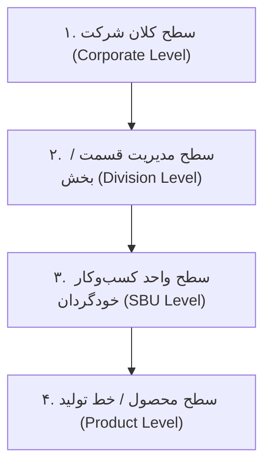

1. **سطح کلان شرکت:** تدوین رسالت و ماموریت کلی، تخصیص منابع به بخش‌ها و تعیین چارچوب ورود/خروج از کسب‌وکارها. (کتاب سه استاد، ص ۲۱)
2. **سطح مدیریت قسمت:** تدوین برنامه‌ها و تخصیص بودجه به هریک از واحدهای تحت پوشش بخش. (کتاب سه استاد، ص ۲۱)
3. **سطح واحد کسب‌وکار خودگردان:** تدوین استراتژی رقابتی برای هر واحد مستقل با هدف سودآوری در بازار مشخص. (کتاب سه استاد، ص ۲۱)
4. **سطح محصول:** تدوین برنامه بازاریابی عملیاتی برای یک محصول یا برند مشخص. (کتاب سه استاد، ص ۲۱)

---

## ۳. برنامه‌ریزی استراتژیک در سطح کلان شرکت (کتاب سه استاد، ص ۲۱ تا ۲۵)

برنامه‌ریزی استراتژیک در سطح ستاد کلان شرکت شامل ۴ مرحله بنیادین است:


### گام اول: تعریف فلسفه وجودی و ماموریت شرکت (کتاب سه استاد، ص ۲۱ و ۲۲)
مأموریت یا رسالت، هویت بنیادین و هدف نهایی سازمان را مشخص می‌کند و نوعی «دست نامرئی» است که کارکنان را به سمت هدف مشترک هدایت می‌نماید.

#### ۵ عنصر کلیدی در تدوین بیانیه مأموریت (کتاب سه استاد، ص ۲۱ و ۲۲):
1. **تاریخچه شرکت:** توجه به پیشینه، دستاوردها و ریشه‌های شکل‌گیری سازمان.
2. **ترجیحات و تمایلات مدیریت فعلی و مالکان:** ارزش‌ها، باورها و ترجیحات راهبردی رهبران فعلی.
3. **محیط بازار:** تغییرات محیط بیرونی، نیازهای مشتریان و روندهای اقتصادی-صنعتی.
4. **منابع سازمان:** توان مالی، تکنولوژیک و منابع انسانی در دسترس.
5. **صلاحیت‌های آشکار و شایستگی‌های محوری:** مزیت‌های خاصی که سازمان در آن‌ها نسبت به رقبا سرآمد است.

#### ۴ قلمرو اساسی در تعریف بیانیه مأموریت (کتاب سه استاد، ص ۲۲):
- **قلمرو صنعت:** طیف صنایعی که شرکت در آن‌ها رقابت می‌کند (تک‌صنعتی، چندصنعتی مرتبط یا نامرتبط).
- **قلمرو بازار / محصولات و کاربردها:** گستره نیازهایی که شرکت پاسخ می‌دهد و کاربردهایی که محصولاتش دارند.
- **قلمرو عمودی:** میزان ادغام عمودی رو به جلو یا رو به عقب (از تهیه مواد اولیه تا توزیع نهایی).
- **قلمرو جغرافیایی:** گستره محلی، منطقه‌ای، ملی، بین‌المللی یا جهانی عملیات شرکت.

---

### گام دوم: شناسایی واحدهای کسب‌وکار خودگردان (کتاب سه استاد، ص ۲۲ و ۲۳)
واحدهای کسب‌وکار استراتژیک، هسته‌های عملیاتی و مستقل درون سازمان هستند.

> [!IMPORTANT] مدل سه بعدی درک آبـل در تعریف کسب‌وکار (کتاب سه استاد، ص ۲۲)
> آبـل معتقد است هر کسب‌وکار را باید بر اساس سه بعد تعریف کرد نه بر اساس کالا:
> 1. **گروه‌های مشتریان (چه کسانی؟):** چه گروهی از مشتریان هدف قرار گرفته‌اند؟
> 2. **نیازهای مشتریان (چه چیزی؟):** چه نیازها و منافعی برای مشتری برطرف می‌شود؟
> 3. **تکنولوژی / نحوه پاسخگویی (چگونه؟):** با چه فناوری و شیوه‌ای نیاز برطرف می‌گردد؟

#### سه ویژگی قطعی یک واحد خودگردان (کتاب سه استاد، ص ۲۳):
1. یک رشته کاری یا مجموعه‌ای از کسب‌وکارهای مرتبط است که می‌توان آن را جداگانه برنامه‌ریزی کرد.
2. مجموعه رقبا و مشتریان مشخص و متمایز خود را دارد.
3. یک مدیر مشخص و مسئول دارد که پاسخگوی برنامه‌ریزی استراتژیک، سودآوری و عملکرد واحد است.

---

### گام سوم: ارزیابی و تحلیل پرتفوی کسب‌وکارها (کتاب سه استاد، ص ۲۳ تا ۲۵)

شرکت باید تصمیم بگیرد به کدام واحدها بودجه تزریق کند، از کدام نقدینگی برداشت کند و کدام واحد را واگذار نماید. دو مدل اصلی برای این کار وجود دارد:

#### ۱. ماتریس گروه مشاوران بوستون (کتاب سه استاد، ص ۲۳ تا ۲۵)
این ماتریس یک جدول ۲×۲ بر اساس دو بعد اصلی است:
- **محور عمودی:** نرخ رشد بازار $\rightarrow$ کم / زیاد (نشان‌دهنده جذابیت بازار و نیاز به نقدینگی).
- **محور افقی:** سهم نسبی بازار $\rightarrow$ زیاد / کم (نسبت سهم شرکت به سهم بزرگترین رقیب، نشان‌دهنده توان رقابتی و تولید نقدینگی).

```mermaid
quadrantChart
 title ماتریس رشد-سهم بوستون (BCG Matrix)
 x-axis سهم نسبی بازار کم --> سهم نسبی بازار زیاد
 y-axis نرخ رشد بازار کم --> نرخ رشد بازار زیاد
 quadrant-1 ستاره‌ها (Stars)
 quadrant-2 علامت سؤال (Question Marks)
 quadrant-3 سگ‌ها (Dogs)
 quadrant-4 گاوهای شیرده (Cash Cows)
```

| ربع ماتریس | نرخ رشد بازار | سهم نسبی بازار | وضعیت نقدینگی | استراتژی مناسب | توضیحات تکمیلی (کتاب سه استاد، ص ۲۴ و ۲۵) |
|:--- |:--- |:--- |:--- |:--- |:--- |
| **علامت سؤال** | **زیاد** | **کم** | مصرف‌کننده شدید نقدینگی (کسری نقدینگی) | **ساخت** یا **حذف** | کسب‌وکارهای تازه وارد بازار پررشد. شرکت باید تصمیم بگیرد آیا با تزریق سرمایه سنگین آن را به ستاره تبدیل کند یا پیش از زیان‌دهی واگذار کند. |
| **ستاره‌ها** | **زیاد** | **زیاد** | تولید نقدینگی بالا، مصرف نقدینگی بالا (سربه‌سر یا خودکفا) | **حفظ موقعیت / ساخت** | رهبران بازار هستند. در دوران رشد باید موقعیت آن‌ها حفظ شود. با کاهش رشد بازار، به‌طور طبیعی به گاو شیرده تبدیل می‌شوند. |
| **گاوهای شیرده** | **کم** | **زیاد** | مازاد شدید نقدینگی (تولید پول بسیار بالا، مصرف کم) | **حفظ** یا **برداشت** | پایدارترین و سودآورترین بخش شرکت. نقدینگی حاصل از آن‌ها خرج ستاره‌ها، تحقیق و توسعه و علامت‌های سؤال می‌شود. |
| **سگ‌ها** | **کم** | **کم** | نقدینگی کم یا منفی (تله نقدینگی و زمان) | **برداشت** یا **واگذاری / انحلال** | سود کم یا زیان‌ده. وقت و انرژی مدیریت را هدر می‌دهند. مگر در شرایط استراتژیک خاص باید منحل یا فروخته شوند. |

#### ۴ استراتژی اساسی بر مبنای تحلیل BCG (کتاب سه استاد، ص ۲۵):
1. **ساخت:** افزایش سهم بازار حتی به قیمت فدا کردن سود کوتاه‌مدت؛ بسیار مناسب برای **علامت‌های سؤال** برای رساندن آنها به ستاره.
2. **حفظ:** حفظ سهم بازار فعلی؛ مناسب برای **گاوهای شیرده قوی** تا همچنان جریان نقدینگی کلان تولید کنند.
3. **برداشت:** به حداکثر رساندن جریان نقدینگی کوتاه‌مدت بدون توجه به آینده بلندمدت؛ مناسب برای **گاوهای شیرده ضعیف**، **علامت‌های سؤال ناامیدکننده** و **سگ‌ها**.
4. **اختتام / واگذاری:** فروش یا منحل کردن واحد و انتقال سرمایه به موقعیت‌های بهتر؛ مناسب برای **سگ‌ها** و **علامت‌های سؤال شکست‌خورده**.

---

#### ۲. مدل جنرال الکتریک (کتاب سه استاد، ص ۲۵)
- ماتریس BCG فقط بر دو متغیر (رشد بازار و سهم نسبی) تکیه دارد که ساده‌انگارانه است.
- مدل جنرال الکتریک یک ماتریس چندعاملی ۳×۳ (۹ خانه‌ای) است که دو بعد جامع‌تر دارد:
 1. **جذابیت بازار / صنعت**
 2. **توانایی رقابتی / موقعیت کسب‌وکار**
- در این مدل، عوامل متعددی مانند اندازه بازار، نرخ سودآوری، موانع ورود، شدت رقابت و تکنولوژی وزن‌دهی و ترکیب می‌شوند.

---

## ۴. مراحل ۸گانه برنامه‌ریزی استراتژیک در سطح واحدهای خودگردان (کتاب سه استاد، ص ۲۵ و ۲۶)

برنامه‌ریزی استراتژیک در سطح یک واحد کسب‌وکار خودگردان شامل ۸ مرحله پیوسته و منطقی است:

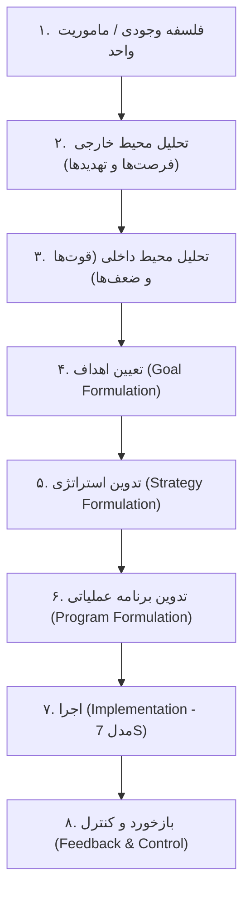

1. **فلسفه وجودی و ماموریت واحد:** تعریف دقیق دامنه فعالیت، بازار هدف و نحوه ارزش‌آفرینی واحد. (کتاب سه استاد، ص ۲۵)
2. **تجزیه و تحلیل محیط خارجی (تحلیل فرصت‌ها و تهدیدها - O & T):** پایش عوامل کلان (جمعیت‌شناختی، اقتصادی، تکنولوژیک، سیاسی، قانونی و اجتماعی-فرهنگی) و عوامل خرد (مشتریان، رقبا، تأمین‌کنندگان، واسطه‌ها). (کتاب سه استاد، ص ۲۵ و ۲۶)
 - **سنجش فرصت‌ها:** با دو شاخص «میزان جذابیت» و «احتمال موفقیت» سنجیده می‌شوند.
 - **سنجش تهدیدها:** با دو شاخص «جدی بودن تهدید» و «احتمال وقوع» ارزیابی می‌شوند.
3. **تجزیه و تحلیل محیط داخلی (تحلیل نقاط قوت و ضعف - S & W):** ممیزی شایستگی‌های درونی در ۴ سرفصل: (کتاب سه استاد، ص ۲۶)
 - **مالی:** هزینه‌ها، دسترسی به سرمایه، سودآوری و تعادل مالی.
 - **بازاریابی:** شهرت شرکت، سهم بازار، کیفیت محصولات، شبکه توزیع، تبلیغات و اثربخشی نیروهای فروش، تحقیق و توسعه و گستره جغرافیایی.
 - **تولید:** صرفه‌های مقیاس، امکانات فیزیکی، ظرفیت تولید، تحویل فوری و مهارت‌های فنی.
 - **سازمان:** رهبری توانمند، کارکنان لایق، گرایش کارآفرینی و انعطاف‌پذیری ساختار.
4. **تعیین اهداف:** مشخص کردن نتایج مطلوب مانند سودآوری، رشد فروش، سهم بازار، شهرت و نوآوری. اهداف باید دارای ۴ ویژگی باشند: سلسله‌مراتبی (به ترتیب اهمیت مرتب شده)، کمی و قابل سنجش، واقع‌گرایانه و دست‌یافتنی، و هماهنگ و سازگار با یکدیگر. (کتاب سه استاد، ص ۲۶)
5. **تدوین استراتژی:** راهکار دستیابی به اهداف. مایکل پورتر سه استراتژی عمومی (ژنریک) معرفی می‌کند: (کتاب سه استاد، ص ۲۶)
 - **رهبری در هزینه:** دستیابی به کمترین هزینه تولید و توزیع در صنعت برای جذب مشتریان حساس به قیمت.
 - **تمایز:** ارائه محصول با ویژگی‌های منحصربه‌فرد و برتر در ابعاد کیفیت، برند، طراحی یا خدمات.
 - **تمرکز / کانون:** تمرکز بر روی یک بخش محدود و گوشه‌ای از بازار (نیچ) با رویکرد تمرکز بر هزینه یا تمرکز بر تمایز.
6. **تدوین برنامه‌های عملیاتی:** تبدیل استراتژی‌های کلان به پروژه‌ها، فعالیت‌ها و وظایف مشخص با زمان‌بندی و بودجه اجرایی. (کتاب سه استاد، ص ۲۶)
7. **اجرا (مدل 7S مکنزی):** استراتژی به تنهایی متضمن موفقیت نیست و یکی از ۷ عامل پیوندیافته موفقیت سازمانی است: (کتاب سه استاد، ص ۲۶)
 - **عوامل سخت:** استراتژی، ساختار، سیستم‌ها.
 - **عوامل نرم:** سبک رهبری و رفتار، مهارت‌ها، کارکنان، ارزش‌های مشترک و فرهنگ.
8. **بازخورد و کنترل:** پایش مداوم نتایج، رصد تغییرات محیطی و بازنگری در اهداف یا استراتژی‌ها در صورت انحراف از برنامه. (کتاب سه استاد، ص ۲۶)

---

## ۵. فرایند مدیریت بازاریابی (کتاب سه استاد، ص ۲۶ تا ۲۸)

فرایند بازاریابی، توالی فعالیت‌هایی است که بازار را ارزیابی و استراتژی‌های اجرایی را پیاده‌سازی می‌کند:


1. **تجزیه و تحلیل موقعیت‌های بازار:** بررسی روندهای کلان، نیازهای پنهان و آشکار خریداران و جذابیت حوزه‌های بازار. (کتاب سه استاد، ص ۲۷)
2. **جستجو و انتخاب بازارهای هدف:** (کتاب سه استاد، ص ۲۷)
 - تخمین اندازه، پتانسیل، نرخ رشد و سودآوری بازار.
 - **بخش‌بندی بازار:** تفکیک خریداران بر اساس ویژگی‌ها، نیازها یا رفتار خرید.
 - **انتخاب بازار هدف:** برگزیدن یک یا چند بخش بازار بر اساس منابع و توانمندی شرکت.
3. **طراحی استراتژی‌های بازاریابی:** (کتاب سه استاد، ص ۲۷)
 - ایجاد تمایز و جایگاه‌سازی ذهنی مناسب در مقایسه با رقبا بر اساس ملاک‌هایی مانند قیمت، کیفیت و خدمات.
 - هماهنگ‌سازی استراتژی با چرخه عمر محصول.
4. **برنامه‌ریزی برای برنامه‌های بازاریابی (آمیخته بازاریابی ۴P مک‌کارتی):** (کتاب سه استاد، ص ۲۷ و ۲۸)
 - **محصول:** طرح، کیفیت، مشخصات، نام تجاری و بسته‌بندی.
 - **قیمت:** حساس‌ترین عنصر آمیخته بازاریابی؛ مبالغ دریافتی از مشتری، تخفیفات و شرایط پرداخت.
 - **توزیع:** کلیه فعالیت‌های انتقال فیزیکی کالا از شرکت به دست مصرف‌کننده نهایی.
 - **ترفیع / ترویج:** ارتباطات بازاریابی، تبلیغات، تشویق فروش، روابط عمومی و فروش شخصی جهت ترغیب مشتری به خرید.
5. **سازماندهی، اجرا و کنترل فعالیت‌های بازاریابی:** (کتاب سه استاد، ص ۲۸)
 - **الف) کنترل برنامه سالیانه:** اطمینان از دستیابی به اهداف فروش، سود و سهم بازار سالانه از طریق مقایسه عملکرد واقعی با بودجه و اصلاح انحرافات.
 - **ب) کنترل سودآوری:** ارزیابی سودآوری واقعی محصولات، کانال‌های توزیع، مناطق جغرافیایی و بخش‌های مختلف بازار.
 - **ج) کنترل استراتژیک:** بازبینی بنیادین اینکه آیا شرکت هنوز فرصت‌های مناسب بازار را شکار می‌کند؟ ابزار کلیدی آن **ممیزی بازاریابی** است.

---

## ۶. ماهیت و اجزای سند برنامه بازاریابی (کتاب سه استاد، ص ۲۸ و ۲۹)

یک سند مدون برنامه بازاریابی معمولاً از ۸ بخش استاندارد تشکیل می‌شود:

| ردیف | بخش برنامه بازاریابی | محتوا و کارکرد کلیدی (کتاب سه استاد، ص ۲۸ و ۲۹) |
|:---: |:--- |:--- |
| **۱** | **خلاصه مدیریتی** | چکیده‌ای کوتاه از اهداف و توصیه‌های اصلی برای تصمیم‌گیری سریع مدیران ارشد. |
| **۲** | **موقعیت فعلی بازاریابی** | ارائه اطلاعات تاریخی بازار، اندازه بازار، رفتار خریداران، عملکرد فروش و سودآوری محصول، تحلیل رقبا و کانال‌های توزیع. |
| **۳** | **تجزیه و تحلیل فرصت‌ها، تهدیدها، قوت‌ها و ضعف‌ها** | شناسایی پیشران‌های بیرونی و توانمندی‌ها و محدودیت‌های درونی برای اولویت‌بندی استراتژیک. |
| **۴** | **اهداف** | تفکیک اهداف به مالی (مانند بازده سرمایه) و بازاریابی (مانند سهم بازار)؛ باید روشن، زمان‌دار، کمی و سازگار باشند. |
| **۵** | **استراتژی بازاریابی** | تبیین خط‌مشی‌های کلان در حوزه بازار هدف، جایگاه‌یابی، آمیخته ۴P و الزامات هماهنگی با سایر واحدها. |
| **۶** | **برنامه عملیاتی** | پاسخ به این سؤالات: چه کاری؟ توسط چه کسی؟ در چه زمانی؟ با چه هزینه‌ای انجام خواهد شد؟ |
| **۷** | **صورت سود و زیان پیش‌بینی‌شده** | برآورد حجم فروش، پیش‌بینی درآمدها، برآورد کلیه هزینه‌های تولید و بازاریابی و استخراج سود عملیاتی مورد انتظار. |
| **۸** | **کنترل‌ها و برنامه‌های اقتضایی** | تعیین سنجه‌ها و فواصل پایش برای پیگیری پیشرفت و برنامه‌های جایگزین در صورت وقوع حوادث غیرمترقبه. |

---

## ۷. مبانی برنامه‌ریزی استراتژیک بازارگرا و مدل کسب‌وکارهای با عملکرد بالا (مرجع کاتلر، ص ۸۹ تا ۹۳)

کاتلر عنوان فصل را «غلبه بر بازارها با استفاده از برنامه‌ریزی استراتژیک بازارگرا» می‌نامد (مرجع کاتلر، ص ۸۹) و تأکید می‌کند که شرکت‌های برتر، واحدهایی هستند که می‌توانند خود را همواره با تغییرات بازار هماهنگ سازند.

### تعریف برنامه‌ریزی استراتژیک بازارگرا (مرجع کاتلر، ص ۹۰)
> **تعریف رسمی کاتلر:** «برنامه‌ریزی استراتژیک بازارگرا عبارت است از یک فرآیند مدیریتی برای ایجاد و حفظ یک تناسب ماندنی و پایدار میان اهداف، توانایی‌ها و منابع سازمان از یک سو، و فرصت‌های در حال تغییر بازار از سوی دیگر. هدف برنامه‌ریزی استراتژیک، شکل دادن و تغییر شکل فعالیت‌ها و محصولات شرکت است به‌نحوی که امکان دستیابی به سود و رشد هدف محقق گردد.» (مرجع کاتلر، ص ۹۰)

#### سه زمینه کلیدی تصمیم‌گیری استراتژیک (مرجع کاتلر، ص ۹۰):
1. **مدیریت فعالیت‌ها به عنوان یک ترکیب سرمایه‌گذاری:** شرکت نباید همه فعالیت‌ها را یکسان ببیند؛ هر فعالیت سودآوری بالقوه متفاوتی دارد و منابع باید بر اساس این پتانسیل تخصیص یابد.
2. **برآورد دقیق سودآوری و پتانسیل آتی هر فعالیت:** ارزیابی نرخ رشد بازار و میزان شایستگی و تناسب شرکت در آن بازار.
3. **تدوین خط‌مشی (استراتژی) بازی متمایز:** هیچ استراتژی واحدی برای همه شرکت‌ها مناسب نیست؛ هر شرکت باید استراتژی متناسب با جایگاه، توانایی‌ها و اهداف خود داشته باشد (مانند تفاوت استراتژی کاهش هزینه گودیر، نوآوری میشلن و سهم بازار بریجستون).

### سطوح دوگانه برنامه بازاریابی در سازمان (مرجع کاتلر، ص ۹۱)
کاتلر برنامه‌ریزی بازاریابی را به دو سطح حیاتی تفکیک می‌کند:

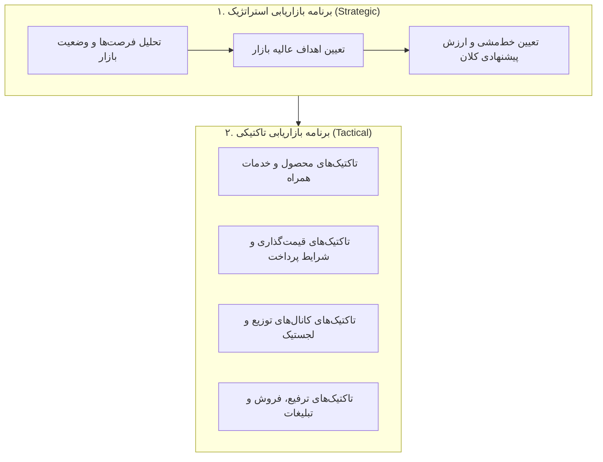

- **برنامه بازاریابی استراتژیک:** مبتنی بر تجزیه و تحلیل وضعیت و فرصت‌های کنونی بازار بوده و اهداف و خط‌مشی عالیه بازاریابی و جایگاه ارزش پیشنهادی را تبیین می‌کند. (مرجع کاتلر، ص ۹۱)
- **برنامه بازاریابی تاکتیکی:** تاکتیک‌های اجرایی و عملیاتی بازاریابی همچون ویژگی‌های محصول، قیمت‌گذاری، کانال‌های توزیع، خدمات، تبلیغات و فروش را شرح می‌دهد. (مرجع کاتلر، ص ۹۱)

---

### مدل کسب‌وکارهای با عملکرد بالا (مدل آرتور دی. لیتل) (مرجع کاتلر، ص ۹۲ و ۹۳)
مؤسسه مشاوره‌ای آرتور دی. لیتل چهار عامل کلیدی موفقیت را برای کسب‌وکارهای با عملکرد بالا معرفی کرده است:

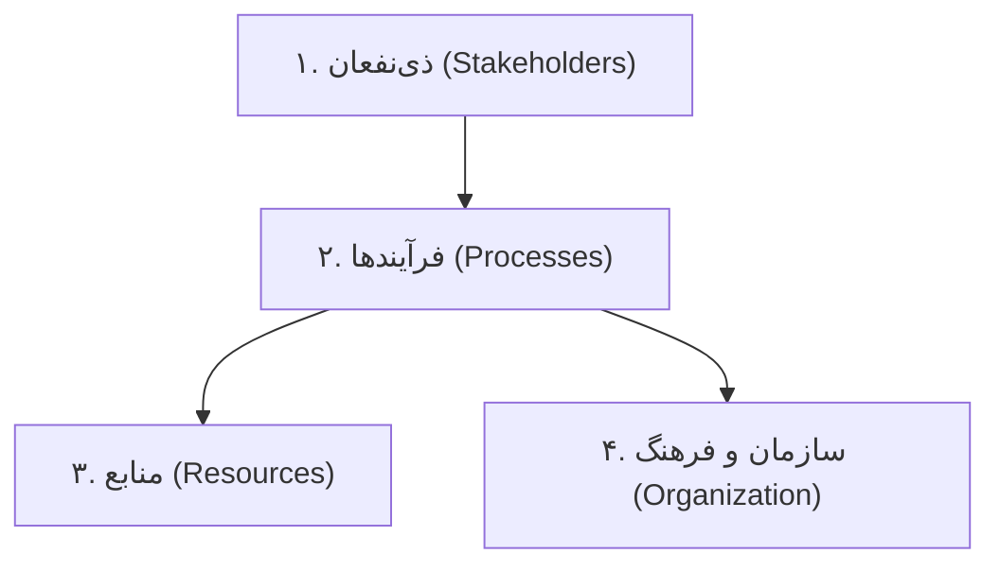

1. **طرف‌های ذی‌نفع:** (مرجع کاتلر، ص ۹۲)
 - در گذشته شرکت‌ها فقط به **سهامداران** توجه می‌کردند. اما امروزه عملکرد بالا مستلزم ارضای متوازن نیازهای همه ذی‌نفعان است: مشتریان، کارکنان، تأمین‌کنندگان، توزیع‌کنندگان و سهامداران.
 - **چرخه مثبت رضایت ذی‌نفعان:** رضایت کارکنان $\rightarrow$ افزایش کیفیت و نوآوری $\rightarrow$ رضایت و وفاداری بیشتر مشتریان $\rightarrow$ تکرار خرید و رشد فروش $\rightarrow$ افزایش سودآوری و رضایت سهامداران $\rightarrow$ سرمایه‌گذاری مجدد در رفاه کارکنان و فناوری.
2. **فرآیندها:** (مرجع کاتلر، ص ۹۳)
 - ساختارهای سنتی وظیفه‌ای، دیوارهای بلندی بین بخش‌ها می‌سازند که مانع همکاری است.
 - شرکت‌های پیشرو به جای مدیریت بخش‌های مجزا، **فرآیندهای کاری اصلی** مانند فرآیند توسعه محصول جدید، فرآیند جذب و حفظ مشتری، و فرآیند تحقق سفارش را از طریق **تیم‌های متقابل چندوظیفه‌ای** مدیریت می‌کنند.
3. **منابع:** (مرجع کاتلر، ص ۹۳)
 - منابع شامل سرمایه، نیروی کار، تجهیزات، مواد و اطلاعات است.
 - سازمان‌های موفق به این نتیجه رسیده‌اند که نباید مالک تمام منابع باشند، بلکه باید روی **شایستگی‌های محوری** خود تمرکز کرده و سایر فعالیت‌ها را از طریق **برون‌سپاری** به پیمانکاران متخصص بسپارند.
4. **سازمان و فرهنگ سازمانی:** ساختار سازمانی، رویه‌ها و فرهنگ باید حامی یادگیری، چابکی و پاسخ‌گویی سریع به بازار باشند. (مرجع کاتلر، ص ۹۲ و ۹۳)

---

### شایستگی‌های محوری و فرهنگ سازمانی (مرجع کاتلر، ص ۹۴ و ۹۵)
کاتلر تأکید می‌کند که کلید موفقیت سازمان‌ها در حفظ و پرورش «شایستگی‌های محوری» نهفته است، نه الزاماً مالکیت فیزیکی تمامی دارایی‌ها.

#### ۳ ویژگی بنیادین یک شایستگی محوری (مرجع کاتلر، ص ۹۴):
1. **منبع ایجاد مزیت رقابتی پایدار است** و سهم بسزایی در منافع ادراک‌شده توسط مشتری ایفا می‌کند.
2. **دارای کاربردهای بالقوه وسیع در بازارهای گوناگون است** (مانند تخصص هوندا در طراحی و تولید موتورهای احتراقی کوچک که در موتورسیکلت، اتومبیل، ماشین چمن‌زنی و ژنراتور به کار می‌رود).
3. **تقلید از آن برای رقبا بسیار دشوار و پرهزینه است.**

> [!TIP] مفهوم شرکت‌های میان‌تهی (مرجع کاتلر، ص ۹۴ و ۹۷)
> شرکت‌هایی هستند که تولید فیزیکی، مونتاژ، بسته‌بندی یا انبارداری را به‌طور کامل به پیمانکاران خارجی واگذار کرده و خود صرفاً بر هسته اصلی ارزش‌آفرینی یعنی طراحی (R&D) و بازاریابی/برندسازی تمرکز دارند (مانند شرکت نایک).

#### فرهنگ سازمانی و کتاب «ساختن برای ماندن» (مرجع کاتلر، ص ۹۴ و ۹۵)
کالینز و پوراس در پژوهش ۶ ساله خود ۱۸ صنعت برتر را بررسی و شرکت‌ها را به دو دسته **«شرکت‌های رؤیایی »** و **«شرکت‌های مقایسه‌ای»** تقسیم کردند. شرکت‌های رؤیایی (مانند جنرال الکتریک، بوئینگ، اچ‌پی، جانسون‌اندجانسون و ۳M):
- دارای یک **ایدئولوژی محوری پایدار** هستند که هرگز تغییر نمی‌کند (احترام به افراد، کیفیت، مسئولیت اجتماعی).
- در عین حال، هدف‌ها، روش‌ها، استراتژی‌ها و فرآیندهای عملیاتی خود را پیوسته و منعطف با تغییرات بازار انطباق می‌دهند.

---

## ۸. برنامه‌ریزی استراتژیک در سطح کلان شرکت به روایت کاتلر (مرجع کاتلر، ص ۹۵ تا ۹۸)

ستاد مرکزی شرکت مسئولیت هدایت کل سازمان را بر عهده دارد و چهار فعالیت کلیدی را پیاده‌سازی می‌کند:

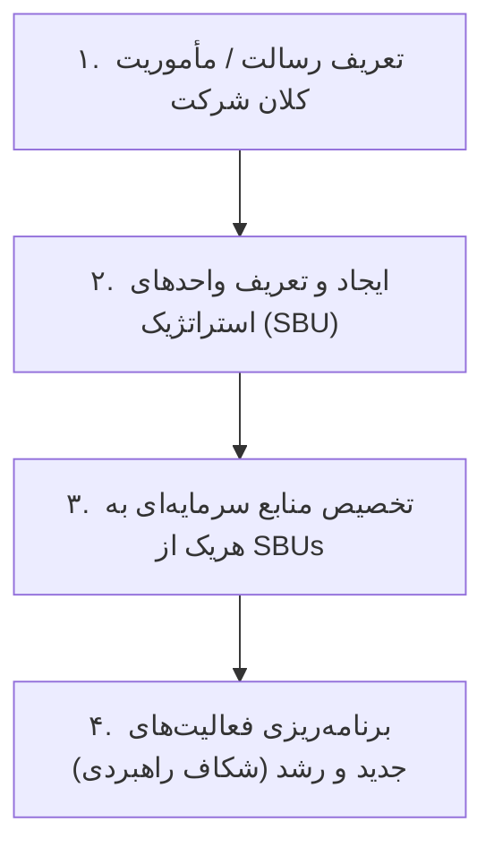

### ۱. تعریف بیانیه رسالت / مأموریت شرکت (مرجع کاتلر، ص ۹۵ تا ۹۷)
بیانیه مأموریت مانند یک **«دست نامرئی»** عمل می‌کند که کارکنان پراکنده را به سمت یک هدف مشترک راهنمایی می‌نماید.

#### ۵ پرسش بنیادین پیتر دراکر در تدوین مأموریت (مرجع کاتلر، ص ۹۶):
- **کار و کسب‌وکار ما چیست؟ (?)**
- **مشتری ما کیست؟ (?)**
- **ارزش از نظر مشتری چیست؟ (?)**
- **کسب‌وکار ما در آینده چه خواهد بود؟ (?)**
- **کسب‌وکار ما چه باید باشد؟ (?)**

#### ۵ عنصر شکل‌دهنده رسالت (مرجع کاتلر، ص ۹۶):
1. **تاریخچه سازمان:** اهداف و هویت تاریخی مؤسسان.
2. **ترجیحات و سلایق مالکان و مدیران ارشد فعلی.**
3. **محیط بیرونی بازار:** تغییرات فناوری و نیازهای مشتریان.
4. **منابع سازمان:** توان مالی، انسانی و لجستیکی در دسترس.
5. **شایستگی‌های منحصربه‌فرد و ممتاز:** حوزه‌هایی که شرکت در آن‌ها بهترین است.

#### ۳ ویژگی یک بیانیه مأموریت کارآمد و الهام‌بخش (مرجع کاتلر، ص ۹۷):
1. **تمرکز بر تعداد محدودی از اهداف ملموس:** اجتناب از کلی‌گویی و ادعای برتری در همه‌چیز.
2. **تأکید صریح بر سیاست‌ها، ارزش‌ها و سلوک رفتاری سازمان.**
3. **تعیین دقیق محدوده‌های رقابتی اصلی:**
 - **محدوده صنعتی:** فعالیت در یک صنعت، چند صنعت مرتبط یا نامرتبط.
 - **محدوده کالا و کاربردها:** دامنه کالاها و کاربردهای آنها.
 - **محدوده قابلیت و شایستگی:** فناوری‌ها و شایستگی‌های تحت تسلط (مانند فناوری ریزقطعات در شرکت).
 - **محدوده قسمت بازار:** تمرکز بر طبقه خاصی از مشتریان (مانند پورشه برای بازار لوکس).
 - **محدوده عمودی:** میزان یکپارچگی عمودی (ادغام عمودی کامل تا مدل شرکت‌های میان‌تهی).
 - **محدوده جغرافیایی:** بازارهای محلی، ملی یا حضور در ده‌ها کشور (مانند کاترپیلار در بیش از ۱۸۰ کشور).

---

### ۲. تعریف واحدهای کسب‌وکار استراتژیک و پرهیز از نزدیک‌بینی بازاریابی (مرجع کاتلر، ص ۹۸)

> [!WARNING] دام نزدیک‌بینی بازاریابی - تئودور لویت (مرجع کاتلر، ص ۹۸)
> تئودور لویت تأکید می‌کند شرکت‌هایی که کسب‌وکار خود را بر مبنای **کالا (محصول فیزیکی)** تعریف می‌کنند، به دلیل تغییرات فناوری و ظهور کالاهای جانشین محکوم به زوال هستند. کسب‌وکارها باید همواره بر مبنای **نیازهای بازار و فرآیند ارزش‌آفرینی برای مشتری** تعریف شوند، زیرا کالاها فانی و متغیرند اما نیازهای اساسی پایدار می‌مانند.

#### جدول مقایسه تعاریف کالا‌محور در برابر تعاریف بازارمحور کاتلر (مرجع کاتلر، ص ۹۸):

| نام شرکت | تعریف بر اساس کالا (کالامحور / محدود) | تعریف بر اساس بازار و نیاز مشتری (بازارمحور / استراتژیک) |
|:--- |:--- |:--- |
| **راه‌آهن میسوری پاسیفیک** | ما یک راه‌آهن را اداره می‌کنیم. | **ما امکان جابه‌جایی و تحرک مردم و بار را فراهم می‌سازیم.** |
| **زیراکس** | ما دستگاه فتوکپی تولید می‌کنیم. | **ما به بهبود بهره‌وری و کارایی امور اداری کمک می‌کنیم.** |
| **استاندارد اویل** | ما بنزین و نفت می‌فروشیم. | **ما انرژی به بازار عرضه می‌کنیم.** |
| **کلمبیا پیکچرز** | ما فیلم سینمایی می‌سازیم. | **ما سرگرمی به بازار عرضه می‌کنیم.** |
| **دایره‌المعارف بریتانیکا** | ما کتاب دایره‌المعارف می‌فروشیم. | **ما اطلاعات و دانش را توزیع می‌کنیم.** |
| **کریر** | ما کولر و بخاری تولید می‌کنیم. | **ما تهویه مطبوع و کنترل هوای مطلوب در منازل و محل کار ایجاد می‌کنیم.** |
| **ویرل‌پول** | ما ماشین لباسشویی و یخچال تولید می‌کنیم. | **ما مراقب و حافظ الیاف پوشاک و نگه‌دارنده سلامت مواد غذایی هستیم.** |

---

## ۹. ارزیابی پرتفوی کسب‌وکارها در دیدگاه کاتلر (مرجع کاتلر، ص ۹۹ تا ۱۰۳)

کاتلر پس از تبیین اهمیت تعریف کسب‌وکار بر مبنای نیاز بازار، نحوه تخصیص بهینه منابع را از طریق دو مدل کلاسیک پرتفوی تحلیل می‌کند:

### مدل سه بعدی درک آبـل در سطح SBU (مرجع کاتلر، ص ۹۹)
هر واحد کسب‌وکار بر اساس سه بعد تعریف می‌شود:
1. **گروه‌های مشتریان:** چه کسانی را خدمت‌رسانی می‌کنیم؟
2. **نیازهای مشتریان:** چه نیازی را ارضا می‌کنیم؟
3. **تکنولوژی:** چگونه و با چه ابزار یا فرآیندی این نیاز را برطرف می‌سازیم؟

#### ۳ مشخصه قطعی یک SBU در دیدگاه کاتلر (مرجع کاتلر، ص ۹۹):
1. یک کسب‌وکار منفرد یا مجموعه‌ای از کسب‌وکارهای مرتبط است که می‌توان آن را جدا از بقیه شرکت برنامه‌ریزی کرد.
2. مجموعه رقبای مشخص و متمایز خود را در بازار دارد.
3. یک مدیر ارشد مستقل دارد که مسئولیت برنامه‌ریزی استراتژیک، سودآوری و کنترل محرک‌های سود را برعهده دارد.

---

### ماتریس رشد - سهم بوستون با جزئیات فنی کاتلر (مرجع کاتلر، ص ۹۹ تا ۱۰۱)
کاتلر جزئیات ریاضی و نموداری دقیقی از ماتریس BCG ارائه می‌دهد:
- **محور عمودی (نرخ رشد سالانه بازار):** بین ۰ تا ۲۰ درصد؛ نرخ رشد **۱۰ درصد** خط مرزی بین رشد بالا و پایین است.
- **محور افقی (سهم نسبی بازار):** در مقیاس لگاریتمی از ۰.۱ تا ۱۰ ترسیم می‌شود؛ عدد **۱** خط مرزی است. سهم نسبی ۱ یعنی سهم شرکت دقیقاً برابر با بزرگترین رقیب است؛ سهم بالاتر از ۱ نشان‌دهنده رهبری (لیدر) در بازار است.
- **اندازه دایره‌ها:** بیانگر حجم دلاری فروش هر واحد اقتصادی در کل شرکت است.
- **قطاع برش‌خورده (پای‌چارت):** نشان‌دهنده سهم بازار واقعی واحد در صنعت مربوطه است.

#### کالبدشکافی ۴ خانه ماتریس BCG در دیدگاه کاتلر (مرجع کاتلر، ص ۱۰۰):
1. **علامت سؤال / کودک مسئله‌ساز:**
 - نرخ رشد بازار بالا (> ۱۰٪)، اما سهم نسبی بازار پایین (< ۱).
 - ورود به بازاری که از قبل پیشتاز دارد؛ نیاز مبرم به پول نقد برای ماشین‌آلات، پرسنل و رقابت با لیدر.
2. **ستاره‌ها:**
 - نرخ رشد بازار بالا (> ۱۰٪) و سهم نسبی بازار بالا (> ۱).
 - رهبر بازار؛ الزماً نقدینگی مازاد کلان تولید نمی‌کنند، چون باید برای حفظ رشد و مقابله با حملات رقبا هزینه‌های سنگین تبلیغات و تحقیق و توسعه بپردازند.
3. **گاوهای شیرده:**
 - نرخ رشد بازار کند شده (< ۱۰٪)، اما سهم نسبی همچنان در دست پیشتاز است (> ۱).
 - به دلیل صرفه‌های مقیاس و عدم نیاز به تأسیسات جدید، نقدینگی مازاد فراوان برای شرکت می‌آورند. این منابع صرف پرداخت دیون و تغذیه ستاره‌ها و علامت‌های سوال منتخب می‌شود.
4. **سگ‌ها:**
 - رشد بازار کم (< ۱۰٪) و سهم نسبی کم (< ۱).
 - سود بسیار اندک یا زیان مداوم؛ سارقان زمان و انرژی مدیریت ارشد سازمان هستند.

#### ۴ استراتژی چهارگانه کاتلر بر اساس ماتریس بوستون (مرجع کاتلر، ص ۱۰۱):
- **ساخت:** افزایش سهم بازار حتی به بهای چشم‌پوشی از سودهای کوتاه‌مدت (ایده‌آل برای علامت‌های سوال برگزیده جهت تبدیل به ستاره).
- **داشت / حفظ:** حفظ سهم بازار فعلی واحد خودگردان (ایده‌آل برای گاوهای شیرده قدرتمند).
- **درو کردن / برداشت:** بیشینه‌سازی جریان نقدی کوتاه‌مدت با قطع هزینه‌های تحقیق و توسعه، تعویض نکردن تجهیزات مستهلک، کاهش پرسنل و تبلیغات (مناسب برای گاوهای شیرده ضعیف، علامت‌های سوال بدون آینده و سگ‌ها).
- **رها کردن / واگذاری:** انحلال، ادغام یا فروش واحد اقتصادی جهت آزادسازی نقدینگی برای بخش‌های مستعد (مناسب برای سگ‌ها و علامت‌های سوال شکست‌خورده).

#### خطاهای استراتژیک پرتفوی در دیدگاه کاتلر (مرجع کاتلر، ص ۱۰۱):
> [!CAUTION] ۳ اشتباه مرگبار سازمان‌ها در تحلیل پرتفوی (مرجع کاتلر، ص ۱۰۱):
> 1. اختصاص وجوه احتیاطی ناچیز به گاوهای شیرده که منجر به فرسودگی و تضعیف آن‌ها می‌شود؛ یا برعکس، تخصیص بیش از حد وجوه به آن‌ها و هدر دادن فرصت‌های رشد.
> 2. اختصاص منابع سنگین به سگ‌ها به امیدهای واهی و احساسی برای زنده نگه‌داشتن آنها.
> 3. توزیع قطره‌چکانی منابع میان تعداد بیش از حد علامت سؤال، به جای تمرکز بر یکی دو علامت سوال برتر، که در نهایت به شکست تمامی آنها می‌انجامد.

---

### مدل ۹ خانه‌ای جنرال الکتریک به روایت کاتلر (مرجع کاتلر، ص ۱۰۲ و ۱۰۳)
کاتلر تأکید می‌کند ماتریس BCG به دلیل تک‌بعدی بودن (فقط رشد و سهم بازار) ممکن است گمراه‌کننده باشد؛ از این رو مدل جنرال الکتریک یک ماتریس ۳×۳ چندمعیاره است:

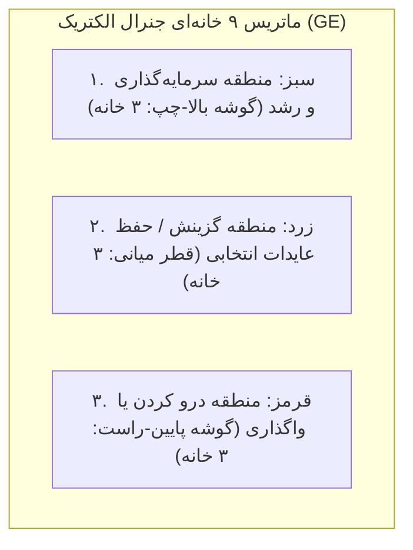

#### دو بعد اصلی مدل جنرال الکتریک (مرجع کاتلر، ص ۱۰۲ و ۱۰۳):
1. **جذابیت بازار:** محور عمودی با مقیاس ۱ تا ۵ (بالا، متوسط، پایین). ترکیبی از شاخص‌های: اندازه بازار، نرخ رشد سالانه بازار، حاشیه سود تاریخی، شدت رقابت، الزامات تکنولوژیک و آسیب‌پذیری در برابر تورم یا نوسانات انرژی.
2. **توانمندی / موقعیت رقابتی شرکت:** محور افقی با مقیاس ۵ تا ۱ (قوی، متوسط، ضعیف). ترکیبی از شاخص‌های: سهم بازار شرکت، رشد سهم بازار، کیفیت محصول، شهرت برند، شبکه توزیع، کارایی بازاریابی، توانمندی تحقیق و توسعه، و ساختار هزینه تولید.

#### تصمیمات راهبردی در سه پهنه مدل GE (مرجع کاتلر، ص ۱۰۲ و ۱۰۳):
- **پهنه سرمایه‌گذاری و رشد (خانه‌های بالا سمت چپ):** جذابیت بازار و توانمندی کسب‌وکار هر دو در سطوح بالا یا متوسط قرار دارند. استراتژی: سرمایه‌گذاری سنگین، تقویت نقاط ضعف، پیشتازی در بازار.
- **پهنه گزینش و درو (خانه‌های روی قطر اصلی):** جذابیت و توانمندی در سطح میانه هستند. استراتژی: سرمایه‌گذاری انتخابی و محدود در بخش‌های با پتانسیل بالا، تأکید بر بهره‌وری و سودآوری نقدی، و اجتناب از ریسک‌های بزرگ.
- **پهنه درو کردن و واگذاری (خانه‌های پایین سمت راست):** بازار غیرجذاب و توانمندی شرکت ضعیف است. استراتژی: به حداقل رساندن هزینه‌ها، درو کردن حداکثر نقدینگی باقی‌مانده و فروش یا انحلال واحد.

#### ارزیابی و انتقادات وارد بر مدل‌های پرتفوی (مرجع کاتلر، ص ۱۰۴ و ۱۰۵):
- **مزایا:** پرورش تفکر استراتژیک در مدیران، ارزیابی چندبعدی کسب‌وکارها، بهبود کیفیت تخصیص منابع و تسهیل گفت‌وگوی ستاد مرکزی با مدیران واحدها.
- **معایب و محدودیت‌ها:** حساسیت بالا به وزن‌دهی‌های ذهنی و امکان دستکاری برای مطلوب نشان دادن یک واحد؛ ناتوانی در تحلیل هم‌افزایی میان واحدها (گاهی حذف یک واحد ضعیف، ستون فقرات زنجیره تأمین واحدی پررونق را می‌شکند).

---

## ۱۰. برنامه‌ریزی فعالیت‌های جدید و تحلیل شکاف راهبردی (مرجع کاتلر، ص ۱۰۵ تا ۱۰۷)

در صورتی که فروش پیش‌بینی‌شده از کسب‌وکارهای فعلی کمتر از اهداف فروش بلندمدت شرکت باشد، **«شکاف برنامه‌ریزی استراتژیک »** پدید می‌آید. مدیریت ارشد موظف است این خلاء را از طریق ۳ استراتژی رشد پر کند:

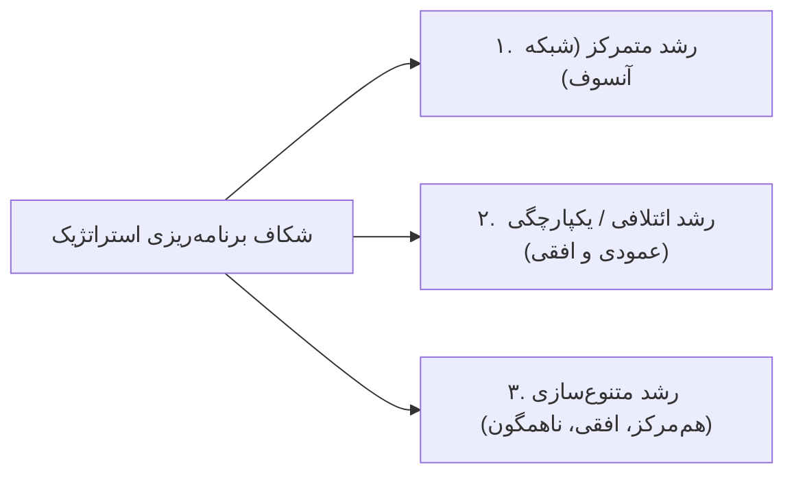

### ۱. رشد متمرکز - ماتریس محصول / بازار آنسوف (مرجع کاتلر، ص ۱۰۶)
ایگور آنسوف چارچوب ۴ بخشی بسط محصول/بازار را برای کشف فرصت‌های رشد در حیطه کسب‌وکار فعلی ارائه کرده است:

```mermaid
quadrantChart
 title ماتریس بسط محصول/بازار آنسوف (مرجع کاتلر، ص ۱۰۶)
 x-axis محصولات فعلی --> محصولات جدید
 y-axis بازارهای فعلی --> بازارهای جدید
 quadrant-1 توسعه بازار (Market Development)
 quadrant-2 متنوع‌سازی (Diversification)
 quadrant-3 نفوذ در بازار (Market Penetration)
 quadrant-4 توسعه محصول (Product Development)
```

1. **نفوذ در بازار:** افزایش سهم بازار با **محصولات فعلی در بازارهای فعلی**. روش‌ها: تشویق مشتریان فعلی به مصرف بیشتر در هر بار استفاده، ربودن مشتریان رقبا با تبلیغات و ترویج، و جذب غیرمصرف‌کنندگان فعلی. (مرجع کاتلر، ص ۱۰۶)
2. **توسعه بازار:** عرضه **محصولات فعلی در بازارهای جدید**. روش‌ها: ورود به مناطق جغرافیایی جدید (شهرهای دیگر، استان‌ها یا صادرات به بازارهای جهانی)، و شناسایی بخش‌های جدید خریداران (مانند فروش به مشتریان شرکتی و سازمانی). (مرجع کاتلر، ص ۱۰۶ و ۱۰۷)
3. **توسعه محصول:** طراحی و عرضه **محصولات جدید در بازارهای فعلی**. روش‌ها: تولید محصولات با ویژگی‌ها، اندازه‌ها و کیفیت‌های متمایز، یا بهره‌گیری از فناوری‌های جدید برای مشتریان وفادار فعلی. (مرجع کاتلر، ص ۱۰۶ و ۱۰۷)
4. **متنوع‌سازی:** عرضه **محصولات جدید در بازارهای جدید** (ریسک‌پذیرترین حالت رشد). (مرجع کاتلر، ص ۱۰۶)

---

### ۲. رشد ائتلافی / یکپارچگی (مرجع کاتلر، ص ۱۰۷)
رشد از طریق زنجیره ارزش صنعت پیرامونی:
- **ائتلاف رو به عقب:** تملک یا افزایش کنترل بر تأمین‌کنندگان مواد اولیه و نهاده‌ها (مانند خرید کارخانه تولید مواد اولیه توسط شرکت تولیدی برای تضمین عرضه و کاهش هزینه).
- **ائتلاف رو به جلو:** تملک یا افزایش کنترل بر شبکه توزیع، عمده‌فروشان، یا خرده‌فروشی‌ها (مانند تأسیس فروشگاه‌های زنجیره‌ای اختصاصی).
- **ائتلاف افقی:** خرید، تملک یا ادغام با شرکت‌های رقیب در همان سطح فعالیت (با رعایت قوانین ضد انحصار).

---

### ۳. رشد متنوع‌سازی (مرجع کاتلر، ص ۱۰۷)
زمانی که صنعت فعلی رشد محدودی دارد یا بازارهای بیرون از صنعت بسیار پرجاذبه هستند، کاتلر ۳ نوع متنوع‌سازی را معرفی می‌کند:
1. **متنوع‌سازی هم‌مرکز / متحدالمرکز:** شرکت خطوط کالای جدیدی تولید می‌کند که با خطوط فعلی قرابت تکنولوژیک یا بازاریابی دارند، اما مشتریان جدیدی را جلب می‌نمایند (مانند تولید نوارهای ضبط کامپیوتری توسط کارخانه نوارهای کاست صوتی).
2. **متنوع‌سازی افقی:** ارائه محصولات کاملاً غیرمرتبط از نظر فناوری به مشتریان فعلی، زیرا مشتریان فعلی به آن کالاها نیز نیاز دارند.
3. **متنوع‌سازی ناهمگون / چندجانبه:** ورود به فعالیت‌های کاملاً جدید بدون هیچ ارتباط فناورانه، محصولی یا بازاری با وضعیت فعلی (مانند فعالیت در حوزه هتلداری، صنایع غذایی و الکترونیک به صورت همزمان).

> [!NOTE] کوچک‌سازی و هرس کردن استراتژیک (مرجع کاتلر، ص ۱۰۷ و ۱۰۸)
> رشد تنها با ورود به فعالیت‌های جدید محقق نمی‌شود؛ گاهی شرکت‌ها باید با **کوچک‌سازی، درو کردن یا واگذاری خطوط ضعیف و فرسوده**، انرژی و نقدینگی خود را آزاد کرده و بر مزیت‌های رقابتی بنیادین خود متمرکز شوند.

---

## ۱۱. فرآیند هشت‌گانه برنامه‌ریزی استراتژیک در سطح واحدهای اقتصادی (مرجع کاتلر، ص ۱۰۸)

کاتلر فرآیند برنامه‌ریزی استراتژیک در سطح واحد اقتصادی را در قالب یک چرخه نظام‌مند ۸ مرحله‌ای (شکل ۷-۳ کاتلر، ص ۱۰۸) صورت‌بندی می‌کند:

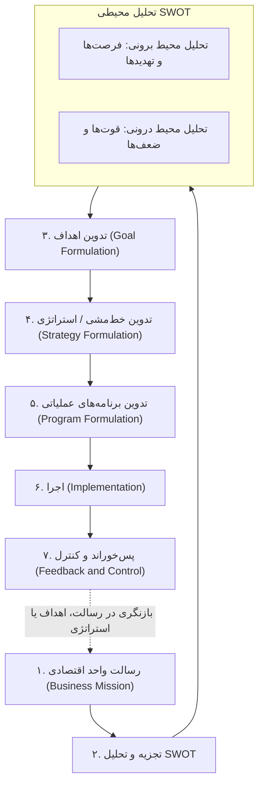

### ۱. رسالت واحد اقتصادی (مرجع کاتلر، ص ۱۰۸)
هر واحد کسب‌وکار درون چارچوب کلان شرکت، باید رسالت اختصاصی خود را تعریف کند (مثلاً تمرکز بر بالاترین کیفیت روشنایی برای استودیوهای بزرگ تلویزیونی به جای رقابت قیمتی در بازارهای کوچک).

### ۲. تجزیه و تحلیل محیط خارجی و داخلی (مرجع کاتلر، ص ۱۰۹ تا ۱۱۲)

#### الف) تحلیل محیط برونی (فرصت‌ها و تهدیدها): (مرجع کاتلر، ص ۱۰۹ و ۱۱۰)
پایش عوامل کلان (دموگرافیک، اقتصادی، فناورانه، سیاسی، قانونی، اجتماعی-فرهنگی) و عوامل خرد (مشتریان، رقبا، تأمین‌کنندگان، توزیع‌کنندگان).

> [!NOTE] تعریف فرصت بازاریابی (مرجع کاتلر، ص ۱۰۹)
> حوزه یا زمینه‌ای از نیاز خریداران است که در آن، شرکت می‌تواند با تکیه بر شایستگی‌های خود به‌طور سودآور عمل کند. فرصت‌ها با دو معیار ارزیابی می‌شوند:
> 1. **میزان جذابیت فرصت**
> 2. **احتمال موفقیت شرکت**

> [!WARNING] تعریف تهدید محیطی (مرجع کاتلر، ص ۱۱۰)
> چالشی ناشی از یک روند یا تحول نامطلوب برونی که در صورت عدم اتخاذ اقدام دفاعی به‌موقع، منجر به افت فروش، از دست رفتن سهم بازار یا کاهش سودآوری خواهد شد. تهدیدها با دو معیار سنجیده می‌شوند:
> 1. **خطیر بودن و شدت تهدید**
> 2. **احتمال وقوع**

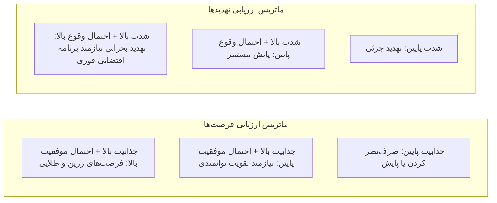

#### ۴ وضعیت کلی سلامت و جذابیت کسب‌وکار در ارزیابی فرصت‌ها و تهدیدها (مرجع کاتلر، ص ۱۱۰):
1. **کسب‌وکار ایده‌آل:** فرصت‌های عمده بسیار زیاد و تهدیدات اندک.
2. **کسب‌وکار پرمخاطره / سفته‌بازانه:** هم فرصت‌های عمده بسیار بالا و هم تهدیدات بزرگ فراوان.
3. **کسب‌وکار بالغ:** فرصت‌های عمده کم و تهدیدات نیز کم و کنترل‌شده.
4. **کسب‌وکار مسئله‌دار:** فرصت‌های اندک در برابر تهدیدات بسیار بزرگ و پرشمار.

---

#### ب) تحلیل محیط درونی (قوت‌ها و ضعف‌ها) (مرجع کاتلر، ص ۱۱۰ تا ۱۱۲)
یک شرکت نباید سعی کند تمام ضعف‌های خود را برطرف سازد یا در تمام جهات قوت داشته باشد، بلکه باید بر شایستگی‌هایی تمرکز کند که در خدمت بهره‌برداری از فرصت‌های طلایی بازار هستند.
- **چک‌لیست ممیزی داخلی در ۴ سرفصل (۲۳ عامل کلیدی) (مرجع کاتلر، ص ۱۱۱):**
 - **بازاریابی:** شهرت و اعتبار، سهم بازار، کیفیت محصول، کیفیت خدمات همراه، اثربخشی قیمت‌گذاری، اثربخشی شبکه توزیع، تبلیغات پیشبردی، نیروی فروش، نوآوری و پوشش جغرافیایی.
 - **امور مالی:** دسترسی به سرمایه، ثبات مالی، جریان نقدینگی.
 - **تولید:** صرفه‌های مقیاس، امکانات کارخانه‌ای، ظرفیت، تحویل به موقع، مهارت‌های فنی.
 - **سازمان:** رهبری توانمند، تعهد کارکنان، چابکی و انعطاف‌پذیری.
- **رقابت مبتنی بر قابلیت‌ها (جورج استاک) (مرجع کاتلر، ص ۱۱۲):** موفقیت پایدار صرفاً داشتن دارایی نیست، بلکه توانایی سازمان در مدیریت روان فرآیندهای بین‌بخشی برای خلق سریع ارزش است.

---

### ۳. تدوین اهداف (مرجع کاتلر، ص ۱۱۲)
تبدیل ماموریت به مقاصد کمی، شفاف و زمان‌دار. اهداف باید ۴ معیار اساسی را برآورده سازند:
1. **سلسله‌مراتبی بودن:** اهداف از بالاترین اولویت به پایین‌ترین اولویت رتبه‌بندی شوند (مثلاً افزایش بازده سرمایه‌گذاری هدف اصلی است که به رشد درآمد و کاهش هزینه تفکیک می‌شود).
2. **کمی و سنجش‌پذیر بودن:** بیان عددی دقیق (مانند افزایش ۱۵ درصدی سودآوری ظرف ۲ سال، نه عبارات مبهمی مثل بهبود سود).
3. **واقع‌بینانه بودن:** برآمده از فرصت‌ها و توانمندی‌های واقعی، نه بلندپروازی‌های خیالی.
4. **سازگار و هم‌راستا بودن:** اهداف نباید یکدیگر را نقض کنند (مانند تناقض کسب همزمان سودآوری حداکثری کوتاه‌مدت و دستیابی به حداکثر سهم بازار بلندمدت).

---

### ۴. تدوین استراتژی‌های ژنریک پورتر و ائتلاف‌ها (مرجع کاتلر، ص ۱۱۲ و ۱۱۳)

مایکل پورتر سه استراتژی بنیادین را معرفی می‌کند که نقطه شروع تفکر استراتژیک هستند:
1. **رهبری فراگیر در هزینه:** تمرکز بر دستیابی به کمترین هزینه تولید و توزیع از طریق مقیاس، مهندسی و مدیریت زنجیره تأمین، به گونه‌ای که شرکت بتواند با قیمت کمتر از رقبا بفروشد و سهم بزرگی بگیرد (نیاز به بازاریابی پیچیده ندارد، تکیه بر مهندسی و تولید است). (مرجع کاتلر، ص ۱۱۲ و ۱۱۳)
2. **تمایز:** کسب برتری در یک بعد مهم و ارزشمند برای بخش بزرگی از مشتریان (خدمات برتر، کیفیت فوق‌العاده، طراحی شیک، برند لوکس یا نوآوری تکنولوژیک). (مرجع کاتلر، ص ۱۱۳)
3. **تمرکز:** انتخاب یک گوشه کوچک و باریک از بازار و تمرکز کامل بر پاسخ‌گویی به نیازهای آن بخش محدود از طریق رهبری در هزینه یا تمایز (مانند تولید لاستیک مخصوص ماشین‌های کشاورزی). (مرجع کاتلر، ص ۱۱۳)

> [!CAUTION] تله گیر افتادن در میانه (مرجع کاتلر، ص ۱۱۳)
> به عقیده مایکل پورتر، شرکت‌هایی که خط‌مشی شفافی اتخاذ نکرده و سعی می‌کنند در همه جهات پیش بروند، در میانه گرفتار شده و به بدترین نتایج و افت سودآوری دچار می‌شوند (زیرا نه کمترین هزینه را دارند تا مشتریان حساس به قیمت را جلب کنند و نه تمایز بارزی دارند تا مشتریان حاضر به پرداخت اضافه بها باشند).

#### گروه‌های استراتژیک و اتحادهای استراتژیک (مرجع کاتلر، ص ۱۱۳)
- **گروه استراتژیک:** شرکت‌هایی در یک صنعت که استراتژی مشابهی را به کار گرفته و بازارهای هدف مشترکی دارند (رقابت اصلی معمولاً درون گروه استراتژیک شدیدتر است).
- **اتحادهای استراتژیک:** برای ورود به بازارهای جهانی یا دستیابی به فناوری‌های پیچیده، شرکت‌ها نیازمند همکاری با شرکای استراتژیک هستند.
- **۴ نوع اصلی اتحادهای بازاریابی (مرجع کاتلر، ص ۱۱۳):**
 1. **اتحاد در زمینه کالا و خدمات:** صدور مجوز تولید کالای یک شرکت توسط دیگری، یا همکاری مشترک در تولید محصولات مکمل.
 2. **اتحاد در ترویج و تبلیغات:** ترویج مشترک محصول یکی با دیگری (مانند مک‌دونالد با والت‌دیزنی).
 3. **اتحاد در لجستیک و توزیع:** استفاده از شبکه توزیع و انبارهای یک شرکت برای محصولات شریک.
 4. **همبستگی و اتحاد در قیمت‌گذاری:** ارائه تخفیف‌های مشترک (مانند هتل‌ها با خطوط هوایی و کرایه خودرو).

### ۵. تدوین برنامه‌های عملیاتی و حمایتی (مرجع کاتلر، ص ۱۱۴)
تبدیل استراتژی‌ها به برنامه‌های مشخص تحقیق و توسعه، برنامه‌های آموزشی پرسنل فروش و کمپین‌های تبلیغاتی. شرکت‌ها باید با استفاده از **حسابداری بر مبنای فعالیت** توجیه اقتصادی و بازده هر برنامه را ارزیابی نمایند.

### ۶. اجرا بر اساس چارچوب ۷S مکنزی (مرجع کاتلر، ص ۱۱۴ و ۱۱۶)
کاتلر خاطرنشان می‌کند که یک استراتژی عالی بدون اجرای قدرتمند هیچ ارزشی ندارد. شرکت‌های موفق هفت عنصر یکپارچه مکنزی را هماهنگ می‌سازند:
- **عناصر سخت‌افزاری:** استراتژی، ساختار و سیستم‌ها.
- **عناصر نرم‌افزاری:**
 - **سبک و شیوه مدیریت:** نحوه تفکر و سلوک رفتاری کارکنان و رهبران در تعامل با بازار (مانند لبخند کارکنان مک‌دونالد).
 - **کارکنان:** جذب، استخدام و پرورش کارکنان لایق و شایسته در جایگاه‌های کلیدی.
 - **مهارت‌ها:** توانمندی‌های محوری مورد نیاز برای پیاده‌سازی استراتژی.
 - **ارزش‌های مشترک:** باورها و ارزش‌های راهنمای بنیادین که کل سازمان را به هم پیوند می‌دهد.

### ۷. پس‌خوراند و کنترل (مرجع کاتلر، ص ۱۱۶ و ۱۱۷)
محیط بیرونی دائماً دگرگون می‌شود؛ در نتیجه، تناسب استراتژیک شرکت به مرور زمان فرسایش می‌یابد. شرکت‌ها باید دائماً روندهای بازار را رصد کنند و در صورت افت عملکرد یا ظهور فناوری‌های مختل‌کننده، در اهداف و استراتژی‌های خود تجدیدنظر نمایند (مانند سقوط شرکت‌های کامپیوتر بزرگ مین‌فریم با ظهور رایانه‌های شخصی).

> [!IMPORTANT] قانون طلایی پیتر دراکر: اثربخشی در برابر کارایی (مرجع کاتلر، ص ۱۱۶)
> - **اثربخشی:** «انجام دادن کار درست» $\rightarrow$ همسویی با فرصت‌های واقعی بازار.
> - **کارایی:** «انجام دادن درست کار» $\rightarrow$ مصرف بهینه منابع و حداقل اتلاف.
> در دنیای رقابتی امروز، **اثربخشی بسیار حیاتی‌تر و مقدم بر کارایی است**؛ زیرا اگر شرکتی محصول اشتباهی را که بازار نمی‌خواهد با بالاترین کارایی تولید کند، تنها با سرعت بیشتری به سمت ورشکستگی حرکت می‌کند (مانند ورشکستگی آزمایشگاه‌های وانگ).

---

## ۱۲. توالی فرآیند ایجاد و فایده‌رسانی ارزش (مرجع کاتلر، ص ۱۱۷ و ۱۱۸)

کاتلر برای درک صحیح فرآیند بازاریابی، دو دیدگاه متضاد را مقایسه می‌کند:

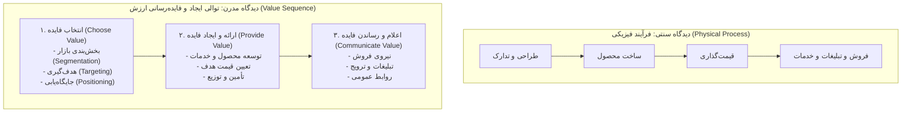

### ۱. دیدگاه سنتی فرآیند فیزیکی:
تصور می‌کند شرکت ابتدا کالایی را طراحی و تولید می‌کند و سپس وظیفه بازاریابی این است که آن کالای از پیش تولیدشده را با فشار تبلیغات و فروش به خریداران بفروشد. این مدل تنها در دوران کمبود کالا پاسخگو بود و امروزه ناکارآمد است. (مرجع کاتلر، ص ۱۱۷)

### ۲. توالی ایجاد و فایده‌رسانی ارزش (دیدگاه مدرن):
بازاریابی پیش از آنکه محصولی وجود داشته باشد آغاز می‌شود و شامل سه گام متوالی است: (مرجع کاتلر، ص ۱۱۷ و ۱۱۸)
1. **انتخاب فایده - بازاریابی استراتژیک:** انجام مطالعات عمیق بازار، بخش‌بندی بازار، هدف‌گیری بخش‌های جذاب، و تعیین ارزش پیشنهادی و جایگاه‌یابی منحصربه‌فرد (**فرمول **).
2. **ارائه و ایجاد فایده - بازاریابی تاکتیکی:** طراحی ویژگی‌های دقیق کالا، قیمت‌گذاری منطبق بر ارزش ادراک‌شده، و ساخت کانال‌های توزیع.
3. **اعلام و ترویج فایده - بازاریابی تاکتیکی:** به‌کارگیری ارتباطات یکپارچه بازاریابی، نیروهای فروش و پیام‌های تبلیغاتی جهت متقاعدسازی مشتریان.

#### پنج اصل سرعت و فایده‌رسانی در سازمان‌های چابک (رویکرد ژاپنی) (مرجع کاتلر، ص ۱۱۸):
1. به حداقل رساندن زمان دریافت و تحلیل بازخورد از مشتریان.
2. به حداقل رساندن زمان بهبود، اصلاح و توسعه محصول.
3. به حداقل رساندن زمان سفارش و تأمین مواد اولیه (رویکرد بهنگام).
4. به حداقل رساندن زمان تغییر و راه‌اندازی خطوط تولید.
5. به حداقل رساندن خطاها و نقائص محصول (مدیریت کیفیت جامع).

---

## ۱۳. آمیخته بازاریابی (4P) در برابر دیدگاه مشتری (4C) و انواع کنترل بازاریابی (مرجع کاتلر، ص ۱۱۹ تا ۱۲۳)

### آمیخته بازاریابی ۴P مک‌کارتی (مرجع کاتلر، ص ۱۲۱ و ۱۲۲)
مجموعه‌ای از متغیرهای قابل کنترل بازاریابی که شرکت برای دستیابی به اهداف خود در بازار هدف ترکیب می‌کند:

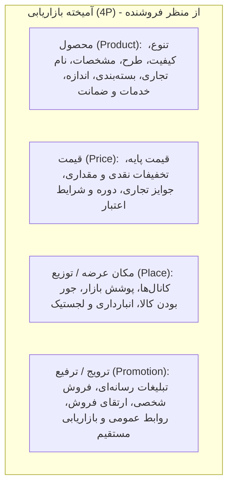

- **محصول:** اساسی‌ترین ابزار آمیخته؛ عرضه فیزیکی ملموس، خدمات و بسته‌بندی. (مرجع کاتلر، ص ۱۲۲)
- **قیمت:** حساس‌ترین و حیاتی‌ترین ابزار آمیخته بازاریابی، زیرا **تنها عنصری است که درآمد ایجاد می‌کند** و سه عنصر دیگر هزینه‌زا هستند. (مرجع کاتلر، ص ۱۲۲)
- **مکان عرضه:** کلیه فرآیندهای لجستیک و واسطه‌های توزیع که محصول را در زمان و مکان مناسب در دسترس خریدار قرار می‌دهند. (مرجع کاتلر، ص ۱۲۲)
- **ترویج و ترفیع:** کلیه فعالیت‌های ارتباطی و انگیزشی جهت آگاه‌سازی و ترغیب مشتری به خرید. (مرجع کاتلر، ص ۱۲۲)

---

### تقابل انقلابی: ۴P فروشنده در برابر ۴C خریدار (مدل رابرت لاتربرن) (مرجع کاتلر، ص ۱۲۲ و ۱۲۳)
رابرت لاتربرن استدلال می‌کند که مدل ۴P منعکس‌کننده نگاه یک‌سویه تولیدکننده به بازار است؛ شرکت‌های برنده کسانی هستند که ابتدا به نیازهای مشتری از دریچه **۴C** پاسخ می‌دهند:

| ابزار فروشنده | زاویه دید خریدار | مفهوم استراتژیک (مرجع کاتلر، ص ۱۲۲ و ۱۲۳) |
|:--- |:--- |:--- |
| **محصول** | **نیازها و خواسته‌های مشتری** | خریدار کالا نمی‌خرد، بلکه راه‌حلی برای برطرف کردن یک نیاز یا مسئله می‌خرد. |
| **قیمت** | **هزینه پرداختی توسط مشتری** | قیمت تنها بخشی از هزینه مشتری است؛ هزینه‌های زمانی، انرژی روانی و نگهداری نیز جزو هزینه تمام‌شده مشتری هستند. |
| **مکان توزیع** | **راحتی و آسایش دستیابی** | مشتریان به دنبال آسان‌ترین، سریع‌ترین و در دسترس‌ترین شیوه خرید کالا و خدمات هستند. |
| **ترویج و تبلیغ** | **ارتباطات دوسویه** | مشتری مایل به شنیدن ادعاهای تبلیغاتی یک‌طرفه نیست، بلکه خواهان گفت‌وگو، شفافیت و ارتباط تعاملی است. |

---

### سطوح سه‌گانه کنترل و نظارت بازاریابی در کاتلر (مرجع کاتلر، ص ۱۲۳)
اجرای برنامه‌های بازاریابی همواره با موانع و انحرافات روبه‌رو می‌شود؛ بنابراین سازمان نیازمند سه نوع کنترل سیستماتیک است:

1. **کنترل برنامه سالانه:**
 - **هدف:** اطمینان از دستیابی به اهداف سالانه فروش، سود، جریان نقدینگی و سهم بازار در بودجه مصوب.
 - **فرآیند:** تعیین اهداف ماهانه و فصلی $\rightarrow$ پایش عملکرد جاری $\rightarrow$ شناسایی انحرافات منفی $\rightarrow$ اجرای اقدامات اصلاحی.
2. **کنترل سودآوری:**
 - **هدف:** سنجش سودآوری واقعی محصولات مختلف، مناطق جغرافیایی، کانال‌های توزیع و حساب‌های مشتریان.
 - **ابزار:** تحلیل سودآوری بازاریابی و مطالعات کارایی برای حذف محصولات یا بخش‌های زیان‌ده.
3. **کنترل استراتژیک و ممیزی بازاریابی:**
 - **هدف:** بازبینی بنیادین همسویی کلی استراتژی‌ها و برنامه‌ها با تغییرات کلان بازار، تکنولوژی و رقابت.
 - **ابزار کلیدی:** **ممیزی بازاریابی**؛ بازرسی دوره‌ای، جامع، سیستماتیک و مستقل از کل محیط، اهداف و عملیات بازاریابی شرکت.

---

## ۱۴. ساختار استاندارد و کالبدشکافی سند برنامه بازاریابی (مرجع کاتلر، ص ۱۲۴ تا ۱۲۸)

کاتلر ساختار یک سند جامع برنامه بازاریابی را در قالب ۸ بخش اصلی تدوین نموده و آن را با مطالعه موردی خط تولید سیستم‌های صوتی «آلگرو  شرکت زنیت » کالبدشکافی می‌کند:

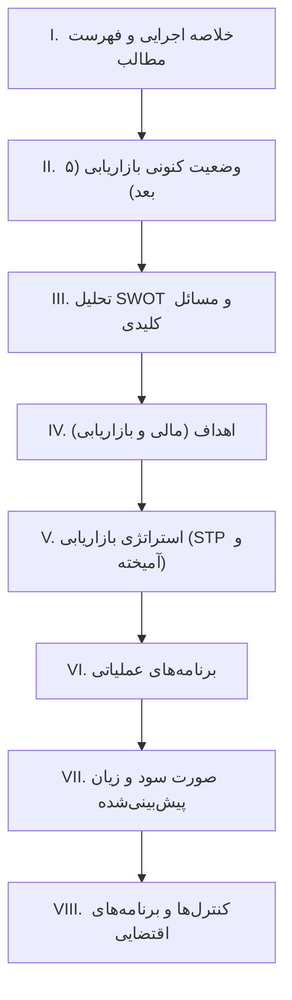

### ۱. خلاصه اجرایی و فهرست مطالب (مرجع کاتلر، ص ۱۲۴ و ۱۲۵)
- پیش‌درآمدی ۲ تا ۳ صفحه‌ای که چکیده اصلی اهداف فروش، سود، بودجه بازاریابی و توصیه‌های راهبردی را بیان می‌دارد تا مدیران ارشد بتوانند به سرعت تصمیم‌گیری کنند.
- مثال آلگرو: دستیابی به سود ۱.۸ میلیون دلاری، درآمد ۱۸ میلیون دلاری و بودجه بازاریابی ۲.۲۹ میلیون دلاری.

### ۲. وضعیت کنونی بازاریابی (مرجع کاتلر، ص ۱۲۵ تا ۱۲۷)
کاتلر ارائه داده‌های این بخش را در **۵ بعد اساسی** تفکیک می‌کند:
1. **وضعیت بازار:** اندازه و روند بازار بر حسب حجم و ارزش دلاری، نیازهای مشتریان، بخش‌های جغرافیایی و جمعیت‌شناختی، و رفتار خرید.
2. **وضعیت محصول:** بررسی عملکرد فروش، قیمت‌ها، هزینه‌های متغیر و ثابت، حاشیه سود ناویژه و خالص خطوط محصول در ۳ تا ۵ سال گذشته (جدول ۵-۳ کاتلر).
3. **وضعیت رقابت:** شناسایی رقبای اصلی (مانند سونی، پاناسونیک، مگناوکس)، سهم بازار آنها، کیفیت کالا، خط‌مشی‌های قیمتی و تبلیغاتی و تمایزات آنها.
4. **وضعیت توزیع:** کانال‌های توزیع موجود، سهم هر کانال از کل فروش (فروشگاه‌های زنجیره‌ای، تخصصی، خرده‌فروشی)، قدرت چانه‌زنی و حاشیه سود واسطه‌ها.
5. **وضعیت محیط کلان:** روندهای ۶گانه کلان (اقتصادی، تکنولوژیک، قانونی، جمعیتی، سیاسی، اجتماعی-فرهنگی) که آینده محصول را متأثر می‌سازند.

### ۳. تحلیل SWOT و مسائل کلیدی (مرجع کاتلر، ص ۱۲۷ و ۱۲۸)
- **فرصت‌ها و تهدیدها:** تحلیل بیرونی عواملی که می‌توانند رشد محصول را سرعت بخشند یا متوقف سازند.
- **قوت‌ها و ضعف‌ها:** ارزیابی داخلی شهرت برند، کیفیت، شبکه خدمات و بودجه تبلیغات.
- **تحلیل مسائل استراتژیک:** صورت‌بندی مهم‌ترین دوراهی‌های پیش‌روی شرکت: آیا در صنعت بماند یا خارج شود؟ آیا قیمت را تغییر دهد؟ آیا شبکه توزیع را به فروشگاه‌های تخفیف‌دار گسترش دهد؟

### ۴. اهداف (&) (مرجع کاتلر، ص ۱۲۸)
کاتلر نشان می‌دهد چگونه اهداف مالی کلان به اهداف مشخص بازاریابی تبدیل و ترجمه می‌شوند:
- **اهداف مالی:** نرخ بازده سرمایه‌گذاری سالانه (مثلاً معادل ۱۵٪)، سود خالص سالانه (۱.۸ میلیون دلار) و جریان نقدینگی (۲ میلیون دلار).
- **اهداف بازاریابی:**
 - تبدیل سود ۱.۸ میلیون دلاری با حاشیه سود ۱۰٪ $\rightarrow$ **هدف فروش: ۱۸ میلیون دلار**.
 - با قیمت متوسط ۲۶۰ دلار برای هر دستگاه $\rightarrow$ **تعداد فروش هدف: ۶۹,۲۳۰ دستگاه**.
 - اگر کل فروش بازار ۲.۳ میلیون دستگاه پیش‌بینی شود $\rightarrow$ **هدف سهم بازار: ۳ درصد**.
 - اهداف کمکی دیگر: ارتقای آگاهی مشتریان از نام تجاری به ۶۰٪، گسترش پوشش نمایندگی‌های توزیع به ۷۰٪.

### ۵. استراتژی بازاریابی (مرجع کاتلر، ص ۱۲۸ و ۱۲۹)
استراتژی بازاریابی مسیر دستیابی به اهداف را با تعریف دقیق بازار هدف، جایگاه‌یابی و آمیخته بازاریابی تبیین می‌کند:
- **بازار هدف:** تمرکز بر خانواده‌های با درآمد بالاتر از متوسط، با تأکید بر سلیقه و تصمیم‌گیری خانم‌ها به عنوان خریداران تأثیرگذار.
- **جایگاه‌یابی:** ارائه سیستم‌های صوتی با کیفیت عالی بازتولید صدا، قابلیت اطمینان بالا و طراحی متناسب با دکوراسیون منزل، با قیمتی معقول‌تر از سیستم‌های فوق‌حرفه‌ای مجزا.
- **خط محصول:** افزودن یک مدل اقتصادی‌تر برای ورود مشتریان جدید و دو مدل لوکس با تجهیزات صوتی دیجیتال پیشرفته.
- **قیمت‌گذاری:** قیمت‌گذاری با مقداری اضافه بهای کیفی در مقایسه با رقبای اصلی، متناسب با کیفیت برتر قطعات و گارانتی.
- **کانال‌های توزیع:** تمرکز بر فروشگاه‌های تخصصی لوازم صوتی و تصویری و بخش‌های لوازم خانگی فروشگاه‌های بزرگ معتبر و حذف کانال‌های تخفیفی کم‌اعتبار.
- **نیروی فروش:** افزایش ۱۰ درصدی کادر فروش، اختصاص پورسانت تشویقی برای معرفی مدل‌های رده بالا و ارائه دوره‌های آموزشی مشتری‌مداری به فروشندگان نمایندگی‌ها.
- **خدمات مشتریان:** توسعه شبکه خدمات پس از فروش سریع، تعویض بدون قید و شرط قطعات معیوب در ۴۸ ساعت اول و راه‌اندازی خط تلفن پشتیبانی رایگان.
- **پیشبرد و تبلیغات:** افزایش ۲۰ درصدی بودجه تبلیغات، اجرای کمپین‌های تلویزیونی و مجلات سبک زندگی با تمرکز بر شفافیت صوت و طراحی لوکس، و حضور برجسته در نمایشگاه‌های بین‌المللی الکترونیک مصرفی.
- **تحقیق و توسعه (R&D):** سرمایه‌گذاری برای ارتقای طراحی ظاهری متناسب با روندهای مدرن دکوراسیون و کاهش ابعاد فیزیکی دستگاه‌ها.
- **تحقیقات بازاریابی:** افزایش ۱۰ درصدی بودجه تحقیقاتی برای پایش مداوم ادراک مشتریان از برند، سنجش اثربخشی تبلیغات و رصد حرکات رقبای اصلی.

### ۶. برنامه‌های عملیاتی (مرجع کاتلر، ص ۱۲۹ و ۱۳۰)
برنامه عملیاتی استراتژی‌ها را به اقدامات روزمره، زمان‌بندی‌شده و ملموس تبدیل می‌کند. هر اقدام باید به **۴ پرسش اساسی** پاسخ دهد:
1. چه کاری انجام خواهد شد؟ (?)
2. چه زمانی انجام خواهد شد؟ (?)
3. چه کسی مسئول اجرای آن است؟ (?)
4. چقدر هزینه خواهد داشت؟ (?)

**نمونه جدول زمان‌بندی اجرایی آلگرو (مرجع کاتلر، ص ۱۲۹):**
- **فوریه:** ارائه پیشنهاد ویژه «سی‌دی رایگان به همراه خرید دستگاه» جهت تحریک تقاضای اواخر زمستان (مسئول: مدیر تبلیغات | هزینه: ۵,۰۰۰ دلار).
- **آوریل:** حضور پرقدرت در نمایشگاه لوازم الکترونیکی شیکاگو، به همراه اعلام مسابقه فروشندگان و اهدای جایزه سفر به هاوایی برای برترین نمایندگی‌ها (مسئول: مدیر فروش | هزینه: ۱۳,۰۰۰ دلار).
- **سپتامبر:** راه‌اندازی قرعه‌کشی سراسری سیستم‌های صوتی در فروشگاه‌های منتخب جهت جلب ترافیک خریداران پاییزه (مسئول: مدیر پروموشن | هزینه: ۶,۰۰۰ دلار).

### ۷. صورت سود و زیان پیش‌بینی‌شده و بودجه بازاریابی (مرجع کاتلر، ص ۱۳۰)
این بخش مبنای تخصیص منابع، تدارک مواد اولیه، استخدام نیروی کار و برنامه‌ریزی تولید است:
- **درآمد پیش‌بینی‌شده:** حاصل‌ضرب تعداد فروش پیش‌بینی‌شده در قیمت میانگین کل.
- **کسورات:**
 - بهای تمام شده کالای فروش رفته: هزینه‌های مستقیم تولید، مواد اولیه و کارگری.
 - هزینه‌های توزیع فیزیکی و انبارداری.
 - **هزینه‌های بازاریابی:** تبلیغات رسانه‌ای، پروموشن و تخفیفات تجاری، حقوق و پورسانت نمایندگان فروش، خدمات پس از فروش و هزینه‌های تحقیقات بازار.
- **سود عملیاتی مورد انتظار:** مازاد درآمد خالص بر کلیه هزینه‌های تولید و بازاریابی.

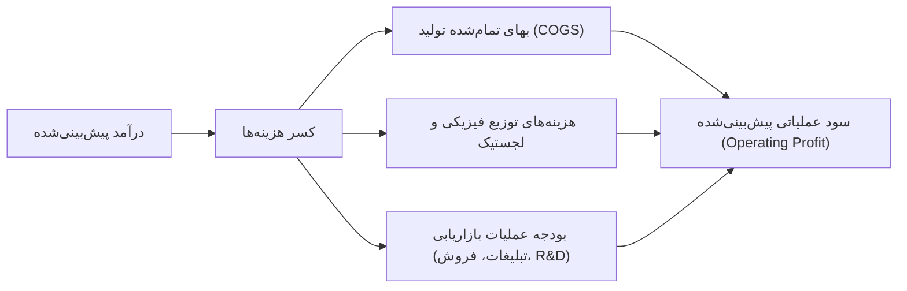

### ۸. کنترل‌ها و برنامه‌های اقتضایی (مرجع کاتلر، ص ۱۳۰)
- **پایش و ارزیابی مستمر:** تقسیم اهداف سالانه به اهداف ماهانه و سه‌ماهه. مدیران در پایان هر دوره، واریانس عملکرد واقعی را در برابر بودجه بررسی می‌کنند تا شکاف‌ها سریعاً شناسایی شوند.
- **برنامه‌های اقتضایی:** پیش‌بینی سناریوهای بحرانی و تدوین پاسخ‌های از پیش آماده؛ مانند:
 - اگر رقبا دست به جنگ قیمت زدند، چه مدل‌هایی تعدیل قیمت شوند یا چه ارزش‌های افزوده‌ای معرفی گردند؟
 - اگر اعتصاب کارگری رخ داد یا زنجیره تأمین قطعات الکترونیک دچار اختلال شد، کدام تأمین‌کننده جایگزین فعال شود؟

---

## ۱۵. تحولات نوین و آسیب‌شناسی برنامه‌ریزی بازاریابی در عمل (مرجع کاتلر، ص ۱۳۰ و ۱۳۱)

کاتلر با بررسی تجارب شرکت‌های پیشرو در اواخر قرن بیستم، دگرگونی بنیادین برنامه‌ریزی بازاریابی را در قالب ماتریس تحول زیر تشریح می‌کند:

| مؤلفه مقایسه | برنامه‌ریزی بازاریابی سنتی | رویکرد نوین بازاریابی (دهه ۱۹۹۰ به بعد) |
|:--- |:--- |:--- |
| **محور تمرکز** | مبتنی بر محصول و عملیات داخلی شرکت | **مشتری‌محور و رقیب‌محور** |
| **مشارکت‌کنندگان** | تدوین جزیره‌ای توسط کارشناسان واحد بازاریابی | **تیم‌های چندوظیفه‌ای متقاطع** با حضور تولید، مالی، R&D و فروش |
| **دوره زمانی و فرایند** | مراسم و مناسک بوروکراتیک سالانه | **فرایند پویا و پیوسته در تمام طول سال** با بازنگری‌های انعطاف‌پذیر |
| **نقش مدیران بازاریابی** | مجریان تاکتیکی تبلیغات و کاتالوگ | **مدیران ارشد کسب‌وکار عمومی** تأثیرگذار بر استراتژی کل شرکت |

### آسیب‌شناسی و تله‌های رایج در برنامه‌های بازاریابی (مرجع کاتلر، ص ۱۳۱)
کاتلر هشدار می‌دهد که بخش عمده‌ای از برنامه‌های بازاریابی در عمل به دلیل **۳ ضعف مرگبار** شکست می‌خورند:
1. **عدم واقع‌بینی:** فرضیات غیرواقعی درباره کشش‌پذیری تقاضا، خوش‌بینی مفرط به نرخ رشد بازار، و برآورد بیش از حد توان تولید و توزیع بدون اتکا به شواهد تجربی و داده‌های میدانی.
2. **تحلیل ناکافی رقبا:** نادیده گرفتن ماهیت تعاملی بازار و این تصور باطل که رقبا منفعل خواهند ماند. هر برنامه باید سناریوی اقدامات تلافی‌جویانه رقبا را شبیه‌سازی کند.
3. **نزدیک‌بینی و افق کوتاه‌مدت:** فدا کردن سرمایه‌گذاری‌های بنیادین بر روی برند، رضایت مشتری و مزیت رقابتی پایدار به منظور دستیابی به سودهای زودگذر سه‌ماهه حسابداری.

---

## ۱۶. جعبه ابزار محاسباتی و فرمول‌های طلایی کنکور ارشد (مرجع کاتلر، ص ۱۲۸ تا ۱۳۳)

طراحان کنکور کارشناسی ارشد مدیریت از مباحث برنامه‌ریزی استراتژیک، تست‌های مساله‌محور و فرمولی متنوعی طرح می‌کنند. این بخش تمامی این فرمول‌ها را به صورت استاندارد ارائه می‌دهد:

### ۱. فرمول سهم نسبی بازار در ماتریس BCG
$$RMS = \frac{\text{سهم بازار شرکت}}{\text{سهم بازار بزرگ‌ترین رقیب}}$$
- اگر $RMS > 1.0$: کسب‌وکار در موقعیت رهبری بازار قرار دارد (گاو شیرده یا ستاره).
- اگر $RMS < 1.0$: کسب‌وکار در موضع پیرو یا ضعیف قرار دارد (سگ یا علامت سؤال).
- **نکته تستی:** در مقیاس‌های لگاریتمی مرسوم BCG، مرز تفکیک معمولاً $1.0$ (یا سهم ۱۰ برابری تا ۰.۱ برابری) در نظر گرفته می‌شود.

### ۲. فرمول‌های تبدیل اهداف مالی به اهداف عملیاتی بازاریابی (مدل زنیت آلگرو)
- **محاسبه درآمد فروش هدف:**
$$\text{درآمد فروش هدف} = \frac{\text{سود خالص هدف}}{\text{حاشیه سود خالص پیش‌بینی‌شده}}$$
- **محاسبه حجم فروش فیزیکی (تعداد دستگاه‌ها):**
$$\text{تعداد واحد فروش} = \frac{\text{درآمد فروش هدف}}{\text{قیمت میانگین هر واحد}}$$
- **محاسبه سهم بازار هدف:**
$$\text{سهم بازار هدف (٪)} = \frac{\text{تعداد واحد فروش شرکت}}{\text{کل حجم پیش‌بینی‌شده بازار}} \times 100$$

### ۳. کالبدشکافی حاشیه مشارکت و سود عملیاتی بازاریابی
- **حاشیه ناویژه بازاریابی:**
$$\text{حاشیه ناویژه} = \text{درآمد فروش} - \text{بهای تمام‌شده کالای فروش‌رفته (COGS)}$$
- **سود خالص بازاریابی:**
$$\text{سود خالص بازاریابی} = \text{حاشیه ناویژه} - \text{کل هزینه‌های بازاریابی (تبلیغات + فروش + توزیع)}$$

---

## ۱۷. ممیزی نهایی و جمع‌بندی مقایسه‌ای فصل دوم (سه استاد در برابر کاتلر)

| مؤلفه راهبردی | رویکرد کتاب سه استاد (ص ۲۱ تا ۲۹) | رویکرد مرجع کاتلر (ص ۸۹ تا ۱۳۳) | جمع‌بندی کنکوری و تله طراحان |
|:--- |:--- |:--- |:--- |
| **تعریف برنامه‌ریزی** | تفکیک سه‌گانه: استراتژیک، تاکتیکی (عملیاتی)، و اجرایی | برنامه‌ریزی هدایت‌شده توسط بازار با تأکید بر تحویل ارزش | استراتژیک بلندمدت و کل‌نگر است؛ تاکتیکی کوتاه‌مدت و معطوف به تخصیص منابع ۴P. |
| **سطوح برنامه‌ریزی** | ۴ سطح: کل شرکت، واحدها، خطوط، محصولات | ۴ سطح: شرکتی، بخشی، واحد کسب‌وکار، محصولی | مأموریت و سبد کسب‌وکار در سطح شرکت؛ استراتژی رقابتی در سطح SBU؛ برنامه‌های عملیاتی در سطح محصول. |
| **ماتریس پرتفوی** | معرفی اجمالی ماتریس BCG و ماتریس ماتسوشیتا | تحلیل عمیق BCG، ماتریس ۹خانه‌ای GE و مدل آرتور دی لیتل | BCG بر پایه رشد بازار و سهم نسبی است؛ GE چندمعیاره است و بر جذابیت صنعت و قدرت رقابتی تمرکز دارد. |
| **استراتژی‌های رشد** | ماتریس ۴‌خانه‌ای آنسوف (محصول-بازار) | ماتریس جامع آنسوف، رشد یکپارچه (عمودی/افقی) و تنوع‌بخشی (همگون، افقی، ناهمگون) | رشد متمرکز در بازار/محصول جاری است؛ یکپارچگی روی زنجیره ارزش است؛ تنوع‌بخشی ورود به صنایع جدید است. |
| **زنجیره ارزش** | اشاره به زنجیره ارزش پورتر و مزیت رقابتی | تفکیک فرایند تحویل ارزش به ۲ فاز: سنتی (توالی فیزیکی) در برابر مدرن (انتخاب ارزش، ارائه ارزش، انتقال ارزش) | بازاریابی مدرن قبل از وجود کالا با STP آغاز می‌شود نه بعد از خط تولید! |
| **کنترل بازاریابی** | کنترل برنامه‌ها با بازخورد اصلاحی | ۳ سطح متمایز: کنترل برنامه سالانه، کنترل سودآوری، ممیزی استراتژیک بازاریابی | ممیزی بازاریابی جامع، سیستماتیک، مستقل و دوره‌ای است و تنها به بررسی انحرافات مالی محدود نمی‌شود. |

---
**پایان مبحث دوم: برنامه‌ریزی استراتژیک بازاریابی (پوشش ۱۰۰٪ مراجع سه استاد و کاتلر)**

