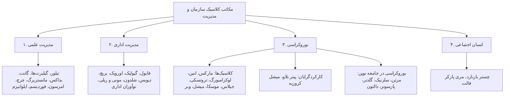
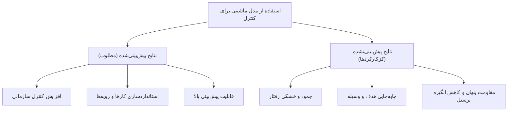
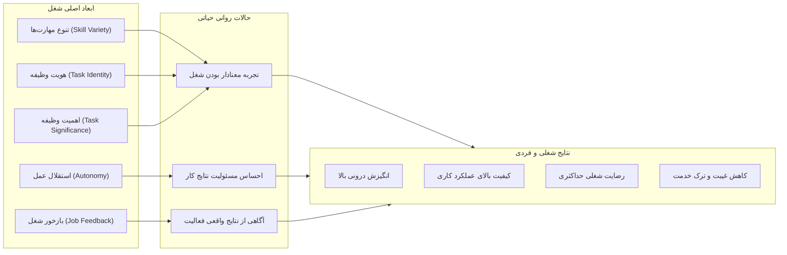

# فصل دوم: سیر تحول مکاتب و نظریه‌های مدیریت
> 🌟 **شاه‌فصل طلایی و رتبه‌ساز کنکور کارشناسی ارشد مدیریت:** این سرفصل با اختصاص **۹۷ تست از ۳۱۵ تست کنکورهای اخیر (معادل ۳۰.۸٪ کل سوالات تئوری مدیریت)**، تعیین‌کننده‌ترین و پربازده‌ترین بخش آزمون است. تسلط مفهومی و تفکیک ماتریسی نظریه‌پردازان این فصل، ضامن دستیابی به درصد بالای ۷۰٪ در کنکور است.

---

## 🗺️ فهرست ساختاریافته مباحث فصل دوم

۱. **چیستی نظریه و فرایند نظریه‌پردازی در مدیریت** (کتاب مرجع جلیلیان، ص ۴۷) 
۲. **روش‌شناسی و الگوهای سه‌گانه طبقه‌بندی نظریه‌های سازمان و مدیریت** (کتاب مرجع جلیلیان، ص ۴۷ تا ۵۰) 
 - ۱-۲. طبقه‌بندی تاریخی چهارگانه ریچارد اسکات (مدل ماتریسی سیستم باز/بسته و عقلایی/اجتماعی) 
 - ۲-۲. طبقه‌بندی مجموعه‌ای رابرت کوئین (چارچوب ارزش‌های رقابتی و نقش‌های هشت‌گانه مدیر) 
 - ۳-۲. طبقه‌بندی موضوعی دیدگاه‌های چهارگانه (صنعتی، عوامل انسانی، روان‌شناسی اجتماعی، جامعه‌شناسانه) 
۳. **تکامل تاریخی رهیافت‌ها و پیشگامان مدیریت** (کتاب مرجع جلیلیان، ص ۵۰ و ۵۱؛ کتاب نظریه‌های سازمان دکتر سیدجوادین، ص ۲۰ تا ۲۴) 
 - ۱-۳. گاه‌شمار افکار و عملیات مدیریت در دوره کهن و تمدن‌های باستان 
 - ۲-۳. افکار و عملیات مدیریت در قرون وسطی (شاهکار انبار دریایی ونیز) 
 - ۳-۳. دوران آگاهی اداری و انقلاب صنعتی (آدام اسمیت و قطعات تعویض‌پذیر) 
 - ۴-۳. پیشگامان قرن نوزدهم (سوهو، رابرت اون، ببیج، مک‌کالیوم، تاون و وارتون) 
 - ۵-۳. آغاز جنبش‌های منظم مدیریت در اوایل قرن بیستم 
 - ۶-۳. مبانی فلسفی و مفروضات مشترک مکتب کلاسیک 
۴. **مکتب مدیریت علمی فردریک تیلور و توسعه آن** (کتاب مرجع جلیلیان، ص ۵۱ تا ۵۳) 
 - ۱-۴. رسالت بنیادین و یک بهترین راه 
 - ۲-۴. کالبدشکافی کم‌کاری طبیعی و نظام‌یافته 
 - ۳-۴. اصول چهارگانه و عناصر سه‌گانه تخصصی کردن 
 - ۴-۴. سرپرستی وظیفه‌ای (چندگانه) در برابر وحدت فرماندهی 
 - ۵-۴. مدیریت بر مبنای استثنا و حسابداری بهای تمام‌شده 
 - ۶-۴. توسعه مدیریت علمی (فوردیسم و استاخانوفیسم) و انتقادات وارده 
۵. **مکتب مدیریت اداری هنری فایول (اصول‌گرایان)** (کتاب مرجع جلیلیان، ص ۵۴ تا ۵۶) 
 - ۱-۵. فعالیت‌های شش‌گانه سازمان و وظایف پنج‌گانه مدیریت 
 - ۲-۵. ویژگی‌های مدیران و ابزارهای پنج‌گانه مدیریت فایول 
 - ۳-۵. تشریح تفصیلی اصول چهارده‌گانه فایول 
 - ۴-۵. سازوکار پل ارتباطی فایول 
 - ۵-۵. نقد هربرت سایمون و مقایسه جهت‌گیری تیلور و فایول 
۶. **مکتب بوروکراسی ماکس وبر (دیوان‌سالاری)** (کتاب مرجع جلیلیان، ص ۵۷ تا ۶۱) 
 - ۱-۶. مفهوم‌شناسی و مدل آرمانی بوروکراسی 
 - ۲-۶. اصول سه‌گانه و ویژگی‌های ساختاری بوروکراسی 
 - ۳-۶. گونه‌شناسی سه‌گانه قدرت و مشروعیت وبر 
 - ۴-۶. کژکارکردهای بوروکراسی و تمثیل «قفس آهنین» 
 - ۵-۶. جابه‌جایی هدف و وسیله (رابرت مرتون و فیلیپ سلزنیک) 
 - ۶-۶. معضل اختیار و شایستگی تالکوت پارسونز 
 - ۷-۶. آسیب‌شناسی ترفیع: اصل پیتر (کشیدن در برابر هل دادن) و قانون پارکینسون 
 - ۸-۶. الگوهای سه‌گانه دیوان‌سالاری آلوین گلدنر (کاذب، نمایندگی، تنبیه‌مدار) 
۷. **ماتریس مقایسه‌ای و جمع‌بندی مکاتب سه‌گانه کلاسیک (تیلور، فایول، وبر)** (کتاب مرجع جلیلیان، ص ۶۱) 
۸. **پل‌های ارتباطی و دوران گذار از کلاسیک به روابط انسانی** (کتاب مرجع جلیلیان، ص ۶۲ تا ۶۴) 
 - ۱-۸. مری پارکر فالت (انسان کامل، تلفیق در تعارض، قدرت با و قانون موقعیت) 
 - ۲-۸. چستر بارنارد (سیستم‌های همکاری، تئوری پذیرش اختیار و منطقه بی‌تفاوتی) 
۹. **نهضت روابط انسانی و مطالعات هاثورن التون مایو** (کتاب مرجع جلیلیان، ص ۶۴ تا ۶۶) 
 - ۱-۹. ریشه‌های پیدایش و زیرشاخه‌های سه‌گانه مکتب رفتاری 
 - ۲-۹. آزمایش‌های هاثورن و کشف «اثر هاثورن» 
 - ۳-۹. درس‌های چهارگانه هاثورن و کشف سازمان غیررسمی 
۱۰. **نظریه سلسله‌مراتب نیازهای آبراهام مازلو** (کتاب مرجع جلیلیان، ص ۶۶ و ۶۷) 
۱۱. **نظریه X و نظریه Y داگلاس مک‌گریگور** (کتاب مرجع جلیلیان، ص ۶۷) 
۱۲. **نظریه شخصیت و سازمان کریس آرجیریس (پیوستار بلوغ - نابالغی)** (کتاب مرجع جلیلیان، ص ۶۷ و ۶۸) 
۱۳. **رهیافت‌های کمی به مدیریت (علم مدیریت و تحقیق در عملیات)** (کتاب مرجع جلیلیان، ص ۶۸؛ کتاب نظریه‌های سازمان دکتر سیدجوادین، ص ۲۰۷ و ۲۱۵ تا ۲۱۸) 
 - ۱-۱۳. ماهیت هنجاری و تجویزی، زیرمجموعه‌ها و کاربرد ابزارهای OR 
 - ۲-۱۳. فرایند شش‌مرحله‌ای OR، مسائل هفت‌گانه استونر و نقد مکتب مقداری 
۱۴. **رهیافت سیستمی و نظریه عمومی سیستم‌ها (لودویگ فون برتالنفی)** (کتاب مرجع جلیلیان، ص ۶۸ تا ۷۰؛ کتاب نظریه‌های سازمان دکتر سیدجوادین، ص ۲۰۷ تا ۲۱۴) 
 - ۱-۱۴. ویژگی‌های پنج‌گانه برتالنفی و مفروضات هشت‌گانه سیستم 
 - ۲-۱۴. ارکان پنج‌گانه، بازخور و ۱۰ ویژگی بنیادین سیستم‌ها 
 - ۳-۱۴. خرده‌سیستم‌های پنج‌گانه کاتز و کان 
 - ۴-۱۴. مدل طبقه‌بندی ۴ عصری ریچارد اسکات و سطوح سه‌گانه تحلیل 
۱۵. **جهت‌گیری‌های نوین تفکر سیستمی: سازمان یادگیرنده و نظریه آشوب** (کتاب مرجع جلیلیان، ص ۷۰ تا ۷۲) 
 - ۱-۱۵. سازمان یادگیرنده پیتر سنج و مراحل سه‌گانه گاروین 
 - ۲-۱۵. نظریه آشوب، اثر پروانه‌ای، لبه آشوب، سازگاری پویا، خودمانایی و جاذبه‌های غریب 
۱۶. **مکتب اقتضایی (نظریه موقعیتی)** (کتاب مرجع جلیلیان، ص ۷۲ تا ۷۴؛ کتاب نظریه‌های سازمان دکتر سیدجوادین، ص ۲۱۹ تا ۲۲۸) 
 - ۱-۱۶. منطق روابط «اگر - آنگاه» و پیشینه تاریخی (قانون موقعیت فالت) 
 - ۲-۱۶. مدل‌های اقتضایی ساختار: لارنس و لورش، برنز و استاکر، آستون، امری و تریست، دانکن، وودوارد، پرو، تامپسون 
 - ۳-۱۶. نظریه‌های اقتضایی رهبری و تصمیم‌گیری: فیدلر، هرسی و بلانچارد، لیکرت، وروم و یتن، ماتریس SWOT دفت 
 - ۴-۱۶. تقابل اقتضایی با موقعیتی (Situationism) و سیستمی و تحلیل انتقادی 
۱۷. **روندهای نوین در رهیافت‌های مدیریتی و نهضت نوین روابط انسانی** (کتاب مرجع جلیلیان، ص ۷۴ و ۷۵؛ کتاب نظریه‌های سازمان دکتر سیدجوادین، ص ۲۵۹ تا ۲۷۴) 
 - ۱-۱۷. طبقه‌بندی انسان شاین و جنگل نظریه‌های مدیریت هارولد کونتز 
 - ۲-۱۷. نقش‌های مدیریتی هنری مینتزبرگ و مدل نظام اجتماعی PAEI اسحاق آدیزس 
 - ۳-۱۷. نظریه کمال مدیریت و چارچوب 7S مکینزی 
 - ۴-۱۷. مدیریت بر مبنای هدف (MBO) و اهداف هشت‌گانه پیتر دراکر 
 - ۵-۱۷. تئوری Z ویلیام اوچی (مقایسه جامع تئوری A، J و Z) 
 - ۶-۱۷. قوانین چهارگانه پارکینسون و آزمایش‌های هم‌نوایی سولومون اش 
 - ۷-۱۷. نظریه حس‌گری و معناسازی سازمانی کارل وایک (۷ ویژگی و فرایند ۴ مرحله‌ای) 
۱۸. **فرانوگرایی در نظریه سازمان (پست‌مدرنیسم)** (کتاب مرجع جلیلیان، ص ۷۵) 
 - ۱-۱۸. نقد عقلانیت مدرن و روایت‌های کلان 
 - ۲-۱۸. سیمای سازمان‌های آینده، افشای مناسبات قدرت و «آوا دادن به سکوت» 
۱۹. **تفاوت دیدگاه‌های نظری در مورد سازمان از نظر معرفت‌شناختی** (کتاب مرجع جلیلیان، ص ۷۶) 
 - ۱-۱۹. ماتریس مقایسه‌ای کلاسیک، مدرنیسم، تفسیری/نمادین و پست‌مدرنیسم 
۲۰. **به‌کارگیری تئوری‌های سازمان و مدیریت در محیط‌های مختلف** (کتاب مرجع جلیلیان، ص ۷۶ و ۷۷) 
 - ۱-۲۰. رویکرد همگرا و تز مک‌دونالدسازی 
 - ۲-۲۰. رویکرد واگرا، ابعاد فرهنگی گرت هافستد و تئوری نهادی 
 - ۳-۲۰. رویکرد متوازن: رویکرد اثر اجتماعی 
۲۱. **استعاره‌های بنیادین هشت‌گانه سازمان (گارت مورگان - سیمای سازمان)** (کتاب مرجع جلیلیان، ص ۷۷ تا ۸۱) 
 - ۱-۲۱. سازمان به مثابه ماشین، موجود زنده، مغز، زندان روح، پدیده دگرگون‌شونده، ابزار سلطه، فرهنگ، و نظام سیاسی 
 - ۲-۲۱. سایر استعاره‌های مطرح سازمان (صحنه نمایش، متن، گفتگو، جاز و هنر) 
۲۲. **طبقه‌بندی سلسله‌مراتبی سیستم‌ها از دیدگاه کنت بولدینگ** (کتاب مرجع جلیلیان، ص ۸۲ و ۸۳) 
 - ۱-۲۲. سطوح نه‌گانه سیستم‌ها (از ساختار ایستا تا سیستم‌های متعالی) و قاعده انباشتگی 
 - ۲-۲۲. خوشه‌بندی سه‌گانه علوم و شاه‌تله‌های تستی سطح ۴ و سطح ۸ 
۲۳. **کپسول مرور سریع ۱۰ دقیقه‌ای فصل دوم (جمع‌بندی ضربتی مکاتب مدیریت)** 
۲۴. **کالبدشکافی دام‌ها و شاه‌تله‌های تستی طراحان کنکور ارشد** 
۲۵. **تست‌های استاندارد و برگزیده کنکور سراسری با تحلیل و منطق رد گزینه** 
۲۶. **سؤالات بازیابی فعال ذهنی (Active Recall Prompts)** 

---

## ۱. چیستی نظریه، اجزا و فرایند نظریه‌پردازی در مدیریت (کتاب مرجع جلیلیان، ص ۴۷؛ کتاب نظریه‌های سازمان دکتر سیدجوادین، ص ۱۵ تا ۱۹)

نظریه‌ها (تئوری‌ها) توصیف‌هایی علمی و نظام‌مند هستند که به تبیین و تشریح روابط علّی و معلولی میان متغیرها یا ویژگی‌های سازمان می‌پردازند و چرایی وقوع پدیده‌ها را روشن می‌سازند. به تعبیر مشهور کورت لوین:
> «هیچ چیز کاربردی‌تر از یک نظریه خوب نیست.»

### ۱-۱. ویژگی‌های سه‌گانه بنیادین یک تئوری علمی (کتاب نظریه‌های سازمان دکتر سیدجوادین، ص ۱۵ و ۱۶):
هر نظریه معتبر علمی باید واجد سه خصیصه کلیدی باشد:
1. **بیان‌کننده نظم پایدار:** تبیین روابط باثبات و قاعده‌مند حاکم بر پدیده‌ها به دور از تصادف‌های مقطعی.
2. **توانایی پیش‌بینی مشروط:** امکان پیش‌بینی پیامدها در صورت تحقق شرایط و متغیرهای مفروض.
3. **ابطال‌پذیری (کارل پوپر):** قابلیت آزمون تجربی و امکان ابطال گزاره‌های نظری در بوته آزمایش.

---

### ۲-۱. کالبدشکافی اجزای نه‌گانه تئوری در متدولوژی علم (کتاب نظریه‌های سازمان دکتر سیدجوادین، ص ۱۵ و ۱۶):
فرایند ساخت یک نظریه از عناصر معرفتی زیر تشکیل می‌شود:
1. **فرضیه:** حدس هوشمندانه و زیرکانه پژوهشگر پیرامون نتایج حاصل از رابطه میان متغیرها پیش از انجام آزمون.
2. **تجربه:** ثبت، مشاهده، سنجش، مقایسه، تمثیل، طبقه‌بندی و تعریف دقیق کنش‌ها و واکنش‌های پدیده‌ها.
3. **قانون:** رابطه پایدار و تکرارشونده میان حقایق که در قالب قضایای کلی و منطقی بیان می‌گردد؛ مانند **«قانون مورفی»** (*«اگر قرار باشد رویدادی ناگوار رخ دهد، حتماً رخ خواهد داد!»*).
4. **اصل:** گزاره‌ای تعمیم‌یافته و جهان‌شمول با پشتوانه تأیید تجربی بسیار محکم و مکرر؛ مانند:
 - **اصل پیتر:** افراد در سازمان‌های سلسله‌مراتبی تا سرحد بی‌کفایتی خود ارتقا می‌یابند.
 - **اصل پارکینسون:** کار به گونه‌ای کش می‌آید تا تمامی زمان در دسترس را پر کند.
 - **اصل استثنای تیلور:** تفویض امور روزمره به زیردستان و تمرکز مدیر ارشد بر انحرافات غیرعادی.
5. **حقیقت:** اساسی‌ترین و مؤثرترین سنگ بنای تئوری‌پردازی؛ تئوری روابط علت و معلولی میان حقایق عینی را کشف و تبیین می‌کند.
6. **قانون علمی:** فرضیه‌ای که در بوته آزمون‌های مکرر تجربی به طور قاطع تأیید شده و تردیدی در آن باقی نمانده است.
7. **امر واقع:** رویداد یا وضعیت عینی و محسوسی که کاملاً سنجش‌پذیر، ملموس و قابل توصیف است (مانند تجربه احساس تشنگی یا گرسنگی، و حالات روانی انگیزش و گرایش).
8. **مفهوم:** تصویر، تصور یا تعبیر ذهنی مجرد از یک تجربه حسی یا امر واقع (مانند ادراک واژگان «گرسنگی» یا «انگیزش»).
9. **سازه:** مفهومی انتزاعی که دارای **تعریف علمی، عملیاتی و استاندارد سنجش** است (مانند مفهوم هوش که وقتی با آزمون‌های استاندارد سنجیده می‌شود به سازه **«بهره هوشی (IQ)»** تبدیل می‌گردد).

---

### ۳-۱. ابزارهای شناختی چهارگانه در تئوری‌پردازی سازمان (کتاب نظریه‌های سازمان دکتر سیدجوادین، ص ۱۷):
نظریه‌پردازان برای تبیین سازمان از چهار سازوکار شناختی بهره می‌برند:
1. **مدل یا الگو:** نهادی انتزاعی و ساده‌شده که تنها بخش اندکی از ابعاد مهم و منتخب سازمان را تشریح می‌کند. هر مدل از دو دسته متغیر تشکیل می‌شود:
 - **متغیر مستقل:** متغیری که بر سایر ویژگی‌های سازمان اثر می‌گذارد و نقش علت را دارد.
 - **متغیر وابسته:** متغیری که معلول متغیر مستقل بوده و تغییرات آن را بازتاب می‌دهد.
2. **مُد یا نماد:** بیان کلیت یک پدیده پیچیده تنها بر اساس یک یا دو ویژگی محوری و نمادین آن؛ که این نمادها سیر تحول اندیشه مدیریت را به تصویر کشیده‌اند:
 - *نماد انسان اقتصادی:* در مدیریت علمی کلاسیک (تحریک صرف با پول).
 - *نماد انسان اجتماعی:* در مکتب روابط انسانی (تحریک با تعلق و پذیرش گروهی).
 - *نماد انسان خودیاب:* در مکتب منابع انسانی (تحریک با رشد و شکوفایی).
 - *نماد انسان پیچیده:* در مکتب اقتضایی (تحریک با متغیرهای چندگانه موقعیتی).
3. **استعاره:** توصیف یک پدیده ناشناخته بر پایه شباهت ساختاری با پدیده‌ای آشنا (مانند تشبیه سازمان به ماشین، موجود زنده، مغز یا نظام سیاسی توسط گارت مورگان).
4. **پارادایم (توماس کوهن):** مجموعه دستاوردهای علمی و باورهای بنیادین مورد توافق جامعه علمی در یک برهه زمانی که الگو و سرمشقی مشترک برای تعریف مسائل و یافتن راه‌حل‌ها ارائه می‌دهد.

---

### ۴-۱. فرایند دو مرحله‌ای تدوین نظریه و مفهوم اعوجاجات (کتاب مرجع جلیلیان، ص ۴۷):
در دانش مدیریت، فرایند تدوین نظریه شامل دو مرحله پیاپی است:
1. **مرحله توصیفی:** مشاهده پدیده‌ها و تبیین واقعیت موجود («آنچه هست»).
2. **مرحله تجویزی (هنجاری):** ارائه قواعد، دستورالعمل‌ها و توصیه‌های اجرایی برای مدیران («آنچه باید باشد»).

در هر یک از این دو مرحله، نظریه‌پرداز سه گام را سپری می‌کند: ۱. **مشاهده** ۲. **طبقه‌بندی** ۳. **تعیین روابط در قالب مدل**.

> [!important] مفهوم کلیدی: اعوجاجات یا نامتعارف‌ها (کتاب مرجع جلیلیان، ص ۴۷)
> هرگاه در بوته آزمون تجربی، روابط پیش‌بینی‌شده مدل تأیید نشود و نتایجی مغایر حاصل آید، به این پدیده‌های نامنتظره **اعوجاجات یا نامتعارف‌ها** می‌گویند که زمینه را برای بازنگری در نظریه یا ظهور یک «انقلاب پارادایمی» فراهم می‌سازد.

---

### ۵-۱. سیر تطور گونه‌شناسی‌ها و جنگل تئوری‌های مدیریت (کتاب مرجع جلیلیان، ص ۴۷؛ کتاب نظریه‌های سازمان دکتر سیدجوادین، ص ۱۸):
* **هارولد کونتز (۱۹۶۱):** با انتشار مقاله مشهور «جنگل تئوری مدیریت»، تعدد دیدگاه‌ها را به جنگلی انبوه تشبیه کرد که در ابتدا از ۶ مکتب آغاز شد و اکنون به **۱۲ رویکرد فرایندی** گسترش یافته است.
* **ریچارد اسکات:** طبقه‌بندی ماتریسی بر اساس سطوح تحلیل و تلاقی دو بعد عقلایی/طبیعی و باز/بسته.
* **بارل و مورگان:** گونه‌شناسی چهار پارادایم بر اساس مفروضات علوم اجتماعی و ماهیت جامعه (کارکردگرا، تفسیرگرا، انسان‌گرای رادیکال، ساختارگرای رادیکال).
* **گارت مورگان:** رویکرد چنداستعاره‌ای برای رهایی از تعصب تک‌پارادایمی.
* **رابرت کوئین:** مدل ارزش‌های رقابتی با دو بعد انعطاف/کنترل و تمرکز درونی/بیرونی.
* **دیوید سیلورمن:** گونه‌شناسی بر پایه تکنولوژی و ساختار در سه دسته: ۱) مبتنی بر ورودی‌ها ۲) مبتنی بر خروجی‌ها ۳) عوامل بین‌سازمانی.

---

### ۶-۱. ماتریس کلان تکامل اجتماعی و تاریخی مدیریت در تمدن بشر (کتاب نظریه‌های سازمان دکتر سیدجوادین، ص ۱۹):
برای درک ریشه‌های تاریخی سازمان، سیر دگرگونی ویژگی‌های مدیریتی در چهار دوره تمدنی بشر در جدول زیر صورت‌بندی شده است:

#### جدول ۲-۰: مقایسه تطبیقی ویژگی‌های شخصی و مدیریتی در اعصار چهارگانه تمدن بشری (کتاب نظریه‌های سازمان دکتر سیدجوادین، ص ۱۹)

| شاخص مدیریتی | عصر شکار (تا ۹۰۰ میلادی) | عصر کشاورزی (تا ۱۷۵۰ میلادی) | عصر صنعت (تا ۱۹۵۰ میلادی) | عصر اطلاعات (۱۹۵۰ تاکنون) |
|:--- |:--- |:--- |:--- |:--- |
| **منبع استراتژیک** | شکار حیوانات و طبیعت | زمین و املاک کشاورزی | سرمایه مالی و ماشین‌آلات | **دانش و اطلاعات** |
| **پراکندگی جغرافیایی** | کاملاً پراکنده و متحرک | تمایل به سکونت و روستاها | **متمرکز در شهرها و کارخانه‌ها** | **غیرمتمرکز، شبکه‌ای و دورکاری** |
| **نیروهای مولد** | شکارچیان قبیله | کشاورزان و دهقانان | کارگران یدی، تکنسین‌ها و کارشناسان | **کارگران فکری و دانش‌کاران** |
| **تیراژ و وضعیت تولید** | حداقل و در حد معیشت | حداقل و متناسب با مصرف | **تولید انبوه و یکنواخت استاندارد** | **تولید سفارشی، منعطف و چابک** |
| **زمان‌بندی کار** | کاملاً نامنظم و فصلی | نامنظم و وابسته به فصول سال | **منظم، ساعتی و شیفت‌های اداری** | **نامنظم و شبانه‌روزی (۲۴ ساعته)** |
| **کانون تمرکز** | صرفاً انجام کار | صرفاً انجام کار کشاورزی | **حضور فیزیکی در محل کار** | **کیفیت خروجی و زمان تحویل** |
| **شیوه یادگیری** | استاد - شاگردی سنتی | مکتب‌خانه‌ای مبتنی بر الگو | دوره‌های آموزشی تخصصی شغلی | **یادگیری مداوم، تیمی و اقتضایی** |
| **سبک مدیریت** | آمرانه و سرکوب‌گر | آمرانه و پدرسالارانه دلسوزانه | ابزاری، مکانیکی و مدیریت علمی | **رهبری دانشی، تحلیلی و انگیزشی** |
| **پیشران تحول به عصر بعد** | تمایل به اسکان و پیدایش زبان | رنسانس، انقلاب صنعتی و علمی | پیچیدگی سازمان‌ها و انفجار داده‌ها | بحران‌های عقلانیت و هوش مصنوعی |

---

## ۲. روش‌شناسی و الگوهای سه‌گانه طبقه‌بندی نظریه‌ها (کتاب مرجع جلیلیان، ص ۴۷ تا ۵۰)

صاحب‌نظران نظریه‌های مدیریت را بر پایه سه رویکرد کلی دسته‌بندی کرده‌اند:
۱. طبقه‌بندی تاریخی 
۲. طبقه‌بندی مجموعه‌ای 
۳. طبقه‌بندی موضوعی

---

### ۱-۲. طبقه‌بندی تاریخی چهارگانه ریچارد اسکات (کتاب مرجع جلیلیان، ص ۴۸)

ریچارد اسکات سیر تحول تاریخی نظریه‌های مدیریت را بر اساس تقاطع دو بعد بنیادین صورت‌بندی می‌کند:
1. **نگاه به سازمان:** سازمان به عنوان **سیستم بسته** (بی‌توجه به محیط بیرون) در برابر **سیستم باز** (وابسته و در تعامل پویا با محیط).
2. **مدل رفتار انسان در سازمان:** رفتار **عقلایی و منطقی** (انسان اقتصادی، محاسبه‌گر و تابع نظم) در برابر رفتار **اجتماعی** (انسان دارای عواطف، ارزش‌ها، تعلقات گروهی و بازی‌های سیاسی).

تقاطع این دو محور، ماتریس تاریخی چهار گونه نظریه را خلق می‌کند:

#### جدول ۲-۱: ماتریس چهارگانه تاریخی ریچارد اسکات (کتاب مرجع جلیلیان، ص ۴۸)

| دوره زمانی | نوع سیستم سازمانی | مدل رفتار انسانی | نام گونه و مکتب متناظر | نظریه‌پردازان و تئوری‌های شاخص | مفروضات و جهت‌گیری محوری |
|:---: |:---: |:---: |:--- |:--- |:--- |
| **۱۹۰۰ تا ۱۹۳۰** | **سیستم بسته** | **عقلایی (منطقی)** | **گونه اول: مکتب کلاسیک** | تیلور، فایول، ماکس وبر، گیولیک و ارویک | سازمان مانند ساعتی کوکی ابزار تحقق اهداف از پیش تعیین‌شده است. محیط بیرونی نادیده گرفته می‌شود و انسان با پاداش‌های مادی کارایی خود را بالا می‌برد. |
| **۱۹۳۰ تا ۱۹۶۰** | **سیستم بسته** | **اجتماعی** | **گونه دوم: مکتب نئوکلاسیک (روابط انسانی)** | التون مایو (مطالعات هاثورن)، چستر بارنارد (سیستم‌های همکاری) | سازمان همچنان بسته فرض می‌شود اما کانون توجه به احساسات، رضایت شغلی، گروه‌های غیررسمی و انگیزش اجتماعی انسان تغییر می‌یابد. |
| **۱۹۶۰ تا ۱۹۷۰** | **سیستم باز** | **عقلایی (منطقی)** | **گونه سوم: نظریه‌های اقتضایی عقلایی** | جوآن وودوارد، چارلز پرو، نظریه کارگزاری، عقلانیت محدود سایمون، هزینه مبادله | ساختار سازمان تابع اقتضائات محیط و تکنولوژی طراحی می‌شود تا اهداف سازمانی به شیوه‌ای کاملاً منطقی و حساب‌شده محقق شوند. |
| **۱۹۷۰ تا ۲۰۰۰** | **سیستم باز** | **اجتماعی** | **گونه چهارم: نظریه‌های اقتضایی اجتماعی و نهادی** | جفری ففر و سالانسیک (وابستگی به منابع)، مایر و رووان (نظریه نهادی)، اکولوژی جمعیت | به پدیده‌های قدرت، سیاست، مشروعیت فرهنگی و هنجارهای اجتماعی محیط توجه می‌شود. رفتارهای سازمان الزاماً عقلایی نیست بلکه ناشی از اجبارها و بازی‌های قدرت است. |

> [!tip] نکته راهبردی کنکور (کتاب مرجع جلیلیان، ص ۴۸؛ کتاب نظریه‌های سازمان دکتر سیدجوادین، ص ۱۷):
> در تمامی الگوهای طبقه‌بندی تاریخی، همواره سه مکتب محوری تکرار می‌شوند:
> ۱. مکتب مدیریت علمی (کلاسیک) ۲. مکتب روابط انسانی (نئوکلاسیک) ۳. مکتب مدیریت سیستم‌ها (مدرن).

#### الگوهای تکمیلی طبقه‌بندی مکاتب مدیریت از دیدگاه صاحب‌نظران (کتاب نظریه‌های سازمان دکتر سیدجوادین، ص ۱۷):
* **ویلیام اسکات (William Scott):** طبقه‌بندی پارادایم‌های حاکم در سه مکتب بزرگ تاریخی: **کلاسیک $\longleftarrow$ نئوکلاسیک $\longleftarrow$ سیستمی**.
* **مارتین گانون (Martin Gannon):** طبقه‌بندی بر اساس مفاهیم و کارکردها در **هفت مکتب**:
  1. مکتب وظیفه‌ای (فایول) 2. مدیریت علمی (تیلور) 3. مدیریت کمی (OR) 4. روابط انسانی (هاثورن) 5. منابع انسانی (رشد و خودیابی) 6. تئوری سیستم‌ها 7. تئوری اقتضایی.
* **جفری فیفر (Jeffrey Pfeffer):** طبقه‌بندی بر مبنای سطح عمل و تحلیل به دو لایه:
  - **تئوری‌های خرد:** کانون توجه بر رفتار فرد و گروه در سازمان (OB).
  - **تئوری‌های کلان:** کانون توجه بر کل ساختار سازمان و تعامل با محیط (OT).
* **جان شرمرهورن (John Schermerhorn):** دسته‌بندی جامع تئوری‌ها در **پنج رویکرد اصلی**:
  1. رویکرد سنتی (کلاسیک) 2. رویکرد منابع انسانی 3. رویکرد مدیریت علمی و کمی 4. رویکرد سیستمی 5. رویکرد اقتضایی.

---

### ۲-۲. طبقه‌بندی مجموعه‌ای رابرت کوئین (چارچوب ارزش‌های رقابتی) (کتاب مرجع جلیلیان، ص ۴۹)

رابرت کوئین و همکارانش برای ارائه چارچوبی جامع، مکاتب مدیریت را بر اساس دو بعد بنیادین در قالب «چارچوب ارزش‌های رقابتی» ترسیم نمودند:
- **بعد تمرکز سازمانی:** توجه به محیط درون سازمان $\longleftrightarrow$ توجه به محیط برون سازمان
- **بعد ساختار سازمانی:** گرایش به کنترل و ثبات (تمرکز) $\longleftrightarrow$ گرایش به انعطاف‌پذیری و تغییر (عدم تمرکز)

> [!tip] 🖼️ **ارجاع به تصویر کتاب:** برای مشاهده مدل فضایی هندسی چارچوب ارزش‌های رقابتی، به **نمودار ۲-۱ (صفحه ۴۹ کتاب مرجع جلیلیان)** مراجعه کنید.

#### چهار مکتب و نقش‌های هشت‌گانه مدیر در مدل کوئین (کتاب مرجع جلیلیان، ص ۴۹):

1. **مکتب عقلایی سازمان (برون‌گرا + کنترل‌محور):**
 - *گرایش‌های اصلی:* کارایی، بهره‌وری و سودآوری اقتصادی.
 - *نقش‌های مدیر:*
 - **محرک تولید و ارائه خدمت:** بالا بردن بازده و بهره‌وری.
 - **هدایت‌کننده و برنامه‌ریز:** تعیین اولویت‌ها و شفاف‌سازی اهداف.

2. **مکتب اصول‌گرایی / فرایند درونی (درون‌گرا + کنترل‌محور):**
 - *گرایش‌های اصلی:* انضباط، مقررات مکتوب، تفکیک دقیق وظایف و تثبیت وضعیت موجود.
 - *نقش‌های مدیر:*
 - **ناظر و ارزیاب:** کنترل اسناد، کاهش انحرافات و تطبیق مقررات.
 - **هماهنگ‌کننده:** ایجاد انضباط و جریان پیوسته گردش کار.

3. **مکتب روابط انسانی (درون‌گرا + انعطاف‌پذیر):**
 - *گرایش‌های اصلی:* روحیه، مشارکت، رضایت کارکنان و توسعه منابع انسانی.
 - *نقش‌های مدیر:*
 - **روحیه‌آفرین و رایزن:** ایجاد اعتماد و توجه به عواطف فردی.
 - **تسهیل‌کننده روابط گروهی:** میانجی‌گری در تعارضات و تیم‌سازی.

4. **مکتب سیستم‌های باز و اقتضایی (برون‌گرا + انعطاف‌پذیر):**
 - *گرایش‌های اصلی:* نوآوری، انطباق با بازار، رشد و جذب منابع از محیط خارج.
 - *نقش‌های مدیر:*
 - **ابداع‌گر و خلاق:** شناسایی روندهای نو و پیشتازی در تغییر.
 - **مذاکره‌کننده:** رایزنی بیرونی، جلب حمایت‌های محیطی و شکار فرصت‌ها.

#### جدول ۲-۲: نقش‌های هشت‌گانه مدیر در مکاتب چهارگانه کوئین (کتاب مرجع جلیلیان، ص ۴۹)

| مکتب سازمانی | جهت‌گیری و بعد ارزشی | گرایش‌های اصلی عملکرد | نقش اول مدیر | نقش دوم مدیر |
|:--- |:--- |:--- |:--- |:--- |
| **عقلایی سازمان** | برون‌گرا + کنترل و تمرکز | کارایی و بهره‌وری | **محرک تولید و خدمت** | **هدایت‌کننده و برنامه‌ریز** |
| **اصول‌گرایی (فرایند درونی)** | درون‌گرا + کنترل و تمرکز | تثبیت، قوانین و نظم | **ناظر و ارزیاب** | **هماهنگ‌کننده** |
| **روابط انسانی** | درون‌گرا + انعطاف و استقلال | مشارکت و روحیه جمعی | **روحیه‌آفرین و رایزن** | **تسهیل‌کننده روابط گروهی** |
| **سیستمی و اقتضایی** | برون‌گرا + انعطاف و استقلال | نوآوری و جذب منابع | **ابداع‌گر و خلاق** | **مذاکره‌کننده** |

---

### ۳-۲. طبقه‌بندی موضوعی دیدگاه‌های چهارگانه (کتاب مرجع جلیلیان، ص ۵۰)

در این رویکرد، مکاتب بر اساس زاویه نگاه رشته‌های علمی به سازمان دسته‌بندی می‌شوند:

#### جدول ۲-۳: خصوصیات دیدگاه‌های چهارگانه موضوعی (کتاب مرجع جلیلیان، ص ۵۰)

| مؤلفه ارزیابی | دیدگاه صنعتی - سازمانی | دیدگاه عوامل انسانی (ارگونومی) | دیدگاه روان‌شناسی اجتماعی | دیدگاه جامعه‌شناسانه |
|:--- |:--- |:--- |:--- |:--- |
| **واحد تجزیه و تحلیل** | **وظایف شغلی** | **فرد شاغل** | **گروه و فرد در گروه** | **گروه و کل سازمان** |
| **متغیرهای مستقل** | سن، جنسیت، شخصیت و خصوصیات فردی | مهارت‌های شغلی، توان ذهنی، شرایط فیزیکی کار | نظرات فردی، هنجارهای گروهی، روحیه گروه | نقش‌ها، ساختار سازمانی، اندازه و تکنولوژی |
| **متغیرهای وابسته** | رضایت شغلی، ترک خدمت، غیبت از کار | کارایی عملیاتی و سرعت انجام وظایف | رفتارها، ادراکات و داوری‌های بین‌فردی | اثربخشی کل سازمان، خروج خدمت و مشروعیت |
| **شیوه سنجش** | سنجش طرز تلقی‌ها و واکنش‌های ذهنی | سنجش مشخصات و ابعاد فیزیکی شغل | سنجش ادراکات و بازخوردهای درون‌گروهی | سنجش شاخص‌های ساختاری و متغیرهای گروهی |

---

## ۳. تکامل تاریخی رهیافت‌ها و پیشگامان مدیریت (کتاب مرجع جلیلیان، ص ۵۰ و ۵۱؛ کتاب نظریه‌های سازمان دکتر سیدجوادین، ص ۲۰ تا ۲۴)

علم مدیریت پدیده‌ای دفعی نیست، بلکه ثمره قرن‌ها تجربه و اندیشه بشری است که از دل تمدن‌های کهن، قرون وسطی، دوران آگاهی اداری و انقلاب صنعتی جوانه زده و در اوایل قرن بیستم در قالب مکاتب رسمی متجلی شده است.

---

### ۱-۳. گاه‌شمار افکار و عملیات مدیریت در دوره کهن و تمدن‌های باستان (کتاب نظریه‌های سازمان دکتر سیدجوادین، ص ۲۰):

| تاریخ تاریخی | مبتکر، تمدن یا صاحب‌نظر | نوآوری مدیریتی، فعالیت و اثر شاخص کنکوری |
| :--- | :--- | :--- |
| **۵۰۰۰ ق.م** | **سومری‌ها** | نخستین ثبت مکتوب و حفظ سوابق و اسناد اداری به مثابه یک **فن کنترل** |
| **۴۰۰۰ ق.م** | **مصری‌ها** | طرح‌ریزی، برنامه‌ریزی، سازماندهی و کنترل عملیات در ساخت اهرام ثلاثه مصر |
| **۴۰۰۰ ق.م** | **چینی‌ها** | مدیریت و لجستیک عظیم ساخت دیوار بزرگ چین (۱۵۰۰ مایل) |
| **۲۷۰۰ ق.م** | **مصری‌ها** | رفتار منصفانه و صادقانه در مدیریت، و استفاده از مصاحبه برای مشاوره و روان‌درمانی |
| **۲۶۰۰ ق.م** | **مصری‌ها** | **استفاده از ساختار عدم تمرکز** در سازماندهی امور کشور |
| **۱۸۰۰ ق.م** | **حمورابی (شاه بابل)** | مستندسازی و آوردن شاهد برای نظارت، تعیین حداقل دستمزد، و **اصل تفویض‌ناپذیر بودن مسئولیت** |
| **۱۴۹۱ ق.م** | **یهودیان (حضرت موسی)** | استقرار خط فرماندهی و به‌کارگیری **«اصل استثنا»** در مدیریت قضاوت‌ها |
| **۵۰۰ ق.م** | **سان تزو (چین)** | تدوین اصول برنامه‌ریزی استراتژیک، هدایت و سازماندهی در رساله کلاسیک «هنر جنگ» |
| **۴۰۰ ق.م** | **کوروش کبیر (ایران هخامنشی)** | **توجه به روابط انسانی، مطالعه حرکت‌سنجی، طراحی جا و مکان، و مدیریت مواد و لجستیک** |
| **۴۰۰ ق.م** | **سقراط (یونان)** | اعلام نظریه بنیادین **«جهان‌شمول بودن و عمومیت مدیریت»** (مدیریت به عنوان دانشی مستقل) |
| **۴۰۰ ق.م** | **گزنفون (یونان)** | شناخت مدیریت به مثابه یک **«هنر مستقل»** از سایر مهارت‌ها |
| **۳۵۰ ق.م** | **یونانی‌ها** | به‌کارگیری روش‌های علمی در کار و استفاده از **موسیقی و ریتم** برای کاهش خستگی در کارهای سخت و تکراری |
| **۳۵۰ ق.م** | **افلاطون (رساله جمهوری)** | تشریح اصل **تخصص‌گرایی و تقسیم کار اجتماعی** بر مبنای استعداد افراد |
| **۳۳۶ تا ۳۲۳ ق.م**| **اسکندر مقدونی** | طراحی و به‌کارگیری **«نیروهای ستادی» (Staff)** در هدایت و پشتیبانی لشکریان |
| **۳۲۵ ق.م** | **کوتی‌لیا (هند باستان)** | تدوین کتاب آرتاشاسترا و تبیین مدیریت اداری، مالی و کشاورزی حکومت |
| **۱۷۵ ق.م** | **کاتو (روم باستان)** | استفاده کاربردی از **شرح شغل (Job Description)** |
| **۵۰ ق.م** | **وارو (روم باستان)** | تفکیک مشاغل و تعیین **شرایط احراز شغل (Job Specification)** |
| **۲۰ میلادی** | **حضرت عیسی (ع)** | رعایت **وحدت فرماندهی** و استقرار روابط مهرآمیز انسانی |
| **۲۸۴ میلادی** | **دیوکلتیان (امپراتور روم)** | اجرای نظام‌مند **تفویض اختیار** در سراسر قلمرو امپراتوری |
| **۶۲۰ میلادی** | **ظهور اسلام** | اداره اخلاقی، تربیتی، آموزشی و کمال‌بخشی به کرامت انسانی |
| **۶۵۸ میلادی** | **حضرت علی (ع)** | شایسته‌سالاری در انتخاب کارگزاران، نظارت و ارزشیابی دقیق، روابط انسانی و عدالت (عهدنامه مالک اشتر) |

---

### ۲-۳. افکار و عملیات مدیریت در قرون وسطی و دوران فترت (کتاب نظریه‌های سازمان دکتر سیدجوادین، ص ۲۱):

| تاریخ | صاحب‌نظر یا مرکز تجاری | دستاورد و اثر مدیریتی |
| :--- | :--- | :--- |
| **۹۰۰ م** | **فارابی (فیلسوف اسلامی)** | نگارش رساله آراء اهل مدینه فاضله و ترسیم **ویژگی‌های ۱۲گانه رهبر ایده‌آل** |
| **۱۰۸۲ م** | **کیکاووس ابن اسکندر** | تدوین کتاب **قابوس‌نامه** و تأکید بر شایستگی در انتخاب و انتصاب افراد به مشاغل |
| **۱۱۰۰ م** | **امام محمد غزالی** | تدوین کتاب **نصیحة الملوک**، برشمردن ویژگی‌های حاکمان و اهمیت مشاوره و رایزنی |
| **۱۳۴۰ م** | **لاپاکلی (ایتالیا)** | مدون ساختن سیستم **دفترداری دوبل (حسابداری دوطرفه)** |
| **۱۳۵۹ م** | **فرانسیس دیتارگو** | ابداع و استقرار حسابداری صنعتی و بهای تمام‌شده اولیه |
| **۱۳۷۰ م** | **هین ریخ فن ویک** | اختراع ساعت مکانیکی و ورود نظم زمان‌بندی دقیق به زندگی اجتماعی |
| **۱۴۱۰ م** | **برادران سورانزو (ایتالیا)** | ثبت منظم اقلام تجاری در دفاتر روزنامه |
| **۱۴۳۶ م** | **انبار دریایی ونیز (Arsenal of Venice)** | **شاهکار مدیریت رنسانس (نقطه طلایی کنکور):** • حسابداری بهای تمام‌شده و کنترل هزینه • بازرسی و کنترل کیفیت دقیق قطعات • شماره‌گذاری و انبارداری استاندارد موجودی‌ها • **استقرار خط مونتاژ متحرک زنجیره‌ای (۵۰۰ سال پیش از هنری فورد!)** • مدیریت رفاه و حقوق کارکنان |
| **۱۵۰۰ م** | **سر توماس مور (انگلستان)** | انتشار کتاب **یوتوپیا**، تشریح نقاط ضعف مدیریت فئودالی و فواید تخصصی کردن وظایف |
| **۱۵۵۲ م** | **نیکولو ماکیاولی (ایتالیا)** | انتشار کتاب **شهریار**، تأکید بر همبستگی سازمانی، صفات عمل‌گرایانه رهبر، اتکا به اقتدار و حفظ رضایت پیروان |

---

### ۳-۳. زمینه‌ها و نیروهای اجتماعی-فلسفی شکل‌گیری مدیریت نوین (کتاب نظریه‌های سازمان دکتر سیدجوادین، ص ۳۲ تا ۳۶):

پیش از رسمیت یافتن مکاتب کلاسیک، هفت بستر نهادی، فکری و اجتماعی بزرگ، مسیر زایش علم مدیریت را در سده‌های هجدهم و نوزدهم هموار کردند:

1. **اخلاق پروتستانی (مارتین لوتر و ژان کالون):** دگرگونی بنیادین در نگرش مذهبی به کار؛ کار فشرده، انضباط شخصی، وجدان کاری و انباشت سرمایه نه تنها گناه شمرده نشد، بلکه به عنوان تکلیف الهی و نشانه برگزیدگی تلقی گردید (ماکس وبر این تفکر را پیش‌شرط تاریخی ظهور سرمایه‌داری صنعتی نامید).
2. **مکتب اصالت نفع / فایده‌گرایی (جرمی بنتام و جان استوارت میل):** ارزیابی هر تصمیم و ساختار بر مبنای کارآمدی، خوشی و سودآوری:
   - یک عمل تا جایی درست قلمداد می‌شود که برای افراد «بیشترین خوشی و آسایش» را ایجاد کند.
   - ملاک درستی یک اقدام، **نتایج عینی** آن است نه شیوه انجام یا انگیزه فاعل.
   - نتیجه‌گرایی مطلق و سودمحوری که پایه تفکر مهندسی صنایع و افزایش کارایی اقتصادی گردید.
3. **داروینیسم اجتماعی (هربرت اسپنسر):** تعمیم زیست‌شناسی تکاملی داروین به عرصه اجتماع و سازمان‌ها بر پایه ۴ اصل (قابلیت تغییر انواع، تصادفی بودن تغییرات، انتخاب اصلح، تنازع بقا):
   - اعتقاد به رقابت بی‌رحمانه در بازار که سرانجام به پیروزی سازمان‌های توانمندتر می‌انجامد.
   - این نگرش با تقویت انگیزه برتری‌جویی و توفیق‌گرایی، نوآوری و بقای سازمانی را در اقتصاد رقابتی تسریع کرد.
4. **مکتب کامرالیست‌ها / مستوفیان (Kameralisten) در آلمان و اتریش (سده‌های ۱۶ تا ۱۸):**
   - گروهی از دولتمردان و اقتصاددانان دانشگاهی که مدیریت منظم را پایه قدرت حکومت می‌دانستند.
   - **تمایز کلیدی با مرکانتیلیست‌ها (نکته تستی):** مرکانتیلیست‌ها منبع قدرت دولت را صرفاً در «انباشت ثروت مادی و طلا» می‌دانستند، اما کامرالیست‌ها منحصراً بر **«مدیریت منظم اداری»** به عنوان سرچشمه قدرت تأکید داشتند و به **عمومیت فنون مدیریت** (اینکه فنون اداره ثروت فردی عیناً برای اداره امور دولت کاربرد دارد) معتقد بودند.
5. **نقش کلیسای کاتولیک روم:** کهن‌ترین و پایدارترین سازمان رسمی تاریخ تمدن غرب که فنون مدیریتی نوینی را عرضه کرد:
   - توسعه سلسله‌مراتب نردبانی و تمرکز اداری منطقه‌ای.
   - تخصصی شدن پیشرفته وظایف و فعالیت‌ها.
   - **استفاده هوشمندانه از مفهوم «ستاد» (Staff)** برای مشورت‌دهی به مدیران صف و پاپ.
6. **دوره آزادی مطلق و لیبرالیسم اقتصادی (پس از انقلاب فرانسه ۱۷۸۹):** حاکمیت تفکر حقوقی مبتنی بر برابری و آزادی بر مبنای ۴ اصل راهبردی:
   - آزادی هر فرد در انتخاب شغل و حرفه دلخواه.
   - **ممنوعیت ائتلاف، سندیکا و اعتصاب**؛ الزام به مذاکره و انعقاد قرارداد فردی میان کارگر و کارفرما.
   - آزادی مالکیت و بهره‌برداری کامل از دارایی‌ها.
   - برابری همگانی افراد در برابر قانون کار و دادگاه‌ها.
7. **ظهور سازمان‌های نظامی و مفهوم «وحدت اصول» (جیمز مونی):**
   - انتقال فرماندهی نظامی و هماهنگی لشکرها به سازمان‌های بزرگ صنعتی.
   - هدایت بر مبنای **«وحدت اصول» (Unity of doctrine)** و توسعه نیروهای ستادی پشتیبانی به عنوان شریان حیاتی بقای سازمان.

---

### ۴-۳. دوران آگاهی اداری و انقلاب صنعتی (قرن هجدهم) (کتاب نظریه‌های سازمان دکتر سیدجوادین، ص ۲۲ و ۳۳-۳۴):
* **جیمز استوارت (۱۷۶۷ م):** تبیین مبانی تئوری اختیار و نظریه اثر توماس.
* **آدام اسمیت (۱۷۷۶ م - کتاب ثروت ملل):** پدر علم اقتصاد؛ تشریح فواید شگفت‌انگیز **«تقسیم کار و تخصصی کردن وظایف»** در کارگاه سنجاق‌سازی. او سه مزیت کلیدی برای تقسیم کار برشمرد:
  1. افزایش مهارت و چابکی کارگر در اثر تکرار یک وظیفه مشخص.
  2. صرفه‌جویی در زمان تلف‌شده ناشی از جابه‌جایی میان وظایف گوناگون.
  3. بسترسازی و تحریک اختراع ماشین‌آلاتی که کارهای ساده و خرد را خودکار می‌کنند.
  * اسمیت همچنین به مفهوم «دستمزد کوتاه‌مدت بر پایه چانه‌زنی» (Short-term Bargaining) اشاره کرد.
* **توماس جفرسون (۱۷۸۵ م):** جلب توجه مهندسان به ایده **«تولید قطعات تعویض‌پذیر و استاندارد»**.
* **الی ویتنی (۱۷۹۶ م):** اجرای روش علمی در کارخانه اسلحه‌سازی و تولید تفنگ با **قطعات کاملاً یکنواخت و تعویض‌پذیر** همراه با استقرار کنترل کیفیت و حسابداری بهای تمام‌شده.

---

### ۵-۳. پیشگامان مدیریت علمی در قرن نوزدهم (نخستین نظریات) (کتاب نظریه‌های سازمان دکتر سیدجوادین، ص ۲۳ و ۳۳-۳۴):
* **جیمز وات و متیو بولتون (۱۸۰۰ م - کارخانه ریخته‌گری سوهو در انگلستان):** اجرای روش‌های استاندارد عملیاتی (SOP)، زمان‌سنجی کارها، طرح‌ریزی چیدمان کارخانه، پرداخت دستمزد تشویقی، بیمه بازنشستگی و درمانی کارکنان، و نظام حسابرسی مالی.
* **رابرت اون (۱۸۱۰ م):** **«پدر مدیریت پرسنلی نوین»**؛ بهبود محیط کار، تأسیس خانه‌های تمیز و مهدهای کودک برای کارگران نساجی اسکاتلند و اثبات اینکه سرمایه‌گذاری روی «ماشین‌آلات زنده» (انسان‌ها) بسیار سودآورتر و اثربخش‌تر از ماشین‌آلات بی‌جان کارخانه است.
* **چارلز ببیج (۱۸۳۲ م - کتاب اقتصاد ماشین‌آلات و صنایع کارخانه‌ای):** ریاضی‌دان انگلیسی و پیشگام تحلیل علمی کار؛ تأکید بر زمان‌سنجی، تفکیک کارهای فکری از عملیاتی، استفاده از کارت‌های رنگی در ردیابی کارها و مشارکت کارگران در سود.
  > [!tip] اصل ببیج (Babbage Principle)
  > تقسیم کار علاوه بر کاهش زمان یادگیری و ضایعات، باعث می‌شود کارفرما دقیقاً معادل مهارت مورد نیاز هر خرده‌کار دستمزد پرداخت کند و مجبور نباشد برای کارهای ساده، دستمزد کارگر ماهر بپردازد.
* **دانیل مک‌کالیوم (۱۸۵۶ م - راه‌آهن ایری آمریکا):** سرپرست عمومی راه‌آهن ایری، ترسیم‌کننده **نخستین چارت سازمانی رسمی مدرن (نمودار درختی)** و مبدع **سه اصل بنیادین اداره سازمان‌های بزرگ:**
  1. تقسیم منطقی وظایف و مسئولیت‌ها.
  2. همسنگی و برابری دقیق اختیار واگذار شده با مسئولیت محوله.
  3. استقرار سیستم گزارش‌دهی سریع و روزانه برای سنجش عملکرد و کشف بلادرنگ اشتباهات.
* **هنری وارنوم پور (۱۸۶۰ م - نشریه راه‌آهن آمریکا):** برجسته‌ترین تحلیل‌گر حمل‌ونقل سده نوزدهم که سه بینش پیشگامانه سال‌ها پیش از مطرح شدن رسمی آن‌ها ارائه داد:
  1. **«سیستم قبل از تیلور»:** ضرورت استقرار مدیریت سیستماتیک، گزارش‌های مالی استاندارد و شفافیت سازمانی پیش از مکتب تیلور.
  2. **«عامل انسانی قبل از مایو»:** تأکید بر انگیزه، همدلی و توجه به نیازهای روحی کارکنان پیش از مطالعات هاثورن و نهضت روابط انسانی.
  3. **«محدودیت‌های رهبری قبل از آرجیریس»:** تحلیل محدودیت‌های روانی و خطاپذیری رهبران در هدایت شرکت‌های غول‌پیکر پیش از نظریه‌پردازان رفتار سازمانی.
* **جوزف وارتون (۱۸۸۱ م):** بنیان‌گذاری مدرسه بازرگانی وارتون در دانشگاه پنسیلوانیا (آغاز آموزش آکادمیک مدیریت).
* **هنری تاون (۱۸۸۶ م):** ارائه مقاله تاریخی **«مهندس به عنوان اقتصاددان»** در انجمن مهندسان مکانیک آمریکا (ASME) و ضرورت تبدیل مدیریت به یک علم مدون.
* **فردریک هالسی (۱۸۸۶ م):** ابداع سیستم پرداخت دستمزد تشویقی بر پایه حق‌العمل و پاداش مازاد بر تولید پایه (طرح حق‌العمل هالسی).

---

### ۶-۳. کرونولوژی جامع افکار و نظریه‌های مدیریت در قرن بیستم (کتاب نظریه‌های سازمان دکتر سیدجوادین، ص ۲۴ تا ۳۱):

سده بیستم میلادی شاهد شکوفایی، رقابت و ادغام مکاتب گوناگون مدیریت بود. برای احاطه ۱۰۰٪ بر تست‌های طراحان کنکور پیرامون پیشگامان، سال‌ها و آثار، گاه‌شمار تفصیلی قرن بیستم در پنج برهه طلایی در جدول زیر صورت‌بندی شده است:

#### جدول ۲-۰-ب: گاه‌شمار طلایی تحول نظریه‌های مدیریت در قرن بیستم (کتاب نظریه‌های سازمان دکتر سیدجوادین، ص ۲۴ تا ۲۹)

| دهه و سال | نظریه‌پرداز / سازمان | نوآوری، اثر و دستاورد شاخص کنکوری |
| :--- | :--- | :--- |
| **۱۹۰۰ - ۱۹۱۱** | **فردریک وینسلو تیلور** | انتشار «مدیریت کارگاه» (۱۹۰۳) و «اصول مدیریت علمی» (۱۹۱۱)؛ زمان‌سنجی، استانداردها و اصل استثنا |
| **۱۹۰۰** | **فرانک و لیلیان گیلبرث** | پایه‌گذاری علم حرکت‌سنجی، تجزیه کار به حرکات ۱۷گانه (تربلیگ‌ها) و بررسی روان‌شناسی کارگر |
| **۱۹۰۱** | **هنری گانت** | ابداع نمودار میله‌ای کنترل پروژه (Gantt Chart)، سیستم دستمزد تشویقی و آموزش کارکنان |
| **۱۹۱۰** | **هوگو مونستربرگ** | انتشار کتاب روان‌شناسی و کارایی صنعتی؛ ملقب به **«پدر روان‌شناسی صنعتی»** |
| **۱۹۱۰** | **هرینگتون امرسون** | ارائه **«دوازده اصل کارایی»** در مهندسی صنایع و پایه‌گذاری روش‌های راندمان کاری |
| **۱۹۱۱** | **هارلو اس. پیرسون** | برگزاری نخستین کنفرانس علمی مدیریت در آمریکا و پیوند مدیریت با محافل آکادمیک |
| **۱۹۱۱** | **جی. سی. دانکن** | نگارش **اولین کتاب درسی اصول مدیریت** برای تدریس در سطح دانشگاه‌ها |
| **۱۹۱۴** | **فردریک لنکستر** | مدل‌سازی ریاضی در محاسبات نظامی نبردها؛ شالوده نخستین **«تحقیق در عملیات»** |
| **۱۹۱۵** | **اف. هاکسی و دابلیو. هریس** | تدوین فرمول ریاضی **«میزان سفارش مقرون‌به‌صرفه» (EOQ)** در کنترل علمی موجودی‌ها |
| **۱۹۱۶** | **هنری فایول (فرانسه)** | انتشار کتاب کلاسیک «مدیریت عمومی و صنعتی»، تدوین وظایف پنج‌گانه (POCCC) و اصول ۱۴گانه |
| **۱۹۱۶** | **الکساندر چرچ** | **نخستین نظریه‌پرداز آمریکایی که سازمان را بر پایه مفهوم سیستم و همبستگی اجزا تحلیل کرد** |
| **۱۹۱۷** | **ای. کی. ارلانگ** | پایه‌گذاری **تئوری صف و خط نوبت** در ریاضیات و امور اداری و دفتری |
| **۱۹۲۴** | **والتر شوارت، دوج، رومیگ** | پایه‌گذاری **کنترل کیفیت آماری (SQC)** و استفاده از روش‌های نمونه‌گیری و احتمالات |
| **۱۹۲۷ - ۱۹۳۲** | **التون مایو (مطالعات هاثورن)** | هدایت آزمایش‌های تاریخی هاثورن؛ کشف **«اثر هاثورن»**، انسان اجتماعی و سازمان غیررسمی |
| **۱۹۲۸** | **مری پارکر فالت** | نگارش کتاب «اداره دینامیک»؛ اصل وحدت موقعیت، حل تعارض با تلفیق و **پیشگام نگرش اقتضایی** |
| **۱۹۳۰** | **لوتر گیولیک و لیندال ارویک** | تدوین سرواژه مشهور وظایف هفت‌گانه مدیر: **(POSDCORB)** |
| **۱۹۳۱** | **جیمز مونی و آلن ریلی** | انتشار کتاب «سازمان رو به پیشرفت» و انتقال اصول سازماندهی ارتش به بنگاه‌های صنعتی |
| **۱۹۳۸** | **چستر بارنارد** | کتاب «وظایف مدیر اجرایی»؛ تئوری پذیرش اختیار، منطقه بی‌تفاوتی و سازمان به مثابه سیستم همکاری |
| **۱۹۴۳** | **لیندال ارویک** | جمع‌آوری، تفکیک و تلخیص ۲۹ اصل مدیریت کلاسیک |
| **۱۹۴۷** | **هربرت سایمون** | کتاب «رفتار اداری»؛ نقد اصول کلاسیک به عنوان ضرب‌المثل، نظریه تصمیم‌گیری و عقلانیت محدود |
| **۱۹۴۸** | **کورت لوین** | تئوری میدان (Field Theory)، پویایی‌شناسی گروهی، مدل سه‌مرحله‌ای تغییر (انجمادزدایی، تغییر، تثبیت) |
| **۱۹۴۸** | **ماکس وبر (ترجمه به انگلیسی)** | انتشار گسترده اثر وبر و صورت‌بندی ساختار آرمانی **بوروکراسی**، انواع قدرت و قفس آهنین |
| **۱۹۴۹** | **نوربرت وینر** | تدوین علم **سایبرنتیک** (علم هدایت و کنترل بر مبنای حلقه بازخور منفی) |
| **۱۹۵۳** | **کیت دیویس** | کشف الگوهای ارتباطی غیررسمی و ابداع واژه شبکه ارتباطات **«خوشه‌ای» (Grapevine)** |
| **۱۹۵۴** | **پیتر دراکر** | کتاب «عملکرد مدیریت»؛ معرفی و نهادینه‌سازی فلسفه **«مدیریت بر مبنای هدف» (MBO)** |
| **۱۹۵۶ - ۱۹۵۸** | **بوز، آلن، همیلتون و نیروی دریایی**| ابداع روش‌های کنترل پروژه شبکه: **روش ارزیابی و بازنگری برنامه (PERT)** و **مسیر بحرانی (CPM)** |
| **۱۹۵۹** | **داگلاس مک‌گریگور** | تدوین مفروضات بدبینانه **نظریه X** و مفروضات خوش‌بینانه و انسان‌گرایانه **نظریه Y** |
| **۱۹۶۰** | **کریس آرجیریس** | نظریه تعارض شخصیت و سازمان و مدل **پیوستار بلوغ - نابالغی** انسان سازمانی |
| **۱۹۶۰** | **فردریک هرزبرگ** | ارائه **نظریه دوعاملی بهداشت - انگیزش** (عوامل انگیزشی درونی در برابر عوامل بهداشتی بیرونی) |
| **۱۹۶۱** | **رنسیس لیکرت** | ارائه الگوهای چهارگانه مدیریت (سیستم ۱ تا ۴) و مفهوم «حلقه‌های پیوندزننده سازمانی» |
| **۱۹۶۲** | **آلفرد چندلر** | کتاب کلاسیک «استراتژی و ساختار»؛ اثبات اصل بنیادین **«ساختار تابع استراتژی است»** |
| **۱۹۶۳** | **سایرت و جیمز مارچ** | تدوین تئوری رفتاری شرکت؛ مفهوم ائتلاف ذی‌نفعان و تصمیم‌گیری بر مبنای چانه‌زنی سیاسی |
| **۱۹۶۴** | **بلیک و موتون** | طراحی شبکه مدیریت (Managerial Grid) با دو محور توجه به تولید و توجه به افراد |
| **۱۹۶۴** | **جیمز تامپسون** | کتاب «سازمان‌ها در عمل»؛ سطوح سه‌گانه تامپسون (فنی، مدیریتی، نهادی) و گونه‌های پیوند فناوری |
| **۱۹۶۵** | **وارن بنیس** | پیش‌بینی زوال و مرگ بوروکراسی سنتی و جایگزینی آن با ساختارهای منعطف **ادهوکراسی** |
| **۱۹۶۵** | **دانیل کاتز و رابرت کان** | کتاب «روان‌شناسی اجتماعی سازمان‌ها»؛ استقرار نگرش سیستم باز، آنتروپی منفی و مرزهای سازمانی |
| **۱۹۶۵** | **فرد فیدلر** | تدوین نخستین **الگوی اقتضایی رهبری** بر مبنای پرسشنامه همکار کم‌مطلوب (LPC) |
| **۱۹۶۵** | **چارلز پرو** | ماتریس طبقه‌بندی فناوری بر مبنای دو بعد تنوع وظایف و قابلیت تحلیل مسئله |
| **۱۹۶۵** | **آمیتای اتزیونی** | طبقه‌بندی ساخت‌گرایانه سازمان‌ها بر مبنای نوع قدرت: سازمان‌های **اجباری، انتفاعی و هنجاری** |
| **۱۹۶۷** | **لارنس و لورش** | صورت‌بندی مکتب اقتضایی ساختار بر پایه دو مؤلفه **«تفکیک» (Differentiation)** و **«ادغام» (Integration)** |
| **۱۹۶۵** | **برنز و استاکر** | تفکیک ساختارهای سازمانی به دو گونه قطبی: **ساختار مکانیکی** (محیط باثبات) و **ساختار ارگانیک** (محیط متلاطم) |
| **۱۹۷۰** | **ادوارد لورنز و جیمز یورک** | پایه‌گذاری ریاضیات و نظریه **آشوب و بی‌نظمی خلاق** (Chaos Theory) |
| **۱۹۷۴** | **رابرت هاوس و ترنس میچل** | تدوین **نظریه رهبری مسیر - هدف (Path-Goal)** بر پایه تئوری انتظار وروم |
| **۱۹۷۷** | **رزابت ماس کانتر** | کتاب «مردان و زنان سازمان»؛ کالبدشکافی ساختار قدرت و پدیده **سقف شیشه‌ای** برای زنان |
| **۱۹۸۱** | **شرکت مشاوره مک‌کنزی** | طراحی مدل ماندگار **7S مک‌کنزی** (سه بعد سخت: ساختار، استراتژی، سیستم‌ها؛ چهار بعد نرم: سبک، کارکنان، مهارت‌ها، ارزش‌های مشترک) |
| **۱۹۸۱** | **ویلیام اوچی** | کتاب «تئوری Z»؛ تحلیل رموز موفقیت مدیریت ژاپنی (استخدام مادام‌العمر، تصمیم‌گیری جمعی، ارزیابی کند) |
| **۱۹۸۲** | **پیترز و واترمن** | کتاب «در جست‌وجوی کمال»؛ شناسایی ۸ ویژگی سازمان‌های برتر آمریکایی |

---

### ۷-۳. مبانی فلسفی و مفروضات مشترک مکتب کلاسیک (کتاب مرجع جلیلیان، ص ۵۰):
* **جهان‌شمولی اصول:** کلاسیک‌ها معتقد بودند اصولی کلی و جهان‌شمول وجود دارد که اگر در هر سازمانی پیاده شود، کارایی به بالاترین سطح ممکن می‌رسد.
* **تمرکز بر ساختار رسمی:** توجه صرف به چارت سازمانی، تقسیم کار تخصصی، سلسله‌مراتب عمودی و حیطه نظارت دقیق.
* **مفهوم انسان اقتصادی - عقلایی:** فرض بنیادین کلاسیک‌ها این بود که انسان موجودی کاملاً منطقی و پول‌دوست است که انگیزه کاری او منحصراً با پاداش‌های مالی برانگیخته می‌شود.
* **شاخه‌های سه‌گانه مکتب کلاسیک:**
  1. **مدیریت علمی:** پایه‌گذاری توسط **فردریک وینسلو تیلور** (آمریکا) $\longleftarrow$ تمرکز بر رده عملیاتی، کارگاه و کارایی کارگر.
  2. **مدیریت اداری (اصول‌گرایان):** پایه‌گذاری توسط **هنری فایول** (فرانسه) $\longleftarrow$ تمرکز بر کل سازمان و وظایف مدیران عالی.
  3. **بوروکراسی (دیوان‌سالاری):** پایه‌گذاری توسط **ماکس وبر** (آلمان) $\longleftarrow$ تمرکز بر ساختار عقلایی و سلسله‌مراتب قانونی قدرت.
  > *(نکته تاریخی: این سه شاخه به طور هم‌زمان و موازی اما مستقل از یکدیگر در سه کشور مختلف توسعه یافتند).*

### ۸-۳. نقشه جامع مکاتب کلاسیک در طبقه‌بندی دکتر سیدجوادین (کتاب نظریه‌های سازمان، ص ۳۸):

دکتر سیدجوادین مکتب کلاسیک را در ۴ شاخه کلان ساختاربندی می‌کند که آشنایی با این دسته‌بندی برای پاسخ به تست‌های طبقه‌بندی کنکور حیاتی است:

- **۱. مدیریت علمی:** تیلور، گیلبرت‌ها، گانت، بداکس، مانستربرگ، چرچ، امرسون، فوردیسم، ایلوانیزم، متخصصین کارایی.
- **۲. مدیریت اداری:** فایول، گیولیک، اورویک، بریچ، دیویس، شلدون، مونی و ریلی، نوآوران اداری.
- **۳. بوروکراسی (دیوان‌سالاری):**
  - **کلاسیک‌ها:** مارکس، لنین، لوکزامبورگ، تروتسکی، جیلاس، موسکا، میشل، وبر.
  - **کارکردگرایان:** رابرت، پیتر بلاو، میشل کروزیه.
  - **بوروکراسی در جامعه نوین:** مرتن، سلزنیک، گلدنر، پارسونز، دالتون.
- **۴. انسان اجتماعی (پل ارتباطی به نئوکلاسیک):** چستر بارنارد، مری پارکر فالت.

---

## ۴. مکتب مدیریت علمی فردریک تیلور و پیروان (کتاب مرجع جلیلیان، ص ۵۱؛ کتاب نظریه‌های سازمان دکتر سیدجوادین، ص ۳۸-۳۹ و ۸۹-۹۰)

فردریک وینسلو تیلور که به عنوان **«پدر مدیریت علمی»** شناخته می‌شود، با همراهی چهره‌هایی چون فرانک و لیلیان گیلبرت، هنری گانت، چارلز بدکس، کارل بارث و موریس کوک، نهضتی را در اواخر قرن نوزدهم و اوایل قرن بیستم به راه انداخت که هسته آن بر **کارایی فنی در سطح کارگاه** استوار بود.

### ۱-۴. رسالت بنیادین و بسترهای تاریخی شکل‌گیری نظریه تیلور (کتاب نظریه‌های سازمان دکتر سیدجوادین، ص ۳۹ و ۸۹؛ کتاب مرجع جلیلیان، ص ۵۱):

تفکر حاکم بر عصر تیلور، متأثر از فلسفه اصالت نفع (واقعیت‌گرایی، علم‌گرایی، عملیات‌گرایی و مقبولیت مهندسان) بود. تیلور تحت تأثیر شش نارسایی عمده در محیط‌های صنعتی دست به انقلاب فکری زد:
1. **ابهام در روابط کارگر و کارفرما:** نبود هیچ قاعده شفاف و مستندی میان طرفین.
2. **فقدان هرگونه معیار اثربخشی و بهره‌وری:** عدم وجود استانداردی برای سنجش یک کار عادلانه در یک روز کاری.
3. **تظاهر به کار و کندکاری گسترده کارکنان:** پنهان کردن توان واقعی تولید از دید سرپرستان.
4. **حاکمیت سلیقه و قضاوت‌های شهودی/تجربی:** تصمیم‌گیری مدیران بر مبنای حس ششم و آزمون و خطا.
5. **نبود تناسب میان شغل و شاغل:** واگذاری تصادفی افراد به وظایف بدون توجه به استعداد فیزیکی و فکری.
6. **روابط مبتنی بر بازی جمع‌صفر (برد - باخت):** نگاه خصمانه و تنازعی میان کارگران و مدیران بر سر تقسیم درآمد.

- **انتشار کتاب اصول مدیریت علمی (۱۹۱۱):** هدف والای مدیریت را **«حداکثر رساندن کامیابی و سود هم‌زمان برای کارفرما و کارمند»** اعلام کرد؛ رویدادی که تیلور آن را یک **انقلاب فکری و ذهنی** مشترک نامید.
> [!important] هدف غایی مدیریت علمی در کلام تیلور (کتاب نظریه‌های سازمان، ص ۹۰)
> هدف بنیادین مدیریت علمی صرفاً کاهش هزینه یا افزایش بهره‌وری فیزیکی نیست، بلکه ایجاد یک **انقلاب ذهنی و روانی کامل** در کارگران و مدیران است تا به جای نزاع بر سر تقسیم مازاد تولید، بر افزایش خیر مشترک تمرکز کنند.

---

### ۲-۴. کالبدشکافی پدیده «کم‌کاری» و ریشه‌های آن (کتاب مرجع جلیلیان، ص ۵۱):
تیلور در کارخانه فولاد میدوال متوجه شد که کارگران عمداً سرعت کار خود را پایین نگه می‌دارند. او این اتلاف وقت را به دو دسته تفکیک کرد:
* **کم‌کاری طبیعی:** ناشی از غریزه تن‌آسایی، خستگی عضلانی و سرشت ذاتی انسان.
* **کم‌کاری سازمان‌یافته (نظام‌یافته):** کندکاری آگاهانه و هماهنگ‌شده میان کارگران برای اینکه مدیریت متوجه ظرفیت واقعی تولید نشود.

#### ریشه‌های بروز کم‌کاری نظام‌یافته در نگاه تیلور:
1. **باور غلط به «تئوری کاسه نیروی کار»:** کارگران گمان می‌کردند تقاضا برای کار در جامعه مقداری ثابت است؛ اگر با تمام توان کار کنند، سفارش‌ها زودتر تمام شده و همکارانشان اخراج می‌شوند!
2. **سیستم‌های ناعادلانه پرداخت دستمزد:** دستمزد روزمزدی یا ساعتی که در آن کارگر پرکار و کم‌کار درآمدی یکسان دریافت می‌کردند، انگیزه تلاش بیشتر را نابود می‌ساخت.
3. **روش‌های سنتی و سرانگشتی ناکارآمد:** مدیریت وظایف را به شیوه‌های علمی طراحی نکرده بود و ابزارهای سنجش دقیقی نداشت.

> [!important] چرخش بنیادین تقصیر از کارگر به مدیریت (کتاب مرجع جلیلیان، ص ۵۱)
> تیلور تأکید کرد که در پدیده کم‌کاری، کارگران مقصر نیستند؛ بلکه **مدیران نالایق مقصرند** که مشاغل را به طور علمی طراحی نکرده و سیستم پاداش‌دهی مبتنی بر بازدهی ایجاد ننموده‌اند.

---

### ۳-۴. اصول چهارگانه مدیریت علمی تیلور و تقابل آن با روش‌های سنتی (کتاب مرجع جلیلیان، ص ۵۱-۵۳؛ کتاب نظریه‌های سازمان دکتر سیدجوادین، ص ۳۹ و ۸۹):

| اصل علمی تیلور | سازوکار علمی | تقابل با وضعیت سنتی و تجربی |
| :--- | :--- | :--- |
| **۱. تدوین علم واقعی کار** | تجزیه شغل به خرده‌حرکات، زمان‌سنجی دقیق و حذف حرکات زائد توسط «انسان ممتاز» | در برابر **قضاوت سلیقه‌ای و نبود تناسب شغل و شاغل** |
| **۲. انتخاب و آموزش علمی کارکنان** | گزینش افراد بر پایه استعداد و مهارت فیزیکی و آموزش گام‌به‌گام استانداردها | در برابر **انتخاب خودسرانه شغل توسط شاغل و یادگیری تصادفی و تجربی** |
| **۳. همکاری صمیمانه کارگر و کارفرما** | ایجاد منافع هم‌جهت و بهره‌مندی کارگر از سود مضاعف ناشی از کارایی علمی | در برابر **تضاد و اصطکاک منافع میان کارگر و مدیریت** |
| **۴. تقسیم عادلانه کار و مسئولیت** | جداسازی مغز سازمان (برنامه‌ریزی/مدیران) از بازوی سازمان (اجرا/کارگران) | در برابر **تحمیل یک‌طرفه تمام بار فکری و عملیاتی کار بر دوش کارگر** |

#### روش‌های چهارگانه اجرای اصول تیلور (کتاب نظریه‌های سازمان دکتر سیدجوادین، ص ۳۹):
1. **بررسی و اندازه‌گیری زمان دقیق هر جزء کار** و استانداردسازی توالی نحوه انجام آن.
2. **تخصصی کردن وظایف و ایجاد سرپرستی‌های جداگانه** (سرپرستی چندگانه).
3. **استاندارد کردن کلیه ابزار، ماشین‌آلات و وسایل کار**.
4. **تنظیم سیستم پرداخت متناسب کارکنان** (طرح پرداخت کارمزدی تفاضلی).

---

### ۴-۴. ارکان سه‌گانه تخصصی کردن کارها در فلسفه تیلور (کتاب مرجع جلیلیان، ص ۵۲):
تیلور برای تخصصی کردن دقیق فعالیت‌ها، سه سازوکار بنیادین را طراحی نمود:

1. **سرپرستی وظیفه‌ای / سرپرستی چندگانه:** 
 در ساختارهای سنتی، یک سرپرست واحد مسئولیت کلیه امور کارگر را بر عهده داشت. تیلور معتقد بود یافتن فردی که هم‌زمان دارای دانش فنی، هوش، عدالت، انرژی و قضاوت صحیح باشد تقریباً غیرممکن است. بنابراین کارگر باید از **۸ سرپرست تخصصی** دستور بگیرد:
 * **۴ سرپرست مستقر در کارگاه عملیاتی:**
 - سرکارگر اجرایی (نظارت بر سرعت و پیشرفت کار)
 - سرپرست تعمیرات و نگهداری ابزار
 - سرپرست بازرسی و کنترل کیفیت
 - سرپرست تنظیم ماشین‌آلات.
 * **۴ سرپرست مستقر در دفتر برنامه‌ریزی و اداری:**
 - مسئول نظم و انضباط کارگاهی
 - مسئول تهیه کارت‌های دستورالعمل کار
 - مسئول زمان‌سنجی و محاسبه هزینه‌ها
 - مسئول تعیین مسیر و توالی گردش کار.
 > [!danger] شاه‌تله تستی کنکور (کتاب مرجع جلیلیان، ص ۵۲)
 > سرپرستی وظیفه‌ای تیلور صراحتاً اصل کلاسیک **«وحدت فرماندهی»** را نقض می‌کند! تیلور معتقد بود چون اختیارات این ۸ سرپرست ناشی از **دانش تخصصی** است و نه صرفاً پست اداری، تضادی رخ نخواهد داد؛ هرچند در عمل به دلیل بروز تداخل اختیارات، این ایده فراگیر نشد و اصل وحدت فرماندهی حاکم باقی ماند.

2. **مدیریت بر مبنای استثنا:** 
 برای سبک کردن بار کاری مدیران عالی، مدیر نباید درگیر امور تکراری و جزئی روزمره شود. امور جاری باید به زیردستان تفویض گردد و مدیر عالی منحصراً بر **تصمیم‌گیری‌های بسیار حیاتی، وظایف کلان و انحرافات استثنایی از استانداردها** تمرکز کند. زیردستان تنها گزارش‌های فشرده و مقایسه‌ای از موارد غیرعادی را نزد مدیر ارشد ارسال می‌کنند.

3. **حسابداری بهای تمام‌شده و کنترل هزینه:** 
 تعیین دقیق هزینه‌های هر واحد کارخانه، انبارداری و استقرار نظام ارزیابی هزینه و بودجه‌بندی به منظور جلوگیری از اتلاف مالی.

---

### ۵-۴. پیشگامان، توسعه‌دهندگان و مکاتب مشتق از مدیریت علمی (کتاب مرجع جلیلیان، ص ۵۳؛ کتاب نظریه‌های سازمان دکتر سیدجوادین، ص ۴۰ تا ۴۲ و ۹۱ تا ۹۵):

تیلور تنها نبود؛ دانشمندان و مهندسان هم‌عصر و پس از او هر یک بعدی از مدیریت علمی کارگاهی را شکوفا ساختند:

1. **فرانک و لیلیان گیلبرث (حرکت‌سنجی):**
   - پیشگامان برجسته **«حرکت‌سنجی»** و بهینه‌سازی فیزیکی کار.
   - تجزیه حرکات دست و بدن به **۱۷ حرکت بنیادی** در سه دوره انجام کار: **بلند کردن، جابه‌جا کردن و استراحت کردن**.
   - نام‌گذاری این حرکات ۱۷گانه به نام **تربلیگ (Therblig)** (معکوس حروف نام خانوادگی گیلبرث با جابه‌جایی جزئی).
   - گیلبرث‌ها بر خلاف تیلور که بیشتر بر زمان متمرکز بود، بر حذف خستگی و یافتن تنها یک روش منحصربه‌فرد برای انجام بهینه کار اصرار داشتند.

2. **هنری گانت (نمودار گانت و جوانه نگرش موقعیتی):**
   - **تفاوت بنیادین با گیلبرث‌ها (نکته تستی):** گانت بر خلاف گیلبرث‌ها معتقد بود نمی‌توان یک روش ابدی برای همه جا پیدا کرد، بلکه باید راهی یافت که **«در یک موقعیت مشخص»** بهترین به نظر آید (نگرش متمایل به تفکر اقتضایی).
   - ابداع **نمودار میله‌ای گانت (Gantt Chart):** ابزار کلاسیک کنترل پروژه که در آن **محور افقی بیانگر «زمان»** و **محور عمودی بیانگر «فعالیت‌ها»** است.
   - طراحی سیستم پاداش و دستمزد تشویقی گانت برای سرپرستان در صورت رسیدن همه کارگران به استاندارد.

3. **چارلز بداکس (Charles Bedaux):**
   - ابداع سیستم ارزیابی کار بر پایه **«واحد بداکس» (B-Unit)**؛ مفهوم ارزیابی درجه‌ای در زمان‌بندی کار و تعیین بازده استاندارد برای ترکیب نیروی انسانی و ماشین.

4. **هوگو مانستربرگ (Hugo Munsterberg - پدر روان‌شناسی صنعتی):**
   - پیوند علم روان‌شناسی کاربردی با مدیریت علمی در کتاب «روان‌شناسی و کارایی صنعتی» (۱۹۱۳).
   - اعتقاد به دو اصل بنیادین:
     1. **قانون اتفاقی:** وقوع رویدادها و سوانحی که از گذشته رخ داده و در ذهن شاغل تثبیت شده است.
     2. **آزادی ذهنی:** رفتار بر پایه ثبات رخدادها و الگوهای تکرارشونده.
   - تحلیل اثر مفاهیم روان‌شناختی بر کارکردهای سیستم عصبی، عضلانی و اسکلتی کارکنان؛ نخستین پیشگام رسمی در مطالعه رفتار کارگر.

5. **الکساندر چرچ (Alexander Church):**
   - تبیین پنج وظیفه ارگانیک صاحبان صنایع: **طرح (پی‌ریزی مبانی عملیات)، تجهیزات (شرایط فیزیکی)، نظارت (صدور دستورات)، مقایسه (اندازه‌گیری و مقایسه عملکردها) و عملیات (تولید فیزیکی)**.
   - تدوین **سه اصل تلاش از نظر چرچ:**
     - *اصل اول:* سودمندی باید به طور منظم جمع‌آوری و استاندارد شود.
     - *اصل دوم:* تلاش کاری باید با صرفه‌جویی اقتصادی تنظیم گردد.
     - *اصل سوم:* سودمندی شخصی کارگر باید افزایش یابد.

6. **هارینگتون امرسون (Harrington Emerson):**
   - انتشار کتاب ماندگار «کارایی به عنوان اساس دستمزد و کار» و تدوین **۱۲ اصل کارایی** در مهندسی سازمان (مهم‌ترین‌ها: تصریح اهداف، شعور عادی [Common Sense]، مشاور ورزیده، انضباط، معامله منصفانه، سوابق و پرونده‌های فوری و اتکاپذیر، شرایط استاندارد، راهنمای کتبی عملیات و پاداش برای کارایی).

7. **فوردیسم (Fordism - هنری فورد):**
   - جهش مدیریت علمی به سطح کلان صنعتی از طریق استقرار **«خط مونتاژ متحرک» (Assembly Line)** در کارخانه فورد (انقلاب صنعتی دوم).
   - **چهار اصل فوردیسم (کتاب نظریه‌های سازمان دکتر سیدجوادین، ص ۹۳):**
     1. سیستم تولید سازماندهی‌شده بر تکنولوژی جریان مستمر، تیراژ انبوه استاندارد و تقسیم کار تخصصی بر مبنای مهارت تولیدی.
     2. حفظ صلح و آرامش صنعتی در کارخانه برای تضمین استمرار زنجیره مونتاژ.
     3. مذاکره دسته‌جمعی با نمایندگان کارگران برای پیوند افزایش دستمزد به جهش بهره‌وری.
     4. استانداردسازی بازارها و همگن پنداشتن مشتریان («هر مشتری می‌تواند خودرویی به هر رنگی داشته باشد به شرطی که سیاه باشد!»).

8. **اسلوانیسم (Sloanism - آلفرد اسلون در جنرال موتورز):**
   - معماری ساختار غیرمتمرکز چندبخشه‌ای (M-Form)؛ تفکیک نقش‌ها به گونه‌ای که **مدیران ارشد تصمیمات استراتژیک و بلندمدت** را اتخاذ می‌کردند و **مدیران میانی و اجرایی به مشکلات روزمره عملیاتی** می‌پرداختند.

9. **پیروان تیلور از منظر متخصصین کارایی:**
   - **کارل بارث (Carl Barth):** یار نزدیک تیلور؛ ابداع خط‌کش مهندسی برای سرعت برش و هدایت دقیق ماشین‌های ابزار.
   - **موریس کوک (Morris Cooke):** نخستین صاحب‌نظری که اصول مدیریت علمی را از بخش خصوصی به **«بخش عمومی، شهرداری‌ها و سازمان‌های دولتی»** تعمیم داد.

10. **استاخانوفیسم (Stakhanovism - روسیه شوروی، ۱۹۳۵):**
    - به‌کارگیری مدیریت علمی در نظام‌های کمونیستی توسط آلکسی استاخانوف با افزایش ۲۵ برابری تولید زغال‌سنگ.
    - **محدودیت بنیادین استاخانوفیسم (نکته تستی):** همانند تیلوریسم، استاخانوفیسم نیز کاملاً متکی بر **«مدل انسان اقتصادی»** و محرک‌های مادی بود و ابعاد اجتماعی و روانی کارگر را نادیده می‌انگاشت.

11. **موضع تیلور در برابر اتحادیه‌های کارگری:**
    - مخالفت شدید تیلور با اتحادیه‌های کارگری، زیرا معتقد بود فلسفه بنیادین سندیکاها بر **تضاد، خصومت و بازی جمع‌صفر** میان کارگر و کارفرما استوار است؛ در حالی که مدیریت علمی بر هم‌افزایی و افزایش اندازه کل کیک درآمد تأکید دارد.

---

### ۶-۴. نارسایی‌ها و انتقادات وارده بر تیلوریسم (کتاب مرجع جلیلیان، ص ۵۳ و ۵۴):
۱. **دیدگاه ابزاری و مکانیکی به انسان:** نگریستن به کارگر به عنوان مهره‌ای از چرخ‌دنده‌های ماشین تولید و نادیده گرفتن عواطف، نیازهای اجتماعی و عزت نفس او. 
۲. **مهارت‌زدایی از شاغلین:** تجزیه بیش از حد کارها باعث شد تخصص و هنر کارگران صنعتگر سلب شده و وظایف به حرکاتی ساده، خسته‌کننده، تکراری و فرساینده تبدیل گردد. 
۳. **اخلاق پروتستانی و داروینیسم اجتماعی:** فرض اینکه هر کس در رقابت شغلی شکست بخورد نالایق است و صرفاً پاداش مالی برای انگیزش انسان کافی است.

---

## ۵. مکتب مدیریت اداری هنری فایول (اصول‌گرایان) (کتاب مرجع جلیلیان، ص ۵۴ تا ۵۶؛ کتاب نظریه‌های سازمان دکتر سیدجوادین، ص ۴۲ تا ۴۴ و ۹۵ تا ۹۷)

هنری فایول، مهندس معدن و مدیر برجسته فرانسوی، پایه‌گذار مکتب مدیریت اداری (نظریه اصول‌گرایان یا نظریه فراگرد مدیریت) و ملقب به **«پدر مدیریت اداری»** است. او در سال ۱۹۱۶ اثر ماندگار خود یعنی کتاب **«مدیریت عمومی و صنعتی»** را به نگارش درآورد.

> [!tip] ریشه اصطلاح و نام دیگر مکتب (کتاب نظریه‌های سازمان دکتر سیدجوادین، ص ۴۲ و ۹۵)
> • عنوان **«مدیریت اداری»** (Administrative Management) نخستین بار توسط **جیمز مارچ و هربرت سایمون** وضع گردید.
> • نام دیگر این رویکرد **«مکتب جهان‌شمول»** (Universal School) است؛ زیرا مبتکران آن با نگاهی کل‌نگر در پی خلق یک قالب جهان‌شمول و قابل تعمیم برای اداره تمامی سازمان‌ها (دولتی، نظامی، صنعتی و مذهبی) بودند.

> [!important] تفاوت بنیادین زاویه دید تیلور و فایول (کتاب مرجع جلیلیان، ص ۵۶)
> - **فردریک تیلور:** عقلایی کردن سازمان را از **«پایین به بالا»** دنبال می‌کرد؛ یعنی کانون توجه او سطح کارگاه، بهره‌وری کارگر و جزئیات انجام وظایف بود تا این کارایی به کل سازمان تسری یابد.
> - **هنری فایول:** عقلایی کردن سازمان را از **«بالا به پایین»** پیگیری می‌نمود؛ یعنی کانون توجه او کل سازمان، وظایف مدیران عالی و تدوین اصول جهان‌شمول برای اداره بنگاه بود.

---

### ۱-۵. فعالیت‌های شش‌گانه سازمان از نظر فایول (کتاب مرجع جلیلیان، ص ۵۴):
فایول کلیه فعالیت‌های یک سازمان را به ۶ طبقه بنیادین تقسیم کرد:
1. **فعالیت‌های فنی:** تولید، ساخت، آماده‌سازی و تغییر شکل مواد.
2. **فعالیت‌های بازرگانی:** خرید مواد اولیه، فروش محصولات و مبادلات بازاری.
3. **فعالیت‌های مالی:** جست‌وجوی منابع سرمایه و بهره‌برداری بهینه از آن.
4. **فعالیت‌های امنیتی:** حفاظت از اموال سازمان و صیانت از سلامت افراد.
5. **فعالیت‌های حسابداری:** ثبت اسناد مالی، انبارگردانی، قیمت تمام‌شده و آمارها.
6. **فعالیت‌های مدیریتی (حیاتی‌ترین فعالیت):** وظایف پنج‌گانه اداره سازمان شامل: **برنامه‌ریزی، سازماندهی، فرماندهی، هماهنگی و کنترل (POCCC)**.

---

### ۲-۵. ویژگی‌ها، توانایی‌های شش‌گانه و ابزارهای مدیر از دیدگاه فایول (کتاب مرجع جلیلیان، ص ۵۴؛ کتاب نظریه‌های سازمان دکتر سیدجوادین، ص ۴۳ و ۹۶-۹۷):

فایول برای یک مدیر کارآمد، شش دسته توانایی ضروری را برشمرد:
1. **توانایی جسمی:** برخورداری از سلامت، انرژی، چابکی و ظاهر مناسب و آراسته.
2. **توانایی اخلاقی:** ثبات روانی، تاب‌آوری، مسئولیت‌پذیری، ابتکار عمل، وفاداری، نزاکت و حرمت‌داری.
3. **توانایی فکری:** قدرت فهم و استنتاج، یادگیری، تشخیص مسائل، نیروی تفکر و سازگاری با تغییرات.
4. **معلومات عمومی:** دانش و اطلاعات عمومی پیرامون جامعه و پیرامون که اختصاص به یک شغل خاص ندارد.
5. **معلومات تخصصی:** دانش و اطلاعات ویژه و کارشناسی در خصوص وظایف حرفه‌ای شغل مربوطه.
6. **تجربه:** اندوخته‌های عملی و مهارت‌هایی که صرفاً ضمن اشتغال و عمل عاید انسان می‌گردد.

> [!important] قاعده تغییر وزن توانایی‌ها در هرم سازمانی فایول (نکته طلایی کنکور - ص ۹۷)
> • در **پایین‌ترین رده (کارکنان عملیاتی)**: توانایی فنی بالاترین اهمیت را دارد و توانایی مدیریتی کمترین وزن را داراست.
> • هر چه شاغل به **سطوح بالاتر سلسله‌مراتب ارتقا می‌یابد**: از وزن توانایی فنی کاسته شده و نیاز به **توانایی‌های فکری، ادراکی و مدیریتی** به صورت نمایی افزایش می‌یابد. فایول اثبات کرد چون مدیریت دارای اصول مدون است، قابلیت آموزش در دانشگاه‌ها را داراست.

* **ابزارهای پنج‌گانه مدیریت موفق فایول (کتاب مرجع جلیلیان، ص ۵۴):**
 1. مطالعات پیمایش عمومی و ارزیابی سازمان
 2. برنامه کسب‌وکار (BP) و نقشه‌های اقدام سالانه
 3. گزارش‌های ادواری عملکرد (روزانه، ماهانه و سالانه)
 4. صورت‌جلسات هماهنگی رؤسای واحدها
 5. نمودار و چارت رسمی سازمانی.

---

### ۳-۵. تشریح تفصیلی اصول چهارده‌گانه فایول (کتاب مرجع جلیلیان، ص ۵۴ تا ۵۶):
فایول برای بهبود و اداره اثربخش سازمان‌ها، ۱۴ اصل تجربی را صورت‌بندی کرد:

1. **تقسیم کار:** 
 تخصصی کردن وظایف جهت افزایش مهارت و کارایی با تکرار مداوم (برگرفته از نظریه آدام اسمیت). *نکته منفی: تقسیم کار افراطی ممکن است به بیزاری از کار و مهارت‌زدایی بینجامد.*
2. **اختیار و مسئولیت:** 
 حق صدور دستور و الزام به پاسخگویی در قبال نتایج. فایول بین دو بعد اختیار تمایز قائل شد:
 * **اختیار رسمی:** ناشی از پست سازمانی و مقام قانونی مدیر.
 * **اختیار شخصی:** ناشی از هوش، تجربه، اخلاق، شخصیت و نفوذ فردی مدیر.
3. **انضباط:** 
 اطاعت و احترام متقابل میان مدیر و کارکنان بر پایه توافقات منصفانه و شفاف، نه از سر ترس و وحشت.
4. **وحدت فرماندهی:** 
 **هر کارمند تنها و تنها باید از یک رئیس مافوق دستور بگیرد.** 
 > *(این اصل در تقابل مستقیم با ایده سرپرستی ۸گانه تیلور قرار دارد و برای جلوگیری از سردرگمی پرسنل وضع شده است).*
5. **وحدت جهت یا وحدت مدیریت:** 
 برای گروهی از فعالیت‌ها که هدفی مشترک را دنبال می‌کنند، باید **«یک برنامه واحد و یک رئیس واحد»** وجود داشته باشد. 
 *(تمایز تستی: وحدت فرماندهی مربوط به پرسنل و رابطه کارمند-رئیس است؛ اما وحدت جهت مربوط به اهداف و کل برنامه‌های عملیاتی سازمان است).*
6. **تبعیت منافع فردی از منافع عمومی:** 
 منافع و اهداف کل سازمان باید همواره بر منافع اشخاص و گروه‌های ذی‌نفع تقدم داشته باشد.
7. **جبران خدمت عادلانه:** 
 پرداخت دستمزد منصفانه و متناسب با عملکرد که رضایت خاطر کارکنان و کارفرما را به صورت هم‌زمان جلب کند.
8. **تمرکز:** 
 میزان تمرکز یا عدم تمرکز تصمیم‌گیری امری مطلق نیست؛ بلکه تابعی از شرایط سازمان، توانمندی مدیران و شایستگی زیردستان است.
9. **سلسله‌مراتب و زنجیره فرماندهی:** 
 خط مستقیم انتقال اختیارات و دستورات از بالاترین رده تا پایین‌ترین سطح سازمان.
10. **نظم:** 
 شامل دو بعد مکمل: **«نظم مادی»** (هر چیز در جای خود) و **«نظم اجتماعی/انسانی»** (هر فرد در جای مناسب خود).
11. **عدالت و انصاف:** 
 رفتار مدیر با کارکنان باید آمیخته با محبت، انصاف و خیرخواهی باشد تا حس وفاداری و تعهد برانگیخته شود.
12. **ثبات شغلی و استمرار خدمت:** 
 ایجاد امنیت شغلی و دادن مهلت کافی به کارمند برای تسلط بر کار، زیرا جابه‌جایی و چرخش مداوم نیروها هزینه‌های سنگینی به سازمان تحمیل می‌کند.
13. **ابتکار عمل:** 
 فراهم آوردن آزادی عمل و انگیزه برای کارکنان در پیشنهاد و اجرای طرح‌های نوآورانه.
14. **روحیه جمعی و اتحاد:** 
 ایجاد همبستگی، همدلی و انسجام میان کارکنان با تکیه بر این ضرب‌المثل بنیادین که: **«قدرت در اتحاد است»**.

---

### ۴-۵. سازوکار پل ارتباطی فایول (کتاب مرجع جلیلیان، ص ۵۵)

در سلسله‌مراتب عمودی، اگر دو کارمند هم‌سطح در دو دپارتمان مختلف بخواهند با یکدیگر هماهنگی انجام دهند، پیام باید از نردبان عمودی تا بالاترین مقام مشترک بالا رفته و سپس به دپارتمان دیگر سرازیر شود که این فرایند سبب کندی شدید، کاغذبازی و تأخیرهای فلج‌کننده می‌گردد.

> [!tip] تعریف سازوکار پل ارتباطی (کتاب مرجع جلیلیان، ص ۵۵)
> فایول برای رفع این تأخیر پیشنهاد کرد که دو هم‌سطح بتوانند به طور مستقیم و افقی با یکدیگر ارتباط برقرار کنند (**پل ارتباطی فایول**)، مشروط بر آنکه **پیش از اقدام، مدیران مافوق خود را مطلع ساخته و موافقت آن‌ها را اخذ کرده باشند**. به این ترتیب، بدون نقض اصل وحدت فرماندهی، سرعت تصمیم‌گیری و هماهنگی به شدت افزایش می‌یابد.

---

### ۵-۵. نقد هربرت سایمون بر اصول‌گرایان (کتاب مرجع جلیلیان، ص ۵۶)
**هربرت سایمون** در کتاب کلاسیک خود یعنی «رفتار اداری»، اصول مکتب مدیریت اداری را به باد انتقاد گرفت. او نشان داد که بسیاری از اصول فایول وقتی در کنار یکدیگر قرار می‌گیرند با هم تعارض دارند و گزاره‌هایی نقیض پدید می‌آورند:
* به عنوان نمونه، اصل «تخصص‌گرایی» حکم می‌کند افراد تحت نظر متخصصان حوزه‌های گوناگون کار کنند؛ در حالی که اصل «وحدت فرماندهی» تأکید دارد کارمند فقط از یک نفر دستور بگیرد! 
سایمون نتیجه گرفت که این اصول جهان‌شمول و علمی نیستند، بلکه صرفاً **ضرب‌المثل‌های عامیانه و تجربی مدیریت** هستند که در موقعیت‌های مختلف پاسخ‌های متناقض می‌دهند.

---

### ۶-۵. توسعه‌دهندگان مکتب اداری: لوتر گیولیک و لیندال اورویک (کتاب نظریه‌های سازمان دکتر سیدجوادین، ص ۴۴ و ۹۷):

#### ۱. لوتر گیولیک (Luther Gulick) و الگوی POSDCORB:
گیولیک با ترکیب و تدقیق وظایف فایول، سرواژه جاودانه **(POSDCORB)** را برای وظایف هفت‌گانه مدیران عالی خلق نمود:
- **Planning (برنامه‌ریزی):** تعیین چشم‌انداز، هدف‌ها و شیوه‌های دستیابی به آنها.
- **Organizing (سازماندهی):** طراحی ساختار رسمی، تقسیم وظایف و استقرار حدود اختیارات.
- **Staffing (کارگزینی / امور پرسنلی):** استخدام، آموزش، کارمندیابی و تأمین شرایط مطلوب کار.
- **Directing (هدایت و فرماندهی):** تصمیم‌گیری، صدور دستورات و رهبری عملیات.
- **Coordinating (هماهنگی):** پیوند دادن و تنظیم موزون بخش‌های گوناگون سازمان.
- **Reporting (گزارش‌دهی):** مطلع ساختن فرادستان و فرودستان از پیشرفت کارها از طریق بایگانی، اسناد و بازرسی.
- **Budgeting (بودجه‌بندی):** طرح‌ریزی مالی، کنترل حسابداری و انضباط دخل و خرج.

> [!tip] اصول ده‌گانه اداری و الگوی 4P گیولیک (کتاب نظریه‌های سازمان، ص ۴۴)
> گیولیک اصول بنیادین سازمان را در ۱۰ مؤلفه صورت‌بندی کرد: (۱. تناسب افراد با ساختار ۲. مدیر در رأس سازمان ۳. وحدت فرماندهی ۴. ستاد عمومی و تخصصی ۵. تفویض اختیار ۶. همسنگی مسئولیت و اختیار ۷. حیطه نظارت ۸. هماهنگی ۹. حاکمیت مردم ۱۰. طبقه‌بندی وظایف).
> **الگوی چهارگانه تقسیم وظایف (مدل 4P گیولیک - نقطه تستی):**
> سازماندهی و تقسیم کار دپارتمان‌ها بر پایه ۴ مبنا استوار است:
> ۱. **هدف (Purpose):** تشکیل واحد بر مبنای مقصد نهایی (مثل بهداشت، آموزش).
> ۲. **فرایند (Process):** تشکیل واحد بر مبنای مهارت و حرفه تخصصی (مثل حسابداری، مهندسی).
> ۳. **مخاطبان / افراد (Persons / Clientele):** تشکیل واحد بر مبنای ارباب‌رجوع یا مشتریان (مثل سالمندان، کودکان).
> ۴. **مکان (Place):** تشکیل واحد بر مبنای موقعیت و منطقه جغرافیایی (مثل شعبه شمال، شعبه غرب).

#### ۲. لیندال اف. اورویک (Lindall F. Urwick - ۱۹۴۷):
اورویک در کتاب برجسته «عناصر اداره کردن»، **۱۰ اصل طلایی را به عنوان رمز اجرای خوب مدیریت** تدوین کرد:
1. **اصل هدف:** وابستگی کلیه اجزای سازمان به اهداف تعریف‌شده.
2. **اصل تخصص:** تحدید حوزه فعالیت هر شخص به یک وظیفه تخصصی واحد.
3. **اصل هماهنگی:** وحدت تلاش برای دستیابی به مقصود مشترک.
4. **اصل اختیار:** وجود منبع روشن برای هدایت و دستور.
5. **اصل مسئولیت:** برابری مسئولیت مدیر با اختیار واگذارشده به او.
6. **اصل تعریف شرح شغل:** مستندسازی و تصریح مکتوب کلیه وظایف، اختیارات و روابط.
7. **اصل هم‌خوانی:** هماهنگی میان ساختار و الزامات رفتاری.
8. **اصل توازن:** تعادل میان بخش‌های سازمان و عدم تورم غیرعادی یک واحد.
9. **اصل حیطه نظارت:** محدود بودن تعداد زیردستان مستقیم یک سرپرست.
10. **اصل تداوم:** سازمان باید سازوکاری دائمی برای انطباق با تغییرات و بازسازی داشته باشد.

#### ۳. ای. اف. ال. بریچ (E. F. L. Brech):
- تأثیرپذیری از نهضت روابط انسانی؛ نگاه **فرایندی - اجتماعی** به اصول‌گرایی اداری.
- تأکید ویژه بر تعریف دقیق مسئولیت‌ها، شیوه تفویض اختیار، پیوند دادن آن با وحدت عمل، و **حفظ روحیه و انگیزش عالی کارکنان**.

#### ۴. آر. سی. دیویس (R. C. Davis):
- سازمان را پدیده‌ای قانونی می‌دانست که بر اساس **نفوذ متقابل اعضا بر یکدیگر** توجیه می‌یابد.
- وظایف سه‌گانه اداره‌کنندگان: **طرح‌ریزی، سازمان دادن و نظارت**.
- ساخت افقی سازمان‌ها بر اساس سه منشأ: **نوع تولید، نوع مشتری و منطقه جغرافیایی**.
- **مثلث تعاریف بنیادین دیویس (نکته تستی ناب - ص ۹۸):**
  1. **تفویض اختیار:** واگذاری حق صدور دستور و حق نظارت در یک شغل معین.
  2. **مسئولیت:** الزام به انجام دادن کامل وظایفی که در رابطه با یک شغل مطرح است.
  3. **مسئولیت‌پذیری (پاسخگویی):** جواب‌گویی و تعهد به ارائه گزارش دقیق از اقدامات انجام‌شده بر پایه اختیار واگذارشده.
- دیویس کنترل و نظارت را در سه زمان لازم می‌دانست: **پیش از اقدام (پیش‌نگر)، در جریان اقدام (هم‌گام)، و پس از اقدام (پس‌نگر)**.

#### ۵. ویلیام شلدون (William Sheldon):
- تفکیک بنیادین سه واژه کلیدی مدیریت در کتاب «فلسفه مدیریت» (ص ۹۹):
  - **اداره (Administration):** تعیین خط‌مشی‌ها، اهداف کلان و استراتژی‌های عالی سازمان.
  - **مدیریت (Management):** اجرای خط‌مشی‌های تعیین‌شده و هدایت عملیات برای تحقق اهداف.
  - **سازمان (Organization):** ایجاد چارچوب و جریانی که ضمن آن، کارها، افراد و ابزارها برای اجرای خط‌مشی با هم ترکیب و هماهنگ می‌شوند.
- وظایف سه‌گانه مدیران از دیدگاه شلدون: **تولید و ساخت (تجهیزات و روش‌ها)، کارپردازی (لجستیک، حمل‌ونقل و نیروی انسانی) و توزیع (بازاریابی، فروش و بازرگانی خارجی)**.

#### ۶. جیمز مونی و آلن ریلی (Mooney & Reiley):
- ارائه نظریه در قالب **چهار اصل بنیادین:** سلسله‌مراتب، تخصص، هماهنگی و ستاد.
- مونی و ریلی مدل تفکر خود را از **سازمان‌های نظامی و کلیسای کاتولیک در روم قدیم** اقتباس کردند و آنها را موفق‌ترین نمونه‌های تاریخی مدیریت برای بنگاه‌های امروزی معرفی نمودند.

#### ۷. کالبدشکافی انتقادات چهارگانه به مکتب اصول‌گرایان (کتاب نظریه‌های سازمان، ص ۱۰۰):
صاحب‌نظران تاریخ مدیریت اصول‌گرایان اداری را از چهار منظر به چالش کشیده‌اند:
1. **از منظر نوگرایان:** اصول فایول و پیروانش کشف شگفت‌انگیزی نیست، بلکه توضیح واضحات و در حد «شعور عادی» (Common Sense) است.
2. **از منظر مکتب اقتضایی:** تأکید بیش از حد بر اصولی مطلق، صلب و جهان‌شمول نادیده گرفتن متغیرهای شرایط و محیط است.
3. **از منظر تجدیدنظرطلبان (هربرت سایمون):** این اصول ضرب‌المثل‌هایی مبهم، تعارض‌آمیز و متناقض با یکدیگرند.
4. **از منظر صاحب‌نظران رفتاری (کریس آرجیریس):** ساختار خشک و سلسله‌مراتبی کلاسیک موجب از خودبیگانگی، وابستگی و مانع بلوغ روانی انسان سازمانی می‌شود.

---

## ۶. مکتب بوروکراسی ماکس وبر (دیوان‌سالاری) (کتاب مرجع جلیلیان، ص ۵۷ تا ۶۱)

ماکس وبر، جامعه‌شناس برجسته آلمانی، بر خلاف تیلور و فایول که در پی حل مسائل عملیاتی و وظایف مدیران بودند، با دیدگاهی جامعه‌شناسانه و کلان به مطالعه **«چگونگی طراحی ساختار سازمان‌ها و عقلانی‌سازی جامعه»** پرداخت. او معتقد بود با صنعتی شدن جهان غرب، رشد عقلانیت اجتناب‌ناپذیر است و کارآمدترین ابزار برای اداره امور انسان‌ها در قالب ساختاری به نام **بوروکراسی** تحقق می‌یابد.

* **تبار واژه و تاریخچه:** بوروکراسی از ترکیب «بورو» (دفتر/اداره) و «کراسی» (حکومت/قدرت) تشکیل شده است. وبر با مطالعه ساختار دولت و ارتش آلمان، نظریه خود را در کتاب «نظریه سازمان اجتماعی و اقتصادی» (منتشرشده در ۱۹۲۴ به آلمانی و ۱۹۴۷ به انگلیسی) تدوین کرد.
* **دیدگاه مشترک وبر و روبرت میخلز:** هر دو جامعه‌شناس اصرار داشتند که چالش بنیادین جوامع مدرن، ساختار اقتصادی (کاپیتالیسم یا سوسیالیسم) نیست؛ بلکه **تسلط روزافزون دیوان‌سالاری دولتی و بوروکراسی بر ارکان زندگی بشر** است (قانون آهنین الیگارشی میخلز).

---

### ۰-۶. تعاریف تاریخی و سیر مفهومی بوروکراسی (کتاب نظریه‌های سازمان دکتر سیدجوادین، ص ۱۰۱ تا ۱۰۳):
اصطلاح بوروکراسی در طول تاریخ در معانی گوناگونی به کار رفته است:
* نظام حکومتی که بر سازمان‌های اداری به صورت مستمر در یک جامعه نفوذ و سلطه دارد.
* تمام کارکنان و دیوان‌سالاران دولت که سرگرم خدمات مستمر دولتی هستند.
* نظام اداری که خود را برده‌وار وقف کارهای عادی روزمره کرده، بی‌آنکه خود را به افکار عمومی و مقامات سیاسی پاسخگو بداند.

#### گاه‌شمار تعاریف شاخص بوروکراسی در اندیشه متفکران (نگاره ۴-۱ سیدجوادین، ص ۱۰۲-۱۰۳):
| سال و منبع | صاحب‌نظر / مرجع | تعریف شاخص کنکوری بوروکراسی |
| :--- | :--- | :--- |
| **۱۷۹۸** | **آکادمی فرانسه** | قدرت و نفوذ رؤسا و کارکنان دوائر دولتی |
| **۱۸۱۳** | **فرهنگ اصطلاحات خارجی آلمان** | اختیاری که در ادارات دولتی بر هم‌میهنان خود بدون حق قائل می‌شوند |
| **۱۸۳۶** | **انوره دو بالزاک (کتاب مستخدم دولت)** | **قدرت غول‌آسایی که به دست کوته‌فکران افتاده است!** |
| **۱۸۴۵** | **کارل هایزن** | ترکیب اداری که یک نفر نظارت می‌کند در برابر گروهی که با حقوق برابر کار می‌کنند |
| **۱۸۴۶** | **فردریک لپله** | توزیع اختیار میان مأموران جزء که متوجه جزء هستند و قوه ابتکار دیگران را فرو می‌نشانند |
| **۱۹۳۰** | **هارولد لاسکی** | حکومتی که کنترل آن چنان به دست مأموران افتاده که آزادی مردم عادی را به مخاطره می‌اندازد |
| **۱۹۴۶** | **لودویگ فون میزس** | آنتی‌تز مدیریت بازرگانی؛ نماد کشمکش سرمایه‌داری و سوسیالیسم اداری |
| **۱۹۵۶** | **پیتر بلاو** | سازمانی با رویه رسمی که رفتار افراد را در جهت افزایش کارایی مدیریت تنظیم می‌کند |
| **۱۹۶۸** | **اسمیت و زورچر** | نظام اداری فوق‌العاده متمرکز، مستقل و نیمه‌نظامی با سلطه دائمی بر جامعه |

---

### ۰-۶-ب. سه دسته عمده در تحلیل نظری بوروکراسی (کتاب نظریه‌های سازمان دکتر سیدجوادین، ص ۱۰۳ تا ۱۰۵):
صاحب‌نظران حوزه بوروکراسی در سه جبهه نظری تفکیک می‌شوند:
1. **کلاسیک‌ها (دیدگاه ساختاری و سیاسی):** جنبه عقلایی، منطقی، قدرت و توزیع طبقاتی را تحلیل کردند (مارکس، لنین، لوکزامبورگ، تروتسکی، جیلاس، موسکا، میخلز، وبر).
2. **کارکردگرایان:** جنبه‌های غیرعقلایی، شرایط پویا و اثرات پنهان بوروکراسی بر رفتار را بررسی کردند (پیتر بلاو، میشل کروزیه).
3. **مکتب بوروکراسی در جامعه نوین:** کژکارکردها و آسیب‌های دیوان‌سالاری در جهان معاصر را موشکافی نمودند (مرتون، سلزنیک، گلدنر، پارسونز، دالتون).

#### آرای اندیشمندان کلاسیک پیرامون بوروکراسی (کتاب نظریه‌های سازمان، ص ۱۰۳-۱۰۵):
* **کارل مارکس (نگرش کاملاً منفی به بوروکراسی):**
  - بوروکراسی را پدیده‌ای **زائد، انگل‌وار و ابزار طبقه حاکم** برای حفظ منافع سرمایه‌داری می‌دانست.
  - تشدیدکننده شکاف طبقاتی است و به صورت نیرویی جبار و خودکامه درمی‌آید.
  - جمله تاریخی مارکس: **«تقسیم کار، قتل یک ملت است!»**
* **ولادیمیر لنین:**
  - در آغاز معتقد به اداره شورایی صنایع توسط کارگران بود، اما با گسترش صنایع دچار تردید شد و پرسید: «آیا هر کارگری می‌داند چگونه حکومت را اداره کند؟» و ناچار به پذیرش تخصص بوروکراتیک شد.
* **روزا لوکزامبورگ:**
  - نقد بوروکراسی احزاب توتالیتر؛ فقدان انتخابات آزاد و سرکوب آزادی مطبوعات، حیات بوروکراسی حزبی را به سوی فساد و زوال می‌برد.
* **لئون تروتسکی:**
  - طرح دو فرضیه پیرامون سرنوشت شوروی: یا سقوط بوروکراسی مارکسیستی بر اثر انقلاب کارگری، یا انحطاط و بازگشت به سرمایه‌داری.
* **میلوان جیلاس (کتاب طبقه جدید):**
  - اثبات کرد که در کشورهای کمونیستی پس از الغای مالکیت خصوصی، دیوان‌سالاران حزب حاکم خود به یک **«طبقه جدید استثمارگر»** تبدیل شده‌اند که امتیازات انحصاری جامعه را می‌بلعند.
* **گائتانو موسکا:**
  - تفکیک طبقه حاکم حکومت‌ها به دو ساختار:
    ۱. **دولت فئودالی:** ساختار ساده که در آن هر عضو طبقه حاکم به تنهایی همه وظایف اقتصادی، قضایی، اداری و نظامی را انجام می‌دهد.
    ۲. **دولت بوروکراتیک:** وظایف به صورت دقیق، متمایز و تخصصی تفکیک شده‌اند.
* **روبرت میخلز (قانون آهنین الیگارشی):**
  - بوروکراسی برای بقای سازمان‌های مدرن اجتناب‌ناپذیر است، اما سرانجام به تمرکز قدرت در دستان اقلیتی حاکم (الیگارشی) منتهی می‌شود.

---

### ۱-۶. سه مفهوم بوروکراسی و مدل آرمانی وبر (کتاب مرجع جلیلیان، ص ۵۷):
در ادبیات مدیریت، واژه بوروکراسی در سه مفهوم به کار می‌رود:
1. **سازمان بزرگ:** سازمان‌هایی با مقیاس گسترده و آثار مثبت و منفی فراوان.
2. **کاغذبازی و تشریفات زائد (بار منفی):** معنای عامیانه و روزمره که دلالت بر کندی، ایستایی و عدم کارایی دارد.
3. **حداکثر کارایی فنی (مدل آرمانی وبر):** ساختاری عقلایی، نظام‌یافته و دقیق که هدف وبر از تبیین آن، **دستیابی به بالاترین سطح ممکن کارایی، نظم و پیش‌بینی‌پذیری** بود.

### ۲-۶. اصول سه‌گانه و ویژگی‌های بوروکراسی وبر (کتاب مرجع جلیلیان، ص ۵۷ و ۵۸):
بوروکراسی وبر بر پایه سه اصل محوری استوار است:
* **رسمیت:** میزان وجود قوانین، مقررات مکتوب و رویه‌های استاندارد.
* **ابزارگرایی:** سازمان مانند ماشینی عقلایی است که ابزار تحقق اهداف از پیش تعیین‌شده به شمار می‌رود.
* **اختیار عقلایی - قانونی:** مشروعیت ناشی از قانون و شایستگی افراد.

#### ویژگی‌های پنج‌گانه ساختار بوروکراتیک وبر:
1. **تقسیم کار دقیق و روشن:** شفافیت کامل در تفکیک وظایف و اختیارات.
2. **سلسله‌مراتب روشن اختیارات:** زنجیره گزارش‌دهی هرمی از بالا به پایین بدون ابهام.
3. **قواعد و رویه‌های رسمی و مکتوب:** ضبط کلیه تصمیمات و پرونده‌ها در اسناد اداری.
4. **برخورد غیرشخصی:** حذف تعصبات، احساسات فردی، قرابت‌های فامیلی و اعمال یکسان قانون برای همگان.
5. **مسیر ترقی مبتنی بر شایستگی (شایسته‌سالاری):** گزینش و ترفیع افراد صرفاً بر مبنای مهارت‌های تخصصی و قبولی در آزمون، همراه با دریافت حقوق ثابت و مستمری بازنشستگی.

---

### ۳-۶. گونه‌شناسی سه‌گانه قدرت و مشروعیت ماکس وبر (کتاب مرجع جلیلیان، ص ۵۸)

وبر قدرت را به عنوان توانایی تحمیل اراده بر دیگران، و اختیار را به عنوان **قدرت مشروع و پذیرفته‌شده از سوی زیردستان** تعریف کرد. او ساختار مشروعیت را در سه دسته طبقه‌بندی نمود:

| نوع اختیار و مشروعیت | منشأ و تکیه‌گاه مشروعیت | ساختار اداری متناظر | نمونه‌ها و مصادیق تاریخی و کنکوری | سرنوشت و پایداری |
|:--- |:--- |:--- |:--- |:--- |
| **۱. اختیار سنتی** | تقدس سنت‌های دیرین، وراثت، آداب و رسوم موروثی و قبیله‌ای | ساختار پاتریمونیال (پدرسالارانه و ملوک‌الطوایفی) | پادشاهان قاجار، حکام فئودالی قرون وسطی | با گذر زمان و صنعتی شدن جوامع فرسوده شده و از میان می‌رود. |
| **۲. اختیار کاریزماتیک** | سرسپردگی و دلبستگی عاطفی به ویژگی‌های فوق‌العاده، قدسی و قهرمانانه یک شخص | پیروان وفادار و تشکل‌های جنبشی بدون قاعده | رهبران جنبش‌ها، ناپلئون، مهاتما گاندی، لنین | ذاتا ناپایدار و کوتاه‌مدت است؛ با مرگ رهبر کاریزماتیک، یا نابود می‌شود یا از طریق «روتین‌سازی کاریزما» به سنت یا قانون تبدیل می‌گردد. |
| **۳. اختیار عقلایی - قانونی** | باور به درستی و حاکمیت قوانین موضوعه، صلاحیت ناشی از پست رسمی و انتصاب قانونی | **بوروکراسی مدرن (تنها پایه بوروکراسی)** | دولت‌های مدرن، ارتش‌های منظم، شرکت‌های سهامی بزرگ | پایدارترین و عقلایی‌ترین شکل اداره سازمان در عصر مدرن. |

#### انواع بوروکراسی از دیدگاه وبر (کتاب نظریه‌های سازمان دکتر سیدجوادین، ص ۱۰۸):
وبر سازمان‌های دیوان‌سالار را به دو گونه تاریخی تفکیک می‌کند:
1. **بوروکراسی قدیم (پاتریمونیال / موروثی):** مبتنی بر خصلت سنتی و ارباب‌رعیتی؛ در این ساختار، کارمندان نه پایگاه شغلی تضمین‌شده و ثابتی دارند و نه از پاداش و دستمزد منظم نقدی برخوردارند، بلکه تابع الطاف شخصی حاکم هستند.
2. **بوروکراسی جدید (قانونی - عقلایی):** برخوردار از تمام ویژگی‌های سلطه قانونی؛ گسترش بوروکراسی جدید در قرن بیستم مستقیماً در اثر **توسعه اقتصاد مالی و پولی و ضرورت محاسبه‌پذیری دقیق سود و هزینه** شتاب گرفت.

> [!important] پیوند غافلگیرکننده بوروکراسی و دموکراسی در اندیشه وبر (نکته تستی ناب - ص ۱۰۸)
> بر خلاف تصور رایج که بوروکراسی را نقطه مقابل دموکراسی می‌پندارند، ماکس وبر صراحتاً استدلال کرد که بوروکراسی نه تنها مانع رشد دموکراسی نیست، بلکه **عامل حیاتی گسترش، صیانت و تحکیم دموکراسی** است؛ زیرا با برقراری برابری در برابر قانون و حاکمیت ضوابط به جای روابط، امتیازات طبقاتی و اشرافی سنتی را نابود می‌سازد.

---

### ۴-۶. کژکارکردهای بوروکراسی و تمثیل «قفس آهنین» (کتاب مرجع جلیلیان، ص ۵۸ تا ۶۰)
ماکس وبر خود پیش‌بینی کرده بود که این عقلانیت مفرط و خشکی ساختار می‌تواند سازمان را به یک **«قفس آهنین»** تبدیل کند که انسانیت، خلاقیت و پویایی افراد را در چرخ‌دنده‌های قوانین بی‌روح به اسارت می‌کشد.

#### هفت نارسایی و آسیب عمده بوروکراسی (کتاب نظریه‌های سازمان دکتر سیدجوادین، ص ۱۰۹):
1. **دلهره، نگرانی و اضطراب شغلی:** ترس همیشگی کارکنان از نقض قوانین سخت‌گیرانه و گزارش‌های بازرسی.
2. **خشکی و انعطاف‌ناپذیری:** ناتوانی سازمان در انطباق با موقعیت‌های پیش‌بینی‌نشده به دلیل اسارت در رویه‌ها.
3. **جمود شخصیت (شخصیت بوروکراتیک):** تکیه دفاعی افراد بر جمله «ما مأموریم و معذور» و زوال خلاقیت فردی.
4. **جابه‌جایی اهداف و ایجاد امپراتوری اداری:** اصالت یافتن فرم‌ها به جای رسالت اصلی سازمان و گرایش مدیران به توسعه بیهوده تشکیلات.
5. **محدودیت‌های طبقه‌بندی شغلی:** حبس شدن افراد در تعاریف بسته شغلی و بی‌تفاوتی به امور سایر بخش‌ها.
6. **خودجاودانگی:** مقاومت سرسختانه تشکیلات بوروکراتیک در برابر انحلال یا اصلاح، حتی پس از نابودی نیاز جامعه به آن.
7. **هزینه‌های سرسام‌آور کنترل و نظارت:** بلعیده شدن بخش بزرگی از بودجه سازمان توسط دستگاه‌های عریض و طویل بازرسی و ثبت اسناد.

> [!important] قانون به مثابه «سپر بلا» (شاه‌نکته کنکوری گلدنر و تامپسون - ص ۱۰۹)
> آلوین گلدنر و جیمز تامپسون نشان دادند که در ساختار بوروکراسی، **«قانون حکم سپر بلا را دارد»**؛ کارکنان و مدیران در پشت سنگر قوانین و آیین‌نامه‌ها مخفی می‌شوند تا از پذیرش مسئولیت نتایج نامطلوب، قضاوت اخلاقی و مواجهه واقعی با ارباب‌رجوع بگریزند!

> [!tip] دیدگاه هربرت سایمون پیرامون تورم قوانین بوروکراتیک (ص ۱۰۹)
> سایمون یادآور می‌شود که به دلیل «عقلانیت محدود» انسان، تدوین‌کنندگان قانون هرگز نمی‌توانند همه شرایط آینده را پیش‌بینی کنند؛ در نتیجه برای جبران نقاط ضعف مقررات قبلی، روز به روز بر تعداد تبصره‌ها، الحاقیه‌ها و ماده‌های قانونی افزوده می‌شود تا جایی که سازمان در تار عنکبوت قوانین خود فلج می‌گردد.

---

### ۵-۶. پدیده جابه‌جایی هدف و وسیله (کتاب مرجع جلیلیان، ص ۵۹)
یکی از مهلک‌ترین آسیب‌های ساختار بوروکراتیک، فراموشی رسالت اصلی سازمان و اصالت یافتن مقررات است که دو دانشمند بزرگ آن را تشریح کرده‌اند:

* **دیدگاه رابرت مرتون:** 
 تأکید افراطی بر رعایت تشریفات اداری و همرنگی با دستورالعمل‌ها، سبب می‌شود که **قوانین و فرم‌ها که صرفاً وسیله تحقق هدف بودند، خود به «هدف» تبدیل شوند!** کارمند تمام توان خود را صرف این می‌کند که فرم درست پر شود، حتی اگر کار ارباب‌رجوع بر زمین بماند (تشریفات‌گرایی افراطی).
* **دیدگاه فیلیپ سلزنیک:** 
 تفویض اختیار به دپارتمان‌های تخصصی و تقسیم کار بوروکراتیک، باعث شکل‌گیری خرده‌هدف‌ها و جزیره‌های خودمختار می‌شود. در نتیجه، **اهداف فرعی بخش‌ها جایگزین اهداف کلان سازمان می‌گردد** و تعارض منافع رخ می‌دهد.

---

### ۶-۶. معضل اختیار و شایستگی تالکوت پارسونز (کتاب مرجع جلیلیان، ص ۶۰)
ماکس وبر فرض کرده بود که جایگاه اداری و پست سازمانی همواره منطبق بر بالاترین شایستگی و تخصص فنی است. **تالکوت پارسونز** این فرض را به چالش کشید و اثبات کرد:
> فردی که در رأس هرم بوروکراسی قرار دارد و بالاترین اختیار قانونی را داراست، لزوماً دارای بالاترین دانش و شایستگی فنی در مسائل تخصصی نیست! این شکاف میان «اختیار سلسله‌مراتبی» و «شایستگی تخصصی» کانون بحران‌های بوروکراسی است.

---

### ۷-۶. آسیب‌شناسی ترفیع: اصل پیتر و قانون پارکینسون (کتاب مرجع جلیلیان، ص ۶۰)
* **قانون پارکینسون:** کارمندان برای خود کار اداری می‌تراشند تا تعداد زیردستان خود را افزایش دهند بدون آنکه کارایی بالا رود («کار کش می‌آید تا کل زمان موجود را مصرف کند»).
* **اصل پیتر (لارنس پیتر):** در ساختار دیوان‌سالار، هر فرد تا رسیدن به حد بی‌کفایتی خود ارتقا می‌یابد!
 - **روش هل دادن:** ترفیع از طریق خودبهبودی، آموزش و شایستگی فردی (بیشتر در سازمان‌های کوچک مؤثر است).
 - **روش کشیدن:** ترفیع از طریق روابط فامیلی، آشنایی و پارتی‌بازی با مدیران مافوق (در سازمان‌های بزرگ بوروکراتیک شیوه غالب و مؤثرتر است!).

---

### ۸-۶. الگوهای سه‌گانه دیوان‌سالاری آلوین گلدنر (کتاب مرجع جلیلیان، ص ۶۰ و ۶۱)
آلوین گلدنر نشان داد که بوروکراسی یک پدیده یکدست نیست و با توجه به میزان پذیرش مقررات، به سه الگوی متمایز تقسیم می‌شود:

#### جدول ۲-۴: الگوهای سه‌گانه دیوان‌سالاری آلوین گلدنر (کتاب مرجع جلیلیان، ص ۶۰ و ۶۱)

| الگوی دیوان‌سالاری | منشأ تدوین مقررات | موضع کارکنان و مدیران نسبت به قانون | نحوه نظارت و اجرا | بیشترین شباهت |
|:--- |:--- |:--- |:--- |:--- |
| **۱. دیوان‌سالاری کاذب (شبه‌دیوان‌سالاری)** | تحمیل‌شده توسط مرجع بیرونی خارج از سازمان | نه مدیران و نه کارکنان هیچ‌کدام قانون را قبول دارند | مقررات جنبه صوری داشته و فقط در حضور بازرس رعایت می‌شود | بخشنامه‌های دولتی تشریفاتی |
| **۲. دیوان‌سالاری نمایندگی** | تدوین‌شده توسط متخصصان فنی و خبرگان | مورد پذیرش و توافق مشترک قلبی مدیران و کارکنان است | اجرای خودانگیخته بدون نیاز به اجبار و تنبیه | ساختارهای دانش‌بنیان و حرفه‌ای |
| **۳. دیوان‌سالاری تنبیه‌مدار** | وضع‌شده برای مهار تخلفات و اعمال کنترل | تضاد و تقابل؛ مدیریت قانون را تحمیل می‌کند و کارکنان مقاومت می‌ورزند | مدیریت با توبیخ و تنبیه برخورد می‌کند و کارکنان با اعتصاب و کم‌کاری | **بیشترین شباهت به بوروکراسی سنتی وبر** |

---

### ۹-۶. کارکردگرایان و نظریه‌پردازان مدرن بوروکراسی (کتاب نظریه‌های سازمان دکتر سیدجوادین، ص ۱۱۰ تا ۱۱۲):

کارکردگرایان بر خلاف وبر که به ساختار صوری و عقلایی می‌نگریست، جنبه‌های غیرعقلایی، عوامل پویا و اثرات عینی مقررات بر رفتار را موشکافی کردند:

#### ۱. رابرت کی. مرتن (Robert K. Merton):
- ارتباطات رسمی در سازمان اداری نقش ضربه‌گیر را ایفا کرده و از تشنجات درون‌گروهی جلوگیری می‌کند.
- مقامات بوروکراتیک برای صیانت از پایگاه و امنیت شغلی خود همواره **«ریسک‌گریز»** هستند.
- **هفت ویژگی بنیادین بوروکراسی از نگاه مرتن (ص ۱۱۰):** ۱. کارایی و تخصص‌گرایی ۲. مقام و شأن اجتماعی خاص ۳. سرعت عمل در وظایف تکراری ۴. کنترل تخصصی ۵. تداوم در عمل ۶. اختصاصی بودن اطلاعات و داده‌ها ۷. بازده مطلوب بر اساس حفظ وضعیت موجود.

#### ۲. پیتر بلاو (Peter Blau):
- بلاو شرایط تاریخی و اقتضائات سازمانی بوروکراسی را کالبدشکافی نمود:
  - **چهار شرط تاریخی رشد بوروکراسی:** ۱. نظام اقتصادی مبتنی بر مبادلات پولی ۲. گستردگی ابعاد سازمان ۳. تخصص در روش‌های اداره ۴. **عامل انباشت سرمایه (که بلاو آن را علت عمده و موتور محرک رشد بوروکراسی می‌داند)**.
  - **اقتضائات محیطی:** نظام دقیق دیوان‌سالار ممکن است در خطوط تولید فیزیکی کارایی بیافریند، اما در سازمان‌های خدماتی و اداری انعطاف‌پذیر به شکلی یکسان کارایی ندارد و ضوابط باید متناسب با بافت وظایف اجرا شوند.

#### ۳. میشل کروزیه (Michel Crozier):
- کروزیه در کتاب «پدیده بوروکراتیک» به این نتیجه رسید که در تکوین بوروکراسی، **«مسئله قدرت و کنترل مناطق عدم قطعیت»** عامل تعیین‌کننده اصلی است.
- رابطه قدرت میان افراد به میزان کنترل بر ابهام بستگی دارد: «قدرت فرد A بر فرد B منوط به این است که A تا چه حد می‌تواند رفتار B را پیش‌بینی کند، در حالی که B نتواند رفتار A را پیش‌بینی نماید!»

---

### ۱۰-۶. مقایسه انواع چهارگانه بوروکراسی در اداره امور عمومی (نگاره ۴-۵ دکتر سیدجوادین، ص ۱۱۴ تا ۱۱۷):

یکی از کلیدی‌ترین مباحث طراحان کنکور ارشد، طبقه‌بندی تاریخی بوروکراسی در بخش عمومی به چهار گونه کارکردی است:

| شاخص مورد نظر | بوروکراسی محافظ (پاسدار) | بوروکراسی طبقاتی | بوروکراسی حزبی (غنایمی / چپاول) | بوروکراسی لیاقت (شایسته‌سالار) |
| :--- | :--- | :--- | :--- | :--- |
| **فلسفه و مبانی پیدایش** | حفاظت سرسختانه از ایدئولوژی و آرمان‌های خاص عقیدتی جامعه | تضمین سلطه یک طبقه خاص از اجتماع و حفظ امتیازات انحصاری آن | تجلی حاکمیت مردم بر مردم و اداره امور توسط حزب پیروز | ارائه خدمات عمومی کارآمد و عادلانه برای عموم جامعه |
| **گرایش و موضع سیاسی** | تعهد و وفاداری مطلق به سیاست‌ها و ارزش‌های مکتبی حاکم | پشتیبانی از سیاست‌های اشرافی و منافع نخبگان طبقاتی | طرفداری از حزب سیاسی اکثریت و تقسیم غنائم قدرت | **بی‌طرفی سیاسی حرفه‌ای** (سیستم لیاقت مثبت در برابر منفی) |
| **مبنای گزینش کارکنان** | وابستگی و پایبندی اثبات‌شده به آرمان‌های ویژه ایدئولوژیک | تعلق نسبی، خاستگاه خانوادگی و وابستگی به طبقه ممتاز | وفاداری به حزب اکثریت و فعالیت در ستادهای انتخاباتی | **شایستگی، استعداد، دانش و لیاقت علمی و عملی** |
| **شیوه و سازوکار گزینش** | احراز عقیدتی و آزمون وفاداری به مکتب فکری | گزینش بر اساس تشخیص سلیقه‌ای اشراف و هیئت‌های حاکمه | آزمون ورودی تحت نظر حزب حاکم و سفارش حزبی | **آزمون‌های رقابتی آزاد ورودی، سنجش ضابطه‌مند و مصاحبه تخصصی** |

---

### ۱۱-۶. مدل عمومی بوروکراسی جیمز مارچ و هربرت سایمون (کتاب نظریه‌های سازمان، ص ۱۱۸ و ۱۱۹):

مارچ و سایمون سازمان بوروکراتیک را به مثابه یک ماشین عظیم مهندسی تحلیل کردند که برای کنترل رفتار به کار گرفته می‌شود. کاربرد مدل ماشینی به دو سنخ پیامد می‌انجامد:

| نوع پیامد | مؤلفه‌ها و شاخص‌های کلیدی | تأثیر بر رفتار سازمانی |
| :--- | :--- | :--- |
| **نتایج پیش‌بینی‌شده (Expected)** | افزایش کنترل سازمانی، استانداردسازی کارها، قابلیت پیش‌بینی بالا | دستیابی کوتاه‌مدت به نظم و انضباط ساختاری |
| **نتایج پیش‌بینی‌نشده (Unanticipated)** | جمود و خشکی رفتار، جابه‌جایی هدف و وسیله، مقاومت پنهان پرسنل | شکل‌گیری ناکارآمدی و انحراف اهداف اصلی در بلندمدت |
> [!tip] جمع‌بندی مارچ و سایمون
> هم نتایج پیش‌بینی‌شده و هم پیامدهای پیش‌بینی‌نشده هر دو معلول اتکای مفرط بر مدل ماشینی کنترل هستند و مدیریت باید بیاموزد که چگونه این پیامدهای ناخواسته را با روش‌های منعطف‌تر مهار کند.

---

### ۱۲-۶. مقایسه مدل‌های سه‌گانه پیامدهای ناخواسته بوروکراسی: مرتن، سلزنیک و گلدنر (کتاب نظریه‌های سازمان دکتر سیدجوادین، ص ۱۲۰ تا ۱۲۲):

سه جامعه‌شناس برجسته مکتب بوروکراسی نشان دادند که چگونه سازوکارهای کنترلی مدیران برای افزایش پیش‌بینی‌پذیری، در عمل چرخه‌های معیوب و پیامدهای ناخواسته‌ای خلق می‌کنند:

| ویژگی‌های مقایسه‌ای | مدل رابرت مرتن (Merton) | مدل فیلیپ سلزنیک (Selznick) | مدل آلوین گلدنر (Gouldner) |
| :--- | :--- | :--- | :--- |
| **محرک اولیه مدیریت** | تقاضا و ضرورت کنترل رفتار | ضرورت کنترل از طریق تفویض اختیار | نیاز به کنترل روش‌های عملیاتی کار |
| **سازوکار تجویزی** | تأکید شدید بر رعایت قوانین و مقررات | تفویض اختیار به دپارتمان‌های فرعی | وضع قوانین غیرشخصی و عمومی |
| **نتیجه پیش‌بینی‌شده** | قابلیت اتکا و پیش‌بینی‌پذیری رفتار | تخصص‌گرایی و افزایش مهارت بخش‌ها | آشکار شدن خطوط قدرت و کاهش اصطکاک |
| **نتیجه پیش‌بینی‌نشده (منفی)** | **خشکی رفتار و تبدیل وسیله به هدف** | **درونی شدن اهداف فرعی دپارتمان‌ها** | **آگاهی کارکنان از حداقل رفتار قابل قبول** |
| **چرخه بازخورد معیوب** | تضاد با مراجعان $\leftarrow$ احساس خطر کارمند $\leftarrow$ پناه بردن بیشتر به قوانین! | تعارض منافع واحدها با سازمان $\leftarrow$ نیاز مجدد به نظارت متمرکزتر! | کم‌کاری و اتکا به کف استاندارد $\leftarrow$ نظارت نزدیک $\leftarrow$ وضع مقررات بیشتر! |

---

### ۱۳-۶. مدل کارکردی AGIL تالکوت پارسونز و گونه‌شناسی سازمان‌ها (کتاب نظریه‌های سازمان، ص ۱۲۳ و ۱۲۴):

تالکوت پارسونز، بزرگ‌ترین نظریه‌پرداز کارکردگرایی ساختاری، سازمان را یک کل اجتماعی محاط در جامعه بزرگ‌تر می‌دانست که بقای آن منوط به برآورده ساختن **چهار نیاز حیاتی (مدل AGIL)** است:

| بعد مدل AGIL | کارکرد اجتماعی حیاتی | وظیفه سازمان در جامعه | نوع سازمان متناظر کنکوری |
| :---: | :--- | :--- | :--- |
| **A** (Adaptation) | **انطباق و سازگاری** | کسب و جذب منابع مادی و مالی لازم از محیط پیرامون | **سازمان‌های اقتصادی، تولیدی و بازرگانی** |
| **G** (Goal Attainment) | **نیل و دستیابی به هدف** | تجهیز منابع و اولویت‌بندی اهداف جامعه از طریق اعمال قدرت | **سازمان‌های سیاسی، دولتی و حاکمیتی** |
| **I** (Integration) | **یگانگی و انسجام** | ایجاد هماهنگی، همبستگی و وفاق اجتماعی میان بخش‌های گوناگون | **سازمان‌های قضایی، اجتماعی، عمومی و آموزشی** |
| **L** (Latency) | **حفظ الگو و مدیریت تنش (کمون)** | بازتولید ارزش‌ها، الگوهای فرهنگی، اخلاقیات و حفظ انگیزش | **سازمان‌های مذهبی، فرهنگی و نهادهای سنتی** |

> [!example] تست سرنوشت‌ساز کنکور سراسری کارشناسی ارشد (کتاب نظریه‌های سازمان، ص ۱۲۴)
> **سؤال (کنکور ارشد مدیریت):** مؤسسات و سازمان‌های دولتی از لحاظ سنخ‌شناسی تالکوت پارسونز در پی کدام کارکرد اجتماعی هستند؟
> ۱) انطباق (Adaptation)  
> ۲) کمون و حفظ الگو (Latency)  
> ۳) **نیل به هدف (Goal Attainment) [گزینه صحیح]**  
> ۴) انسجام و یگانگی (Integration)  
> **تحلیل تستینو و کالبدشکافی طراح:** از دید پارسونز، «قدرت» ظرفیت تجهیز منابع برای تحقق اهداف کلان نظام اجتماعی است؛ از این رو سازمان‌های سیاسی و وزارتخانه‌های دولتی متولی کارکرد **«نیل به هدف»** هستند. سازمان‌های تجاری متولی انطباق، نهادهای آموزشی/قضایی متولی انسجام، و نهادهای مذهبی/فرهنگی متولی کمون می‌باشند.

---

### ۱۴-۶. مناظره تاریخی پیرامون سرنوشت بوروکراسی: وارن بنیس در برابر میوالد (ص ۱۲۵ تا ۱۲۷):

یکی از جدال‌های ماندگار در تئوری سازمان، پیش‌بینی آینده دیوان‌سالاری است:

#### ۱. نظریه زوال و مرگ بوروکراسی (وارن بنیس - Warren Bennis):
بنیس ادعا کرد که بوروکراسی به عنوان ساختاری صلب، کند و نامنعطف در دنیای نوین محکوم به مرگ است و جای خود را به ساختارهای منعطف موقت (**ادهوکراسی**) خواهد داد. دلایل چهارگانه بنیس:
1. **تغییرات تند و ناگهانی محیطی:** بوروکراسی فقط برای محیط‌های ایستا کارایی دارد و در تلاطم سقوط می‌کند.
2. **رشد ابعاد سازمان‌ها:** با غول‌پیکر شدن سازمان، اداره متمرکز ناممکن شده و ساختارهای غیرمتمرکز جایگزین می‌شوند.
3. **تنوع خارق‌العاده کالاها و خدمات:** بوروکراسی ناتوان از تدوین رویه‌های جداگانه برای هزاران محصول متنوع و سفارشی است.
4. **دگرگونی رفتار و رشد کارکنان دانشی:** نیروهای متخصص امروزی زیر بار سبک‌های دستوری و کنترل مکانیکی سلسله‌مراتبی نمی‌روند.

#### ۲. نظریه بقا و جاودانگی بوروکراسی (میوالد - Miewald):
میوالد در پاسخ به منتقدان اثبات کرد که بوروکراسی پایدارترین و کارآمدترین سازوکار اداری تاریخ است و هرگز نابود نخواهد شد به ۷ دلیل:
1. **کارایی بی‌بدیل در حوزه‌های کلان:** ارتش‌ها، بیمارستان‌ها، خطوط ریلی و کتابخانه‌های ملی بدون نظم بوروکراتیک یک روز هم دوام نمی‌آورند.
2. **عمومیت مقیاس بزرگ:** اغلب بنگاه‌های تأثیرگذار جهان هنوز ساختارهای عظیمی دارند که جز با بوروکراسی قابل مهار نیستند.
3. **حمایت قانون بقای اصلح و انتخاب طبیعی:** بقای صدساله بوروکراسی اثبات می‌کند که بالاترین توان انطباق تاریخی را داراست.
4. **تغییرناپذیری ارزش‌های اجتماعی بنیادین:** جامعه همواره خواهان «نظم، شفافیت و پیش‌بینی‌پذیری» است که جوهره بوروکراسی را می‌سازند.
5. **غلو در میزان تلاطم محیطی:** محیط تمامی سازمان‌ها متلاطم نیست؛ بخش اعظم سازمان‌ها هنوز در محیط‌های نسبتاً باثبات فعالیت می‌کنند.
6. **ظهور بوروکراسی حرفه‌ای:** ترکیب دیوان‌سالاری با شایستگی تخصصی و کارشناسی.
7. **بوروکراسی ضامن اصلی کنترل:** کنترل و برنامه‌ریزی دو بال مدیریت‌اند؛ تا زمانی که نیاز به نظارت وجود دارد، بوروکراسی زنده خواهد ماند.

#### ۳. دیدگاه الوین تافلر پیرامون بوروکراسی (کتاب نظریه‌های سازمان دکتر سیدجوادین، ص ۱۲۷-۱۲۸):
الوین تافلر (Alvin Toffler) با نگاهی آینده‌پژوهانه و تحلیلی به سرنوشت دیوان‌سالاری در عصر دانایی می‌نگرد:
* **قدرت کار مغزی:** تافلر تأکید می‌کند که در بلندمدت، آنچه سرنوشت و جایگاه رقابتی هر کشوری را تعیین می‌کند «محصولات کار مغزی» است. پژوهش علمی، فناوری نوین، آموزش تخصصی نیروی کار و مدیریت هوشمندانه‌تر، شریان‌ها و منابع کلیدی قدرت فردا خواهند بود.
* **شتاب خارق‌العاده تغییرات:** آهنگ تحولات محیطی آن‌چنان پرسرعت و شتابان است که نظام‌های اداری سنتی بوروکراتیک هرگز تاب‌آوری و کارایی لازم برای پاسخگویی به این امواج سهمگین تغییر را نخواهند داشت.
* **زوال سلسله‌مراتب در سایه ارتباطات نوین:** ظهور الگوها و شبکه‌های پیشرفته ارتباطی، عمر ساختارهای عمودی و هرم‌های صلب سلسله‌مراتبی را به پایان می‌رساند.
* **ظهور شرکت‌های انعطاف‌پذیر در کنار بقای واحدهای دیوان‌سالار:** هرچند بنگاه‌ها به سوی ساختارهای چابک و ارگانیک حرکت می‌کنند و شرکت‌های انعطاف‌پذیر به قطب‌های قدرت تبدیل می‌شوند، اما ممکن است در درون خود بخش‌ها و واحدهایی داشته باشند که کاملاً بوروکراتیک باقی بمانند؛ زیرا اجرای برخی وظایف جاری و استانداردهای حقوقی و ثبتی کماکان نیازمند سازوکارهای بوروکراسی است.
> [!important] نکته تحلیلی و تستی پیرامون موضع تافلر (کتاب نظریه‌های سازمان دکتر سیدجوادین، ص ۱۲۸)
> تافلر به هر دو دیدگاه پیرامون سرنوشت بوروکراسی (مرگ بوروکراسی و بقای آن) توجه دارد، اما دیدگاه اول (زوال و مرگ بوروکراسی صلب در برابر عصر فراصنعتی و اطلاعات) در اندیشه او **دیدگاه کاملاً غالب** است.

---

## ۷. ماتریس مقایسه‌ای و جمع‌بندی مکاتب سه‌گانه کلاسیک (کتاب مرجع جلیلیان، ص ۶۱)

برای تسلط کامل بر تست‌های تحلیلی کنکور، جمع‌بندی تطبیقی سه شاخه کلاسیک در جدول زیر ارائه شده است:

#### جدول ۲-۵: کالبدشکافی تطبیقی مکاتب سه‌گانه کلاسیک (کتاب مرجع جلیلیان، ص ۶۱)

| شاخص مقایسه‌ای | مدیریت علمی (فردریک تیلور) | مدیریت اداری (هنری فایول) | بوروکراسی (ماکس وبر) |
|:--- |:--- |:--- |:--- |
| **ملیت و پایه‌گذار** | آمریکایی (مهندس مکانیک) | فرانسوی (مهندس معدن و مدیر ارشد) | آلمانی (جامعه‌شناس و اقتصاددان) |
| **سطح و کانون تمرکز** | سطح کارگاه و رده عملیاتی (میکرو) | کل سازمان و وظایف مدیران عالی (ماکرو) | ساختار کلان جامعه و سازمان‌ها (ماکرو) |
| **مسئله محوری** | کارایی فنی کارگر در رابطه با شغل | اصول جهان‌شمول اداره سازمان | عقلانی‌سازی قدرت و مشروعیت قانونی |
| **رویکرد و متدولوژی** | **به شدت عمل‌گرا و تجربی** | **تجویزی (هنجاری)**: «چه باید کرد» | **توصیفی (تبیینی)**: «چه هست» |
| **جهت‌گیری عقلایی‌سازی** | **از پایین به بالا** (از کف کارگاه به بالا) | **از بالا به پایین** (از رأس هرم به پایین) | **ساختاری و نهادی** (بر مبنای قانون) |
| **سطح تحلیل علمی** | روان‌شناسی اجتماعی و ارگونومی کار | مهندسی ساختار و فرایند اداری | جامعه‌شناسی سازمان و قدرت |
| **نگاه به انسان** | ابزار تولید و انسان اقتصادی (انگیزش مادی) | فرمانبردار منظم تابع سلسله‌مراتب | مجری غیرشخصی قواعد و ضوابط |
| **آسیب اصلی** | دیدگاه مکانیکی و مهارت‌زدایی از کارگر | تناقضات درونی اصول (نقد سایمون) | قفس آهنین، کاغذبازی و جابه‌جایی هدف |

---

## ۸. پل‌های ارتباطی و دوران گذار از کلاسیک به روابط انسانی (کتاب مرجع جلیلیان، ص ۶۲ تا ۶۴)

دو اندیشمند برجسته، یعنی **مری پارکر فالت** و **چستر بارنارد**، به عنوان پل‌های ارتباطی میان مکتب کلاسیک و مکتب روابط انسانی شناخته می‌شوند. این دو نظریه‌پرداز اگرچه در عصر تسلط مدیریت علمی می‌زیستند، اما با درکی ژرف، ابعاد اجتماعی، روانی و انسانی سازمان را وارد ادبیات مدیریت کردند.

---

### ۱-۸. مری پارکر فالت: پیامبر مدیریت و پیشگام جامعه‌گرایی (کتاب مرجع جلیلیان، ص ۶۲ و ۶۳؛ کتاب نظریه‌های سازمان دکتر سیدجوادین، ص ۱۳۰):
مری پارکر فالت (Mary Parker Follett)، دانش‌آموخته فلسفه سیاسی، توسط پیتر دراکر به عنوان **«پیامبر مدیریت»** معرفی شده است. دراکر می‌نویسد: *«او جامعه سازمانی و مدیریت را به عنوان یک کارکرد کلی دید؛ وی تلاش نکرد تا یک استاد سیستماتیک باشد، او پیامبر مدیریت بود.»* فالت معتقد بود انسان ذاتاً قابلیت رشد، پیشرفت و خلاقیت دارد (حتی یک کارگر معمولی) و وظیفه مدیران ساماندهی فضا برای مشارکت تمام‌عیار انسان‌هاست. او هدف عمده مدیریت را دستیابی به **«وحدت، یکپارچگی و هماهنگی»** می‌دانست.

#### اصول و نوآوری‌های فکری فالت:
1. **اصل گروهی و مفهوم انسان کامل:** 
 فالت تحت تأثیر مکتب روان‌شناسی گشتالت، انسان را به عنوان یک «کل منسجم» نگریست و اصالت را به **گروه** داد. او معتقد بود هویت و بالندگی واقعی فرد تنها در بستر تعاملات گروهی شکل می‌گیرد («با هم بودن» و «خواست جمعی»).
2. **شیوه‌های چهارگانه حل تعارض در گروه:** 
 فالت معتقد بود تعارض پدیده‌ای طبیعی است و به چهار شیوه پایان می‌یابد:
 - *تسلیم داوطلبانه یکی از طرفین:* یکی کوتاه می‌آید (صلح موقت).
 - *کشمکش و غلبه یکی بر دیگری:* پیروزی یک طرف و شکست دیگری (بازتولید کینه).
 - *مصالحه (سازش):* هر دو طرف از بخشی از منافع خود عقب‌نشینی می‌کنند (هیچ‌کس کاملاً راضی نیست).
 - **ترکیب و تلفیق (Integration):** بازتعریف خلاقانه مسئله به گونه‌ای که خواسته‌های واقعی هر دو طرف به طور هم‌زمان برآورده شود (راهکار برد-برد پایدار). 
 > *(شاه‌نکته کنکوری: فالت تنها شیوه اصیل، اخلاقی و پایدار حل تعارض را **«ترکیب و تلفیق»** می‌داند).*
3. **اصول چهارگانه هماهنگی فالت (محور اصلی وظایف مدیر - ص ۱۳۰ سیدجوادین):**
 فالت هماهنگی را قلب تپنده مدیریت می‌داند و ۴ اصل برای آن وضع می‌کند:
 - **۱. هماهنگی در مراحل آغازین کار (Early Stages):** هماهنگی باید از نخستین گام‌های برنامه‌ریزی و طراحی آغاز شود نه پس از بروز ناهماهنگی.
 - **۲. هماهنگی از طریق بررسی تأثیر متقابل (Reciprocal Relating):** همه عوامل و عملیات واحدهای سازمانی بر یکدیگر اثر متقابل دارند و باید پیوسته سنجیده شوند.
 - **۳. هماهنگی از طریق ارتباط مستقیم (Direct Contact):** برقراری تماس افقی و مستقیم میان افرادی که وظایفشان به هم وابسته است فارغ از تشریفات عمودی.
 - **۴. هماهنگی به عنوان جریان مداوم و پویا (Continuous Process):** هماهنگی رویدادی ایستا نیست، بلکه فرایندی پیوسته در تمام طول حیات سازمان است.
4. **کالبدشکافی قدرت، اختیار و کنترل در نگاه فالت (ص ۱۳۰ سیدجوادین):**
 - **تعریف قدرت:** قدرت عبارت است از «استعداد انجام کار خاصی یا توانایی پدید آوردن تغییر مطلوب».
   - *قدرت بر دیگران (Power-over):* تحمیل یک‌طرفه اراده؛ مدیر انتظار دارد زیردستان اعم از صحیح یا غلط از دستوراتش اطاعت کنند.
   - *قدرت با دیگران (Power-with):* قدرت مشترک، افزایشی و همکاری دوجانبه میان مدیر و زیردستان.
 - **اختیار:** حق تصمیم‌گیری رسمی است؛ و بر خلاف قدرت، **قابل تفویض نیست!**
 - **کنترل:** به دست آوردن نتایج مطلوب است. فالت دو سنخ کنترل را تفکیک می‌کند:
   - *کنترل آدم‌ها:* کنترل مستقیم کارکنان توسط مدیر.
   - *کنترل امور:* تمرکز بر تحقق استانداردها که در آن **«نتیجه کار»** اصالت دارد.
5. **شخصیت‌زدایی از دستورات و «قانون موقعیت» (The Law of the Situation):** 
 دستور نباید جنبه فردی و تحکمی داشته باشد تا حس حقارت ایجاد نکند؛ بلکه **موقعیت شغلی و الزامات عینی کار** است که فرد را قادر به صدور دستور یا ملزم به اجرای آن می‌کند.
6. **وظیفه سه‌بعدی رهبری:** 
 کاهش تضادها با تلفیق، تبعیت از قانون موقعیت، و درک فرایندهای روان‌شناختی زیربنایی اعضا.
7. **مسئولیت جمعی:** جایگزینی مسئولیت فردی با مسئولیت مشترک در قبال جامعه و استانداردهای حرفه‌ای.

---

### ۲-۸. چستر بارنارد: معمار تئوری پذیرش اختیار و سیستم‌های همکاری (کتاب مرجع جلیلیان، ص ۶۳ و ۶۴؛ کتاب نظریه‌های سازمان دکتر سیدجوادین، ص ۱۲۹ و ۱۳۰):
چستر بارنارد (Chester Barnard)، رئیس شرکت بل نیوجرسی، با نگارش کتاب شاهکار خود یعنی **«وظایف مدیر اجرایی» (۱۹۳۸)**، نقشی تاریخی در پیوند مباحث ساختاری با رفتار انسانی و نظریه انسان اجتماعی (Social Man Theory) ایفا نمود.

#### مفاهیم بنیادین بارنارد:
1. **مفهوم سازمان به مثابه سیستم همکاری آگاهانه:** 
 سازمان یک واحد همکاری پویا میان کارمند، مدیر و اهداف فردی در موازنه و تعادل با یکدیگر است. بارنارد سازمان رسمی را «سیستمی از فعالیت‌ها یا نیروهای آگاهانه هماهنگ‌شده دو یا چند نفر» تعریف کرد که بقای آن بر ۳ پایه استوار است:
 - تمایل به همکاری افراد
 - هدف مشترک و شفاف
 - ارتباطات کارآمد (فرایندهای تصمیم‌گیری مستقیماً وابسته به ارتباطات هستند).
2. **کارایی در برابر اثربخشی از دیدگاه بارنارد:** 
 - **اثربخشی:** دستیابی سازمان به اهداف مشترک عینی.
 - **کارایی:** میزان توانایی سازمان در **ارضای نیازهای فردی مشارکت‌کنندگان**. بارنارد اثبات کرد که اگر سازمان نتواند انگیزه‌ها و رضایت فردی اعضا را تأمین کند، همکاری متلاشی شده و سیستم نابود خواهد شد.
3. **تئوری پذیرش اختیارات (تفویض اختیار از پایین به بالا):** 
 > [!important] چرخش تاریخی در مفهوم اختیار (کتاب مرجع جلیلیان، ص ۶۳ و ۶۴؛ کتاب سیدجوادین، ص ۱۲۹)
 > بر خلاف کلاسیک‌ها که منشأ اختیار را در رأس هرم و پست اداری مدیر می‌دانستند، بارنارد معتقد است: **اختیار از پایین به بالا تفویض می‌شود!** منشأ و اعتبار واقعی اختیار در پایین هرم و در «پذیرش یا عدم پذیرش زیردستان» نهفته است.
4. **شرایط چهارگانه پذیرش دستور توسط شخص (شاه‌نکته تستی ص ۱۲۹-۱۳۰ سیدجوادین):**
 یک دستور و ابلاغ اداری تنها زمانی از سوی زیردست پذیرفته و اجرا می‌شود که هر ۴ شرط زیر هم‌زمان برقرار باشد:
 - **۱. قابلیت فهم:** دستور برای او کاملاً قابل فهم و درک باشد.
 - **۲. همسویی با اهداف سازمان:** فرد اعتقاد داشته باشد که این ابلاغ با اهداف کلی سازمان مغایرت ندارد.
 - **۳. سازگاری با منافع فردی:** فرد اعتقاد داشته باشد که ابلاغ در مجموع با علایق و منافع شخصی او سازگار است.
 - **۴. توانمندی اجرایی:** فرد از لحاظ فکری، روانی و جسمی قادر به اجرای ابلاغ باشد.
5. **مفهوم «دامنه یکسان‌بینی» یا «ناحیه بی‌تفاوتی» (Zone of Indifference):** 
 برای هر فرد یک ناحیه روانی وجود دارد که فرامین سازمانی را بدون سؤال کردن، تردید و چالش در چارچوب قدرت مافوق می‌پذیرد. **مشوق‌ها و انگیزاننده‌ها می‌توانند این ناحیه را گسترش دهند.**
6. **فرایندهای تصمیم‌گیری از نظر بارنارد (ص ۱۳۰ سیدجوادین):**
 بارنارد فرایندهای تصمیم‌گیری را به دو جنبه متمایز تفکیک می‌کند:
 - **جنبه منطقی:** با تفکر آگاهانه و استدلالی ارتباط دارد و می‌تواند به وسیله کلمات یا نمادها بیان شود (مانند اثبات یک قضیه هندسی یا مدل ریاضی).
 - **جنبه غیرمنطقی:** با تفکر ناخودآگاه، شهود و احساسات در ارتباط است و نمی‌تواند به سادگی به وسیله کلمات بیان شود (مانند درک عقاید، انگیزه‌ها و احساسات کارکنان).
7. **وظایف سه‌گانه مدیر اجرایی:** 
 - ایجاد و استقرار سیستم ارتباطات سازمانی (مدیران در سراسر سازمان نقش کانال‌های ارتباطی را دارند).
 - جذب خدمات و ایجاد انگیزش در اعضا برای تداوم همکاری.
 - تعریف و فرموله‌سازی اهداف و مقاصد سازمان، همراه با ترویج اصول اخلاقی.
8. **کشف سازمان غیررسمی:** 
 بارنارد نشان داد که روابط غیررسمی ابزاری حیاتی برای تسهیل ارتباطات، افزایش انسجام و حفظ شأن و استقلال روانی کارکنان در برابر بوروکراسی است.

---

## ۹. عصر نئوکلاسیک‌ها: نهضت روابط انسانی و مطالعات هاثورن (کتاب مرجع جلیلیان، ص ۶۴ تا ۶۶؛ کتاب نظریه‌های سازمان دکتر سیدجوادین، ص ۱۶۹ و ۱۷۰)

بحران بزرگ اقتصادی ۱۹۲۹، ورشکستگی بنگاه‌ها و اوج‌گیری اعتصابات کارگری در آمریکا، ناکارآمدی فرضیه «انسان اقتصادی» کلاسیک‌ها را برملا ساخت. در این بستر تاریخی، مکتب نئوکلاسیک با محوریت ارزش‌های انسانی، روانی و اجتماعی شکل گرفت.

### ۰-۹. بسترهای تاریخی و پیش‌درآمدهای شکل‌گیری عصر نئوکلاسیک (کتاب نظریه‌های سازمان دکتر سیدجوادین، ص ۱۶۹):
پیش از آغاز مطالعات هاثورن، سه جریان بستر رشد نگرش انسانی به سازمان را فراهم ساختند:
1. **تولد اداره رفاه کارکنان:** شرکت‌های صنعتی پیشرو (مانند شرکت سوخت و فلزات کلرادو) دفاتری تخصصی برای رسیدگی به امور رفاهی کارگران ایجاد کردند که در زمینه بهبود شرایط محیط کار، مسکن، مراقبت‌های بهداشتی، درمان و برنامه‌های تفریحی فعالیت می‌کردند. این دفاتر نخستین جوانه‌های مدیریت منابع انسانی نوین در سازمان‌ها بودند.
2. **تولد روان‌شناسی صنعتی:** هوگو مانستربرگ (Hugo Munsterberg) با انتشار آثار خود، روان‌شناسی تجربی را با نیازهای تولید صنعتی پیوند زد و لزوم توجه به تفاوت‌های فردی و تناسب روانی شاغل با شغل را تبیین نمود.
3. **حمایت قانونی از کارکنان و خیزش اتحادیه‌ها:** شکل‌گیری اتحادیه‌های کارگری پرشمار به عنوان نمایندگان رسمی کارگران جهت دفاع از منافع صنفی و مذاکره با کارفرمایان، که با تصویب **قانون واگنر (Wagner Act of 1935)** در ایالات متحده رسمیت و اقتدار حقوقی یافت.
4. **پیشگام تاریخی مدیریت پرسنلی:** **رابرت اون (Robert Owen)** در اوایل قرن نوزدهم با اصلاح شرایط کارخانه‌های نساجی اسکاتلند و رسیدگی به استراحت و بهداشت کارگران، ملقب به **«پدر مدیریت پرسنلی نوین»** شد.

---

### ۱-۹. زیرشاخه‌های سه‌گانه مکتب رفتاری (کتاب مرجع جلیلیان، ص ۶۴ و ۶۵):
1. **نهضت روابط انسانی:** تمرکز بر انسان‌گرایی صنعتی، رهبری حمایتی و ارضای نیازهای روانی (التون مایو).
2. **رویکرد منابع انسانی:** این دیدگاه که رضایت کارکنان اهرمی برای تحقق بهره‌وری بالاتر است. 
 *(تمثیل منتقدان: این دیدگاه مانند **«مزرعه پرورش گاو شیری»** عمل می‌کند که با نوازش و علوفه بهتر، به دنبال دوشیدن شیر بیشتر از گاو است!).*
3. **رویکرد علوم اجتماعی (سازمان فنی - اجتماعی):** سازمان ترکیبی متوازن از سیستم فنی و سیستم اجتماعی است؛ یعنی ایجاد تعادل هوشمندانه میان **«منطق کارایی»** (ساختار رسمی) و **«منطق احساسات و عواطف»** (گروه‌های غیررسمی).

---

### ۲-۹. آزمایش‌های پنج‌گانه هاثورن و کشف «اثر هاثورن» (کتاب مرجع جلیلیان، ص ۶۵-۶۶؛ کتاب نظریه‌های سازمان، ص ۱۷۰):
مطالعات هاثورن در سال‌های ۱۹۲۴ تا ۱۹۳۲ در شرکت وسترن الکتریک (Western Electric) در نزدیکی شهر شیکاگو ابتدا با **رویکرد مدیریت علمی و به قصد سنجش رابطه روشنایی و ابزارهای کار با کارایی** توسط ویلیام دیکسون آغاز شد و سپس با هدایت **التون مایو**، **فریتز روتلیسبرگر** و **دیکسون** در پنج مرحله سرنوشت‌ساز تکامل یافت:

| مرحله آزمایشی | عنوان مرحله در هاثورن | مدیر و هدایت‌کننده | کشف بنیادین و دستاورد علمی کنکوری |
|:---:|:--- |:--- |:--- |
| **مرحله ۱** | **آزمایش‌های روشنایی** *(Illumination Experiments)* | تحت نظر **ویلیام دیکسون** | متغیرهای فیزیکی نور تعیین‌کننده نبودند؛ افراد به دلیل **«احساس تعلق و انگیزه‌ای که از توجه پژوهشگران دریافت می‌کردند»** بازدهی بالاتری ثبت کردند. |
| **مرحله ۲** | **اتاق مونتاژ تقویت‌کننده‌های الکتریکی** *(Relay Assembly Test Room)* | تحت نظر **التون مایو** | تغییر زمان استراحت و دستمزد متغیر؛ اثبات اینکه **«محیط اجتماعی و جو عاطفی و صمیمانه گروه»** عامل اصلی افزایش پایدار بهره‌وری است. |
| **مرحله ۳** | **برنامه مصاحبه‌های گسترده** *(Mass Interviewing Program)* | مایو و تیم پژوهشی | مصاحبه با بیش از ۲۰ هزار کارگر؛ توجه عمیق به **نگرش‌های فردی، احساسات پنهان، نیاز به تخلیه هیجانی** و مراودات اجتماعی. |
| **مرحله ۴** | **اتاق سیم‌پیچی کلیدهای تبدیل / بوبین** *(Bank Wiring Observation Room)* | مایو و روتلیسبرگر | کشف اقتدار گروه‌های غیررسمی؛ **«محدود کردن هنجارهای گروهی برای جلوگیری از تلاش مضاعف»** و مجازات کارگرانی که نرخ‌شکنی می‌کردند. |
| **مرحله ۵** | **مشاوره و روابط کارکنان** *(Personnel Counseling)* | مشاوران کارخانه | تأثیر چشمگیر مشاوره روان‌شناختی بر بهره‌وری؛ بهبود سازگاری فردی، کاهش تنش‌ها و بازتعریف روابط سرپرستان و زیردستان با مدیریت. |

> [!tip] تعریف دقیق پدیده ماندگار «اثر هاثورن» (Hawthorne Effect)
> افزایش بازدهی کارگران ربطی به تغییرات ابزار و روشنایی فیزیکی نداشت؛ بلکه معلول **«توجه ویژه محققان و مدیران به کارکنان، ایجاد احساس باارزش بودن و خروج از حس شیء‌انگاری»** بود.

---

### ۳-۹. درس‌های چهارگانه هاثورن و بازتعریف انسان سازمانی (کتاب مرجع جلیلیان، ص ۶۶):
1. **تولد انسان اجتماعی:** انسان صرفاً با پول برانگیخته نمی‌شود؛ نیاز به تعلق، احترام و همدلی محرک اصلی رفتار است.
2. **کشف اقتدار سازمان غیررسمی:** گروه‌های غیررسمی هنجارهای رفتاری و تولیدی الزام‌آور دارند و تعیین می‌کنند چه میزان کاری باید انجام گیرد.
3. **نقش نگرش‌ها و ادراکات:** طرز تلقی ذهنی کارگر از مدیریت و امنیت روانی، تعیین‌کننده‌تر از شرایط واقعی فیزیکی محیط کار است.
4. **ضرورت رهبری دموکراتیک و ارتباطات همدلانه:** نظارت حمایتی و ارتباطات باز دوطرفه جایگزین کنترل پلیسی و خشک سرپرستان شد.

---

### ۴-۹. دستاوردها و محدودیت‌های روش‌شناختی مطالعات هاثورن (کتاب نظریه‌های سازمان دکتر سیدجوادین، ص ۱۷۲):
مطالعات هاثورن دستاوردهای گرانسنگ و در عین حال محدودیت‌های متدولوژیک آشکاری بر جای گذاشت:

#### الف) دستاوردهای شش‌گانه مطالعات هاثورن:
1. **تأکید بر انسان در ابعادی فراتر از انگیزه‌های مادی و اقتصادی.**
2. **برجسته‌سازی اهمیت احساسات، عواطف و سلامت روانی فرد در محیط کار.**
3. **توجه عمیق به نقش تعیین‌کننده ارزش‌ها، هنجارها و فشارهای گروهی و جمعی.**
4. **کالبدشکافی و تحلیل ساختار روابط غیررسمی در بطن سازمان رسمی.**
5. **اثبات وجود تعامل معنادار میان سبک سرپرستی (رهبری حمایتی) و روحیه کارکنان.**
6. **شناسایی متغیرهای اجتماعی و نقش تشکل‌های غیررسمی بر سطح کارایی و بهره‌وری.**

#### ب) محدودیت‌های سه‌گانه مطالعات هاثورن (شاه‌نکته تستی ص ۱۷۲ سیدجوادین):
1. **محدودیت قلمرو تحقیق:** تمرکز انحصاری بر سطح خرد (فرد و گروه کوچک) و غفلت از تحلیل ساختار کلان سازمان.
2. **محدودیت سطح تجزیه و تحلیل (خطای تعمیم):** تعمیم ساده‌انگارانه یافته‌های سطح فرد و گروه به کل سازمان، در حالی که سازمان به عنوان یک کلان‌پدیده دارای خواص و متغیرهایی کاملاً متفاوت است.
3. **بی‌توجهی به مفاهیم بنیادین قدرت، تعارض و تضاد منافع:** پژوهشگران هاثورن سازمان را یک سیستم هماهنگ و بدون تعارض ذاتی پنداشتند و ریشه‌های تعارضات طبقاتی و ساختاری قدرت را نادیده گرفتند.

---

### ۵-۹. شاخه‌های چهارگانه نهضت روابط انسانی (کتاب نظریه‌های سازمان دکتر سیدجوادین، ص ۱۷۳ تا ۱۷۵):
در پرتو نتایج هاثورن، نهضت روابط انسانی به ۴ شاخه تخصصی تفکیک گردید:

1. **شاخه سنتی روابط انسانی (التون مایو):**
   - تفکیک سازمان رسمی از سازمان غیررسمی و ارزیابی تأثیر متقابل آن‌ها بر یکدیگر.
   - تأثیر هنجارهای گروه غیررسمی بر انگیزش، روحیه، بهره‌وری و کارایی کارکنان.
2. **شاخه اجتماعی (وارنر - Warner):**
   - توسط لوید وارنر (از اعضای کلیدی کمیته تحقیقات هاثورن) بسط یافت.
   - کالبدشکافی متغیرهای کلان محیطی و اجتماعی؛ ارزیابی اثر **طبقه اجتماعی، مذهب، نژاد، خاستگاه خانوادگی و اتحادیه‌های کارگری** بر الگوی رفتار و واکنش‌های روانی کارکنان.
3. **شاخه مراوده‌ای یا تکاملی (وایت و هومانز - White & Homans):**
   - تأکید بر مشاهده تجربی و اندازه‌گیری عینی رفتار واقعی افراد در محیط کار.
   - **مثلث تعامل سه‌گانه هومانز (نگاره ۵-۱ سیدجوادین، ص ۱۷۴):** رفتار گروهی حاصل تعامل و کنش متقابل پیوسته میان سه متغیر است:
     - **فعالیت‌ها (Activities)** $\longleftrightarrow$ کارهایی که افراد انجام می‌دهند.
     - **کنش‌های متقابل (Interactions)** $\longleftrightarrow$ مراودات و ارتباطات کلامی و رفتاری اعضا با یکدیگر.
     - **احساسات و عواطف (Sentiments)** $\longleftrightarrow$ نگرش‌ها، محبت‌ها و احساسات درونی ایجادشده میان افراد.
4. **شاخه رفتار اداری و عقلانیت محدود (هربرت سایمون - Herbert Simon):**
   - هربرت سایمون (نخستین برنده جایزه نوبل اقتصاد در رشته مدیریت در سال ۱۹۷۸) در کتاب ماندگار **«رفتار اداری» (Administrative Behavior)**، تصویر انسان اقتصادی کلاسیک را ابطال کرد.
   - **سه مفهوم محوری سایمون (ص ۱۷۴-۱۷۵ سیدجوادین):**
     1. **مرد اداری (Administrative Man):** در برابر «انسان اقتصادی»؛ مرد اداری به دنبال «بهینگی مطلق» نیست، بلکه به دلیل محدودیت‌های ذهنی و اطلاعاتی به دنبال یک **«تصمیم رضایت‌بخش» (Satisficing)** است.
     2. **دوگانه واقعیت و ارزش در تصمیم‌گیری:** هر تصمیم بر دو پایه استوار است: **حقایق مبتنی بر آزمون و تجربه** و **حقایق مبتنی بر قضاوت و ارزش‌های شخصی**. تصمیم‌گیری کاملاً عقلایی رخ نمی‌دهد؛ رفتار اداری بخشی عقلایی و بخشی نامعقول است.
     3. **تجدیدنظرطلبی روش‌شناختی (ص ۱۷۵):** نقش دانشمند سنجش قضایای منطقی و مشاهده رفتار آشکار است؛ گزاره‌های هنجاری و ارزشی («باید باشدها») نباید وارد ساختار تئوری علمی شوند.

---

## ۱۰. نظریه سلسله‌مراتب نیازهای آبراهام مازلو (کتاب مرجع جلیلیان، ص ۶۶؛ کتاب نظریه‌های سازمان دکتر سیدجوادین، ص ۱۷۶ و ۱۷۷)

آبراهام مازلو (Abraham Maslow) معتقد بود رشد و پرورش انسان باید به تدریج و با طی مراحل منظم و سلسله‌مراتبی انجام گیرد تا به غایت نهایی یعنی «خودیابی و خودشکوفایی» دست یابد. او نیازهای انسانی را در سطوح زیستی، ایمنی، اجتماعی، احترام، خودیابی و در مراحل تکمیلی، **نیازهای شناختی و معرفت‌شناسی** طبقه‌بندی نمود.

#### اصول پنج‌گانه بنیادین نظریه مازلو (کتاب نظریه‌های سازمان دکتر سیدجوادین، ص ۱۷۷):
1. **اصل منسجم بودن وجود انسان:** انسان یک کل یکپارچه است و نمی‌توان نیازهای او را بدون در نظر گرفتن کلیت وجودی‌اش تحلیل کرد.
2. **اصل موقتی بودن ارضای نیاز:** ارضای هر نیاز موقتی و گذراست؛ نیازی که ارضا شد، خاصیت برانگیزانندگی خود را برای همیشه از دست نمی‌دهد، بلکه موقتاً خاموش می‌شود.
3. **اصل تنوع نیازهای آگاهانه:** انسان‌ها در سطوح آگاهی گوناگون، نیازهای متفاوتی را بروز می‌دهند و الگوهای انگیزش تنوع بالایی دارند.
4. **اصل کاهش شدت نیاز ارضاشده:** هرگاه یک نیاز تا حدودی برآورده شد، از شدت و قدرت فشار آن بر رفتار کاسته می‌شود.
5. **اصل توالی نیازها:** نیازهای انسانی به ترتیب مشخص و در قالب یک توالی هرمی و سلسله‌مراتبی بروز می‌یابند.

* **تفکیک نیازهای رده پایین از رده بالا:**
 - *نیازهای رده پایین (زیستی و ایمنی):* منشأ مادی داشته، با عوامل بیرونی ارضا می‌شوند و از دو اصل کمبود و توالی پیروی می‌کنند.
 - *نیازهای رده بالا (اجتماعی، احترام و خودشکوفایی):* منشأ روانی داشته، از درون انسان سرچشمه می‌گیرند و سیری‌ناپذیرند.

> [!tip] نکته طلایی کنکور (کتاب مرجع جلیلیان، ص ۶۷)
> دو اصل «کمبود» و «توالی» صرفاً در مورد نیازهای **سطح پایین** (زیستی و ایمنی) صدق می‌کنند؛ نیازهای سطح بالا (به‌ویژه خودشکوفایی) پایان‌پذیر نیستند و هر چه بیشتر ارضا شوند، عطش انسان برای تحقق آن‌ها بیشتر می‌شود!

---

## ۱۱. نظریه X و نظریه Y داگلاس مک‌گریگور (کتاب مرجع جلیلیان، ص ۶۷؛ کتاب نظریه‌های سازمان دکتر سیدجوادین، ص ۱۷۷)

داگلاس مک‌گریگور (Douglas McGregor) در سال ۱۹۶۰ در کتاب مشهور خود یعنی **«بعد انسانی سازمان»**، اثبات کرد که نگرش و پیش‌فرض‌های ذهنی مدیر نسبت به سرشت انسان، شیوه برخورد و سبک رهبری او را دیکته می‌کند:
* **اگر نگرش مدیر مبتنی بر مفروضات X باشد $\longleftarrow$ با کارکنان به صورت «آمرانه و تحکمی» برخورد می‌کند.**
* **اگر نگرش مدیر مبتنی بر مفروضات Y باشد $\longleftarrow$ با کارکنان به صورت «حمایتی، مشاوره‌ای و تسهیل‌کننده» برخورد می‌کند.**

#### جدول ۲-۶: مقایسه مفروضات نظریه X و نظریه Y مک‌گریگور:

| بعد مقایسه | مفروضات نظریه X (انسان سنتی / کلاسیک) | مفروضات نظریه Y (انسان نئوکلاسیک / مدرن) |
|:--- |:--- |:--- |
| **طبیعت انسان** | بیانگر جنبه‌های منفی سرشت انسان | بیانگر جنبه‌های مثبت و متعالی انسان |
| **نگاه به کار** | انسان‌ها ذاتاً تنبل و گریزان از کارند و از آن تنفر دارند. | کار کردن مانند بازی و استراحت، امری کاملاً طبیعی و لذت‌بخش است. |
| **مسئولیت‌پذیری** | انسان‌ها عدم مسئولیت‌پذیرند و از قبول مسئولیت فرار می‌کنند. | انسان‌ها بلندپروازند و ذاتاً جویا و پذیرای مسئولیت هستند. |
| **انگیزش و مشوق‌ها** | انگیزش صرفاً با پاداش‌های مالی و تهدید به مجازات و تنبیه رخ می‌دهد. | ارضای روانی، تعهد و خودشکوفایی والاترین محرک پایدار رفتار است. |
| **نوآوری و خلاقیت** | خلاقیت منحصراً در انحصار جمع معدودی از مدیران عالی است. | توانایی خلاقیت و حل مسئله در میان همه انسان‌ها توزیع شده است. |
| **سبک کنترل** | کنترل خارجی مداوم، سخت‌گیرانه، بازرسی دقیق و پلیسی لازم است. | **خودکنترلی (کنترل درونی)** و همسویی اهداف شخصی با سازمان معجزه می‌کند. |

> [!important] پیامد مدیریتی نظریه مک‌گریگور
> مک‌گریگور هشدار داد که این مفروضات ذهنی مدیران تبدیل به **«پیشگویی خودمحقق‌کننده»** می‌شود؛ اگر مدیری به کارکنان بدگمان باشد و کنترل پلیسی اعمال کند (نظریه X)، کارمندان تنبل و گریزان از کار خواهند شد؛ اما اگر به آن‌ها اعتماد کند و زمینه استقلال را فراهم سازد (نظریه Y)، خلاقیت و تعهد در بالاترین سطح شکوفا می‌گردد.

---

## ۱۲. نظریه شخصیت و سازمان کریس آرجیریس (کتاب مرجع جلیلیان، ص ۶۷-۶۸؛ کتاب نظریه‌های سازمان، ص ۱۷۷-۱۷۸)

کریس آرجیریس (Chris Argyris) با نگارش کتاب **«شخصیت و سازمان»** کالبدشکافی کرد که چگونه افراد و سازمان‌ها بر رشد یکدیگر اثر می‌گذارند. 
* **نیاز عمده انسان در نگاه آرجیریس:** احتیاج مبرم به **«احساس شایستگی و رشد شخصیت»** است.
* **تضاد ساختاری با مبانی کلاسیک:** سازمان‌های رسمی سنتی (با تخصص‌گرایی افراطی و سلسله‌مراتب خشک) مانع بلوغ فرد شده و او را در وضعیت انفعال و وابستگی نگه می‌دارند که این امر به ناکامی، پرخاشگری، کم‌کاری و غیبت می‌انجامد.
* **راهکار مدیریتی:** به‌کارگیری **رهبری اقتضایی و اعمال مدیریت بر اساس موقعیت و شرایط** به بلوغ و توسعه‌یافتگی کارکنان کمک شایانی خواهد نمود.

#### نگاره ۲-۲: پیوستار هفت‌گانه رشد روانی از نابالغی به بلوغ آرجیریس (ص ۱۷۸ سیدجوادین):

| ویژگی و مؤلفه شخصیتی | حالت نابالغی روانی (کودکی / تحمیل‌شده توسط ساختار سنتی) | حالت بلوغ روانی (بزرگسالی / سازمان‌های رشدیافته) |
|:--- |:--- |:--- |
| **۱. وضعیت عمل و پویایی** | **منفعل** (Passive) | **فعال** (Active) |
| **۲. وابستگی ارتباطی** | **وابسته به دیگران** (Dependent) | **مستقل و خوداتکا** (Independent) |
| **۳. گستره رفتار** | **رفتار محدود و قالبی** | **رفتارهای متنوع و گسترده** |
| **۴. عمق تمایلات** | **تمایلات نامعقول، سطحی و زودگذر** | **تمایلات معقول، عمیق و پایدار** |
| **۵. چشم‌انداز زمانی** | **دیدگاه کوتاه‌مدت و حال‌نگر** | **دیدگاه بلندمدت و آینده‌نگر** |
| **۶. موقعیت اجتماعی** | **فرودست، تابع و سلطه‌پذیر** | **برتری‌جو یا حداقل برابر** |
| **۷. سطح خودآگاهی** | **ناآگاه به خود** | **خودآگاه و خودکنترل** |

---

### ۱-۱۲. چهره‌های برجسته انسان‌گرایی و منابع انسانی: دیل کارنگی و کارل راجرز (کتاب نظریه‌های سازمان دکتر سیدجوادین، ص ۱۷۶ تا ۱۷۹):

علاوه بر مازلو، مک‌گریگور و آرجیریس، دو متفکر برجسته دیگر مکتب انسان‌گرایی در نگاه دکتر سیدجوادین بررسی شده‌اند:

#### الف) دیل کارنگی (Dale Carnegie - نفوذ و جلب همکاری):
کارنگی در شاهکار خود «آیین دوست‌یابی و تأثیرگذاری بر افراد»، سخن اصلی را این دانست که **از طریق جلب نظر، احترام و همکاری صمیمانه دیگران می‌توان به قله موفقیت رسید.** او چهار توصیه طلایی به مدیران ارائه داد:
1. رفتار به گونه‌ای باشد که کارکنان احساس اهمیت، شأن و ارزش فردی نمایند و به تلاش آن‌ها ارج نهاده شود.
2. تلاش برای نفوذ بر احساسات، انگیزه و روحیه مثبت افراد.
3. برای تسخیر اندیشه کارکنان، به آن‌ها مجال سخن گفتن، تخلیه هیجانی داده و با آنان همدلی شود.
4. با ستایش کارهای پسندیده و چشم‌پوشی از اشتباهات جزئی، بستر اصلاح خودانگیخته فراهم گردد.

#### ب) کارل راجرز (Carl Rogers - سرشت مثبت و واکنش کامل):
کارل راجرز، روان‌شناس برجسته انسان‌گرا، معتقد است:
- **انسان ذاتاً دارای ماهیتی مثبت، پویا و سازنده است** و حرکت کلی او در طول زندگی به سوی **خودشکوفایی، رشد، کمال و اجتماعی شدن** جهت‌گیری دارد.
- رسیدن به خودشکوفایی معادل رسیدن به بالاترین سطح سلامت روانی است.
- فرایند تحقق کامل توانمندی‌ها و پاسخگویی اصیل به تجارب زندگی، پدیده‌ای است که راجرز آن را **«واکنش کامل» (Fully Functioning Person)** می‌نامد.

---

### ۲-۱۲. مکتب روانکاوی و تحلیل روان‌شناختی رفتار سازمانی (کتاب نظریه‌های سازمان دکتر سیدجوادین، فصل ششم، ص ۱۹۳ تا ۱۹۷):

تحلیل روانکاوی (Psychoanalysis) به عنوان بخشی بنیادین از روان‌شناسی بر پایه مشاهدات بالینی، لایه‌های زیرین و ناخودآگاه رفتار انسان در محیط‌های سازمانی را کالبدشکافی می‌کند:

#### ۱. زیگموند فروید (Sigmund Freud - پایه‌گذار روانکاوی):
- **سطوح سه‌گانه فعالیت روانی انسان:**
  ۱. **ضمیر خودآگاه:** نیروی عقلی و منطقی هشیار (حافظه فعال، دقت، تمرکز و هوش).
  ۲. **سطح نیمه‌خودآگاه:** داده‌ها و اندوخته‌هایی که در لحظه حاضر نیستند اما با اندکی زحمت به خاطر می‌آیند.
  ۳. **سطح ناخودآگاه:** عمیق‌ترین و حجیم‌ترین بخش شعور نهفته که موتور محرک اصلی رفتارهای نادانسته بشری است.
- **ساختار سه‌بعدی شخصیت در مدل فروید:**
  ۱. **نهاد یا آی‌دی (Id / Instinct Drive):** بخش کاملاً ناخودآگاه؛ مخزن غرایز طبیعی و زیستی، تمایلات جنسی، محرکات خصمانه و پرخاشگرانه که تابع مطلق «اصل لذت» است.
  ۲. **من یا ایگو (Ego):** بخش عقلایی و منطقی شخصیت؛ متکی بر تفکر واقع‌بینانه که میان تکانه‌های نهاد و محدودیت‌های محیط عینی تعادل برقرار کرده و رفتار را تفسیر می‌کند («اصل واقعیت»).
  ۳. **من‌برتر یا سوپرایگو (Superego):** وجدان اخلاقی و ارزش‌های اجتماعی؛ کنترل‌کننده نهاد و من که بر پایه «اصل کمال» عمل می‌کند.
- **مکانیسم‌های دفاعی نه‌گانه در برابر اضطراب (ص ۱۹۳ سیدجوادین):**
  تضاد دائمی میان نهاد، من و من‌برتر موجب عدم تعادل روانی و اضطراب شدید می‌شود. انسان برای مهار این اضطراب به سازوکارهای دفاعی ناخودآگاه زیر پناه می‌برد:
  1. **واپس‌زنی یا سرکوبی (Repression):** فراموش کردن ارادی و راندن رویدادهای اضطراب‌انگیز گذشته به ناخودآگاه.
  2. **جابه‌جایی (Displacement):** انتقال تمایلات غریزی یا خشم از یک موضوع پرخطر به یک موضوع کم‌خطرتر.
  3. **والایش یا تصعید (Sublimation):** ارائه تحریکات غیرقابل قبول در قالب رفتارهای مفید و مورد پذیرش جامعه (مانند هنر، ورزش یا خلاقیت کاری).
  4. **فرافکنی (Projection):** نسبت دادن تمایلات یا عیوب ناپسند خود به دیگران («کافر همه را به کیش خود پندارد»).
  5. **درون‌فکنی (Introjection):** نقطه مقابل فرافکنی؛ حالتی که شخص موقعیت‌ها، صفات یا خوبی‌های دیگران را جذب کرده و به خود نسبت می‌دهد.
  6. **جبران افراطی (Compensation):** پوشاندن احساس حقارت واقعی با لاف‌زنی و خودنمایی، یا پوشاندن شقاوت سرکوب‌شده با دلسوزی مبالغه‌آمیز نسبت به دیگران.
  7. **برگشت یا پس‌رفت (Regression):** عقب‌نشینی به رفتارهای متناسب با سنین پایین‌تر و کودکانه برای کاهش فشار اضطراب.
  8. **دلیل‌تراشی (Rationalization):** جعل دلایل منطقی‌نما برای معقول جلوه دادن رفتارهای غیرمنطقی.
  9. **انکار (Denial):** امتناع سرسختانه از قبول و باور اطلاعات تهدیدآمیز.

#### ۲. کارل گوستاو یونگ (Carl Gustav Jung - روان‌شناسی تحلیلی):
- **دستگاه‌های سه‌گانه روانی شخصیت (ص ۱۹۵ سیدجوادین):**
  ۱. **من یا خود:** ضمیر ناخودآگاه و مرکز هشیاری فرد.
  ۲. **ناهشیاری فردی:** تجارب و خاطراتی که در گذشته خودآگاه بوده ولی به دلایلی واپس‌زده شده یا فراموش گشته‌اند.
  ۳. **ناهشیاری جمعی:** تجربیات و کهن‌الگوهایی (Archetypes) که در طول تاریخ بشری از نسلی به نسل دیگر به ارث رسیده‌اند (نظیر میل به جاودانگی، اسطوره‌ها و مواجهه با پدیده‌های عام بشری).
- **تیپ‌های شخصیتی قطبی یونگ:**
  - **برون‌گرا:** توجه به افراد و اشیای بیرونی، خوش‌صحبت و روان‌بیان، خونگرم، زودآشنا، اهل معاشرت و متکی بر ارزش‌های عینی.
  - **درون‌گرا:** توجه به جهان درون و عواطف شخصی، توانایی بیشتر در نوشتن تا گفتن، دیرآشنا، مردم‌گریز و متکی بر ارزش‌های ذهنی.
- **چهار کنش روانی:** ترکیب دو جهت‌گیری فوق با کنش‌های تفکر، احساس درونی، احساس بیرونی و شهود (نگاره ۶-۱ سیدجوادین)، مبنای ابزارهای تحلیل رفتار سازمانی است.

#### ۳. آلفرد آدلر (Alfred Adler - روان‌شناسی فردی و عامل اجتماعی):
آدلر برخلاف فروید معتقد است انسان توسط **عوامل اجتماعی** برانگیخته می‌شود و عامل زیستی تأثیر اندکی دارد. مفاهیم چهارگانه آدلر (ص ۱۹۶ سیدجوادین):
1. **اصل حقارت:** احساس حقارت در هر انسانی وجود دارد و کوشش‌های بعدی او در زندگی صرف جبران این حس می‌شود.
2. **اصل برتری‌جویی:** برتری‌جویی به معنای تسلط بر دیگران نیست، بلکه کوششی برای تعالی، بهتر شدن و به فعل درآوردن استعدادهای بالقوه است.
3. **سبک زندگی:** رفتارهای سازمان‌یافته‌ای که فرد برای جبران حقارت‌های واقعی یا خیالی خود به کار می‌گیرد.
4. **ترتیب تولد در خانواده:** عاملی مؤثر در دوران کودکی؛ آدلر معتقد بود تک‌فرزند یا اولین فرزند خانواده معمولاً میل به پیشرفت و جاه‌طلبی بیشتری دارد.

#### ۴. نئوفرویدی‌ها و نظریه‌های مرحله‌ای رشد حرفه‌ای (ص ۱۹۶-۱۹۷ سیدجوادین):
نئوفرویدی‌ها تأکید کردند که سازگاری‌های اجتماعی بسیار فراتر از غرایز جنسی در تکوین شخصیت نقش دارند:
- **والتر میشل (Mischel):** تفکیک مراحل رشد به سه دوره اتکایی، فشاری و بلوغی.
- **اریک اریکسون (Erikson):** مراحل هشت‌گانه روانی-اجتماعی حیات بشر.
- **دانیل لوینسون (Levinson):** مراحل سنی حیات و بحران‌های دوره بزرگسالی.
- **داگلاس هال (Douglas Hall - مراحل چهارگانه توسعه مسیر شغلی در سازمان):**
  ۱. **اکتشاف (Exploration):** دوره جستجوی هویت شغلی و تشخیص نیازها (رفتار بی‌ثبات و غیرمولد).
  ۲. **پایداری (Establishment):** آموختن صمیمیت کاری و تلاش پایدار در مسیر رشد و تولید.
  ۳. **نگهداری (Maintenance):** تطبیق خود با تغییرات سازمانی جهت حفظ جایگاه و استمرار اثربخشی.
  ۴. **تنزل (Decline):** سال‌های پایانی کار؛ نیاز به هماهنگی، بازنشستگی آرام و احساس رضایت از کارنامه گذشته.

---

### ۳-۱۲. جامعه‌سنجی، مکتب رفتارگرایی و الگوهای رفتاری انگیزش و طراحی شغل (کتاب نظریه‌های سازمان دکتر سیدجوادین، ص ۱۹۷ تا ۲۰۳):

#### ۱. جامعه‌سنجی و ژاکوب مورینو (Jacob Moreno - ص ۱۹۷ سیدجوادین):
مورینو روش تحلیلی **«جامعه‌سنجی» (Sociometry)** را برای سنجش و ترسیم پیوندهای عاطفی و مراودات بین‌گروهی ابداع کرد. در این روش، از اعضای گروه خواسته می‌شود افرادی را که دوست دارند یا مایلند با آن‌ها همکاری داشته باشند تعیین کنند تا بر این مبنا، **تیم‌های کاری منسجم و هم‌افزا با بالاترین بازدهی** چیدمان شوند.

#### ۲. مکتب رفتارگرایی و اصلاح رفتار (Behaviorism - ص ۱۹۷-۱۹۸ سیدجوادین):
- **جان بی. واتسون (John B. Watson - پدر رفتارگرایی):** واتسون انسان را محصول محض محرک‌های محیطی می‌دانست («دو دوجین نوزاد سالم به من بسپارید... از آن‌ها پزشک، مهندس یا دزد و گدا می‌سازم»).
  - *اصول سه‌گانه رفتارگرایی:* ۱. شناخت انسان صرفاً از طریق مشاهده رفتار عینی و آشکار ۲. رفتار پاسخی جبری به محرک‌هاست ۳. کلیه محرک‌های شکل‌دهنده رفتار از محیط بیرونی سرچشمه می‌گیرند.
- **بی. اف. اسکینر (B. F. Skinner - نظریه شرطی‌شدن عامل و اصلاح رفتار):**
  - اسکینر فرض اراده آزاد و استقلال ذاتی انسان را باطل دانست و تأکید کرد: **برای مهار و تغییر رفتار انسان، باید محیط پیرامون او مهندسی و کنترل شود.**
  - **قانون اثر و تقویت:** رفتاری که با پاداش و تقویت مثبت همراه شود تکرار می‌گردد، و رفتاری که پاداش نگیرد یا با تنبیه مواجه شود رو به خاموشی می‌گذارد.

#### ۳. نظریه انگیزش پیشرفت دیوید مک‌کللند و مدل ۵۰٪ اتکینسون (ص ۱۹۹ سیدجوادین):
مک‌کللند سه نیاز اکتسابی بنیادین را معرفی نمود:
1. **نیاز به کسب موفقیت (Need for Achievement - nAch):** کشش درونی برای برتری، رسیدن به استانداردهای بالا و احساس پیروزی فردی.
2. **نیاز به کسب قدرت (Need for Power - nPow):** میل به کنترل دیگران و واداشتن آن‌ها به رفتاری که در حالت عادی انجام نمی‌دادند.
3. **نیاز به تعلق و پیوند (Need for Affiliation - nAff):** تمایل شدید به ایجاد روابط صمیمانه، دوستانه و مورد پذیرش قرار گرفتن در جمع.
- **منحنی U وارونه مک‌کللند و جان اتکینسون (نمودار ۶-۲ سیدجوادین، ص ۱۹۹):**
  مقدار انگیزش و تلاش فرد زمانی به اوج حداکثری خود می‌رسد که **«احتمال موفقیت ۵۰٪»** باشد (وظایف با درجه دشواری متوسط و چالش منطقی). اهداف بسیار ساده یا اهداف غیرممکن هیچ‌گونه انگیزه پایداری برنمی‌انگیزند. مک‌کللند اثبات کرد انگیزه پیشرفت مهارتی اکتسابی است و با آموزش ارتقا می‌یابد.

#### ۴. نظریه دوعاملی بهداشتی - انگیزشی فردریک هرزبرگ (ص ۱۹۹ سیدجوادین):
- عوامل بهداشتی (خط‌مشی شرکت، حقوق پایه، شرایط فیزیکی، امنیت شغلی) صرفاً مانع نارضایتی‌اند و در صورت بهینگی، انگیزش واقعی ایجاد نمی‌کنند.
- انگیزش پایدار تنها از طریق **«عوامل انگیزشی درونی»** (مسئولیت، رشد فردی، قدردانی، ماهیت چالش‌برانگیز کار) پدید می‌آید.
- هرزبرگ راهکار کلیدی تحول را **«غنی‌سازی شغلی» (Job Enrichment)** یعنی افزایش عمق وظایف و استقلال کارگر اعلام کرد.

#### ۵. الگوی اقتضایی رهبری فرد فیدلر (Fred Fiedler - ص ۱۹۹ سیدجوادین):
فیدلر اثبات کرد هیچ سبک رهبری به خودی خود در همه وضعیت‌ها برتر نیست؛ اثربخشی رهبر منوط به انطباق سبک او با ۳ متغیر موقعیتی است:
1. **کیفیت روابط رهبر با اعضای گروه** (مهم‌ترین بعد موقعیتی).
2. **درجه ساختاریافتگی وظیفه** (شفافیت اهداف و روش‌ها).
3. **میزان قدرت قانونی مقام رهبر** (اختیار تشویق و تنبیه).

#### ۶. الگوی ویژگی‌های شغلی ریچارد هاکمن و گرگ اولدهام (ص ۲۰۰ تا ۲۰۲ سیدجوادین):
این نظریه نشان می‌دهد چگونه طراحی ابعاد شغل، حالات روانی حیاتی و در نتیجه نتایج شغلی را متحول می‌سازد:

| ابعاد اصلی شغل (Core Dimensions) | حالت روانی حیاتی ایجادشده | پیامدها و نتایج شغلی |
| :--- | :--- | :--- |
| **تنوع مهارت‌ها، هویت وظیفه، اهمیت وظیفه** | **تجربه معنادار بودن شغل:** کارگر کار خود را ارزشمند و مهم می‌داند. | انگیزش درونی بالا و رضایت از رشد شغلی |
| **استقلال عمل (Autonomy)** | **احساس مسئولیت نتایج کار:** کارگر خود را پاسخگوی خروجی می‌داند. | کیفیت عالی کار و پایبندی به اهداف |
| **بازخور شغل (Feedback)** | **آگاهی از نتایج واقعی فعالیت:** فرد از کیفیت واقعی کارش مطلع می‌شود. | کاهش خطاهای تکراری، غیبت و ترک خدمت |

> [!important] فرمول طلایی پتانسیل انگیزش شغل (MPS) و شاه‌تله تستی (ص ۲۰۲ سیدجوادین)
> شاخص پتانسیل انگیزش یک شغل از فرمول زیر محاسبه می‌شود:
> $$\text{MPS} = \left(\frac{\text{تنوع مهارت} + \text{هویت وظیفه} + \text{اهمیت وظیفه}}{3}\right) \times \text{استقلال عمل} \times \text{بازخور}$$
> **نکته تستی سرنوشت‌ساز:** به دلیل رابطه ضرب، اگر «استقلال عمل» یا «بازخور» در شغلی وجود نداشته باشد (برابر با صفر شود)، نمره کل انگیزش شغل (MPS) **صفر خواهد شد**؛ حتی اگر سه بعد دیگر در بالاترین سطح باشند! اما اگر یکی از سه بعد تنوع، هویت یا اهمیت صفر شود، انگیزش صفر نمی‌شود.

#### ۷. ماتریس بین‌رشته‌ای رابینز در تحلیل علوم رفتاری (نگاره ۶-۲ سیدجوادین، ص ۲۰۲-۲۰۳):
استیفن رابینز (Stephen P. Robbins) علوم رفتاری را در سه سطح تحلیل ساختاربندی می‌کند:
- **سطح فرد (خرد):** قلمرو انحصاری **روان‌شناسی** (شامل یادگیری، انگیزش، شخصیت، ادراک، اثربخشی رهبری، رضایت شغلی، تصمیم‌گیری فردی، ارزیابی عملکرد و فشار روانی).
- **سطح گروه (میانی):** قلمرو مشترک **جامعه‌شناسی** (پویایی گروه، ارتباطات، تعارض، تیم‌ها)، **روان‌شناسی اجتماعی** (تغییر رفتار و گرایش‌ها، ارتباطات، فراگرد گروهی، تصمیم‌گیری جمعی)، و **مردم‌شناسی** (تجزیه و تحلیل نقش‌ها).
- **سطح سیستم سازمانی (کلان):** قلمرو مشترک **جامعه‌شناسی** (نظریه سازمان رسمی، فن‌آوری سازمانی، تغییر و فرهنگ سازمانی)، **مردم‌شناسی** (ارزش‌های تطبیقی و فرهنگ)، و **علوم سیاسی** (تعارض ساختاری، سیاست‌های اداری، قدرت و ائتلاف‌ها).

#### ۸. علوم رفتاری به عنوان قلمرو چندرشته‌ای: گزارش گوردون و هاول (ص ۲۰۴ سیدجوادین):
گوردون و هاول (Gordon & Howell) در گزارش تاریخی خود به دانشگاه‌ها پیشنهاد کردند که آموزش و پژوهش مدیریت باید از قالب‌های سنتی صرفاً فنی و تجربی خارج شده و پیوند ساختاری عمیقی با **علوم پایه دانشگاهی به‌ویژه علوم اجتماعی و رفتاری** (روان‌شناسی، جامعه‌شناسی، علوم سیاسی، اقتصاد، مردم‌شناسی و فن‌آوری ارتباطات) برقرار نماید. این رهیافت شالوده دوره‌های مدرن MBA و مدیریت رفتار سازمانی را پی‌ریزی کرد.

---

## ۱۳. رهیافت‌های کمی به مدیریت (علم مدیریت) (کتاب مرجع جلیلیان، ص ۶۸؛ کتاب نظریه‌های سازمان دکتر سیدجوادین، ص ۲۰۷ و ۲۱۵ تا ۲۱۸)

رهیافت کمی که در جریان جنگ جهانی دوم برای حل مسائل پیچیده تدارکات، پشتیبانی و لجستیک نظامی متولد شد، بر این فرض استوار است که تصمیم‌گیری مدیریتی با به‌کارگیری **روش‌های ریاضی، مدل‌سازی آماری، احتمالات و شبیه‌سازی رایانه‌ای** به بالاترین درجه بهینگی و عقلانیت می‌رسد. صاحب‌نظران سه رهیافت **«مدیریت مقداری، نگرش سیستمی و تئوری اقتضا»** را گام‌های اصلی تکامل نظریات نوین مدیریت مدرن می‌دانند.

### ۱-۱۳. ماهیت و ویژگی‌های مکتب مقداری (ص ۲۱۵ سیدجوادین):
* **ماهیت هنجاری و تجویزی (Normative / Prescriptive):** هدف این مکتب کشف آنچه هست نیست، بلکه تجویز «بهترین و بهینه‌ترین تصمیم ریاضی» برای دستیابی به حداکثر سود یا حداقل هزینه است.
* **تمرکز بر تصمیم‌گیری عقلایی:** مدیر به مثابه یک تصمیم‌گیرنده منطقی فرض می‌شود که با داده‌های عددی سروکار دارد.
* **نگاه ماشینی به سازمان:** این مکتب ساختار سازمان را مانند ماشینی دقیق می‌بیند که ورودی‌ها و خروجی‌های آن با معادلات جبری و ماتریسی قابل محاسبه و بهینه‌سازی است.

### ۲-۱۳. زیرمجموعه‌ها و ابزارهای علم مدیریت (کتاب مرجع جلیلیان، ص ۶۸؛ ص ۲۱۵-۲۱۶ سیدجوادین):
1. **تحقیق در عملیات (Operations Research - OR):** به‌کارگیری فنون و الگوهای ریاضی برای حل مسائل بهینه‌سازی و تخصیص منابع محدود.
2. **مدیریت عملیات (Operations Management):** مدیریت جریان فیزیکی، زمان‌بندی خطوط تولید، انبارداری و کنترل کیفیت آماری کالاها و خدمات.
3. **سیستم‌های اطلاعات مدیریت (Management Information Systems - MIS):** طراحی پایگاه‌های داده و شبکه‌های رایانه‌ای برای جمع‌آوری، پردازش و تبدیل داده‌ها به اطلاعات کاربردی برای پشتیبانی از تصمیم‌گیری مدیران.

#### جدول حوزه‌های کاربرد فنون مقداری در وظایف سازمانی (ص ۲۱۶ سیدجوادین):
| حوزه سازمانی | مسائل و کاربردهای کلیدی ابزارهای مقداری | ابزارهای شاخص |
|:--- |:--- |:--- |
| **امور مالی و سرمایه‌گذاری** | پیش‌بینی جریان وجوه نقد، تخصیص بهینه سبد دارایی‌ها، بودجه‌بندی سرمایه‌ای | تحلیل ارزش فعلی، برنامه‌ریزی خطی، شبیه‌سازی ریسک |
| **تولید و عملیات** | تعیین حجم تولید بهینه، ترکیب تولید کالاها، مکان‌یابی و چیدمان کارخانه | برنامه‌ریزی خطی و غیرخطی، مدل حمل‌ونقل |
| **انبارداری و لجستیک** | تعیین نقطه سفارش مجدد، مقدار اقتصادی سفارش (EOQ)، حداقل کردن هزینه انبارداری | مدل‌های قطعی و احتمالی کنترل موجودی |
| **بازاریابی و توزیع** | پیش‌بینی تقاضا، توزیع بهینه کالا در شبکه فروش، تخصیص بودجه تبلیغات | رگرسیون، نظریه بازی‌ها، مدل‌های تخصیص |
| **برنامه‌ریزی و پروژه‌ها** | تعیین مسیر بحرانی، حداقل کردن زمان و هزینه اجرای پروژه‌های بزرگ | روش‌های شبکه (PERT و CPM) |
| **خدمات مشتریان و تدارکات** | بهینه‌سازی زمان انتظار مشتریان، تعیین تعداد باجه‌های خدمت‌دهی | تئوری صف (Waiting Line / Queuing Theory) |

### ۳-۱۳. فرایند ۶ مرحله‌ای حل مسئله در تحقیق در عملیات (ص ۲۱۷ سیدجوادین):
1. **تشخیص و تعریف دقیق مسئله:** تعیین اهداف سیستم (بیشینه‌سازی سود یا کمینه‌سازی هزینه) و شناسایی متغیرهای تصمیم و محدودیت‌های محیطی.
2. **گردآوری داده‌های عینی:** اندازه‌گیری دقیق مقادیر پارامترها و ضرایب فنی و هزینه‌ای.
3. **ساخت و فرمول‌بندی مدل ریاضی:** ترجمه روابط واقعی به نمادها و معادلات ریاضی (تابع هدف و قیود).
4. **حل مدل و یافتن جواب بهینه:** استخراج راهکار با الگوریتم‌های محاسباتی (نظیر روش سیمپلکس).
5. **اعتبارسنجی و آزمون مدل:** ارزیابی اعتبار مدل با داده‌های گذشته یا شبیه‌سازی وضعیت و تحلیل حساسیت پارامترها.
6. **پیاده‌سازی و کنترل نتایج:** اجرای عملی راه‌حل، پایش انحرافات و تطبیق مداوم مدل با شرایط محیطی.

### ۴-۱۳. مسائل سازمانی هفت‌گانه جیمز استونر و تکنیک‌های OR متناظر (ص ۲۱۷-۲۱۸ سیدجوادین):
جیمز استونر (James Stoner) مسائل عمده سازمانی را در ۷ دسته تفکیک نموده و برای هر یک تکنیک ریاضی متناظری پیشنهاد می‌کند:
1. **مسائل تخصیص منابع محدود:** هنگامی که منابع کافی برای پاسخ به تمام نیازها وجود ندارد $\leftarrow$ **برنامه‌ریزی خطی (Linear Programming)**.
2. **مسائل صف و انتظار:** ایجاد تعادل میان هزینه معطل ماندن مراجعان و هزینه اضافه کردن ظرفیت خدمت‌دهی $\leftarrow$ **نظریه صف (Queuing Theory)**.
3. **مسائل کنترل موجودی:** متوازن‌سازی هزینه‌های نگهداری، سفارش‌دهی و کمبود کالا $\leftarrow$ **مدل‌های کنترل موجودی (Economic Order Quantity)**.
4. **مسائل هماهنگی و زمان‌بندی پروژه:** کنترل زمان و هزینه فعالیت‌های همزمان و متوالی $\leftarrow$ **تکنیک‌های شبکه (PERT و CPM)**.
5. **مسائل تعارض و رقابت استراتژیک:** تصمیم‌گیری در برابر رقبای باهوش که اهداف متضاد دارند $\leftarrow$ **نظریه بازی‌ها (Game Theory)**.
6. **مسائل شرایط ابهام و ریسک:** تصمیم‌گیری در شرایطی که رخدادهای نامعین پیش‌رو است $\leftarrow$ **درخت تصمیم و شبیه‌سازی رایانه‌ای (Simulation)**.
7. **مسائل تعویض و جایگزینی تجهیزات:** تعیین زمان بهینه تعویض دارایی‌ها قبل از استهلاک پرهزینه $\leftarrow$ **نظریه تعویض و استهلاک**.

### ۵-۱۳. محدودیت‌ها و نقدهای وارد بر مکتب مقداری (ص ۲۱۸ سیدجوادین):
* **غفلت از متغیرهای غیرکمی و کیفی:** جنبه‌های انسانی، عواطف، روابط اجتماعی، فرهنگ و اخلاق در قالب اعداد و معادلات ریاضی نمی‌گنجند.
* **فرضیات ساده‌ساز و غیرواقعی:** بسیاری از مدل‌ها برای دستیابی به حل ریاضی، فرض خطی بودن یا ثبات شرایط را مفروض می‌دارند که در دنیای واقعی صادق نیست.
* **ابزار بودن به جای هدف:** خطر غرق شدن در فرمول‌های پیچیده ریاضی به قیمت دور ماندن از شهود مدیریتی، درک استراتژیک و رهبری الهام‌بخش.

---

## ۱۴. رهیافت سیستمی و نظریه عمومی سیستم‌ها (کتاب مرجع جلیلیان، ص ۶۸ تا ۷۰؛ کتاب نظریه‌های سازمان دکتر سیدجوادین، ص ۲۰۷ تا ۲۱۴)

نظریه عمومی سیستم‌ها توسط زیست‌شناس اتریشی، **لودویگ فون برتالنفی (Ludwig von Bertalanffy)** پایه‌گذاری شد و از اوایل دهه ۱۹۶۰ وارد دانش مدیریت گردید. 
* **رسالت تئوری عمومی سیستم‌ها (ص ۲۰۸ سیدجوادین):** ایجاد چارچوبی فراگیر که کلیه نظام‌های علمی پراکنده (زیست‌شناسی، فیزیک، جامعه‌شناسی، مدیریت و مهندسی) را به یکدیگر پیوند داده و زبانی مشترک خلق کند.
* **روش‌شناسی نگرش سیستمی:** تلفیقی مدرن از **روش‌های قیاسی و استقرایی**؛ این نگرش هم کلیت کلان پدیده را مد نظر قرار می‌دهد و هم پیوندها و تعاملات متقابل میان تک‌تک اجزا را بررسی می‌کند.

### ۱-۱۴. ویژگی‌های پنج‌گانه سیستم از دیدگاه برتالنفی (ص ۲۰۷-۲۰۸ سیدجوادین):
1. **خرده‌سیستم‌ها:** هر سیستم از تعدادی خرده‌سیستم یا اجزای کوچک‌تر تشکیل یافته است.
2. **ارتباط متقابل:** در یک سیستم، همبستگی و تعامل پیوسته میان اجزا و خرده‌سیستم‌ها جاری است.
3. **اصل هم‌افزایی (سینرژی):** مجموعه اجزا یک کل واحد را تشکیل می‌دهند که خواص و توانمندی آن بیشتر از جمع عددی تک‌تک اعضاست ($2+2=5$).
4. **تمایز ماهوی کل از جزء:** خاصیت کل سیستم با خاصیت مجزای هر یک از اجزا تفاوت بنیادین دارد.
5. **هدفمندی:** هر سیستم دارای غایت و هدفی مشخص است و فعالیت اجزای آن به طور ساختاریافته و قانونمند در جهت نیل به آن هدف تنظیم می‌شود.

### ۲-۱۴. مفروضات هشت‌گانه سیستم (ص ۲۰۸ سیدجوادین):
1. **نظم:** هر چیزی در جای مناسب خود قرار دارد.
2. **تعادل:** برقراری توازن دینامیک با محیط پیرامون.
3. **تخصص:** تقسیم وظایف میان خرده‌سیستم‌ها.
4. **نوآوری:** توانایی بازآفرینی برای انطباق با تحولات.
5. **استمرار:** جریان و حرکت پایدار و دائمی حیات.
6. **ترکیب و هماهنگی:** هم‌راستایی اجزا در جهت کسب هدف غایی.
7. **توسعه و تکامل:** رشد و بالندگی سیستم در طول زمان.
8. **تطبیق با محیط:** شرط لازم بقا و مبنای پویایی سیستم.

### ۳-۱۴. عناصر و ارکان پنج‌گانه سیستم (ص ۲۰۸ تا ۲۱۰ سیدجوادین):
* **۱. وارده یا نهاده (Input):** کلیه منابع انرژی، اطلاعات، سرمایه، مواد و نیروی انسانی که از محیط خارج وارد سیستم می‌شوند و ورود آن‌ها ضامن بقای سیستم است.
* **۲. فرایند یا جریان عملیات (Process):** فعالیت اصلی و موتور دگرگونی سیستم؛ فعل‌وانفعالاتی که طی یک سیکل برنامه‌ریزی‌شده بر روی نهاده‌ها انجام می‌شود.
* **۳. صادره، بازداده یا ستاده (Output):** کالاها، خدمات، اطلاعات و رضایتی که معرف هدف و محصول جریان فعالیت سیستم هستند و به محیط عرضه می‌شوند.
* **۴. بازخور یا کنترل مجدد (Feedback):** ضامن بقای سیستم در محیط متغیر؛ سازوکاری که انحرافات را شناسایی و اصلاح می‌کند تا سیستم با تحولات محیطی انطباق یابد.
  - **مراحل چهارگانه فراگرد بازخور:** ۱. مقایسه صادره با معیار و استاندارد ۲. تحلیل محتوا و میزان اهمیت انحرافات ۳. محاسبه نهاده و وارده اصلاحی مورد نیاز ۴. اعمال اقدامات اصلاحی.
* **۵. محیط (Environment):** کلیه متغیرهایی که سیستم را احاطه کرده و بر آن تأثیر می‌گذارند.
  > [!important] شاه‌نکته کنکوری پیرامون محیط سیستم (ص ۲۱۰ سیدجوادین)
  > اگرچه محیط خارج از کنترل مستقیم سیستم تعریف می‌شود، اما **«تحت کنترل نبودن محیط به هیچ وجه به معنای بی‌اثر بودن سیستم بر روی محیط نیست!»** سازمان‌های پویا متقابلاً بر محیط پیرامون خود تأثیر گذاشته و آن را شکل می‌دهند.

### ۴-۱۴. ویژگی‌ها و خواص بنیادین سیستم‌ها (ص ۲۱۰-۲۱۱ سیدجوادین):
دانشمندان تئوری عمومی سیستم‌ها ۱۰ ویژگی کلیدی را برای توصیف کارکرد سیستم‌ها معرفی کرده‌اند:
1. **وابستگی متقابل اجزاء (Interdependence):** تغییر یا دگرگونی در هر یک از اجزا مستقیماً کارکرد سایر اجزا و کل سیستم را تحت‌الشعاع قرار می‌دهد.
2. **کل‌گرایی (Holism / Gestalt):** کلیت سیستم هویتی متمایز و فراتر از مجموع اجزای پراکنده دارد.
3. **هدف‌جویی (Goal Seeking):** سیستم‌ها فعالیت‌های خود را پیرامون نیل به یک یا چند هدف مشترک متمرکز و جهت‌دهی می‌کنند.
4. **درونداد و برونداد (Inputs and Outputs):** جریان مداوم جذب انرژی، مواد و داده‌ها از محیط و تحویل خروجی‌های تغییریافته به محیط خارج.
5. **تبدیل و تحول (Transformation):** موتور پردازش و ارزش‌افزایی درون سیستم که ورودی‌ها را به خروجی‌های هدفمند بدل می‌سازد.
6. **آنتروپی منفی (Negative Entropy):** آنتروپی میل طبیعی همه سیستم‌ها به بی‌نظمی، زوال و مرگ است. سیستم‌های بسته به سرعت دچار آنتروپی مثبت می‌شوند؛ اما **سیستم‌های باز با جذب مداوم انرژی، منابع و اطلاعات از محیط خارجی، آنتروپی منفی ایجاد کرده و حیات و پویایی خود را تضمین می‌کنند.**
7. **وضعیت پایدار، تعادل پویا و هموستازی (Steady State / Homeostasis):** سیستم‌های باز به جای تعادل ایستا و منجمد، دارای «توازن متحرک و پویا» هستند؛ بدین معنا که علی‌رغم تحولات محیطی، سازوکارهای تنظیمی سیستم ساختار و ترکیب درونی آن را پایدار نگاه می‌دارند.
8. **تمایز و تخصص (Differentiation & Specialization):** با رشد و تکامل سیستم، اجزا و خرده‌سیستم‌های آن به سوی عملکردهای تخصصی‌تر و متمایزتر پیش می‌روند.
9. **سلسله‌مراتب (Hierarchy):** سیستم‌ها به صورت چندلایه سازمان می‌یابند؛ هر سیستم خود عضوی از یک فراسیستم (سوپرسیستم) بالاتر است و از چندین خرده‌سیستم پایین‌تر تشکیل شده است.
10. **هم‌پایانی (Equifinality):** قابلیتی شگفت‌انگیز در سیستم‌های باز که نشان می‌دهد **سیستم می‌تواند از راه‌ها، مسیرها و شرایط اولیه کاملاً متفاوت به یک وضعیت تعادلی و هدف نهایی یکسان دست یابد.** (برخلاف سیستم‌های مکانیکی بسته که رسیدن به نتیجه، مستلزم شرایط اولیه و مسیر منحصربه‌فرد است).
11. **هم‌افزایی (Synergy):** همکاری هماهنگ اجزا خروجی کلی تولید می‌کند که بسیار فراتر از جمع انفرادی کارکرد آن‌هاست ($2+2=5$).

### ۵-۱۴. خرده‌سیستم‌های پنج‌گانه سازمانی از دیدگاه کاتز و کان (ص ۲۱۱ سیدجوادین):
دانیل کاتز و رابرت کان (Katz & Kahn) سازمان را به مثابه یک سیستم باز اجتماعی به ۵ خرده‌سیستم تفکیک می‌کنند:
1. **خرده‌سیستم فنی / تولیدی (Production Subsystem):** هسته عملیاتی و کارشناسی سازمان که مسئول فرایند اصلی تبدیل ورودی‌ها به کالاها و خدمات است.
2. **خرده‌سیستم نگهدارنده (Maintenance Subsystem):** مسئول پاسداری از تجهیزات، رویه‌ها و تأمین نیازهای بهداشتی، انگیزشی و رفاهی نیروی انسانی برای استقرار ثبات درونی.
3. **خرده‌سیستم مرزی یا مبادله با محیط (Boundary-Spanning Subsystem):** پیونددهنده درون سازمان با بیرون؛ شامل بخش تدارکات (جذب دروندادها از تأمین‌کنندگان) و بخش بازاریابی و فروش (عرضه بروندادها به مشتریان).
4. **خرده‌سیستم تطبیقی / انطباقی (Adaptive Subsystem):** رادار سازمان در محیط پویا؛ شامل واحدهای تحقیق و توسعه (R&D)، مطالعات بازار و برنامه‌ریزی استراتژیک که تحولات محیطی را رصد کرده و طرح‌های نوآوری و تغییر ساختاری را به سازمان تزریق می‌کنند.
5. **خرده‌سیستم مدیریتی (Managerial Subsystem):** مغز متفکر و هماهنگ‌کننده کلان سازمان؛ مسئول هدایت، تخصیص منابع، حل تعارضات بین‌واحدی و تدوین استراتژی‌های جامع.

---

### ۶-۱۴. مدل طبقه‌بندی ۴ عصری ریچارد اسکات از نظریه‌های سازمان (ص ۲۱۱ تا ۲۱۴ سیدجوادین):
ریچارد اسکات (W. Richard Scott) بر اساس دو بعد بنیادین:
1. **نگرش به سازمان:** سیستم بسته (Closed) در برابر سیستم باز (Open).
2. **نگرش به انسان و رفتار سازمانی:** نگرش عقلایی (Rational) در برابر نگرش طبیعی و اجتماعی (Natural).

چهار دوران تاریخی و پارادایم اصلی را در نظریه‌های سازمان تفکیک می‌کند:

#### جدول ماتریس تاریخی ریچارد اسکات (ص ۲۱۲ سیدجوادین):
| بعد نظریه | نگرش عقلایی (Rational) | نگرش طبیعی (Natural) |
|:--- |:--- |:--- |
| **سیستم بسته (Closed)** | **دوران اول (۱۹۰۰ - ۱۹۳۰): سیستم بسته - عقلایی** • سازمان به مثابه ابزار و ماشین طراحی‌شده • اهداف مشخص، ساختار رسمی و صلب • **مکاتب:** مدیریت علمی تیلور، مدیریت اداری فایول، بوروکراسی ماکس وبر. | **دوران دوم (۱۹۳۰ - ۱۹۶۰): سیستم بسته - طبیعی** • سازمان به مثابه جامعه انسانی زنده • اهداف چندگانه، تأکید بر ساختار غیررسمی، احساسات و نیازها • **مکاتب:** نهضت روابط انسانی (التون مایو)، چستر بارنارد، مکتب ساختاری-کارکردی (سلزنیک و گلدنر). |
| **سیستم باز (Open)** | **دوران سوم (۱۹۶۰ - ۱۹۷۰): سیستم باز - عقلایی** • سازمان ابزاری عقلایی اما وابسته به محیط نامطمئن • ساختار در خدمت انطباق کارا با فناوری و محیط • **مکاتب:** نظریه تصمیم‌گیری (سایمون، مارچ)، نگرش اقتضایی (وودوارد، لارنس و لورش، پرو، تامپسون). | **دوران چهارم (۱۹۷۰ به بعد): سیستم باز - طبیعی** • سازمان سیستم سست‌پیوند و غوطه‌ور در محیط نهادی و بوم‌شناختی • بقا در گرو کسب مشروعیت و حفظ منابع • **مکاتب:** بوم‌شناسی جمعیت سازمانی (هنان و فریمن)، وابستگی به منابع (ففر و سالانسیک)، نهادگرایی نوین (مایر و روان، دی‌ماجیو و پاول). |

#### سطوح سه‌گانه تحلیل در مدل اسکات (ص ۲۱۴ سیدجوادین):
اسکات هر یک از این مکاتب را در سه سطح تحلیلی بررسی می‌کند:
* **سطح روان‌شناختی - اجتماعی (Social-Psychological Level):** تمرکز بر رفتار، ادراک، انگیزه‌ها و تعاملات متقابل افراد در سازمان (سطح خرد).
* **سطح ساختاری (Structural Level):** تمرکز بر طراحی ساختار، تقسیم کار، واحدهای سازمانی و فناوری (سطح میانی).
* **سطح بوم‌شناختی (Ecological Level):** تمرکز بر شبکه روابط میان سازمان‌ها، جمعیت‌های سازمانی و محیط کلان پیرامونی (سطح کلان).

---

#### جدول ۲-۷: تمایز روش‌شناسی مکاتب سنتی و مکتب سیستمی (کتاب مرجع جلیلیان، ص ۶۹)

| مکتب فکری | نگاه به سازمان | نوع تفکر محوری | جهت اندیشیدن |
|:--- |:--- |:--- |:--- |
| **مدیریت علمی، اصول‌گرایی و روابط انسانی** | **جزء‌نگری (میکرو)** | **تفکر تحلیلی (تجزیه‌مدار)** | **از خارج به داخل** |
| **مکتب مدیریت سیستمی** | **کل‌نگری (ماکرو)** | **تفکر ترکیبی (تلفیقی)** | **از داخل به خارج** |

> [!tip] چستر بارنارد به عنوان پدر معنوی مکتب سیستمی (کتاب مرجع جلیلیان، ص ۶۹ و ۷۰)
> بارنارد سال‌ها پیش از رواج مکتب سیستم‌ها، با معرفی سازمان به عنوان یک «سیستم همکاری آگاهانه»، پیشگام نگرش سیستمی در مدیریت شد.

---

## ۱۵. جهت‌گیری‌های نوین تفکر سیستمی: سازمان یادگیرنده و نظریه آشوب (کتاب مرجع جلیلیان، ص ۷۰ و ۷۱)

در دهه‌های پایانی قرن بیستم، دو جریان فکری درخشان از بطن تفکر سیستمی جوانه زدند:

### ۱-۱۵. سازمان یادگیرنده (کتاب مرجع جلیلیان، ص ۷۰):
سازمانی باز، صاحب‌اندیشه و زنده که پیوسته در حال کسب، ایجاد و انتقال دانش و انطباق سریع با تغییرات محیطی است:
* **پنج فرمان پیتر سنج (کتاب پنجمین فرمان):**
 1. *مدل‌های ذهنی:* شکستن پیش‌داوری‌ها و بازسازی باورهای دیرین.
 2. *مهارت شخصی:* تعهد به رشد، کمال و یادگیری مداوم فردی.
 3. **تفکر سیستمی (اصل مادر و سنگ بنا):** درک روابط علّی و دیدن کل تصویر سازمان به جای اجزای منفرد.
 4. *بصیرت مشترک:* هم‌راستایی آرمان‌های فردی در قالب چشم‌انداز الهام‌بخش سازمان.
 5. *یادگیری تیمی:* تبادل آزاد ایده‌ها و گفت‌وگوی جمعی بدون تعصب.
* **مراحل سه‌گانه و مهارت‌های پنج‌گانه دیوید گاروین:**
 - سه مرحله: ۱. شناخت (یادگیری مفاهیم نو) ۲. رفتار (تغییر الگوهای رفتاری) ۳. عملکرد (بهبود نتایج).
 - پنج مهارت: حل مسئله نظام‌یافته، آزمایش رویکردهای نو، یادگیری از تجارب گذشته، یادگیری از الگوهای موفق دیگران و انتقال سریع دانش در سازمان.

---

### ۲-۱۵. نظریه آشوب (نظم در بی‌نظمی) (کتاب مرجع جلیلیان، ص ۷۰ تا ۷۲)
این نظریه توسط ریاضی‌دانان و فیزیک‌دانانی چون ادوارد لورنز و جیمز یورک بنیان نهاده شد؛ بر این اصل بنیادین استوار است که در پس بی‌نظمی‌های ظاهراً تصادفی و غیرقابل‌پیش‌بینی، **الگوهایی پنهان و شگفت‌انگیز از نظم غایی و تقارن ساختاری** وجود دارد.

#### مفاهیم و ارکان بنیادین نظریه آشوب در مدیریت:
1. **اثر پروانه‌ای و اصل اهرمی پیتر سنج:** 
 حساسیت فوق‌العاده سیستم‌های پیچیده نسبت به شرایط اولیه؛ یک تغییر بسیار ناچیز و جرقه کوچک در شرایط اولیه می‌تواند اثرات عظیم، توفانی و پیش‌بینی‌نشده در نتایج کل سیستم به بار آورد («بال زدن پروانه‌ای در پکن می‌تواند توفانی در نیویورک به پا کند»). در این سیستم‌ها، روابط علت و معلولی غیرخطی است. 
 > پیتر سنج این پدیده را تحت عنوان **«خاصیت اهرمی»** وارد مدیریت کرد: **بیشترین و پایدارترین نتایج نه از تلاش‌های سنگین و گسترده، بلکه از اقدامات کوچک، محدود، هوشمندانه و بسیار سنجیده به دست می‌آید.**
2. **مفهوم «لبه آشوب»:** 
 سازمان‌ها میان سه وضعیت در نوسانند: *تعادل ایستا* (مرگ و انجماد سازمانی)، *ناپایداری مهارگسیخته* (فروپاشی و اضمحلال)، و **«ناپایداری محدودشده یا لبه آشوب»**. لبه آشوب مرز باریک و پویایی میان نظم مطلق و بی‌نظمی است که غنی‌ترین و حاصلخیزترین بستر را برای خلاقیت، خودسازمان‌دهی، جهش‌های نوآورانه و تحول مثبت خلق می‌کند.
3. **سازگاری پویا:** 
 سیستم‌های آشوبناک مانند ارگانیسم‌های زنده پیوسته با محیط خود در دادوستد و تطابق‌اند. این سیستم‌ها **«خودکنترل» و «خودنظم»** هستند. تعاملات پیچیده اجزا نوعی هم‌افزایی پدید می‌آورد و سیستم از طریق **بازخور دوحلقه‌ای** مرتباً یاد می‌گیرد و بازطراحی می‌شود. در محیط‌های آشوبناک، پایداری مستلزم «تخصص انعطاف‌پذیر» است.
4. **خاصیت خودمانایی و سازمان‌های هولوگرافیک:** 
 در هندسه آشوب (فراکتال‌ها)، هر جزئی از ساختار دارای شباهت ساختاری عمیق با کل سیستم است؛ به این ویژگی **«خودمانایی»** یا **«خاصیت هولوگرافیک»** می‌گویند. در طراحی سازمان‌های هولوگرافیک، هر واحد سازمانی به تنهایی کل مهارت‌ها، رسالت‌ها و بازتاب کل سازمان را در مقیاس کوچک‌تر در خود جای داده و خودکفاست. 
 > [!tip] نکته تستی ناب کنکور (کتاب مرجع جلیلیان، ص ۷۲)
 > آنچه در مکتب کلاسیک تحت عنوان **«اصل وحدت جهت»** فایول شناخته می‌شد، در پارادایم تئوری آشوب در قالب **«خاصیت خودمانایی»** متجلی می‌شود که در آن تک‌تک اجزا جهت‌گیری هماهنگ با کل پیدا می‌کنند.
5. **جاذبه‌های غریب:** 
 الگوهای هندسی پنهانی هستند که از دل بی‌نظمی‌های ظاهراً تصادفی و نامنظم جزئی بیرون می‌آیند. جاذبه‌های غریب اثبات می‌کنند که بی‌نظمی تصادفی نیست، بلکه **«نظمی با درجه پیچیدگی بالا در درون بی‌نظمی ظاهری»** است.
6. **مفهوم اصطلاحی «سازمان فراکتال»:** 
 سازمانی که برای استقرار نظم، به قوانین خشک و تحمیلی متوسل نمی‌شود، بلکه به پدیده‌های طبیعی، روابط ارگانیک و آزادی عمل کارکنان برای شکل‌گیری خودجوش الگوهای رفتاری اعتماد می‌کند.

---

## ۱۶. مکتب اقتضایی (نظریه موقعیتی) (کتاب مرجع جلیلیان، ص ۷۲ تا ۷۴؛ کتاب نظریه‌های سازمان دکتر سیدجوادین، ص ۲۱۹ تا ۲۲۴)

رویکرد اقتضایی امروزه به عنوان **نظریه غالب در ادبیات و تحقیقات سازمان و مدیریت** شناخته می‌شود. این مکتب برگرفته و تکامل‌یافته تفکر سیستمی است که با هدف پر کردن شکاف میان نظریه‌های انتزاعی و واقعیت‌های عینی محیطی متولد گردید.

> [!important] شعار بنیادین مکتب اقتضایی (کتاب مرجع جلیلیان، ص ۷۲ و ۷۳؛ ص ۲۱۹ سیدجوادین)
> **«هیچ بهترین راهی وجود ندارد؛ همه چیز بستگی دارد!».** 
> مکتب اقتضایی، تفکر مطلق‌گرایانه مکاتب کلاسیک مبنی بر وجود یک روش جهان‌شمول برای اداره تمامی سازمان‌ها را خطایی بنیادین می‌داند و اعلام می‌کند: **مطلوبیت و اثربخشی هر شیوه مدیریتی، تماماً وابسته به شرایط و موقعیت (زمان و مکان) است.** در مدیریت اقتضایی، رعایت اهداف اساسی و تعهدات سازمان الزام‌آور است و انعطاف‌پذیری ساختاری باید با حفظ این اهداف تحقق یابد.

---

### ۱-۱۶. منطق روابط «اگر - آنگاه» و پیشینه تاریخی (کتاب مرجع جلیلیان، ص ۷۳؛ ص ۲۱۹ سیدجوادین):
* **روابط تعلیقی و اقتضایی:** 
  تئوری اقتضایی بر روابط شرطی استوار است: 
  $$\text{اگر متغیرهای وضعی و محیطی X وجود داشته باشند} \longrightarrow \text{آنگاه مدیر باید اقدام Y را انجام دهد}$$
* **ریشه‌های فکری:** این رویکرد به شدت متأثر از مفهوم **«قانون موقعیت» مری پارکر فالت** است که تأکید داشت تصمیمات باید برآمده از اقتضائات موقعیت باشند نه اراده فردی مدیر.
* **دو مفهوم سازنده زیربنای اقتضایی (ص ۲۱۹ سیدجوادین):** ۱. مفهوم **سیستم‌های باز** ۲. مفهوم **شرایط نامطمئن محیطی**. این دو مفهوم شالوده تحلیل چندمتغیره در تئوری اقتضا را تشکیل می‌دهند.

---

### ۲-۱۶. نظریه‌پردازان و مدل‌های کلاسیک اقتضایی ساختار و محیط (ص ۲۱۹ تا ۲۲۴ سیدجوادین):

#### ۱. نظریه تمایز و ادغام لارنس و لورش (Lawrence & Lorsch) (ص ۲۱۹-۲۲۰ سیدجوادین):
پل لارنس و جی لورش اثبات کردند که ابهام، پیچیدگی و عدم اطمینان محیطی اثر مستقیم و تعیین‌کننده‌ای بر ساختار داخلی سازمان دارد:
* **مثلث مدل لارنس و لورش:** سه رکن **«ابهام و پیچیدگی محیط» $\longleftrightarrow$ «تمایز واحدها (Differentiation)» $\longleftrightarrow$ «هماهنگی و ادغام (Integration)»**.
* **قاعده سازگاری محیطی:** هر چه محیط سازمانی پیچیده‌تر، متغیرتر و نامطمئن‌تر باشد:
  1. واحدهای سازمانی باید **تخصصی‌تر و متمایزتر** شوند (تمایز در اهداف، افق زمانی، و سبک روابط).
  2. برای حفظ یکپارچگی این واحدهای متمایز، سازمان نیازمند به‌کارگیری **سازوکارهای هماهنگی و ادغام پیچیده‌تر و قوی‌تر** (نظیر تیم‌های بین‌واحدی، مدیران رابط و ساختارهای ماتریسی) خواهد بود.
* **نتیجه‌گیری عملکردی:** دستیابی به عملکرد بالا و موفقیت سازمانی، در گرو برقراری **تعادل پویا میان درجه تمایز و میزان هماهنگی** متناسب با تلاطم محیط است.

---

#### ۲. نظریه ساختارهای مکانیکی و ارگانیکی برنز و استاکر (Burns & Stalker) (ص ۲۲۱-۲۲۲ سیدجوادین):
تام برنز و جورج استاکر نشان دادند که ساختار سنتی سازمان، بزرگ‌ترین مانع انعطاف‌پذیری در برابر تغییرات محیطی است. برنز سه سیستم را در سازمان تفکیک می‌کند: *سیستم رسمی، ساختار شغلی، و ساختار سیاسی*. آن‌ها ساختارها را در دو سر یک طیف دسته‌بندی کردند:
* **ساختار مکانیکی (ایستا):** متناسب با محیط‌های پایدار، دارای سلسله‌مراتب صلب، تمرکز شدید در تصمیم‌گیری، ارتباطات عمودی، قوانین رسمی فراوان و نظارت بسته.
* **ساختار ارگانیکی (پویا و زنده):** متناسب با محیط‌های ناپایدار و متلاطم، دارای ساختار منعطف و تیمی، تصمیم‌گیری نامتمرکز، ارتباطات افقی و شبکه‌ای، رسمیت اندک و تکیه بر خودکنترلی.

##### جدول ۲-۸: مقایسه تفصیلی سازمان‌های مکانیکی و ارگانیکی (نگاره ۷-۴ سیدجوادین، ص ۲۲۲):
| متغیرهای تحلیلی | ابعاد سازمانی | ساختار مکانیکی / ماشینی (دهه ۱۹۶۰-۱۹۷۰) | ساختار ارگانیکی / زنده (دهه ۱۹۸۰-۱۹۹۰) |
|:--- |:--- |:--- |:--- |
| **ابعاد محتوایی** | **محیط بیرونی** | مطمئن، پایدار و مشخص | نامطمئن، پویا و نامشخص |
| | **فناوری** | عادی، یکنواخت و تکراری | پیچیده، متنوع و غیریکنواخت |
| | **اندازه سازمان** | بزرگ | کوچک یا متشکل از واحدهای کوچک خودگردان |
| | **هدف اصلی** | کارایی و راندمان اقتصادی | اثربخشی، نوآوری و انطباق محیطی |
| | **فرهنگ حاکم** | کارکنان به مثابه ابزار و مهره‌های تولید | کارکنان به شکل تیم‌های خودگردان و در کانون توجه |
| **ابعاد ساختاری درونی** | **نوع ساختار** | وظیفه‌ای، عمودی و متمرکز | تیمی، شبکه‌ای و غیرمتمرکز |
| | **شیوه کنترل** | دیوان‌سالارانه و مقرراتی (سلسله‌مراتبی) | جمعی، هنجاری و غیرمتمرکز |
| | **الگوی ارتباطات** | رسمی، عمودی (از بالا به پایین) | چهره‌به‌چهره، افقی، مورب و باز |
| | **نرخ نوآوری** | به‌ندرت و صرفاً در سطوح بالا | مداوم، همگانی و در تمام سطوح |
| | **روابط واحدها** | همکاری صرفاً در قالب وظایف تعریف‌شده | تمایز تخصصی همراه با ادغام بالا |
| | **تصمیم‌گیری** | مبتنی بر تحلیل منطقی و متمرکز | مشارکتی، شهودی و مبتنی بر آزمون و خطا |

---

#### ۳. طبقه‌بندی ابعاد تکنولوژی توسط گروه آستون (Pugh & Hickson) (ص ۲۲۱ سیدجوادین):
درک پو و دیوید هیکسون در دانشگاه آستون، تکنولوژی سازمانی را از طریق سه بعد کلیدی عملیاتی ارزیابی کردند:
1. **انعطاف در عملیات (Operations Flexibility):** توانایی فناوری برای تولید طیف متنوعی از خروجی‌ها بدون تحمیل هزینه و زمان مازاد.
2. **تلفیق جریان کار (Workflow Integration):** درجه پیوستگی و اتصال خودکار مراحل گوناگون تولید.
3. **کنترل جریان کار (Workflow Control):** شیوه‌ای که بر اساس آن نظارت بر عملیات تولید به صورت خودکار یا انسانی صورت می‌پذیرد.

---

#### ۴. گونه‌شناسی چهارگانه محیط توسط امری و تریست (Emery & Trist) (ص ۲۲۱ سیدجوادین):
فرد امری و اریک تریست محیط سازمانی را بر حسب درجه پیچیدگی و پویایی به ۴ سطح تفکیک کردند:
1. **محیط پایدار با اجزای نامرتبط (Placid-Randomized):** ساده‌ترین نوع محیط؛ تغییرات کند و تصادفی است؛ نیاز چندانی به پایش مداوم محیط وجود ندارد.
2. **محیط پایدار با اجزای به هم مرتبط و خوشه‌ای (Placid-Clustered):** تغییرات اندک است اما عوامل محیطی با یکدیگر پیوند دارند؛ سازمان باید خطرات ناشی از ائتلاف تأمین‌کنندگان و رقبا را رصد کند.
3. **محیط متغیر واکنشی (Disturbed-Reactive):** محیطی با رقابت شدید؛ چند سازمان مشابه و انحصارگر وجود دارند؛ تصمیم هر سازمان واکنش رقیب را برمی‌انگیزد و سازمان نیازمند انعطاف است.
4. **محیط کاملاً متغیر و آشفته (Turbulent-Field):** پیچیده‌ترین و پویاترین محیط؛ تغییرات سریع، غیرخطی و غیرقابل‌پیش‌بینی است؛ سازمان‌ها باید پیوسته تمام ابعاد محیطی را رصد کرده و روابط همکارانه و شبکه‌ای ایجاد کنند.

##### نمودار ماتریس عدم اطمینان محیطی رابرت دانکن (ص ۲۲۲ سیدجوادین):
رابرت دانکن بر اساس دو بعد «پیچیدگی محیط (ساده در برابر پیچیده)» و «تغییرات محیطی (پایدار در برابر ناپایدار)» چهار موقعیت عدم اطمینان را مشخص کرد:
* **ساده و پایدار:** عدم اطمینان کم (عوامل محیطی اندک و ثابت) $\leftarrow$ مصداق: *صنایع تولید مواد غذایی سنتی*.
* **پیچیده و پایدار:** عدم اطمینان متوسط (عوامل محیطی زیاد ولی ثابت و پیش‌بینی‌پذیر) $\leftarrow$ مصداق: *دانشگاه‌ها و شرکت‌های بیمه*.
* **ساده و ناپایدار:** عدم اطمینان متوسط (عوامل محیطی اندک اما با تغییرات زیاد و سریع) $\leftarrow$ مصداق: *صنایع اسباب‌بازی و مد*.
* **پیچیده و ناپایدار:** عدم اطمینان زیاد و حداکثری (عوامل محیطی پرتعداد و به شدت متغیر) $\leftarrow$ مصداق: *صنایع رایانه و تجهیزات الکترونیکی*.

---

#### ۵. فناوری و ساختار از دیدگاه جون وودوارد (Joan Woodward) (ص ۲۲۳-۲۲۴ سیدجوادین):
جون وودوارد رابطه میان پیچیدگی فنی و ساختار سازمانی را در سه سطح فناوری تولیدی تدوین کرد:
1. **تولید واحدی یا تک‌محصولی (Unit / Small-Batch Production):** ساخت محصولات سفارشی در دسته‌های کوچک بر اساس درخواست مشتری (نظیر تولید اثاثیه سفارشی، کت و شلوار دست‌دوز). نیروی کار بسیار ماهر و متخصص است.
2. **تولید انبوه و دسته‌ای بزرگ (Mass Production / Large-Batch):** خط مونتاژ قطعات استاندارد با حجم بسیار بالا (نظیر تولید اتومبیل و لوازم خانگی). نیروی کار نیمه‌ماهر و عملیات روتین است.
3. **تولید فرایندی و پیوسته (Continuous Process Production):** تولید خودکار و جریان‌دار مواد در مراحل شیمیایی و فیزیکی پیوسته بدون وقفه (نظیر پالایشگاه نفت و پتروشیمی). نیروی کار متخصص فنی بر سیستم‌های خودکار نظارت دارد.

> [!important] شاه‌نکات تستی مدل جون وودوارد (ص ۲۲۳ سیدجوادین)
> ۱. **تعداد سطوح مدیریت:** از تولید واحدی به سمت تولید فرایندی (از سطح ۱ به ۳)، **تعداد سطوح سلسله‌مراتب سازمانی افزایش می‌یابد** و ساختار بلندتر می‌شود.
> ۲. **موفقیت ساختاری:** شرکت‌های تولید واحدی (۱) و تولید فرایندی (۳) زمانی به بالاترین عملکرد دست می‌یابند که ساختاری **ارگانیک (پویا، با رسمیت و تمرکز اندک)** داشته باشند؛ در حالی که شرکت‌های تولید انبوه (۲) تنها با استقرار ساختار **مکانیکی و دیوان‌سالارانه (با تمرکز و رسمیت بالا)** موفق خواهند بود.

---

#### ۶. فناوری مبتنی بر دانش چارلز پرو (Charles Perrow) (ص ۲۲۳-۲۲۴ سیدجوادین):
چارلز پرو به جای تجهیزات فیزیکی، **«دانش و اطلاعات مورد استفاده در کار»** را مبنای طبقه‌بندی فناوری قرار داد و دو بعد شناختی را معرفی کرد:
1. **تنوع وظایف / میزان استثناها (Task Variability):** تعداد رویدادهای غیرمنتظره و جدیدی که حین کار رخ می‌دهد (استثنا کم یا زیاد).
2. **تحلیل‌پذیری مسائل (Problem Analyzability):** میزان وضوح روش‌ها و قابلیت تجزیه مکانیکی و نظام‌یافته مسائل (مسائل مشخص و قابل تحلیل، یا نامشخص و غیرقابل‌تحلیل).

##### گونه‌شناسی چهارگانه فناوری پرو و انطباق ساختاری آن:
* **فناوری تکراری (Routine):** استثنائات کم، مسائل کاملاً مشخص و تحلیل‌پذیر $\leftarrow$ ساختار مناسب: **مکانیکی، رسمیت و تمرکز زیاد، حیطه نظارت گسترده، هماهنگی از طریق برنامه و دستورالعمل** (مصداق: *صنایع فولاد و خطوط تولید استاندارد*).
* **فناوری غیرتکراری (Non-Routine):** استثنائات فراوان، مسائل مبهم و غیرقابل‌تحلیل $\leftarrow$ ساختار مناسب: **کاملاً ارگانیک، رسمیت و تمرکز بسیار کم، جلسات گروهی و تیم‌های حل مسئله** (مصداق: *واحدهای تحقیق و توسعه و برنامه‌ریزی استراتژیک*).
* **فناوری مهندسی (Engineering):** استثنائات زیاد، اما مسائل فرموله‌شده و تحلیل‌پذیر با استفاده از دانش فنی و فرمول‌های مهندسی.
* **فناوری هنری و صنعت‌گرانه (Craft):** استثنائات اندک، اما مسائل به دلیل نیاز به تجربه، شهود و مهارت دستی استادکار غیرقابل‌تحلیل فرمولی هستند.

---

#### ۷. گونه‌شناسی فناوری جیمز تامپسون (James D. Thompson) (ص ۲۲۴ سیدجوادین):
جیمز تامپسون فناوری را بر مبنای وابستگی متقابل وظایف و کانون عدم اطمینان به ۳ دسته تفکیک کرد:
1. **فناوری پیوسته و زنجیره‌ای (Long-Linked Technology):** مراحل کار به صورت متوالی و زنجیره‌ای چیده شده‌اند؛ عدم اطمینان اصلی ناشی از نوسان در داده‌ها و ستاده‌هاست (وابستگی متوالی) $\leftarrow$ ساختار متناسب: **ساختار بر مبنای محصول یا فرایند**.
2. **فناوری واسطه‌ای (Mediating Technology):** پیوند دادن طرف‌های مبادله و مشتریانی که مایل به تعامل هستند (نظیر بانک‌ها، مخابرات و شرکت‌های بیمه)؛ عدم اطمینان مربوط به ویژگی‌های متنوع مشتریان است (وابستگی اشتراکی یا موازی) $\leftarrow$ ساختار متناسب: **ساختار بر مبنای مشتری یا جغرافیایی**.
3. **فناوری متمرکز و فشرده (Intensive Technology):** به‌کارگیری مجموعه‌ای از فنون و تخصص‌های گوناگون به صورت همزمان بر روی یک مورد یا سفارش خاص (نظیر بیمارستان برای نجات بیمار، یا پروژه‌های عمرانی ساخت پل)؛ عدم اطمینان مربوط به نوع بازخوردهای دوطرفه با مشتری یا موضوع است (وابستگی متقابل) $\leftarrow$ ساختار متناسب: **ساختار پروژه‌ای یا ماتریسی بر مبنای خدمت**.

##### نگاره ۷-۵: طبقه‌بندی تطبیقی فناوری از دیدگاه سه اندیشمند بر حسب تکراری بودن (ص ۲۲۴ سیدجوادین):
| اندیشمند شاخص | فناوری تکراری (Routine) | فناوری غیرتکراری (Non-Routine) |
|:--- |:--- |:--- |
| **جون وودوارد** | تولید انبوه و تولید فرایندی | تولید واحدی و تک‌محصولی |
| **چارلز پرو** | فناوری تکراری و فناوری مهندسی | فناوری هنری (صنعت‌گرانه) و غیرتکراری |
| **جیمز تامپسون** | فناوری پیوسته (زنجیره‌ای) و فناوری واسطه‌ای | فناوری متمرکز (فشرده) |

---

### ۳-۱۶. نظریه‌های اقتضایی رهبری و تصمیم‌گیری (ص ۲۲۴ تا ۲۲۷ سیدجوادین):

#### ۱. نظریه موقعیتی و مشروط رهبری فرد فیدلر (Fred Fiedler) (ص ۲۲۴-۲۲۵ سیدجوادین):
فرد فیدلر نخستین مدل اقتضایی جامع رهبری را ارائه داد؛ او اثبات کرد که عملکرد گروه به **انطباق صحیح میان سبک رهبری و درجه مساعد بودن موقعیت** بستگی دارد:
* **تعیین سبک رهبری با پرسشنامه LPC:** فیدلر با پرسشنامه همکار کمتر مورد علاقه (Least Preferred Coworker - LPC) سبک رهبر را شناسایی کرد:
  - نمره LPC بالا: **رهبر رابطه‌مدار و کارمندگرا** (تمرکز بر روابط صمیمانه).
  - نمره LPC پایین: **رهبر وظیفه‌مدار و تولیدگرا** (تمرکز بر تحقق اهداف و عملکرد فنی).
* **سه متغیر وضعیتی برای تشخیص موقعیت:**
  1. **روابط رهبر - پیرو:** میزان احترام، اعتماد و وفاداری پیروان به رهبر (خوب / ضعیف) - **مهم‌ترین متغیر وضعیتی**.
  2. **ساختار وظیفه:** میزان شفافیت رویه‌ها، دستورالعمل‌ها و استاندارد بودن کار (مشخص و ساختاریافته / نامشخص و ساختارنیافته).
  3. **قدرت پست و مقام:** میزان اختیارات رسمی ناشی از جایگاه سازمانی رهبر برای تشویق، تنبیه، ترفیع یا عزل (قوی / ضعیف).
* **قاعده سرنوشت‌ساز تطابق سبک و موقعیت (نمودار ۷-۶ سیدجوادین):**
  - **موقعیت‌های بسیار مساعد (مطلوب) و بسیار نامساعد (نامطلوب):** سبک رهبری **وظیفه‌مدار (LPC پایین)** بالاترین اثربخشی را دارد.
  - **موقعیت‌های متوسط و میانه‌حال (شرایط بینابینی):** سبک رهبری **رابطه‌مدار (LPC بالا)** بیشترین اثربخشی را به همراه دارد.
* **شاه‌نکته تستی فیدلر در مدیریت (ص ۲۲۵ سیدجوادین):** فیدلر معتقد است **سبک شخصیتی رهبری مدیران ثابت و تقریباً غیرقابل‌تغییر است؛ بنابراین برای ارتقای اثربخشی، نباید سبک رهبر را تغییر داد، بلکه باید «موقعیت شغلی را با سبک رهبر منطبق کرد» (مهندسی شغل / Job Engineering)**، زیرا تغییر موقعیت به مراتب کم‌هزینه‌تر از دگرگون‌سازی شخصیت انسان است!

---

#### ۲. نظریه بلوغ و چرخه زندگی رهبری هرسی و بلانچارد (Hersey & Blanchard) (ص ۲۲۶ سیدجوادین):
پل هرسی و کن بلانچارد اعلام کردند که رهبران موفق، سبک رهبری خود را **متناسب با درجه بلوغ زیردستان** تنظیم می‌کنند:
* **دو بعد بنیادین بلوغ پیروان:**
  - **بلوغ روانی / روحی:** میزان اعتمادبه‌نفس، انگیزه درونی، تعهد کاری و مسئولیت‌پذیری.
  - **بلوغ کاری / شغلی:** سطح دانش فنی، تخصص و مهارت‌های عملی در انجام کار.
* **چهار سطح بلوغ (R1 تا R4) و سبک‌های متناظر رهبری (نگاره ۷-۶ سیدجوادین):**
  1. **بلوغ سطح ۱ (R1 - حداقل): ناتوان و بی‌میل (نامطمئن)** (نظیر کارگر تازه‌کار و بی‌انگیزه) ← **سبک دستوری / آمرانه (Telling):** وظیفه‌مداری بالا، رابطه‌مداری پایین؛ دستورات شفاف و نظارت بسته.
  2. **بلوغ سطح ۲ (R2 - متوسط پایین): ناتوان اما مایل و باانگیزه (مطمئن)** (نظیر کارمندی که انگیزه خدمت دارد اما مهارت کافی ندارد) ← **سبک تشویقی / توجیهی (Selling):** وظیفه‌مداری بالا، رابطه‌مداری بالا؛ آموزش گام‌به‌گام همراه با حمایت عاطفی.
  3. **بلوغ سطح ۳ (R3 - متوسط بالا): توانا اما بی‌میل و نامطمئن** (نظیر مهندس متبحری که اعتمادبه‌نفس ندارد یا دچار بی‌انگیزگی شده) ← **سبک مشارکتی (Participating):** وظیفه‌مداری پایین، رابطه‌مداری بالا؛ تصمیم‌گیری مشترک و تقویت انگیزش روانی.
  4. **بلوغ سطح ۴ (R4 - حداکثر): کاملاً توانا، مایل و مطمئن** (نیروهای خبره، خودگردان و متعهد) ← **سبک تفویضی (Delegating):** وظیفه‌مداری پایین، رابطه‌مداری پایین؛ واگذاری کامل اختیارات و استقلال عمل حداکثری.

---

#### ۳. پیوستار سیستم‌های چهارگانه رهبری رنسیس لیکرت (Rensis Likert) (ص ۲۲۶ سیدجوادین):
رنسیس لیکرت در چهارچوب رهیافت اقتضایی، سبک‌های مدیریت را روی پیوستاری از استبدادی تا مشارکتی طبقه‌بندی کرد:
* **سیستم ۱ (سبک آمرانه - استثماری):** مدیر هیچ اعتمادی به زیردستان ندارد؛ تصمیمات از بالا دیکته می‌شود؛ انگیزش از طریق ترس و تنبیه؛ ارتباطات یک‌طرفه و نزولی.
* **سیستم ۲ (سبک آمرانه - خیرخواهانه / دلسوزانه):** اعتماد ارباب‌رعیتی و مشروط مدیر به مرئوسان؛ پاداش و تنبیه؛ تصمیمات کلان در رأس سازمان و برخی تصمیمات جزئی در رده پایین.
* **سیستم ۳ (سبک مشاوره‌ای):** مدیر اعتماد قابل‌توجهی به زیردستان دارد؛ از نظرات آن‌ها مشورت می‌گیرد اما تصمیم نهایی را خود اتخاذ می‌کند؛ ارتباطات دوطرفه.
* **سیستم ۴ (سبک مشارکتی گروهی):** اعتماد و اطمینان کامل میان رهبر و پیروان؛ تصمیم‌گیری جمعی و غیرمتمرکز؛ هدف‌گذاری مشارکتی و کار تیمی منسجم (**ایده‌آل‌ترین و اثربخش‌ترین سیستم سازمانی**).

---

#### ۴. مدل تصمیم‌گیری اقتضایی ویکتور وروم و فیلیپ یتن (Vroom & Yetton) (ص ۲۲۷ سیدجوادین):
وروم و یتن اثبات کردند که سبک رهبری در اتخاذ تصمیمات باید تابع اقتضائات موقعیت (کیفیت تصمیم، میزان تعهد زیردستان و محدودیت زمان) باشد. آن‌ها از یک درخت تصمیم منطقی با ۵ سبک استفاده کردند:
* **سبک آمرانه یک (AI):** مدیر با اطلاعات موجود شخصاً تصمیم می‌گیرد.
* **سبک آمرانه دو (AII):** مدیر اطلاعات لازم را از زیردستان می‌گیرد و سپس خودش تصمیم‌گیری می‌کند.
* **سبک مشاوره‌ای یک (CI):** مدیر مسئله را انفرادی با کارکنان در میان می‌گذارد و نظراتشان را جمع‌آوری کرده، خود تصمیم می‌گیرد.
* **سبک مشاوره‌ای دو (CII):** مدیر مسئله را در جلسه گروهی مطرح می‌کند و نظرات جمع را می‌شنود، ولی تصمیم نهایی با مدیر است.
* **سبک گروهی و مشارکتی (GII):** مدیر و زیردستان به صورت تیمی و با رأی اجماعی تصمیم‌گیری می‌کنند.

---

#### ۵. ماتریس تلفیقی تحلیلی سوات (SWOT) ریچارد ال. دفت (Richard L. Daft) (ص ۲۲۶ سیدجوادین):
ریچارد دفت با تلفیق یافته‌های پیشگامان اقتضایی (لارنس و لورش، برنز و استاکر، و امری و تریست)، ماتریس استراتژیک **SWOT** را برای تحلیل محیط درونی و بیرونی سیستم سازمانی تدوین کرد:
* **قوت‌های درونی (Strengths):** توانمندی در کاهش هزینه‌ها، منابع مالی فراوان، کارکنان وفادار و خلاق، فناوری روزآمد، سیستم‌های پیشرفته اطلاعاتی و بینش قوی مدیریتی.
* **ضعف‌های درونی (Weaknesses):** تنگناهای خطوط تولید، بحران نقدینگی، نیروی انسانی کم‌بازده و ناراضی، فرسودگی ماشین‌آلات و فقدان استراتژی مدیریتی.
* **فرصت‌های بیرونی (Opportunities):** بازارهای نوظهور، تسهیلات بانکی و سرمایه‌گذاری، دسترسی به فناوری‌های نوین و فارغ‌التحصیلان نخبه.
* **تهدیدهای بیرونی (Threats):** تغییر سریع سلایق مشتریان، تشدید رقابت و ظهور رقبای قدرتمند، تحریم‌ها و تغییر ناگهانی قوانین و مقررات دولتی.

---

### ۴-۱۶. متغیرهای چهارگانه مشهور اقتضایی (کتاب مرجع جلیلیان، ص ۷۳؛ ص ۲۲۷ سیدجوادین):
پژوهشگران مدیریت چهار دسته از متغیرها را به عنوان مهم‌ترین متغیرهای تعیین‌کننده موقعیت شناسایی کرده‌اند:
1. **اندازه سازمان:** سازمان‌های بزرگ ساختار بوروکراتیک‌تر و تفکیک‌شده‌تری می‌طلبند، در حالی که سازمان‌های کوچک با ساختارهای غیررسمی بهتر اداره می‌شوند.
2. **تکراری بودن فناوری تولید:** کارهای تکراری نیازمند ساختار مکانیکی، و کارهای پیچیده نیازمند ساختار ارگانیک هستند.
3. **عدم اطمینان محیطی:** محیط‌های پایدار نیازمند ثبات و قوانین مدون، و محیط‌های متلاطم نیازمند انعطاف‌پذیری و تصمیم‌گیری غیرمتمرکز هستند.
4. **تفاوت‌های فردی:** کارکنان از حیث بلوغ، نیازها، انگیزش، تحمل ابهام و تمایل به استقلال متفاوتند و شیوه رهبری باید متناسب با آن‌ها تنظیم گردد.

---

### ۵-۱۶. تقابل رهیافت اقتضایی با رویکرد موقعیتی (Situationism) و رهیافت سیستمی (ص ۲۲۸ سیدجوادین):
رهیافت اقتضایی نقش پل مصالحه و نقطه تعادل میان دو دیدگاه افراطی قبلی را بازی می‌کند:
* **دیدگاه سیستمی (بسیار کلی و انتزاعی):** سازمان را سیستمی کلی با اجزای مشترک می‌بیند و به جزئیات کاربردی فنون در شرایط خاص نمی‌پردازد.
* **دیدگاه وضعیتی / موردی (Situationism - بسیار خاص و جزئی):** ادعا می‌کند هر سازمان و موقعیت به حدی منحصربه‌فرد، تکرارناپذیر و مجزاست که هیچ اصل مشترکی وجود ندارد و نمی‌توان هیچ قاعده‌ای را تجویز یا تعمیم داد.
* **رهیافت اقتضایی (نگرش اگر - پس تعادلی):** معتقد است اگرچه موقعیت‌ها یکسان نیستند، اما **مجموعه روابط میان متغیرهای محیطی و فنون مدیریت در قالب الگوهای منطقی قابل دسته‌بندی و تعمیم است**؛ از این رو فنون متناسب با هر دسته از شرایط تجویز می‌شود.

#### چارچوب مقایسه‌ای جایگاه مصالحه‌جویانه مکتب اقتضایی:

| دیدگاه | سطح نگرش | فرض زیربنایی | نتیجه‌گیری کاربردی |
|:--- |:--- |:--- |:--- |
| **دیدگاه سیستمی** | بسیار کلی و انتزاعی | همه پدیده‌ها از سیستم‌های دارای ویژگی‌های مشترک ساخته شده‌اند. | ارائه چارچوب نظری و مفهومی کلان |
| **دیدگاه اقتضایی** | **تعادلی و دسته‌بندی‌شده** | **مجموعه روابط میان فنون مدیریت و وضعیت‌های گوناگون قابل طبقه‌بندی است.** | **انطباق فنون بر اساس موقعیت (اگر - آنگاه)** |
| **دیدگاه وضعیتی (موردی)** | بسیار خاص و جزئی‌نگر | هر وضعیت کاملاً منحصربه‌فرد، تکرارناپذیر و جداگانه است. | ناممکن بودن ارائه هرگونه قاعده یا الگو |

---

### ۶-۱۶. تحلیل انتقادی: انتقادات متقابل مکاتب و ارزیابی تئوری اقتضا (ص ۲۲۶-۲۲۷ سیدجوادین):

#### ۱. انتقادات مکتب اقتضایی نسبت به مکاتب پیشین (ص ۲۲۶ سیدجوادین):
* **نقد به مکتب کلاسیک:** نگرش بسته و بی‌توجهی اساسی به پیچیدگی‌های انسان و تغییرات پویای محیط.
* **نقد به مکتب نئوکلاسیک:** تقلیل سازمان به سطح خرد رفتاری و نادیده گرفتن کل ساختار و الزامات محیطی.
* **نقد به مکتب سیستمی:** ماهیت به شدت ذهنی و انتزاعی؛ ناتوانی در ارائه راهکارهای عملی و دقیق به دلیل کلی‌گویی بیش از حد.

#### ۲. انتقادات وارد بر نظریه اقتضایی (ص ۲۲۷ سیدجوادین):
1. **کمبود پژوهش‌ها و آزمایش‌های تجربی قطعی:** اثبات روابط چندمتغیره پیچیده در عمل بسیار دشوار است.
2. **تعدد و تداخل بیش از حد متغیرها:** افزایش تعداد عوامل محیطی و داخلی، تحلیل را دچار سردرگمی و عدم قطعیت مضاعف می‌کند.
3. **افتادن در دام «جبر محیطی»:** بزرگ‌نمایی بیش از حد اثر محیط و تبدیل سازمان به عنصری منفعل که خلاقیت و عاملیت مدیران در تغییر جهت محیط را نادیده می‌گیرد.

---

### ۷-۱۶. نکات طلایی و کلیدی کنکوری مکتب اقتضایی (کتاب مرجع جلیلیان، ص ۷۴):
1. **استفاده از بصیرت‌های سنتی:** نگرش اقتضایی دستاوردهای کلاسیک‌ها را باطل نمی‌داند، بلکه ادعای جهان‌شمولی و «تنها یک بهترین راه» آن‌ها را رد می‌کند.
2. **سه ویژگی محوری اقتضایی:** ۱) دیدگاه سیستم باز ۲) گرایش به پژوهش و تحقیق عملی ۳) توجه چندمتغیره به عوامل.
3. **دو زیربنای اصلی اقتضایی:** ۱) فرض باز بودن سیستم ۲) نامطمئن و پویا بودن محیط پیرامون.
4. **سطوح سه‌گانه جیمز تامپسون و تطابق مکاتب (شاه‌نکته کنکور):**
 * **سطح فنی (هسته عملیاتی):** متناسب با **مکتب کلاسیک** (عقلایی، بسته و به دور از تلاطم).
 * **سطح مدیریتی (هماهنگی و تلفیق):** متناسب با **مکتب نئوکلاسیک / روابط انسانی**.
 * **سطح نهادی (ارتباط سازمان با جامعه و محیط بیرونی):** متناسب با **مکتب سیستمی**.
5. **شاخه‌های سه‌گانه رویکرد اقتضایی:** رویکرد اقتضایی در سه رشته فرعی سازماندهی شده است: ۱) تئوری سازمان ۲) مدیریت استراتژیک ۳) رفتار سازمانی.
6. **نقد اصلی به مکتب اقتضایی:** این نظریه متهم است که سازمان را **«اسیر در چنگال محیط»** معرفی می‌کند و نقش خلاقانه و اراده مدیران در شکل‌دهی به محیط را نادیده می‌گیرد (جبرگرایی محیطی).

---

## ۱۷. روندهای نوین در رهیافت‌های مدیریتی و نهضت نوین روابط انسانی (کتاب مرجع جلیلیان، ص ۷۴ و ۷۵؛ کتاب نظریه‌های سازمان دکتر سیدجوادین، ص ۲۵۹ تا ۲۶۴)

نهضت نوین در روابط انسانی معتقد است که مدیران در اکثر وضعیت‌ها و شرایط محیطی باید از بینش‌های رفتاری و سیستمی آگاه باشند تا بدانند در هر موقعیت چه اقدامی را انجام دهند.

### ۱-۱۷. طبقه‌بندی فرضیات ماهیت انسان از دیدگاه ادگار اچ. شاین (Edgar H. Schein) (ص ۲۵۹-۲۶۰ سیدجوادین):
ادگار شاین فرضیات مدیران درباره ماهیت و رفتار انسان در سازمان را در ۴ دسته تاریخی و مفهومی طبقه‌بندی کرد:
1. **انسان عقلایی - اقتصادی (Rational-Economic Man):**
   * انسان با انگیزه‌های مادی، سود شخصی و بیشینه‌سازی منفعت اقتصادی هدایت می‌شود (متأثر از مکتب کلاسیک، تیلور و گیلبرت‌ها).
   * انسان‌ها به دو گروه تقسیم می‌شوند: ۱. توده غیرقابل‌اعتماد با انگیزه‌های مادی و حسابگرانه ۲. نخبگان قابل‌اعتماد با انگیزه‌های گسترده و رهبری‌کننده.
2. **انسان اجتماعی (Social Man):**
   * انسان پیش از هر چیز بر اثر نیازهای عاطفی و اجتماعی برانگیخته می‌شود و هویت خود را در روابط با دیگران و گروه‌های غیررسمی کسب می‌کند (برگرفته از مطالعات هاثورن و التون مایو).
3. **انسان خودیاب / خودشکوفا (Self-Actualizing Man):**
   * انسان‌ها ذاتاً به دنبال تحقق توانمندی‌های بالقوه، رشد شخصی، استقلال، غرور کاری و خودشکوفایی هستند (متأثر از روان‌شناسی انسان‌گرا، مازلو و آرجریس). در میان مشاغل یکنواخت و سطوح پایین سازمانی تحقق این نیاز با محدودیت روبرو می‌شود.
4. **انسان پیچیده (Complex Man):**
   * انسان موجودی باهوش، بسیار حساس، متغیر، چندبعدی با انگیزه‌های پویا و چندگانه است که در شرایط مختلف، واکنش‌های رفتاری متفاوتی نشان می‌دهد (محصول تلفیق نگرش سیستمی و اقتضایی).

---

### ۲-۱۷. جنگل نظریه‌های مدیریت از دیدگاه هارولد کونتز (Harold Koontz) (نگاره ۸-۱ سیدجوادین، ص ۲۶۰-۲۶۱):
هارولد کونتز برای توصیف تعدد، آشفتگی و سردرگمی ناشی از رویکردهای گوناگون به دانش مدیریت، اصطلاح **«جنگل تئوری‌های مدیریت (Management Theory Jungle)»** را به کار برد و ۱۰ رهیافت را در این جنگل تفکیک کرد:
1. **رهیافت تجربی یا موردی (Case / Empirical):** استنباط اصول مدیریت از طریق تحلیل شکست‌ها و موفقیت‌های گذشته مدیران.
2. **رهیافت رفتار متقابل افراد (Interpersonal Behavior):** تأکید روان‌شناختی بر این که مدیریت یعنی انجام کارها به وسیله روابط فردی میان انسان‌ها.
3. **رهیافت رفتار گروهی (Group Behavior):** تأکید جامعه‌شناختی بر سازمان به عنوان شبکه‌ای از الگوهای رفتار گروهی و فرهنگ جمعی.
4. **رهیافت سیستم‌های اجتماعی - فنی (Socio-Technical Systems):** تأکید بر همبستگی سیستم‌های فنی و ابزارها با نظام روابط اجتماعی در خطوط تولید و ادارات.
5. **رهیافت تصمیم‌گیری (Decision Theory):** تمرکز بر فرایند عقلایی انتخاب یک راه‌حل از میان گزینه‌های گوناگون.
6. **رهیافت سیستم‌ها یا نظام‌گرایی (Systems Approach):** دیدن سازمان به عنوان یک کل متشکل از انسان‌ها، قوانین و امکانات در تعامل باز با محیط.
7. **رهیافت اقتضایی (Contingency Approach):** تحلیل روابط متقابل فعال میان متغیرهای موقعیتی و سبک‌های رهبری و ساختار.
8. **رهیافت موقعیتی (Situation Approach):** اعتقاد به این که شرایط و موقعیت‌ها تعیین‌کننده‌اند و موجب ظهور رهبران می‌شوند (نظریه مردان بزرگ).
9. **رهیافت نقش‌های مدیریتی (Managerial Roles):** تأکید بر این که مدیران به جای وظایف سنتی فایول، مجموعه‌ای از رفتارهای واقعی موسوم به نقش‌ها را ایفا می‌کنند.
10. **رهیافت عملیاتی (Operational Approach):** ترکیب و پالایش اصول و فنون سایر رشته‌ها برای ساختن یک پیکره منسجم علمی و عملی مدیریت.

---

### ۳-۱۷. نظریه نقش‌های مدیریتی هنری مینتزبرگ (کتاب مرجع جلیلیان، ص ۷۴؛ ص ۲۶۱-۲۶۲ سیدجوادین):
هنری مینتزبرگ بر اساس مشاهدات تجربی نشان داد که مدیران عملاً ۱۰ نقش محوری را در قالب ۳ دسته اصلی (و با افزودن ۲ نقش تغییر در نگرش‌های تکمیلی، جمعاً ۱۲ نقش در ۴ دسته) ایفا می‌کنند:

#### جدول ۲-۸: طبقه‌بندی جامع نقش‌های مدیریتی هنری مینتزبرگ:
| دسته نقش‌ها | عنوان نقش | ماهیت و شرح وظایف کنکوری |
|:--- |:--- |:--- |
| **۱. نقش‌های متقابل شخصی (ارتباطی)** | **رئیس تشریفات (مقام نمادین)** | حضور در آیین‌ها، امضای اسناد قانونی، تبریک و تسلیت به عنوان نماد سازمان |
| | **رهبر** | انگیزش، استخدام، آموزش و ارزیابی عملکرد کارکنان زیردست |
| | **رابط** | برقراری شبکه ارتباطات افقی با اشخاص و نهادهای خارج از واحد سازمانی |
| **۲. نقش‌های اطلاعاتی** | **گیرنده اطلاعات (پایشگر / رادار)** | پایش محیط و دریافت مداوم اطلاعات کاری برای شناخت فرصت‌ها و تهدیدها |
| | **نشردهنده اطلاعات** | ارسال و توزیع اطلاعات مهم به کارکنان درون سازمان که به آن دسترسی ندارند |
| | **سخنگو** | اعلام مواضع، برنامه‌ها، گزارش‌ها و نتایج سازمان به جامعه و مراجع بیرونی |
| **۳. نقش‌های تصمیم‌گیری** | **کارآفرین (سوداگر)** | آغازگر پروژه‌های نوآورانه، ایجاد تغییرات و جست‌وجوی فرصت‌های نو |
| | **آشوب‌زدا (حل‌کننده بحران)** | مهار تعارضات ناگهانی، اعتصابات، شوک‌ها و حل تشنج‌های سازمانی |
| | **تخصیص‌دهنده منابع** | توزیع زمان، بودجه، تجهیزات و پرسنل میان فعالیت‌های مختلف |
| | **مذاکره‌کننده** | چانه‌زنی و عقد توافقنامه‌ها با مشتریان، رقبا، تأمین‌کنندگان و اتحادیه‌ها |
| **۴. نقش‌های تغییر (دیدگاه تکمیلی)** | **نوآفرین** | طراحی فعالیت‌های ساختاریافته برای ارائه خلاقیت و نوآوری مستمر |
| | **تطابق‌گر** | مدیریت انطباق سازمان با پیامدها و تحولات ناشی از نوآفرینی |

> [!tip] نکته تستی بسیار ظریف کنکوری (ص ۲۶۲ سیدجوادین)
> تفاوت میان نقش «کارآفرین» و نقش «تطابق‌گر»: **کارآفرین به دنبال انطباق دادن سازمان با تحولات محیط بیرونی است، در حالی که تطابق‌گر به دنبال مدیریت هماهنگی درونی و تطابق با خودِ فرایند تغییر و نوآفرینی است.**

---

### ۴-۱۷. نقش‌های مدیریتی در منظر نظام اجتماعی از دیدگاه اسحاق آدیزس (Ichak Adizes) (ص ۲۶۲ تا ۲۶۴ سیدجوادین):
اسحاق آدیزس سازمان را یک کل در یک نظام اجتماعی می‌داند که برای موفقیت نیازمند ایفای ۴ نقش کلیدی مدیریتی با نام مدل **PAEI** است. هر نقش با یکی از خرده‌نظام‌های سازمان انطباق دارد (نمودار ۸-۱ سیدجوادین):

#### جدول مدل PAEI اسحاق آدیزس و تطابق آن با خرده‌نظام‌های سازمانی:
| نام نقش مدیریتی (مدل PAEI) | خرده‌نظام سازمانی متناظر | وظایف و کارکردها در سازمان | هدف اصلی نقش |
|:--- |:--- |:--- |:--- |
| **۱. نقش تولیدی (Producing - P)** | **خرده‌نظام اقتصادی - فنی** | کسب منابع مالی، مدیریت جریان وجوه، ارائه کالاها و خدمات باکیفیت | کارآمدی فنی در زمان حال |
| **۲. نقش اجرایی / اداری (Administering - A)** | **خرده‌نظام اداری - تشکیلاتی** | برنامه‌ریزی، سازماندهی، انضباط‌بخشی، کنترل و هماهنگی رویه‌ها | کارایی ساختاری در زمان حال |
| **۳. نقش ابداعی / کارآفرینی (Entrepreneuring - E)** | **خرده‌نظام اطلاعاتی - تصمیم‌گیری** | پردازش اطلاعات محیطی، پیش‌بینی فرصت‌ها و ریسک‌پذیری برای تغییر | اثربخشی در آینده |
| **۴. نقش ترکیبی / ادغامی (Integrating - I)** | **خرده‌نظام انسانی - اجتماعی** | ایجاد هماهنگی و تعادل میان اعضا، تقویت کار تیمی، رهبری و فرهنگ مشترک | اثربخشی بلندمدت و بقای سازمان |

> [!important] شاه‌تله تستی مدل آدیزس (ص ۲۶۳ سیدجوادین)
> اگر مدیری توانایی ایفای برخی از نقش‌ها (مانند تولیدی، اداری یا ابداعی) را نداشته باشد، سازمان می‌تواند با به‌کارگیری کارشناسان و معاونان متخصص آن خلاء را پر کند؛ **اما مدیر سازمان ملزم و موظف به ایفای «نقش ترکیبی یا ادغامی (Integrating)» است! اگر مدیری نتواند نقش ترکیبی و یکپارچه‌کننده انسانی را ایفا کند، سازمان با بحران هویت و فروپاشی روبرو خواهد شد.**

---

### ۵-۱۷. نظریه کمال مدیریت (در جست‌وجوی برتری - پیترز و واترمن) (کتاب مرجع جلیلیان، ص ۷۵؛ ص ۲۶۰ سیدجوادین):
تام پیترز و رابرت واترمن در سال ۱۹۸۲ با انتشار کتاب پرفروش **«در جست‌وجوی کمال»** و بر اساس چارچوب 7S مکینزی بر پایه مطالعه شرکت‌های برتر آمریکایی، **۸ ویژگی سازمان‌های کمال‌یافته** را تدوین نمودند:

1. **تعصب به عمل و اقدام‌گرایی:** ترجیح آزمودن، یادگیری و عمل‌گرایی بر گزارش‌نویسی‌های فرساینده.
2. **ایجاد ارتباط نزدیک و مستمر با مشتری:** یادگیری مستقیم از مشتریان و رفع نیازهای آنان.
3. **تمایل به استقلال و کارآفرینی درونی:** ایجاد واحدهای کوچک نوآور برای پرورش رهبران آینده.
4. **افزایش بهره‌وری با استفاده از افراد:** احترام به کرامت انسانی پرسنل و تلقی آن‌ها به عنوان منبع اصلی کیفیت.
5. **برخورد شفاف، ارزشی و مدیریت ملموس:** رهبری بر پایه باورها و ارزش‌های مشترک، و حضور فیزیکی مدیران در خط مقدم.
6. **تکیه بر مزیت رقابتی محوری خود:** تمرکز بر حوزه‌ای که شرکت در آن بهترین است و پرهیز از تنوع‌بخشی‌های بی‌ربط.
7. **استفاده از شکل ساختاری ساده و ستاد کوچک:** ساختارهای سبک، لایه‌های مدیریتی اندک و حذف بوروکراسی سنگین ستادی.
8. **حفظ توأم انطباق‌پذیری و انضباط (کنترل و آزادی هم‌زمان):** استقلال عمل گسترده در سطح عملیاتی همراه با التزام سفت‌وسخت و سازش‌ناپذیر به ارزش‌های بنیادین کلان.

> [!warning] نقد کنکوری نظریه کمال مدیریت (کتاب مرجع جلیلیان، ص ۷۵)
> این نظریه از دو سو مورد انتقاد قرار گرفت: نخست فقدان روش‌شناسی تجربی سخت‌گیرانه (بسیاری از شرکت‌های برتر معرفی‌شده چند سال بعد دچار بحران مالی شدند)؛ دوم **تضاد با رویکرد اقتضایی**، زیرا پیترز و واترمن مدعی شدند این ۸ ویژگی نسخه جهان‌شمول برای موفقیت همه شرکت‌ها هستند!

---

### ۶-۱۷. چارچوب 7S مکینزی (McKinsey 7S Framework) (ص ۲۶۴ تا ۲۶۶ سیدجوادین):
توماس پیترز و رابرت واترمن با همکاری شرکت مشاوره مکینزی، الگوی **7S** را برای تحلیل جامع اثربخشی سازمانی تدوین کردند. این الگو نشان می‌دهد که عملکرد سازمان حاصل هماهنگی و هم‌راستایی میان ۷ بعد کلیدی است (نمودار ۸-۲ سیدجوادین):
* **ارزش‌های مشترک (Shared Values):** در **کانون و هسته مرکزی مدل 7S** قرار دارد؛ بیانگر ارزش‌ها، باورها، رسالت و مقاصد آرمانی مشترکی است که تمام اعضا به آن متعهدند (**مهم‌ترین متغیر مدل در کنکور ارشد**).
* **سه متغیر سخت (Hard S):** متغیرهایی که ملموس، عینی، قابل تعریف رسمی و به راحتی قابل تغییر ساختاری هستند:
  1. **راهبرد / استراتژی (Strategy):** برنامه جامع سازمان برای کسب مزیت رقابتی پایدار.
  2. **ساختار (Structure):** نمودار سازمانی، تقسیم کار، سلسله‌مراتب و خطوط گزارش‌دهی.
  3. **نظام‌ها / سیستم‌ها (Systems):** فرایندها، رویه‌های رسمی، و جریان‌های روزمره عملیات، مالی و اطلاعاتی.
* **چهار متغیر نرم (Soft S):** متغیرهایی که ریشه در فرهنگ، انسان‌ها و روابط اجتماعی دارند و تغییر آن‌ها زمان‌بر و پیچیده است:
  4. **ارزش‌های مشترک (Shared Values):** فرهنگ راهنما و باورهای بنیادین.
  5. **کارکنان (Staff):** مدیریت منابع انسانی، جذب، انگیزش و پرورش پرسنل.
  6. **مهارت‌ها و توانایی‌ها (Skills):** شایستگی‌های محوری و قابلیت‌های تخصصی سازمان و کارکنان.
  7. **سبک مدیریت (Style):** رفتار الگوی رهبری مدیران و نحوه گذران وقت آنان با زیردستان.

---

### ۷-۱۷. مدیریت بر مبنای هدف (MBO) و اهداف سازمانی پیتر دراکر (Peter F. Drucker) (ص ۲۶۶ تا ۲۶۸ سیدجوادین):
پیتر دراکر در سال ۱۹۵۴ در کتاب شاهکار خود **«عمل مدیریت (The Practice of Management)»** سیستم انقلابی **مدیریت بر مبنای هدف (Management by Objectives - MBO)** را معرفی کرد:

#### فرایند شش‌مرحله‌ای MBO (نمودار ۸-۳ سیدجوادین):
1. **نقش‌ها و مأموریت‌ها:** تبیین مأموریت‌های کلان سازمان توسط مدیریت عالی.
2. **نتایج مورد انتظار:** تعیین انتظارات و دستاوردهای عینی برای هر واحد و کارمند.
3. **شاخص‌ها:** تعریف سنجه‌های دقیق و قابل اندازه‌گیری برای سنجش پیشرفت.
4. **اهداف مشترک:** نشست توافقی میان سرپرست و کارمند برای تعیین اهداف کمی و کیفی واقع‌بینانه.
5. **طرح‌های عملیاتی:** تدوین برنامه‌های اقدام مشخص و تخصیص منابع برای تحقق اهداف توافق‌شده.
6. **کنترل و ارزیابی:** تشکیل جلسات دوره‌ای مشترک جهت پایش پیشرفت و بازنگری در اهداف به جای سرزنش افراد.

#### جدول ۲-۹: محاسن و معایب مدیریت بر مبنای هدف (نگاره ۸-۳ سیدجوادین، ص ۲۶۸):
| محاسن سیستم MBO | معایب و چالش‌های اجرای MBO |
|:--- |:--- |
| • بهبود چشمگیر ارتباطات دوجانبه میان سرپرست و کارمند | • عدم تعهد و حمایت کافی مدیریت عالی |
| • روشن شدن محتوای کار و اهمیت نسبی وظایف عمده | • مبهم بودن یا تعریف نامناسب اهداف |
| • به‌کارگیری بهینه‌تر منابع انسانی و تجهیزات مادی | • ضعف در هدایت مستمر کار در جهت اهداف مورد توافق |
| • بهبود انگیزه، پیشرفت و توسعه شغلی کارکنان | • عدم توانایی در تعدیل اهداف غیرمنطقی تحمیل‌شده از بیرون |
| • ارتقای عملکرد ملموس و استانداردسازی معیارهای ارزیابی | • غفلت از ارزیابی میزان موفقیت واقعی و کیفیت کار |
| • بهبود برنامه‌ریزی یکپارچه در کل سازمان | • گسترش کاغذبازی و مکاتبات اداری فرساینده و وقت‌گیری بیش از حد |

#### اهداف هشت‌گانه بنیادین یک بنگاه اقتصادی از دیدگاه دراکر (ص ۲۶۸ سیدجوادین):
دراکر تصریح می‌کند که سازمان‌ها برای بقا نیازمند برقراری توازن میان ۸ هدف کلیدی هستند:
1. **بازاریابی:** شناسایی دقیق و تأمین رضایت‌بخش نیازهای مشتریان.
2. **نوآوری:** طراحی کالاها و خدمات جدید (نشانه اصلی سرزندگی و پویایی مدیریت).
3. **سازمان انسانی:** گزینش شایسته و آموزش و بالندگی مداوم کارکنان.
4. **منابع مالی:** تأمین و مدیریت بهینه جریان سرمایه.
5. **منابع فیزیکی و مادی:** نگهداری، حفظ موجودی‌ها و نوسازی ماشین‌آلات کارخانه.
6. **بهره‌وری و قدرت تولید:** خلق حداکثر بازده با حداقل مصرف منابع و تلاش.
7. **مسؤولیت اجتماعی:** پایبندی به اصول اخلاقی و ارتقای رفاه جامعه.
8. **سودآوری:** 
   > [!important] شاه‌نکته کنکوری پیتر دراکر درباره سود (ص ۲۶۸ سیدجوادین)
   > **«سودآوری به خودی خود هدف نهایی سازمان نیست، بلکه شرط لازم و حیاتی برای بقای سازمان است!»** سود سنجه‌ای از عملکرد گذشته، حق بیمه‌ای برای مقابله با خطرات و بحران‌های آینده، و منبع تأمین سرمایه برای تحقیق، توسعه و نوآوری است.

---

### ۸-۱۷. تئوری Z ویلیام جی. اوچی (William G. Ouchi) - روایت آمریکایی مدیریت ژاپنی (ص ۲۶۸-۲۶۹ سیدجوادین):
ویلیام اوچی با مطالعه تطبیقی سازمان‌های موفق ژاپنی و آمریکایی نشان داد که شرکت‌های آمریکایی می‌توانند با تلفیق فرهنگ اعتماد ژاپنی با ویژگی‌های غربی، الگویی موسوم به **«تئوری Z»** خلق کنند:

#### جدول تطبیقی سه‌گانه تئوری‌های A (آمریکایی)، J (ژاپنی) و Z (اصلاح‌شده اوچی) (نگاره ۸-۴ سیدجوادین، ص ۲۶۹):
| ابعاد سازمانی | تئوری A (مدیریت سنتی آمریکایی) | تئوری J (مدیریت سنتی ژاپنی) | تئوری Z (روایت ترکیبی اوچی) |
|:--- |:--- |:--- |:--- |
| **مدت زمان استخدام** | کوتاه‌مدت، ناپایدار؛ اخراج و تعدیل عادی است | مادام‌العمر (طول زندگی) در شرکت‌های بزرگ | استخدام نسبتاً طولانی با تعهد به امنیت شغلی |
| **ارزیابی و ترفیع** | بسیار سریع؛ کندی ترفیع نشانه ناتوانی است | بسیار کند و تدریجی پس از سنوات طولانی | کندتر از A، همراه با پایش و آموزش مستمر |
| **مسیر شغلی** | بسیار تخصصی در یک رشته معین (مالی، فروش) | عمومی و چرخشی میان تمام بخش‌های شرکت | تخصصی همراه با گردش شغلی تعدیل‌شده |
| **فرایند تصمیم‌گیری** | انفرادی توسط شخص مدیر | گروهی و بر پایه اجماع عمومی (نظام رینگی) | مشارکتی در گروه با دستیابی به توافق و اجماع |
| **شیوه کنترل** | آشکار، صریح، مقرراتی و رسمی | غیررسمی، ضمنی، مبتنی بر فرهنگ و اعتماد | تلفیق کنترل ضمنی فرهنگی با شاخص‌های عینی عملکرد |
| **مسئولیت‌پذیری** | کاملاً فردی | کاملاً جمعی و گروهی | **فردی** (با حفظ روحیه کار تیمی و حمایت متقابل) |
| **توجه به انسان** | تفکیک‌شده و محدود به ساعات و وظایف کاری | همه‌جانبه، کل‌نگر و دربرگیرنده تمام ابعاد خانوادگی | **جامع و کل‌نگر** نسبت به ابعاد زیستی و روانی پرسنل |

---

### ۹-۱۷. قوانین چهارگانه پارکینسون (C. Northcote Parkinson) (ص ۲۷۰ سیدجوادین):
سیروس نورث‌کوت پارکینسون با طنزی عمیق و جامعه‌شناختی، ۴ قانون حاکم بر بوروکراسی‌ها را کشف کرد:
1. **قانون اول (توسع کار و تکثیر مرئوسان):** **«کار آن‌قدر گسترش می‌یابد تا زمانی را که برای تکمیلش تخصیص داده شده پر کند!»** مدیران ترجیح می‌دهند مرئوسان متعددی استخدام کنند تا برای خود امپراتوری بسازند، نه رقیب؛ در نتیجه حجم کار ساختگی برای مشغول نگاه داشتن افراد پیوسته افزایش می‌یابد.
2. **قانون دوم (قانون افزایش مخارج):** **«هزینه‌ها تا سطح درآمدها افزایش می‌یابد!»** در دستگاه‌های دولتی همواره میل سیری‌ناپذیری برای اتلاف منابع، ساختمان‌های مجلل و بودجه‌خواری وجود دارد.
3. **قانون سوم (قانون ابتذال و کم‌مایگی - Law of Triviality):** **«زمانی که در جلسات صرف بررسی یک موضوع می‌شود، با ارزش مالی آن موضوع رابطه معکوس دارد!»** افراد در جلسات بر سر خرید یک قوری چای ساعت‌ها مجادله می‌کنند چون همه درباره آن نظر دارند؛ اما بودجه‌های پروژه‌های اتمی میلیاردی ظرف چند دقیقه بدون بحث تصویب می‌شود چون کسی از آن سر در نمی‌آورد!
4. **قانون چهارم (ضریب بی‌کفایتی پارکینسون):** فرمولی ریاضی که نشان می‌دهد در هیئت‌مدیره‌ها و شوراها، ترکیب افراد به تدریج به سمتی سوق می‌یابد که افراد ناتوان منصوب شوند تا موقعیت مدیر ارشد به خطر نیفتد، تا جایی که کل جلسه به نقطه فلج و بی‌کفایتی مطلق می‌رسد.

---

### ۱۰-۱۷. آزمایش‌های هم‌نوایی و دنباله‌روی گروهی سولومون اش (Solomon E. Asch) (ص ۲۷۰-۲۷۱ سیدجوادین):
سولومون اش در آزمایشی کلاسیک نشان داد که قدرت فشار جمعی و هنجارهای گروهی تا چه اندازه می‌تواند بینش مستقل فرد را مغلوب سازد؛ او نشان داد که افراد حتی هنگامی که خطای فاحش اکثریت را با چشمان خود می‌بینند، به دلیل ترس از انزوا نظر غلط اکثریت را تأیید می‌کنند.

#### دلایل سه‌گانه انطباق و سازش افراد با هنجارهای گروهی (ص ۲۷۱ سیدجوادین):
1. **تحریف ادراک و شناخت (شناخت ناشی از فشار گروهی):** فرد واقعاً باور می‌کند که چشمانش اشتباه دیده‌اند و دیدگاه اکثریت درست است!
2. **تحریف قضاوت (قضاوت غلط فردی):** فرد می‌داند آنچه می‌بیند متفاوت است، اما نتیجه می‌گیرد که قوه داوری خودش ضعیف‌تر از جمع است.
3. **تحریف اقدام و عمل (هم‌رنگ جماعت شدن ظاهری):** فرد می‌داند که جمع کاملاً در اشتباه است، اما صرفاً برای اجتناب از طرد شدن، تمسخر و ناهماهنگی، به دروغ با جمع همنوایی می‌کند.

---

### ۱۱-۱۷. نظریه حس‌گری و معناسازی سازمانی کارل وایک (Karl E. Weick) (ص ۲۷۱ تا ۲۷۳ سیدجوادین):
کارل وایک سازمان را به مثابه پدیده‌ای پویا معرفی کرد که از طریق **معناسازی (Sensemaking)** پیوسته در حال شکل‌گیری است. سازمان‌ها ابزاری برای کاهش و حل ابهامات اطلاعاتی محیط پیرامون هستند. وایک معتقد است حس‌گری زمانی آغاز می‌شود که شوک یا تغییر بوم‌شناختی روال عادی کار را مختل کند.

#### ویژگی‌های هفت‌گانه حس‌گری سازمانی (ص ۲۷۱ سیدجوادین):
1. **مبتنی بر هویت‌سازی:** ادراک افراد بر اساس این که «ما کیستیم» شکل می‌گیرد.
2. **گذشته‌نگر و بازپس‌نگر (Retrospective):** حس‌گری رویدادی است که بعد از وقوع رخداد و با نگاه به گذشته انجام می‌شود («تا نگویم چه کرده‌ام، نمی‌فهمم چه اندیشیده‌ام»).
3. **اجرایی‌کننده و برسازنده محیط‌های معنادار (Enactive):** افراد محیط را کشف نمی‌کنند، بلکه با اقدامات خود آن را خلق می‌کنند.
4. **اجتماعی:** معناسازی در تعامل، زبان مشترک و گفتمان‌های جمعی رخ می‌دهد.
5. **مداوم و جاری:** جریانی بی‌پایان که در تمام لحظات حیات سازمان در حرکت است.
6. **متمرکز بر نشانه‌های منتخب:** افراد بر نشانه‌های محدودی از میان انبوه داده‌ها متمرکز شده و بر اساس آن کل تصویر را می‌سازند.
7. **مبتنی بر باورپذیری و توجیه‌پذیری (نه دقت ریاضی):** افراد به دنبال داستانی منطقی و قابل‌باور هستند، نه لزوماً حقیقتی کاملاً دقیق!

#### فرایند چهارمرحله‌ای حس‌سازی در سازمان (نمودار ۸-۴ سیدجوادین، ص ۲۷۲-۲۷۳):
1. **تغییر بوم‌شناختی / اکولوژیک (Ecological Change):** بروز یک دگرگونی، شوک یا تغییر محیطی که نظم پیشین را بر هم می‌زند.
2. **وضع یا عمل‌گذاری (Enactment):** کنشگران سازمانی دست به اقدام می‌زنند و بخش‌هایی از محیط را جدا کرده و بدان شکل می‌دهند.
3. **انتخاب (Selection):** افراد داده‌های وضع‌شده را تفسیر کرده و به این پرسش پاسخ می‌دهند که: **«در اینجا چه رخ داده است؟»**.
4. **حفظ و نگه‌داری (Retention):** ذخیره‌سازی تفاسیر موفقیت‌آمیز در حافظه سازمانی برای استفاده به عنوان تجارب آینده (به همراه حلقه‌های بازخور به مراحل پیشین).

---

## ۱۸. فرانوگرایی در نظریه سازمان (پست‌مدرنیسم) (کتاب مرجع جلیلیان، ص ۷۵)

فرانوگرایی در برابر نوگرایی (مدرنیسم) شکل گرفت. این رویکرد به انتقاد تند از باورهای مدرنیستی پیرامون «عقلانیت محض»، «روش‌های علمی جهان‌شمول» و «روایت‌های کلان فراگیر» (مانند نظریه عمومی سیستم‌ها) می‌پردازد.

#### اصول و جهت‌گیری‌های دیدگاه فرانوگرایی:
* **نفی روایت‌های کلان و جهان‌شمول:** هیچ نظریه فراگیری که در تمامی شرایط کارآمد باشد وجود ندارد؛ ادعای عقلانیت جهان‌شمول یک توهم است.
* **ارزش دانستن تنوع و تکثر:** در نگرش مدرنیسم تنوع به عنوان انحراف نگریسته می‌شد، اما پست‌مدرن‌ها **تنوع و تفاوت را یک ارزش غایی** می‌دانند. دانش پدیده‌ای تکه‌تکه، پراکنده، محلی و برآمده از زمینه‌های زبانی و اجتماعی است.
* **سیمای سازمان‌های آینده:** کوچک‌تر، غیرمتمرکزتر، غیررسمی‌تر، منعطف‌تر، گلچین‌کننده (اکلکتیک)، مشارکتی‌تر، خوداتکاتر و سرشار از تناقضات، پارادوکس‌ها و ابهامات معنایی.
* **افشای مناسبات قدرت:** فرانوگرایان منتقد سرسخت تمرکز قدرت هستند و ادعا می‌کنند شعارهای عقلانیت و مدیریت علمی، صرفاً نقابی برای توجیه سلطه مدیران و سرمایه‌داران بر نیروی کار بوده است.
* **«آوا دادن به سکوت»:** استراتژی بنیادین فرانوگرایی، بازتوزیع قدرت و میدان دادن به گروه‌های حاشیه‌نشین سازمان است که صدایشان هرگز شنیده نشده بود (زنان، اقلیت‌های نژادی، مذهبی و فرهنگی، نیروهای جوان و مسن‌ترین کارکنان).

---

## ۱۹. تفاوت دیدگاه‌های نظری در مورد سازمان از نظر معرفت‌شناختی (کتاب مرجع جلیلیان، ص ۷۶)

معرفت‌شناسی شاخه‌ای بنیادین از فلسفه علم است که به چگونگی کسب، مشروعیت و ایجاد دانش در سازمان می‌پردازد و مرز میان عینیت‌گرایی (اثبات‌گرایی) و ذهنیت‌گرایی (تفسیرگرایی) را مشخص می‌کند.

#### جدول ۲-۹: مقایسه جامع دیدگاه‌های نظری در تئوری سازمان از منظر معرفت‌شناسی (کتاب مرجع جلیلیان، ص ۷۶)

| دیدگاه نظری | موضوع اصلی مورد بررسی | روش مطالعه و پژوهش | نتیجه و دستاورد مطالعات |
|:--- |:--- |:--- |:--- |
| **۱. کلاسیک** | • تأثیر سازمان بر جامعه • مدیریت کارا و مؤثر سازمان | • مشاهده و تحلیل رخدادهای گذشته • تحلیل تجربیات و مشاهدات شخصی | • ارائه مدل‌های نظری برای طبقه‌بندی سازمان‌ها • ارائه دستورالعمل‌های تجویزی برای اقدام عملی |
| **۲. نوگرایی (مدرنیسم)** | • ارزیابی انواع طرح‌های سازمانی با استفاده از شاخص‌های عینی | • استفاده از شاخص‌های توصیفی استاندارد • تحلیل همبستگی آماری میان متغیرها | • مقایسه سبک‌ها و سیستم‌های مدیریتی • کشف روابط آماری چندمتغیره میان عوامل |
| **۳. تفسیری / نمادین** | • ارزیابی سازمان با استمداد از ادراکات و معانی ذهنی اعضا | • مشاهده مشارکتی در فعالیت‌ها • مصاحبه‌های عمیق برای شناسایی خرده‌فرهنگ‌ها | • تدوین متون داستانی، روایی و مطالعه موردی • شناسایی خرده‌فرهنگ‌ها، نمادها و معانی مشترک |
| **۴. فرانوگرایی (پست‌مدرنیسم)** | • نقد نظریه‌ها و نظریه‌پردازان سازمان • نظریه‌پردازی درباره خودِ فرایند نظریه‌پردازی | • واسازی ساختار مفاهیم و پدیده‌ها (ساختارزدایی متون) • نقد گفتمان‌ها و فرضیات بنیادین | • ابراز احساسات و برداشت‌های متکثر شخصی • افشای مقاصد قدرت و انگیزه‌های پنهان نظریه‌پرداز |

---

## ۲۰. به‌کارگیری تئوری‌های سازمان و مدیریت در محیط‌های مختلف (کتاب مرجع جلیلیان، ص ۷۶)

در حوزه مدیریت بین‌الملل و مطالعات تطبیقی، دو دیدگاه متضاد پیرامون امکان‌پذیری صدور تئوری‌های مدیریت غربی به سایر نقاط جهان وجود دارد:

### ۱-۲۰. رویکرد همگرا:
* **فرض بنیادین:** به دلیل سلطه فناوری مدرن و الزامات یکسان تولید صنعتی در دنیای مدرن، سازمان‌ها در تمام کشورها به سمت روش‌های کاری و مدیریتی یکسان حرکت خواهند کرد.
* **تز «مک‌دونالدسازی»:** صنعتی‌شدن دارای یک منطق عام و جهان‌شمول است که باعث می‌شود جوامع گوناگون به تدریج ویژگی‌های اداری مشابه پیدا کنند.

### ۲-۲۰. رویکرد واگرا:
* **فرض بنیادین:** این ادعا که تئوری‌های مدیریت جهان‌شمول هستند، ناشی از ساده‌انگاری است. فرهنگ ملی، ارزش‌های تاریخی و بافت بومی هر کشور مانع همگونی کامل روش‌ها می‌شود.
* **نگرش فرهنگی گیرت هافستد:** تفاوت جوامع در ابعادی چون فاصله قدرت، فردگرایی در برابر جمع‌گرایی، ابهام‌گریزی و مردسالاری/زن‌سالاری اقتضا می‌کند شیوه‌های مدیریتی کاملاً متفاوتی به کار گرفته شود.
* **تئوری نهادی:** سازمان‌ها در نهادهای اجتماعی، تاریخی و سیاسی خاص ریشه دارند و فلسفه مدیریت (نگرش به حکومت، مردم، کارکنان و مشتریان) وابسته به بستر فرهنگی هر مرز و بوم است.

### ۳-۲۰. رویکرد متوازن: رویکرد «اثر اجتماعی» (کتاب مرجع جلیلیان، ص ۷۷):
دیدگاه اثر اجتماعی رویکردی تلفیقی و واقع‌بینانه میان همگرایی و واگرایی مطلق است. بر اساس این رویکرد:
* میان ساختارها و رفتارهای سازمانی کشورها تفاوت‌های بنیادینی حاکم است.
* در میان کشورهایی که **مشابهت‌های محیطی، فرهنگی، اجتماعی و اقتصادی بالاتری دارند**، می‌توان ساختارها و روش‌های کاری یکسان پیاده کرد (**رویکرد همگرا**).
* اما در کشورهایی که زمینه‌های تاریخی و بسترهای ارزشی متفاوتی دارند، تنها به‌کارگیری قواعد و الگوهای بومی متناسب با آن بستر فرهنگی تضمین‌کننده موفقیت و بقاست (**رویکرد واگرا**).

---

## ۲۱. استعاره‌های بنیادین هشت‌گانه سازمان (گارت مورگان) (کتاب مرجع جلیلیان، ص ۷۷ تا ۸۱)

گارت مورگان در کتاب شاهکار خود تحت عنوان **«سیمای سازمان»** اثبات کرد که سازمان‌ها پدیده‌هایی چندبعدی، مبهم و متناقض هستند که نمی‌توان با یک عینک نظری واحد آن‌ها را شناخت. او برای درک عمیق ماهیت سازمان، **۸ استعاره کلیدی** را صورت‌بندی نمود:

---

### ۱-۲۱. سازمان به مثابه ماشین (کتاب مرجع جلیلیان، ص ۷۷):
* **مکاتب متناظر:** مکتب کلاسیک، مدیریت علمی فردریک تیلور، مدیریت اداری هنری فایول، و ساختار بوروکراسی ماکس وبر.
* **ویژگی‌های محوری:**
 - نگریستن به سازمان به مثابه ابزار و ماشینی صلب، مهندسی‌شده، عقلایی، کارا، سلسله‌مراتبی و منظم.
 - انسان‌ها به عنوان قطعات، پیچ‌ومهره‌ها و چرخ‌دنده‌های تعویض‌پذیر ماشین تولید تلقی می‌شوند.
 - بالاترین پیوند با **روان‌شناسی رفتارگرایی (نظریه محرک - پاسخ اسکینر)**، مهندسی عوامل انسانی، ارگونومی، و چیدمان فیزیکی کارگاه دارد.

---

### ۲-۲۱. سازمان همچون موجودی زنده (دیدگاه زیستی / بیولوژیک / ارگانیک) (کتاب مرجع جلیلیان، ص ۷۷ و ۷۸):
* **مکاتب متناظر:** مکتب روابط انسانی، تئوری عمومی سیستم‌ها، و مکتب اقتضایی.
* **ویژگی‌های محوری:**
 - سازمان مانند درخت، جانور یا ارگانیسم زنده نگریسته می‌شود که برای ادامه حیات نیازمند تبادل مداوم ماده و انرژی با محیط بیرونی است.
 - ورود مفاهیمی چون: **سازگاری، انطباق‌پذیری محیطی، سلامت سازمانی، بهبود سازمانی (OD)، و مراحل چرخه عمر سازمان** به ادبیات مدیریت.
 - **ساختار ادهوکراسی (تیم‌سالاری / ویژه و موقت) هنری مینتزبرگ:** نمونه بارز یک گونه زنده و منعطف که ساختاری ارگانیک در برابر سازمان‌های مکانیکی و صلب ماشینی دارد.
* **نظریه انتخاب طبیعی یا اکولوژی جمعیت (هانان، فریمن و آلدریچ):** 
 سازمان‌ها مانند گونه‌های زیستی در محیط به سر می‌برند؛ منابع محیطی محدود است و تنها سازمان‌هایی شانس بقا دارند که شایسته‌ترین انطباق را با محیط پیدا کنند. تغییرات در سطح فردی نیست، بلکه در سطح گروه‌ها و جمعیت‌های سازمانی رخ می‌دهد و سازمان‌های ناسازگار دستخوش «مرگ و انقراض» می‌شوند.

---

### ۳-۲۱. سازمان به مثابه مغز (کتاب مرجع جلیلیان، ص ۷۸ و ۷۹):
* **مکاتب متناظر:** نظریه‌های تصمیم‌گیری هربرت سایمون و جیمز مارچ، علم سایبرنتیک، و سازمان‌های یادگیرنده.
* **ابعاد سه‌گانه استعاره مغز:**
 1. **پردازشگر اطلاعات و عقلانیت محدود:** 
 ذهن انسان و سازمان قادر به پردازش تمامی اطلاعات جهان نیست؛ بنابراین مدیران به جای تصمیمات کاملاً عقلایی و بهینه‌سازی مطلق، به **«تصمیم‌گیری رضایت‌بخش»** بسنده می‌کنند.
 2. **علم سایبرنتیک و بازخور منفی (نوربرت وینر):** 
 سایبرنتیک (از ریشه یونانی کوبرنتس به معنای سکان‌دار) علم ارتباطات و کنترل در انسان، ماشین و سیستم‌های زنده است. سیستم از طریق **«حلقه بازخور منفی»** انحرافات خود را شناسایی و تصحیح می‌کند تا در حالت خودکنترلی و ثبات پویا باقی بماند.
 3. **یادگیری تک‌حلقه‌ای در برابر یادگیری دوحلقه‌ای:** 
 - **یادگیری تک‌حلقه‌ای:** سیستم عملیات خود را بر اساس هنجارها، استانداردها و چارچوب‌های موجود تصحیح می‌کند («آیا کارها را به درستی انجام می‌دهیم؟»).
 - **یادگیری دوحلقه‌ای:** سیستم خودِ هنجارها، پیش‌فرض‌ها، استراتژی‌ها و فلسفه وجودی سازمان را زیر سؤال می‌برد و بازطراحی می‌کند («آیا کارهای درستی انجام می‌دهیم؟»).

#### اصول چهارگانه طراحی سازمان هولوگرافیک بر پایه مغز:
در مغز، هر بخش حاوی اطلاعات کل مغز است (خاصیت هولوگرافی). چهار اصل طراحی این سازمان‌ها عبارتند از:
1. **تخصیص وظایف مضاعف و چندگانه:** پرهیز از تخصص‌گرایی تک‌بعدی برای جایگزین‌پذیری واحدها در هنگام بحران.
2. **ایجاد تنوع و پیچیدگی کارکردی لازم:** برابری تنوع درونی سیستم با پیچیدگی‌های محیط پیرامون (قانون تنوع لازم اشبی).
3. **تعیین حداقل ضوابط و مقررات:** اعمال حداقل قواعد ضروری تا فضای آزادی و ابتکار عمل سرکوب نشود.
4. **توانایی آموختن برای رویارویی پویا با مسائل:** نهادینه‌سازی یادگیری نحوه یادگیری (آموختن چگونه آموختن).

---

### ۴-۲۱. سازمان همچون زندان روح (کتاب مرجع جلیلیان، ص ۸۰):
* **ریشه فلسفی:** الهام‌گرفته از **تمثیل غار در رساله جمهوری افلاطون**؛ جایی که انسان‌ها در غاری تاریک محبوسند و سایه‌های روی دیوار را تنها حقیقت جهان می‌پندارند.
* **ویژگی‌های محوری:** 
 اعضای سازمان اسیر و زندانی باورها، توهمات ناخودآگاه، الگوهای ذهنی دیرین و پیش‌داوری‌های خویش می‌شوند و از دیدن واقعیت‌های متغیر بیرون ناتوان می‌مانند.
* **دام‌های شناختی زندان روح:**
 1. **غرور ناشی از موفقیت‌های گذشته:** دلبستگی به فرمول‌های پیروزی دیروز که عامل شکست فردا می‌شود.
 2. **سازوکارهای اطمینان‌بخشی افراطی:** ذخیره‌سازی بیش از حد کالا و منابع برای تسکین اضطراب ناشی از عدم قطعیت.
 3. **پدیده گروه‌اندیشی (ایروینگ جانیس):** اعضای تیم به قدری دلبسته همرنگی، وفاداری و اتحاد گروهی می‌شوند که هرگونه نقد، تفکر واگرا یا نظر مخالف را سانسور و سرکوب می‌کنند که به تصمیمات فاجعه‌بار منجر می‌گردد.

---

### ۵-۲۱. سازمان به عنوان پدیده‌ای دگرگون‌شونده و متغیر (سیال و متحول - &) (کتاب مرجع جلیلیان، ص ۸۰):
* **مکاتب متناظر:** تفکر دیالکتیکی، تئوری آشوب، و سیستم‌های پیچیده انطباقی.
* **ویژگی‌های محوری:**
 - سازمان و محیط پدیده‌هایی جدا از هم نیستند؛ بلکه هر دو جزئی از یک جریان کلان و سیالِ دگرگونی مداومند.
 - مرزهای سازمان نفوذپذیر و سیال است و روابط میان اجزا **چندجانبه، زنجیره‌ای و غیرخطی** است.
 - **تضاد به مثابه نیروی محرکه تغییر دیالکتیکی:** تضادهای بنیادین سبب دگرگونی پارادایم‌ها می‌شوند (مانند تضاد سازمان‌گرایی و انسان‌گرایی که مکتب سیستمی را خلق کرد، یا تضاد وظیفه‌مداری و رابطه‌مداری که رهیافت‌های اقتضایی را پدید آورد).

---

### ۶-۲۱. سازمان به عنوان ابزار سلطه (کتاب مرجع جلیلیان، ص ۸۰ و ۸۱):
* **مکاتب متناظر:** نظریه انتقادی، مارکسیسم، و جنبش‌های رادیکال کارگری.
* **ویژگی‌های محوری:**
 - واقع‌بینانه‌ترین، بی‌رحمانه‌ترین و تلخ‌ترین چهره سازمان‌های عصر مدرن.
 - سازمان ابزاری است در دست نخبگان قدرت، حاکمان و مالکان سرمایه برای بهره‌کشی، تسلط، و استثمار نیروی کار و جامعه.
 - تجلی در قالب: شرکت‌های چندملیتی استثمارگر، محیط‌های کاری ناایمن و بیماری‌زا، بهره‌کشی اقتصادی، غارت منابع طبیعی، و **ازخودبیگانگی روانی و هویتی کارکنان**.

---

### ۷-۲۱. سازمان به مثابه تشکل فرهنگی (کتاب مرجع جلیلیان، ص ۸۱):
* **مفهوم محوری:** سازمان نه صرفاً یک ساختار فنی، بلکه یک خرده‌جامعه انسانی با زبان، ارزش‌ها، باورها، نمادها، اسطوره‌ها، قصه‌ها، مراسم و آیین‌های ویژه است.

#### جدول ۲-۱۰: گونه‌شناسی تطبیقی چهار نوع فرهنگ سازمانی (کتاب مرجع جلیلیان، ص ۸۱)

| متغیرهای تحلیلی مقایسه | فرهنگ عقلایی | فرهنگ ایدئولوژیک | فرهنگ توافق و مشارکت | فرهنگ سلسله‌مراتبی |
|:--- |:--- |:--- |:--- |:--- |
| **هدف اصلی سازمان** | تحقق اهداف سازمانی مشخص | تحقق اهداف گسترده و رسالت‌ها | بقای گروه و منافع اعضا | اجرای فرامین و دستورات اداری |
| **معیار ارزیابی عملکرد** | بازدهی و راندمان اقتصادی | حمایت نیروهای خارج از گروه | اتفاق نظر و انسجام درونی | کنترل دقیق و ثبات ساختاری |
| **مرجع صلاحیت و اختیار** | رئیس رسمی و منصوب | رهبر کاریزماتیک و معنوی | عضویت و تعلق به گروه | قوانین، مقررات و آیین‌نامه‌ها |
| **منبع اصلی قدرت** | شایستگی و مهارت فنی | ارزش‌ها و باورهای آرمانی | منابع غیررسمی و تعاملات | دانش فنی اداری و جایگاه رسمی |
| **شیوه تصمیم‌گیری** | تحلیلی و عقلایی | قضاوتی و شهودی | مشارکتی و اجماعی | سلسله‌مراتبی و از بالا به پایین |
| **سبک رهبری غالب** | هدایتی، هدف‌دار و نتیجه‌گرا | فردی، الهام‌بخش و مخاطره‌پذیر | حمایتی، صمیمانه و مشارکتی | محافظه‌کارانه، بوروکراتیک و مقتدر |
| **شیوه پیروی اعضا** | قرارداد و مبادله کاری | تعهد قلبی به ارزش‌ها | تعلق خاطر و تعهد به گروه | سرپرستی، ترس و کنترل رسمی |
| **معیار پاداش اعضا** | بازدهی ملموس و شایستگی | شدت تلاش‌ها و فداکاری | کیفیت روابط و پیوندهای فردی | ملاک‌های رسمی و سنوات خدمت |
| **محرک و انگیزش درونی** | توفیق‌طلبی و رشد شغلی | رشد معنوی و تعالی رسالت | صمیمیت، تعلق و همبستگی | امنیت شغلی و بقای سازمانی |

---

### ۸-۲۱. سازمان به مثابه نظام سیاسی (کتاب مرجع جلیلیان، ص ۸۱):
* **مکاتب متناظر:** نظریه‌های قدرت و سیاست سازمانی (جفری پفر، سالانسیک، زیگانیک).
* **مثلث سه‌بعدی سازمان سیاسی:**
 1. **منافع:** تنوع اهداف، آرمان‌ها و مطالبات افراد و گروه‌های ذی‌نفع در سازمان.
 2. **تعارض:** اصطکاک و تقابل اجتناب‌ناپذیر منافع به دلیل کمیابی منابع.
 3. **قدرت:** ابزاری که بازیگران سازمانی با اتکا به آن اراده و منافع خود را بر دیگران تحمیل می‌کنند.
* **منابع قدرت در نظام سیاسی سازمان:**
 - اختیارات و امتیازات ناشی از پست رسمی
 - کنترل و دسترسی به منابع کمیاب (بودجه، پرسنل، تجهیزات)
 - استفاده ماهرانه از ساختار، رویه‌ها و مقررات قانونی سازمان برای پیشبرد اهداف باندی و گروهی.

---

### ۹-۲۱. سایر استعاره‌های مطرح و تکمیلی سازمان (کتاب مرجع جلیلیان، ص ۸۲):
نظریه‌پردازان معاصر علاوه بر ۸ استعاره کلاسیک گارت مورگان، استعاره‌های تکمیلی دیگری را نیز برای تحلیل رفتار سازمانی پیشنهاد کرده‌اند:
* **سازمان به مثابه صحنه نمایش:** سازمان صحنه اجرای تئاتر است که مدیران و کارکنان با ماسک‌های حرفه‌ای، نقش‌های از پیش نوشته‌شده را برای جلب رضایت مخاطبان (مشتریان و جامعه) بازی می‌کنند.
* **سازمان به مثابه متن:** سازمان متنی خواندنی و قابل تفسیر است که هر یک از ذی‌نفعان برداشت و قرائت متفاوتی از واژگان و قوانین آن دارند.
* **سازمان به مثابه گفتگو:** سازمان برآمده از مکالمات روزمره، روایت‌ها و گفتمان‌های زبانی مشترک میان انسان‌هاست.
* **سازمان به مثابه موسیقی جاز:** سازمان فضایی برای **بداهه‌نوازی هماهنگ**؛ هیچ نت ثابت و از پیش دیکته‌شده‌ای وجود ندارد، بلکه اعضا بر اساس حس مشترک و نوآوری لحظه‌ای با یکدیگر همنوازی می‌کنند.
* **سازمان به مثابه هنر:** مدیریت سازمان نه یک علم مکانیکی خشک، بلکه خلقتی هنرمندانه، شهودی و زیباشناختی است.

---

## ۲۲. طبقه‌بندی سلسله‌مراتبی سیستم‌ها از دیدگاه کنت بولدینگ (کتاب مرجع جلیلیان، ص ۸۲ و ۸۳)

کنت بولدینگ، اقتصاددان و نظریه‌پرداز برجسته مکتب عمومی سیستم‌ها، مقاله‌ای بنیادین تحت عنوان **«نظریه عمومی سیستم‌ها: اسکلت‌بندی علم»** منتشر کرد که به عنوان مانیفست نهضت سیستمی شناخته می‌شود. هدف بولدینگ ارائه زبانی مشترک و میان‌رشته‌ای برای جلوگیری از انزوای علوم و طبقه‌بندی تمام پدیده‌های جهان بر مبنای **درجه پیچیدگی** بود.

> [!important] قاعده انباشتگی در مدل بولدینگ (کتاب مرجع جلیلیان، ص ۸۲)
> این طبقه‌بندی دارای ۹ سطح سلسله‌مراتبی از ساده‌ترین پدیده به سمت پیچیده‌ترین پدیده است. هر سطح بالاتر، **کلیه ویژگی‌ها و قوانین سطوح پایین‌تر از خود را داراست** به علاوه ویژگی‌های منحصربه‌فرد جدیدی که سطوح پایین‌تر فاقد آن هستند.

---

#### جدول ۲-۱۱: سطوح نه‌گانه سیستم‌ها در مدل کنت بولدینگ (کتاب مرجع جلیلیان، ص ۸۲ و ۸۳)

| سطح | عنوان سیستم | مشخصات و ویژگی‌های ساختاری | نمونه‌ها و مصادیق علمی و ملموس |
|:---: |:--- |:--- |:--- |
| **۱** | **چهارچوب و ساختار ایستا** | • شامل تمام قوانین استاتیک جهان • تمام سطوح بالاتر تابع قوانین این سطح هستند. | اسکلت ساختمان، پل، اتم، نقشه جغرافیا، نمودار سازمانی (چارت رسمی) |
| **۲** | **متحرک / ساعت‌گونه / پویای ساده** | • قوانین دینامیک ساده و از پیش تعیین‌شده • حرکت‌های تکراری و تعادل ایستا | منظومه شمسی، ماشین‌های ساده، ساعت، قرقره، علوم مکانیک و فیزیک |
| **۳** | **سیستم سایبرنتیک یا بازخور** | • مجهز به سازوکار کنترل خودکار و حلقه بازخور • خودکنترلی در جهت حفظ هدف یا نقطه مطلوب از پیش تعیین‌شده | **ترموستات (ساده‌ترین مصداق کنکوری)**، موشک‌های هدایت‌شونده، سیستم تنظیم قند خون |
| **۴** | **تک‌یاخته / سلولی / سیستم باز خودنگهدار** | • **نقطه تولد حیات و مرز جدایی موجود زنده از جماد** • **نخستین سطح سیستم‌های باز**؛ تبادل مواد و سوخت‌وساز با محیط | سلول زیستی زنده، شعله آتش، ارگانیسم‌های تک‌سلولی |
| **۵** | **گیاه / ژنتیکی - اجتماعی** | • تقسیم کار و تمایز تخصصی میان سلول‌ها • چرخه زندگی تکاملی برنامه‌ریزی‌شده و تمایز بافت‌ها | درخت بلوط، تخم‌مرغ نطفه‌دار، علم گیاه‌شناسی |
| **۶** | **حیوان / سیستم‌های درون‌تصویری** | • تحرک هدفمند و ادراک محیط از طریق گیرنده‌های حسی و اعصاب • شکل‌گیری رفتارهای غایت‌گرا و انگیزه‌های غریزی | پرندگان، پستانداران، فیل، علم جانورشناسی |
| **۷** | **انسان** | • **پیدایش خودآگاهی هوشیارانه** • دارای قدرت تفکر انتزاعی، بصیرت، نمادسازی، و توانایی تکلم و زبان | انسان، علوم روان‌شناسی و انسان‌شناسی |
| **۸** | **سازمان اجتماعی** | • دربرگیرنده انسان‌ها اما متکی بر **«نقش‌های اجتماعی»** آن‌ها • شبکه‌ای پیچیده از نقش‌ها که از طریق کانال‌های ارتباطی پیوند یافته‌اند • **موضوع اصلی علم مدیریت و رفتارهای سازمانی** | بنگاه‌های اقتصادی، احزاب، دولت، دانشگاه، بیمارستان، خانواده |
| **۹** | **سیستم‌های متعالی و ماوراء طبیعی** | • قلمرو ناشناخته‌ها و اسرار غایی جهان هستی • قوانین حاکم بر آن کاملاً مجرد، نمادین و معنوی است | متافیزیک، فلسفه اولی، زیبایی‌شناسی، ریاضیات محض، الهیات |

---

### ۱-۲۲. گروه‌بندی کلان سه‌گانه سطوح بولدینگ (کتاب مرجع جلیلیان، ص ۸۳):
بولدینگ این ۹ سطح را در سه خوشه علمی طبقه‌بندی می‌کند:
1. **سطوح اول تا سوم (ایستا، متحرک، سایبرنتیک):** قلمرو **سیستم‌های فیزیکی و مکانیکی**؛ تحت حاکمیت علوم فیزیک، شیمی و مهندسی.
2. **سطوح چهارم تا ششم (تک‌یاخته، گیاه، حیوان):** قلمرو **سیستم‌های زیستی و بیولوژیکی**؛ تحت حاکمیت علوم زیست‌شناسی، گیاه‌شناسی و جانورشناسی.
3. **سطوح هفتم تا نهم (انسان، سازمان اجتماعی، متعالی):** قلمرو **سیستم‌های اجتماعی - انسانی و ماورائی**؛ تحت حاکمیت علوم رفتاری، جامعه‌شناسی، مدیریت و فلسفه.

---

### ۲-۲۲. شاه‌نکات تستی و دام‌های کنکوری مدل بولدینگ (کتاب مرجع جلیلیان، ص ۸۳):
> [!danger] شاه‌تله‌های تستی سطح‌بندی کنت بولدینگ (کتاب مرجع جلیلیان، ص ۸۳)
> ۱. **مرز ورود به سیستم باز:** اولین سطحی که مفهوم «سیستم باز» در آن متولد می‌شود، **سطح چهارم (تک‌یاخته / سلول)** است، نه سطوح ۱ تا ۳! سطوح ۱ تا ۳ سیستم‌های بسته هستند. 
> ۲. **موضوع علم مدیریت:** کانون اصلی و موضوع بنیادین علم مدیریت منحصراً در **سطح هشتم (سازمان‌های اجتماعی)** قرار دارد؛ جایی که انسان‌ها در قالب «نقش‌ها» تعریف می‌شوند. 
> ۳. **میزان توفیق دانش تئوری سازمان در مدل بولدینگ:** علم مدیریت با تکیه بر مکاتب اولیه تا سطح ۳ (سیستم‌های سایبرنتیک) و سطح ۴ (سیستم‌های باز سلولی) به بلوغ رسیده است؛ اما هنوز تا دستیابی به مدل‌های نظری که بتوانند کل پیچیدگی شگفت‌انگیز سطح ۸ (سازمان اجتماعی) را به تصویر بکشند، راه بسیار درازی در پیش دارد. با این وجود، جهش تئوری سازمان از سطح ۳ به سطح ۴، بزرگ‌ترین تحول فکری تاریخ مدیریت بود.

---

## ۲۳. کپسول مرور سریع ۱۰ دقیقه‌ای فصل دوم (جمع‌بندی ضربتی مکاتب مدیریت)

این کپسول فشرده برای مرورهای فوق‌سریع در شب‌های آزمون آزمایشی و کنکور سراسری طراحی شده است تا کل خط زمانی و سیر تحول مکاتب در چند دقیقه در ذهن داوطلب مرور شود:

#### جدول ماتریس مقایسه‌ای جامع مکاتب مدیریت (سیر تحول تاریخی از کلاسیک تا معاصر)

| مکتب مدیریتی | دوره زمانی | نظریه‌پردازان شاخص | نوع سیستم | فرض درباره انسان | کانون توجه محوری | شعار یا مفهوم کلیدی |
|:--- |:--- |:--- |:--- |:--- |:--- |:--- |
| **مدیریت علمی** | ۱۸۹۰ - ۱۹۲۰ | فردریک تیلور، فرانک و لیلیان گیلبرت، هنری گانت | بسته | عقلایی - اقتصادی (مادی‌گرا) | کارگاه و خط تولید (سطح عملیاتی) | یک بهترین راه؛ مطالعه حرکت و زمان؛ انگیزش پولی |
| **مدیریت اداری (اصول‌گرایی)** | ۱۹۱۰ - ۱۹۴۰ | هنری فایول، لوتر گیولیک، لیندال اورویک | بسته | عقلایی و تابع سلسله‌مراتب | کل سازمان و ساختار اداری (سطح مدیران) | اصول چهارده‌گانه فایول؛ وظایف POSDCORB؛ وحدت فرماندهی |
| **بوروکراسی کلاسیک** | ۱۹۰۰ - ۱۹۳۰ | ماکس وبر | بسته | مجری قانون و عقلایی | سلسله‌مراتب، قوانین و اختیارات رسمی | صلاحیت قانونی-عقلایی؛ شایسته‌سالاری؛ سازمان بدون تعصب شخصی |
| **بوروکراسی نوین (آسیب‌شناسی)** | ۱۹۴۰ - ۱۹۶۰ | رابرت مرتن، فیلیپ سلزنیک، آلوین گلدنر | بسته / نیمه‌باز | اجتماعی با خطاهای شناختی | انحرافات، کارکردهای منفی و تضاد اهداف | جابجایی هدف با وسیله (مرتن)؛ تخصیص اختیارات و جزیره‌ای شدن (سلزنیک)؛ قوانین به مثابه حداقل‌ها (گلدنر) |
| **روابط انسانی (هاثورن)** | ۱۹۳۰ - ۱۹۵۰ | التون مایو، فریتز روتلیسبرگر | بسته | انسان اجتماعی و عاطفی | گروه‌های غیررسمی و جو روانی کارگاه | پدیده هاثورن؛ رهبری غیررسمی؛ هنجارهای گروهی برتر از پاداش مادی |
| **علوم رفتاری و منابع انسانی** | ۱۹۵۰ - ۱۹۷۰ | مازلو، مک‌گریگور، آرجریس، هرتزبرگ، هکمن و اولدهام | بسته / باز | انسان خودشکوفا و نیازمند رشد | انگیزش درونی، غنی‌سازی شغل، سبک‌های مدیریت | هرم نیازها؛ تئوری X و Y؛ پیوستار بلوغ؛ دو عاملی بهداشتی-انگیزشی؛ شاخص MPS |
| **رهیافت مقداری (علم مدیریت)** | ۱۹۴۰ - ۱۹۶۰ | دانشمندان OR، جیمز استونر | بسته / مکانیکی | عقلایی - منطقی ریاضی | تصمیم‌گیری بهینه و تخصیص منابع | تحقیق در عملیات؛ برنامه‌ریزی خطی، شبیه‌سازی، تئوری صف، شبکه PERT |
| **مکتب عمومی سیستم‌ها** | ۱۹۵۰ - ۱۹۷۰ | لودویگ فون برتالنفی، کنت بولدینگ، کاتز و کان | باز | ارگانیسم زنده و کل‌گرایانه | تعامل با محیط، بازخور، هم‌افزایی | سینرژی ($2+2=5$)؛ آنتروپی منفی؛ هموستازی؛ هم‌پایانی؛ ۹ سطح بولدینگ |
| **مکتب اقتضایی (موقعیتی)** | ۱۹۷۰ - ۱۹۹۰ | لارنس و لورش، برنز و استاکر، وودوارد، پرو، تامپسون | باز | انسان چندبعدی و متغیر | تطابق ساختار با شرایط محیط و فناوری | هیچ بهترین راهی وجود ندارد؛ همه چیز بستگی دارد؛ ساختار مکانیکی در برابر ارگانیکی |
| **نهضت نوین روابط انسانی** | ۱۹۸۰ - ۲۰۰۰ | ادگار شاین، پیتر دراکر، ویلیام اوچی، پارکینسون، وایک | باز | انسان پیچیده و سازنده معنا | فرهنگ سازمانی، اهداف، معناسازی | مدل 7S مکینزی؛ MBO دراکر؛ تئوری Z اوچی؛ قوانین پارکینسون؛ حس‌گری وایک |
| **فرانوگرایی (پست‌مدرنیسم)** | ۱۹۹۰ به بعد | نظریه‌پردازان تفسیری و انتقادی | باز و کثرت‌گرا | کثرت‌گرا، هویت‌های زبانی متکثر | نقد مناسبات قدرت، زبان، استعاره‌ها | نفی روایت‌های کلان؛ آوا دادن به سکوت؛ واسازی مفاهیم؛ ابهام و تناقض |

---

## ۲۴. کالبدشکافی دام‌ها و شاه‌تله‌های تستی طراحان کنکور ارشد

طراحان کنکور ارشد مدیریت برای به چالش کشیدن داوطلبان، همواره روی شباهت‌ها و تفاوت‌های ظریف مکاتب تمرکز می‌کنند:

> [!danger] ماتریس ۱۰ تله ویرانگر تستی فصل دوم
> ۱. **تله سطح نگرش تیلور در برابر فایول:** تیلور از **پایین به بالا (Bottom-Up)** و در سطح کارگاه (میکرو) متمرکز است؛ در حالی که فایول از **بالا به پایین (Top-Down)** و در سطح کل سازمان و مدیران ارشد (ماکرو) نظریه‌پردازی می‌کند.
> ۲. **تله تفاوت آسیب‌شناسان بوروکراسی (مرتن، سلزنیک، گلدنر):**
>    * **رابرت مرتن:** تقاضا برای کنترل $\rightarrow$ پایبندی افراطی به قوانین $\rightarrow$ خشکی رفتار $\rightarrow$ **جابجایی هدف با وسیله**.
>    * **فیلیپ سلزنیک:** تقاضا برای کنترل $\rightarrow$ تفویض اختیار $\rightarrow$ تخصصی شدن دپارتمان‌ها $\rightarrow$ **انشعاب اهداف و تعارض منافع بخش‌ها**.
>    * **آلوین گلدنر:** تقاضا برای کنترل $\rightarrow$ وضع قوانین غیرشخصی $\rightarrow$ آشکار شدن حداقل سطح عملکرد قابل قبول $\rightarrow$ **کم‌کاری و انحصار کار در سطح حداقل**.
> ۳. **تله تفاوت نتایج هاثورن با تفاسیر غلط:** هاثورن اهمیت نور و متغیرهای فیزیکی را رد نکرد، بلکه اثبات کرد اثر عوامل روانی و اجتماعی بر بهره‌وری، بسیار تعیین‌کننده‌تر از شرایط صرفاً فیزیکی است.
> ۴. **تله فرمول MPS هکمن و اولدهام:** سه بعد اول جمع جبری تقسیم بر ۳ هستند، اما دو بعد «استقلال عمل» و «بازخور» ضرب می‌شوند؛ بنابراین اگر استقلال یا بازخور صفر باشد، MPS شغل **کاملاً صفر می‌شود**.
> ۵. **تله مرز سیستم باز در مدل بولدینگ:** سیستم باز از سطح چهارم (سلول / ارگانیسم زنده تک‌یاخته) آغاز می‌شود، نه از سطح ۳ (سایبرنتیک/ترموستات). سطوح ۱، ۲ و ۳ سیستم‌های بسته هستند!
> ۶. **تله تطابق ساختار با فناوری جون وودوارد:** دو سر طیف فناوری (تولید واحدی و تولید پیوسته) به ساختار **ارگانیک** نیاز دارند، اما سطح میانی (تولید انبوه) نیازمند ساختار **مکانیکی** است.
> ۷. **تله ابعاد فناوری چارلز پرو:** استثنائات کم + مسائل تحلیل‌پذیر = **تکراری (مکانیکی)**؛ استثنائات زیاد + مسائل تحلیل‌ناپذیر = **غیرتکراری (ارگانیک)**. مهندسی (استثنا زیاد، تحلیل‌پذیر) و هنری (استثنا کم، تحلیل‌ناپذیر) هستند.
> ۸. **تله رهبری فیدلر در برابر هرسی و بلانچارد:** فیدلر معتقد است سبک رهبر **ثابت است و موقعیت باید تغییر کند** (مهندسی شغل)؛ اما هرسی و بلانچارد معتقدند رهبر باید **سبک خود را متناسب با بلوغ پیروان تغییر دهد**.
> ۹. **تله نقش‌های آدیزس (PAEI):** مدیر می‌تواند وظایف تولیدی (P)، اجرایی (A) و ابداعی (E) را به دیگران محول کند، اما **نقش ترکیبی و ادغامی (I) قابل واگذاری نیست** و عدم ایفای آن به بحران هویت و فروپاشی می‌انجامد.
> ۱۰. **تله تئوری Z ویلیام اوچی:** در تئوری Z مسئولیت‌پذیری بر خلاف فرهنگ ژاپنی (که جمعی است)، **کاملاً فردی** باقی می‌ماند، اگرچه تصمیم‌گیری مشارکتی است.

---

## ۲۵. تست‌های استاندارد و برگزیده کنکور سراسری با تحلیل و منطق رد گزینه

#### تست ۱ (کنکور کارشناسی ارشد مدیریت):
**کدام اندیشمند مکتب کلاسیک، ساختار سازمانی را از پایین‌ترین رده عملیاتی آغاز کرده و کدام اندیشمند آن را از بالاترین سطوح سازمانی تحلیل نمود؟**
۱) فردریک تیلور - ماکس وبر  
۲) هنری فایول - فردریک تیلور  
۳) فردریک تیلور - هنری فایول  
۴) هنری گانت - چستر بارنارد  

* **پاسخ تشریحی:** گزینه ۳ صحیح است.
* **منطق رد گزینه‌ها:**
  * فردریک تیلور در مدیریت علمی بر سطح کف کارگاه و کارگر متمرکز شد (تحلیل از پایین به بالا).
  * هنری فایول در مدیریت اداری کانون توجه خود را بر وظایف مدیران کل و اصول حاکم بر کل سازمان قرار داد (تحلیل از بالا به پایین).
  * گزینه‌های ۱ و ۲ ترتیب یا جفت اندیشمندان را جابجا یا نادقیق آورده‌اند. گزینه ۴ بارنارد را آورده که متعلق به دوران انتقالی و مکتب سیستم‌هاست.

---

#### تست ۲ (کنکور کارشناسی ارشد مدیریت):
**بر اساس آسیب‌شناسی ساختار بوروکراسی، پدیده «انشعاب و خرده‌ریز شدن اهداف سازمان به دلیل تفویض اختیارات» پیامد ناخواسته مطرح‌شده توسط کدام نظریه‌پرداز است؟**
۱) رابرت کی. مرتن  
۲) فیلیپ سلزنیک  
۳) آلوین گلدنر  
۴) تالکوت پارسونز  

* **پاسخ تشریحی:** گزینه ۲ صحیح است.
* **منطق رد گزینه‌ها:**
  * گزینه ۱ (مرتن) بر «جابجایی هدف با وسیله» ناشی از پایبندی صلب به قوانین تمرکز دارد.
  * گزینه ۲ (سلزنیک) دقیقاً نشان داد که تفویض اختیار به مدیران بخش‌ها، موجب اولویت یافتن منافع بخشی بر اهداف کلان سازمان و ایجاد انشعاب در اهداف می‌شود.
  * گزینه ۳ (گلدنر) پدیده «انعکاس حداقل عملکرد مجاز» ناشی از قوانین غیرشخصی را مطرح کرد.
  * گزینه ۴ (پارسونز) مدل ساختاری AGIL را تدوین نمود.

---

#### تست ۳ (کنکور کارشناسی ارشد مدیریت):
**بر مبنای طبقه‌بندی نه سطحی کنت بولدینگ از سیستم‌ها، مرز جدایی سیستم‌های بسته از سیستم‌های باز و همچنین کانون محوری علم مدیریت به ترتیب در کدام سطوح قرار دارد؟**
۱) سطح سوم (سایبرنتیک) - سطح هفتم (انسان)  
۲) سطح چهارم (سلول/تک‌یاخته) - سطح هشتم (سازمان‌های اجتماعی)  
۳) سطح چهارم (سلول/تک‌یاخته) - سطح نهم (سیستم‌های ماورائی)  
۴) سطح دوم (ساعت‌گونه) - سطح هشتم (سازمان‌های اجتماعی)  

* **پاسخ تشریحی:** گزینه ۲ صحیح است.
* **منطق رد گزینه‌ها:**
  * نخستین سطحی که با محیط مبادله ماده و انرژی کرده و سیستم باز خودنگهدار نامیده می‌شود، سطح چهارم (سلول و تک‌یاخته) است. سطوح ۱ تا ۳ همگی مکانیکی و بسته هستند (رد گزینه‌های ۱ و ۴).
  * موضوع اصلی علم تئوری سازمان و مدیریت، سطح هشتم (سازمان‌های اجتماعی متکی بر شبکه نقش‌ها) است، نه سطح هفتم که موضوع روان‌شناسی انفرادی است و نه سطح نهم که متافیزیک است (رد گزینه‌های ۱ و ۳).

---

#### تست ۴ (کنکور کارشناسی ارشد مدیریت):
**در مدل اقتضایی فناوری جون وودوارد، با حرکت از «تولید واحدی» به سوی «تولید پیوسته / فرایندی»، وضعیت «تعداد سطوح مدیریت» و «ساختار سازمانی بهینه شرکت‌های تولید انبوه» چگونه است؟**
۱) کاهش می‌یابد - ساختار ارگانیکی  
۲) افزایش می‌یابد - ساختار ارگانیکی  
۳) افزایش می‌یابد - ساختار مکانیکی  
۴) ثابت می‌ماند - ساختار مکانیکی  

* **پاسخ تشریحی:** گزینه ۳ صحیح است.
* **منطق رد گزینه‌ها:**
  * با افزایش پیچیدگی فنی از تولید سفارشی به انبوه و سپس فرایندی، سلسله‌مراتب بلندتر شده و تعداد سطوح سرپرستی و مدیریت افزایش می‌یابد (رد گزینه‌های ۱ و ۴).
  * وودوارد اثبات کرد که شرکت‌های میانه طیف (تولید انبوه) برای موفقیت به ساختار مکانیکی (دیوان‌سالارانه و استاندارد) نیاز دارند، در حالی که ابتدا و انتهای طیف ساختار ارگانیک می‌طلبند (رد گزینه ۲).

---

#### تست ۵ (کنکور کارشناسی ارشد مدیریت):
**بر اساس نظریه حس‌گری سازمانی کارل وایک (Sensemaking)، کدام ویژگی نمایانگر ماهیت ادراک در سیستم‌های سازمانی است؟**
۱) حس‌گری رویدادی آینده‌نگر است و بر برنامه‌ریزی پیش‌دستانه استوار است.  
۲) حس‌گری همواره بر مبنای دقت ریاضی حداکثری و واقعیت‌های عینی عمل می‌کند.  
۳) حس‌گری فرایندی بازپس‌نگر (گذشته‌نگر) است و بر پایه باورپذیری و توجیه‌پذیری هدایت می‌شود.  
۴) حس‌گری تنها به وسیله مدیران عالی و مستقل از تعاملات اجتماعی انجام می‌پذیرد.  

* **پاسخ تشریحی:** گزینه ۳ صحیح است.
* **منطق رد گزینه‌ها:**
  * گزینه ۱ غلط است: حس‌گری پدیده‌ای کاملاً گذشته‌نگر و بازپس‌نگر (Retrospective) است که پس از وقوع رخداد اتفاق می‌افتد.
  * گزینه ۲ غلط است: وایک صراحتاً تأکید دارد حس‌گری متکی بر باورپذیری و plausibility است نه دقت ریاضی (accuracy).
  * گزینه ۴ غلط است: حس‌گری ماهیتی جمعی، زبانی و عمیقاً اجتماعی دارد و توسط همه کنشگران سازمان انجام می‌شود.

---

## ۲۶. سؤالات بازیابی فعال ذهنی (Active Recall Prompts)

برای تثبیت نهایی مطالب در حافظه بلندمدت با متد فعال، بکوشید به سؤالات زیر بدون نگاه کردن به متن پاسخ دهید:

1. **چرا تیلور سیستم سرپرستی چندگانه (تخصصی) را ابداع کرد و چرا فایول با آن مخالفت نمود؟**
   * *کلید پاسخ:* تیلور معتقد بود یک سرپرست نمی‌تواند تمام مهارت‌ها را داشته باشد، بنابراین ۸ سرپرست متخصص تعیین کرد؛ فایول با تکیه بر «اصل وحدت فرماندهی» اعلام کرد دریافت دستور از دو یا چند نفر موجب هرج‌ومرج و تضعیف انضباط می‌شود.
2. **پدیده هاثورن (Hawthorne Effect) به چه معناست؟**
   * *کلید پاسخ:* تمایل افراد به تغییر رفتار و افزایش بهره‌وری صرفاً به این دلیل که می‌دانند تحت توجه، مشاهده و آزمایش پژوهشگران قرار دارند.
3. **فرمول پتانسیل انگیزش شغل (MPS) چیست و کدام متغیرها نقش ضریب صفرکننده را دارند؟**
   * *کلید پاسخ:* میانگین تنوع، هویت و اهمیت وظیفه ضربدر استقلال ضربدر بازخور. متغیرهای «استقلال عمل» و «بازخور» ضریب بیرونی هستند و اگر صفر شوند کل انگیزش شغل صفر می‌شود.
4. **تفاوت بنیادی دیدگاه اقتضایی با دیدگاه موقعیتی (Situationism) در چیست؟**
   * *کلید پاسخ:* دیدگاه موقعیتی هر وضعیت را تک و تعمیم‌ناپذیر می‌داند؛ اما دیدگاه اقتضایی شرایط را دسته‌بندی کرده و قواعد «اگر - آنگاه» را برای موقعیت‌های مشابه تجویز می‌کند.
5. **در مدل 7S مکینزی، کدام متغیر در مرکز قرار دارد و ابعاد سخت و نرم کدامند؟**
   * *کلید پاسخ:* متغیر «ارزش‌های مشترک» در مرکز است. ابعاد سخت: ساختار، استراتژی، سیستم‌ها. ابعاد نرم: ارزش‌های مشترک، کارکنان، مهارت‌ها، سبک مدیریت.
6. **فرایندهای چهارگانه حس‌گری کارل وایک به چه ترتیبی رخ می‌دهند؟**
   * *کلید پاسخ:* تغییر اکولوژیک (بوم‌شناختی) $\rightarrow$ وضع (عمل‌گذاری) $\rightarrow$ انتخاب (تفسیر) $\rightarrow$ حفظ و نگه‌داری در حافظه سازمانی.

---
