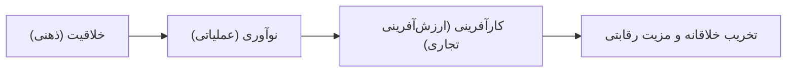

# فصل سوم: خلاقیت، نوآوری و کارآفرینی (درسنامه جامع و خودآموز)

> [!abstract] شناسنامه کنکوری و نقشه تسلط فصل
> - **تعداد سؤال در کنکور ارشد و دکتری:** این مبحث سالانه ۱ تا ۲ تست در کنکور ارشد مدیریت و دکتری دارد و به دلیل نوسان کم و نکات شفاف، از بخش‌های ۱۰۰٪ امتیازآور کنکور است.
> - **تمرکز طراحان کنکور:** تفکیک مرز خلاقیت و نوآوری، ماتریس سنخ‌شناسی سازمان‌ها بر اساس خلاقیت و نوآوری، مراحل پنج‌گانه فراگرد خلاقیت (به‌ویژه خواب بر روی مسئله و جرقه ناگهانی)، شیوه‌های تفکر (تفکر سببی و قیاسی/استقرایی)، موانع سازمانی نوآوری در برابر موانع فردی خلاقیت، نقش‌های پنج‌گانه نوآور در سازمان، فنون خلاقیت (طوفان فکری، سینکتیکس، شش کلاه،)، یادگیری دوحلقه‌ای، و کارآفرینی شومپیتر.
> - **روش مطالعه:** این درسنامه با تلفیق خط‌به‌خط کتاب جامع جلیلیان و کتاب نظریه‌های سازمان سیدجوادین و به شیوه فاینمن نگاشته شده است تا داوطلب بدون نیاز به هیچ منبع دیگری، به عمق مفاهیم مسلط شود.

---

## فهرست سرفصل‌های جامع فصل سوم

1. **مفهوم‌شناسی و تعریف خلاقیت** (دیدگاه‌های فروم، فوکس، سیدل و رکن بنیادین خلاقیت)
2. **مرزبندی واژگانی:** تفاوت خلاقیت، نوآوری و تغییر
3. **ماتریس سنخ‌شناسی سازمان‌ها بر اساس میزان خلاقیت و نوآوری**
4. **موانع فردی و فرهنگی خلاقیت**
5. **موانع نوآوری و ماتریس سه‌گانه محرک‌های نوآوری سازمانی** (ساختاری، فرهنگی، منابع انسانی)
6. **نوآوری در سازمان‌های یادگیرنده و انواع نوآوری** (نوآوری در فراگرد در برابر نوآوری در محصول)
7. **فراگرد نوآوری در محصول و مفهوم کلیدی تأخر نوآوری**
8. **سازمان‌های نوآور و نقش‌های پنج‌گانه نوآوری**
9. **شناسنامه و ویژگی‌های شخصیتی، ذهنی و رفتاری افراد خلاق**
10. **شیوه‌های هفت‌گانه تفکر و ظهور اندیشه‌های نو** (خلاق، سببی/علّی، استقرایی، قیاسی، تمثیل، شهود، قضاوتی-تحلیلی)
11. **مراحل پنج‌گانه فراگرد خلاقیت** (آمادگی، نهفتگی، اصرار، بینش و بصیرت، رسیدگی و آزمون)
12. **دایره‌المعارف جامع فنون و تکنیک‌های ۳۳گانه خلاقیت و نوآوری** (طوفان فکری، سینکتیکس، شش کلاه،، گروه اسمی و...)
13. **نقش مدیران در پرورش توانمندی‌های خلاقیت و یادگیری سازمانی** (یادگیری تک‌حلقه‌ای و دوحلقه‌ای، آموزش‌های ده‌گانه، راهکارهای شش‌گانه سازمانی)
14. **کارآفرینی:** مفاهیم، تعاریف علوم مختلف، تخریب خلاقانه شومپیتر، مکاتب سه‌گانه، انواع کارآفرینی، زیرساخت‌های شش‌گانه و استعاره‌ها
15. **کپسول مرور سریع و ماتریس جمع‌بندی طلایی فصل سوم**
16. **نمونه تست‌های کالبدشکافی‌شده سراسری ارشد و دکتری با رد گزینه**
17. **پرسش‌های یادآوری فعال**

---

## ۱. مفهوم‌شناسی و تعریف خلاقیت (جلیلیان، ص ۱۱۹؛ سیدجوادین، ص ۱۵۰ و ۱۵۱)

همه دستاوردهای فرهنگی، ادبی، هنری، علمی، فلسفی، ابزارها و فناوری‌های مورد استفاده در جوامع بشری، برآمده از دو سرچشمه اصلی هستند: **خلاقیت** و **نوآوری**. تداوم حیات سازمان‌ها در محیط متلاطم و ناپایدار امروزی، به قدرت بازسازی و تطبیق آن‌ها وابسته است. سازمان‌هایی که فاقد این توانمندی باشند، به مرور از صحنه رقابت حذف می‌شوند.

### تعاریف برجسته صاحب‌نظران:
- **اریک فروم:** خلاقیت عبارت است از «توانایی دیدن (آگاه شدن) و پاسخ دادن».
- **هربرت فوکس:** «فراگرد تفکری که مسئله را به طور مفید و بدیع حل کند».
- **جرج سیدل:** «توانایی ربط دادن و وصل کردن موضوع‌ها، صرف‌نظر از این‌که در چه حوزه یا زمینه‌ای انجام گیرد؛ این امر از مبانی بهره‌گیری خلاق از ذهن به شمار می‌رود».
- **تعریف جامع و استاندارد کنکور:** به کارگیری توانایی‌های ذهنی برای ایجاد یک فکر، مفهوم یا پیوستگی جدید میان ایده‌ها.

> [!tip] رکن اصلی خلاقیت و نوآوری چیست؟ (شاه‌نکته تستی جلیلیان، ص ۱۱۹)
> **رکن اصلی خلاقیت و نوآوری، ذهن فرد است.** اندیشه‌های آفرینش‌گر و خلاق مستقیماً تابعی از «نیروی تخیل خلاق انسان» هستند و آنچه در ایجاد پدیده‌ها و مفاهیم نو اصالت دارد، **تفکر** است نه صرفاً ابزارهای فیزیکی.

---

## ۲. مرزبندی واژگانی: تفاوت خلاقیت، نوآوری و تغییر (جلیلیان، ص ۱۱۹ و ۱۲۰؛ سیدجوادین، ص ۱۵۱)

یکی از پربسامدترین تله‌های تستی کنکور، مخلوط کردن سه واژه «خلاقیت»، «نوآوری» و «تغییر» است:

1. **خلاقیت:** پیدایی، خلق و تولید یک اندیشه، طرح و فکر نو در ذهن. خلاقیت به قدرت ارائه ایده‌های تازه اشاره دارد و امری ذهنی و بالقوه است.
2. **نوآوری:** عملی ساختن، پیاده‌سازی و کاربردی کردن اندیشه نو؛ نظیر تبدیل ایده به یک محصول، خدمت، فرایند یا روش نوین اجرایی. خلاقیت بستر و پیش‌نیاز نوآوری است و نوآوری میوه ملموس خلاقیت است.
3. **تغییر:** ایجاد هر پدیده‌ای که با گذشته تفاوت داشته باشد (اعم از مثبت، منفی، ناشی از خلاقیت یا ناشی از اجبار محیطی).

> [!danger] دام تستی بسیار مهم (سیدجوادین، ص ۱۵۱)
> **«تمام نوآوری‌ها منعکس‌کننده یک تغییر هستند؛ اما تمام تغییرها الزاماً نوآوری نیستند!»** 
> طراحان کنکور معمولاً این عبارت را برعکس مطرح می‌کنند تا داوطلب را فریب دهند. همچنین **انطباق** به معنای «توانایی روبه‌رو شدن با شرایط احتمالی آینده به گونه‌ای که خلأیی در عملکرد ایجاد نشود» تعریف می‌شود.

---

## ۳. ماتریس سنخ‌شناسی سازمان‌ها بر اساس میزان خلاقیت و نوآوری (جلیلیان، ص ۱۲۰)

سازمان‌ها بر اساس تقاطع دو محور «میزان خلاقیت ذهنی» و «میزان توجه به توسعه و تغییر عملی (نوآوری)» به چهار دسته متمایز طبقه‌بندی می‌شوند:

| نوع سازمان | میزان خلاقیت ذهنی | میزان نوآوری عملی (توجه به تغییر) | ویژگی بارز سازمانی |
|:--- |:---: |:---: |:--- |
| **خلاق و نوآور** | بسیار زیاد | بسیار زیاد | سازمان ایده‌آل؛ ایده‌های دست‌اول خلق می‌کند و با چابکی آن‌ها را تجاری‌سازی می‌نماید. |
| **تقلیدکننده و نوآور** | کم / تقلیدکننده | بسیار زیاد | خود ایده تولید نمی‌کند، اما ایده‌های دیگران را سریعاً می‌گیرد، پیاده‌سازی کرده و به محصول تبدیل می‌کند (مانند شرکت‌های کپی‌بردار سریع). |
| **خلاق در امور نظری و نه عملی** | بسیار زیاد | بسیار کم | مخزن ایده‌ها و مقالات تئوریک درخشان؛ اما فاقد ساختار، توان یا اراده برای تبدیل این ایده‌ها به محصول و پول (مؤسسات تحقیقاتی ایزوله). |
| **محافظه‌کار و سنتی** | کم / تقلیدکننده | بسیار کم | سازمان‌های فسیل‌شده و راکد؛ در برابر هرگونه اندیشه نو مقاومت می‌کنند و محکوم به فنا هستند. |

---

## ۴. موانع خلاقیت فردی و فرهنگی (جلیلیان، ص ۱۲۰؛ سیدجوادین، ص ۱۵۰)

موانع خلاقیت در دو سطح فردی و فرهنگی/اجتماعی عمل می‌کنند:

### الف) موانع اصلی و فردی خلاقیت:
۱. **فقدان اعتماد به نفس:** خودکم‌بینی و باور نداشتن به توانمندی خلق ایده‌ها. 
۲. **ترس از انتقاد و شکست:** وحشت از تمسخر همکاران، نمره منفی مدیر یا اشتباه کردن. 
۳. **تمایل به هم‌رنگی با جماعت:** دنباله‌روی کورکورانه از هنجارهای تثبیت‌شده و ترس از متفاوت اندیشیدن. 
۴. **فقدان تمرکز ذهنی:** آشفتگی روانی، اضطراب و پراکندگی فکر.

### ب) موانع فرهنگی و اجتماعی:
- انجماد ذهنی ناشی از دانش گذشته فرد.
- فشار هنجاری گروه دوستان و گروه‌های مرجع غیررسمی.
- نهادها و ساختارهای سنتی که الگوهای رفتاری صلب را به فرد تحمیل می‌کنند.

---

## ۵. موانع نوآوری و ماتریس سه‌گانه محرک‌های سازمانی (جلیلیان، ص ۱۲۰؛ سیدجوادین، ص ۱۵۰)

اگر خلاقیت مانع فردی داشته باشد، نوآوری با موانع ساختاری و اداری در سازمان روبه‌رو است:

### هفت مانع اصلی نوآوری در سازمان (جلیلیان، ص ۱۲۰):
۱. محدود بودن راه‌های ارتباطی با مدیران عالی. 
۲. حاکمیت جو عدم تحمل اختلاف سلیقه و تفاوت دیدگاه. 
۳. حضور ذی‌نفعانی که حفظ منافعشان در گرو حفظ وضع موجود است. 
۴. تمرکز افراطی بر افق زمانی کوتاه‌مدت (کوته‌بینی سود سه‌ماهه). 
۵. تصمیم‌گیرندگان بیش از حد حسابگر و ریاضی‌زده که به ایده‌های شهودی فرصت نمی‌دهند. 
۶. اعطای پاداش‌های نامناسب که ریسک‌پذیری را جریمه و اطاعت بی‌چون‌وچرا را پاداش می‌دهد. 
۷. تأکید بیش از حد بر الزامات بوروکراتیک، آیین‌نامه‌ها و سلسله‌مراتب صلب.

### ماتریس سه‌گانه محرک‌های نوآوری در سازمان (جدول ۳-۱ جلیلیان):

| متغیرهای ساختاری | متغیرهای فرهنگی | متغیرهای منابع انسانی |
|:--- |:--- |:--- |
| • **ساختار ارگانیک** (انعطاف‌پذیر، غیرمتمرکز) | • **پذیرش ابهام** | • **تعهد بالا به آموزش و بهسازی کارکنان** |
| • **وفور منابع** (وجود ظرفیت مازاد و بودجه) | • **تحمل ایده‌های غیرعملی در گام اول** | • **امنیت شغلی بالا** (حذف ترس از اخراج) |
| • **ارتباط متقابل و گسترده میان واحدها** | • **تحمل ریسک و مخاطره‌پذیری** | • **جذب و حضور نیروهای خلاق** |
| | • **تحمل تضاد فکری سازنده** | |
| | • **کنترل بیرونی اندک** (آزادی عمل کارکنان) | |
| | • **تمرکز بر نتایج** به جای تمرکز بر روش‌ها | |

---

## ۶. نوآوری در سازمان‌های یادگیرنده و انواع نوآوری (جلیلیان، ص ۱۲۱)

سازمان‌های یادگیرنده مناسب‌ترین بستر برای عصر حاضر هستند؛ چراکه با بهره‌گیری از فضایل، هنرها و توانایی‌های افراد، از تجارب خود درس می‌آموزند و مستمراً ساختار و عملکرد خود را بهبود می‌بخشند.

در یک سازمان، نوآوری به دو صورت اصلی ظهور می‌یابد:
1. **نوآوری در فراگرد:** بهینه‌سازی، اصلاح و بازمهندسی روش‌ها و راه‌های انجام کار (مانند تحول در خط مونتاژ یا دیجیتالی کردن فرایند ثبت سفارش).
2. **نوآوری در محصول:** ارائه کالاها یا خدمات جدید، متفاوت و بهبودیافته به بازار.

---

## ۷. فراگرد نوآوری در محصول و مفهوم تأخر نوآوری (جلیلیان، ص ۱۲۱)

فراگرد نوآوری محصول شامل ۴ مرحله پیاپی است:
1. **ایجاد فکر جدید:** اکتشافات اساسی، بصیرت و خلاقیت ناگهانی.
2. **آزمایش‌های اولیه:** مباحثه با مشتریان، کارشناسان فنی و ارزیابی اولیه ایده.
3. **تعیین امکان‌پذیری:** مطالعات فنی، مالی و امکان‌سنجی اقتصادی ایده.
4. **کاربرد نهایی:** معرفی رسمی محصول نوآورانه، تولید انبوه، تبلیغ و تجاری‌سازی در بازار.

> [!important] مفهوم کلیدی تأخر نوآوری
> **تأخر نوآوری** یعنی «فاصله زمانی میان تبدیل یک ایده جدید به خواسته یا تقاضای برآورده‌شده مشتری در بازار». هر چه تأخر نوآوری طولانی‌تر باشد، مشتریان زمان بیشتری باید در صف انتظار بمانند و خطر سبقت رقبا افزایش می‌یابد.

---

## ۸. سازمان‌های نوآور و نقش‌های پنج‌گانه نوآوری (جلیلیان، ص ۱۲۱ و ۱۲۲؛ سیدجوادین، ص ۱۵۰)

تحقق نوآوری در سازمان نیازمند ایفای ۵ نقش کلیدی توسط افراد مختلف است:

1. **ایجادکننده فکر (ایده‌پرداز):** فردی که از طریق بینش درونی یا پویش محیطی، جرقه اولیه ایده نو را می‌زند.
2. **حفظ‌کننده اطلاعات (دروازه‌بان دانش):** نقش رابط را میان گروه‌های داخلی سازمان با منابع خارجی، دانشگاه‌ها و کانون‌های علمی ایفا می‌کند.
3. **قهرمان محصول:** فردی پرانرژی و مصر که عاشق ایده است، موانع اداری را دور می‌زند و تمام قد از ایده برای به ثمر رسیدن دفاع می‌کند.
4. **مدیر پروژه:** فردی با تخصص فنی و مدیریتی که وظیفه برنامه‌ریزی، زمان‌بندی و اجرای پروژه نوآوری را با تخصیص منابع بر عهده دارد.
5. **رهبر نوآوری (اسپانسر ارشد):** مدیر ارشدی که از ارزش‌ها و فرهنگ نوآوری در سطح کلان سازمان صیانت می‌کند، بودجه را تأمین کرده و چتر حمایتی خود را بر سر نیروهای نوآور می‌گسترد.

---

## ۹. ویژگی‌های افراد خلاق (جلیلیان، ص ۱۲۲؛ سیدجوادین، ص ۱۵۰، ۱۵۱ و ۱۵۲)

| شاخص | وضعیت و ویژگی‌های افراد خلاق |
|:--- |:--- |
| **دانش و مهارت** | سال‌های متمادی از وقت خود را صرف کسب دانش عمیق در زمینه مورد علاقه می‌کنند. |
| **تحصیلات رسمی** | تحصیلات لزوماً خلاقیت را زیاد نمی‌کند؛ تحصیلاتی که بر قالب‌های صلب و منطق خطی پافشاری دارند حتی می‌توانند مانع خلاقیت شوند. |
| **سطح هوش** | ضریب هوشی ماورایی لازم نیست؛ هوش متوسط رو به بالا (در حدود ۱۳۰) برای خلاقیت کامل کفایت می‌کند. |
| **توانایی‌های ذهنی** | حساسیت فوق‌العاده به مسائل، ارتباط سیال میان موضوعات، تفکر بر پایه تصاویر ذهنی (نه صرفاً کلمات)، و ادغام اطلاعات ناهمگن. |
| **سلاست و روانی ادراکی** | توانایی تولید سریع تعداد بسیار زیادی ایده برای یک مسئله. |
| **انعطاف‌پذیری ادراکی** | توانایی خروج از چارچوب‌ها و پذیرش قواعد دگرگون‌شده جدید. |
| **ابتکار عمل** | تمایل به پاسخ‌های نامتعارف و دست‌نخورده. |
| **ترجیح ابهام به سادگی** | جذب مسائل پیچیده، مبهم و معماگونه شدن به جای امور ساده و روتین. |
| **شخصیت و روانشناسی** | ریسک‌پذیر، باانگیزه درونی، صبور در برابر تنهایی، دارای اعتماد به نفس بالا، شوخ‌طبع، دارای مرکز کنترل درونی. |
| **تیپ رفتاری** | بیشتر دارای **رفتار تیپ A** (رقابت‌جو، بی‌تاب، عجول برای به ثمر رساندن کار و محاسبه‌گر). |
| **دوران کودکی** | تجربه رخدادهای گوناگون، نوسانات مالی و مشقت‌های خانوادگی که آن‌ها را آبدیده کرده است. |
| **عادت‌های اجتماعی** | بر خلاف تصور رایج، افراد خلاق منزوی و ضداجتماعی نیستند؛ بلکه مشتاقانه مایل به تبادل افکار با افراد هم‌فرکانس خود هستند. |

---

## ۱۰. شیوه‌های هفت‌گانه تفکر و ظهور اندیشه‌های نو (جلیلیان، ص ۱۲۲ و ۱۲۳؛ سیدجوادین، ص ۱۵۲ و ۱۵۳)

1. **تفکر خلاق:** تجسم ذهنی و وضوح‌بخشی که منشأ آن قوه تصور و تخیل آفریننده است.
2. **تفکر سببی یا علّی:** بررسی دقیق ریشه‌ها، روابط علت و معلولی و پیش‌بینی وقایع آینده بر مبنای تحلیل معکوس (از وضعیت ایده‌آل آینده به فعالیت‌های زمان حال).
3. **تفکر استقرایی (جزء به کل):** استنتاج قواعد و قوانین عام بر مبنای مشاهده نمونه‌ها و مصادیق جزئی.
4. **تفکر قیاسی (کل به جزء):** اعمال قوانین و احکام کلی بر مصادیق و موارد خاص؛ نتایج در این تفکر به صورت صریح به مصادیق نسبت داده می‌شوند.
5. **تمثیل و مدل‌سازی:** تسری دادن حکم یک پدیده جزئی به پدیده‌ای دیگر به دلیل شباهت میان ساختار آن دو.
6. **شهود و اشراق:** الهام و جهش‌های درونی ذهن بدون اتکا به براهین و استدلال‌های گام‌به‌گام منطقی.
7. **تفکر قضاوتی و تحلیلی:** حل مسئله بر پایه گردآوری داده‌های عینی، تعریف دقیق مسئله و تحلیل منطقی روابط.

---

## ۱۱. مراحل پنج‌گانه فراگرد خلاقیت (جلیلیان، ص ۱۲۳؛ سیدجوادین، ص ۱۵۳)

فراگرد خلاقیت یک جرقه تصادفی بدون پیش‌زمینه نیست، بلکه از پنج گام پیوسته گذر می‌کند:

1. **آمادگی:** تمرکز همه‌جانبه، گردآوری اطلاعات، مطالعه، آموزش و غوطه‌ور شدن در داده‌های مسئله.
2. **نهفتگی (خواب بر روی مسئله):** رها کردن موقت مسئله و توقف تلاش خودآگاه؛ در این مرحله **ضمیر ناخودآگاه** فعال شده و به دور از محدودیت‌های منطقی، اطلاعات را در زوایای نامتعارف بازترکیب می‌کند.
3. **اصرار و پافشاری:** پشتکار، مداومت و شجاعت برای غلبه بر خستگی و بن‌بست‌های موقت ذهنی.
4. **بینش و بصیرت (جرقه ناگهانی / لحظه ارشمیدسی):** تجلی ناگهانی و غیرمنتظره راه حل؛ لحظه‌ای که ایده در ذهن می‌درخشد.
5. **رسیدگی و تحقیق (آزمون و ارزیابی):** بررسی اعتبارسنجی، تحلیل هزینه-فایده، تست امکان‌سنجی و محک زدن ایده در بوته عمل جهت اجتناب از خطاهای پرهزینه.

---

## ۱۲. دایره‌المعارف جامع فنون و تکنیک‌های خلاقیت و نوآوری (جلیلیان، ص ۱۲۴ تا ۱۲۶؛ سیدجوادین، ص ۱۵۴ تا ۱۵۹)

طراحان کنکور ارشد و دکتری مدیریت علاقه ویژه‌ای به تکنیک‌های خلاقیت، بنیان‌گذاران و ویژگی‌های متمایزکننده آن‌ها دارند. در ادامه تمامی این فنون بر اساس تطبیق دو مرجع کالبدشکافی شده‌اند:

### ۱. یادداشت‌برداری (فیش‌نویسی فوری)
- **منطق:** افکار نو و جرقه‌های ذهنی فرار هستند؛ بهترین زمان به دام انداختن فکر، همان لحظه بروز آن در دفترچه یادداشت یا فیش‌های کوچک است.

### ۲ و ۳. انتخاب زمان و مکان مناسب اندیشیدن
- تطبیق زمان تفکر با ریتم زیستی و ساعات اوج کارایی فرد، و انتخاب مکانی آرام و عاری از عوامل بازدارنده.

### ۴. تقویت حس کنجکاوی و فنون سوالات ایده‌برانگیز (الکس اسبورن /)
الکس اسبورن برای تحریک کنجکاوی، پرسش‌های هفت‌گانه‌ای را طرح کرد:
- **جانشین ساختن:** آیا می‌توان ماده یا روش دیگری را جایگزین کرد؟
- **ترکیب:** پیوند زدن دو خدمت یا محصول با هم.
- **تطبیق و سازگارسازی:** الهام از ایده دیگران و بومی‌سازی آن.
- **تغییر یا بزرگ‌سازی/کوچک‌سازی:** افزودن قابلیت‌ها یا کاهش اندازه.
- **کاربردهای دیگر:** مصرف یک وسیله در حوزه‌ای کاملاً نو.
- **حذف و کاهش:** ساده‌سازی رادیکال و حذف زوائد.
- **معکوس‌سازی و بازآرایی:** وارونه کردن ترتیب فرایندها.

### ۵. تداعی معانی و ارتباط بین افکار
- پل زدن میان مفاهیم ذهنی به کمک شباهت‌ها و پیوندهای معنایی موجود.

### ۶. تحلیل شبکه یا ارتباط اجباری
- ایجاد پیوند صوری و اجباری میان دو شیء، پدیده یا فکر کاملاً نامرتبط و ناهمگون تا ذهن مجبور به کشف کاربردی مشترک و بدیع گردد.

### ۷. طوفان فکری / هم‌اندیشی مستقیم / تحرک مغزی
ابداع‌شده توسط **الکس اسبورن** در تبلیغات؛ ۵ اصل طلایی حاکم بر جلسات طوفان فکری عبارتند از:
1. **تمرکز بر کمیت ایده‌ها:** هر چه تعداد ایده‌ها بیشتر باشد، احتمال یافتن ایده درخشان بیشتر است.
2. **ممنوعیت مطلق هرگونه انتقاد و ارزیابی:** هیچ‌کس حق ندارد ایده‌ای را نقد یا مسخره کند.
3. **استقبال از ایده‌های نامتعارف و تخیلی:** ایده‌های جسورانه و عجیب ترجیح داده می‌شوند.
4. **تلفیق و بهبود ایده‌ها:** اعضا تشویق می‌شوند ایده‌های یکدیگر را ارتقا داده یا ترکیب کنند.
5. **تعویق داوری به بعد از جلسه:** گزینش و پالایش ایده‌ها به مرحله بعد موکول می‌شود.

### ۸. ریخت‌شناسی یا تجزیه و تحلیل مورفولوژیک
- بررسی ابعاد ساختاری و ریخت پدیده، تهیه فهرستی از تمام متغیرها، قطعات و ویژگی‌های ظاهری و ترکیب سیستماتیک ابعاد برای خلق حالات نو.

### ۹. سینکتیکس / فن گوردون / تلفیق نامتجانس‌ها (ویلیام گوردون)
ویلیام گوردون در سال ۱۹۶۱ این فن را پایه‌گذاری کرد؛ تفاوت‌های بنیادی با طوفان فکری:
- **پنهان بودن مسئله واقعی:** اعضای گروه از صورت مسئله واقعی بی‌خبرند و فقط **رهبر جلسه** مسئله واقعی را می‌داند.
- **گردش تخیلی و استعاره‌ای:** رهبر مفاهیم تمثیلی و استعاره‌ای کلی را مطرح می‌کند تا ذهن اعضا دچار سوگیری و چارچوب‌های شناختی محدودکننده نشود. جلسات طولانی‌تر و عمیق‌تر از طوفان فکری است.

### ۱۰. تکنیک گروه اسمی و فن ۵-۳-۶
- افراد در یک اتاق کنار هم می‌نشینند اما مستقلاً و در سکوت ایده‌های خود را روی کارت می‌نویسند.
- **تکنیک ۵-۳-۶:** ۶ نفر حضور دارند، هر فرد ۳ ایده می‌نویسد، و کارت‌ها ۵ بار میان اعضا دست‌به‌دست می‌شود تا ایده‌ها بدون ترس از انتقاد و با حداقل ضایعه گروهی غنی شوند.

### ۱۱. الگوبرداری از طبیعت (بیونیک / سایبرنتیک)
- شبیه‌سازی ساختارهای حیاتی و رفتاری جانداران و گیاهان برای حل مسائل صنعتی، مدیریتی و هوش مصنوعی.

### ۱۲. تفکر موازی و مانع‌شکنی ذهنی (ادوارد دوبونو)
- فرار از الگوهای تفکر خطی و سنتی؛ شامل سه رویکرد:
 - **واسطه غیرممکن:** استفاده از یک ایده غیرممکن و خیالی به عنوان پلی برای جهش به یک ایده ممکن و نوآورانه.
 - **پیوند تصادفی:** آوردن یک واژه یا مفهوم تصادفی (مثلاً از لغت‌نامه یا دیوان حافظ) و پیوند زدن آن با مسئله.
 - **تغییر نگرش:** وارونه‌سازی و نگاه به مسئله از زاویه‌ای نامتعارف.

### ۱۳. فن شش کلاه فکری (ادوارد دوبونو)
هر کلاه نماد یک سبک تفکر اختصاصی است تا اعضا به صورت هم‌زمان و تفکیک‌شده از آن زاویه بنگرند:
- ⚪ **کلاه سفید:** واقعیت‌ها، داده‌ها و اطلاعات بی‌طرف بدون هرگونه قضاوت یا پیش‌داوری.
- 🔴 **کلاه سرخ:** احساسات، عواطف، هیجانات و شهود درونی بدون نیاز به استدلال و توجیه.
- ⚫ **کلاه سیاه:** بدبینی، دیدن خطرات، موانع، ریسک‌ها و جنبه‌های منفی (کلاه احتیاط و ارزیابی واقع‌بینانه).
- 🟡 **کلاه زرد:** خوش‌بینی، ارزش‌ها، مزایا، فرصت‌ها و منافع بالقوه ایده.
- 🟢 **کلاه سبز:** خلاقیت، زایش اندیشه‌های نو، تغییر و ارائه راه حل‌های جایگزین.
- 🔵 **کلاه آبی:** نظارت، مدیریت فرایند، سازماندهی و کنترل کلی جلسه تفکر.

### ۱۴. فن چرا؟
- طرح مکرر چرایی‌ها تا رسیدن به ریشه بنیادین مسئله و ایجاد بینش عمیق.

### ۱۵. نقشه‌های روند
- ترسیم سیر تحول تاریخی و مسیر آینده متغیرهای رقبا، قیمت، کیفیت و بازار روی نقشه جهت درک موقعیت استراتژیک.

### ۱۶. تکنیک P.P.C (احتمالات، نکات مثبت و نگرانی‌ها)
- برخورد با ایده دیگران با این رویکرد: ابتدا نکات مثبت و احتمالات کاربردی را می‌سنجند، سپس نگرانی‌ها را در قالب «من نگرانم که... آیا می‌توان آن را رفع کرد؟» مطرح می‌کنند.

### ۱۷. درنگ خلاق
- متوقف کردن موقت و ارادی کار در مقاطعی که به ظاهر مشکلی وجود ندارد، با هدف کشف فرصت‌های پنهان نوآوری در روال‌های عادی.

### ۱۸. ایفای نقش
- قرار گرفتن در قالب نقش مشتری، رقیب یا سهامدار جهت بازخوردگیری چندبعدی.

### ۱۹. فهرست خصوصیات رابرت کرافورد
- لیست کردن تمام ویژگی‌های شیء (رنگ، جنس، اندازه، شکل) و ارتقای تک‌تک آن‌ها.

### ۲۰. تکنیک پی.ام.آی ادوارد دوبونو
- بررسی هم‌زمان سه ستون: جنبه‌های مثبت، جنبه‌های منفی، و جنبه‌های جالب/تأمل‌برانگیز.

### ۲۱. تکنیک DoIT
دارای چهار گام استاندارد:
1. **D:** تعریف دقیق و جزءبه‌جزء مسئله در قالب عبارات شفاف.
2. **O:** باز کردن ذهن با طرح ایده‌های مسخره و تحریک‌آمیز و گسترش شقوق مختلف.
3. **I:** شناسایی بهترین راه حل‌ها و تدبیر برای تقویت نقاط ضعف.
4. **T:** تبدیل ایده برگزیده به عمل و برنامه اقدام.

### ۲۲. تکنیک چه می‌شود اگر...؟
- گسترش افق‌های ذهنی از طریق فرضیه‌سازی سناریوهای نامحتمل.

### ۲۳. درهم شکستن مفروضات
- به چالش کشیدن مسلمات و بدیهیاتی که ذهن سازمان سال‌هاست آن‌ها را قطعی فرض کرده است.

### ۲۴. وارونه‌سازی مسئله و مدل چارلز تامپسون
- معکوس کردن زوایای مسئله بر اساس هفت گام تامپسون (برعکس نوشتن مشکل، جستجوی ناکرده‌ها، بررسی امور ناموجود، استفاده از معکوس چه می‌شود اگر، تغییر زاویه دید، معکوس کردن نتایج، و تبدیل موقعیت‌ها به شکست‌ها و بالعکس).

### ۲۵. نقشه‌های ذهنی تونی بوزان
- ترسیم شعاعی مفاهیم به شکل درختی در مرکز صفحه با نمادها، کلمات کلیدی و شاخه‌های گرافیکی برای تسهیل تفکر شهودی مغز.

### ۲۶. تکنیک شقوق مختلف (A.P.C)
ادوارد دوبونو این فن را با نام Alternatives, Possibilities, Choices مطرح کرد:
- اگر برای انجام کاری دو راه وجود دارد، حتماً باید به دنبال راه سوم گشت.
- **سه راهکار کشف شقوق مختلف:**
 1. **ایجاد مانع:** تصور کنیم راه فعلی مسدود شده تا ذهن مجبور به یافتن راه نو شود («عدو شود سبب خیر اگر خدا خواهد»).
 2. **فرار:** فرار ارادی از ایده‌های مسلط و حاکم بر محیط.
 3. **صرف‌نظر کردن:** چشم‌پوشی از راه حل‌های قبلی برای کشف راه‌های جدید.

### ۲۷. تکنیک رسم علائم و خط‌خطی کردن
- شکار ایده‌های فرار به کمک رسم نشانه‌ها، علائم هندسی و طرح‌های بصری روی کاغذ در لحظه جرقه ذهنی. تفاوت اصلی افراد خلاق در «مهارت شکار ایده» است نه صرفاً خلق آن.

### ۲۸. تکنیک ارتباط آزاد
- اتصال آزاد (پیوند میان موضوعات غیرمرتبط) در برابر اتصال معمولی (پیوند میان موضوعات مشابه). شعار این فن: «بزرگ‌ترین اختراع قرن نوزدهم، اختراع روش اختراع کردن بوده است».

### ۲۹. تکنیک واژه تصادفی
- انتخاب تصادفی یک لغت از فرهنگ لغت یا اشیای اطراف و ایجاد پیوند اجباری میان آن و صورت مسئله.

---

## ۱۳. نقش مدیران در پرورش توانمندی‌های خلاقیت و یادگیری سازمانی (سیدجوادین، ص ۱۶۲ تا ۱۶۴)

### الف) ترویج یادگیری دوحلقه‌ای در برابر تک‌حلقه‌ای (کریس آرجریس)
مدیران برای پرورش خلاقیت باید سازمان را از یادگیری تک‌حلقه‌ای به سمت یادگیری دوحلقه‌ای سوق دهند:
- **یادگیری تک‌حلقه‌ای:** سیستم عملکرد خود را صرفاً با برنامه‌ها و استانداردهای تعیین‌شده تطبیق می‌دهد و در صورت بروز انحراف، اقدام اصلاحی انجام می‌دهد (مانند عملکرد ترموستات که بدون تغییر درجه تنظیم‌شده، دما را حفظ می‌کند). در این حالت، «مفروضات و درستی خود اهداف» هرگز زیر سؤال نمی‌روند.
- **یادگیری دوحلقه‌ای:** سیستم علاوه بر اصلاح انحرافات، به نقد و ارزیابی عمیق خود برنامه‌ها، ارزش‌ها، فرضیات و استانداردهای زیربنایی می‌پردازد و درستی اهداف را به چالش می‌کشد. خلاقیت اصیل و رادیکال محصول یادگیری دوحلقه‌ای است.

### ب) آموزش‌های ده‌گانه مدیران به کارکنان جهت پرورش خلاقیت (سیدجوادین، ص ۱۶۳):
۱. **تحمل مخاطره:** تشویق کارکنان به اجرای برنامه‌ها و تلقی اشتباهات به عنوان فرصت‌های یادگیری. 
۲. **کاهش کنترل‌های درونی:** کاستن از قوانین دست‌وپاگیر، بوروکراسی و بخشنامه‌های صلب. 
۳. **کاهش تقسیم کار افراطی:** پرهیز از خرد کردن مکانیکی مشاغل تا کارها متنوع و انگیزه‌بخش بمانند. 
۴. **قبول ابهام:** دوری از وسواس عینی و شفاف بودن همه‌چیز در مراحل اولیه زایش فکر. 
۵. **تحمل راه‌های غیرعملی:** درک این واقعیت که راه‌های خلاق در ابتدا غیرعملی به نظر می‌رسند. 
۶. **تحمل تضاد فکری:** تشویق تنوع دیدگاه‌ها و آراء متضاد سازنده. 
۷. **تمرکز بر نتایج تا ابزارها:** سنجش کارکنان بر اساس دستاوردها نه روش‌های کلیشه‌ای. 
۸. **برقراری ارتباطات همه‌جانبه:** تسهیل کانال‌های ارتباطی افقی، عمودی و مورب در سازمان. 
۹. **ایجاد نظام مشارکت‌جو:** پاداش‌دهی مستمر به ایده‌پردازی و مشارکت ذهنی پرسنل. 
۱۰. **گسترش گروه‌های کاری چندرشته‌ای:** آمیختن تخصص‌های گوناگون در تیم‌های حل مسئله.

### ج) راه‌های شش‌گانه سازمانی برای تسهیل خلاقیت و نوآوری (سیدجوادین، ص ۱۶۴):
۱. **ساختار انعطاف‌پذیر:** حاکمیت ساختار ارگانیک و غیرمتمرکز. 
۲. **تشویق نظام‌مند:** تدوین سیاست‌ها و استراتژی‌های حمایتی مکتوب از نوآوران. 
۳. **فضای فرهنگی خلاق:** باور قلبی مدیران ارشد به ضرورت نوآوری و شنیدن ایده‌های همه سطوح. 
۴. **ایجاد واحد مخصوص خلاقیت:** راه‌اندازی مراکز رسمی تحقیق و توسعه (R&D). 
۵. **تخصیص زمان برای خلاقیت:** اختصاص ساعت‌های آزاد روزانه/هفتگی به کارکنان برای تدبیر در آینده (مشابه قاعده ۲۰٪ زمان آزاد شرکت گوگل). 
۶. **برقراری سیستم پیشنهادات (دیدگاه کونو):** دریافت ایده‌ها، ارزیابی با حفظ شأن پیشنهاددهنده و پرداخت پاداش‌های درخور.

---

## ۱۴. کارآفرینی: مفاهیم، مکاتب، انواع و زیرساخت‌ها (جلیلیان، ص ۱۲۷ تا ۱۲۹)

### الف) مفهوم‌شناسی کارآفرینی
- **تعریف استاندارد:** «فراگرد شکار فرصت‌ها توسط افراد (انفرادی یا درون‌سازمانی)، بدون در نظر گرفتن منابع موجود در اختیار آن‌ها». کارآفرین محدودیت منابع فعلی را مانع خود نمی‌بیند.
- **دیدگاه پیتر دراکر:** کارآفرینی یعنی «اقدامی نوآورانه که با بهره‌گیری از منابع موجود، ظرفیت جدیدی برای تولید ثروت ایجاد می‌نماید».
- **دیدگاه ژوزف شومپیتر (پدر کارآفرینی):** موتور محرک توسعه اقتصادی، **«تخریب خلاقانه»** است؛ یعنی برهم زدن تعادل ایستا و سنتی بازار از طریق خلق «ترکیبات جدید».

> [!tip] ترکیبات پنج‌گانه جدید شومپیتر (شاه‌کلید تستی کنکور)
> ۱. معرفی یک کالای جدید یا ارتقای کیفیت کالای موجود. 
> ۲. به‌کارگیری یک روش نوین تولیدی. 
> ۳. گشایش یک بازار جدید و دست‌نخورده. 
> ۴. تسخیر و دست‌یابی به منابع جدید مواد اولیه یا قطعات. 
> ۵. نوسازی ساختاری یا ایجاد تشکیلات انحصاری نوین در یک صنعت.

### ب) تعاریف کارآفرین در علوم مختلف:
- **اقتصاددانان:** عامل پیوند و ترکیب عوامل تولید (زمین، کار، سرمایه) و شکارچی فرصت‌های سرمایه‌گذاری سودآور.
- **جامعه‌شناسان:** عاملان حساس نوسازی جوامع و شکستن ساختارهای کهنه سنتی.
- **روان‌شناسان:** فردی با انگیزه پیشرفت بالا (نیاز به توفیق مک‌کللند)، استقلال‌طلب، مخاطره‌پذیر و با مرکز کنترل درونی.
- **دانشمندان علوم سیاسی:** افراد بدون چشم‌داشت سیاسی که دولت‌ها باید زمینه را برای فعالیت آزادانه آن‌ها فراهم کنند.

### ج) مکاتب سه‌گانه کارآفرینی (جدول ۳-۳ جلیلیان):
1. **مکتب انسانی (کارآفرین‌محور):** کارآفرینی را تابعی از ویژگی‌های شخصیتی، نیازها و انگیزه‌های درونی فرد می‌داند.
2. **مکتب محیطی:** معتقد است کارآفرینی بدون وجود محیط سالم اقتصادی، حقوقی، سیاسی و فناوری امکان‌پذیر نیست.
3. **مکتب ریسکی (تلفیقی):** کارآفرینی را محصول تلاقی هم‌زمان صفات فردی، ایده مخاطره‌آمیز و نیروهای محیطی می‌داند.

### د) انواع کارآفرینی:
- **کارآفرینی مستقل:** تأسیس کسب‌وکار مستقل در قالب خوداشتغالی فردی یا خلق شرکتی نوین در بازار آزاد.
- **کارآفرینی سازمانی:** فرآیند پرورش رفتارهای کارآفرینانه و ایجاد نوآوری در **درون مرزهای یک سازمان موجود**؛ به طوری که استعدادهای خلاق مدیران و کارکنان برای خلق محصولات و خطوط تجاری نو در خدمت سازمان به کار گرفته شود.

### هـ) عوامل مؤثر بر کارآفرینی (مدل والستاد و کوریلسکی):
شامل چهار عنصر: ۱) دیدگاه جامعه به کسب‌وکارهای کوچک، ۲) نگرش عمومی به راه‌اندازی کارآفرینانه، ۳) قوانین دولتی و نظام مالیاتی، ۴) دانش و آموزش‌های کارآفرینی. 
*مهم‌ترین انگیزه فردی کارآفرینان در راه‌اندازی کسب‌وکار:* **«رئیس خود بودن»** و استقلال فردی است.

### و) ماتریس زیرساخت‌های شش‌گانه مناسب برای توسعه کارآفرینی (جدول ۳-۴ جلیلیان):

| نوع زیرساخت | وضعیت کارآفرینانه | وضعیت غیرکارآفرینانه (سنتی) |
|:--- |:--- |:--- |
| **ساختار اقتصادی** | سازمان‌های آزاد و بازار رقابتی | برنامه‌ریزی متمرکز دولتی |
| **ساختار سیاسی** | نظام دموکراسی و تکثرگرا | مستبدانه و دیکتاتوری |
| **ساختار قانونی** | مسئولیت محدود شرکت‌ها | مسئولیت نامحدود شرکا |
| **ساختار مالی** | نامتمرکز، منعطف و رقابتی | متمرکز و محافظه‌کارانه |
| **ساختار تدارکاتی** | شبکه‌های زنجیره تأمین توسعه‌یافته | شبکه‌های توسعه‌نیافته و سنتی |
| **ساختار اجتماعی** | فردگرایی مثبت و ارزش‌گذاری به موفقیت فردی | نهادی، جمع‌گرایی صلب و قبیله‌ای |

### ز) استعاره‌های پنج‌گانه کارآفرینان (جلیلیان، ص ۱۲۹):
- **تسهیل‌گر اجتماعی:** اتصال منابع سرگردان مالی و انسانی و حرکت‌بخشی به جامعه.
- **ورزشکار المپیک:** رکوردشکنی و دستیابی به قله‌هایی که دیگران ناممکن می‌پنداشتند.
- **رهبر ارکستر سمفونیک:** هماهنگ‌سازی موزون منابع انسانی، فناوری و سرمایه برای خلق ارزش.
- **خلبان هواپیمای جنگی:** تصمیم‌گیری در شرایط سرعت بالا، تلاطم محیطی و مانورهای پرریسک.
- **غزال تیزپا:** چابکی، واکنش فوق‌العاده سریع به فرصت‌ها و فرار از دام لختی و چاقی سازمانی.

---

## ۱۵. کپسول مرور سریع و ماتریس جمع‌بندی طلایی فصل سوم

| مفهوم / نظریه‌پرداز | شاه‌کلید تستی | دام انحرافی طراح کنکور |
|:--- |:--- |:--- |
| **الکس اسبورن** | طوفان فکری و تکنیک پرسش‌های SCAMPER | طراح ممکن است طوفان فکری را به گوردون نسبت دهد. |
| **ویلیام گوردون** | سینکتیکس و تلفیق نامتجانس‌ها با گردش تخیلی | پنهان بودن مسئله واقعی از اعضا و اطلاع داشتن انحصاری رهبر جلسه. |
| **ادوارد دوبونو** | تفکر موازی، شش کلاه فکری، تکنیک PMI و تکنیک APC | کلاه سفید (داده بی‌طرف)، سرخ (هیجان)، سیاه (نقد منفی)، زرد (امیدوار)، سبز (خلاق)، آبی (کنترل فرایند). |
| **کریس آرجریس** | یادگیری تک‌حلقه‌ای (اصلاح روال‌ها) در برابر دوحلقه‌ای (نقد ارزش‌ها و اهداف) | یادگیری دوحلقه‌ای پیش‌نیاز اصلی نوآوری رادیکال سازمانی است. |
| **ژوزف شومپیتر** | تخریب خلاقانه و پنج ترکیب نوین | کارآفرین تعادل موجود بازار را برهم می‌زند نه اینکه صرفاً آن را حفظ کند. |
| **پیتر دراکر** | کارآفرینی به مثابه بهره‌گیری از منابع برای خلق ظرفیت نوین ثروت | نادیده گرفتن محدودیت منابع موجود ویژگی لاینفک کارآفرین است. |

---

## ۱۶. نمونه تست‌های کالبدشکافی‌شده سراسری ارشد و دکتری با رد گزینه

> [!example] تست ۱ (کنکور کارشناسی ارشد مدیریت)
> **صورت سوال:** در کدام‌یک از فنون خلاقیت، اعضای جلسه از ماهیت واقعی و اصلی مسئله بی‌خبرند و صرفاً پیرامون مفاهیم استعاره‌ای و تمثیلی کلی به بحث می‌پردازند؟ 
> ۱) طوفان فکری 
> ۲) فن گوردون (سینکتیکس) 
> ۳) تکنیک دلفی 
> ۴) گروه اسمی 
> 
> **گزینه صحیح: ۲** 
> **کالبدشکافی تله طراح و رد گزینه‌ها:** 
> - در طوفان فکری (گزینه ۱)، صورت مسئله صریحاً و با جزئیات در ابتدای جلسه به همه گفته می‌شود تا ذهن‌ها سریعاً واکنش نشان دهند. 
> - در تکنیک دلفی (گزینه ۳) و گروه اسمی (گزینه ۴)، مسئله کاملاً شفاف و کتبی در اختیار اعضا قرار می‌گیرد. 
> - تنها در **فن گوردون / سینکتیکس** (گزینه ۲) است که برای فرار از الگوهای فکری بسته، صورت مسئله اصلی پنهان نگاه داشته شده و فقط رهبر گروه از آن مطلع است.

> [!example] تست ۲ (کنکور کارشناسی ارشد مدیریت)
> **صورت سوال:** بر اساس مدل شش کلاه فکری ادوارد دوبونو، کلاهی که نماد ارزیابی منفی، خطرات، موانع و احتیاط است و کلاهی که به هدایت و کنترل کلی جلسه تفکر اختصاص دارد، به ترتیب کدامند؟ 
> ۱) کلاه سیاه - کلاه آبی 
> ۲) کلاه سفید - کلاه زرد 
> ۳) کلاه سیاه - کلاه سبز 
> ۴) کلاه سرخ - کلاه آبی 
> 
> **گزینه صحیح: ۱** 
> **تحلیل و رد گزینه:** 
> - کلاه سیاه نماد بدبینی عقلانی، ریسک‌ها و خطرات است. 
> - کلاه آبی نماد آسمان و فراگیر بودن است که وظیفه مدیریت فرایند، جمع‌بندی و نظارت بر رعایت قواعد تفکر را دارد (گزینه ۱).

---

## ۱۷. پرسش‌های یادآوری فعال (برای تثبیت ذهنی)

<b>۱. چرا تمام نوآوری‌ها یک تغییر هستند اما تمام تغییرها نوآوری نیستند؟</b>

چون تغییر هرگونه دگرگونی نسبت به گذشته است (حتی بازگشت به روش قدیمی یا پس‌رفت)؛ اما نوآوری منحصراً تغییری است که مبتنی بر ایده‌ای نو و به قصد بهبود و خلق ارزش انجام گرفته باشد.

<b>۲. تفاوت اساسی طوفان فکری اسبورن با سینکتیکس گوردون در چیست؟</b>

در طوفان فکری صورت مسئله از همان ابتدا شفاف و برای همه اعضا بیان می‌شود؛ اما در سینکتیکس صورت مسئله واقعی از اعضا پنهان نگه داشته می‌شود و فقط رهبر جلسه آن را می‌داند تا مانع از انجماد فکری افراد در چارچوب‌های معمول شود.

<b>۳. فرق یادگیری تک‌حلقه‌ای و دوحلقه‌ای در رابطه با خلاقیت سازمانی چیست؟</b>

یادگیری تک‌حلقه‌ای فقط ابزارها و روش‌ها را بدون دست زدن به اهداف اصلاح می‌کند (ترموستات)؛ اما یادگیری دوحلقه‌ای ارزش‌ها، فرضیات و اصل اهداف سیستم را به چالش می‌کشد که زیربنای خلاقیت و دگرگونی بنیادین در سازمان است.

<b>۴. مفهوم «تأخر نوآوری» چیست و چرا برای مدیران خطرناک است؟</b>

فاصله زمانی میان شکل‌گیری یک ایده نو تا زمان تبدیل آن به محصول و ارضای تقاضای واقعی مشتری در بازار است. هر چه این زمان طولانی‌تر باشد، احتمال سبقت رقبا و بی‌اثر شدن ایده بیشتر می‌شود.

---

> [!done] پایان درسنامه فصل سوم: خلاقیت، نوآوری و کارآفرینی
> با مطالعه این درسنامه یکپارچه، ۱۰۰٪ مباحث منابع مرجع سیدجوادین و جلیلیان را فراگرفته‌اید. 
> 🔗 **گام بعدی:** ورود به **[[04-فصل ۴ - برنامه ریزی/04-فصل چهارم - برنامه ریزی|فصل چهارم: برنامه‌ریزی در سازمان]]**

