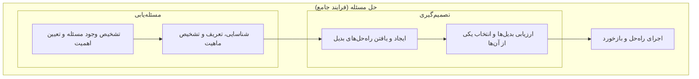
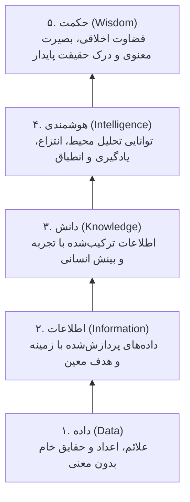

# فصل تصمیم‌گیری و حل مسئله (درسنامه جامع و خودآموز)

> [!abstract] شناسنامه کنکوری و نقشه تسلط فصل
> - **جایگاه در سرفصل‌ها:** این مبحث در کتاب مرجع جلیلیان تحت عنوان «فصل ۴: تصمیم‌گیری و حل مسئله» و در دسته‌بندی موضوعی کنکور تحت عنوان «فصل ۵: تصمیم‌گیری» قرار دارد.
> - **تعداد سؤال در کنکور ارشد و دکتری:** این مبحث سالانه ۱ تا ۲ تست قطعی در کنکور ارشد مدیریت و دکتری دارد و درک دقیق تمایز میان اصطلاحات، تضمین‌کننده ۱۰۰٪ نمره این بخش است.
> - **تمرکز طراحان کنکور:** تفکیک سلسله‌مراتبی فراگرد «مسئله‌یابی، انتخاب، تصمیم‌گیری و حل مسئله» (نمودار جرج هوبز)، تفاوت شرایط اطمینان، ریسک و عدم اطمینان، ماتریس تصمیمات برنامه‌ریزی‌شده و نشده (جدول هربرت سایمون)، تکنیک‌های ماکسیمکس، ماکسیمین و لاپلاس، و تمایز عوارض از ریشه مسائل.
> - **روش مطالعه:** این درسنامه با تطبیق خط‌به‌خط کتاب جامع جلیلیان و کتاب نظریه‌های سازمان سیدجوادین تدوین شده است تا داوطلب به شیوه فاینمن به عمق مفاهیم مسلط شود.

---

## فهرست سرفصل‌های درسنامه (پارت اول: مبانی، فراگردها و سنخ‌شناسی‌ها)

1. **اهمیت راهبردی تصمیم‌گیری و تعریف هربرت سایمون**
2. **کالبدشکافی مرزهای واژگانی بر پایه مدل جرج هوبز:** مسئله‌یابی، انتخاب، تصمیم‌گیری و حل مسئله
3. **فراگرد و روش‌های مسئله‌یابی سازمانی** (مسئله‌یابی رسمی مستقیم و غیرمستقیم، و غیررسمی)
4. **دام‌ها و چالش‌های تعریف مسئله** (مسائل ادراکی، تعریف توأم با راه‌حل، و خطای تشخیص عوارض به جای ریشه‌ها)
5. **سبک‌های سه‌گانه مدیران در مواجهه با مسائل** (مسئله‌گریزی، مسئله‌گشایی، مسئله‌جویی)
6. **طبقه‌بندی‌های سه‌گانه تصمیم‌ها در سازمان:**
 - الف) از نظر میزان اطمینان به نتایج (اطمینان، ریسک/مخاطره، عدم اطمینان و قواعد ماکسیمکس، ماکسیمین و ارزش مورد انتظار)
 - ب) از نظر مراحل زمانی (ایستا/تک‌مرحله‌ای در برابر پویا/چندمرحله‌ای و درخت تصمیم)
 - ج) از نظر میزان ساختاریافتگی (برنامه‌ریزی‌شده در برابر برنامه‌ریزی‌نشده)
7. **ماتریس تطبیقی روش‌های سنتی و نوین تصمیم‌گیری** (دیدگاه هربرت سایمون)
8. **تثلیث بحران، مسئله و فرصت در دیدگاه پیتر دراکر**
9. **متغیرهای سه‌گانه حاکم بر تصمیم‌گیری سازمانی** (اطلاعات، محیط و رفتار)
10. **مدل به‌کارگیری روش‌های کمی مدیریت در تصمیم‌گیری**

---

## ۱. اهمیت راهبردی تصمیم‌گیری در مدیریت (جلیلیان، ص ۱۳۶؛ سیدجوادین، ص ۱۸۴)

کار اصلی مدیران، تصمیم‌گیری است. تصمیم‌گیری به عنوان **«جوهره تمامی فعالیت‌های مدیریت»** شناخته می‌شود و به تعبیر هربرت سایمون، می‌توان واژه «تصمیم‌گیری» را کاملاً **مترادف با مدیریت** دانست؛ زیرا تصمیم‌گیری جزئی جدایی‌ناپذیر از تمامی وظایف پنج‌گانه مدیریت (برنامه‌ریزی، سازماندهی، انگیزش، رهبری و کنترل) است. فرایند تصمیم‌گیری در کالبد سازمان، حکم «مغز یا مرکز سلسله‌اعصاب» را ایفا می‌کند.

---

## ۲. کالبدشکافی مرزهای واژگانی: مدل جرج هوبز (جلیلیان، ص ۱۳۶؛ سیدجوادین، ص ۱۸۴)

یکی از مهم‌ترین دام‌های تستی کنکور، یکسان پنداشتن مسئله‌یابی، انتخاب، تصمیم‌گیری و حل مسئله است. بر اساس مدل معروف **جرج هوبز**، این مفاهیم دارای تقدم و تأخر و شمول متفاوت هستند:



### تعاریف تفکیکی و مرزبندی‌های تستی:
1. **مسئله‌یابی:** فراگرد کشف، شناسایی، تعریف و اولویت‌بندی مسائل سازمان. نقطه آغاز کل فرایند است.
2. **انتخاب:** گزینش صِرف یک راهکار از میان چندین راهکار بدیل موجود. انتخاب، جزئی از فراگرد تصمیم‌گیری است.
3. **تصمیم‌گیری:** فراگردی گسترده‌تر از انتخاب که شامل «تولید و یافتن راه‌حل‌های بدیل + ارزیابی آن‌ها + انتخاب بهترین راهکار» است.
4. **حل مسئله:** جامع‌ترین مفهوم؛ شامل تمام فعالیت‌های شناسایی مسئله (مسئله‌یابی) + یافتن و گزینش راه حل (تصمیم‌گیری) + اجرای راه حل در عمل و اصلاح وضعیت نامطلوب.

> [!tip] رابطه شمول مفاهیم چهارگانه
> **حل مسئله > تصمیم‌گیری > انتخاب** 
> به بیان دیگر: انتخاب جزئی از تصمیم‌گیری است؛ و تصمیم‌گیری به همراه مسئله‌یابی و اجرا، اجزای تشکیل‌دهنده حل مسئله هستند.

---

## ۳. فراگرد و روش‌های مسئله‌یابی سازمانی (جلیلیان، ص ۱۳۷)

برای آگاهی از وجود مسائل در سازمان، از دو دسته روش رسمی و غیررسمی استفاده می‌شود:

### الف) روش‌های مسئله‌یابی رسمی:
1. **رویه مستقیم (تشخیص مستقیم توسط خود مدیر):** 
 - انحراف عملکرد از برنامه‌های مصوب. 
 - تغییر روندهای تاریخی گذشته. 
 - پیشی گرفتن رقبا در سهم بازار یا کیفیت.
2. **رویه غیرمستقیم (انتقال اطلاعات به مدیر توسط دیگران):** 
 - گزارش‌های کارکنان سازمان. 
 - تذکرات و هشدارهای مدیران مافوق. 
 - بازخوردهای ارباب‌رجوع یا مشتریان.

### ب) روش‌های مسئله‌یابی غیررسمی:
- اتکا به **بینش و شهود شخصی مدیران**. 
- جریان‌های اطلاعاتی در **مجاری ارتباطی غیررسمی** (شایعات، گپ‌های دوستانه در سازمان).

> [!important] شاخص‌های چهارگانه شناخت مسئله در سازمان (جلیلیان، ص ۱۳۷)
> ۱) انحراف از عملکرد گذشته، ۲) انحراف از برنامه مصوب، ۳) ادراکات و بازخوردهای ذی‌نفعان بیرونی (شکایت مشتریان، تذکر نهادهای دولتی، اعتراض سهامداران)، ۴) تهدیدات و اقدامات رقبا.

---

## ۴. چالش‌ها و خطاهای رایج در تعریف مسئله (جلیلیان، ص ۱۳۷)

بسیاری از تصمیمات نادرست مدیران نه به دلیل انتخاب راه حل بد، بلکه به دلیل تعریف غلط مسئله رخ می‌دهد. چالش‌های سه‌گانه عبارتند از:
1. **مسائل ادراکی:** تأثیر سوگیری‌های فردی، تعصبات و گزینش سلیقه‌ای اطلاعات توسط مدیر.
2. **تعریف مسئله توأم با راه حل:** جهش ناگهانی به سمت یک راه حل خاص قبل از فهم ریشه؛ مثلاً مدیر به جای ریشه‌یابی افت فروش بگوید: «مسئله ما کیفیت پایین بخش تولید است!» (در حالی که شاید علت ضعف تبلیغات باشد).
3. **اشتباه گرفتن عوارض به جای مسئله اصلی:** 
 عوارض صرفاً نشانه‌های ظاهری بروز اشکال هستند (مانند تب بیمار)؛ در حالی که مدیر باید به دنبال میکروب و ریشه بیماری باشد (مانند غیبت کارکنان که عارضه است، نه ریشه نارضایتی).

> [!quote] کلام ماندگار پیتر دراکر درباره اشتباهات مدیریتی (جلیلیان، ص ۱۳۷)
> «عمومی‌ترین و مخرب‌ترین منبع اشتباهات در تصمیمات مدیریت، **تأکید بر یافتن پاسخ‌های درست است به جای پرسیدن سؤال‌های درست!**»

---

## ۵. سبک‌های سه‌گانه مدیران در برخورد با مسائل (جلیلیان، ص ۱۳۸)

| سبک برخورد | رویکرد رفتاری مدیر | پیامد سازمانی |
|:--- |:--- |:--- |
| **مسئله‌گریزی** | انکار مسئله، انفعال و سرپوش گذاشتن بر مشکلات به منظور حفظ وضع موجود. | انباشت مشکلات و بحران‌های مکرر. |
| **مسئله‌گشایی** | مدیر منفعل است تا مسئله رخ دهد؛ سپس مانند آتش‌نشان سریعاً برای خاموش کردن آن وارد عمل می‌شود. | متداول‌ترین سبک؛ سازمان واکنشی اداره می‌شود. |
| **مسئله‌جویی** | فعالانه و پیشگیرانه به دنبال کشف مسائل قبل از وقوع می‌رود؛ پیش‌بینی تغییرات و تبدیل تهدید به فرصت. | پیشروترین سبک؛ سازمان پیش‌نگر و خلق مزیت رقابتی. |

---

## ۶. طبقه‌بندی‌های سه‌گانه تصمیم‌ها در سازمان (جلیلیان، ص ۱۳۸ و ۱۳۹؛ سیدجوادین، ص ۱۸۵ و ۱۸۶)

### الف) طبقه‌بندی از نظر میزان اطمینان به نتایج:
1. **تصمیم‌گیری تحت شرایط اطمینان کامل:** 
 مدیر از نتیجه هر راهکار کاملاً آگاه است؛ اطلاعات دقیق، کافی و موثق موجود است (احتمال وقوع = ۱).
2. **تصمیم‌گیری در شرایط ریسک یا مخاطره:** 
 نتایج قطعی نیستند، اما **توزیع احتمال وقوع هر یک از نتایج مشخص و معلوم است** (تکیه بر احتمالات آماری و تجارب گذشته).
3. **تصمیم‌گیری در شرایط عدم اطمینان:** 
 احتمال وقوع نتایج نامعلوم است و حتی تعداد نتایج ممکن نیز مبهم است. در این حالت سه استراتژی تصمیم‌گیری کلاسیک وجود دارد:
 - **شیوه ماکسیمکس (/ حداکثر حداکثرها):** استراتژی کاملاً **خوش‌بینانه**؛ مدیر بهترینِ بهترین‌ها را برمی‌گزیند.
 - **شیوه ماکسیمین (/ حداکثر حداقل‌ها):** استراتژی کاملاً **بدبینانه و محتاطانه**؛ مدیر بدترین نتایج هر گزینه را مشخص کرده و بهترینِ بدترین‌ها را انتخاب می‌کند تا کمترین آسیب را ببیند.
 - **شیوه ارزش مورد انتظار / لاپلاس (/ معیار برابری):** با فرض یکسان بودن احتمال تمامی سناریوها به دلیل فقدان اطلاعات، میانگین موزون محاسبه می‌شود.

### ب) طبقه‌بندی از نظر مراحل زمانی تصمیم‌گیری:
- **تصمیم‌های ایستا (تک‌مرحله‌ای):** اثر تصمیم فقط به نتایج فوری یک مرحله معطوف است.
- **تصمیم‌های پویا (چندمرحله‌ای و زنجیره‌ای):** اخذ هر تصمیم، بستر و شرایط تصمیم بعدی را رقم می‌زند. ابزار اصلی تحلیل این نوع تصمیمات، **درخت تصمیم** است.

### ج) طبقه‌بندی از نظر ساختاریافتگی (برنامه‌ریزی‌شده و نشده):
- **تصمیمات برنامه‌ریزی‌شده:** روتین، تکراری، دارای راه‌حل و رویه ازپیش‌تعیین‌شده، مخصوص مسائل ساختاریافته در سطوح پایین و عملیاتی.
- **تصمیمات برنامه‌ریزی‌نشده:** تازه، غیرعادی، مبهم، منحصر‌به‌فرد، بدون رویه قبلی، متکی بر شهود، قضاوت و خلاقیت، مخصوص مسائل ساختارنیافته در سطوح عالی سازمان.

---

## ۷. ماتریس تطبیقی تصمیمات برنامه‌ریزی‌شده و نشده (جدول ۱-۴ جلیلیان و نگاره ۱-۱۳ سیدجوادین)

| مشخصه مقایسه | تصمیمات برنامه‌ریزی‌شده | تصمیمات برنامه‌ریزی‌نشده |
|:--- |:--- |:--- |
| **نوع مسئله** | ساختاریافته، تکراری و آشنا | ساختارنیافته، نوظهور و پیچیده |
| **سطح مدیریتی اصلی** | سطوح پایین‌تر (سرپرستی و عملیاتی) | سطوح عالی سازمان (استراتژیک) |
| **دسترسی به اطلاعات** | آسان، کافی، شفاف و ارزان | دشوار، مبهم، ناقص و هزینه‌بر |
| **روشن بودن اهداف** | کاملاً معین، شفاف و کمی | گنگ، چندگانه و کیفی |
| **افق زمانی راهکار** | کوتاه‌مدت | بلندمدت و استراتژیک |
| **مبنای انتخاب راه حل** | آیین‌نامه‌ها، قوانین، خط‌مشی‌ها و استانداردها | قضاوت شهودی، خلاقیت، تخصص و خرد فردی |
| **روش‌های سنتی حل** | عادات همیشگی، روال‌های استاندارد اداری | قضاوت فردی، آزمون و خطا، تربیت مدیران |
| **روش‌های نوین حل** | تحقیق در عملیات، مدل‌های ریاضی، پردازش رایانه‌ای | روش‌های اکتشافی (هیوریستیک)، شبیه‌سازی رایانه‌ای |

---

## ۸. تثلیث بحران، مسئله و فرصت در نگاه پیتر دراکر (جلیلیان، ص ۱۴۰)

- **مسئله:** ابهام ناشی از انباشت داده‌ها و وجود شکاف میان «وضع موجود» و «وضع مطلوب».
- **بحران:** تهدیدآمیزترین، غیرمنتظره‌ترین و حادترین نوع مسئله که مستلزم واکنش و تصمیم‌گیری فوری و بدون فوت وقت است.
- **فرصت:** موقعیتی طلایی که پیشرفت فراتر از اهداف مصوب را ممکن می‌سازد.

> [!tip] شاه‌نکته کنکوری پیتر دراکر
> **«حل مسئله صرفاً سازمان را به وضعیت عادی و متعادل گذشته بازمی‌گرداند؛ اما کشف و بهره‌گیری از فرصت‌هاست که نتایج سودمند، ثروت‌آفرین و رشد جهشی را رقم می‌زند.»**

---

## ۹. متغیرهای سه‌گانه و مدل کمی تصمیم‌گیری (سیدجوادین، ص ۱۸۷)

سه متغیر بنیادین در هر صحنه تصمیم‌گیری سازمانی حضور دارند:
1. **اطلاعات:** باید به‌موقع، مرتبط، شفاف و با صحت بالا باشد. نکته مهم کنکوری این است که افزایش بی‌رویه و کنترل‌نشده داده‌ها الزاماً به بهبود کیفیت منجر نمی‌شود، بلکه پدیده‌ای به نام خفگی اطلاعاتی پدید آورده و توان تحلیل شناختی مدیر را مستهلک می‌سازد.
2. **محیط:** ترکیبی از نیروهای کلان عام (متغیرهای اقتصادی، روندهای قانونی، تحولات فناوری) و فضای خاص وظیفه‌ای (فشار رقبا، انتظارات مشتریان و پویایی بازار).
3. **رفتار:** منظومه ویژگی‌های روانی و فردی مدیر، از جمله تمایل یا گریز از ریسک، سبک رهبری، هوش هیجانی و ادراک ذهنی او از موقعیت.

---

## ۱۰. نحوه اولویت‌بندی و برخورد مدیر با مسائل سازمانی (جلیلیان، ص ۱۴۱)

از آنجا که شمار مسائل بالقوه و بالفعل درون هر سازمان همواره فراتر از توان، زمان و ظرفیت شناختی یک مدیر است، او نباید شخصاً به تمام موارد ورود کند. تصمیم‌گیرنده کارآمد بر اساس سه معیار زیر غربال‌گری انجام می‌دهد:
1. **میزان سهولت و آسانی مسئله:** بهره‌گیری از تصمیم‌گیری سریع و کم‌هزینه برای مسائل جزئی کاملاً قابل دفاع است؛ چرا که حتی در صورت بروز خطا، هزینه اصلاح و بازگشت بسیار ناچیز خواهد بود. مدیران مجرب هرگز خود را در جزئیات پیش‌پاافتاده غرق نمی‌کنند.
2. **احتمال حل خودبه‌خودی با گذر زمان:** در بسیاری از فرایندهای زنده سازمانی، پاره‌ای از مسائل کم‌اهمیت در صورت نادیده گرفته شدن، خودبه‌خود محو و حل می‌شوند. مدیر باید میان مسائل بنیادین نیازمند اقدام فوری و مسائل گذرا تفکیک قائل شود.
3. **تعیین مرجع ذی‌صلاح تصمیم‌گیری:** مدیران باید مسائل را به مراجع دارای صلاحیت قانونی و علمی واگذار کنند. به عنوان یک اصل اساسی کنکوری: **هر چه کانون اخذ تصمیم به کانون پیدایش و سرچشمه مسئله نزدیک‌تر باشد، اثربخشی راهکار بالاتر و احتمال انحراف کمتر خواهد بود.**

---

## ۱۱. روش‌های سه‌گانه میان‌بر در حل مسئله (جلیلیان، ص ۱۴۱)

مدیران در شرایط شتاب یا کمبود منابع، از سه رویکرد میان‌بر سود می‌جویند:
1. **استفاده از روش‌های کهن و پیشین:** اتکا به الگوهایی که در گذشته برای مسائل مشابه آزمایش شده‌اند.
2. **تصمیم‌گیری با اختیارات مدیریتی بر پایه نظر کارشناسان:** بهره‌گیری از اقتدار و جایگاه رسمی، اما انتقال بار طراحی راهکار به متخصصان ستادی و مشاوران.
3. **روش آزاد از تجربه:** مبتنی بر این پیش‌فرض که روشن‌ترین، بدیهی‌ترین و در دسترس‌ترین پاسخ، الزاماً درست‌ترین و منطقی‌ترین پاسخ است. در این شیوه، تصمیم‌گیرنده به سلسله برهان‌هایی متوسل می‌شود که فاقد هرگونه پشتوانه تجربی و عینی هستند.

---

## ۱۲. چرخه فراگرد منطقی حل مسئله (جلیلیان، ص ۱۴۱-۱۴۲ و سیدجوادین، ص ۱۸۸)

فرایند نظام‌مند حل مسئله، پیوستاری چندمرحله‌ای است که شبیه به فرایند برنامه‌ریزی استراتژیک از نقطه ادراک آغاز شده و تا بازخورد امتداد می‌یابد:


### گام‌های چهارگانه فراگرد منطقی:
1. **شناسایی وضعیت:** نظارت بر محیط بیرونی و درونی، بیان دقیق ماهیت مسئله، شفاف‌سازی اهداف تصمیم و ریشه‌یابی علل اساسی (برخلاف آثار و نشانه‌های ظاهری مسئله که فورا پدیدار می‌شوند، ریشه‌ها و علل بنیادین به ندرت آشکار بوده و نیازمند تحلیل عمیق هستند).
2. **راه‌حل‌یابی:** اکتشاف و طراحی گزینه‌های خلاقانه بدون شتاب در ارزیابی و قضاوت اولیه، تا مانع جوشش ایده‌های نو نشود.
3. **ارزیابی و گزینش:** سنجش موشکافانه گزینه‌ها بر پایه هزینه‌ها، منابع، زمان و تطابق با اهداف، و در نهایت انتخاب بهترین گزینه ممکن.
4. **اجرا و نظارت:** تدوین نقشه اقدام، هدایت تیم‌های عملیاتی و اعمال پیوسته اصلاحات تطبیقی در حین اجرا.

> [!tip] تفکیک طلایی کنکوری: اقدامات بایسته در برابر اقدامات شایسته
> در تعیین شاخص‌های تصمیم‌گیری:
> - **اقدامات بایسته (شرایط لازم و غیرقابل مذاکره):** خطوط قرمزی هستند که اگر گزینه‌ای فاقد آنها باشد، بی‌درنگ از گردونه ارزیابی کنار گذاشته می‌شود (مانند دارا بودن حداقل مدرک تحصیلی مرتبط در استخدام).
> - **اقدامات شایسته (شاخص‌های تفاضلی و ترجیحی):** ویژگی‌های تکمیلی و مطلوبی هستند که میان گزینه‌های باقی‌مانده از فیلتر بایسته‌ها، مبنای امتیازدهی و انتخاب نهایی قرار می‌گیرند (مانند تسلط بر زبان خارجی دوم یا تجربه کار با نرم‌افزارهای خاص).

---

## ۱۳. دوگانه ارزیابی اثربخشی گزینه‌ها و کارایی تصمیم (جلیلیان، ص ۱۴۲)

برای داوری درباره یک تصمیم، دو ترازوی سنجش مستقل وجود دارد:

### الف) معیارهای ارزیابی اثربخشی گزینه‌ها (بدیل‌ها):
1. **عملی و واقع‌بینانه بودن:** تا چه اندازه با اهداف بنیادین، امکانات مالی، تخصص انسانی و توان واقعی سازمان سازگار است؟
2. **میزان گره‌گشایی:** اجرای گزینه تا چه حد مسئله را به طور ریشه‌ای حل می‌کند و اهداف بایسته و شایسته را محقق می‌سازد؟

### ب) معیارهای ارزیابی کارایی یک تصمیم:
1. **کیفیت عینی تصمیم:** میزان بهره‌گیری از فراگردهای منطقی، رسمی، بی‌طرفانه و داده‌محور در تدوین گزینه چقدر بوده است؟
2. **میزان پذیرش و مشروعیت نزد مجریان:** آیا کارکنان و بدنه اجرایی به تصمیم ایمان دارند و تعهد عملی برای پیاده‌سازی آن نشان می‌دهند؟

> [!important] دام تستی افق زمانی ارزیابی و عدم تجانس شناختی
> ۱. **زمان سنجش تصمیم:** ارزیابی حقیقی شایستگی تصمیم‌گیرنده باید منحصراً با اتکا به داده‌ها و افق زمانی **هنگام اتخاذ تصمیم** سنجیده شود، نه بر اساس حوادث پیش‌بینی‌ناپذیر پسا‌تصمیم یا قضاوت‌های ناشی از روشن شدن آینده.
> ۲. **پدیده کاهش عدم تجانس (کاهش ناهماهنگی شناختی):** پس از انتخاب قطعی یک گزینه، ذهن انسان به صورت ناخودآگاه تمایل دارد مخاطرات، کاستی‌ها و معایب آن تصمیم را کوچک شمرده و به فراموشی بسپارد، و هم‌زمان مزایای آن را در ذهن خود بزرگ‌نمایی کند تا از فشار درونی عذاب وجدان و تردید رها شود.

---

## ۱۴. مدل‌های رفتاری جانیس و من در دام‌ها و موانع حل مسئله (جلیلیان، ص ۱۴۲-۱۴۳)

ایروینگ جانیس و لئون من رفتارهای تدافعی مدیران در مواجهه با چالش‌ها را به چهار الگوی روانی تفکیک می‌کنند:

| الگوی رفتاری | پرسش کلیدی مدیر | پاسخ و کنش ذهنی مدیر | پیامد رفتاری در سازمان |
|:--- |:--- |:--- |:--- |
| **۱. اجتناب آرام** | آیا در صورت عدم اقدام، فاجعه یا وضعیت وخیمی رخ می‌دهد؟ | پاسخ: **خیر**؛ پس نیازی به تغییر رویه نیست. | دست روی دست گذاشتن و حفظ وضعیت منفعل موجود. |
| **۲. تغییر آرام** | آیا انتخاب نخستین راه‌حل در دسترس، پیامد وخیمی دارد؟ | پاسخ: **خیر**؛ خطری احساس نمی‌شود. | انتخاب شتاب‌زده اولین گزینه پیش پاافتاده بدون بررسی سایر افق‌ها. |
| **۳. اجتناب دفاعی** | آیا با کاوش و پژوهش بیشتر می‌توان راهکار بهتری پیدا کرد؟ | پاسخ: **خیر**؛ جستجو بی‌فایده است. | به تعویق انداختن ارزیابی، نادیده گرفتن خطر و دل بستن به راه‌حل‌های ناپایدار. |
| **۴. ترس و هراس (شتاب‌زدگی)** | آیا زمان و فرصت کافی برای پژوهش و تامل وجود دارد؟ | پاسخ: **خیر**؛ زمان تنگ است و خطر نزدیک. | فلج تحلیلی، دستپاچگی، روی آوردن به اصلاحات تدریجی یا ساده‌ترین راه‌حل‌ها. |

### تحلیل الگوی «اصلاح تدریجی»:
هنگامی که مدیران در شرایط فشار و ابهام قرار می‌گیرند، غالباً به تغییرات جزئی و گام‌به‌گام در خط‌مشی‌های جاری روی می‌آورند. این شیوه هرچند کم‌هزینه، باثبات و پیش‌بینی‌پذیر به نظر می‌رسد، اما به دلیل کوته‌بینی، سازمان را از کشف ایده‌های پارادایمی و ساختارشکن محروم ساخته و منافع بنیادین بلندمدت را قربانی آسودگی کوتاه‌مدت می‌نماید.

---

## ۱۵. موانع پایه‌ای اتخاذ تصمیم بر پایه فراگرد عقلایی (جلیلیان، ص ۱۴۳)

مدیران به دلایل زیر ندرتاً قادر به پیاده‌سازی عقلانیت کامل و مطلق در دنیای واقعی هستند:
1. **تضاد ارزش‌های اجتماعی ذی‌نفعان:** گوناگونی خاستگاه‌های فکری، فرهنگی و سیاسی تصمیم‌گیرندگان موجب می‌شود بر سر چیستی منافع توافق حاصل نشود.
2. **ناتوانی در رصد تمام پیامدها:** گستردگی ابعاد تصمیم مانع از پیش‌بینی تمام اثرات زنجیره‌ای در بلندمدت می‌گردد.
3. **عدم اطمینان بنیادین نسبت به فردا:** تغییرات شتابان محیطی و تحولات تکنولوژیک، برنامه‌ریزی قطعی را ناممکن می‌سازد.
4. **اکتفا به راه‌حل رضایت‌بخش:** انسان‌ها به محض یافتن گزینه‌ای که استانداردهای حداقلی آنان را برآورده سازد، جستجو را پایان می‌دهند.
5. **محدودیت‌های عقلانیت نسبی:** ضعف طبیعی حافظه، ظرفیت پردازش داده و توان محاسباتی مغز انسان.
6. **مصلحت‌اندیشی‌های سیاسی و سازمانی:** ملاحظات ناشی از قدرت چانه‌زنی احزاب، ائتلاف‌های داخلی و گروه‌های ذی‌نفوذ.

> [!important] تمایز کلیدی کنکوری: «اکتفا به راه‌حل رضایت‌بخش» در برابر «عقلانیت نسبی»
> - **عقلانیت نسبی (عقلانیت محدود):** ریشه در **محدودیت‌های فیزیولوژیک و ساختاری توانمندی انسان** برای اشراف کامل بر جهان پیچیده دارد (انسان ذاتا توانایی پردازش بی‌نهایت داده را ندارد).
> - **اکتفا به راه‌حل رضایت‌بخش:** یک **استراتژی عمدی و اختیاری ذهنی** است که در آن فرد برای کاهش بار فکری و صرفه‌جویی در انرژی، عمداً دایره بررسی را تنگ کرده و به اولین گزینه قابل قبول بسنده می‌کند.

---

## ۱۶. ماتریس چهارگانه سبک‌های تصمیم‌گیری مدیران (جلیلیان، ص ۱۴۴-۱۴۵)

بر اساس تقاطع دو محور «میزان تحمل ابهام» و «شیوه تفکر» (عقلایی در برابر شهودی)، چهار سبک رفتاری متمایز شناسایی می‌شود:

```mermaid
quadrantChart
    title ماتریس سبک‌های تصمیم‌گیری مدیران
    x-axis تفکر عقلایی و منطقی --> تفکر شهودی و حسی
    y-axis تحمل ابهام پایین --> تحمل ابهام بالا
    quadrant-1 سبک ادراکی (مفهومی)
    quadrant-2 سبک تحلیلی
    quadrant-3 سبک آمرانه (دستوری)
    quadrant-4 سبک رفتاری
```

| سبک تصمیم‌گیری | تحمل ابهام | شیوه تفکر | ویژگی‌های رفتاری و مدیریتی | نقاط تمرکز و انگیزش |
|:--- |:--- |:--- |:--- |:--- |
| **۱. آمرانه (دستوری)** | **پایین** | **عقلایی** | تصمیم‌گیری بسیار سریع، گرایش شدید به راه‌حل‌های کوتاه و روشن، اتکای محض به قوانین مصوب، اقتدارگرا | کارایی عملیاتی و کنترل مستقیم |
| **۲. تحلیلی** | **بالا** | **عقلایی** | شیفته بررسی اطلاعات پیچیده، تمایل به پردازش داده‌های حجیم، انعطاف‌پذیری در راهکارها، نوآوری تحلیلی | دقت محاسباتی و کشف بهترین بدیل |
| **۳. ادراکی (مفهومی)** | **بالا** | **شهودی** | دیدگاه کل‌نگر و وسیع، نگرش انسان‌دوستانه و خلاقانه، توجه به آینده بلندمدت، بررسی طیف بسیار متنوعی از گزینه‌ها | استراتژی‌های تحول‌آفرین و افق‌های دوردست |
| **۴. رفتاری** | **پایین** | **شهودی** | تمرکز بر پیشرفت و رضایت انسان‌ها، روحیه حمایت‌گر، اجتناب از تعارض، تکیه مطلق بر جلسات مشاوره و هم‌اندیشی | انسجام تیمی و آرامش سازمانی |

---

## ۱۷. طیف الگوها و مدل‌های تصمیم‌گیری سازمانی (سیدجوادین، ص ۱۸۸-۱۹۰)

در ادبیات مدیریت پیشرفته، تصمیم‌گیری از پارادایم کلاسیک به سمت مدل‌های واقع‌بینانه حرکت کرده است:

### ۱. مدل عقلایی کلاسیک (بخردانه):
فرض بر آگاهی مطلق از همه گزینه‌ها، اهداف شفاف و انتخاب بهترین راهکار با بیشترین بازده اقتصادی است.

### ۲. مدل رضایت‌بخش (هربرت سایمون):
مدیر به دنبال گزینه‌ای است که به اندازه کافی خوب باشد، نه بهترین مطلق در جهان هستی.

### ۳. مدل مطلوب تلویحی:
مدیر در همان لحظات آغازین به شکلی ناخودآگاه یا احساسی به یک گزینه خاص دل می‌بندد، سپس فرایند بررسی گزینه‌های دیگر را صرفاً به عنوان پوششی ظاهری برای اثبات برتری گزینه اولیه خود ترتیب می‌دهد.

### ۴. مدل شهودی:
اتکا به احساس درونی، تجارب انباشته، بینش باطنی و شمّ مدیریتی؛ این شیوه زمانی که ابهام شدید است، متغیرها تعریف‌ناپذیرند و سابقه قبلی وجود ندارد، کارایی چشمگیری نشان می‌دهد.

### ۵. مدل ائتلافی کارنگی (سیرت، مارچ و سایمون):
در دانشگاه کارنگی ملون طرح شد. سازمان‌ها کل‌های یکپارچه نیستند، بلکه مجموعه‌ای از دوایر با اهداف ناهمسازند. بنابراین تصمیم‌گیری نیازمند تشکیل **ائتلاف** میان مدیران است:
- **چرایی ائتلاف:** اهداف دوایر متفاوت است و توان شناختی مدیران محدود.
- **فرایند کارنگی:** بروز تضاد و عدم اطمینان -> تشکیل ائتلاف از طریق مذاکره و بده‌بستان -> تحقیق ساده و منطقه‌ای پیرامون راه‌حل‌ها -> برگزیدن راهکاری مرضی‌الطرفین و رضایت‌بخش برای اعضای ائتلاف.

### ۶. مدل فراگرد تدریجی مینتزبرگ:
هنری مینتزبرگ تصمیم‌گیری در مسائل ساختارنیافته بزرگ را حاصل گره خوردن سلسله تصمیمات کوچک و پی‌درپی می‌داند که دارای سه فاز اصلی است:
1. **فاز شناسایی:** تشخیص مسئله و کشف ابعاد آن.
2. **فاز توسعه و طراحی:** جستجوی گزینه‌های استاندارد یا طراحی راهکارهای سفارشی.
3. **فاز انتخاب و گزینش:** ارزیابی به کمک قضاوت شهودی، چانه‌زنی و مذاکره سیاسی یا تجزیه و تحلیل فنی.
- *نکته کنکوری:* این الگو خطی نیست، بلکه در اثر برخوردهای داخلی (مقاومت کارکنان)، موانع راه‌حل‌های نوظهور و برخوردهای خارجی (فشار محیطی) دچار لوپ‌های برگشتی و تصحیحی می‌شود.

---

## ۱۸. جعبه‌ابزار روش‌ها و مدل‌های کمی و کیفی تصمیم‌گیری (سیدجوادین، ص ۱۹۰-۱۹۲ و جلیلیان، ص ۱۴۵)

مدل‌ها را از منظر رسانه بیانی به پنج دسته طبقه‌بندی می‌کنند:
1. **مدل‌های کلامی (تشریحی):** توصیف پدیده‌ها در قالب متن، استدلال و واژگان.
2. **مدل‌های ترسیمی (شماتیک):** بازنمایی ارتباطات از طریق نمودارها، دیاگرام‌ها و گراف‌ها (همچون نمودار نقطه سربه‌سر).
3. **مدل‌های تجسمی (آیکونیک / سه‌بعدی):** ساخت ماکت فیزیکی مشابه واقعیت (نظیر ماکت کارخانه برای چیدمان ماشین‌آلات).
4. **مدل‌های ریاضی:** تبیین روابط علّی به زبان نمادین و فرمول‌های جبری.
   - به عنوان نمونه، رابطه نقطه سربه‌سر مقداری:
$$Q_{BEP} = \frac{FC}{P - VC}$$
   *(که در آن FC نمایانگر هزینه‌های ثابت، P قیمت فروش هر واحد و VC هزینه متغیر هر واحد است).*
5. **مدل‌های پژوهش عملیاتی (تحقیق در عملیات):** شامل برنامه‌ریزی خطی، تئوری صف، شبیه‌سازی مونت کارلو و الگوهای مدیریت پروژه.

### ارکان سه‌گانه انتخاب نهایی گزینه‌ها:
مدیران برای گزینش نهایی بر سه ستون تکیه می‌کنند:
- **الف) تجربه:** با وجود اهمیت شهودی، دارای سه تله تستی است: ۱- عدم عبرت‌آموزی واقعی، ۲- عدم شناخت علل واقعی خطاهای گذشته، ۳- ناسازگاری شرایط پیشین با ماهیت مسئله جدید.
- **ب) آزمایش:** اجرای آزمایشی طرح؛ دقیق است اما پرهزینه و زمان‌بر بوده و در برخی پروژه‌ها (مانند ساخت هواپیما) آزمایش تمام‌عیار در دنیای واقعی غیرممکن است.
- **ج) پژوهش و تحلیل:** عقلایی‌ترین، متداول‌ترین و کم‌خطرترین شیوه که از فنون سیزده‌گانه تحلیلی (مانند شبیه‌سازی، مدل‌های لجستیک، نظریه صف، نظریه بازی‌ها، روش‌های سرو و تحلیل ارزش) سود می‌برد.

---

## ۱۹. شش مدل راهبردی تصمیم‌گیری سازمانی (جلیلیان، ص ۱۴۶-۱۴۷)

در یک طبقه‌بندی جامع و پرتکرار در کنکورهای سراسری، مدل‌های تصمیم‌گیری در شش الگوی متمایز قرار می‌گیرند:

### ۱. مدل کلاسیک (عقلایی / تجویزی):
- **فلسفه:** ریشه در تئوری کلاسیک اقتصاد دارد؛ تصمیم‌گیرنده انسان اقتصادی کاملاً عقلایی فرض می‌شود که دارای اهداف کاملاً معین و اطلاعات کامل است.
- **استراتژی:** بهینه‌سازی مطلق (کشف بهترینِ بهترین‌ها).
- **نوع ماهیت:** تجویزی و تکلیفی (مشخص می‌کند مدیر چگونه باید تصمیم بگیرد، نه اینکه چگونه در عمل تصمیم می‌گیرد).
- **نوع یادگیری سازمانی:** متکی بر **یادگیری تک‌حلقه‌ای** (هدف‌ها دست‌نخورده باقی می‌مانند و فقط راهکارها بر اساس انحرافات اصلاح می‌شوند).
- **شرایط کاربرد:** تصمیمات برنامه‌ریزی‌شده، مسائل ساختاریافته، شرایط اطمینان یا شرایط ریسک با احتمالات معلوم.

### ۲. مدل اداری (رفتاری / توصیفی هربرت سایمون):
- **فلسفه:** واقع‌گرایی در رفتار مدیریتی با اعتراف به محدودیت ظرفیت شناختی و پردازشی انسان.
- **استراتژی:** رضایت‌بخشی با شعار «خوب به اندازه کافی».
- **نوع یادگیری سازمانی:** مبتنی بر **یادگیری دوحلقه‌ای** (اهداف خود بر مبنای بازخوردهای حاصل از تجارب جدید جرح و تعدیل و بازتعریف می‌شوند).
- **بعد شهودی:** تصمیم‌گیری شهودی شاخه‌ای از این مدل است؛ درک سریع موقعیت بدون استدلال گام‌به‌گام آگاهانه، بر پایه تجارب رسوب‌کرده و شمّ ناخودآگاه.

### ۳. مدل تغییرات تدریجی (چارلز لیندبلوم):
- **فلسفه و عنوان مشهور:** چارلز لیندبلوم این الگو را **علم گذر از آشفتگی و سردرگمی** نامید.
- **استراتژی:** مقایسات جایگزینی محدود؛ مدیران به جای مهندسی مجدد و دگرگونی‌های بزرگ، تغییرات جزئی و گام‌به‌گام در تصمیمات گذشته ایجاد می‌کنند.
- **ویژگی کنکوری:** در این مدل، اهداف و گزینه‌ها به صورت همزمان پدیدار می‌شوند، تفکیک سنتی وسیله از هدف غیرممکن است و فقط گزینه‌هایی بررسی می‌شوند که شباهت زیادی به وضع جاری داشته باشند.

### ۴. مدل کنکاش ترکیبی / پویش مختلط (آمیتای اتزیونی):
- **فلسفه:** تلفیق هوشمندانه و عمل‌گرایانه مدل اداری عقلایی با مدل تغییرات تدریجی لیندبلوم.
- **استراتژی:** استراتژی انطباقی؛ مدیران برای جهت‌گیری کلان و تصمیمات بنیادین از خط‌مشی‌های اساسی (چشم‌انداز جامع) استفاده می‌کنند و در مرحله اجرا به اصلاحات تدریجی و گام‌به‌گام تکیه می‌زنند.
- **ماهیت تصمیمات:** تصمیمات آزمایشی، موقتی و برگشت‌پذیر؛ مدیر همواره آماده است تا در صورت انحراف از اصول کلی، جهت تصمیم را معکوس کند.

### ۵. مدل سطل زباله (مایکل کوهن، جیمز مارچ و یوهان اولسن):
- **فلسفه:** تصمیم‌گیری در شرایط غیرعقلایی و آنارشی‌های سازمان‌یافته (سازمان‌هایی با ابهام شدید مانند دانشگاه‌ها و مراکز تحقیقاتی).
- **ویژگی‌های محیطی:**
  1. ترجیحات و اهداف مشکل‌زا و مبهم.
  2. فناوری و فرایندهای ناروشن و نامشخص.
  3. مشارکت سیال، متغیر و ناپایدار اعضا در فرایند تصمیم.
- **مکانیسم عمل:** سازمان مانند یک سطل زباله بزرگ نگریسته می‌شود که تصمیمات در آن، حاصل تلاقی تصادفی و هم‌زمان چهار جریان مستقل است:
  - جریان اول: **مسائل** (نگرانی‌های درون و بیرون سازمان)
  - جریان دوم: **راه‌حل‌ها** (پاسخ‌هایی که منتظر یافتن یک سوال هستند!)
  - جریان سوم: **شرکت‌کنندگان** (افرادی که وارد جلسه می‌شوند و انرژی صرف می‌کنند)
  - جریان چهارم: **فرصت‌های انتخاب** (زمان‌ها و رویدادهایی که امضای یک تصمیم را ایجاب می‌کنند).
- *شاه‌نکته کنکوری:* در مدل سطل زباله، تصمیمات الزاماً با طرح یک مسئله آغاز نمی‌شوند و با حل مسئله پایان نمی‌پذیرند؛ بلکه حاصل هم‌نشینی تصادفی مسائل و راه‌حل‌ها در یک فرصت انتخاب هستند!

### ۶. مدل سیاسی (عقلانیت فردی و تعارض منافع):
- **فلسفه:** قدرت و منافع شخصی محور کنش است. اهداف شخصی بر اهداف سازمانی پیشی می‌گیرند و تحلیل هدف-وسیله صرفاً در خدمت منافع فردی یا گروهی بازتعریف می‌شود.
- **مکانیسم:** در شرایط عدم اطمینان و مسائل غیربرنامه‌ای، مدیران برای پیروزی بر رقبا دست به **ائتلاف‌های غیررسمی**، چانه‌زنی سیاسی و بازی‌های قدرت می‌زنند.

---

## ۲۰. ماتریس تطبیقی اقتضائات سازمانی و مدل‌های تصمیم‌گیری (جدول ۳-۴ جلیلیان)

| مدل تصمیم‌گیری | شرایط و مقتضیات سازمان | اصول راهنما | استراتژی محوری |
|:--- |:--- |:--- |:--- |
| **بهینه‌سازی (کلاسیک)** | گستره محدود مسئله، مسائل خاص و معین، اطلاعات کامل | متکی بر تئوری ناب | عقلانیت کامل اقتصادی |
| **رضایت‌بخش (اداری)** | اطلاعات ناقص، امکان تشخیص نتایج رضایت‌بخش | تئوری و تجربه | عقلانیت محدود و بسندگی |
| **رضایت‌بخش انطباقی (پویش مختلط)** | اطلاعات ناقص، تصمیمات پیچیده، نتایج نامشخص، وجود خط‌مشی راهنما | تئوری، تجربه و مقایسه | چشم‌انداز کلان + گام تدریجی |
| **تغییرات تدریجی (لیندبلوم)** | اطلاعات ناقص، تصمیمات پیچیده، فقدان خط‌مشی‌های راهنما، تمرکز بر کوتاه‌مدت | تجربه و مقایسه موضعی | مقایسات جایگزینی محدود |
| **سطل زباله** | ابهام مفرط در اهداف و روش‌ها، جریان‌های مستقل تصادفی | شانس، اتفاق و تصادف | هم‌پوشانی غیرعقلایی جریان‌ها |
| **سیاسی** | تضاد منافع، اهداف متعارض، عدم اطمینان، تصمیمات برنامه‌ریزی‌نشده | قدرت، نفوذ و ائتلاف | چانه‌زنی و مذاکره ابزاری |

---

## ۲۱. روش تحقیق در عملیات و مراحل شش‌گانه حل مسئله (سیدجوادین، ص ۱۹۳)

تحقیق در عملیات جامع‌ترین و نظام‌مندترین رهیافت تحلیلی در مدیریت است که شش گام متوالی دارد:
1. **فرموله کردن مسئله:** شناسایی اهداف و متغیرها و بیان روابط علّی به زبان شاخص‌های اثربخشی.
2. **ساخت مدل ریاضی:** تنظیم رابطه به شکل:
$$E = f(X_i, Y_i)$$
   - که در آن $E$ شاخص اثربخشی یا بازده سیستم، $X_i$ متغیرهای تحت کنترل مدیر (مانند ظرفیت تولید، نیروی کار) و $Y_i$ متغیرهای خارج از کنترل محیطی (مانند تقاضای بازار، نرخ تورم) هستند.
3. **استخراج راه‌حل از مدل:** از دو طریق روش تحلیلی (استنتاج جبری از روابط پیچیده ریاضی) یا روش عددی (آزمون مقادیر مختلف متغیرها در الگوریتم‌ها).
4. **آزمون مدل:** انطباق نتایج حاصل از حل مدل با آنچه در دنیای واقعی رخ می‌دهد.
5. **کنترل مدل و راه‌حل:** طراحی سیستم بازخورد به منظور رصد انحرافات و تنظیم مجدد متغیرها در هنگام تغییر شرایط.
6. **اجرا و بهره‌برداری:** تدوین دستورالعمل‌های اداری برای استفاده دائمی مدیران از مدل نهایی.

---

## ۲۲. دایره‌المعارف رهیافت‌های سیزده‌گانه تحقیق و تحلیل (سیدجوادین، ص ۱۹۳-۱۹۵)

1. **تحقیق در عملیات:** به‌کارگیری روش‌های علمی و ریاضی در مسائل پیچیده تصمیم‌گیری.
2. **شبیه‌سازی:** قدرتمندترین ابزار برای برنامه‌ریزی و کنترل در شرایطی که آزمایش واقعی بسیار گران یا خطرناک است (نظیر تونل باد یا نرم‌افزارهای شبیه‌سازی بازار).
3. **توزیع لجستیکی (مدل پشتیبانی):** پیوند یکپارچه تمام زنجیره تامین از پیش‌بینی فروش و خرید مواد تا انبارداری و توزیع محصول جهت دستیابی به کمترین هزینه کل سیستم.
4. **برنامه‌ریزی خطی:** بهینه‌سازی تابع هدف با فرض وجود رابطه خطی مستقیم میان متغیرها و محدودیت‌های منابع.
5. **برنامه‌ریزی و کنترل موجودی (مدل EOQ):** محاسبه اندازه بهینه سفارش کالا برای به حداقل رساندن مجموع هزینه‌های نگهداری و سفارش‌دهی از رابطه:
$$Q_e = \sqrt{\frac{2RS}{I}}$$
   *(که $R$ تقاضای سالانه، $S$ هزینه هر بار سفارش، و $I$ هزینه سالانه انبارداری و نگهداری یک واحد کالا است).*
6. **نظریه احتمالات:** پیش‌بینی احتمال وقوع رخدادهای نامعلوم بر پایه الگوهای توزیع آماری.
7. **نظریه بازسازی (نظریه بازی‌ها):** تحلیل استراتژیک رفتار تصمیم‌گیرنده در مواجهه با حریفان هوشمندی که آنها نیز در پی حداکثر کردن سود خود هستند.
8. **نظریه صف:** ترازوی تعادل میان هزینه تلف‌شده ناشی از انتظار مشتریان در صف و هزینه افزایش ظرفیت خدمت‌رسانی سازمان.
9. **نظریه سرو:** کنترل سیستم‌های خودکار از راه دور بر پایه جریان بازخور منفی و تنظیم ورودی‌ها در سیستم‌های پویا.
10. **منطق سمبلیک:** جایگزینی نمادهای دقیق ریاضی به‌جای واژگان و عبارات کیفی و مبهم انسانی.
11. **نظریه اطلاعات:** ارزیابی مسیر و جریان داده‌ها در شبکه ارتباطی سازمان و کاهش اختلال و نویز.
12. **نظریه ارزش:** اختصاص اوزان عددی و ضرایب مطلوبیت به گزینه‌های مختلف تصمیم‌گیری.
13. **روش مونت‌کارلو:** ورود متغیرهای تصادفی و شبیه‌سازی سناریوهای اتفاقی (همچون زمان خرابی قطعات و الگوهای تصادفی ورود مشتریان).

---

## ۲۳. فنون نوین تصمیم‌گیری در شرایط عدم اطمینان و نظریه ترجیح (سیدجوادین، ص ۱۹۶-۱۹۷)

سه فن کلیدی در شرایط عدم اطمینان عبارتند از:
1. **تحلیل مخاطره (ریسک):** برآورد توزیع احتمالات برای متغیرهای کلیدی (مانند شانس تحقق حداقل نرخ بازگشت سرمایه).
2. **درخت تصمیم‌گیری:** ترسیم نگاره‌ای از نقاط تصمیم، گره‌های تصادفی، احتمالات محیطی و بازده نهایی با مزایای تفکیک گزینه‌ها و کاهش دخالت سوگیری‌های فردی.
3. **نظریه مطلوبیت یا ترجیح (منحنی‌های ریسک‌پذیری):**
   - **منحنی فرد ریسک‌پذیر (قمارباز):** نمودار دارای تقعر به سمت بالا است؛ در مبالغ بالا، شیب رضایت و مطلوبیت او جهش می‌یابد.
   - **منحنی فرد ریسک‌گریز (محتاط):** نمودار دارای تقعر به سمت پایین است؛ مطلوبیت حاشیه‌ای ناشی از منافع با شیب ملایم کاهش می‌یابد.
   - **منحنی فرد خنثی نسبت به ریسک:** خطی راست با زاویه ۴۵ درجه.

> [!important] دو نکته فوق‌تخصصی تستی درباره مطلوبیت ریسک
> ۱. **سطوح مدیریتی:** مدیران سطوح عالی به طور عمومی نسبت به مدیران رده‌های عملیاتی و پایین سازمان، **بسیار مخاطره‌پذیرتر** هستند.
> ۲. **شدت اهمیت موضوع:** وقتی موضوع تصمیم کم‌اهمیت باشد، تقریباً همه افراد ریسک‌پذیر رفتار می‌کنند؛ اما با افزایش ابعاد و اهمیت تصمیم، تمایلات فردی و ویژگی‌های شخصیتی واقعی پدیدار می‌شوند.

---

## ۲۴. فنون تصمیم‌گیری در عصر علم مدیریت نوین (سیدجوادین، ص ۱۹۷)

1. **مدیریت مبتنی بر بازده (Yield Management):**
   - روشی پیشرفته در مدل‌های ریاضی قیمت‌گذاری پویا برای بیشینه‌سازی درآمد از دارایی‌های ظرفیت‌ثابت.
   - **شرایط اصلی پیاده‌سازی:**
     ۱) ظرفیت تولید ثابت و انعطاف‌ناپذیر باشد (مانند صندلی هواپیما یا اتاق‌های هتل).
     ۲) حساسیت مشتریان به زمان یا قیمت متفاوت باشد.
     ۳) محصول فاسدشدنی یا غیرقابل ذخیره باشد (صندلی خالی پرواز پس از پرواز می‌سوزد).
     ۴) قابلیت پیش‌فروش وجود داشته باشد.
     ۵) تقاضا دارای نوسانات فصلی و دوره‌ای باشد.
     ۶) هزینه‌های نهایی فروش یک واحد مازاد بسیار ناچیز باشد.
   - *نکته کنکوری:* این سیستم نیازمند پایگاه داده‌های برخط و نظام حفظ اطلاعات تازه است.
2. **صفحات گسترده بهینه‌ساز:** ابزارهای دیجیتال مدل‌سازی سناریوهای اگر-آنگاه.
3. **سیستم‌های پشتیبانی تصمیم‌گیری (DSS):** تلفیق پایگاه‌های داده و مدل‌های تحلیلی برای پشتیبانی از تصمیمات نیمه‌ساختاریافته.

---

## ۲۵. هفت چالش معاصر در فراگرد تصمیم‌گیری سازمانی (جلیلیان، ص ۱۴۸)

1. **معیارهای چندگانه:** دشواری تراز کردن منافع ناهمساز ذی‌نفعان گوناگون.
2. **عوامل نامشهود:** اثرگذاری متغیرهای غیرملموس مانند روحیه، رضایت، وفاداری و هنجارهای اخلاقی.
3. **مخاطره و نااطمینانی محیطی:** همبستگی معکوس بین درجه عدم اطمینان محیطی و میزان اعتماد به نفس مدیر نسبت به نتیجه تصمیم.
4. **آثار بلندمدت و ناخواسته:** پدیدار شدن پیامدهای پیش‌بینی‌نشده در افق‌های زمانی دور.
5. **تخصص‌های میان‌رشته‌ای:** لزوم اخذ اطلاعات پیچیده از حقوق‌دانان، روانشناسان، حسابداران و مهندسان.
6. **مشارکت جمعی:** تعدد بازیگران تصمیم و تعارضات سیاسی داخلی.
7. **قضاوت‌های ارزشی:** اصطکاک باورهای اخلاقی، جهان‌بینی و ارزش‌های مدیران.

---

## ۲۶. سبک‌های پردازش داده، عصب‌شناسی مغز و تفکر جانبی (جلیلیان، ص ۱۴۸-۱۵۰)

مدیران اطلاعات را در قالب دو مکتب پردازش می‌کنند:
- **سبک اندیشه (تحلیلی-عینی):** متناسب با ساختارهای بوروکراتیک، هرمی، مسائل تکراری و استدلال‌های قیاسی.
- **سبک شهود (ذهنی-حسی):** متناسب با ساختارهای ارگانیک، تحولات شتابان، مسائل پیش‌بینی‌ناپذیر و استدلال‌های استقرایی.

### جدول عملکرد تفکیکی نیمکره‌های مغز در تصمیم‌گیری و خلاقیت:
| شاخص | نیمکره چپ مغز | نیمکره راست مغز |
|:--- |:--- |:--- |
| **مهارت‌ها** | کلامی، تحلیلی، عقلایی، منطقی، خطی، خلاصه‌ساز | غیرکلامی، ترکیبی، غیرعقلایی، شهودی، خیالی، کل‌نگر |
| **مرحله خلاقیت** | مهارت‌های مرحله **آمادگی** (جمع‌آوری داده و طبقه‌بندی) | مهارت‌های مرحله **نهفتگی و اشراق** (کشف روابط پنهان) |

### تمایز تفکر جانبی و تفکر عمودی (ادوارد دوبونو):
- **تفکر عمودی (همگرا):** حرکت گام‌به‌گام و منطقی برای کاهش گزینه‌ها و رسیدن به یک جواب مشخص و بهینه.
- **تفکر جانبی (واگرا):** پرواز آزادانه ذهن به اطراف، عبور از پیش‌فرض‌ها، شکستن کلیشه‌ها و خلق گزینه‌های متعدد.

---

## ۲۷. سلسله‌مراتب پنج‌گانه هرم دانش و اطلاعات (جلیلیان، ص ۱۵۰)

از پایین‌ترین سطح ادراکی تا والاترین سطح حکمت سازمانی:



1. **داده (Data):** عناصر خام، نشانه‌ها و ارقام ثبت‌شده فاقد ساختار مفهومی مستقل.
2. **اطلاعات (Information):** داده‌هایی که در قالبی با مفهوم سازماندهی شده‌اند و دارای ۹ ویژگی ارزش‌آفرین هستند (صحت، کامل بودن، اقتصادی بودن، انعطاف، اعتبار، ارتباط، سادگی، به‌موقع بودن، اثبات‌پذیری).
3. **دانش (Knowledge):** آمیزه‌ای ساخت‌یافته از اطلاعات، قواعد عملی، تجارب زیسته و تخصص در ذهن فرد برای عمل کارآمد (دانستن چرایی و چگونگی).
4. **هوشمندی (Intelligence):** قدرت پردازش پویای ذهن، انطباق سریع با شرایط، یادگیری از خطاها، حل مسئله و بازسازی ساختارهای فکری.
5. **حکمت (Wisdom):** کمال درک حقیقت و به‌کارگیری خرد در راستای سعادت انسانی و قضاوت‌های اخلاقی سنجیده؛ خرد برخلاف دانش، قابل مبادله یا کپی‌برداری مکانیکی نیست.


