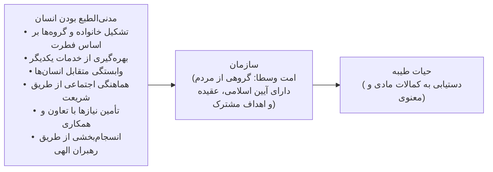
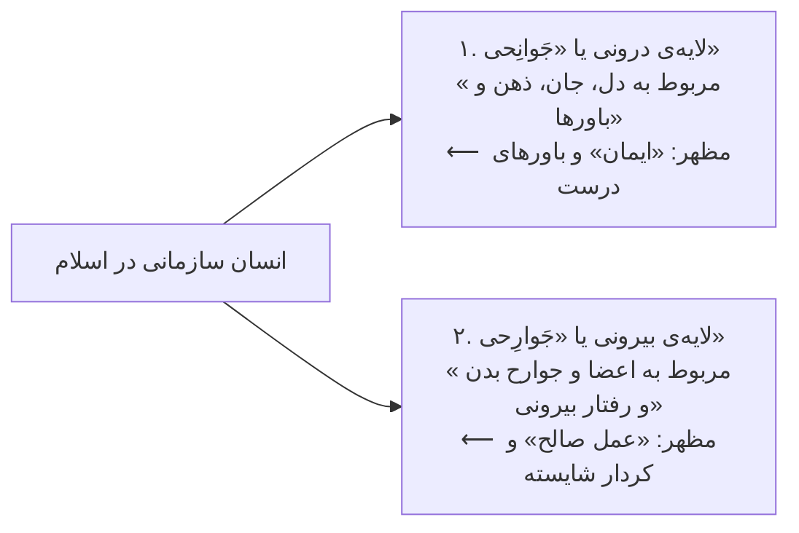
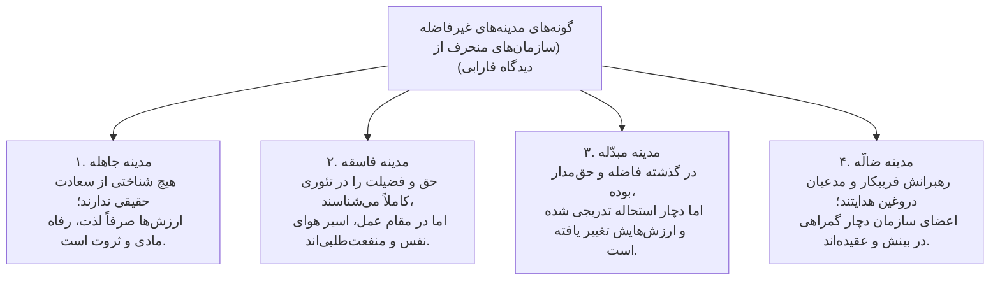
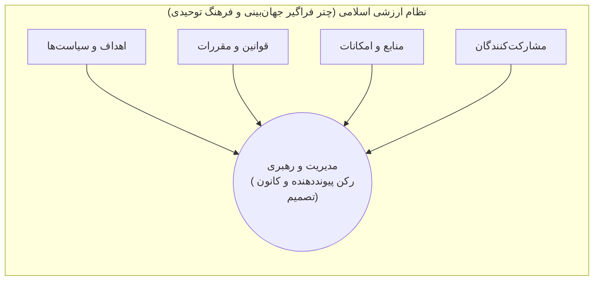
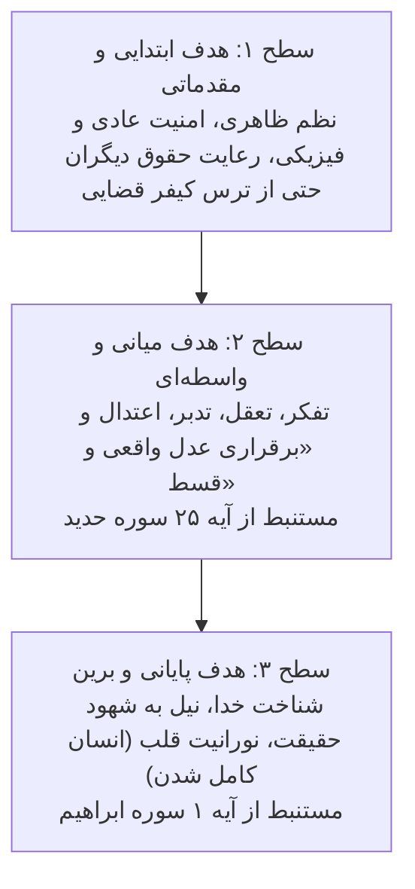
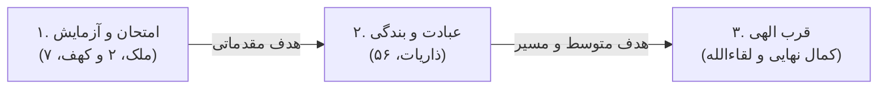
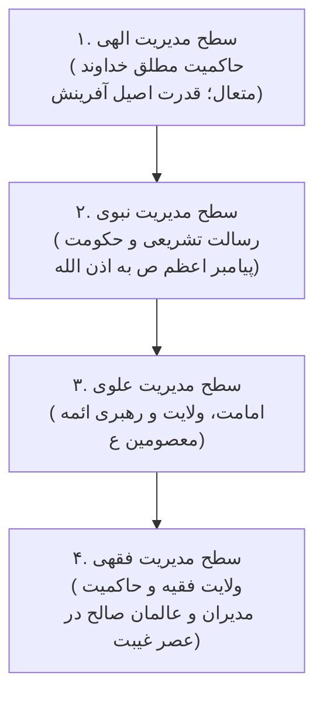

# فصل اول: مفهوم‌شناسی سازمان و مدیریت از دیدگاه اسلام (درسنامه مرجع و جامع)

> [!abstract] شناسنامه کنکوری و نقشه راهبردی تسلط بر فصل
> - **جایگاه در کنکور کارشناسی ارشد مدیریت:** این فصل سنگ‌بنای درس مدیریت اسلامی است و به‌طور میانگین سالانه ۱ تا ۲ تست قطعی و پرتکرار دارد. در مجموع ۱۲ سؤال از ۱۰۵ سؤال دوره‌های اخیر مستقیماً از متن و جداول مقایسه‌ای این فصل طرح شده است.
> - **درجه اهمیت:** 🥇 **سنگر طلایی (تضمین درصد)**؛ طراحان کنکور علاقه ویژه‌ای به مقایسه دیدگاه‌های متفکران مسلمان (به‌ویژه ابوریحان بیرونی، خواجه نصیرالدین طوسی، فارابی و ملاصدرا)، کارکردهای اصناف هفت‌گانه در فرمان مالک اشتر، تفاوت عدل و جود، و تفکیک ابعاد جوانحی (ایمان) و جوارحی (عمل صالح) دارند.
> - **مرجع اصلی:** کتاب «اصول و مبانی مدیریت از دیدگاه اسلام»، تألیف دکتر سید محمد مقیمی (فصل اول، صفحات ۱۱ تا ۶۷).
> - **رویکرد آموزشی ویژه این درسنامه:**
>   1. **نمودارهای تصویری مرمید (Mermaid):** جایگزینی کامل طرح‌های متنی و اسکی با اشکال گرافیکی استاندارد و بصری.
>   2. **جعبه ابزار شکار تست از روی آیات:** نیازی به حفظ کردن متن کامل آیات عربی نیست! برای تک‌تک آیات، «کلیدواژه‌های طلایی» استخراج شده تا تنها با دیدن ۲ تا ۳ کلمه عربی، گزینه درست در کمتر از ۵ ثانیه شناسایی شود.

---

## بخش صفر: جدول طلایی کدگشایی آیات پرتکرار کنکور (جعبه ابزار تست‌زنی ۵ ثانیه‌ای)

> [!important] 🎯 چگونه بدون حفظ آیات، تست‌های قرآنی مدیریت اسلامی را ۱۰۰٪ درست بزنیم؟
> طراحان کنکور ارشد هیچ‌گاه از شما نمی‌خواهند آیه را از حفظ بنویسید! آن‌ها یا یک قطعه از آیه را در صورت سؤال می‌آورند یا مفهوم مدیریتی آن را می‌پرسند. کافی است جدول زیر را به عنوان «شاه‌کلید تطبیق کلمات» در ذهن داشته باشید:

|   نام سوره و شماره آیه    | کلیدواژه عربی در صورت سؤال کنکور                                                     | مفهوم و دلالت مدیریتی در کنکور                             | پاسخ قطعی تست (کلید انتخاب گزینه)                                   |
| :-----------------------: | :----------------------------------------------------------------------------------- | :--------------------------------------------------------- | :------------------------------------------------------------------ |
|       **حجرات، ۱۳**       | **شُعُوباً وَقَبَائِلَ لِتَعَارَفُوا** ... **أَتْقَاكُمْ**                           | تنوع فرهنگی/زیستی ابزار تعامل و شناسایی است، نه برتری‌جویی | **شایسته‌سالاری بر مدار تقوا** (نفی تبعیض نژادی و تبارگرایی)        |
|       **زخرف، ۳۲**        | **لِيَتَّخِذَ بَعْضُهُم بَعْضاً سُخْرِيّاً**                                         | نیاز و وابستگی متقابل استعدادها برای خدمت‌رسانی به یکدیگر  | **پایه‌ریزی تقسیم کار سازمانی و تسخیر متقابل** (نه استهزاء!)        |
|     **آل‌عمران، ۱۹۵**     | **بَعْضُكُم مِّن بَعْضٍ**                                                            | پیوستگی اندام‌وار و اعضای یک پیکر بودن جامعه و سازمان      | **نگرش ارگانیک و پیوستگی اجزای سیستم**                              |
|       **بقره، ۲۱۳**       | **فَبَعَثَ اللَّهُ النَّبِيِّينَ ... لِيَحْكُمَ بَيْنَ النَّاسِ**                    | بعثت پیامبران برای تدوین قانون، حل تنازع و ایجاد تشکل      | **نخستین پیامبر مروج سازمان و شریعت: حضرت نوح (ع)**                 |
|     **آل‌عمران، ۲۰۰**     | **اصْبِرُوا وَصَابِرُوا وَرَابِطُوا**                                                | تفکیک استقامت فردی، همکاری گروهی و انسجام سازمانی          | **رابطه شمول: مرابطه اعم از مصابره، و مصابره اعم از صبر**           |
|       **مائده، ۲**        | **تَعَاوَنُوا عَلَى الْبِرِّ ... وَلَا تَعَاوَنُوا عَلَى الْإِثْمِ**                 | مرزبندی همکاری مشروع و نامشروع در سازمان                   | **هم‌افزایی همسو با ارزش‌ها و نفی مشارکت در فساد اداری**            |
|        **نحل، ۹۷**        | **فَلَنُحْيِيَنَّهُ حَيَاةً طَيِّبَةً**                                              | برونداد ترکیب ایمان قلبی و عمل صالح بیرونی                 | **حیات طیبه سازمانی = پیوند اثربخشی و کارآیی**                      |
|       **فاطر، ۱۰**        | **إِلَيْهِ يَصْعَدُ الْكَلِمُ الطَّيِّبُ وَالْعَمَلُ الصَّالِحُ يَرْفَعُهُ**         | کلم طیب (باور) بالا می‌رود و عمل صالح بالابرنده آن است     | **پیوند ناگسستنی لایه جوانحی (ایمان) و جوارحی (عمل)**               |
|       **بقره، ۱۴۳**       | **جَعَلْنَاكُمْ أُمَّةً وَسَطًا لِّتَكُونُوا شُهَدَاءَ**                             | اعتدال، توازن، دوری از افراط و تفریط، الگو بودن            | **شاخص‌های سازمان متوازن (نه دنیاپرستی، نه زهد منفی)**              |
|       **حدید، ۲۵**        | **أَنزَلْنَا مَعَهُمُ الْكِتَابَ ... لِيَقُومَ النَّاسُ بِالْقِسْطِ**                | ارسال رسل و برقراری عدل و قسط در جامعه                     | **برقراری عدالت هدف میانی است، نه هدف نهایی و غایی**                |
|        **ملک، ۲**         | **لِيَبْلُوَكُمْ أَيُّكُمْ أَحْسَنُ عَمَلًا**                                        | هدف از آزمون الهی، سنجش کیفیت کردار است                    | **تأکید بر استاندارد، کیفیت و کارآیی (احسن عمل، نه اکثر عمل)**      |
|       **مائده، ۱۶**       | **يَهْدِي بِهِ اللَّهُ مَنِ اتَّبَعَ رِضْوَانَهُ سُبُلَ السَّلَامِ**                 | رضایت الهی عامل خروج از تاریکی‌ها به سوی نور               | **تقدم رضایت خداوند بر رضایت توده‌ها و اصحاب قدرت**                 |
|       **نساء، ۵۹**        | **أَطِيعُوا اللَّهَ وَأَطِيعُوا الرَّسُولَ وَأُولِي الْأَمْرِ**                      | مراتب فرمان‌بری و ارجاع اختلافات کاری به کتاب و سنت        | **سلسله‌مراتب مدیریت در اسلام و فصل‌الخطاب در تعارضات**             |
|       **بقره، ۲۴۷**       | **وَزَادَهُ بَسْطَةً فِي الْعِلْمِ وَالْجِسْمِ**                                     | داستان انتصاب طالوت به فرماندهی                            | **شایستگی مدیریتی: قدرت فکری/علمی + توان فیزیکی/جسمانی**            |
|       **یوسف، ۵۵**        | **اجْعَلْنِي عَلَىٰ خَزَائِنِ الْأَرْضِ إِنِّي حَفِيظٌ عَلِيمٌ**                     | پیشنهاد مدیریت خزانه‌داری توسط حضرت یوسف                   | **حفیظ = تعهد و امانتداری / علیم = تخصص و دانش اقتصادی**            |
|        **قصص، ۲۶**        | **إِنَّ خَيْرَ مَنِ اسْتَأْجَرْتَ الْقَوِيُّ الْأَمِينُ**                            | پیشنهاد استخدام موسی (ع) توسط دختر شعیب                    | **القوی = توان اجرایی و تخصص / الامین = وجدان کاری و امانت**        |
|       **سجده، ۲۴**        | **أَئِمَّةً يَهْدُونَ بِأَمْرِنَا لَمَّا صَبَرُوا وَكَانُوا بِآيَاتِنَا يُوقِنُونَ** | شرایط دستیابی به مقام رهبری و پیشوایی امت                  | **دو بال رهبری: ۱. صبر و شکیبایی در فشار ۲. یقین قلبی**             |
|       **یونس، ۳۵**        | **أَفَمَن يَهْدِي إِلَى الْحَقِّ ... أَمَّن لَّا يَهِدِّي إِلَّا أَن يُهْدَىٰ**      | مقایسه رهبر هدایت‌گر با رهبر نیازمند هدایت                 | **پیشگامی، بصیرت و استقلال در شناخت حق (شرایط رهبر)**               |
|        **نساء، ۶**        | **فَإِنْ آنَسْتُم مِّنْهُمْ رُشْدًا فَادْفَعُوا إِلَيْهِمْ أَمْوَالَهُمْ**           | آزمون توانایی یتیمان برای مدیریت اموال خود                 | **رشد مالی و اقتصادی (شایستگی نگهداری و بهره‌برداری بهینه از مال)** |
| **نهج‌البلاغه (نامه ۵)**  | **وَ إِنَّ عَمَلَكَ لَيْسَ لَكَ بِطُعْمَةٍ وَ لَكِنَّهُ فِي عُنُقِكَ أَمَانَةٌ**     | خطاب امام علی (ع) به اشعث بن قیس درباره منصب حکومتی        | **امانت‌داری سازمانی در برابر رانت‌خواری و طعمه‌انگاری پست**        |
| **نهج‌البلاغه (نامه ۵۳)** | **عِمَارَةِ الْأَرْضِ أَبْلَغَ مِنْ نَظَرِكَ فِي اسْتِجْلَابِ الْخَرَاجِ**           | راهبرد کلان اقتصادی در عهدنامه مالک اشتر                   | **تقدم استراتژیک سرمایه‌گذاری و عمران بر اخذ مالیات و خراج**        |
|    **حدیث نبوی صنفان**    | **صِنْفَانِ مِنْ أُمَّتِي إِذَا صَلَحَا ... الْفُقَهَاءُ وَ الْأُمَرَاءُ**           | فقیهان (رهبران فکری) و امیران (مجریان ساختاری)             | **پیوند اثربخشی (فقها) و کارآیی (امرا) جهت نیل به بهره‌وری پایدار** |

---

# ۱. سازمان چیست؟

> [!abstract] جایگاه سازمانی و تعاریف پایه در دیدگاه دکتر مقیمی (صفحه ۱۱ کتاب)
> در نظام فکری اسلام، **سازمان مفهومی عام و فراگیر است** که تمامی گروه‌های متشکل انسانی از خانواده گرفته تا مؤسسات، شرکت‌ها، نهادها و کل حاکمیت را شامل می‌شود. در این کتاب، «نهاد حکومت و دولت» به عنوان معادل و بالاترین سطح سازمانی فرض شده است.

---

## ۱-۱. فلسفه وجودی سازمان از دیدگاه اسلام (صفحات ۱۱ تا ۱۵ کتاب)

از دیدگاه اسلام، انسان‌ها فطرتاً اجتماعی آفریده شده‌اند و برای بقا، رشد و تکامل خود نیازمند «سازمان» و تشکیلاتی هستند تا ضمن تنظیم روابط اجتماعی، از طریق همکاری با یکدیگر به اهداف مورد نظر دست یابند. اصل اجتماعی بودن انسان ناشی از **فطرت اجتماعی** اوست که قرآن به بهترین وجه ضرورت سازمان‌یافتگی و طبع مدنی انسان را در ۵ اصل تبیین می‌فرماید:

### ۱. دلالت‌های قرآنی بر ضرورت سازمان‌یافتگی و طبع اجتماعی انسان

#### ۱. گروه‌بندی افراد جامعه برای شناخت مناسب (حجرات، ۱۳):
> «يَا أَيُّهَا النَّاسُ إِنَّا خَلَقْنَاكُم مِّن ذَكَرٍ وَ أُنثَىٰ وَ جَعَلْنَاكُمْ شُعُوباً وَ قَبَائِلَ لِتَعَارَفُوا إِنَّ أَكْرَمَكُمْ عِندَ اللَّهِ أَتْقَاكُمْ»
- **ترجمه و مفهوم:** ای مردم! ما شما را از یک مرد و زن آفریدیم، و شما را شاخه‌ها «شُعوب» و تیره‌ها «قبائل» قرار دادیم تا یکدیگر را بازشناسید؛ همانا گرامی‌ترین شما نزد خدا باتقواترین شماست.
> [!tip] 🎯 شکار تست آیه ۱۳ حجرات
> - **کلیدواژه عربی در تست:** `شُعُوباً وَ قَبَائِلَ لِتَعَارَفُوا` / `أَتْقَاكُمْ`.
> - **مفهوم مدیریتی:** تفاوت‌های نژادی، فرهنگی و قبیله‌ای بستر «تعارف «شناسایی متقابل، تعامل و همکاری سازنده سازمانی»» است، نه برتری‌جویی و فخرفروشی. معیار گزینش سازمانی فقط تقوا و شایستگی است.

#### ۲. بهره‌گیری از خدمات افراد در قالب شکل‌گیری اجتماعات بشری (زخرف، ۳۲):
> «أَهُمْ يَقْسِمُونَ رَحْمَتَ رَبِّكَ نَحْنُ قَسَمْنَا بَيْنَهُم مَّعِيشَتَهُمْ فِي الْحَيَاةِ الدُّنْيَا وَ رَفَعْنَا بَعْضَهُمْ فَوْقَ بَعْضٍ دَرَجَاتٍ لِّيَتَّخِذَ بَعْضُهُم بَعْضاً سُخْرِيّاً وَ رَحْمَتُ رَبِّكَ خَيْرٌ مِّمَّا يَجْمَعُونَ»
- **ترجمه و مفهوم:** آیا آنان رحمت پروردگارت را تقسیم می‌کنند؟ ما معیشت آنان را در حیات دنیا میانشان تقسیم کردیم و برخی از آنها را بر برخی دیگر به رتبه‌هایی برتری دادیم تا بعضی از آنان، بعضی دیگر را به خدمت گیرند «تا نظام اتم و اصلح اداره جامعه بشری فراهم آید»...
> [!tip] 🎯 شکار تست آیه ۳۲ زخرف (دام پرتکرار طراحان!)
> - **کلیدواژه عربی در تست:** `لِّيَتَّخِذَ بَعْضُهُم بَعْضاً سُخْرِيّاً`.
> - **دام بزرگ:** واژه «سُخریاً» هرگز به معنای تمسخر یا استهزاء نیست؛ بلکه از ریشه «تَسخیر «به خدمت گرفتن توانمندی‌های متقابل، تقسیم کار و هم‌پوشانی نیازها»» است. این آیه پایه‌گذار اصل **تقسیم کار در تئوری سازمان** است.

#### ۳. وابستگی متقابل افراد جامعه به یکدیگر برای تأمین نیازها و خواسته‌ها (آل‌عمران، ۱۹۵):
> «أَنِّي لَا أُضِيعُ عَمَلَ عَامِلٍ مِّنكُم مِّن ذَكَرٍ أَوْ أُنثَىٰ بَعْضُكُم مِّن بَعْضٍ»
- **ترجمه و مفهوم:** هر یک از شما وابسته به دیگری است «بَعْضُكُم مِّن بَعْضٍ»؛ پیوستگی وجودی و ارگانیک اعضای سازمان که سود و زیان هر عضو در پیوند با کل سیستم است.

#### ۴. روابط اجتماعی ناهماهنگ و اختلاف‌انگیز، زمینه‌ساز ازهم‌گسیختگی و پراکندگی اجتماعات انسانی (یونس، ۱۹):
> «وَ مَا كَانَ النَّاسُ إِلَّا أُمَّةً وَاحِدَةً فَاخْتَلَفُوا»
- **ترجمه و مفهوم:** و مردم در آغاز جز امتی واحد و بدون اختلاف نبودند؛ سپس به سبب روابط اجتماعی در امور دنیوی اختلاف کردند.

#### ۵. رهبری مبتنی بر شریعت الهی، عاملی کلیدی در انسجام‌بخشی و سازمان‌یافتگی اجتماعات انسانی (بقره، ۲۱۳ و شوری، ۱۳):
> «كَانَ النَّاسُ أُمَّةً وَاحِدَةً فَبَعَثَ اللَّهُ النَّبِيِّينَ مُبَشِّرِينَ وَ مُنذِرِينَ وَ أَنزَلَ مَعَهُمُ الْكِتَابَ بِالْحَقِّ لِيَحْكُمَ بَيْنَ النَّاسِ فِيمَا اخْتَلَفُوا فِيهِ» (بقره، ۲۱۳)
- **نکته تستی قطعی:** پیش از بعثت پیامبران صاحب شریعت، مردم جامعه‌ای بدوی و ساده داشتند. بر اساس آیه ۱۳ سوره شوری و تفسیر المیزان، **دعوت به اتحاد، تشکل اجتماعی و سازمان برای نخستین بار از طرف «حضرت نوح (ع)» (قدیمی‌ترین پیامبر اولوالعزم و صاحب کتاب و شریعت) آغاز شد** و سپس توسط حضرت ابراهیم (ع)، حضرت موسی (ع)، حضرت عیسی (ع) و پیامبر اعظم (ص) تداوم یافت. دعوت به جامعه مستقل و صریح، جز از ناحیه دستگاه نبوت و در قالب دین از جای دیگری آغاز نشده است.

---

### ۲. نمودار ۱-۱ کتاب مقیمی: فرآیند شکل‌گیری سازمان مبتنی بر آیات قرآن

---

### ۳. دعوت جمعی به دین و ابعاد اجتماعی احکام در قرآن و سنت

خداوند در آیات متعددی (نساء ۷۶، بقره ۱۵۹، آل‌عمران ۱۰۴، مائده ۲۵، شوری ۱۳) مؤمنان را به برپایی دسته‌جمعی دین فراخوانده است. اوج این تشکل در آیه ۲۰۰ سوره آل‌عمران نمایان است:
> «يَا أَيُّهَا الَّذِينَ آمَنُوا اصْبِرُوا وَ صَابِرُوا وَ رَابِطُوا وَ اتَّقُوا اللَّهَ لَعَلَّكُمْ تُفْلِحُونَ» (آل‌عمران، ۲۰۰)

#### سلسله‌مراتب سه‌گانه شکیبایی و ارتباط در تفسیر المیزان:
۱. **اصْبِرُوا «صبر فردی»:** خویشتن‌داری شخصی در برابر سختی‌ها، صبر در طاعت و صبر بر ترک گناه.
۲. **صَابِرُوا «مصابره گروهی»:** سفارش متقابل مؤمنان به استقامت، هم‌افزایی توان‌ها و ایجاد نیروی واحد در برابر شدائد و دشمنان.
۳. **رَابِطُوا «مرابطه سازمانی و سیستمی»:** پیوند دادن تمام نیروها، فعالیت‌ها و امکانات در جمیع شئون زندگی اجتماعی و دینی چه در خوشی و چه در ناخوشی، به منظور نیل جامعه به سعادت حقیقی.
> [!tip] 🎯 تست رابطه شمول مفاهیم آیه ۲۰۰ آل‌عمران
> **مرابطه اعم از مصابره است، و مصابره اعم از صبر است** (مرابطه = بالاترین سطح کار تیمی و هماهنگی سازمانی).

#### احکام و مناسک اجتماعی اسلام به مثابه تمرین سازماندهی (صفحه ۱۳ کتاب):
اسلام علاوه بر اینکه در احکام عبادی خود بر حضور جمعی تأکید کرده، نظام اجتماعی را با تکالیف عینی پیوند زده است:
- **جهاد:** اجتماعی بودن در امر دفاع و نبرد برای کسب پیروزی.
- **روزه و حج:** گردهمایی باشکوه سالانه امت و تجلی آن در «نماز عید فطر و قربان».
- **نماز جمعه:** الزام به گردهمایی هفتگی عبادی-سیاسی جهت وحدت امت.
- **نماز جماعت:** برپایی روزانه سنت نبوی برای انسجام پیوسته شهروندان.
- **دعوت مداوم و امر به معروف و نهی از منکر:** مسئولیت اجتماعی همگانی و کنترل متقابل (آل‌عمران ۱۰۴، انعام ۷۰).

---

### ۴. اندیشه سازمان و مدنیت در آراء متفکران و فلاسفه مسلمان (صفحات ۱۳ تا ۱۵ کتاب)

#### الف) ابوریحان بیرونی (۳۶۲ - ۴۴۰ هـ.ق):
بیرونی مدنی‌الطبع بودن انسان را بر پایه سه اصل اساسی تحلیل می‌کند:
۱. **اصل استئناس (تجانُس «انس‌خواهی و هم‌گرایی فطری»):** انسان از ریشه «اُنس» است و نیازمند هم‌نشینی، هم‌شکلی، احساس هم‌زبانی، درک متقابل و تفاهم با همنوعان خویش است.
۲. **اصل تضاد و تدافع:** ساختار مادی و مزاجی انسان از عناصر متضاد ترکیب یافته است («ضد مر ضد را همیشه قهر کند و به خویشتن کشد»). این تضاد مقاصد و تمایلات موجب نزاع می‌شود، اما انسان‌ها برای دفع خطرات مشترک و بلایا به سمت همگرایی و سازمان کشیده می‌شوند.
۳. **نیازهای انسان:** ضرورت‌های معیشتی و مادی بشر موجب پیدایش حرفه‌ها، صناعات «مشاغل تخصصی»، علوم و معارف بشری شده است.
> [!important] 🎯 کمالات سه‌گانه انسان و کمال مدیریت از دیدگاه بیرونی
> بیرونی در کتاب «آثار الباقیه» کمالات را در ۳ گام رتبه‌بندی می‌کند: **۱. بلوغ جسمی** (در ۱۴ سالگی)، **۲. بلوغ عقلی** (شکوفایی قوه ناطقه و تفکیک خیر و شر)، **۳. بلوغ تدبیری** (توان عملی برای اداره امور). **کمال مدیریت حاصل جمع جبری هر ۳ بلوغ (جسمی + عقلی + تدبیری) است.**

#### ب) خواجه نصیرالدین طوسی (۵۹۷ - ۶۷۲ هـ.ق):
- **مبدأ حیات جمعی و تعاون:** انسان به تنهایی قادر به تأمین نیازهای اولیه خود نیست؛ پس نیازمند همیاری و «معاونت «کمک متقابل»» است تا هر کس نیازی را از دیگری برطرف سازد و عدالت بین آنان حاکم شود.
- **پیدایش تمدن و مدینه:** زندگی جمعی مقتضی نهادهایی است که به آن «تمدن» می‌گویند؛ مکان اجتماع اشخاص مختلف با افکار و صناعات گوناگون را «مدینه» نامند و این همان معنای قاعده «الانسان مدنیّ بالطبع» است.
- **حکمت الهی در اختلاف سلیقه‌ها و دواعی «انگیزه‌ها»:** خداوند علایق و همت‌های انسان‌ها را ناهمسان آفریده تا هر کس به دنبال حرفه‌ای برود و قوام عالم و نظام معیشت شکل گیرد.
- **ضرورت مدیر، مدبّر و سائس «رهبر و سیاست‌گذار»:** از آنجا که طبع انسان دچار حسادت، حرص، طمع و تجاوزطلبی است، اجتماع بشری محتاج «مدبّر و سائسی «مدیری خردمند»» است که روابط را تنظیم کند و عدالت را برپا دارد.

#### ج) صدرالمتألهین ملاصدرا (۹۷۹ - ۱۰۵۰ هـ.ق):
- **انسان به عنوان خلیفه الهی، «موجودی مدنی» است:** معیشت انسان در دنیا بدون تن دادن به تمدن، تشکل و همکاری سامان نمی‌پذیرد.
- **دنیا مزرعه و مبدأ سفر روحانی:** ارسال انبیاء و کتب آسمانی برای اصلاح امر معاش و حیات دنیوی است؛ چرا که دنیا منزلی از منازل سفر الی الله است.
- **مقیاس‌های سه‌گانه سازمان و حکومت:** ملاصدرا دستیابی به سعادت و کمال برتر را در سایه حکومت و سازمان در ۳ مقیاس می‌داند: **۱. مدینه** (شهر)، **۲. امت** (ملت)، **۳. معموره جهانی** (جامعه جهانی).

#### د) ابونصر فارابی (۲۵۰ - ۳۳۹ هـ.ق):
- **مقیاس‌های جوامع کامل:** فارابی نیز سازمان کامل را در ۳ سطح می‌داند: ۱. مدینه فاضله، ۲. امت فاضله، ۳. معموره ارض فاضله «جامعه جهانی فاضله».
- **ویژگی شهروند مدینه فاضله:** شهروند مدینه فاضله دارای **«پویایی، تحرک و حق مشارکت در امور جمعی»** متناسب با توانمندی‌های فردی خویش است.
- **غایت سازمان فاضله:** هدف نهایی دستیابی به فضیلت، خیر، سعادت و کمال انسانی است که در پرتو سیاست فاضله حاکم و ساختارهای سازمانی تحقق می‌یابد.

#### هـ) ابن رشد:
- **انسان حیوانی مدنی بالطبع:** انسان برای نیل به کمالات به دولت و سازمان نیازمند است. او به تعاون و **«تعاضُد «پشت‌به‌پشت دادن، همیاری و پشتیبانی متقابل»»** محتاج است و زندگی بدون دولت و سازمان اصولاً امکان‌پذیر نبوده و موجب نقص ذات انسان است.

---

## ۱-۲. ماهیت سازمان از دیدگاه اسلام (صفحات ۱۶ تا ۱۹ کتاب)

در متون اسلامی برای تبیین مفهوم سازمان از واژگانی همچون «امّت»، «حکومت»، «دولت»، «مدینه» و «اجتماع انسانی» استفاده شده است که با اندکی مسامحه می‌توان همه آنها را معادل «سازمان» در نظر گرفت. اندیشمندان مسلمان در تحلیل این مفاهیم بر ساختار کلان جامعه تمرکز کرده و از سازمان ایده‌آل با عناوینی چون «مدینه فاضله»، «دولت کریمه» و «دولت امامت» یاد نموده‌اند.

### ۱. دیدگاه خواجه نصیرالدین طوسی درباره جایگاه دولت و ارکان بقای سازمان
- **دولت به مثابه عالی‌ترین نهاد تصمیم‌گیرنده:** از دیدگاه خواجه نصیر، یک اجتماع کامل انسانی از افرادی با انگیزه‌ها و صناعات «حرفه‌ها» مختلف تشکیل می‌شود. دولت نهادی است که برتر از همه نهادها و آراء است و ریاست آن «مافوق ریاست‌ها» می‌باشد.
- **منشأ پیدایش دولت:** خواجه نصیر منشأ دولت را «اتفاق مردمی» می‌داند تا مردم قدرت‌های پراکنده خود را به یک حاکم واگذارند و او با قدرت فائقه خویش، نیازهای همگان را برآورده ساخته و جامعه را از سلایق شخصی برهاند.
- **ارکان چهارگانه بقا و دوام سازمان‌ها از دیدگاه خواجه نصیر:**  
  خواجه نصیر بقای هر جامعه و سازمانی را بر **۴ ستون اصلی** استوار می‌داند:  
  ۱. **محبّت:** عامل ایجاد پیوند قلبی، ایثار و همگرایی در میان افراد و گروه‌ها.  
  ۲. **صداقت:** عامل اعتمادسازی و رواج راستی در تعاملات کاری و اداری.  
  ۳. **عدالت:** ایجاد تعادل، توازن و رعایت استحقاق‌ها در ساختارهای سازمان.  
  ۴. **سیاست (مدیریت) و قانون:** تدبیر خردمندانه، هدایت اجرایی و انضباط‌بخشی.

> [!important] 🎯 قاعده بنیادین انسان‌شناسی خواجه نصیر و ابن‌مسکویه: «محبت اصل است و عدالت بدل»
> از دیدگاه خواجه نصیرالدین طوسی و ابن مسکویه، در روابط انسانی و سازمانی:  
> **«محبت، الفت و مودت اصل است و عدالت بدل «جانشین اضطراری»»**.  
> - فلسفه: اگر در سازمان صمیمیت، برادری و محبت حاکم باشد، همکاران خودجوش به یاری یکدیگر می‌شتابند و نیازی به داوری، ترازو و قانون خشک عدالت نیست. اما هنگامی که محبت رنگ ببازد، ناگزیر باید از عدالت به عنوان داروی ترمیم‌کننده برای جلوگیری از ظلم استفاده کرد.

---

### ۲. دیدگاه علامه جلال‌الدین دوانی: کمال انسان در «هویت جمعی»
علامه دوانی کمال انسان را منحصراً در گرو حضور او در جامعه و برقراری روابط و همکاری در تأمین نیازها می‌داند:
- **کلید تستی:** «اول و آخر رشد و کمال انسان، یافتن **هویت جمعی** است». هر چه فرد از هویت جمعی فاصله بگیرد، رشد و کمال کمتری دارد و هر اندازه پیوند خود را با جمع مستحکم‌تر کند، از کمالات والاتری برخوردار می‌گردد.
- علامه دوانی بخش سوم حکمت عملی را **«علم مملکت‌داری»** می‌نامد که وظیفه‌اش تنظیم عادلانه معاش و معاد انسان‌هاست.

---

### ۳. مفهوم‌شناسی «امت» و «امت وسطا» در قرآن (صفحات ۱۷ تا ۱۸ کتاب)
واژه **«امّت»** ۶۴ بار در قرآن آمده که در ۶۰ مورد آن به معنای **«گروهی از انسان‌ها»** به کار رفته است. ملاک عضویت در امت در قرآن، خون، نژاد یا جغرافیا نیست؛ بلکه دارای جهت اشتراک است (گاهی وحدت زمان، گاهی وحدت مکان، گاهی وحدت رفتار و مهم‌تر از همه: **وحدت عقیده و جهان‌بینی توحیدی**).

> «وَ كَذَٰلِكَ جَعَلْنَاكُمْ أُمَّةً وَسَطاً لِّتَكُونُوا شُهَدَاءَ عَلَى النَّاسِ وَ يَكُونَ الرَّسُولُ عَلَيْكُمْ شَهِيداً» (بقره، ۱۴۳)
- **راغب اصفهانی:** «وسط» یعنی نقطه اعتدال میان دو لبه افراط و تفریط؛ عدل محض و دوری از تندروی و کندروی.
- **طبری:** امت وسط یعنی عادل‌ترین، منصف‌ترین و بهترین کارها و مردم.
- **دلالت سازمانی:** سازمان اسلامی تجلی «امت وسط» است؛ سازمانی متوازن که نه به ورطه زهد منفی صوفیانه (تعطیلی کار و کارایی) می‌افتد و نه اسیر سرمایه‌داری ماتریالیستی و استثمار می‌گردد.

---

### ۴. دیدگاه قطب‌الدین رازی: دولت ابزار جاری‌سازی «سیاست‌های فضیلت‌آور»
قطب‌الدین رازی دولت و سازمان را دستگاهی تعریف می‌کند که:
- وظیفه دارد با تأسیس ساختارها و نهادها، **«سیاست‌های فضیلت‌آور»** را به جریان بیندازد تا زمینه تخلّق «آراسته شدن» به ارزش‌ها، فضایل اخلاقی و کمالات نظری و عملی برای آحاد جامعه فراهم شود.

---

### ۵. اصل تعاون و همکاری: جوهره بنیادین سازمان در قرآن (صفحات ۱۸ و ۱۹ کتاب)
بر اساس تعالیم قرآن، جوهره اصلی سازمان «تعاون و همکاری» است:
> «وَ تَعَاوَنُوا عَلَى الْبِرِّ وَ التَّقْوَىٰ وَ لَا تَعَاوَنُوا عَلَى الْإِثْمِ وَ الْعُدْوَانِ» (مائده، ۲)

- **دو بال هم‌افزایی سازمانی در اسلام:**
  - **جنبه اثباتی (دستور به همکاری):** تعاون بر «بِرّ «نیکی‌ها و خدمات سازنده»» و «تقوا «پرهیزگاری و خویشتن‌داری»».
  - **جنبه سلبی (ممنوعیت مشارکت):** نهی قاطع از همکاری در «اثم «گناه و فساد اداری»» و «عدوان «تجاوز و پایمال کردن حقوق دیگران»».
- **خط بطلان بر تعصب جاهلی:** در منطق مدیریت اسلامی، همکاری کورکورانه با افراد صرفاً به خاطر هم‌حزبی، هم‌قبیلگی یا خویشاوندی مردود است؛ معیار همکاری فقط حقانیت و خیر عمومی است.

---

## ۱-۳. سازمان ابزاری برای تحقق حیات طیبه (صفحات ۱۹ تا ۲۴ کتاب)

در جهان‌بینی اسلامی، سازمان توحیدی (آخرت‌گرا) هدف نهایی نیست، بلکه **ابزاری استراتژیک برای تحقق «حیات طیبه»** در دو عرصه دنیا و آخرت است:

### ۱. پیوند ناگسستنی ایمان و عمل صالح در تولید حیات طیبه:
> «مَنْ عَمِلَ صَالِحاً مِّن ذَكَرٍ أَوْ أُنثَىٰ وَ هُوَ مُؤْمِنٌ فَلَنُحْيِيَنَّهُ حَيَاةً طَيِّبَةً وَ لَنَجْزِيَنَّهُمْ أَجْرَهُم بِأَحْسَنِ مَا كَانُوا يَعْمَلُونَ» (نحل، ۹۷)
- حیات طیبه محصول تلاقی دو رکن است: **۱. ایمان قلبی «لایه جوانحی و ارزشی»** + **۲. عمل صالح عینی «لایه جوارحی و رفتاری»**. این ترکیب سبب دستیابی به سعادت و رفاه پاکیزه در دنیا و رستگاری در آخرت می‌شود.

### ۲. استعاره‌های نهج‌البلاغه درباره سازمان آخرت‌گرا (صفحات ۱۹ و ۲۰ کتاب):

#### الف) استعاره «مسافر» در کلام امیرالمؤمنین (ع) (حکمت ۲۸۰ و نامه ۳۱):
امام علی (ع) وضعیت انسان‌ها را در دنیا به کاروان مسافرانی تشبیه می‌فرمایند:
- **مسافران آخرت‌گرا:** سختی‌ها، ناگواری‌ها و کمبودهای مسیر کاروانسرا را با طیب خاطر تحمل می‌کنند؛ زیرا می‌دانند این مشقت‌ها برای رسیدن به منزلگاهی وسیع، امن و جاودان است و هزینه‌های مصرف‌شده را غرامت نمی‌شمارند.
- **دنیاپرستان سازمان‌های سکولار:** همچون کسانی هستند که از کاخی پرنعمت به اجبار به سوی بیابانی بی‌آب‌وعلف رانده می‌شوند؛ لذا هر تغییری برایشان عذاب‌آور و هولناک است.

#### ب) انفاق و باربران توشه آخرت (نامه ۳۱ نهج‌البلاغه):
امام علی (ع) به فرزندشان امام حسن مجتبی (ع) می‌فرمایند:
> «اگر مستمندی را دیدی که توشه‌ات را تا قیامت حمل می‌کند و فردا که به آن نیازمندی به تو بازمی‌گرداند، کمک او را غنیمت شمار و بار توشه را بر دوش او بگذار...»
- **دلالت رفتاری در سازمان آخرت‌گرا:** در چنین سازمانی، **«فرهنگ ایثارگرانه، جهادی و رفاقتی» جایگزین فرهنگ رقابتی و سودجویی حذفی** می‌شود. کارکنان نه تنها از یاری نیازمندان طفره نمی‌روند، بلکه آنان را فرصتی طلایی برای انتقال سرمایه‌های خود به سرای ابدی می‌دانند. مصداق تاریخی آن، ایثار آب میان رزمندگان تشنه‌لب در جنگ‌های صدر اسلام و دفاع مقدس است.
### ۳. پیوند دنیا و آخرت در جهان‌بینی مدیریت اسلامی (صفحه ۲۱ کتاب)
بر خلاف دیدگاه‌های افراطی و تفریطی، اسلام دنیا و آخرت را دو مقوله جدا از هم یا در تضاد ماهوی نمی‌بیند. 
- **دیدگاه شهید مطهری:** اسلام نگاه آخرت‌گرایانه را دقیقاً **در درون زندگی دنیا تعبیه کرده است**. از این رو، فعالیت‌های سازمانی و دنیوی اگر در مسیر حق باشند، عین بندگی و عمل اخروی تلقی می‌گردند.
- **تمثیل کلامی امیرالمؤمنین (ع) در خطبه ۲۰۹ نهج‌البلاغه (داستان خانه فراخ علاء بن زیاد حارثی):**
  هنگامی که امام علی (ع) در بصره به عیادت «علاء بن زیاد حارثی» رفتند و خانه بسیار بزرگ و وسیع او را دیدند، فرمودند:
  > «با این خانه بزرگ در این دنیا چه می‌کنی، در حالی که در آخرت به آن نیازمندتری؟! آری، اگر بخواهی می‌توانی به وسیله همین خانه به آخرت برسی: در آن از مهمانان پذیرایی کنی، «صله‌رحم» «پیوند خویشاوندی و یاری بستگان» به جای آوری، و حقوق واجب الهی را از آن آشکار و ادا نمایی؛ در این صورت به وسیله این خانه به سرای جاوید آخرت دست یافته‌ای.»
  - **پیام راهبردی برای مدیران:** ثروت، ساختمان، تجهیزات و امکانات سازمان دنیاگرا مایه تفاخر، طغیان و غفلت است؛ اما در سازمان آخرت‌گرا، همین منابع مادی تبدیل به **«سکوی پرش و پل عبور به سوی حیات جاودانه آخرت»** می‌گردند.

---

### ۴. همراستاسازی اهداف سه‌گانه در سازمان آخرت‌گرا (نمودار ۱-۲ مقیمی، صفحات ۲۱ و ۲۲ کتاب)
یکی از بحران‌های همیشگی در مکاتب مدیریت غربی (نظریه عاملیت «Agency Theory» و مکاتب رفتاری)، تضاد و تعارض عمیق میان ۳ دسته اهداف است:
۱. اهداف بنیان‌گذاران و کلان سازمان
۲. اهداف مدیران (کسب قدرت، پاداش و ارتقا)
۳. اهداف کارکنان (دستمزد بالاتر، رفاه و کار کمتر)

در سازمان‌های دنیاگرا، تعارض این اهداف به جنگ قدرت، کم‌کاری، پنهان‌کاری و نظارت‌های پلیسی پرهزینه منجر می‌شود. اما در **سازمان آخرت‌گرا**، این تعارض به شیوه‌ای بنیادین حل می‌گردد:

> [!tip] 🖼️ **ارجاع به تصویر کتاب:**
> برای مشاهده تصویر گرافیکی این مدل، به **نمودار ۱-۲: «همراستاسازی اهداف در سازمان آخرت‌گرا» (صفحه ۲۲ کتاب مقیمی)** مراجعه کنید.

**تحلیل ساختاری و کالبدشکافی تصویر نمودار ۱-۲ کتاب:**
- **هندسه تصویر:** در این نمودار، رأس هرم و کانون وحدت‌بخش، **«رضایت خداوند متعال»** است.
- **حلقه اتصال (کاتالیزور):** مفهوم **«درجه‌ای از اخلاص»** دقیقاً در میانه قرار دارد و مانند یک منشور عمل می‌کند.
- **تغییر جهت بردارها:** در مدیریت کلاسیک، سه بردار اهداف (اهداف سازمان، اهداف مدیران، و اهداف کارکنان) در جهات مخالف یکدیگرند که نتیجه آن اصطکاک و اتلاف انرژی است؛ اما در نمودار کتاب، هر سه دسته از اهداف از فیلتر «اخلاص» عبور کرده و همگی به سمت کانون واحد یعنی «رضایت الهی و حیات طیبه» همگرا و هم‌جهت می‌شوند. نتیجه این هم‌راستایی، به صفر رسیدن تضاد منافع، ایجاد آرامش و هم‌افزایی حداکثری است.

> [!important] 🎯 تحلیل سازوکار همگرایی اهداف در نمودار ۱-۲ مقیمی:
> - **تقوای الهی (اخلاص):** کلیه ارکان سازمان باید به درجه‌ای از «اخلاص» «پاک‌سازی نیت صرفاً برای رضایت خدا» دست یابند که تمام اعمال و فعالیت‌هایشان تابع ایمان قلبی باشد.
> - **محو تعارض منافع:** چون هدف نهایی هر سه گروه (مؤسسان، مدیران و کارکنان) جلب رضایت پروردگار و کسب حیات طیبه است، پیگیری اهداف سازمانی به معنای انجام تکلیف الهی و بندگی است. بنابراین تعارض منافع از بین رفته و همه از تحقق اهداف سازمان منتفع می‌شوند.
> - **بشارت قرآنی (بقره، آیه ۲۵):**
>   «وَبَشِّرِ الَّذِينَ آمَنُوا وَعَمِلُوا الصَّالِحَاتِ أَنَّ لَهُمْ جَنَّاتٍ تَجْرِي مِن تَحْتِهَا الْأَنْهَارُ...»
>   *(مژده رستگاری ابدی برای کسانی است که ایمان و عمل صالح را توأمان در عمل پیاده کنند).*

---

### ۵. دو لایه وجودی انسان و دو بال تقوا در سازمان (صفحات ۲۲ تا ۲۴ کتاب)
تقوای الهی در سازمان دارای دو مؤلفه بنیادین است که متناظر با دو لایه وجودی انسان عمل می‌کنند:

#### الف) حقیقت ایمان و ابعاد سه‌گانه آن (دیدگاه علامه سید مرتضی و قرآن):
- **دیدگاه علامه سید مرتضی:** ایمان در اصل، **«تصدیق و اقرار قلبی»** است؛ اقرار زبانی و عمل به احکام، از لوازم، ثمرات و پیامدهای ضروری ایمانند، نه جزء ماهیت درونی آن.
- **ابعاد سه‌گانه ایمان در منطق قرآن:**
  ۱. **بُعد عقلی و معرفتی:** شناخت، استدلال و آگاهی یقینی نسبت به حق (دوری از تقلید کورکورانه).
  ۲. **بُعد ارادی:** انتخاب آگاهانه و عزم آزادانه بر پذیرش حق (ایمانِ زوری و تحمیلی از نظر قرآن فاقد ارزش است).
  ۳. **بُعد عاطفی:** عشق عمیق «حُبّ»، دلدادگی، شیفتگی به حق و خشیت خاضعانه در برابر پروردگار.

#### ب) کلم طیب و عمل صالح؛ صعود و رفعت (آیه ۱۰ سوره فاطر):
> «إِلَيْهِ يَصْعَدُ الْكَلِمُ الطَّيِّبُ وَالْعَمَلُ الصَّالِحُ يَرْفَعُهُ ۚ وَالَّذِينَ يَمْكُرُونَ السَّيِّئَاتِ لَهُمْ عَذَابٌ شَدِيدٌ...» (فاطر، ۱۰)
- **«الکَلِمُ الطَّیِّب»:** عقیده پاک، توحید و ایمان قلبی است که مستقیماً به سوی پروردگار صعود می‌کند.
- **«الْعَمَلُ الصَّالِحُ يَرْفَعُهُ»:** عمل شایسته و وظیفه‌شناسانه جوارحی، پشتیبان و بالابرنده کلم طیب (ایمان) است؛ یعنی عمل صالح به ایمان بال پرواز می‌دهد تا به پیشگاه حق برسد.
- **مفهوم‌شناسی واژه «عِزّت»:** در آیه فوق، عزت به معنای **«غلبه، تسخیرناپذیری و نفوذناپذیری شکست‌ناپذیر»** است که انحصاراً از آنِ خداوند است و انسان‌ها با اتصال به او بدان دست می‌یابند.

#### ج) صراط مستقیم؛ مدار تکامل در برابر سُبُل الغَیّ (صفحه ۲۳ کتاب):
- **دیدگاه شهید مطهری درباره صراط مستقیم:** حرکت انسان به سوی خدا، حرکت در یک «جاده با ایستگاه‌های توقف» نیست؛ بلکه انسان دارای یک **«مدار حرکتی تکاملی»** است که در آن بدون توقف اوج می‌گیرد.
- **تقابل قرآنی:** **«صِراط مُسْتَقیم»** همواره به صورت **مفرد** آمده است (زیرا راه حق یکی بیش نیست)؛ اما راه‌های انحرافی و گمراهی با واژه جمع **«سُبُل الغَیّ»** یا راه‌های شیطانی توصیف شده‌اند.
- **دین قیّم و ملت ابراهیم حنیف (انعام، آیه ۱۶۱):**
  > «قُلْ إِنَّنِي هَدَانِي رَبِّي إِلَىٰ صِرَاطٍ مُسْتَقِيمٍ دِينًا قِيَمًا مِّلَّةَ إِبْرَاهِيمَ حَنِيفًا وَمَا كَانَ مِنَ الْمُشْرِكِينَ»
  - **مفهوم‌شناسی تستی «حَنیف»:** «حنیف» کسی است که **مستقیم و استوار بر جاده حق گام برمی‌دارد و سر سوزنی به چپ یا راست منحرف نمی‌شود**.
  - **متضاد حنیف در تست‌ها:** واژه **«جَنیف»** یا **«مُتَجانِف»** به معنای کسی است که دچار انحراف، کجی، میل به باطل و افراط یا تفریط شده است.
- **مفهوم «شریعت» (جاثیه، آیه ۱۸):**
  > «ثُمَّ جَعَلْنَاكَ عَلَىٰ شَرِيعَةٍ مِّنَ الْأَمْرِ فَاتَّبِعْهَا...»
  «شریعت» در لغت یعنی راه روشن و آبشخوری که انسان تشنه را به آب گوارا می‌رساند و در اصطلاح، احکام و آیین الهی است که سازمان و جامعه را در مسیر صراط مستقیم نگه می‌دارد.
- **دیدگاه کشفی و فراتی:**
  - «عقل نظری» معطوف به حوزه **ایمان** و باورهاست.
  - «عقل عملی» معطوف به حوزه **عمل صالح** و رفتارهاست.
  - اطاعت و تسلیم عقل عملی در برابر عقل نظری را **«اخلاص»** می‌نامند (پاک کردن سراسر وجود و عمل صرفاً برای پروردگار).

#### د) حقیقت عمل صالح و مأموریت موحدان (صفحه ۲۴ کتاب):
> «وَمَا أُمِرُوا إِلَّا لِيَعْبُدُوا اللَّهَ مُخْلِصِينَ لَهُ الدِّينَ حُنَفَاءَ وَيُقِيمُوا الصَّلَاةَ وَيُؤْتُوا الزَّكَاةَ ۚ وَذَٰلِكَ دِينُ الْقَيِّمَةِ» (بینه، ۵)
- **تفسیر آیت‌الله جوادی آملی:** آحاد انسان‌ها هیچ مأموریتی در هستی ندارند جز آنکه دستورهای دین را با خلوص نیت انجام دهند و فهم و عملشان صرفاً برای خدا باشد.
- **تعریف دقیق «عمل صالح» در مدیریت اسلامی:**
  > «عمل صالح، عبارت است از **عمل بر طبق وحی، وظیفه و تکلیف شرعی**؛ یعنی انجام دادن آنچه در هر لحظه وظیفه شرعی و سازمانی یک مؤمن است.»
- **تأثیر متقابل و تکاملی ایمان و عمل صالح (مائده، آیه ۹):**
  اعمال صالح میوه و زاییده ایمان قلبی هستند، و در نقطه مقابل، تکرار رفتارهای صالح و اخلاقی موجب استحکام و تثبیت پایه‌های ایمان در ضمیر انسان می‌گردد (دفتر همکاری حوزه و دانشگاه).
- **گستره چهارگانه عمل صالح از دیدگاه علامه مصباح یزدی:**
  عمل صالح محدود به اعمال فردی و عبادی نیست؛ اسلام در چهار عرصه وسیع برنامه دارد:
  ۱. رابطه انسان با خداوند متعال (عبادات، اخلاص، تضرع).
  ۲. رابطه انسان با خویشتن (حفظ کرامت نفس، خودسازی، مراقبت از سلامت روح و جسم).
  ۳. رابطه انسان با بستگان و آحاد جامعه (حسن خلق، خدمتگزاری سازمانی، عدل، ادای امانت).
  ۴. رابطه جامعه اسلامی با سایر جوامع و دولت‌ها (روابط بین‌الملل، عزت، جهاد و دفاع).

---

### ۶. تعامل باورهای درست و کردار شایسته در شکل‌گیری حیات طیبه سازمانی (نمودار ۱-۳ مقیمی، صفحه ۲۵ کتاب)

> [!tip] 🖼️ **ارجاع به تصویر کتاب:**
> برای مشاهده دقیق ساختار مدل تعاملی، به **نمودار ۱-۳: «تعامل باورهای درست و کردار شایسته در شکل‌گیری حیات طیبه سازمانی» (صفحه ۲۵ کتاب مقیمی)** مراجعه کنید.

**تحلیل مفهومی و تشریح اجزای نمودار ۱-۳ کتاب:**
- **ساختار کلی شکل:** این نمودار نشان می‌دهد که چگونه دو استوانه یا دو ستون بنیادین در تعامل مداوم با یکدیگر، سقف «حیات طیبه» را برپا می‌دارند:
  ۱. **ستون سمت راست (لایه‌ی درونی / جوانحی اعضای سازمان):** مظهر «ایمان یا باورهای درست» است که خود به **۳ بُعد تفکیک‌ناپذیر** تقسیم شده است:
     - *بُعد عقلی و معرفتی:* شناخت حق، بصیرت و تمییز صراط مستقیم از سبل الغی.
     - *بُعد ارادی:* عزم جزم، تصمیم قاطع و نیت خالص برای تحقق ارزش‌ها.
     - *بُعد عاطفی:* حب فی‌الله و بغض فی‌الله، شور و اشتیاق قلبی نسبت به نیکی‌ها و بیزاری از تباهی.
  ۲. **ستون سمت چپ (لایه‌ی بیرونی / جوارحی اعضای سازمان):** مظهر «عمل صالح یا کردار شایسته» است که در دو عرصه تجلی می‌یابد:
     - *عمل صالح در ارتباط با خدا:* عبادات، اخلاص، ادای فرایض و رعایت حدود الهی.
     - *عمل صالح در ارتباط با خلق خدا:* تکریم ارباب‌رجوع، انضباط کاری، عدل، پرهیز از کم‌فروشی و فساد اداری.
- **فلش‌های متقابل و برایند نهایی:** میان این دو ستون، فلش‌های رفت‌وبرگشتی وجود دارد که گویای اثرگذاری دورانی است (ایمان عمل صالح می‌آورد، و عمل صالح ایمان را تعمیق می‌بخشد)؛ و فلش‌های خروجی هر دو ستون به سمت بالا رفته و مفهوم متعالی **«حیات طیبه سازمانی»** را می‌سازند.

> [!important] 🎯 فرمول طلایی و تطبیق مفاهیم اصیل با شاخص‌های مدیریت مدرن (کنکوری):
> در مدیریت معاصر برای رسیدن به بهره‌وری پایدار، سازمان نیازمند دو مؤلفه است:
> ۱. **باورهای درست (لایه جوانحی / ایمان) ⟷ «اثربخشی (Effectiveness)»:** شناخت مأموریت واقعی، جهت‌گیری صحیح در مسیر صراط مستقیم و تعیین اهداف درست.
> ۲. **کردار شایسته (لایه جوارحی / عمل صالح) ⟷ «کارآیی (Efficiency)»:** اجرای دقیق، باکیفیت، بدون اتلاف منابع، با تعهد و حسن عملکرد در هر لحظه.
> 
> **نتیجه کنکوری:** کارکنان و مدیران سازمان آخرت‌گرا برای نیل به «حیات طیبه»، باید همزمان به دو بال **«باورهای درست (اثربخشی)»** و **«کردار شایسته (کارآیی)»** مجهز شوند.

---

### ۷. ماتریس مقایسه‌ای سازمان آخرت‌گرا و سازمان دنیاگرا (نمودار ۱-۵ مقیمی)

| مولفه سازمانی | سازمان آخرت‌گرا (توحیدی / مدینه فاضله) | سازمان دنیاگرا (سکولار / مدینه غیرفاضله) |
| :--- | :--- | :--- |
| **اهداف و مأموریت** | دستیابی به «حیات طیبه»، سعادت ابدی، اشاعه خیر و فضایل | جلب رضایت صاحبان قدرت، انباشت سود مادی، اشاعه شر |
| **منابع و امکانات** | امانت الهی در دست مدیران جهت خدمت و کمال اخروی | ابزار سلطه‌گری، رقابت حذفی و برتری‌جویی انحصاری |
| **مدیریت و رهبری** | ولایت‌مدار، شایسته‌سالار، خادم، امانت‌دار و آینده‌نگر | مستبد، ماکیاولیستی، کنترل مکانیکی، اصالت قدرت |
| **قوانین و ضوابط** | منبعث از احکام شرع، عقل سلیم، عدالت و حفظ کرامت | قراردادهای یک‌طرفه در خدمت قدرتمندان، اصالت لذت |
| **مشارکت‌کنندگان** | جویای توأمان منافع مادی و معنوی، باوجدان و ایثارگر | منفعت‌طلب شخصی، بی‌تفاوت به مصلحت عمومی، کم‌فروش |
| **سرانجام نهایی** | برکت، رشد تعالی جمعی، آرامش روان و رستگاری | شقاوت، بحران هویت، شکاف طبقاتی، استثمار و تباهی |

---

### ۸. گونه‌شناسی مدینه‌های غیرفاضله و پدیده «نَوابِت» در آرای فارابی
از دیدگاه ابونصر فارابی در «آراء اهل المدینة الفاضلة»، جوامعی که از آرمان توحیدی و فضیلت تهی می‌شوند، به **۴ دسته مدینه غیرفاضله** تقسیم می‌گردند:

> [!important] 🎯 تمایزهای ظریف و پرتکرار تستی میان مدینه‌های غیرفاضله:
> ۱. **مدینه جاهله:** جهل محض به سعادت حقیقی؛ عقل نظری و عملی هر دو خاموشند.
> ۲. **مدینه فاسقه:** عقل نظری بیدار است (می‌دانند حق چیست و باور درست دارند)، اما عقل عملی اسیر شهوت است (غلبه هوی بر عمل).
> ۳. **مدینه مبدّله:** واژه کلیدی تست: **«استحاله تاریخی و تغییر ارزش‌ها»**. ابتدا فاضله بوده ولی به انحراف گراییده است.
> ۴. **مدینه ضالّه:** واژه کلیدی تست: **«فریب، بدعت و شبیه‌سازی باطل به جای حق»**؛ رهبران مدعی حکمت و هدایتند اما پیروان در گمراهی مطلق سیر می‌کنند.

#### مفهوم‌شناسی پدیده «نَوابِت» (علف‌های هرز سازمانی):
- **تعریف تستی «نَوابِت»:** افرادی که در درون جغرافیای سازمان فاضله و متدین زندگی می‌کنند، اما قلباً دل در گرو ارزش‌ها و آرمان‌های آن ندارند؛ بلکه دارای باورها یا رفتارهای ناهنجار و منحرفانه هستند.
- **تمثیل سازمانی:** فارابی آن‌ها را به «گیاهان خودرو و علف‌های هرز» تشبیه می‌کند که در میان مزرعه گندم جوانه می‌زنند. وجود آن‌ها بستر فساد پنهان سازمانی است و رهبر فاضل باید با نظارت هوشمندانه، آن‌ها را اصلاح، مهار یا در صورت اصلاح‌ناپذیری طرد کند تا سلامت کل سازمان حفظ شود.

---

## ۱-۴. نوع‌شناسی سازمان‌ها از منظر اسلام (صفحات ۲۵ تا ۲۹ کتاب)

همکاری انسان‌ها برای انجام فعالیت‌های اجتماعی در قالب یک سازمان، مستلزم تعیین نقش‌ها، تفکیک وظایف و انتظام کارکردهای مختلف برای هر یک از اجزای جامعه است.

### ۱. نگرش سیستمیک و اندام‌وار امیرالمؤمنین (ع) به ساختار مدیریت جامعه
امام علی (ع) جامعه اسلامی را یک **«سیستم کلان، زنده و باز»** تلقی می‌فرمایند که از خرده‌سیستم‌های به هم پیوسته تشکیل شده است. در این بینش، تحقق اهداف کلان و حیات طیبه جامعه تنها در گرو عملکرد هماهنگ تک‌تک عناصر فرعی امکان‌پذیر است.

امیرالمؤمنین (ع) در فرمان تاریخی و راهبردی خود به مالک اشتر (نامه ۵۳ نهج‌البلاغه)، **«اصل وابستگی متقابل سازمانی»** را این‌گونه بیان می‌دارند:
> «ای مالک! بدان که مردم از گروه‌ها و اصناف گوناگونی تشکیل شده‌اند که اصلاح و سامان‌یافتگی هر گروه جز با گروه‌های دیگر امکان‌پذیر نیست، و هیچ‌یک از اقشار از دیگری بی‌نیاز نمی‌باشد...»

### ۲. اصناف هفت‌گانه در منشور حکومتی علوی (جدول ۱-۱ مقیمی، صفحه ۲۸ کتاب)
بر اساس این تحلیل عمیق، مدیریت کلان جامعه از **هفت خرده‌سیستم (سیستم فرعی)** تشکیل شده که پیوند ارگانیک با یکدیگر دارند:

| ردیف | خرده‌سیستم در فرمان امام علی (ع) | کارکرد اجتماعی و نقشه سیستمی | مصادیق و نهادهای سازمانی مدرن |
| :---: | :--- | :--- | :--- |
| **۱** | **قوای نظامی و انتظامی** («جُنُودُ اللَّه» «لشکریان خدا») | تأمین امنیت داخلی و دفع تهدیدات خارجی، حراست از مرزها و ایجاد آرامش محیطی برای کسب‌وکار و زندگی | ارتش، فراجا، پدافند ملی، وزارت دفاع و نیروهای مسلح |
| **۲** | **قوای قضایی و داوری** (قضات دادگستر) | فصل خصومت‌ها، اجرای حدود و احکام عادلانه، پیشگیری از تعدی قدرتمندان و استیفای حقوق مظلومان | قوه قضاییه، دیوان عالی کشور، سازمان بازرسی و محاکم دادگستری |
| **۳** | **قوای اجرایی و کارگزاران** (عمال، منشیان و مأموران نظم) | تمشیت و اداره امور جاری کشور، رسیدگی به نیازهای عمومی شهروندان و اجرای دقیق سیاست‌ها | وزارتخانه‌ها، استانداری‌ها و دوایر دولتی |
| **۴** | **صاحبان سرمایه و تأمین مالی** («خراج‌دهندگان» و «اهل جزیه» «مالیات اقلیت‌های دینی») | تأمین منابع مالی پایدار برای بودجه عمومی، احداث زیرساخت‌ها، عمران و آبادانی کشور | سازمان امور مالیاتی، گمرک، خزانه‌داری و مودیان مالیاتی |
| **۵** | **رسانه‌های ارتباطاتی** («کُتّاب» «نویسندگان و دیوان‌سالاران») | ثبت دقیق قراردادها و مراودات اداری، شفافیت اطلاعات، ارتباطات کارآمد میان حکومت و مردم | دبیرخانه‌ها، روابط عمومی‌ها، مطبوعات، خبرگزاری‌ها و سامانه‌های الکترونیک |
| **۶** | **صاحبان کسب‌وکار و تولید** (تجار، بازرگانان، پیشه‌وران و صنایع) | تولید کالاها و خدمات حیاتی، تأمین ارزاق عمومی جامعه و تنظیم چرخه توزیع در بازارها | کارخانجات تولیدی، اتاق‌های بازرگانی، شرکت‌های خدماتی و اصناف |
| **۷** | **اقشار محروم و آسیب‌پذیر** (نیازمندان، زمین‌گیران و مستمندان) | شاخص و محک وجدان عمومی و عدالت نظام؛ دریافت‌کننده حمایت‌ها و سهام معین از بیت‌المال | سازمان بهزیستی، کمیته امداد، نهادهای حمایتی و خیریه‌ها |

### ۳. تبیین اصل وابستگی متقابل و پیوند ارگانیک در کلام حضرت علی (ع) (صفحات ۲۸ و ۲۹ کتاب)
امام علی (ع) پس از برشمردن این هفت قشر، زنجیره حیاتی وابستگی آن‌ها را به زیبایی ترسیم می‌فرمایند:
> «پس سپاهیان به فرمان خدا، پناهگاه استوار رعیّت، زینت و وقار زمامداران، شکوه دین و راه‌های تحقق امنیت کشورند. امور مردم جز با سپاهیان استوار نگردد؛ و پایداری سپاهیان جز به «خراج» «مالیات بر اراضی و درآمد» رعیت امکان‌پذیر نیست که با آن برای جهاد با دشمن تقویت شوند و نیازمندی‌های خود را برطرف سازند. سپس سپاهیان و مردم جز با گروه سوم پایدار نمی‌مانند، و آن قضات دادگستر، کارگزاران دولت و نویسندگان حکومتند که قراردادها و معاملات را استوار می‌کنند و در کارهای عمومی و خصوصی مورد اعتمادند. و این گروه‌ها بدون بازرگانان و صاحبان صنایع نمی‌توانند دوام بیاورند؛ زیرا آنان وسایل زندگی را فراهم می‌آورند و در بازارها عرضه می‌کنند و با دسترنج خود ابزارهایی می‌سازند که از توان دیگران خارج است. و سرانجام قشر پایین از نیازمندان و مستمنداند که باید به آن‌ها بخشش و یاری رساند.»

- **نتیجه‌گیری سیستمی مقیمی:** پایداری و دوام هر خرده‌سیستم اجتماعی تنها از طریق «ارتباطات و وابستگی متقابل» محقق می‌شود. اگر حلقه ارتباطی و تعهد متقابل میان این عناصر گسسته شود، منافع عمومی تباه شده و اهداف کلان حکومت اسلامی ساقط خواهد شد.

---

### ۴. نظریه خواجه نصیرالدین طوسی درباره «دولت امامت» و خیرات هفت‌گانه (صفحه ۲۹ کتاب)
خواجه نصیرالدین طوسی در شاهکار فلسفی-سیاسی خود (*اخلاق ناصری*)، کارویژه بنیادین **«دولت امامت»** را **«شیوع خیرات عامه»** می‌داند؛ یعنی ترویج و گسترش اموری که در همه زمان‌ها و مکان‌ها برای عموم انسان‌ها خیر و مایه سعادت حقیقی است.
*(نکته رفرنس: عالمان متقدم شیعه واژه «امامت» را معادل حکومت، ریاست و مدیریت کلان جامعه می‌دانستند؛ لذا نظریه دولت امامت دقیقاً معادل نظریه سازمان و مدیریت اسلامی است).*

از دیدگاه خواجه طوسی، **خیرات عامه دولت امامت** شامل ۷ مؤلفه بنیادین است:
۱. **امنیت:** عالی‌ترین نیاز پایه‌ای انسان؛ تا امنیت تأمین نشود، جامعه به هیچ هدف متعالی دیگری نخواهد پرداخت.
۲. **سکون:** برخورداری از ثبات فکری، شخصیتی و آرامش خاطر روانی؛ که بدون آن فرصت تعقل، تفکر، تدبر، تعالی و تحول سازمانی فراهم نمی‌گردد.
۳. **مودّت با یکدیگر:** انسان مدنی‌الطبع است؛ برای پایداری حیات جمعی و تعاون، باید پیوند دوستی، مهرورزی و خیرخواهی متقابل در میان اعضای سازمان نهادینه شود.
۴. **عدل (مادر تمام فضایل):** دولت امامت باید عدالت را مادر تمام ارزش‌ها بداند و آن را حاکم بر تمام سیاست‌گذاری‌ها و اجرا قرار دهد و جامعه را به این صفت «مُتَخَلِّق» «آراسته» کند تا اعتماد متقابل دولت و ملت شکل گیرد.
۵. **عفاف:** مهار امیال نفسانی؛ سیاست امامت باید چنان باشد که ارکان جامعه عفت بورزند، یعنی قوای شهوانی و غضبی جامعه، کاملاً مطیع «نفس ناطقه» و قوه مدبره دولت حق قرار گیرند.
۶. **لطف:** مهربانی، نرم‌خویی و گشاده‌رویی مدیران نسبت به زیردستان و ترویج آن میان آحاد مردم جهت پیوند و نزدیکی قلوب.
۷. **وفا:** تعهد، وفاداری و پایبندی عملی به کلیه قراردادها و تعهدات حقوقی و اخلاقی در جامعه مدنی.

---

## ۱-۵. عناصر سازمان از دیدگاه اسلام (صفحات ۳۰ تا ۳۵ کتاب)

با بررسی آموزه‌های قرآن، روایات و نظریات فلاسفه و اندیشمندان اسلامی، عناصر اصلی یک سازمان را فارغ از سطح فعالیت آن (خانواده، کارگاه، شرکت، نهاد مدنی، دولت یا سازمان بین‌المللی) می‌توان شناسایی کرد.

### ۱. ابعاد شش‌گانه سازمان اسلامی (نمودار ۱-۴ مقیمی، صفحه ۳۰ کتاب)
هر سازمان در مدیریت اسلامی از ۶ رکن به هم پیوسته تشکیل شده است:
۱. **اهداف و سیاست‌ها:** فلسفه وجودی و چرایی تأسیس سازمان که توسط بنیان‌گذاران ترسیم می‌شود.
۲. **قوانین و مقررات:** آیین‌نامه‌ها، احکام شرعی و دستورالعمل‌های عملیاتی برای تعقیب اهداف.
۳. **منابع و امکانات:** سرمایه‌های مادی، فناوری، بودجه و منابع طبیعی.
۴. **مشارکت‌کنندگان:** کلیه ذینفعان شامل سهامداران، مدیران، کارکنان، مشتریان و ارباب‌رجوع.
۵. **مدیریت:** کانون هماهنگ‌کننده که از طریق برنامه‌ریزی، سازماندهی، هدایت و کنترل، منابع را به کار می‌گیرد.
۶. **نظام ارزشی اسلامی:** چتر فراگیر اعتقادات، باورها و جهان‌بینی توحیدی حاکم بر سازمان که جهت‌گیری تمام عناصر را معین می‌سازد.

---

### ۲. انطباق مفاهیم کهن بر نظریه سازمان: مدینه فاضله و غیرفاضله (صفحات ۳۰ تا ۳۲ کتاب)
در اندیشه نظریه‌پردازان متقدم مسلمان، مفاهیم **«دولت»** و **«مدینه»** به عنوان معادل‌های دقیق **سازمان** به کار رفته‌اند:
- **مدینه فاضله ⟷ سازمان کارآمد، اثربخش و رشددهنده**
- **مدینه غیرفاضله ⟷ سازمان ناکارآمد، بوروکراتیک و فاسد**

#### الف) ویژگی‌های بنیادین مدینه فاضله (سازمان متعالی):
- اجتماع افرادی که عزم و تلاششان بر دستیابی به خیرات و اشاعه آن‌هاست.
- **یگانگی و عدم تعددپذیری مدینه فاضله:** چون خیرات از «خیر مطلق» سرچشمه می‌گیرند و خیر مطلق (ذات پروردگار) یکی است، مدینه فاضله ماهیتاً **واحد است و تعددپذیر نیست**.
- **اتفاق در آرا و افعال:** اعضا به دلیل باور توحیدی به مبدأ و معاد (بقره، آیه ۱۵۶: «إِنَّا لِلَّهِ وَإِنَّا إِلَيْهِ رَاجِعُونَ»)، در آرا هماهنگ و در افعال بر معیار قوانین عدالت و حکمت عملی رفتار می‌کنند.

#### ب) نظریه ابونصر فارابی در «اندیشه‌های اهل مدینه فاضله» (صفحه ۳۱ کتاب):
- **مفهوم راهبردی «تَسالم» در اندیشه فارابی:**
  فارابی برای تبیین زندگی جمعی از واژه **«تَسالم»** استفاده می‌کند که بیانگر **«همزیستی مسالمت‌آمیز، زندگی مشارکتی و تعاون دوجانبه»** است. تسالم یعنی افراد نیازهای یکدیگر را تأمین کنند و با صلح و هم‌افزایی برای رسیدن به هدفی واحد دست به دست هم دهند.
- **قاعده طلایی فارابی: «هر کس یک پیشه»:**
  فارابی برای شهروندان قاعده تقسیم کار تخصصی یا «هر کس یک پیشه» را وضع می‌کند؛ تا هر فرد تمام هوش، استعداد و تمرکز خود را وقف یک حرفه معین کند و بیشترین بهره‌وری را پدید آورد.
- **مراتب معرفتی شهروندان و نقش «فاضل اول» (رهبر سازمان):**
  مردم مدینه فاضله از نظر درجه ادراک و معارف در یک سطح نیستند؛ اما وجه اشتراک همه، توجه به کمال و عشق به حقیقت است. 
  رهبر مدینه فاضله (**فاضل اول / رئیس اول**) حکیمی است که دارای ادراک عمیق در هر دو حوزه «حکمت نظری» و «حکمت عملی» است. او با اجرای عدالت، **هر کس را در جایگاه و موضع شایسته خود قرار می‌دهد**؛ به گونه‌ای که تعصب و عناد میان طبقات از بین می‌رود.
- **معیار تمایز سازمان فاضله از سازمان غیرفاضله در نگاه فارابی:**
  در مدینه فاضله، هر فرد در جایگاه شایسته خویش قرار دارد، از رهبر حکیم پیروی می‌کند و هیچ‌گونه تعصب و کینه‌توزی در میان کارکنان نیست.

---

### ۳. گونه‌شناسی مدینه‌های غیرفاضله در اندیشه خواجه نصیرالدین طوسی (صفحات ۳۱ و ۳۲ کتاب)
خواجه نصیر طوسی مدینه‌های غیرفاضله (سازمان‌های منحرف) را بر اساس انگیزه شکل‌گیری دسته‌بندی می‌کند:
۱. **مدینه جاهله:** حکومتی که علت تشکیل آن صرفاً ارضای **قوای شهویه (لذت‌طلبی) و غضبیه (جاه‌طلبی و سلطه)** است و عقل و سیاست حکیمانه در آن هیچ نقشی ندارد. فضایل حقیقی را نمی‌شناسند یا در راستای آن سیاست‌گذاری نمی‌کنند.
۲. **مدینه فاسقه:** مدیران و اعضا معرفت عقلی دارند و فضایل را به خوبی می‌شناسند، اما در عمل **قوای شهوت و غضب بر آن‌ها چیره است** و به دانسته‌های خود عمل نمی‌کنند.
۳. **مدینه ضالّه:** افرادی که بر سر عقاید باطل، موهوم و خرافی به توافق رسیده‌اند و امور واهی را فضیلت می‌پندارند (انحراف بینشی و بدعت‌گذاری).

> [!important] 🎯 علت وحدت مدینه فاضله و کثرت مدینه‌های غیرفاضله:
> - **در مدینه فاضله:** هدف نظری و عملی واحد است (تقرب به خیر مطلق)؛ بنابراین جامعه همگرا و یگانه است، هرچند ممکن است روش‌ها متنوع باشند.
> - **در مدینه‌های غیرفاضله:** به دلیل **کثرت، پراکندگی و تضاد منافع مادی و هوس‌ها**، جامعه مدام دچار انشعاب و تفرقه می‌شود و سازمان‌های متعدد و متعارض بر سر کسب منافع شخصی پدید می‌آیند.
> - **طبابت سیاسی مدیر حکیم:** خواجه طوسی حاکم را همچون «طبیب» می‌داند که با تدبیر حکیمانه و شناخت دقیق آفات و امراض روحی و اجتماعی، به دفع شرور و اشاعه خیرات در سازمان می‌پردازد.

---

### ۴. اصول راهبردی آخرت‌گرایی در سازمان (برگرفته از نامه ۳۱ نهج‌البلاغه، صفحات ۳۲ و ۳۳ کتاب)
امیرالمؤمنین (ع) در نامه تربیتی و سازمانی خود به امام حسن مجتبی (ع) می‌فرمایند:
> «به یقین بدان که تو به همه آرزوهای دنیوی خود نخواهی رسید و بیش از اجل خویش زندگی نخواهی کرد... پس در به دست آوردن دنیا آرام و میانه‌رو باش و در مصرف آنچه به دست آوردی، نیکو و خداپسندانه عمل کن.»

محورهای شش‌گانه حاکم بر مدیریت آخرت‌گرا در نامه ۳۱:
۱. **تفکر در خویشتن:** روی آوردن به آخرت انسان را از سرگرمی‌های بیهوده بازداشته و به تفکر درباره حقیقت خود وادار می‌سازد.
۲. **مهار هوس‌ها با یاد مرگ:** آرام نمودن طغیان هوای نفس با تذکر دائمی مرگ و عبرت‌آموزی از تاریخ پیشینیان.
۳. **زوال‌پذیری دنیا و انحصار مرگ در اراده الهی:** باور عمیق به اینکه دنیا جاودانه نیست و آغاز و پایان حیات در قبضه قدرت خداوند است.
۴. **شوق و خشیت الهی:** انگیزه بندگی خالصانه، تنها بر پایه اشتیاق به لقاءالله و بیم از نافرمانی او شکل می‌گیرد.
۵. **روحیه ایثار و بخشش (فرهنگ جهادی):** داشتن سخاوت و ترجیح مصالح دیگران بر خود در محیط کار.
۶. **میانه‌روی در طلب و مصرف مال دنیا:** آرامش در فرآیند کسب ثروت سازمانی و پرهیز از حرص، توأم با مصرف شایسته و خداپسندانه منابع.

#### استعاره‌های تکان‌دهنده امیرالمؤمنین (ع) درباره دنیاپرستان در نامه ۳۱ (صفحه ۳۳ کتاب):
امام علی (ع) برای ترسیم فرجام شوم سازمان‌ها و مدیران دنیاگرا از **دو استعاره نمادین** بهره می‌گیرند:
۱. **استعاره سگ‌های درنده:**
   > «همانا دنیاپرستان چونان سگ‌های درنده‌ای هستند که عوعوکنان، برای دریدن صید در شتابند؛ برخی به برخی دیگر هجوم می‌آورند و نیرومندانشان، ناتوانان را می‌بلعند...»
   *(نماد رقابت حذفی، استثمار و تنازع بقا در فرهنگ سازمان‌های ماکیاولیستی).*
۲. **استعاره شتران رهاشده و گم‌گشته در بیراهه:**
   > «... و چونان شترانی هستند که راه گم کرده و در جاده‌های نامعلومی در حرکتند؛ نه چوپانی دارند که به کارشان برسد و نه چراننده‌ای که به چراگاهشان ببرد. دنیا آن‌ها را به راه کوری کشانده و دیدگانشان را از چراغ هدایت پوشانده است؛ در بیراهه سرگردانند و در نعمت‌ها غرق شده‌اند، تا آنجا که نعمت‌ها را پروردگار خود قرار داده‌اند! هم دنیا آن‌ها را به بازی گرفته و هم آنان با دنیا به بازی پرداخته و آخرت را فراموش کرده‌اند!»
   *(نماد سازمان‌های بدون استراتژی و غرق در روزمرگی که ابزارها را جایگزین اهداف غایی نموده‌اند).*

---

### ۵. ماتریس مقایسه‌ای عناصر سازمان آخرت‌گرا و سازمان دنیاگرا (نمودار ۱-۵ مقیمی، صفحه ۳۳ کتاب)
با توجه به متون اسلامی، «امّت وسطا»، «سازمان کارآمد» و «مدینه فاضله» معادل **«سازمان آخرت‌گرا»**، و در نقطه مقابل «سازمان ناکارآمد» و «مدینه غیرفاضله» معادل **«سازمان دنیاگرا»** است:

> [!tip] 🖼️ **ارجاع به تصویر کتاب:**
> برای مشاهده ماتریس گرافیکی و تطبیقی، به **نمودار ۱-۵: «عناصر سازمان آخرت‌گرا و سازمان دنیاگرا» (صفحه ۳۳ کتاب مقیمی)** مراجعه کنید.

**تحلیل ساختاری و کالبدشکافی تصویر نمودار ۱-۵ کتاب:**
- **محور میانی (عناصر شش‌گانه سازمان):** در ستون مرکزی شکل، ۶ مؤلفه زیربنایی سازمان تعریف شده‌اند: ۱. اهداف و سیاست‌ها، ۲. منابع و امکانات، ۳. مدیریت و رهبری، ۴. قوانین و مقررات، ۵. مشارکت‌کنندگان، و ۶. سرانجام نهایی.
- **دو قطب متضاد در دو سوی نمودار:**
  - **قطب چپ (سازمان دنیاگرا / مدینه غیرفاضله):** اهداف بر مدار «جلب رضایت قدرتمندان»، منابع «ابزار رقابت حذفی و سلطه»، رهبری «سکولار و ماکیاولیستی»، قوانین «قراردادهای ناعادلانه در خدمت ثروتمندان»، کارکنان «انگیزه‌های صرفاً مادی و سودجویانه»، و سرانجام نهایی **«شقاوت و اشاعه شر»** است.
  - **قطب راست (سازمان آخرت‌گرا / مدینه فاضله):** اهداف بر مدار «حیات طیبه و بندگی خدا»، منابع «امانت الهی و توشه آخرت»، رهبری «ولایت‌مدار و امانت‌دار»، قوانین «برگرفته از شریعت و عدالت»، کارکنان «توأمان جویای خیر مادی و معنوی با روحیه ایثار»، و سرانجام نهایی **«سعادت حقیقی و اشاعه خیر»** است.

---

## ۱-۵-۱. اهداف و سیاست‌های سازمان در اسلام (صفحات ۳۴ تا ۳۷ کتاب)

هر پدیده‌ای در نظام هستی دارای غایت، کمال و هدف خاصی است که به سبب آن آفریده شده است. در مدیریت اسلامی، اهداف سازمانی نمی‌توانند گسسته از غایت‌شناسی آفرینش انسان باشند.

### ۱. علل اربعه در غایت‌شناسی سازمان از دیدگاه ابن مسکویه (صفحه ۳۴ کتاب)
ابن مسکویه (۳۲۰ - ۴۲۱ هـ.ق) فیلسوف نامدار اخلاق، تحقق هر پدیده‌ای را منوط به چهار علت می‌داند:
۱. **علت فاعلی:** عاملی که فعل از او سر می‌زند و صادر می‌شود (رهبران، تصمیم‌گیرندگان و فاعلان سازمانی).
۲. **علت مادی:** بستری که فعل در قالب آن عینیت می‌یابد (منابع مادی، تکنولوژی، بودجه و نیروی انسانی).
۳. **علت صوری:** قالبی که به ماده شکل می‌دهد و آن را سازماندهی می‌کند (ساختار، شرح وظایف و فرآیندها).
۴. **علت غایی:** هدفی که پدیده به خاطر آن به وجود می‌آید (کمال، سعادت و خیر مطلق).

> [!important] 🎯 نکته کلیدی تستی: تقدم علت غایی در اندیشه ابن مسکویه
> مسکویه در میان علل چهارگانه، **بیشترین اهمیت و اصالت را به «علت غایی» می‌دهد**. او در انسان‌شناسی علت غایی را با مفاهیمی چون کمال، سعادت و خیر مطرح کرده و غایت‌گرایی را در کمالات جمعی و اجتماعی، **«تدبیر مدنی»** می‌نامد.

---

### ۲. مفهوم‌شناسی سعادت در اندیشه فارابی و ملاصدرا (صفحه ۳۴ کتاب)
هدف غایی سازمان و حکومت، دستیابی شهروندان و کارکنان به **«سعادت حقیقی»** است:
- **تمایز تستی فارابی میان دو نوع سعادت:**
  - **سعادت حقیقی (سعادت قُصوی):** طلب کمالات ابدی آخرت و لقاءالله است که تنها سعادت واقعی به شمار می‌رود.
  - **سعادت ظنّی یا پنداری:** مال‌اندوزی، لذت‌جویی، شهرت و جاه و مقام دنیوی است. فارابی این موارد را ابداً سعادت نمی‌داند، بلکه حداکثر خیراتی می‌شمارد که می‌توانند ابزاری برای رسیدن به سعادت حقیقی باشند.
- **دیدگاه ملاصدرا درباره رابطه مدیریت عادلانه و سعادت:**
  ملاصدرا تصریح می‌کند که:
  - هرگاه **«عدالت»** در دستور کار مدیریت و حاکمیت قرار گیرد، **شهوات در خدمت عقول درمی‌آیند** و مردمان به سعادت می‌رسند.
  - اما اگر مدیریت بر محور **«ستم و جور»** بچرخد، **عقول در خدمت شهوات قرار می‌گیرند** و سعادت که همان طلب آخرت است از دست می‌رود.
- **گونه‌شناسی سعادت از دیدگاه ملاصدرا:**
  - **سعادت دنیوی:** 
    ۱. *سعادت جسمی:* تندرستی، نیرومندی، شجاعت و تناسب اندام.
    ۲. *سعادت خارجی:* تأمین رفاه، وفور ابزارهای زندگی و آسایش مالی.
  - **سعادت اخروی:**
    ۱. *سعادت علمی:* کسب معارف یقینی، حقایق هستی و جهان‌بینی توحیدی.
    ۲. *سعادت عملی:* اطاعت فرامین الهی، تقوا و آراستگی به مکارم اخلاق.

---

### ۳. طبقه‌بندی طولی و عرضی اهداف در نگاه فارابی (صفحات ۳۴ و ۳۵ کتاب)
ابونصر فارابی اهداف انسان و جامعه را به دو دسته ساختاری تقسیم می‌کند:

> [!tip] 🖼️ **ارجاع به تصویر کتاب:**
> برای مشاهده درختواره گرافیکی اهداف، به **نمودار «طبقه‌بندی اهداف در اندیشه فارابی» (صفحات ۳۴ و ۳۵ کتاب مقیمی)** مراجعه کنید.

**تحلیل ساختاری و کالبدشکافی نظام اهداف فارابی در کتاب:**
فارابی اهداف را در یک مدل دوبُعدی **«عرضی»** و **«طولی»** طبقه‌بندی کرده است:
۱. **محور اهداف واسطی (عرضی و جزئی):**
   - این اهداف مربوط به ابعاد و قوای خاص انسان هستند و در عرض یکدیگر قرار می‌گیرند.
   - **مصادیق کلیدی:** «تفکر و تأمل»، «تعقل» و «اعتدال قوای نفس». این اهداف به عنوان ابزار و پیش‌نیاز عمل می‌کنند و نقش نردبان را برای رسیدن به اهداف بالاتر دارند.
۲. **محور اهداف غایی (طولی و فراگیر):**
   - این اهداف کلیه شئون و ابعاد وجودی انسان و سازمان را پوشش می‌دهند و در **امتداد و طول یکدیگر** قرار دارند؛ یعنی یک سیر تکاملی ۳ پله‌ای دارند:
     - **پله اول (شناخت):** *«شناخت و ایمان به خدا»* (معرفت نفس و وصول به حقایق هستی).
     - **پله دوم (تقرب):** *«تقرب به خداوند متعال»* (از طریق تخلق به اخلاق الهی و هماهنگی با عقل فعال).
     - **پله سوم (قله کمال):** *«سعادت حقیقی (خیر مطلق)»* که کمال نهایی، هدف غایی و مطلوب بالذات است و هیچ هدفی فراتر از آن وجود ندارد.
- **رابطه دو محور:** اهداف واسطی در قاعده هرم قرار می‌گیرند و نیروها را برای صعود در سلسله‌مراتب اهداف غایی (از شناخت به تقرب و از تقرب به سعادت ابدی) بسیج و آماده می‌سازند.

> [!important] 🎯 دام فوق‌العاده مهم تستی: تفاوت دیدگاه فارابی و بوعلی سینا در مؤلفه سعادت
> - **دیدگاه فارابی:** سعادت را در دو سطح «حیات اولی» (سعادت دنیوی) و «حیات اخیره» (خیر مطلق و سعادت اخروی) تعریف می‌کند و غایت اخلاق را الهی شدن و رسیدن به مقام «تَخَلَّقُوا بِأَخْلَاقِ اللَّه» «به اخلاق الهی آراسته شوید» می‌داند.
> - **دیدگاه بوعلی سینا:** مؤلفه بنیادین و اصلی سازنده سعادت آدمی را **«شکوفایی ظرفیت‌های عقلانی»** می‌داند! (این تمایز دقیقاً طعمه طراحان کنکور ارشد است).

---

### ۴. سطوح سه‌گانه اهداف سازمانی در دیدگاه آیت‌الله جوادی آملی (نمودار ۱-۶ مقیمی، صفحه ۳۶ کتاب)
آیت‌الله جوادی آملی اهداف تکالیف و ساختارهای مدیریتی را در ۳ سطح هرمی ترسیم می‌فرمایند:

> [!important] 🎯 تحلیل تستی آیه ۲۵ سوره حدید در نمودار ۱-۶ مقیمی:
> > «لَقَدْ أَرْسَلْنَا رُسُلَنَا بِالْبَيِّنَاتِ وَأَنزَلْنَا مَعَهُمُ الْكِتَابَ وَالْمِيزَانَ لِيَقُومَ النَّاسُ بِالْقِسْطِ»
> قرآن کریم هدف از بعثت انبیاء و انزال کتب آسمانی را برپایی قسط معرفی می‌کند. بر این اساس:
> **«برقراری عدالت و قسط، هدف میانی و واسطه‌ای نظام اسلامی است، نه هدف غایی آن!»** عدالت بستری ضروری و عادلانه فراهم می‌آورد تا بندگان بتوانند با اختیار و آرامش، به سوی هدف نهایی (قرب الی‌الله و نورانیت قلب) عروج کنند.

#### تطبیق سطوح اهداف با حدیث شریف «تثلیث عبادت‌کنندگان» (صفحه ۳۷ کتاب):
سطوح سه‌گانه اهداف با سه مرتبه معروف عبادت در کلام معصومین (ع) انطباق کامل دارد:
۱. **عبادت بردگان (عبادة العبید):** عبادت از روی ترس از دوزخ ⟷ متناظر با **اهداف ابتدایی** (اطاعت به دلیل ترس از مجازات و حفظ نظم).
۲. **عبادت تاجران (عبادة التجار):** عبادت به امید پاداش و بهشت ⟷ متناظر با **اهداف میانی** (انجام وظیفه برای کسب منافع و برقراری عدل).
۳. **عبادت آزادگان (عبادة الاحرار):** عبادت خالصانه از سر محبت، شوق و شکرگزاری خداوند ⟷ متناظر با **اهداف پایانی و غایی** (کمال بندگی و شهود).

---

### ۵. سلسله‌مراتب اهداف آفرینش در قرآن از دیدگاه علامه مصباح یزدی (صفحه ۳۷ کتاب)
یکی از دقیق‌ترین تحلیل‌های تستی درباره فلسفه وجودی انسان و سازمان، تفکیک رتبه‌ای اهداف در قرآن است:

> [!important] 🎯 تحلیل گام‌به‌گام و تستی علامه مصباح یزدی:
> ۱. **آیه ۲ سوره ملک («لِيَبْلُوَكُمْ أَيُّكُمْ أَحْسَنُ عَمَلًا») و آیه ۷ کهف:** هدف آفرینش «امتحان و آزمایش» است؛ اما امتحان هدف نهایی نیست، بلکه **هدف مقدماتی و ابزاری** است.
> ۲. **آیه ۵۶ سوره ذاریات («وَمَا خَلَقْتُ الْجِنَّ وَالْإِنسَ إِلَّا لِيَعْبُدُونِ»):** هدف آفرینش «عبادت» معرفی شده است؛ اما عبادت نیز هدف نهایی نیست، بلکه **هدف متوسط و مسیر پیمودن کمال** است.
> ۳. **قرب الهی:** آزمایش انجام می‌شود تا شایستگان عبودیت شناخته شوند، و عبودیت پیموده می‌شود تا انسان به **«قرب الهی»** برسد. بنابراین:
> **«قرب الهی، هدف نهایی و غایی آفرینش انسان و غایت مأموریت سازمان اسلامی است.»**

---

### ۶. فلسفه تشکیل حکومت و سازمان در اسلام (دیدگاه آیت‌الله طاهری خرم‌آبادی، صفحه ۳۷ کتاب)
هدف از تشکیل دولت و سازمان در اسلام، نه تأمین تمایلات شخصی مدیران است و نه تسلیم شدن در برابر خواسته‌ها و هوس‌های نفسانی بی‌شمار مردم؛ بلکه:
> «هدف بنیادین، **حفظ و تأمین مصالح و نیازهای واقعی جامعه** است که در **اجرای عدالت** بر اساس قوانین و ضوابط اسلامی و **تربیت و ساختن انسان برای سیر و حرکت به سوی الله** خلاصه می‌شود.»

- **دو رویکرد کلان پیش روی مدیران:**
  ۱. نگرش به سازمان و مدیریت به عنوان ابزاری برای تحقق اهداف صرفاً مادی (منطق دنیاگرا).
  ۲. استفاده هدفمند از امکانات و منافع مادی به عنوان وسیله‌ای برای تحقق اهداف معنوی و سعادت جاودان (منطق آخرت‌گرا).

---

### ۱-۵-۱-۱. قرب به خدا به عنوان هدف غایی (صفحات ۳۸ تا ۴۰ کتاب)

در تفکر مادی، چیزی جز تحقق اهداف مادی و سود شخصی اصالت ندارد؛ حتی اگر وامی به دیگران داده شود یا منفعتی برای جامعه ایجاد گردد، صرفاً برای افزایش قدرت خرید مشتریان و حفظ بازار فروش خود است. اما در نظام ارزشی اسلام، اهداف مادی تنها هدف متوسط و ابزاری در خدمت اهداف عالی انسانی‌اند و مدیر مسلمان حاضر است منافع شخصی خود را فدای منافع پایدار اجتماعی نماید (مصباح یزدی، ۱۳۹۱).

- **دو هدف عمده مسلمان در ساحت فردی و سازمانی:**
  ۱. **قرب به خداوند متعال** از طریق اطاعت و عبودیت (هدف غایی).
  ۲. **برقراری عدالت اجتماعی** (هدف میانی).
- **رابطه هدف - وسیله:** نسبت میان قرب الهی و عدالت، رابطه «هدف - وسیله» است؛ عدالت وسیله‌ای اساسی و بسترساز برای رسیدن به هدف والاتر یعنی «قرب به خدا» است، همان‌طور که اهداف ابتدایی (نظم و امنیت) نیز وسیله‌ای برای استقرار عدالت هستند.

#### الف) تقسیم افعال مقرّب به دو دسته عبادات (صفحات ۳۸ و ۳۹ کتاب):
ملاک اصلی ارزش در نظام اخلاقی اسلام، کمال نهایی انسان یعنی «قرب الهی» است. افعالی که انسان را به این غایت می‌رسانند بر دو دسته‌اند:
۱. **عبادت‌های مستقیم:**
   گام‌های اصلی و بلاواسطه در مسیر حرکت به سوی پروردگارند که از نیت و توجه قلبی آغاز شده و در خشوع، نماز، دعا، تضرع و راز و نیاز در پیشگاه الهی تجلی می‌یابند.
۲. **عبادت‌های غیرمستقیم:**
   رفتارهایی که ماهیتاً در زمره مناسک مستقیم عبادی نیستند، اما از ملزومات زیست موحدانه به شمار می‌روند؛ به گونه‌ای که اگر رعایت نشوند، انسان از صراط مستقیم منحرف می‌گردد. مصادیق آن عبارتند از: رعایت عدل و انصاف در محیط کار، راست‌گویی، امانت‌داری، فعالیت‌های بازرگانی، کشاورزی و صنعتی سالم که به بهبود زندگی و تعالی جامعه یاری می‌رسانند.
   *(پشتیبان قرآنی: مائده، آیه ۱۶: «يَهْدِي بِهِ اللَّهُ مَنِ اتَّبَعَ رِضْوَانَهُ سُبُلَ السَّلَامِ...»؛ هر کس جویای رضای خدا باشد، در دنیا و آخرت از تباهی مصون می‌ماند).*

#### ب) منشور پنج‌گانه آرمان‌های مدیر مسلمان در فراز پایانی عهدنامه مالک اشتر (صفحه ۳۹ کتاب):
امیرالمؤمنین (ع) در پایان نامه ۵۳ نهج‌البلاغه به مالک اشتر، پنج آرمان راهبردی را به عنوان چشم‌انداز غایی مدیریت مطرح می‌فرمایند:
> «از خداوند بزرگ با رحمت گسترده و قدرت برترش در انجام تمام خواسته‌ها درخواست می‌کنیم که به آنچه موجب خشنودی اوست، ما و تو را موفق فرماید:
> ۱. نزد او و خلق او دارای عذری روشن و پاسخی موجّه باشیم (**هدفمندی و پاسخگویی شفاف**).
> ۲. برخوردار از ستایش بندگان باشیم (**رضایت عامه مردم**).
> ۳. یادگاری نیک در شهرها بر جای گذاریم (**باقیات صالحات، عمران و توسعه زیرساخت‌ها**).
> ۴. به همه نعمت‌ها و کرامت‌های الهی نایل شویم (**قرب الهی**).
> ۵. و پایان عمر من و تو به شهادت و رستگاری ختم شود (**عاقبت‌به‌خیری و فلاح ابدی**).»

- **فرمان قاطع در نامه ۲۷ نهج‌البلاغه (به محمد بن ابی‌بکر):**
  > «خدا را در راضی نگهداشتن مردم به خشم نیاور؛ زیرا خشنودی خدا جایگزین هر چیزی می‌شود، اما هیچ چیز نمی‌تواند جایگزین خشنودی خدا گردد!»
  *(تست کلیدی: ترجیح رضایت خالق بر رضایت مخلوق، اصل تخطی‌ناپذیر مدیریت توحیدی است).*

#### ج) ویژگی‌های کمال و قرب الهی از دیدگاه علامه مصباح یزدی (صفحه ۴۰ کتاب):
- قرب به خداوند مقوله‌ای **«نسبی و تشکیکی (دارای مراتب بی‌نهایت)»** است؛ یکی در پله اول است، یکی در پله صدم و دیگری در پله هزارم.
- یگانه معبر وصول به کمال و قرب الهی، **«عبودیت و بندگی خالصانه»** است.
- حقیقت و نشانه اصلی بندگی، **«نفی انانیّت و خودخواهی»** و احساس فقر و نیاز محض در برابر غنای مطلق پروردگار است.

---

### ۱-۵-۱-۲. عدالت به عنوان هدف میانی و بستر حیات طیبه (صفحات ۴۰ تا ۴۳ کتاب)

پس از توحید، اساسی‌ترین اصل در جهان‌بینی اسلام و مکتب تشیع، **«عدالت»** است.

#### ۱. پایه‌های چهارگانه عدالت در کلام امام علی (ع) (حکمت ۳۱ نهج‌البلاغه):
امیرالمؤمنین (ع) عدالت را بر چهار ستون استوار می‌دانند:
۱. **فکری ژرف‌اندیش:** اندیشیدن عمیق و پرهیز از سطحی‌نگری در ریشه‌یابی مسائل.
۲. **دانشی عمیق و به حقیقت رسیده:** اشراف علمی مستند و آگاهی بر موازین شریعت.
۳. **نیکوداوری کردن:** قضاوت منصفانه و بی‌طرفانه میان کارکنان و ارباب‌رجوع.
۴. **استواری در شکیبایی:** صبر و بردباری در برابر فشارها و دوری از زیاده‌روی و افراط.

#### ۲. تعاریف بنیادین عدالت در نهج‌البلاغه (حکمت ۴۳۷):
- **«العَدْلُ سائِسٌ عامّ»:** عدالت تدبیرکننده، سیاست‌مدار و قانون کلی اداره‌کننده عموم مردم است.
- **«العَدْلُ يَضَعُ الأُمُورَ مَواضِعَها»:** عدالت هر چیزی را دقیقاً در موضع و جایگاه بایسته و طبیعی خود می‌نشاند.

#### ۳. حوزه‌های سه‌گانه اصالت عدالت (صفحه ۴۰ کتاب):
۱. **عدل فلسفی (تکوینی):** توازن، تناسب و تعادل حاکم بر منظومه خلقت و فعل ربوبی در جهان هستی. (شهید مطهری: عدل تکوینی مبنا و طریق اثبات معاد است).
۲. **عدل تشریعی:** عادلانه بودن احکام و قوانین شریعت الهی. (موضوع علم کلام در اصول دین و موضوع علم فقه در سنجش عادلانه بودن احکام و تکالیف مکلفان).
۳. **عدل اجتماعی:** عدالت در مناسبات، تعاملات، توزیع فرصت‌ها و رفتارهای نهادی در جامعه. (شهید مطهری: عدل اجتماعی هدف اصلی نبوت و بعثت انبیاء است).

#### ۴. معانی چهارگانه عدالت از دیدگاه علامه مرتضی مطهری در کتاب «عدل الهی» (صفحه ۴۱ کتاب):
۱. **موزون بودن (تناسب):** رعایت نسبت و سهم معین هر جزء در یک کل به گونه‌ای که تعادل مجموعه حفظ شود (حدیث نبوی: «بِالعَدْلِ قامَتِ السَّماواتُ وَالأَرْضُ»). نقطه مقابل: بی‌تناسبی.
۲. **تساوی و نفی هرگونه تبعیض:** اگر تساوی به معنای نادیده گرفتن استحقاق‌ها باشد، خود عین ستم است! معنای عادلانه مساوات، «رفتار برابر در شرایط استحقاق و شایستگی برابر» است.
۳. **رعایت حقوق افراد و اعطای حق به ذی‌حق:** اصیل‌ترین معنای عدالت اجتماعی و سازمانی؛ پرداخت کامل دسترنج و جبران خدمت منصفانه. نقطه مقابل: غصب و پایمال کردن حقوق دیگران.
۴. **رعایت قابلیت‌ها در افاضه وجود:** صفت پروردگار عادل که به هر موجودی در نظام تکوین، متناسب با ظرفیت وجودی‌اش کمال و فیض عطا می‌فرماید.

#### ۵. سطوح سه‌گانه عدالت در نظریه علامه جلال‌الدین دوانی (صفحه ۴۱ کتاب):
علامه دوانی عدالت را در ۳ عرصه طبقه‌بندی می‌کند:
۱. **عدالت در حق عبودیت:** ادای حقوق الهی و بندگی خالصانه در پیشگاه پروردگار.
۲. **عدالت در روابط با همنوعان:** ادای امانات، انصاف در معاملات و تکریم خدمتگزاران جامعه.
۳. **عدالت در ادای حقوق اسلاف و گذشتگان:** پرداخت بدهی‌ها و دیون درگذشتگان، اجرای دقیق وصایای آنان و ردّ مظالم از جانب ایشان.
*(دوانی تصریح می‌کند که بدون رعایت قواعد شریعت، عدالت که ثمره حکمت عملی است محقق نخواهد شد).*

#### ۶. نظریه ابوریحان بیرونی درباره عدالت و «دولت فرعونی» (صفحات ۴۱ و ۴۲ کتاب):
- عدالت ناموس آفرینش و غایت تشکیل حکومت است.
- ابوریحان بیرونی اجرای عملی عدالت توسط حاکم را اصل می‌داند نه نظریه‌پردازی انتزاعی.
- **فلسفه خزانه‌داری عمومی:** خزانه و بیت‌المال نباید ابزار انباشت ثروت توسط قدرتمندان باشد؛ بلکه رسالت آن ریشه‌کنی فقر، ایجاد تعادل و تأمین مساوات اجتماعی است.
- پیشوای شایسته کسی جز **«مُجری عدالت»** نیست؛ زمامدار عادل قلوب مردم را جذب کرده و پایه‌های حکومت را مستحکم می‌سازد.
- **دولت فرعونی در اندیشه بیرونی (نکته تستی):** اگر حکومتی فاقد صفت عدالت باشد و هدفش رفاه، امنیت و آسایش جامعه نباشد، حکومتی نامشروع و **«دولت فرعونی»** است و به حکم تاریخ با طغیان و شورش روبه‌رو خواهد شد.

#### ۷. دیدگاه امام خمینی (ره) درباره جایگاه بنیادین عدالت (صفحه ۴۲ کتاب):
عدالت یک اصل، قاعده و معیار فراگیر است که تمامی سیاست‌ها و اقدامات حکومت اسلامی باید با آن انطباق یابد؛ تخلف از عدالت به منزله خروج از دایره حاکمیت اسلامی است. شاخص‌های اصلی آن: مساوات در برابر قانون، اعطای حقوق به همه اقشار و لغو هرگونه امتیازات اشرافی و طبقاتی.

#### ۸. انحصارناپذیری حق در زمان و قاعده علوی «إنّ الحقّ القدیم لا یبطله شیء» (صفحه ۴۲ کتاب):
امام علی (ع) در بازپس‌گیری املاک غصب‌شده بیت‌المال در دوران پیش از خود با قاطعیت فرمودند حتی اگر این اموال مهریه زنان شده باشد آن را بازمی‌گردانم؛ زیرا ابن ابی‌الحدید نقل می‌کند:
> «إِنَّ الحَقَّ القَديمَ لا يُبْطِلُهُ شَيء»
> *(حق دیرین و مسلّم را هیچ چیز باطل نمی‌کند و حقوق عمومی مشمول مرور زمان نمی‌گردد).*

#### ۹. شاه‌کلید طلایی کنکور: برتری مطلق «عدل» بر «جود (بخشش)» در حکمت ۴۳۷ نهج‌البلاغه (صفحه ۴۲ کتاب):
از امیرالمؤمنین (ع) سؤال شد: کدام‌یک برتر و شریف‌تر است: عدالت یا بخشش (جود)؟
امام علی (ع) فرمودند:
> **«العَدْلُ يَضَعُ الأُمُورَ مَواضِعَها، وَالجُودُ يُخْرِجُها مِنْ جِهَتِها؛ وَالعَدْلُ سائِسٌ عامّ، وَالجُودُ عارِضٌ خاصّ؛ فالعَدْلُ أَشْرَفُهُما وَ أَفْضَلُهُما.»**

> [!important] 🎯 تحلیل تستی دو برهان علوی در برتری عدل بر جود:
> ۱. **برهان وضع و خروج («العدل یضع الامور مواضعها...»):**
>    عدالت هر پدیده‌ای را در جایگاه طبیعی و ساختاری خود قرار می‌دهد؛ اما جود آن را از مجرای طبیعی‌اش خارج می‌سازد (بخشش همواره پدیده‌ای استثنایی و انحراف از قاعده توازن است).
> ۲. **برهان شمول و پایداری («العدل سائس عام...»):**
>    عدالت سیاست‌مدار و تدبیرکننده عمومی کل نظام جامعه است و نفع پایدار آن به همه شهروندان می‌رسد؛ اما جود عارضه‌ای موقتی، مقطعی و متوجه اشخاص یا گروه‌های خاص است.
> 
> **نتیجه کنکوری و فلسفی مقیمی:**
> اگر با معیارهای اخلاق فردی بنگریم، جود بالاتر از عدل است (چون در عدل انسان از حق دیگران نمی‌کاهد، ولی در جود حق مسلم خود را به دیگری می‌بخشد). اما **در نظام مدیریت و حکمرانی اجتماعی، «عدالت» بی‌نهایت شریف‌تر و کارآمدتر از جود است؛ زیرا جامعه با عدالت سرپا می‌ماند، نه با صدقه‌پروری و بخشش‌های انفرادی!**

---

### ۱۰. دیدگاه نجم‌الدین رازی درباره عدالت به عنوان «روح کالبد حکومت» (صفحه ۴۳ کتاب)
نجم‌الدین رازی (۵۷۳ - ۶۵۴ هـ.ق) در کتاب ارزشمند *مرصادالعباد*، شکوه ظاهری، خَدَم و حَشَم فراوان، فزونی نیروها و پیشرفت تجهیزات مادی را برای بقای یک کشور هرگز کافی نمی‌داند؛ بلکه می‌نویسد:
> «باید روحی دیگر را در این کالبد جستجو کرد؛ روحی که هر اندازه کالبد بزرگ‌تر و عظیم‌تر باشد، نیاز و ضرورت به آن بیشتر است. **توجه به عدالت، روح کالبد حکومت است** که باید در تعامل دولت‌مردان و مردم رعایت شود؛ و جامعه بدون عدالت همچون جسدی بی‌جان و متعفن است.»

---

## ۱-۵-۲. مدیریت از دیدگاه اسلام (صفحات ۴۳ تا ۵۰ کتاب)

فقهای بزرگ در ابواب گوناگون فقه، اصطلاحات متعددی را برای متصدی اجرای احکام اجتماعی و اداره امور جامعه به کار برده‌اند.

### ۱. اصطلاحات هشت‌گانه فقهی مناصب مدیریتی در آثار شیخ مفید (صفحات ۴۳ و ۴۴ کتاب)
شیخ مفید (متوفای ۴۱۳ هـ.ق) در کتب فقهی خود، ۸ واژه کلیدی را برای سطوح زمامداری و مدیریت تبیین می‌فرماید:
۱. **امام:** رهبر و پیشوای کلان جامعه اسلامی (این واژه هم در مورد معصوم و هم در مورد رهبر عادل غیرمعصوم به کار می‌رود).
۲. **خلیفه:** جانشین و قائم‌مقام در منصب خاص؛ در عصر حضور شامل امام معصوم و نواب خاص، و در عصر غیبت شامل فقیهان جامع‌الشرایط است.
۳. **امام عادل:** قید «عادل» برای مشخص کردن حاکمی است که بر مذهب حقه شیعه و عامل به قسط باشد.
۴. **سلطان:** مشتق از «سلطه» به معنای زمامدار دارای نفوذ و قدرت اجرایی است که برای تدبیر و برنامه‌ریزی امور مردم گماشته شده است. «سلطان اسلام» کسی است که مشروعیت و حق حاکمیت دارد و مجری حدود شرعی است (البته منظور شیخ مفید از سلطان، لزوماً شخص فقیه نیست، بلکه حاکم مسلمانی است که مرزها را حراست و حدود را اجرا می‌کند).
۵. **امیر:** کسی که از سوی رهبر ارشد جامعه، حکم امارت و فرماندهی بر یک شهر، منطقه یا سپاه نظامی دریافت کرده است (قلمرو اختیارات امیر از سلطان و خلیفه محدودتر است).
۶. **والی:** سرپرست، استاندار و اداره‌کننده امور اجرایی یک ولایت یا ایالت.
۷. **ناظر در امور مسلمین:** معادل و مترادف با سلطان عادل در نظارت کلان بر مصالح جامعه.
۸. **حاکم:** اصطلاحی تخصصی در فقه که به **«قاضی و متولی فصل خصومت و صدور حکم»** اطلاق می‌شود.

---

### ۲. جایگاه و اوصاف مدیر و امام در کلام نورانی امام رضا (ع) (تحف‌العقول، صفحه ۴۴ کتاب)
حضرت علی بن موسی الرضا (ع) در توصیف منزلت امامت و راهبری جامعه می‌فرمایند:
- «امام، **سررشته‌ی دین و نظم‌دهنده‌ی امور مسلمین** و صلاح دین و مایه‌ی عزت و بزرگواری مؤمنان است.»
- «امام، فزاینده‌ی دانش، کامل‌کننده‌ی بردباری، توانا در فرماندهی، **دانای به سیاست و سزاوار ریاست** است؛ فرمان‌پذیری از او واجب، استوار بر امر خدا و نیک‌خواه بندگان خداست.»
- **رتبه سوم ابراهیم خلیل (ع):** «امامت، شأن و مقامی است که خداوند متعال، حضرت ابراهیم خلیل (ع) را **پس از مقام نبوت و پس از مقام خُلّت (دوستی خالصانه خدا)، در مرتبه سوم** ویژه او ساخت و با این فضیلت نامش را در جهان بلندآوازه نمود» (بقره، آیه ۱۲۴).

---

### ۳. نظریه جامع خواجه نصیرالدین طوسی درباره سیاست (مدیریت) (صفحات ۴۴ و ۴۵ کتاب)
خواجه نصیر طوسی سیاست را معادل علم مدیریت می‌داند و آن را این‌گونه تعریف می‌کند:
> **تعریف سیاست (مدیریت):** «تدبیر حیات جمعی و علم سازماندهی و راهبری یک اجتماع (اعم از شهر، کشور یا جامعه بین‌المللی) به منظور **راهبری حیات جمعی از وضع موجود به وضع مطلوب (ایصال الی المطلوب)**.»

#### الف) منشأهای سه‌گانه و لایه‌های هرمی سیاست در اندیشه خواجه طوسی:
سیاست بر ۳ خاستگاه **«غریزه، عقل و شرع»** استوار است که ۳ لایه مدیریتی را پدید می‌آورند:
۱. **سطح مدیریت طبیعی (منشأ غریزی):** 
   - هدف: ساماندهی امیال زیستی، تنظیم انگیزه‌های نفس حیوانی و رفع تعارض‌های اولیه میان آن‌ها.
   - کارکرد سازمانی: ایجاد نظم، امنیت فیزیکی و تأمین آسایش زیستی و همزیستی مسالمت‌آمیز شهروندان.
۲. **سطح مدیریت تعقّلی (منشأ عقلانی):** 
   - هدف: تعدیل غرایز به وسیله «عقل عملی» تا زمینه رشد و کمال انسان فراهم شود.
   - کارکرد سازمانی: ایجاد آرامش روانی، دمیدن روحیه تأمل و تدبر در سازمان، و تنظیم رفتارها بر پایه موازین عقلی و اخلاقی.
۳. **سطح مدیریت الهی (منشأ شرعی و وحیانی):** 
   - هدف: استخدام غرایز و عقل عملی توسط «عقل نظری» برای کسب معارف توحیدی و دستیابی به سعادت ابدی.
   - کارکرد سازمانی: اعتلای سازمان به بستر «مدینه فاضله» و رساندن کارکنان به بالاترین درجه کمال انسانی.

#### ب) تفکیک مدیریت به دو سطح «ریاست عظمی» و «ریاست غیرعظمی» (صفحه ۴۵ کتاب):
خواجه نصیر طوسی ساختار حاکمیت را به دو سطح تقسیم می‌کند:
- **ریاست عُظمی:** بالاترین مرتبه رهبری کلان که تدبیر کل امور مدینه را بر عهده دارد و در رأس هرم قرار می‌گیرد.
- **ریاست غیرعُظمی:** کلیه مدیریت‌ها و ریاست‌ها بر نهادها، صنایع، ادارات و سازمان‌های اجرایی تابعه که تحت نظارت ریاست عظمی کار می‌کنند.
- **فلسفه مشروعیت ریاست‌های مادون:** هرگاه فعل یک فرد، هدف و غایت فعل شخص دیگر قرار گیرد، فرد اول رئیس فرد دوم محسوب می‌شود؛ زیرا فرد دوم باید برنامه‌های خود را برای تأمین هدف فرد اول هماهنگ کند. در نهایت، کلیه ریاست‌ها در سازمان اسلامی به **«رئیس اعظم»** بازمی‌گردد.

---

### ۴. سطوح سلسله‌مراتبی مدیریت در سازمان آخرت‌گرا (نمودار ۱-۷ مقیمی، صفحات ۴۵ و ۴۶ کتاب)
در رأس هرم مدیریت هستی، **ذات اقدس پروردگار** قرار دارد که منشأ اصیل تمام قدرت‌هاست و سایر سطوح، مشروعیت و قدرت خود را از او کسب می‌کنند.

- **مستند قرآنی: آیه ۵۹ سوره نساء (آیه اطاعت):**
  > «يَا أَيُّهَا الَّذِينَ آمَنُوا أَطِيعُوا اللَّهَ وَأَطِيعُوا الرَّسُولَ وَأُولِي الْأَمْرِ مِنكُمْ ۖ فَإِن تَنَازَعْتُمْ فِي شَيْءٍ فَرُدُّوهُ إِلَى اللَّهِ وَالرَّسُولِ...»
  - بر اساس این آیه، اطاعت از خداوند، پیامبر و اولی‌الامر (امامان معصوم و نواب عام ایشان) واجب است و مرجع نهایی حل کلیه تعارضات و اختلافات سازمانی، **«کتاب خدا و سنّت»** می‌باشد.

---

### ۱-۵-۲-۱. تعاریف مدیریت اسلامی در آراء اندیشمندان مسلمان (صفحات ۴۶ تا ۵۰ کتاب)

در متون اسلامی، تعابیر گوناگونی نظیر امامت، هدایت، رهبری، حکمت مدنی، حکمرانی، سیاست، رشد و تدبیر به عنوان معادل‌های مدیریت به کار رفته است.

#### بزرگ‌ترین جدول مرجع تطبیقی تعاریف مدیریت اسلامی (جدول ۱-۲ مقیمی، صفحه ۴۷ کتاب)

> [!important] 🎯 شاه‌کلید مرور سریع: این جدول قلب تستی فصل اول در کنکور ارشد است:

| ردیف | نام اندیشمند مسلمان | عنوان و واژه کلیدی | تعریف و جوهره نظریه مدیریت |
| :---: | :--- | :--- | :--- |
| **۱** | **ابوریحان بیرونی** | **تولیت امر اجتماع** | مبتنی بر تجانس، مودت و همیاری که برای سعادت اجتناب‌ناپذیر بوده و بر عدالت، قانون صحیح توأم با منصوصات الهی استوار است. |
| **۲** | **ابوالصلاح حلبی** | **امام ملّت و ولیّ امر** | متولی برطرف کردن خلل و احتیاجات اهل اسلام است (مفهومی عام که اختصاص به معصوم ندارد). |
| **۳** | **شیخ طوسی** | **ناظر در امور مسلمین** | ریاست عمومی فرد معین بر امور دین و دنیای مردم که دارای دو جهت رهبری دینی و زعامت سیاسی است. |
| **۴** | **یحیی بن سعید حِلّی** | **امیر و حاکم** | کسی که حق دارد در منازعات حکم براند؛ و معنای حاکم تنها در زمانی تحقق می‌یابد که تنازع و تخاصمی در کار باشد. |
| **۵** | **علامه حلّی** | **سلطان** | شامل امام معصوم (ع)، نائب امام و مأذون از سوی وی در عصر حضور، و مأذون از سوی امام در عصر غیبت که همان فقیه جامع‌الشرایط است و منصوب حاکم شرع. |
| **۶** | **قطب‌الدین شیرازی** | **حکمت مدنی یا سیاست نبی** | تدبیری است که ایجاد روابط، هنجار، ساختار، نهاد، سازمان و اتخاذ خط‌مشی در اجتماعات مدنی بر اساس عدالت را بر عهده دارد تا سعادت دنیا و آخرت مردم را تأمین کند. |
| **۷** | **علامه محمدتقی جعفری** | **اداره کردن و سیاست** | مدیریت حیات انسان‌ها، چه در حالت فردی و چه در حالت اجتماعی، برای وصول به عالی‌ترین هدف‌های مادی و معنوی. |
| **۸** | **خواجه نصیرالدین طوسی** | **سیاست مُدُن یا حکمت مدنی** | تدبیر حیات جمعی و علم سازماندهی و راهبری یک اجتماع (شهر، کشور، جامعه بین‌المللی) که موضوع آن راهبری حیات جمعی از وضع موجود به وضع مطلوب (ایصال الی المطلوب) است. |
| **۹** | **علامه مجلسی** | **امام و حاکم** | امام به منزله قلب در بدن آدمی است که تدبیر و سیاست امت و اداره امور مردم را بر عهده دارد. |
| **۱۰** | **علامه شهید مرتضی مطهری** | **رشد، امامت، هدایت یا رهبری** | رشد عبارت است از اینکه انسان شایستگی، لیاقت اداره، نگهداری و بهره‌برداری یکی از سرمایه‌ها و امکانات مادی یا معنوی سپرده‌شده را داشته باشد. |
| **۱۱** | **ابن مسکویه** | **مدبّر مُدُن** | از تلفیق دین و سیاست، «سیاست الهی» پدید می‌آید که موضوع آن اصلاح دنیا و آخرت بر پایه شریعت و تأمین سعادت کل اجتماع است. |
| **۱۲** | **ابونصر فارابی** | **علم مدنی یا سیاست** | مطالعه در اعمال، رفتار و احوال ظاهری و باطنی انسان‌ها به منظور تسهیل راه‌های تحصیل سعادت آن‌ها. |
| **۱۳** | **علامه بحرانی** | **امامت یا خلافت** | خلافت و امامت، ریاست عامه است در امور دین و دنیا به نیابت از پیامبر اعظم (ص). |
| **۱۴** | **مقدس اردبیلی (محقق اردبیلی)** | **امام و رئیس** | ریاست بر امور دینی و دنیوی، یک ضرورت عقلی است که کتاب و سنت نیز آن را تأیید کرده است؛ زیرا امر مبدأ و معاد بدون رهبران الهی منتظم نمی‌شود. |
| **۱۵** | **نجم‌الدین رازی** | **ملوک دین و دنیا** | ابزاری برای تأمین ضرورت‌های اولیه و نیل به تعالی انسان‌ها به حکم شریعت و عقل جهت وصول به قرب الهی و کمال. |
| **۱۶** | **خواجه نظام‌الملک طوسی** | **شاه آرمانی** | قرین شدن قدرت حکومت و مدیریت با عدل، دین و حکمت (در کتاب سیاست‌نامه / سیرالملوک). |
| **۱۷** | **ابوحامد محمد غزالی** | **سلطان** | حکومت بر سه رکن پیامبران، سلاطین و علما استوار است و به معنای اصلاح مردم و هدایت آنان به سوی سعادت دنیوی و اخروی است. |
| **۱۸** | **صدرالمتألهین ملاصدرا** | **مدیریت الهی و مدیریت انسانی** | تدبیر و هدایت جامعه از دنیا به آخرت به منظور قرب الی‌الله؛ مدیریت الهی تدابیر شارع (سیاست عادله و قاهره) و مدیریت انسانی کشف عقلانی قوانین پدیده‌های ارادی برای حرکت از وضع موجود به وضع مطلوب است. |
| **۱۹** | **علامه جلال‌الدین دوانی** | **علم مملکت‌داری** | به جهت تعارض منافع ناشی از انگیزه‌های مختلف، تدبیر و سیاستی لازم است که مصالح افراد را تعدیل و منتظم کند تا معاش و معاد جامعه کامل گردد. |
| **۲۰** | **ابوعلی سینا** | **قانون‌گذار عدالت‌گستر، سلطان یا حکیم کامل** | حاکمی که قانون عادلانه بنا نهد، عدالت را محقق سازد و در بین مردم زندگی کند. |

---

### ۱-۵-۲-۲. کالبدشکافی تحلیلی آراء اندیشمندان مسلمان پیرامون ماهیت و تعاریف مدیریت اسلامی (صفحات ۴۸ تا ۵۲ کتاب)

برای درک عمیق تفاوتی که متفکران در عناوین، تعاریف و رویکردهای مدیریتی داشته‌اند، ارزیابی تک‌تک دیدگاه‌های آنان الزامی است:

#### ۱. ابوریحان بیرونی و ارکان چهارگانه تولیت جامعه
ابوریحان بیرونی در آثار گران‌سنگ خود به‌ویژه *«الآثار الباقیة عن القرون الخالیة»*، تولیت و اداره امر اجتماع را بر **۴ رکن بنیادین** استوار می‌داند:
۱. **ضرورت تولیت برای نیل به سعادت حقیقی:** اداره جامعه یک امر تفننی یا تحمیلی نیست، بلکه برای شکوفایی انسان‌ها و رسیدن به سعادت واقعی اجتناب‌ناپذیر است.
۲. **ابتنای تولیت بر عدالت:** مدیریت بدون استقرار عدل، ماهیت هدایتی خود را از دست می‌دهد و به استبداد مبدل می‌گردد.
۳. **معیار عدالت، قانون صحیح است:** عدالت یک امر سلیقه‌ای نیست؛ باید چارچوب‌ها و قوانین صحیح و مدون مبنای قضاوت و توزیع منافع باشند.
۴. **قانون صحیح توأم با منصوصات الهی و وحیانی است:** عقل بشری به تنهایی برای قانون‌گذاری جامع کفایت نمی‌کند و باید قانون با گزاره‌های قطعی الهی پیوند بخورد.
- **اصل تجانس، مودت و همیاری:** بیرونی تأکید می‌کند که نوع بشر دارای گرایش فطری به «تجانس» «هم‌نوعی و هم‌سنخی» است که زمینه‌ساز الفت و محبت متقابل و در نتیجه، همکاری و همیاری سازمانی می‌شود.

> [!tip] 🎯 نکته تستی بسیار کلیدی از پانویس بیرونی: مراتب سه‌گانه بلوغ
> بیرونی در کتاب *الآثار الباقیة* فرآیند کمال انسان و شایستگی او برای تصدی امور و تعالی در مدیریت را در **۳ مرتبه بلوغ** متوالی طبقه‌بندی می‌کند:
> ۱. **بلوغ جسمی و طبیعی (بلوغ صبی):** در حدود ۱۴ سالگی با تکامل قوای فیزیولوژیک رخ می‌دهد.
> ۲. **بلوغ عقلی:** مرحله‌ای که انسان قدرت تمیز نیک و بد، حسن و قبح، و سود و زیان را می‌یابد.
> ۳. **بلوغ تدبیری و مدیریتی:** والاترین مرحله رشد که در آن فرد مهارت مدیریت، دوراندیشی، چاره‌جویی برای بحران‌ها و توانایی اداره دیگران و ساماندهی منابع را به دست می‌آورد. صرف بلوغ عقلی برای ریاست کافی نیست و احراز «بلوغ تدبیری» شرط انتصاب به مناصب است.

---

#### ۲. ابوالصلاح حلبی و عام بودن مفهوم امامت ملت و ولی امر
ابوالصلاح حلبی واژه‌های **«امام ملت»** و **«ولی امر»** را در متون فقهی و کلامی تبیین کرده است:
- **نکته تستی مهم:** او معتقد است واژه «امام» و «ولی امر» مفهومی **عام** است و به شخص پیامبر (ص) یا امام معصوم (ع) اختصاص ندارد؛ بلکه هر کس که تدبیر امور جامعه اسلامی را بر عهده بگیرد و خلل‌ها، نارسایی‌ها و احتیاجات عمومی را جبران و برطرف سازد، مصداق ولی امر و متولی تدبیر جامعه خواهد بود.

---

#### ۳. شیخ طوسی (شیخ‌الطائفه) و اصول پنج‌گانه زمامداری
شیخ طوسی با رویکرد فقهی-سیاسی، مدیریت را در قالب رهبری دینی و زعامت سیاسی تبیین کرده و پنج اصل محوری را بنا می‌نهد:
۱. **عدم لزوم عصمت در امرا و والیان نایب:** معصوم بودن منحصراً شرط امام و رهبر کل است؛ اما والیان، استانداران و مدیران منصوب نیازی به عصمت ندارند، زیرا حضور، اشراف و نظارت عالیه معصوم انحرافات آن‌ها را کنترل و جبران می‌نماید.
۲. **تحدید اختیارات مدیران با «مصالح عامه و منافع عمومی»:** مدیر حق ندارد بر پایه منافع شخصی یا طایفه‌ای تصمیم بگیرد؛ کلیه اختیارات او مقید و محدود به مصلحت توده‌های مردم است.
۳. **تفویض ولایت به مناطق دوردست («تولیة ولایة من الامراء»):** مدیریت متمرکز در یک پهنه جغرافیایی پاسخگو نیست و باید قدرت به کارگزاران شایسته محلی تفویض شود.
۴. **اصل ارتقای شایستگی تدریجی:** کارگزاران ابتدا باید در وظایف ساده و مناصب خرد ارزیابی شوند؛ در صورت اثبات امانت‌داری و لیاقت، به پست‌های میانی و سپس کلان ارتقا یابند.
۵. **عنوان «ناظر در امور مسلمین»:** مدیر به عنوان ناظر و مراقب امین دارایی‌ها و جریان زندگی مردم انجام وظیفه می‌کند.

---

#### ۴. یحیی بن سعید حلی و تعریف تخصصی «حاکم»
- یحیی بن سعید حلی واژه **«امیر»** را برای مدیر و فرمانروا به کار می‌برد.
- **نکته تستی باریک:** او عنوان **«حاکم»** را به صورت خاص و انحصاری برای شرایطی وضع می‌کند که **«نزاع، تخاصم و دعوا»** میان مردم به وجود آمده باشد؛ در غیر این حالت، وظیفه مدیر همان «امارت و ولایت» است.

---

#### ۵. علامه حلی و سطوح چهارگانه سلطان
علامه حلی واژه **«سلطان»** را به ۴ طبقه سلسله‌مراتبی تقسیم می‌کند:
۱. **سلطان معصوم:** پیامبر اعظم (ص) و ائمه معصومین (ع) که ولایت مطلقه الهی دارند.
۲. **نایب خاص در زمان حضور معصوم:** کسانی مانند مالک اشتر یا مسلم بن عقیل که با حکم مستقیم و کتبی امام مأموریت می‌یابند.
۳. **ماذون در زمان حضور:** مدیرانی که اذن موردی برای امری مشخص دارند.
۴. **ماذون در زمان غیبت (فقیه جامع‌الشرایط):** مجتهدین و علمایی که به موجب ادله نصب عام، ولایت بر اداره امور و تمشیت سیاست جامعه را بر دوش دارند.

---

#### ۶. قطب‌الدین شیرازی و اعتدال قوای نفس از طریق مدیریت
قطب‌الدین شیرازی در کتاب مشهور خود *«دُرّة التاج»* پیوند فلسفه اخلاق و مدیریت را چنین تشریح می‌کند:
- انسان دارای سه قوه اصلی است: **قوه نباتی** «شهوت و تغذیه»، **قوه حیوانی** «غضب و دفع تهدید»، و **قوه ناطقه انسانی** «عقل و تمیز».
- **سیاست (مدیریت) ابزار تعدیل قوا:** مدیر کسی است که با «حکمت مدنی» و «سیاست نبی»، قوه غضبیه را به فضیلت **شجاعت و حلم**، و قوه شهویه را به فضیلت **عفت و قناعت** مبدل سازد، به نحوی که هر دو قوه تحت سیطره و فرمان **قوه عاقله (حسن تدبیر)** عمل کنند.

---

#### ۷. علامه بحرانی و ویژگی‌های سه‌گانه امامت
علامه بحرانی سه خصیصه تفکیک‌ناپذیر را برای امامت برمی‌شمارد:
۱. **ریاست عامه:** اقتدار فراگیر بر تمامی شئون جامعه.
۲. **شمول بر دو ساحت دین و دنیا:** مدیریت اسلامی برخلاف دیدگاه‌های سکولار، معنویت و معاش را توأمان تدبیر می‌کند.
۳. **به نیابت از پیامبر اعظم (ص):** مشروعیت رهبر در امتداد نبوت رسول خدا تعریف می‌شود.

---

#### ۸. ابن رشد اندلسی
ابن رشد سیاست و مدیریت را به عنوان **«تدبیر نفوس اهالی مدینه»** تعریف می‌کند؛ هدفی که غایت آن شکوفایی عقلانی و نیل شهروندان به کمال اخلاقی است.

---

#### ۹. ابن مسکویه و عناوین ده‌گانه رهبری
ابن مسکویه در کتب *«تجارب الامم»* و *«طهارة الاعراق»* عناوینی متعدد برای رهبر برمی‌شمارد: امام، حکیم/فیلسوف، مدبر، سیاست‌مدار، حاکم، ملک، سلطان، قیم، وکیل مشرف، واسط و وسیط، و مقوّم «اصلاح‌گر و قوام‌بخش».
- **نکته بسیار مهم تستی:** ابن مسکویه عناوین **«مَلِک»**، **«حکیم»** و **«فیلسوف»** را منحصراً در مورد حکمرانی در یک **نظام دینی و اخلاقی** به کار می‌برد و آن را از پادشاهان خودکامه تفکیک می‌کند.
- **سیاست الهی:** از پیوند ناگسستنی دین و سیاست حاصل می‌شود که ثمره آن تنظیم عادلانه معاش و تأمین رستگاری معاد است.

---

#### ۱۰. جلال‌الدین دوانی و حل تعارض منافع
دوانی در کتاب *«اخلاق جلالی»* ریشه نیاز به علم سیاست و مملکت‌داری را **«تعارض منافع ناشی از تکثر انگیزه‌ها و تفاوت استعدادهای انسان‌ها»** می‌داند. در غیاب مدیر مدبر، این تعارض به هرج‌ومرج می‌انجامد؛ بنابراین سیاست برای تعدیل اصطکاک‌ها و ایجاد همزیستی مسالمت‌آمیز ضرورت دارد.

---

#### ۱۱. کالبدشکافی مفهوم «رشد» و تمایز «نبوت» و «امامت» در اندیشه شهید مطهری
استاد شهید مرتضی مطهری دو اصل زیربنایی را در فلسفه مدیریت اسلامی استخراج می‌کند:

##### الف) مفهوم «رشد» به عنوان جوهره مدیریت (مستند به آیات قرآن):
- **آیه ۶ سوره نساء:**
  > **«وَابْتَلُوا الْيَتَامَىٰ حَتَّىٰ إِذَا بَلَغُوا النِّكَاحَ فَإِنْ آنَسْتُم مِّنْهُمْ رُشْدًا فَادْفَعُوا إِلَيْهِمْ أَمْوَالَهُمْ»** (نساء، ۶)
  > *(یتیمان را بیازمایید تا هنگامی که به سن ازدواج برسند؛ پس اگر در آنان «رشد» یافتید، اموالشان را به خودشان تحویل دهید).*
- **آیه ۵۱ سوره انبیاء:**
  > **«وَلَقَدْ آتَيْنَا إِبْرَاهِيمَ رُشْدَهُ مِنْ قَبْلُ وَكُنَّا بِهِ عَالِمِينَ»** (انبیاء، ۵۱)
  > *(و همانا ما از پیش به ابراهیم رشد فکری و هدایت فطری درخور او را عطا کردیم و به شایستگی‌های او دانا بودیم).*
  - **نکته تفسیری و تستی:** بر اساس این آیه مبارکه، **«رشد»** به معنای «راه‌یافتن به مقصد و هدایت یافتگی» و در نقطه مقابل **«ضلالت و سردرگمی»** قرار دارد.
- **تعریف رشد از دیدگاه شهید مطهری:** رشد عبارت است از «شایستگی، توانمندی و لیاقت انسان در نگهداری، اداره و بهره‌برداری بهینه از سرمایه‌ها، امکانات و ظرفیت‌هایی که در اختیار او نهاده شده است».
- **مراتب سه‌گانه رشد در تحلیل شهید مطهری:**
  ۱. **رشد فردی (اخلاقی و روحی):** تسلط عقل بر هوس‌ها و توان مهار خویشتن.
  ۲. **رشد مالی و اقتصادی:** فهم ارزش پول، جریان سود و زیان، دادوستد عاقلانه و مصونیت از فریب، اسراف و تبذیر. صرف بلوغ جسمی و جنسی مجوزی برای واگذاری ثروت نیست؛ باید احراز رشد مالی صورت گیرد.
  ۳. **رشد اجتماعی و مدیریتی:** قدرت بسیج انسان‌ها، سازماندهی جمع، هم‌افزایی نیروها و هدایت مجموعه‌ها به سوی اهداف عالی.
  - **رشد ملی:** زمانی که آحاد یک جامعه و تشکل‌ها به رشد مدیریتی برسند، جامعه به خودکفایی و عزت تمدنی نایل می‌گردد.

##### ب) تمایز ساختاری و تستی «نبوّت» و «امامت» (راهنمایی در برابر رهبری):
شهید مطهری تفاوتی بسیار ظریف و بنیادین میان این دو شأن قائل است:
- بشر علاوه بر راهنمایی، به **رهبری** نیازمند است؛ یعنی نیازمند افراد، دستگاه یا تشکیلاتی است که نیروها و قوا را بسیج کند، سامان بخشد و به حرکت درآورد.
- **نبوّت = یک منصب و شأن «راهنمایی» (ارائه طریق):** پیامبر نشان‌دهنده راه است؛ رسالت او روشنگری، ابلاغ پیام الهی، تبیین بایدها و نبایدها، و ارائه نقشه راه سعادت است.
- **امامت = یک منصب دیگر و شأن «رهبری و مدیریت اجرایی» (ایصال الی المطلوب):** امام و مدیر اجرایی، رهبر کاروان است؛ وظیفه او دستگیری از انسان‌ها، پیشگامی در میدان عمل، عبور دادن جامعه از فراز و نشیب‌ها و رساندن واقعی آن‌ها به مقصد و مطلوب است.
- **نکته تستی مهم:** پیامبران بزرگ اولوالعزم هم «نبی» بودند و هم «امام» (هم شأن راهنمایی داشتند و هم شأن رهبری جامعه)؛ اما پیامبران کوچک، صرفاً «نبی» بودند و شأن امامت و رهبری اجرایی نداشتند. پیامبر اسلام (ص) در عالی‌ترین تراز، **«رهنمای رهبر»** است.

---

#### ۱۲. خواجه نصیرالدین طوسی؛ پیوند حکمت عملی و مدیریت سطوح سه‌گانه
خواجه نصیرالدین طوسی سیاست و مدیریت را چنین کالبدشکافی می‌کند:
- **تعریف دوگانه سیاست:**
  - **به اعتبار فعلش:** «تدبیر» امور است.
  - **به اعتبار غایتش:** مراتب ارشاد، راهنمایی و ترغیب تا سعادت و **«ایصال الی المطلوب»** است.
- **فلسفه نیاز به سیاست:** انسان‌ها دارای گرایش‌های گوناگون و داعیه‌ها «انگیزه‌ها»ی متفاوتی در افعال خویش هستند؛ برای تداوم تعاون و جلوگیری از فساد، تعدی و ظلم، نیازمند تدبیری هستیم که **«هر کس را در جایگاهی که شایسته اوست قرار دهد»** تا هم به حق خود برسد، هم دیگران از تخصص او بهره‌مند شوند و هم دست متجاوزان کوتاه گردد؛ این تدبیر همان **«سیاست یا مدیریت»** است.
- **انطباق سطوح مدیریت با اقسام سه‌گانه حکمت عملی (معرفت بایستنی‌ها):**
  ۱. **علم تهذیب اخلاق ⟵ «مدیریت بر خود یا خودمدیریتی»:** تدبیر اخلاق فردی و تهذیب قوای درونی.
  ۲. **علم تدبیر منزل ⟵ «مدیریت در سطح سازمان»:** اداره اجتماع کوچک خانواده در عرصه اقتصاد و تأمین نیازمندی‌ها.
  ۳. **علم مدنی ⟵ «مدیریت در سطح جامعه و کلان (کشور)»:** تدبیر شهر و جامعه به منظور نیل به سعادت حقیقی و تشکیل «مدینه فاضله».
- **تعریف حکمت مدنی:** «نظر بُوَد در قوانینی کلی که مقتضی مصلحت عموم بُود از آن جهت که به تعاون متوجه باشند به کمال حقیقی».
- **اصل طلایی خواجه نصیر:** **«قِوامُ مُدُنْ به مَلِک بُود و قِوامِ مَلِک به سیاست»**؛ استحکام شهرها به رهبر است و پایداری رهبر به مدیریت و سیاست عادلانه. بنابراین حاکم، **علت فاعلیِ سیاست** است.

> [!note] 💡 پانویس بسیار مهم تستی: تفاوت فلسفه و حکمت در مدیریت
> - **فلسفه:** «علم و دانستن همه چیزها، چنان که هستند یا باید باشند» (صرف دانایی نظری).
> - **حکمت:** مرتبه‌ای والاتر؛ یعنی «به فعلیت درآوردن تمامی کمالاتی که فرد از دانستن حقایق به دست می‌آورد» (دانایی توأم با عمل و توان انطباق).
> - **تفاوت مدیر فیلسوف با مدیر حکیم:** در **«مدیریت حکیمانه»**، علم و هنر مدیریت با هم درمی‌آمیزند؛ مدیر حکیم می‌داند که در هر موقعیت عملی و بحرانی، چگونه دانش متناسب با همان موقعیت را به کار گیرد.

---

#### ۱۳. صدرالمتألهین ملاصدرا؛ نظریه هجرت و دوگانه مدیریت الهی و انسانی
- **تعریف مدیریت:** تدبیر و هدایت جامعه از دنیا به سوی آخرت به منظور تقرب به درگاه الهی.
- **جایگاه دنیا در منظومه ملاصدرا:** دنیا برای دین و آخرت جنبه مقدمی و ابزاری دارد. دنیا منزلی از **«منازل السائرین إلی الله»** است و انسان مسافری است که باید از ۱۱ منزل عبور کند. در سفر نخست **(سفر من الخلق إلی الحق)**، توشه و کوله‌بار سفر جز با سیاست و مدیریت کارآمد مهیا نمی‌شود.
- **مبانی ضرورت مدیریت در تفکر ملاصدرا:** ۱. مدنی‌الطبع بودن انسان، ۲. مقدمه بودن دنیا برای آخرت، ۳. ضرورت عقلی آبادانی دنیا، ۴. مقام خلیفة‌اللهی انسان، ۵. عدم امکان ادای حق خلافت الهی بدون ریاست و سیاست.
- **تقسیم‌بندی دوگانه سیاست و مدیریت از دیدگاه ملاصدرا:**
  ۱. **سیاست و مدیریت الهی:** مجموعه تدابیر شارع مقدس برای اصلاح حیات اجتماعی با زعامت انبیاء و ائمه معصومین (ع) که از آن به **«سیاست عادله»**، **«سیاست قاهره»**، **«سنت عدل»** و **«قانون عدالت»** یاد می‌شود.
  ۲. **سیاست و مدیریت انسانی:** تلاش عقلانی مدیران برای کشف قوانین حاکم بر پدیده‌های ارادی انسان‌ها به منظور هدایت جامعه از وضع موجود به وضع مطلوب با تدبیر خردمندانه.

---

#### ۱۴. محقق اردبیلی (مقدس اردبیلی)؛ تقدم برهان عقل بر نقل در ضرورت حکومت
- انتظام معاش و معاد انسان‌ها بدون وجود امام و رئیس ناممکن است.
- **نکته تستی برجسته:** محقق اردبیلی ضرورت نهاد حکومت و مدیریت را در وهله اول یک **«امر عقلانی و مستقل عقلی»** می‌داند و سپس بیان می‌دارد که کتاب و سنت نیز این حکم قطعی عقل را تأیید و امضا کرده‌اند. شریعت قانون معاش و معاد است و اجرای شریعت محتاج مجری مقتدر است.

---

#### ۱۵. ابونصر فارابی؛ فضیلت فکری مدنی و تعقل مدیریتی
- **علم مدنی:** شاخه‌ای از حکمت عملی که از رفتارها، ملکات و سجایای ارادی انسان سرچشمه می‌گیرد.
- **تعقل مدنی (فضیلت فکری مدنی):** اندیشه درست و عمیق درباره بهترین مکانیزم اداره مدینه.
- **دام تستی:** فارابی تأکید می‌کند که تعقل مدنی «صرفاً با آگاهی نظری و قدرت بر اجرا» حاصل نمی‌شود؛ بلکه این ملکه مدیریتی حتماً باید از **«طریق تجربه عملی»** شکل گیرد و قوام یابد.

---

#### ۱۶. ابوعلی سینا؛ نظریه قانون‌گذار عادل و ساختار علوم
- زندگی مدنی نیازمند **«قانون‌گذار عدالت‌گستر»** است تا قانون عادلانه وضع کند، عدالت را پیاده سازد و خود در میان مردم بر پایه همان قانون زیست کند.
- **تفاوت بنیادین بوعلی با سایر اندیشمندان در طبقه‌بندی علوم:**
  - اکثر فلاسفه مسلمان (مانند فارابی)، علم مدنی را «دانش برین» دانسته و اخلاق و تدبیر منزل را زیرمجموعه آن می‌شمارند.
  - اما **ابوعلی سینا معتقد است: اخلاق و تدبیر منزل در «عرض و هم‌سطح» علم مدنی (سیاست یا مدیریت) قرار دارند** (رابطه هم‌عرض دارند نه سلسله‌مراتبی).
  - **تفکیک موضوعات در نگاه بوعلی:**
    - موضوع اخلاق: «فرد انسان» (تکامل رفتاری فرد جهت سعادت).
    - موضوع تدبیر منزل: «خانواده» (تنظیم روابط با همسر، فرزندان و خدمتکاران).
    - موضوع علم مدنی: «جامعه مدنی» (گونه‌شناسی جوامع، دولت‌های صالح و فاسد، اسباب تأسیس، بقا و سقوط آن‌ها).

---

#### ۱۷. خواجه نظام‌الملک طوسی؛ سیاست‌نامه و نظریه شاه آرمانی
- خواجه نظام‌الملک به **«تکرار تاریخ»** و الگوبرداری از تجارب پادشاهان گذشته باور دارد.
- **مفهوم بنیادی سیاست:** او مفهوم **«ظلم»** (و نه کفر) را عامل اصلی متلاشی شدن قدرت‌ها می‌داند؛ برگرفته از قاعده مشهور *«الملک یبقی مع الکفر و لا یبقی مع الظلم»*.
- **شاه آرمانی:** زمانی به منصه ظهور می‌رسد که قدرت سیاسی و حکومتی با **«عدل، دین و حکمت»** توأم و آمیخته گردد.

---

#### ۱۸. ابوحامد محمد غزالی؛ ارکان سه‌گانه حکومت و مرشدیت فقها
- سیاست یعنی اصلاح مردم و هدایت آنان به سعادت دنیوی و اخروی.
- **ارکان سه‌گانه حکومت و مدیریت در دیدگاه غزالی:**
  ۱. **پیامبران:** گیرندگان وحی و ابلاغ‌کنندگان قانون الهی (سرمایه اولیه حکومت دینی).
  ۲. **سلاطین و حاکمان:** تشکیل‌دهندگان دولت و مجریان نظم و مدیران کنترل‌کننده جامعه.
  ۳. **علما و فقها:** مستنبطان احکام و متخصصان حقوق دینی. فقیه **معلم و مرشد سلطان** است و سلطان، مدیر اجرایی.
- **دیدگاه غزالی درباره لزوم اجتهاد شخص حاکم:** غزالی اجتهاد شخصی سلطان را «شرط لازم و قطعی» نمی‌داند؛ رجوع سلطان به فقیه اعلم برای مشروعیت حکومت دینی کفایت می‌کند، مشروط بر اینکه: ۱) از فقیه اطاعت و او را مقتدای خود قرار دهد، ۲) خود نیز پیوسته در طلب دانش بکوشد.

---

#### ۱۹. محقق نراقی (ملا احمد نراقی)؛ علل مادی و فاعلی مدیریت دینی
محقق نراقی پیوند دین و مدیریت را در قالب علل اربعه ارزیابی می‌کند:
۱. **جنبه علت مادی و محتوایی:** محتوای احکام، ارزش‌ها و گزاره‌های عملی فقه است که از سوی شارع بر اساس **«قاعده لطف»** برای انتظام زندگی بشر ارسال شده است (شریعت به مثابه قانون کامل).
۲. **جنبه علت فاعلی و اجرایی:** مجری و فاعل سیاسی که ولایت و تدبیر نظام را عهده‌دار است (پیامبر و امام).
- **دو رکن سعادت در نگاه نراقی:** ۱. قانون کامل و هدایت‌بخش، ۲. سلطان عادل مجری قانون.

---

#### ۲۰. تعریف جامع و برگزیده دکتر مقیمی از مدیریت اسلامی
دکتر مقیمی با تلفیق جمیع دیدگاه‌های فوق، تعریف مرجع و آزمون‌محور مدیریت اسلامی را ارائه می‌کند:
> **«مدیریت اسلامی عبارت است از تدبیر امور مربوط به تأمین نیازهای مادی و سعادت حقیقی (معاش و معاد) انسان‌ها و هدایت جامعه از دنیا به سوی آخرت به منظور جلب رضایت الهی و تقرّب به خدای متعال.»**

---

### ۱-۵-۲-۳. اهمیت و ضرورت مدیریت در آیات و روایات اسلامی (صفحات ۵۷ تا ۶۰ کتاب)

بررسی آیات نورانی قرآن کریم و احادیث معصومین (ع) نشان می‌دهد که مدیریت و زعامت جامعه در بالاترین هرم ارزش‌های اسلامی جای دارد:

#### ۱. انتصاب پیامبر اعظم (ص) به رهبری و مدیریت امت
خداوند متعال در آیه ۲ سوره جمعه، فلسفه بعثت را در کنار تعلیم و تزکیه، تدبیر و ساماندهی امت قرار می‌دهد:
> **«هُوَ الَّذِي بَعَثَ فِي الْأُمِّيِّينَ رَسُولًا مِّنْهُمْ يَتْلُو عَلَيْهِمْ آيَاتِهِ وَيُزَكِّيهِمْ وَيُعَلِّمُهُمُ الْكِتَابَ وَالْحِكْمَةَ»** (جمعه، ۲)
- پیامبر اکرم (ص) از سوی خداوند مأمور گردید تا علاوه بر تعلیم و تزکیه، سرپرستی و تدبیر امور دنیا و آخرت مسلمانان را در قالب **پیشوا، رهبر و امام مطلق جامعه** عهده‌دار شود.

#### ۲. خاستگاه امامت در برابر پادشاهی و تفاوت دیدگاه مذاهب
- **اهل سنت:** معتقدند پس از رسول خدا، انتخاب جانشین و خلیفه امری مربوط به خود امت و شورا است.
- **شیعه امامیه:** معتقدند امر خطیر خلافت و امامت در امتداد نبوت بوده و منحصراً با **نصب الهی** توسط پیامبر تعیین شده و در دوازده امام معصوم (ع) تجلی یافته است.
- **الگوی حکومت در عصر غیبت:** در عصر غیبت کبرا، شیوه اداره جامعه اسلامی بر اساس سیره پیامبر، شیوه **«امامت»** است و قرآن هرگونه نظام سلطنتی، استبدادی، پادشاهی موروثی و امپراطوری را قاطعانه رد می‌کند.
- **مشورت سازمانی در غیاب حکم منصوص (مستند به آیه ۲۱ احزاب):** در مواردی که حکم ثابت شرعی وجود ندارد، تصمیم‌گیری مدیریتی بر پایه عقل جمعی و مشورت با مسلمانان شکل می‌گیرد.

#### ۳. امامت؛ قله تکاملی مقامات انبیاء (تحلیل آیه ۱۲۴ سوره بقره)
یکی از برجسته‌ترین براهین قرآن بر جایگاه بی‌بدیل مدیریت و رهبری، سیر ابتلائات حضرت ابراهیم (ع) است:
> **«وَإِذِ ابْتَلَىٰ إِبْرَاهِيمَ رَبُّهُ بِكَلِمَاتٍ فَأَتَمَّهُنَّ ۖ قَالَ إِنِّي جَاعِلُكَ لِلنَّاسِ إِمَامًا ۖ قَالَ وَمِن ذُرِّيَّتِي ۖ قَالَ لَا يَنَالُ عَهْدِي الظَّالِمِينَ»** (بقره، ۱۲۴)
> *(و هنگامی را یاد کن که پروردگار ابراهیم او را با کلماتی «آزمون‌هایی دشوار» بیازمود و او همه را به پایان برد؛ خداوند فرمود: من تو را برای مردم «امام و رهبر» قرار دادم. ابراهیم گفت: از دودمانم چطور؟ فرمود: پیمان من به ستمکاران نمی‌رسد).*

> [!important] 🎯 نکته تستی بسیار کلیدی از دیدگاه استاد شهید مطهری:
> ۱. حضرت ابراهیم (ع) سال‌ها در مقام «نبوت» و «رسالت» قرار داشت و پس از عبور سربلند از آزمایش‌های بزرگ الهی (مانند ذبح فرزند، سرد شدن آتش نمرود و هجرت‌ها) در واپسین سال‌های عمر به **مقام امامت و رهبری** ارتقا یافت.
> ۲. این توالی نشان می‌دهد که **مقام امامت، ریاستی عامه و بالاتر از نبوت و رسالت است**؛ زیرا امامت یعنی راهبری میدانی و به مقصد رساندن انسان‌ها (ایصال الی المطلوب).
> ۳. شرط تصدی امامت، **«عصمت و پیراستگی از هرگونه ظلم»** است («لا ینال عهدی الظالمین»).

#### ۴. ابعاد دوگانه واژه «امام» و تشبیه جامعه به پیکر انسان در کلام علامه مجلسی
علامه مجلسی در تحلیل آیه مبارکه «إِنِّي جَاعِلُكَ لِلنَّاسِ إِمَامًا» بیان می‌دارد که از واژه **امام** دو بعد بنیادین برداشت می‌شود:
۱. **امام به عنوان مقتدا و الگو:** پیشوای مردم در گفتار و کردار فردی و جمعی.
۲. **امام به عنوان مدیر و مدبر سیاسی:** عهده‌دار سیاست امت و اداره امور جامعه، استقرار نظم و امنیت، تأدیب مجرمان و مفسدان، نظارت و ولایت تام بر والیان و کارگزاران، و رهبری جهاد و دفاع در برابر بیگانگان.
- **تمثیل روایی علامه مجلسی:** ایشان جایگاه حاکم و مدیر در جامعه را به **«قلب در کالبد انسان»** تشبیه می‌کند؛ همان‌گونه که جوارح و اعضای بدن از قلب بی‌نیاز نیستند و بدون کارکرد منظم قلب، سیستم اعضا از کار می‌افتد، امور جامعه نیز بدون حضور مدیر و حاکم هرگز به سامان و انتظام نخواهد رسید.

#### ۵. مدیریت به عنوان عامل سعادت و شقاوت امت (کالبدشکافی حدیث نبوی صنفان)
پیامبر اعظم (ص) در بیانی راهبردی فرمودند:
> **«صِنْفَانِ مِنْ أُمَّتِي إِذَا صَلَحَا صَلَحَتْ أُمَّتِي وَ إِذَا فَسَدَا فَسَدَتْ أُمَّتِي. قِيلَ: يَا رَسُولَ اللَّهِ وَ مَنْ هُمْ؟ قَالَ: الْفُقَهَاءُ وَ الْأُمَرَاءُ»**
> *(دو گروه از امت من هستند که اگر صالح باشند امت من اصلاح می‌شود و اگر فاسد شوند کل جامعه به فساد کشیده می‌شود. عرض شد: ای رسول خدا آن دو گروه کیستند؟ فرمودند: فقیهان «دانشمندان دین» و امیران «مدیران و زمامداران»).*

دکتر مقیمی از این روایت شریف **۳ اصل کلیدی آزمون‌محور** استخراج می‌کند:
۱. **فراگیری دین در تمامی ارکان:** دین اسلام نسبت به سرنوشت، مدیریت و اداره جامعه حساس است و احکام آن باید در کل شئون جاری گردد.
۲. **مدیریت؛ یکی از دو عامل بنیادین پیشرفت یا انحطاط:** عنصر مدیریت نقشی حیاتی و سرنوشت‌ساز در پیشرفت تمدنی یا عقب‌ماندگی یک ملت ایفا می‌کند.
۳. **حاکمیت چتر ارزش‌های اسلامی:** سبکی از مدیریت مورد تأیید اسلام است که اصول، اهداف و احکام اسلامی به عنوان چتری فراگیر بر آن سایه افکنده باشد.
- **نکته تستی تکمیلی:** مطلوب آن است که شخص مدیر، فقیه و دین‌شناس باشد؛ اما از آنجا که جمع تخصصی این دو علم در افراد عادی دشوار است (و منحصراً در ولی‌فقیه جامع‌الشرایط جمع است)، سیاست‌ورزی و تصمیم‌گیری مدیران باید در سایه رهنمودهای فقها و بهره‌گیری از موازین شرعی صورت پذیرد.
- **انطباق بر نظریه‌های مدیریت:** فقیهان تعیین‌کننده چشم‌انداز و کار درست هستند **(اثربخشی - Doing the right things)** و مدیران مجری بهینه و تخصیص‌دهنده منابع هستند **(کارآیی - Doing things right)**.

#### ۶. جایگاه خطیر، مسئولیت سنگین و هشدارهای پیامبر (ص) به مدیران
- **سلطان عادل؛ سایه خدا:** پیامبر اکرم (ص) فرمودند: *«السُّلْطَانُ الْعَادِلُ ظِلِّ اللَّهِ فِي الْأَرْضِ؛ فَمَنْ أَكْرَمَهُ أَكْرَمَهُ اللَّهُ وَ مَنْ أَهَانَهُ أَهَانَهُ اللَّهُ»* (مدیر دادگر مظهر سایه امن الهی در زمین است).
- **قاعده نیت پاک و گشاده‌دستی:** پیامبر (ص) فرمودند: هر مدیری که نسبت به امور امت حسن نیت به خرج دهد، خداوند ابهت و هیبت او را در دل‌های مردم قرار می‌دهد؛ و هر که دست احسان و خدمت به روی آنان بگشاید، خداوند محبت و دوستی مردم را روزی‌اش می‌سازد.
- **عقوبت هولناک خیانت و بی‌تفاوتی اداری:** پیامبر (ص) هشدار می‌دهند: «هر زمامدار و مدیری که امری از امور امت مرا بر عهده گیرد، اما در کار مردم به اندازه کارهای خصوصی و شخصی خویش دلسوزی و تلاش نکند، خداوند در روز قیامت او را **وارونه و با سر در آتش جهنم** سرنگون خواهد کرد».

#### ۷. فلسفه سیاسی-مدیریتی در کلام امام رضا (ع)
حضرت امام علی بن موسی‌الرضا (ع) در احادیث عیون اخبار الرضا، دو برهان محوری اقامه می‌فرمایند:
۱. **مدیریت؛ عامل قوام، دوام و بقای جامعه:** هیچ فرقه، گروه یا ملتی در تاریخ پایدار نمانده و سامان نیافته است مگر با داشتن «فرمانروایی قوام‌بخش و مقتدر»؛ زیرا انسان‌ها در ساماندهی امور مادی و معنوی خود چاره‌ای جز پذیرش سرپرستی مدیر ندارند.
۲. **مدیریت؛ عامل صیانت و بقای اصل دین:** اگر خداوند برای جامعه رهبر و مدیری توانا، امانت‌دار، مراقب و عادل قرار نمی‌داد، کیان دین محو می‌شد، بدعت‌گذاران به دین می‌افزودند، ملحدان از احکام می‌کاستند، شریعت دستخوش تحریف می‌شد و مسلمانان در تاریکی شبهات هلاک می‌گشتند.

#### ۸. اجر اخروی، مسابقه مردان و عوامل اصلاح در کلام امام صادق (ع) و امام علی (ع)
- **پاداش شگفت‌انگیز مدیر عدالت‌پیشه:** امام صادق (ع) می‌فرمایند: «هر کس مدیریت کاری از امور مردم را بپذیرد، عدالت ورزد، درِ اتاق خود را به روی مراجعان باز بگذارد، تشریفات زائد و موانع دسترسی را بردارد و ملاک تصمیم‌گیری‌هایش خدمت خالصانه باشد، بر خداوند سزاوار است که او را در قیامت از وحشت آتش دوزخ در امان داشته و به بهشت داخل سازد».
- **میدان مسابقه شایستگی‌ها:** امیرالمؤمنین علی (ع) در حکمت ۴۴۱ نهج‌البلاغه می‌فرمایند:
  > **«الْوِلَایَاتُ مَضَامِیرُ الرِّجَالِ»**
  > *(پست‌های مدیریتی و مسئولیت‌های حکومتی، میدان مسابقه و آزمون جوهره مردان است).*
  - «مضامیر» جمع مضمار، به معنای میدان مسابقه اسب‌دوانی است؛ یعنی جایگاه مدیریت محکی است که شایستگی واقعی، صلابت نفس و صداقت افراد را از ادعاها تفکیک می‌کند.
- **عوامل سه‌گانه اصلاح مسلمان (کلام امام صادق ع):** امام صادق (ع) می‌فرمایند مسلمان اصلاح نمی‌شود مگر با سه عامل:
  ۱. دین‌شناسی و آگاهی عمیق به احکام **(التَّفَقُّهُ فِي الدِّينِ)**
  ۲. پایداری و استقامت در بحران‌ها و گرفتاری‌ها **(الصَّبْرُ عَلَى النَّائِبَةِ)**
  ۳. **مدیریت و برنامه‌ریزی نیکو در هزینه‌ها و چرخه زندگی (حُسْنُ التَّقْدِيرِ فِي الْمَعِيشَةِ)**.

#### ۹. لزوم اجتناب‌ناپذیر نصب مدیر حتی در اجتماعات دو نفره
امام صادق (ع) فرمودند: *«اگر بر روی زمین هیچ انسانی باقی نماند مگر دو نفر، بی‌تردید یکی از آن دو نفر حجت و امام دیگری خواهد بود»*.
- **تحلیل علامه مجلسی:** نیاز به سازمان و رهبری چنان ذاتی و بنیادین است که حتی در کوچک‌ترین جامعه فرضی (یک جامعه دونفره) نیز برای جلوگیری از اختلاف، تضمین پیشرفت و حفظ انتظام، حتماً یکی از دو نفر باید در جایگاه مدیر و رهبر قرار گیرد و اطاعت از تصمیمات او بر دیگری واجب باشد.

---

## ۱-۵-۳. مشخصه‌ها، شایستگی‌ها و ویژگی‌های مدیران در اسلام (صفحات ۶۰ تا ۶۵ کتاب)

### الف) ویژگی‌ها و مشخصات مدیران در قرآن کریم

بررسی آیات قرآن نشان می‌دهد که معیارهای مدیریت اسلامی بر شایستگی‌های ذاتی، تخصص و تعهد اخلاقی استوار است:

#### ۱. فرماندهی طالوت و طرد خویشاوندسالاری و ثروت‌محوری (بقره، ۲۴۷):
> **«وَقَالَ لَهُمْ نَبِيُّهُمْ إِنَّ اللَّهَ قَدْ بَعَثَ لَكُمْ طَالُوتَ مَلِكًا ۚ قَالُوا أَنَّىٰ يَكُونُ لَهُ الْمُلْكُ عَلَيْنَا وَنَحْنُ أَحَقُّ بِالْمُلْكِ مِنْهُ وَلَمْ يُؤْتَ سَعَةً مِّنَ الْمَالِ ۚ قَالَ إِنَّ اللَّهَ اصْطَفَاهُ عَلَيْكُمْ وَزَادَهُ بَسْطَةً فِي الْعِلْمِ وَالْجِسْمِ...»** (بقره، ۲۴۷)

- **کالبدشکافی نکات تستی طالوت:**
  - **ریشه نام طالوت:** از «طول قامت»، انسانی بلندقامت، تنومند، زیرک، دانشمند و باتدبیر.
  - **دو شرط اساسی زمامداری:** ۱. قدرت علمی و فکری **(بَسْطَةً فِي الْعِلْمِ)** شامل بصیرت راهبردی و دانش اداری، ۲. قدرت جسمی و میدانی **(بَسْطَةً فِي الْجِسْمِ)** شامل سلامت بدنی، نشاط و تاب‌آوری در بحران‌ها.
  - **نفی معیارهای مادی:** قرآن صراحتاً نژاد، طبقه اجتماعی، اشرافیت، ثروت و خویشاوندی را برای تصدی پست‌های اداری و سیاسی باطل اعلام می‌کند.
  - **اصل تنفیذ حکم اداری توسط رهبر دینی:** حکم پادشاهی و فرماندهی طالوت (رهبر سیاسی و نظامی) توسط پیامبر زمانش (اشموئیل / شموئیل ع) تنفیذ و اعلام گردید.

#### ۲. مدیریت اقتصادی بحران قحطی توسط حضرت یوسف (ع) (یوسف، ۵۴ و ۵۵):
> **«وَقَالَ الْمَلِكُ ائْتُونِي بِهِ أَسْتَخْلِصْهُ لِنَفْسِي ۖ فَلَمَّا كَلَّمَهُ قَالَ إِنَّكَ الْيَوْمَ لَدَيْنَا مَكِينٌ أَمِينٌ * قَالَ اجْعَلْنِي عَلَىٰ خَزَائِنِ الْأَرْضِ ۖ إِنِّي حَفِيظٌ عَلِيمٌ»** (یوسف، ۵۴ و ۵۵)

- **کالبدشکافی نکات تستی یوسف:**
  - **حفیظ:** تعهد اخلاقی، امانت‌داری، پاکدستی و محافظت بی‌امان از ثروت‌های عمومی و بیت‌المال. امانت‌داری حیاتی‌ترین شاخصه در مشاغل مالی و خزانه‌داری است.
  - **علیم:** تخصص علمی، دانش آینده‌پژوهی، برنامه‌ریزی جامع و تدبیر مهار بحران قحطی ۱۴ ساله.
  - **داوطلب شدن برای خدمت:** اگر فردی بداند که توانایی نجات جامعه از بحران را دارد و دیگران ناتوانند، داوطلب شدن او برای پذیرش مسئولیت (حتی اگر مقام مافوق حاکمی ناصالح باشد) برای خدمت به بندگان خدا امری ممدوح و مشروع است.

#### ۳. استخدام شایسته حضرت موسی (ع) توسط حضرت شعیب (قصص، ۲۶):
> **«قَالَتْ إِحْدَاهُمَا يَا أَبَتِ اسْتَأْجِرْهُ ۖ إِنَّ خَيْرَ مَنِ اسْتَأْجَرْتَ الْقَوِيُّ الْأَمِينُ»** (قصص، ۲۶)
- **القوی:** قدرت اجرایی، کارآمدی فنی و توانمندی تخصصی در انجام مأموریت.
- **الامین:** وثاقت، سلامت نفس، عفت، صداقت و امانت‌داری سازمانی.

#### ۴. دو شرط بنیادین پیشوایی در سوره سجده (سجده، ۲۴):
> **«وَجَعَلْنَا مِنْهُمْ أَئِمَّةً يَهْدُونَ بِأَمْرِنَا لَمَّا صَبَرُوا ۖ وَكَانُوا بِآيَاتِنَا يُوقِنُونَ»** (سجده، ۲۴)
- رهبری و هدایت سازمان در قرآن منوط به دو پایه است:
  ۱. **صبر (استقامت و پایداری):** ایستادگی در برابر ناملایمات، فشارها، خستگی‌ها و بحران‌های محیطی.
  ۲. **یقین (بصیرت و باور تزلزل‌ناپذیر):** ایمان قطعی به اهداف و آرمان‌ها که مانع از تردید و انحراف فکری می‌گردد.

#### ۵. ویژگی‌های سه‌گانه رهبری از دیدگاه علامه مصباح یزدی (یونس، ۳۵):
> **«أَفَمَن يَهْدِي إِلَى الْحَقِّ أَحَقُّ أَن يُتَّبَعَ أَمَّن لَّا يَهِدِّي إِلَّا أَن يُهْدَىٰ ۖ فَمَا لَكُمْ كَيْفَ تَحْكُمُونَ»** (یونس، ۳۵)
> *(آیا کسی که به سوی حق هدایت می‌کند سزاوارتر است که از او پیروی شود، یا کسی که خود هدایت نمی‌شود مگر آنکه هدایتش کنند؟ شما را چه شده، چگونه داوری می‌کنید؟).*

علامه مصباح یزدی از این آیه شریفه **۳ شاخصه ذاتی حداقل برای امام و مدیر** استخراج می‌فرماید:
۱. **پیشگامی در میدان عمل:** رهبر باید پیشاپیش جامعه گام بردارد، نه آنکه منتظر حرکت دیگران بنشیند و منفعلانه به دنبال آن‌ها راه بیفتد.
۲. **بصیرت و استقلال در شناخت مسیر:** خودش نقشه راه را به نیکی بشناسد و نیازمند نباشد دیگری دستش را گرفته و راه را به او نشان دهد.
۳. **توانایی دستگیری و مدیریت پیروان:** قدرت رهبری، هدایتگری و توان بردن نیروها به سوی سرمنزل مقصود را داشته باشد.
- **خواسته عبادالرحمان:** دعای بندگان خاص خدا برای رسیدن به پیشوایی متقین *(«وَاجْعَلْنَا لِلْمُتَّقِينَ إِمَامًا» - فرقان، ۷۴)* برآمده از همت بلند و روحیه خدمت‌گزاری به خلق است، نه ریشه در حب ریاست و قدرت‌طلبی دنیوی.

#### ۶. جدول صلاحیت‌های هفت‌گانه قرآنی مدیران (بر اساس پژوهش اسلامی، ۱۳۸۷):

| ردیف | صلاحیت قرآنی مدیر | مستند قرآنی (سوره و آیه) | پیام مدیریتی و تستی |
| :---: | :--- | :--- | :--- |
| **۱** | **شرط اسلام** | نساء، آیه ۱۴۱ | قاعده **نفی سبیل**؛ عدم سلطه و سرپرستی کفار و غیرمسلمانان بر مقدرات مسلمین. |
| **۲** | **شرط عدالت و ایمان** | انسان، آیه ۲۴ / شعراء، آیه ۱۵۱ | منع اطاعت از گناهکاران، مسرفان و مفسدان؛ التزام عملی به تقوا. |
| **۳** | **شرط علیم و عدالت** | محمد (ص)، آیه ۱۴ | برتری کسی که بر بینه الهی است بر کسانی که پیرو هوای نفس‌اند. |
| **۴** | **شرط عقل و تدبیر** | نساء، آیه ۵ | عدم واگذاری اموال و پست‌ها به **سفهاء** (افراد فاقد رشد عقلانی و تدبیری). |
| **۵** | **شرط علم، تدبیر و سیاست** | یونس، آیه ۳۵ / یوسف، آیه ۵۵ | آگاهی جامع به متغیرهای سیاسی-اداری و قدرت برنامه‌ریزی. |
| **۶** | **شرط عدالت، تدبیر و توانایی** | قصص، آیه ۲۶ | پیوند قدرت اجرایی و امانت‌داری **(القوی الامین)**. |
| **۷** | **شرط ذکوریت** | احزاب، آیه ۳۳ / بقره، آیه ۲۲۸ / نساء، آیه ۳۴ | شرط اختصاصی برای **مدیریت کلان حاکمیتی و مسند قضاوت**. |

---

### ب) ویژگی‌ها و مشخصات مدیران از دیدگاه معصومین (ع)

#### ۱. منشور مدیریت در سیره نبوی (بر اساس نمودار ۱-۸ مقیمی، صفحه ۶۲ کتاب)
پیامبر اکرم (ص) به هنگام اعزام کارگزاران ارشد خود نظیر **«معاذ بن جبل» (به یمن)** و **«عمرو بن حزم» (به قبیله بنی‌حارث)**، اصول هجده‌گانه زیر را به عنوان مرام‌نامه مدیریت ابلاغ فرمودند:

> [!tip] 🖼️ **ارجاع به تصویر کتاب:**
> برای مشاهده نمودار شعاعی (خورشیدی) خصایص مدیر نبوی، به **نمودار ۱-۸: «ویژگی‌ها و خصیصه‌های مدیران از منظر پیامبر اکرم (ص)» (صفحه ۶۲ کتاب مقیمی)** مراجعه کنید.

**تحلیل ساختاری و دسته‌بندی موضوعی ۱۸ خصلت نمودار ۱-۸ کتاب:**
در نمودار کتاب، یک دایره مرکزی با عنوان «ویژگی‌های مدیران» قرار دارد که ۱۸ شاخه به اطراف آن متصل شده است. برای تسلط تستی و فهم سریع، این ۱۸ ویژگی را می‌توان در **۴ دسته کاربردی** خلاصه کرد:
۱. **حوزه ارزش‌های الهی و انضباط معنوی:**
   - *اجرای احکام الهی بدون ملاحظه‌کاری:* قانون‌مداری محض بدون تعارف با ثروتمندان و قدرتمندان.
   - *اهتمام به اقامه نماز و پرهیز دادن از گناه:* پیوند فضای کار با یاد خدا و معنویت.
   - *ادای امانات کوچک و بزرگ:* امانت‌داری دقیق در بیت‌المال و منابع عمومی.
۲. **حوزه مردم‌داری و تعامل با ارباب‌رجوع:**
   - *مردم‌گرایی و دلسوزی عمیق کارگزاران:* نگاه مشفقانه و گره‌گشایی از کار مردم.
   - *رفق و مدارا با توده‌ها:* پرهیز از خشونت کلامی و سخت‌گیری‌های بی‌جا.
   - *عذرخواهی شفاف از مردم در صورت بروز اشتباه:* شجاعت پذیرش خطا در برابر افکار عمومی.
   - *عفو، گذشت و آسان‌گیری:* بخشش خطاهای فردی کارکنان و ارباب‌رجوع.
   - *خدمت‌رسانی بی‌منت به مردم:* اصالت خدمت به عنوان وظیفه، نه لطف.
۳. **حوزه مهارت‌ها و فرآیندهای مدیریتی:**
   - *مشورت و رایزنی با صاحب‌نظران:* تصمیم‌گیری بر پایه عقل جمعی.
   - *شهامت و شجاعت اجرایی:* قاطعیت در تصمیم‌گیری و ورود به کارهای خطیر.
   - *آینده‌نگری و عاقبت‌اندیشی:* پیش‌بینی روندهای آینده و پیامدهای تصمیمات اداری.
   - *حلم، سعه صدر و بردباری:* گنجایش روحی در برابر اعتراضات و ناملایمات کاری.
   - *پاسخگویی کارگزاران:* شفافیت در ارائه گزارش عملکرد.
   - *تشویق و تنبیه افراد در جایگاه متناسب خود:* حفظ نظام انگیزشی عادلانه.
۴. **حوزه فرهنگ سازمانی و سلامت ساختار:**
   - *ساده‌زیستی کارگزاران:* دوری از تجمل‌گرایی، کاخ‌نشینی و تشریفات زائد.
   - *از بین بردن سنت‌های جاهلی و احیای ارزش‌های اسلامی:* مبارزه با ساختارهای غلط موروثی و نهادینه‌سازی فرهنگ توحیدی.

---

#### ۲. منشور مدیریت علوی در فرمان مالک اشتر و کلمات قصار نهج‌البلاغه

##### اصل اول: عظمت مسند مدیریت و پرهیز از درماندگی اداری (نامه ۵۳)
امام علی (ع) تصریح می‌فرمایند که مدیریت جایگاهی بزرگ و حساس است؛ لذا کارگزار باید روحیه‌ای سترگ داشته باشد:
> **«برای هر یک از کارهایت سرپرستی برگزین که بزرگی کار بر او چیرگی نیابد و فراوانی وظایف او را درمانده و کلافه نسازد»** (نامه ۵۳ نهج‌البلاغه).
- همچنین در حکمت ۳۳۲ می‌فرمایند: **حاکم اسلامی، پاسبان و امین خدا بر روی زمین است**.

##### اصل دوم: چهار مأموریت کلان استراتژیک مدیر ارشد (نامه ۵۳):
1. **جِبَايَةَ خَرَاجِهَا:** مدیریت مالی و تأمین بهینه منابع مالی از محل خراج.
2. **جِهَادَ عَدُوِّهَا:** نبرد با دشمنان، حفظ استقلال و تأمین امنیت مرزها.
3. **اسْتِصْلَاحَ أَهْلِهَا:** اصلاح و سامان‌بخشی به کارهای رفاهی، فرهنگی و تربیتی مردم.
4. **عِمَارَةَ بِلَادِهَا:** عمارت، سازندگی، عمران و پیشرفت همه‌جانبه حوزه مدیریت.

##### اصل سوم: شش خصلت بازدارنده و مفسده‌انگیز مدیریت (خطبه ۱۳۱ نهج‌البلاغه):
امام علی (ع) تصریح می‌کنند که ۶ گروه به هیچ وجه حق تصدی پست‌های مدیریتی را ندارند:
۱. **بخیل:** بر اموال مسلمانان حریص می‌شود و بودجه‌ها را مسدود می‌سازد.
۲. **نادان و بی‌دانش:** به واسطه جهالت خود، جامعه را به گمراهی و انحراف می‌کشاند.
۳. **ستمکار (جفاکار):** حقوق مردم را غصب کرده و عدالت را سر می‌بُرد.
۴. **بی‌عدالت در تقسیم بیت‌المال (حائف):** به دلیل تعصبات حزبی یا قبیله‌ای، گروهی را بر گروه دیگر مقدم می‌دارد و دیگران را محروم می‌سازد.
۵. **رشوه‌خوار:** احکام الهی را دگرگون کرده و حقوق مسلم مردم را پایمال می‌کند.
۶. **ضایع‌کننده سنت پیامبر:** با بدعت‌گذاری، امت اسلامی را به تباهی و هلاکت می‌افکند.

##### اصل چهارم: نفی قاطع خویشاوندسالاری و رانت فامیلی (نامه ۷۱ به مُنذِر بن جارود عبدی):
امام علی (ع) در نامه‌ای سرسختانه به منذر بن جارود عبدی (فرماندار فارس و اصطخر) او را به دلیل سوءاستفاده از قدرت و ثروت‌اندوزی برای خویشاوندانش به سختی توبیخ فرمودند:
> «به من خبر رسیده که کارهای خود را واگذاشته‌ای، اموال عمومی را تصرف کرده و به بستگان و قوم‌وخویش خود بذل و بخشش نموده‌ای! اگر آنچه به من گزارش شده درست باشد، شتر خاندانت و بند کفشت از تو باارزش‌تر خواهد بود! بی‌درنگ نزد من بیا».
- **پیام تستی:** نفی مطلق «باندبازی، رانت خانوادگی و خویشاوندسالاری» و زیر سوال بردن کامل لیاقت مدیر متخلف و عزل فوری او.

##### اصل پنجم: تقدم تربیت عملی مدیر بر تربیت زبانی کارکنان:
امیرالمؤمنین علی (ع) در کلامی ماندگار در حکمت ۷۳ نهج‌البلاغه می‌فرمایند:
> **«مَنْ نَصَبَ نَفْسَهُ لِلنَّاسِ إِمَاماً فَعَلَيْهِ أَنْ يَبْدَأَ بِتَعْلِيمِ نَفْسِهِ قَبْلَ تَعْلِيمِ غَيْرِهِ وَ لْيَكُنْ تَأْدِيبُهُ بِسِيرَتِهِ قَبْلَ تَأْدِيبِهِ بِلِسَانِهِ»**
> *(کسی که خود را در جایگاه رهبری و مدیریت جامعه قرار می‌دهد، باید پیش از تعلیم دیگران، به تربیت خویش همت گمارد؛ و تأدیب و هدایت او از طریق رفتار و کردار عملی‌اش باید پیش از گفتار و تذکرات زبانی‌اش باشد).*
- **سه خصلت برترین حاکمان و کارگزاران در کلام امام علی (ع):** «مهربانی، بخشش و عدالت».

##### اصل ششم: نگاه امانت‌دارانه به منصب و نفی طعمه‌انگاری (نامه ۵ نهج‌البلاغه):
امام علی (ع) در نامه‌ای توبیخی به اشعث بن قیس (فرماندار آذربایجان) فرمودند:
> **«وَ إِنَّ عَمَلَكَ لَيْسَ لَكَ بِطُعْمَةٍ وَ لَكِنَّهُ فِي عُنُقِكَ أَمَانَةٌ»**
> *(پست و مسئولیتی که بر عهده داری طعمه، شکار و وسیله ثروت‌اندوزی شخصی تو نیست؛ بلکه امانتی الهی بر گردن توست).*

##### اصل هفتم: تقدم استراتژیک سرمایه‌گذاری و عمران بر اخذ مالیات (نامه ۵۳ نهج‌البلاغه):
> **«وَ لْيَكُنْ نَظَرُكَ فِي عِمَارَةِ الْأَرْضِ أَبْلَغَ مِنْ نَظَرِكَ فِي اسْتِجْلَابِ الْخَرَاجِ لِأَنَّ ذَلِكَ لَا يُدْرَكُ إِلَّا بِالْعِمَارَةِ، وَ مَنْ طَلَبَ الْخَرَاجَ بِغَيْرِ عِمَارَةٍ أَخْرَبَ الْبِلَادَ وَ أَهْلَكَ الْعِبَادَ»**
- **پیام تستی:** حاکمیت باید ابتدا زیرساخت‌ها، کشاورزی و تولید را توانمند سازد تا پایه‌های مالیاتی شکل بگیرد؛ نه اینکه با مالیات‌ستانی زودهنگام، بنیه تولید را بخشکاند.

##### اصل هشتم: اصناف چهارگانه کاتبان و دبیران اداری در عهدنامه مالک اشتر:
امام علی (ع) کاتبان (امور دفتری سازمان) را به **۴ دسته تخصصی** تفکیک فرموده‌اند:
۱. **کاتبان نامه‌نگاری‌ها و مراسلات (کُتّاب الرسائل):** متولی مکاتبات دیوانی و پاسخ به نامه‌ها.
۲. **کاتبان دادگاه‌ها و احکام قضایی (کُتّاب القضایا):** متولی ثبت دعاوی و احکام دادگاه‌ها.
۳. **کاتبان قراردادها و پیمان‌ها (کُتّاب الشروط و العهود):** متولی تنظیم قراردادها و معاهدات صلح.
۴. **کاتبان مالی و دفاتر حسابداری (کُتّاب الخراج / الجبایة):** متولی ثبت مالیات‌ها و دفاتر بیت‌المال.
- **شرط کاتبان:** داشتن اصالت خانوادگی، عفت نفس، رازداری و نفوذناپذیری در برابر ستایش متملقان.

---

### ۴. جدول تفصیلی ۱۹ خصلت و رفتار کلیدی مدیران در فرمان مالک اشتر (جدول ۱-۳ کامل کتاب مقیمی)

| ردیف | خصلت مدیریتی | شرح و دستورالعمل اجرایی در عهدنامه مالک اشتر (نامه ۵۳) |
| :---: | :--- | :--- |
| **۱** | **خداباوری (متقی و پرهیزگار)** | اگر منزلت و جاه فرمانروایی در دلت سرکشی و خودبینی پدید آورد، به عظمت قدرت بی‌پایان خداوند بنگر تا تکبرت بشکند. |
| **۲** | **شایسته‌سالاری** | بر سر هر اداره مدیری بگمار که توان اداره آن را داشته باشد و گستردگی کار بر او فشار نیاورد و کارهایش نافرجام نماند. |
| **۳** | **مسلط بر هوای نفس** | بر هوسناکی‌ها چیره باش و از خودپسندی و شگفتی در خویشتن پرهیز کن؛ از دل‌بستن به ستایش متملقان به شدت دوری گزین. |
| **۴** | **صاحب تجربه و حسن سابقه** | مدیران را با توجه به پیشینه و عملکرد صالحشان در میان افراد باسابقه، پرهیزگار و پیشگامان در اسلام برگزین. |
| **۵** | **امانت‌داری** | در انتصاب‌ها به دنبال کسانی باش که در امانت‌داری بیش از دیگران سرآمد و خیرخواه فرمانروای عادل باشند. |
| **۶** | **نرم‌خویی و مهرورزی** | دل سراپرده محبت توده مردم کن و با آنان نرم‌خو، مهربان و گشاده‌رو باش. |
| **۷** | **میانه‌رو و معتدل** | میانه‌روی در حق را ملاک قرار ده و گسترش عدالت را به گونه‌ای تعقیب کن که مایه دلخوشی عموم مردم باشد. |
| **۸** | **سعه صدر** | برای قضاوت و حل تعارضات کسی را برگزین که دارای سعه صدر باشد، تنگ‌حوصله نباشد و لجاجت نورزد. |
| **۹** | **وفای به عهد** | پیمانی مبند که مقصود را مبهم بیان کند و دارای خدعه باشد؛ وقتی پیمان بستی با تمام وجود به آن پایبند باش. |
| **۱۰** | **بصیرت و موقعیت‌شناسی** | از دشمن پس از آشتی برحذر باش؛ چه بسا برای فریب نزدیک شده تا غافلگیرت سازد؛ پس دوراندیشی پیشه کن. |
| **۱۱** | **معرفت‌پذیری از سنت‌ها** | از سنت‌های پسندیده و شیوه‌های عادلانه‌ای که حاکمان صالح گذشته بنیان نهاده‌اند پیروی نما. |
| **۱۲** | **تفکر سیستمی** | بدان که توده مردم به طبقه‌ها تقسیم شده‌اند و کار هیچ دسته‌ای جز به دسته دیگر راست نیاید و به هم پیوسته‌اند. |
| **۱۳** | **منصف و عادل** | میان حق خدا و حقوق مردم با نزدیکان و خویشاوندانت انصاف برقرار ساز؛ که اگر نکنی ستم روا داشته‌ای. |
| **۱۴** | **قدرشناسی و اعطای پاداش** | زحمت و فداکاری هر کس را به نام خودش بشناس و تلاش یکی را به حساب دیگری مگذار و بر پایه رنجشان پاداش بده. |
| **۱۵** | **وارسی (دیدار چهره‌به‌چهره)** | جلساتی بدون حضور مأموران مسلح و محافظان تشکیل بده تا ستمدیدگان بی‌لکنت و واهمه با تو سخن بگویند. |
| **۱۶** | **پاسخگویی و مسئولیت‌پذیری** | اگر مردم بر تو بدگمان شدند، عذر و دلیل تصمیمت را آشکارا بیان کن تا سوءظن‌ها برطرف شده و حق روشن گردد. |
| **۱۷** | **مدیریت زمان** | کار هر روز را در همان روز انجام بده و بهترین وقت شبانه‌روزت را برای عبادت و رازونیاز با خدا خالص کن. |
| **۱۸** | **پایش و نظارت بر کارگزاران** | خطاکار را متناسب با جرم کیفر بده و رفتار کارگزارانت را از طریق بازرسان مخفی مورد آزمون و پایش قرار ده. |
| **۱۹** | **مثبت‌گرایی و عیب‌پوشی** | در عیب‌هایی که از مردم بر تو پوشیده است کنجکاوی مکن؛ اصلاح امور آشکار وظیفه توست و داوری پنهان با خداست. |
| **۲۰** | **مشارکت‌جویی و مشاوره** | با دانایان و خردمندان در آنچه صلاح و استحکام جامعه است گفتگو کن و به تبادل نظر و مشورت بپرداز. |

---

### ۵. احکام ولایت و مدیریت از منظر امام جعفر صادق (ع) و امام محمد باقر (ع)

#### الف) سه وظیفه حیاتی حاکم در قبال خواص و عوام:
امام صادق (ع) می‌فرمایند: بر فرمانروا لازم است برای حفظ وحدت و تعالی جامعه، سه اصل را میان خواص و عوام رعایت کند:
۱. **اعطای پاداش ارزنده به نیکوکاران:** تا به تداوم کار نیک بیشتر ترغیب و تشویق شوند.
۲. **چشم‌پوشی حکیمانه از لغزش‌های بدکاران:** تا فرصت بازگشت، توبه و دوری از گمراهی فراهم گردد.
۳. **برقراری احسان و انصاف:** تا میان تمامی اقشار، برادری، الفت و وحدت کلمه پدید آید.

#### ب) شرایط سه‌گانه امامت در کلام امام محمد باقر (ع):
امام صادق (ع) از قول پدر بزرگوارشان نقل می‌فرمایند که امامت و زعامت جامعه شایسته نیست مگر برای فردی که واجد سه خصلت باشد:
۱. **ورع:** تقوای عمیق و خویشتن‌داری نیرومندی که او را از هرگونه امر ناروا، آلودگی مالی و گناه بازدارد.
۲. **حِلم:** بردباری و مهارتی درونی که با آن بتواند شعله خشم خود را به طور کامل مهار سازد.
۳. **خوش‌رفتاری پدرانه:** رفتاری مشفقانه با پیروان که کارگزاران و مردم او را همچون **«پدری مهربان»** ببینند.

#### ج) سه وظیفه خطیر که زمامدار حق کوتاهی در آن را ندارد:
امام صادق (ع) فرمودند زمامدار در سه حوزه نباید سستی نشان دهد:
۱. **تأمین امنیت مرزها و صیانت از استقلال کشور.**
۲. **رسیدگی سریع، دقیق و بی‌طرفانه به دادخواهی‌ها و شکایت‌های مردمی.**
۳. **انتصاب کارگزاران نیک‌سیرت، متخصص و صالح برای تصدی امور جامعه.**

#### د) تحلیل فقهی ساختاری دو نوع ولایت: ولایت عادله در برابر ولایت جائره
امام جعفر صادق (ع) در یکی از دقیق‌ترین تحلیل‌های حقوقی-مدیریتی، کارکرد در سازمان‌ها را به دو شأن تفکیک می‌فرمایند:

##### ۱. ولایت حکمرانان دادگر (ولایت عادله):
- این نوع ولایت از سوی خداوند به حاکمان صالح اعطا شده و تا پایین‌ترین رده‌های اداری امتداد دارد.
- **حکم شرعی و مدیریتی:** پذیرش مسئولیت، همکاری، مشاوره، کارمندی و تجارت با این نوع حاکمیت **«حلال، واجب یا مستحب»** است؛ زیرا موجب احیای حق و عدالت و ریشه‌کن شدن ظلم و انحراف در جامعه می‌گردد.

##### ۲. ولایت حکمرانان ناحق و بیدادگر (ولایت جائره):
- هرگونه خدمت، همکاری، پذیرش سمت و حتی کوچک‌ترین مساعدت مالی یا دیوانی به حاکم ظالم و کارگزاران او تا فرودست‌ترین کارمندان، **«حرام قطعی و از گناهان کبیره»** است.
- **پیام تستی بسیار مهم:** هرگونه درآمد و حقوقی که از خدمت به حاکم جائر حاصل شود، سُحت «حرام قطعی» است؛ زیرا خدمت به او بستر پایمال شدن حقوق عمومی، احیای باطل، تحریف سنت‌ها و تخریب ارزش‌ها را فراهم می‌آورد.
- **استثنای انحصاری:** خدمت به دستگاه جور تنها و تنها در موارد **«اضطرار شدید و تقیه محض»** جایز شمرده شده است؛ همانند شرایط اضطراری تجویز **«خوردن گوشت مردار و خون»** جهت نجات جان انسان از هلاکت قطعی.

---

## بخش نهم: کالبدشکافی دام‌های تستی طراحان کنکور ارشد

| مبحث موضوعی | پاسخ علمی و گزینه صحیح کنکور | دام و انحراف مدنظر طراحان |
| :--- | :--- | :--- |
| **مبدأ دعوت به سازمان** | **حضرت نوح (ع)**؛ نخستین صاحب شریعت برای حل اختلافات. | معرفی حضرت ابراهیم (ع) یا پیامبر اکرم (ص). |
| **معنای کلمه «سُخریاً»** | **تسخیر متقابل استعدادها** و مبنای تقسیم کار سازمانی. | مسخره کردن، ریشخند یا استثمار ظالمانه پنداشتن. |
| **رابطه صبر و مرابطه** | **مرابطه اعم از مصابره است**، و مصابره اعم از صبر است. | مرابطه را اخص از صبر دانستن. |
| **برتری عدل بر جود** | **عدل برتر از جود است**؛ چون سائس عام و مدار طبیعی است. | جود را به دلیل ایثارگری برتر از عدل معرفی کردن. |
| **جایگاه قسط در اهداف** | برقراری قسط (حدید، ۲۵)، **هدف میانی** انبیاء است. | قسط را هدف ابتدایی یا هدف غایی قلمداد کردن. |
| **علم مدنی نزد بوعلی سینا** | ابن‌سینا اخلاق، تدبیر منزل و علم مدنی را **در عرض هم** می‌داند. | ابن‌سینا را مانند فارابی قائل به برتری علم مدنی دانستن. |
| **کمال مدیریت نزد بیرونی** | جمع جبری ۳ بلوغ: **جسمی (۱۴ سالگی) + عقلی + تدبیری**. | محدود کردن کمال مدیریت تنها به بلوغ تدبیری یا عقل. |
| **انطباق لایه‌های تقوا** | **باور درست (ایمان) = اثربخشی** / **کردار شایسته (عمل صالح) = کارآیی**. | جابه‌جا کردن اثربخشی و کارآیی در دو لایه. |
| **پایداری حکومت (نظام‌الملک)** | الملک یبقی مع الکفر و **لا یبقی مع الظلم** (ظلم نابودکننده است). | کفر را عامل فروپاشی فوری حکومت پنداشتن. |
| **اجتهاد حاکم (غزالی)** | **اجتهاد سلطان شرط لازم نیست**؛ رجوع سلطان به علما کافی است. | مجتهد بودن شخص سلطان را شرط الزامی دانستن. |

---

## بخش دهم: بانک تست‌های مفهومی و شبیه‌ساز کنکور سراسری همراه با پاسخ تشریحی

### تست ۱:
**از دیدگاه علامه طباطبایی در تفسیر المیزان، دعوت به تشکیل سازمان اجتماعی و تدوین قوانین حقوقی برای حل اختلافات بشری، نخستین بار توسط کدام پیامبر الهی آغاز شد؟**
۱) حضرت ابراهیم (ع)  
۲) حضرت موسی (ع)  
۳) حضرت نوح (ع)  
۴) حضرت یوسف (ع)  
- **پاسخ تشریحی: گزینه ۳.** طبق آیه ۲۱۳ سوره بقره («کان الناس أمة واحدة فبعث الله النبیین...»)، انسان‌های نخستین زندگی فردی و بدوی داشتند و با بروز تنازع، حضرت نوح (ع) به عنوان نخستین صاحب شریعت برای تشکیل اجتماع و قانون‌گذاری مبعوث شد.

---

### تست ۲:
**امیرالمؤمنین علی (ع) در حکمت ۴۳۷ نهج‌البلاغه، برتری «عدل» بر «جود» را با تکیه بر کدام دلایل تبیین فرموده‌اند؟**
۱) عدل ایثارگرانه است و جود محافظه‌کارانه؛ عدل ناشی از ایمان است و جود ناشی از احساسات  
۲) عدل امور را در مجرای طبیعی قرار می‌دهد و تدبیر عمومی است؛ جود امور را خارج ساخته و عارضه‌ای خاص است  
۳) عدل پاداش اخروی بیشتری دارد و جود پاداش دنیوی؛ عدل شرط مدیریت است و جود شرط رهبری  
۴) عدل به فقرا اختصاص دارد و جود به اغنیا؛ عدل واجب عینی است و جود واجب کفایی  
- **پاسخ تشریحی: گزینه ۲.** امام صراحتاً می‌فرمایند: «العدل یضع الامور مواضعها و الجود یخرجها من جهتها، العدل سائس عام و الجود عارض خاص، فالعدل اشرفهما و افضلهما».

---

### تست ۳:
**در انطباق مفاهیم اسلامی بر تئوری‌های نوین سازمان و مدیریت، به ترتیب «لایه جوانحی (باورهای درست)» و «لایه جوارحی (کردار شایسته)» بسترساز تحقق کدام شاخص‌های عملکردی هستند؟**
۱) کارآیی - اثربخشی  
۲) اثربخشی - کارآیی  
۳) بهره‌وری - مشروعیت  
۴) سودآوری - مسئولیت اجتماعی  
- **پاسخ تشریحی: گزینه ۲.** باورهای درست در لایه درونی و جوانحی، هدف‌گذاری و حرکت در مسیر درست را تضمین می‌کند که همان «اثربخشی» (Effectiveness) است؛ و کردار شایسته در لایه جوارحی و بیرونی، اجرای صحیح و استاندارد کارها را فراهم می‌آورد که همان «کارآیی» (Efficiency) است.

---

### تست ۴:
**کدام متفکر مسلمان، شاخه‌های حکمت عملی شامل «اخلاق، تدبیر منزل و علم مدنی» را بر خلاف فارابی، در عرض یکدیگر و هم‌سطح می‌داند؟**
۱) خواجه نصیرالدین طوسی  
۲) ملاصدرا  
۳) ابن‌سینا  
۴) قطب‌الدین شیرازی  
- **پاسخ تشریحی: گزینه ۳.** فارابی علم مدنی را دانش برین و جامع می‌داند، اما بوعلی سینا این سه دانش را در عرض هم می‌داند؛ زیرا اخلاق ناظر به فرد، تدبیر منزل ناظر به خانواده و علم مدنی ناظر به جامعه مدنی است.

---

### تست ۵:
**بر اساس اندیشه ابوریحان بیرونی در کتاب آثارالباقیه، «کمال مدیریت» منوط به دستیابی به کدام بلوغ‌های سه‌گانه است؟**
۱) جسمی - عاطفی - روحی  
۲) عقلی - تدبیری - فلسفی  
۳) جسمی - عقلی - تدبیری  
۴) غریزی - تجربی - شرعی  
- **پاسخ تشریحی: گزینه ۳.** بیرونی برای انسان سه کمال قائل است: بلوغ جسمی (در ۱۴ سالگی)، بلوغ عقلی (شکوفایی خرد و نفس ناطقه) و بلوغ تدبیری (توان ساماندهی جامعه). جمع هر سه، نشانگر کمال مدیریت است.

---

## بخش یازدهم: راهنمای مفهومی و پاسخ‌های کلیدی ۳۹ پرسش متن کتاب مقیمی

| شماره سوال | موضوع پرسش کتاب | سرفصل پاسخ در همین درسنامه |
| :---: | :--- | :--- |
| **۱** | ضرورت سازمان‌یافتگی بر اساس آیات قرآن | بخش اول، گفتار ۱ (آیات حجرات ۱۳، زخرف ۳۲، بقره ۲۱۳) |
| **۲** | فرآیند شکل‌گیری سازمان در قرآن | نمودار فرآیندی بخش اول |
| **۳** | اصول اجتماعی بودن از دید بیرونی | بخش دوم، گفتار ۱ (اصل استئناس و اصل تضاد و تدافع) |
| **۴** | دیدگاه خواجه نصیر، ملاصدرا و فارابی درباره مدنیت | بخش دوم، گفتارهای ۲، ۳ و ۴ |
| **۵** | سازمان ایده‌آل و مطلوب از دیدگاه اسلام | بخش سوم، گفتارهای ۱ و ۳ (سازمان آخرت‌گرا و امت وسط) |
| **۶** | هدف سازمان آخرت‌گرا و سازگارسازی اهداف ارکان | بخش سوم گفتار ۳ و بخش چهارم گفتار ۲ |
| **۷** | تعامل باور درست و کردار شایسته در حیات طیبه | بخش چهارم، گفتار ۲ (نمودار لایه جوانحی و جوارحی) |
| **۸** | نوع‌شناسی سازمان‌ها در فرمان مالک اشتر | بخش پنجم، گفتار ۱ و جدول ۱-۱ اصناف هفت‌گانه |
| **۹** | کارویژه دولت امامت از نظر خواجه نصیرالدین طوسی | بخش دوم، گفتار ۲ (شیوع خیرات عامه هفت‌گانه) |
| **۱۰** | عناصر سازمان از دیدگاه اسلام | بخش چهارم، گفتار ۱ (نمودار عناصر پنج‌گانه زیر چتر ارزش‌ها) |
| **۱۱** | نام‌گذاری سازمان کارآمد و ناکارآمد در اندیشه اسلامی | بخش سوم، گفتار ۳ (سازمان آخرت‌گرا در برابر سازمان دنیاگرا) |
| **۱۲** | مقایسه عناصر سازمان آخرت‌گرا و دنیاگرا | بخش سوم، گفتار ۳ (جدول ماتریسی کامل مقایسه) |
| **۱۳** | غایت‌شناسی ابن‌مسکویه و مفهوم تدبیر مدنی | بخش دوم، گفتار ۵ و بخش ششم، گفتار ۱ (علل اربعه) |
| **۱۴** | دسته‌بندی اهداف از دیدگاه ابونصر فارابی | بخش دوم گفتار ۳ و جدول ۲-۱ |
| **۱۵ و ۱۶** | سطوح سه‌گانه اهداف فردی و سازمانی (جوادی آملی) | بخش ششم، گفتار ۲ (هرم اهداف ابتدایی، میانی و غایی) |
| **۱۷** | عدالت به عنوان هدف فردی و سازمانی در کلام علی (ع) | بخش ششم، گفتار ۳ و ۴ (برتری عدل بر جود) |
| **۱۸** | معانی عدالت نزد مطهری، بیرونی و دوانی | بخش دوم و بخش ششم، گفتارهای ۳ و ۵ |
| **۱۹** | تعابیر شیخ مفید برای مدیریت و حاکمیت | بخش هفتم، گفتار ۱ (۸ اصطلاح فقهی) |
| **۲۰** | سطوح سلسله‌مراتبی مدیریت نزد خواجه نصیر | بخش دوم، گفتار ۲ (سطوح طبیعی، تعقلی، الهی) |
| **۲۱** | سطوح مدیریت در اسلام و تفسیر آیه ۵۹ نساء | بخش هفتم، گفتار ۴ (الهی، نبوی، علوی، فقهی) |
| **۲۲** | ماهیت مدیریت نزد بیرونی و ابوالصلاح حلبی | بخش هفتم، جدول ۲-۱ (ردیف ۱ و ۲) |
| **۲۳** | ماهیت مدیریت در کلام شیخ طوسی | بخش هفتم، جدول ۲-۱ (ردیف ۳) |
| **۲۴** | دیدگاه قطب‌الدین شیرازی درباره مدیریت | بخش هفتم، جدول ۲-۱ (ردیف ۶) |
| **۲۵** | مفاهیم ابن رشد، علامه حلی، بحرانی و یحیی حلی | بخش هفتم، جدول ۲-۱ (ردیف ۴، ۵، ۱۳ و بخش دوم) |
| **۲۶** | تعابیر ابن‌مسکویه از رهبری و نقش حکمت | بخش دوم و بخش هفتم، جدول ۲-۱ (ردیف ۱۱) |
| **۲۷** | مقایسه علم مدنی فارابی و علم مملکت‌داری دوانی | بخش دوم، گفتارهای ۳ و ۵ و جدول ۲-۱ |
| **۲۸** | تعریف مدیریت از دیدگاه علامه محمدتقی جعفری | بخش هفتم، جدول ۲-۱ (ردیف ۷) |
| **۲۹** | مفاهیم شهید مطهری در تبیین مدیریت (مفهوم رشد) | بخش هفتم، جدول ۲-۱ (ردیف ۱۰) |
| **۳۰** | حکمت عملی و سیاست از نظر خواجه نصیر | بخش دوم، گفتار ۲ (تهذیب، تدبیر منزل، علم مدنی) |
| **۳۱** | مدیریت الهی و انسانی از دیدگاه ملاصدرا | بخش دوم، گفتار ۴ و بخش هفتم جدول ۲-۱ |
| **۳۲** | ضرورت عقلی مدیریت از نظر محقق اردبیلی | بخش هفتم، جدول ۲-۱ (ردیف ۱۴) |
| **۳۳** | رابطه دین و مدیریت نزد نراقی (قاعده لطف) | بخش هفتم، جدول ۲-۱ (ردیف ۲۱) |
| **۳۴** | تعریف جامع مدیریت اسلامی | بخش هفتم، گفتار ۳ (تعریف نهایی دکتر مقیمی) |
| **۳۵** | ضرورت مدیریت در روایات (حدیث صنفان) | بخش هفتم و هشتم (حدیث فقیهان و زمامداران) |
| **۳۶** | ویژگی‌ها و مشخصات مدیران در قرآن کریم | بخش هشتم، گفتار ۱ (طالوت، یوسف، موسی، سجده ۲۴) |
| **۳۷** | خصیصه‌های مدیران از منظر رسول اکرم (ص) | بخش هشتم، گفتار ۲ (نمودار هشت‌گانه اخلاق نبوی) |
| **۳۸** | مشخصه‌ها و وظایف مدیران در کلام امام علی (ع) | بخش هشتم، گفتار ۳ (۴ مأموریت، ۶ رذیله و ۱۶ خصلت) |
| **۳۹** | مشخصه‌ها و احکام مدیریت نزد امام صادق (ع) | بخش هشتم، گفتار ۵ (۳ خصلت و تفکیک ولایت عدل و جور) |

---

> [!quote] سخن پایانی به رتبه‌برتر آینده
> این درسنامه تمامی ۵۵ صفحه کتاب دکتر مقیمی را به صورتی ساختارمند، بصری و مجهز به کلیدواژه‌های شکار تست پوشش داده است. هیچ آیه‌ای را طوطی‌وار حفظ نکن؛ فقط به کلیدواژه‌های مشخص‌شده در هر بخش نگاه کن و مستقیماً گزینه هدف را علامت بزن!
