# فصل دوم: فرآیند شکل‌گیری و رویکردهای مدیریت اسلامی (درسنامه جامع و خودآموز)

> [!abstract] شناسنامه کنکوری و نقشه راهبردی فصل
> - **اهمیت آزمونی:** فصل دوم کتاب دکتر مقیمی («فرآیند شکل‌گیری و رویکردهای مدیریت اسلامی») یکی از بنیادی‌ترین و پرتکرارترین فصول کنکور کارشناسی ارشد و دکتری مدیریت است. طراحان کنکور علاقه ویژه‌ای به تمایز رویکردهای تأسیسی و امضایی، تفاوت دیدگاه‌های علمای معاصر (آیت‌الله جوادی آملی، مصباح یزدی، علامه طباطبایی، فاروقی و العطاس)، و ارکان علم نافع دارند.
> - **استراتژی مطالعه:** تسلط بر مفاهیم بنیادین معرفت‌شناختی، تعاریف اصطلاحات تخصصی فقهی و فلسفی، و درک زنجیره منطقی تبدیل آموزه‌های وحیانی به فرضیات و تئوری‌های سازمانی.

---

## ۱. فرآیند شکل‌گیری علم مدیریت اسلامی و نفی رویکرد التقاطی (مقیمی، ص ۶۷)

یکی از انحرافات بنیادین در درک مدیریت اسلامی، پنداشت آن به مثابه یک ساختار التقاطی است؛ بدین معنا که برخی گمان می‌برند مدیریت اسلامی صرفاً گزینش بخش‌های مشترک مکاتب غربی (کلاسیک، نئوکلاسیک، سیستم‌ها و اقتضایی) و الحاق چند اصطلاح دینی به آنهاست. این نگرش کاملاً خطا بوده و به تحریف هویت مستقل مدیریت اسلامی منجر می‌شود.

مدیریت اسلامی بر پایه این مفروضه استوار است که **دخالت دین در عرصه اداره جامعه و هدایت سازمان‌ها یک ضرورت و اصل بدیهی است** و تمام شئون حیات بشری باید در پرتو تعالیم وحیانی تنظیم شود.

### پیشگامان جنبش اسلامی‌سازی علوم انسانی:
در دهه‌های معاصر، اندیشمندان متعددی در جهان اسلام این مسیر را هموار ساختند:
1. **سید محمد نقیب العطاس (اندیشمند مالزیایی):** از نخستین نظریه‌پردازانی که بر پالایش علوم انسانی از مبانی سکولار غرب و اسلامی‌سازی دانش تأکید نمود.
2. **اسماعیل راجی فاروقی (متفکر فلسطینی‌تبار):** بنیان‌گذار مؤسسه بین‌المللی اندیشه اسلامی (IIIT) که طرح جامع اسلامی‌سازی معرفت را تدوین کرد.
3. **آیت‌الله محمدتقی مصباح یزدی:** در ایران، تدوین چارچوب‌های فلسفی و معرفت‌شناختی علم دینی را هدایت کرد.

### تعریف علم دینی از نگاه آیت‌الله مصباح یزدی:
- علم به معنای کشف حقیقت است و دین برنامه جامع هدایت انسان در ابعاد فردی، اجتماعی، دنیوی و اخروی است.
- در تعریف صحیح علم دینی، **شأن ذاتی دین و غایت اساسی آن باید حفظ شود**؛ غایتی که بیان حقایقی فراتر از دسترس عقل متعارف و روش‌های تجربی معمول است.
- صرف استخراج چند آیه یا روایت در باب یک پدیده، به معنای تولید علم دینی نیست؛ زیرا پاره‌ای از معلومات قرآنی تنها ابزاری برای بیان اهداف دین هستند و خود یک گزاره علمی مستقل تلقی نمی‌شوند.
- **بومی‌سازی و اسلامی‌سازی علوم، هرگز با تغییر نام‌ها و اصطلاحات حاصل نمی‌شود**؛ بلکه نیازمند تحول بنیادین در جهان‌بینی‌ها و بهره‌گیری روش‌مند از سرچشمه وحی در کنار عقل برهانی است. علم دینی دانشی است که بر مبانی چهارگانه هستی‌شناسانه، معرفت‌شناسانه، انسان‌شناسانه و ارزش‌شناسانه اسلام بنا شود.

---

## ۲. مدل فرآیندی شکل‌گیری علم مدیریت اسلامی (نمودار ۱-۲ مقیمی، ص ۶۸)

شکل‌گیری دانش مدیریت اسلامی حاصل پیوند دو منظومه معرفتی یعنی دین اسلام و علم مدیریت است:

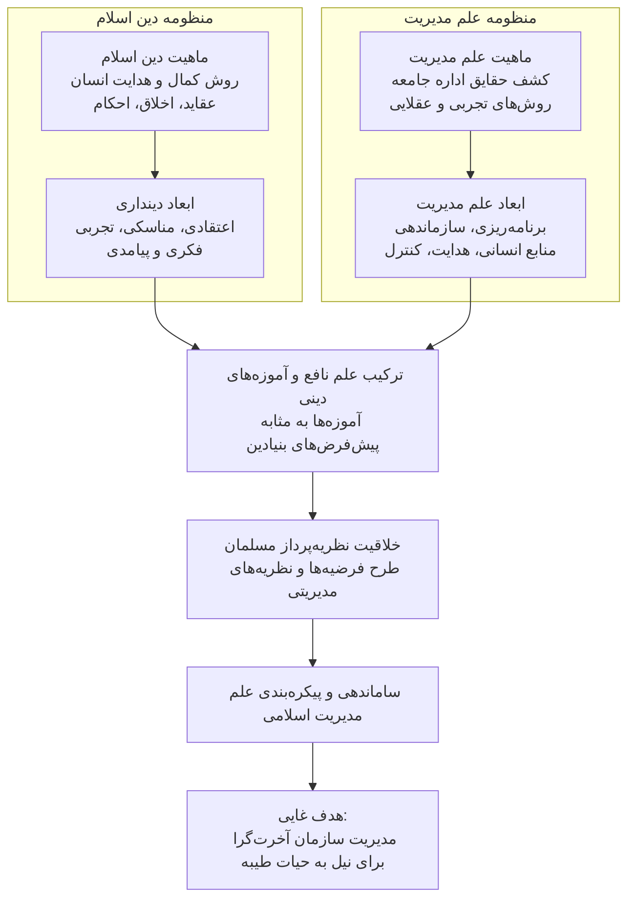

### عناصر کلیدی مدل فرآیندی:
1. **آموزه‌های اسلامی به مثابه پیش‌فرض:** گزاره‌های وحیانی مبنای هستی‌شناسی و جهت‌گیری ارزشی نظریه‌پرداز را تشکیل می‌دهند.
2. **نقش خلاقیت نظریه‌پرداز:** عالم مسلمان با تکیه بر اصول ثابت وحی و درک مسائل متغیر زمانه، دست به فرضیه‌سازی و طراحی الگوهای کاربردی می‌زند.
3. **افق نهایی:** ایجاد سازمان‌های آخرت‌گرایی که کارایی دنیوی را پلی برای نیل به کمال معنوی و حیات طیبه قرار می‌دهند.

---

## ۳. ماهیت علم مدیریت و شاخص‌های علم نافع (مقیمی، ص ۶۸-۷۰)

در گذشته مدیریت صرفاً به عنوان یک مهارت تجربی و غیرقابل انتقال تلقی می‌شد؛ اما امروزه دارای اصولی مدون و نظام‌مند است که واجد تمامی شاخص‌های یک رشته علمی معتبر می‌باشد:

### شاخص‌های پنج‌گانه علمی بودن مدیریت:
1. **کاربرد عام و جهان‌شمول:** چنان‌که فردریک وینسلو تیلور (پدر مدیریت علمی) بیان می‌کند، اصول بنیادین مدیریت برای تمام فعالیت‌های انسانی (از ساده‌ترین کارهای فردی تا اداره عظیم‌ترین ابرشرکت‌ها) کاربرد دارد.
2. **بدنه سازمان‌یافته دانش:** مجموعه‌ای منسجم از مفاهیم، قواعد و نظریه‌ها که در طول قرن‌ها توسط مدیران، اندیشمندان و فلاسفه گردآوری شده است.
3. **روابط علی و معلولی:** تبیین نظام‌مند پیوندهای میان متغیرهای مستقل و وابسته (همانند رابطه میان جانمایی نامناسب کارخانه و کاهش بهره‌وری).
4. **اعتبار و قابلیت آزمون‌پذیری و پیش‌بینی:** قواعد مدیریت در بوته آزمایش عملی راستی‌آزمایی شده و توانایی پیش‌بینی رویدادهای آینده سازمان را به مدیر می‌بخشند.
5. **بهره‌گیری از متدولوژی علمی:** استفاده از روش‌های تحقیق میدانی، پیمایشی و استدلال‌های عقلانی.

### ضرورت فراتر رفتن از ابلاغ احکام؛ مدیریت اجتماعی معصوم و فقیه:
صرف ابلاغ احکام فقهی و مواعظ اخلاقی بدون در دست داشتن زمام مدیریت اجتماعی، هرگز به استقرار جامعه اسلامی نمی‌انجامد. جریان بندگی، عبادات و زیست مؤمنانه زمانی محقق می‌شود که ساختار مدیریت جامعه در اختیار معصوم یا فقیه جامع‌الشرایط قرار گیرد تا بتواند با صدور **احکام حکومتی**، گره‌های عملیاتی و تعارضات منافع را حل‌وفصل نماید.

---

## ۴. حقیقت علم نافع و احکام تکلیفی پنج‌گانه علوم (مقیمی، ص ۶۹-۷۰)

### تعریف علم نافع در نگاه علامه طباطبایی:
علامه طباطبایی علم نافع را نوری می‌داند که معرفت الهی، ایمان قلبی و درک اسما و صفات پروردگار را در وجود انسان شکوفا سازد. از این چشم‌انداز:
- هر دانشی که انسان را در مسیر کمال و تقرب الی‌الله یاری رساند، **علم نافع** است.
- اگر دانشی اثری در هدایت و تسهیل مسیر کمال نداشته باشد، **علم غیرنافع** است.
- اگر دانشی مایه گمراهی، غرور، تباهی و بازماندن انسان از غایت آفرینش شود، **علم ضارّ (زیان‌بار)** است.

> [!important] طبقه‌بندی فقهی علوم بر اساس احکام تکلیفی پنج‌گانه
> در شریعت اسلام، فراگیری علوم بر حسب اثرات اجتماعی و فردی آنها به ۵ دسته تقسیم می‌شود:
> 1. **علم واجب:** دانشی که مقدمه حیات مادی یا معنوی انسان است؛ بر دو قسم است:
>    - **واجب عینی:** فراگیری اصول عقاید و احکام مبتلابه فردی بر تک‌تک مکلفان.
>    - **واجب کفایی:** علومی که جامعه برای حفظ کیان، عزت، سلامت و نظام اجتماعی خود به آنها نیازمند است (مانند علوم دفاعی، پزشکی، و علم سازمان و مدیریت).
> 2. **علم مستحب:** دانشی که سبب ارتقای سطح رفاه و تعالی مادی و معنوی جامعه می‌شود، اما عدم فراگیری آن اختلال حادی در نظام زندگی ایجاد نمی‌کند.
> 3. **علم حرام:** هر دانشی که ذاتاً تباه‌کننده، مفسده‌انگیز و زیان‌بار برای فرد یا جامعه باشد (نظیر سحر، کهانت و علوم ویرانگر).
> 4. **علم مکروه:** دانشی که فسادزایی مستقیمی ندارد، اما سود و ثمره مثبتی نیز بر آن مترتب نیست و سبب اتلاف عمر می‌شود.
> 5. **علم مباح:** دانش‌هایی که برای رفع نیازهای معمول و کسب درآمد آموخته می‌شوند، بدون آنکه قصد قربت یا نیت خدمت الهی در آنها مدنظر باشد.

---

## ۵. نقادی نگرش پوزیتیویستی و دیدگاه آیت‌الله جوادی آملی در باب علم دینی (مقیمی، ص ۷۰-۷۱)

یکی از لغزش‌های اساسی فلاسفه مادی و پوزیتیویست‌ها، انحصار ابزار شناخت در حس و تجربه و انکار ساحت ماوراءطبیعت است. 

### مغالطه معرفت‌شناختی علم تجربی مادی:
اگر عقل حسی و تجربی با آزمایش‌های مکرر کشف کند که پدیده الف از مسیر مشخصی حاصل می‌شود، تنها مجاز است بگوید این مسیر آزموده شده است؛ اما علم تجربی به لحاظ منطقی هرگز نمی‌تواند ادعا کند که مسیر دیگری وجود ندارد یا ساحت غیب و مجاری غیرمادی وجود خارجی ندارند. **ناتوانی در اثبات تجربی یک پدیده، هرگز به معنای اثبات عدم آن پدیده نیست.**

### رفع توهم تعارض علم و دین در اندیشه آیت‌الله جوادی آملی:
آیت‌الله جوادی آملی ریشه توهم تعارض علم و دین را ناشی از یک خطای تعریفی بزرگ می‌داند:
1. **منشأ توهم:** محدود کردن دین به **نقل** (قرآن و روایات) و در نقطه مقابل، قرار دادن دستاوردهای عقل حسی، تجربی و فلسفی در خارج از دایره دین.
2. **حقیقت عقل:** عقل در کنار نقل، خود یکی از چراغ‌ها و **کاشفان شریعت** است. بنابراین آنچه عقل سلیم برهانی و تجربی به یقین اثبات می‌کند، جزئی از تفسیر جهان خلقت الهی است، نه رقیب دین.
3. **طبیعت در برابر خلقت:** پوزیتیویسم جهان را طبیعت خودبسنده می‌انگارد، در حالی که در نگرش توحیدی، کل گیتی **خلقت** است که مبدأ فاعلی و غایی آن ذات اقدس الهی است («هُوَ الأوَّلُ وَ الآخِرُ»).
4. **عیب ساختاری علم تجربی سکولار:** علم تجربی موجود معیوب است؛ زیرا حرکتی صرفاً افقی دارد، نه مبدأ را می‌بیند و نه فرجام را، و دانشی را که کشف می‌کند عطیه الهی نمی‌شمارد. برای اصلاح این نقیصه:
   - علم باید حدود مرزهای معرفتی خویش را بشناسد و بر مبنای یافته‌های حسی ادعای ارائه جهان‌بینی همه‌جانبه نکند؛ چرا که وظیفه جهان‌بینی بر دوش وحی و عقل فلسفی است.
   - ماهیت معرفت تجربی باید بازتعریف شود تا کشفیات تجربی، مطالعه کتاب تکوین خداوند تلقی گردد.

---

## ۶. تبیین ماهیت و ارکان سه‌گانه دین (مقیمی، ص ۷۱)

### تعریف مفهومی دین:
دین مجموعه‌ای منسجم و هماهنگ از عقاید، اخلاق، قوانین و احکام عملی است که از سوی پروردگار برای اداره شایسته امور فردی و اجتماعی و تربیت انسان‌ها نازل شده است.

### ارکان سه‌گانه دین:
1. **عقاید (اصول دین):** باورهای بنیادین پیرامون مبدأ، معاد، نبوت، امامت و عدل که زیربنای فکری رفتار را می‌سازند.
2. **اخلاق:** ملکات نفسانی و ارزش‌های درونی حاکم بر انگیزش‌ها و تعاملات فرد با خدا، خود، جامعه و طبیعت.
3. **احکام:** دستورالعمل‌های فقهی و حقوقی که بایدها و نبایدهای رفتاری و سازمانی را تنظیم می‌کنند.

> [!tip] نکته برجسته کنکوری: منابع ادراک دین
> قرآن کریم به تنهایی تمامیت اسلام را تشکیل نمی‌دهد؛ بلکه **مجموع قرآن، روایات معتبر معصومین و عقل قطعی**، به عنوان حجت‌های شرعی و معرف احکام الهی شناخته می‌شوند. همچنین دین خدا از حضرت آدم تا پیامبر خاتم یکی بوده و تغییر شرایع آسمانی صرفاً در فروع و احکام اجرایی متناسب با تکامل ظرفیت زمانی و اجتماعی بشر رخ داده است.

---

## ۷. تکامل تاریخی شرایع آسمانی و وحدت جوهری دین (مقیمی، ص ۷۲)

از دیدگاه شهید مطهری، تفاوت میان پیامبران در سطح تعلیمات بوده است، نه در ماهیت دین. این تفاوت به موازات تکامل ظرفیت ذهنی و اجتماعی بشر شکل گرفته است؛ همانند دانش‌آموزی که سال به سال از پایه‌های ابتدایی تا مدارج عالی پیش می‌رود. تمامی انبیای الهی یک مکتب واحد را تبلیغ کرده‌اند و به همین دلیل قرآن کریم واژه دین را همواره به صورت مفرد به کار برده و هرگز از کلمه ادیان استفاده نکرده است.

### تمایز ظریف تدین و دین در کلام آیت‌الله جوادی آملی:
- **دین الهی (وحیانی):** ریشه در ساحت قدسی و غیب دارد، مبنای آن وحی و عقل کاشف است و انسان مصرف‌کننده و پذیرنده آن است، نه سازنده و قانون‌گذار.
- **تدین:** فعل و صفت انسان در گرایش به دین و اجرای فرامین الهی است. نباید خطاهای مؤمنان در مرحله تدین را به حساب نقص در دین گذاشت.

### تثلیث علوم متکفل ابعاد دین:
| ساحت دین | محتوا و کارکرد | علم متکفل در تمدن اسلامی |
|:--- |:--- |:--- |
| **۱. عقاید** | باورهای توحیدی، معاد، نبوت و فلسفه هستی | **علم کلام** |
| **۲. اخلاقیات** | تبیین فضایل و رذایل، تهذیب نفس و مکارم رفتاری | **علم اخلاق** |
| **۳. احکام** | مقررات حقوقی، مدنی، اقتصادی، سیاسی و سازمانی | **علم فقه** |

> [!note] دیدگاه متفکران معاصر در باب ارکان دین
> - **علامه طباطبایی:** دین را «روش زیست و کمال انسان» تعریف می‌کند.
> - **شهید مطهری:** دین را «شاهراه جامع هدایت» می‌نامد.
> - **علامه محمدتقی جعفری:** دین را استوار بر دو رکن می‌داند: ۱) اعتقاد به خداوند یکتا، عدالت و نظارت فراگیر او، ۲) برنامه‌ریزی حرکت به سوی مقصد (احکام و تکالیف).
> - **امام خمینی و آیت‌الله جوادی آملی:** «ولایت الهی و حکومت صالحان» را رکن اصلی دین دانسته و سایر احکام و مناسک را فروع و ابزارهای تحقق ولایت برمی‌شمارند.

---

## ۸. ابعاد پنج‌گانه دینداری و طبقه‌بندی مخاطبان ابن‌رشد (مقیمی، ص ۷۳-۷۴)

جامعه‌شناسان دین (از جمله مدل گلاک و استارک) دینداری را واجد پنج بعد متمایز می‌دانند که در تحلیل رفتار سازمانی کارکنان متدین نیز کاربرد دارد:
1. **بعد اعتقادی:** باورهای قلبی که خود به سه لایه تقسیم می‌شوند:
   - *باورهای پایه‌ای و مسلّم:* اقرار به وجود، یگانگی و صفات ذات باری‌تعالی.
   - *باورهای غایت‌گرا:* فهم فلسفه آفرینش انسان، جهان آخرت و هدف زندگی.
   - *باورهای زمینه‌ساز:* پذیرش اصول اخلاقی و روش‌های شایسته‌ای که انسان را به اهداف غایی می‌رسانند.
2. **بعد مناسکی (عمل دینی):** التزام به آداب و مناسک معین شریعت همچون نماز، روزه، حج و فرایض عبادی.
3. **بعد تجربی (عواطف دینی):** احساس پیوند شهودی، وجد معنوی و ارتباط عاشقانه با خداوند متعال.
4. **بعد فکری (دانش دینی):** میزان آگاهی، اطلاعات و بینش پیرامون معارف کتاب و سنت.
5. **بعد پیامدی (آثار عینی):** تجلی ارزش‌ها و اخلاق دینی در تعاملات روزمره، تعهد کاری، وجدان حرفه‌ای و رفتارهای اجتماعی.

### طبقه‌بندی سه‌گانه مخاطبان دین از نگاه ابن‌رشد:
ابن‌رشد اندلس بر پایه آیه ۱۲۵ سوره نحل («ادْعُ إِلَىٰ سَبِيلِ رَبِّكَ بِالْحِكْمَةِ وَالْمَوْعِظَةِ الْحَسَنَةِ ۖ وَجَادِلْهُم بِالَّتِي هِيَ أَحْسَنُ»)، مخاطبان را به سه گروه تفکیک می‌کند و هشدار می‌دهد که رعایت نکردن سطح درک مخاطب، سبب گریز از دین می‌شود:
- **۱. خطابیون (اهل خطابه):** عامه مردم که پایه‌های ایمانشان بر اساس مقبولات ظاهری نصوص، موعظه‌های دلنشین و تمثیل‌های ملموس شکل می‌گیرد.
- **۲. اهل جدل:** کسانی که با استناد به مشهورات و برهان‌های جدلی به تأویل نصوص می‌پردازند، کانون تمرکزشان غلبه بر رقیب فکری است و غالباً با ابزارهای قدرت سیاسی پیوند می‌خورند.
- **۳. اهل برهان:** خردورزان ژرف‌اندیشی که با استدلال‌های عقلی قطعی و نگاه به مقاصد شریعت، به باطن و حقیقت نصوص دست یافته و از تمسک به ظواهر فراتر می‌روند.

---

## ۹. مدل‌های چهارگانه نسبت علم و دین (مقیمی، ص ۷۴-۷۵)

در تحلیل چگونگی تعامل علم و دین، چهار الگوی پارادایمی وجود دارد:

```mermaid
flowchart TD
    subgraph مدل‌های_ارتباط_علم_و_دین
        M1["۱. مدل تعارض<br>ناسازگاری ذاتی و نزاع آشتی‌ناپذیر"]
        M2["۲. مدل تفکیک<br>جدایی کامل زبان و قلمرو"]
        M3["۳. مدل ترکیبی<br>کاهش تمایزات و امتزاج مضامین"]
        M4["۴. مدل تکمیلی<br>دو بال مستقل برای کشف حقیقت واحد"]
    end
```

1. **مدل تعارض:** ادعایی تجویزی و تقلیل‌گرایانه که علم و دین را در نبردی بی‌پایان می‌بیند؛ گزاره‌های علمی، مدعیات دینی را رد می‌کنند یا برعکس.
2. **مدل تفکیک:** علم و دین دو قلمرو کاملاً بیگانه و مستقل از یکدیگرند. علم به واقعیات فیزیکی و پرسش از «چگونگی» امور پاسخ می‌دهد، در حالی که دین متولی ارزش‌ها، اخلاق و پاسخ به «چرایی» و معنای حیات است.
3. **مدل ترکیبی:** تلاشی برای کم‌رنگ کردن مرزها و استفاده از دستاوردهای علمی در تبیین گزاره‌های ایمانی یا به‌کارگیری مفاهیم دینی در فرمول‌بندی تئوری‌های علمی.
4. **مدل تکمیلی:** علم و دین مکمل یکدیگر در کشف دو روی یک سکه‌اند. هیچ تضادی میان آن دو نیست؛ بلکه وحی افق‌های معنایی را روشن می‌سازد و علم ابزارهای تحقق عینی را مهیا می‌کند.

---

## ۱۰. تقابل بنیادین رویکرد دین حداقلی و دین حداکثری (مقیمی، ص ۷۵)

یکی از محوری‌ترین چالش‌های معرفتی در مدیریت اسلامی، دامنه اختیارات شریعت در سازمان‌دهی حیات دنیوی است:

| مؤلفه مقایسه | دیدگاه دین حداقلی (سکولار) | دیدگاه دین حداکثری (جامعیت اسلام) |
|:--- |:--- |:--- |
| **قلمرو رسالت پیامبران** | منحصر به امور معنوی و سعادت اخروی | هدایت فراگیر مادی و معنوی، دنیوی و اخروی |
| **نظام معیشت و مدیریت** | واگذاری مطلق به علوم تجربی و عقل بشری | لزوم اداره جامعه بر پایه موازین توحیدی و عدالت |
| **احکام حکومتی و ولایت** | نفی ضرورت صدور احکام الزام‌آور اداری از سوی دین | لزوم سرپرستی فقیه و صدور احکام حکومتی پویا |
| **نقش دین در سازمان** | نهایتاً نظارت اخلاقی منفعل و توصیه‌ای | تعیین هدف، خط‌مشی‌گذاری و هدایت فرایندهای ساختاری |
| **چهره‌های شاخص** | جریان‌های روشنفکری سکولار | امام خمینی، علامه طباطبایی، شهید مطهری |

> [!important] نقد مبنایی دیدگاه دین حداقلی
> در دیدگاه دین حداقلی، به دلیل جدا انگاشتن سیاست و مدیریت از دیانت، مفهوم «احکام حکومتی» و مدیریت جامعه توسط رهبر الهی بی‌معنا می‌شود؛ در حالی که بدون ابزار حکومت و مدیریت سازمان‌ها، عدالت اجتماعی و صیانت از ارزش‌های اخلاقی ناممکن خواهد بود.

---

## ۱۱. قرائت‌های سه‌گانه درون رویکرد دین حداکثری (مقیمی، ص ۷۶)

طرفداران دین حداکثری خود به سه طیف فکری تقسیم می‌شوند:

### ۱. حداکثری بودن گزاره‌های دینی (اخباری‌گری جدید):
- معتقدند در آیات و روایات برای تمام پدیده‌ها (از کوچک‌ترین ابزارها تا پیچیده‌ترین علوم مهندسی و اداری) گزاره و متن صریح وجود دارد و اگر جستجو کنیم، نام و نشان همه چیز را در نصوص می‌یابیم.
- *اشکال تستی:* این رویکرد ظاهرگرایانه و افراطی، علم را از پویایی تهی ساخته و عقل اجتهادی را تعطیل می‌کند.

### ۲. حداکثری بودن عقل و نقل (دیدگاه اصولی و اجتهادی جامع):
- معتقدند دین جامع و کامل است، اما این کمال **صرفاً از طریق متون نقلی تأمین نمی‌شود**، بلکه **عقل برهانی در کنار نقل**، رکن معرفت دینی است.
- اگر برای پدیده‌ای نص خاص وارد نشده باشد، حجت عقلی کاشف حکم الهی است؛ چنان‌که قاعده ملازمه تصریح دارد: «کُلَّما حَکَمَ بِهِ العَقلُ حَکَمَ بِهِ الشَّرع».
- بنابراین حداکثری بودن به مدد پیوند ارگانیک عقل و نقل محقق می‌شود.

### ۳. حداکثری بودن هدایت دینی:
- دین تمام نیازهای سعادت‌آفرین بشر را در قالب اصول بنیادین، ارزش‌های عام، اهداف کلان و مقاصد الشریعه تبیین کرده است.
- تعیین روش‌های جزئی و تکنیک‌های متغیر اجرایی به خردورزی عقلانی و اجتهاد زمان‌آگاه واگذار شده تا فروع متغیر از دل اصول ثابت استخراج شوند.

### ادله اثبات رویکرد دین حداکثری:
- **برهان عقلی:** انسان برای رسیدن به کمال نهایی در تمام ابعاد وجودی خود نیازمند هدایت وحیانی است؛ رها کردن بخش اعظم حیات اجتماعی و سازمانی بشر بدون راهنمای الهی با حکمت خالق ناسازگار است.
- **برهان نقلی:** دامنه دین هم‌سنگ با **دامنه عبادت** است؛ و از آنجا که در منطق قرآن تمام افعال انسان مؤمن می‌تواند صبغه عبادی به خود بگیرد، قلمرو شریعت نیز تمام عرصه‌های مدیریتی و زیستی را در بر می‌گیرد.

---

## ۱۲. پیوند ارگانیک دین، عبادت و عدالت (مقیمی، ص ۷۷)

برای ترسیم مرزهای واقعی قلمرو دین در سازمان و جامعه، قرآن کریم دو شاخص بنیادین را در کانون توجه قرار می‌دهد: **عبادت** و **عدالت**.
- هر جا ساحت بندگی و عبودیت معنا پیدا کند، دین حضور دارد.
- هر جا احتمال استقرار عدل یا ارتکاب ظلم وجود داشته باشد، رسالت انبیای الهی امتداد می‌یابد.

از آنجا که روابط انسانی درون سازمان‌ها همواره با تصمیم‌گیری‌های توزیعی، تخصیص منابع و تعاملات قدرت آمیخته است، بستر تحقق عدالت یا بروز بی‌عدالتی فراهم است؛ بنابراین دخالت دین در عرصه سازمان و مدیریت امری اجتناب‌ناپذیر است.

---

## ۱۳. فقه حکومتی؛ خاستگاه تئوری‌پردازی در مدیریت اسلامی (مقیمی، ص ۷۷-۷۸)

امام خمینی در تعبیری ماندگار و تستی می‌فرماید: **«فقه، تئوری واقعی و کامل اداره انسان و اجتماع از گهواره تا گور است.»** از این منظر، **علم فقه، خاستگاه بنیادین تئوری‌پردازی در مدیریت اسلامی است.**

### مقایسه تطبیقی دو رویکرد فقهی در تاریخ شیعه:
| مؤلفه | فقه فردی (سنتی) | فقه حکومتی (فقه نظام‌ها / فقه الاداره) |
|:--- |:--- |:--- |
| **هویت مکلف** | صرفاً هویت فردی مسلمانان به عنوان اشخاص حقیقی | **هویت جمعی** مکلفان ذیل حاکمیت نظام اسلامی |
| **افق دید فقیه** | خردنگر، موضعی و محدود به مسائل عبادی فرد | **کل‌نگر، ساختاری و استراتژیک** ناظر به اداره کلان |
| **موضوع فتوا** | طهارت، صلات، صوم و ابواب معاملات خرد | مهندسی نظامات سیاسی، اقتصادی، فرهنگی و اداری |
| **رسالت محوری** | پاسخ به تکالیف شخصی فرد مؤمن | **حل معضلات جامعه و ایجاد بستر حیات طیبه** |

> [!tip] شاه‌بیت فقه حکومتی در نگاه مقام معظم رهبری و کلام علوی
> آیت‌الله خامنه‌ای معتقد است استخراج احکام الهی در تمام شئون اداره کشور با نگرش حکومتی و لحاظ کردن نقش هر تصمیم در شکل‌گیری جامعه نمونه، از بزرگ‌ترین واجبات زمانه است. روش فقه حکومتی، اجتهاد پویا از ادله اربعه (کتاب، سنت، عقل و اجماع) است.
> همچنین در ضرورت تکیه بر فقه در مدیریت، امیرالمؤمنین علی (ع) در نهج‌البلاغه (حکمت ۴۴۷) هشدار می‌دهند: **«مَنِ اتَّجَرَ بِغَیرِ فِقهٍ ارتَطَمَ فِی الرِّبا»** (هر کس بدون آگاهی از ضوابط فقهی وارد تجارت و مدیریت اقتصادی شود، ناخواسته در گرداب رباخواری فرو می‌افتد).

---

## ۱۴. اضلاع چهارگانه علم دینی در منظومه معرفتی اسلام (مقیمی، ص ۷۸-۷۹)

برای تکوین یک علم دینی اصیل، بازتعریف چهار عنصر بنیادین شناخت ضروری است:

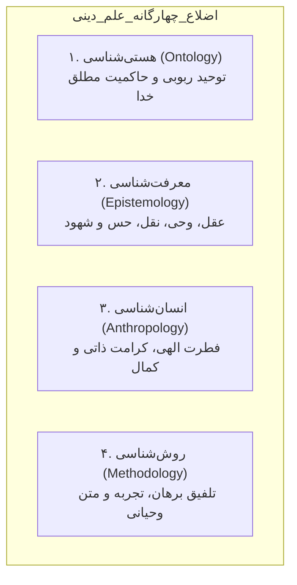

### ۱. هستی‌شناسی (Ontology):
- تعیین‌کننده الهی بودن یا مادی بودن علم است.
- بر محور **توحید ربوبی** می‌چرخد؛ یعنی خداوند هم صاحب **ولایت تکوینی** بر کائنات است و هم صاحب **ولایت تشریعی** در وضع قوانین زیست انسانی. عالم «طبیعت خودبنیاد» نیست، بلکه «خلقت هدفمند» است که مبدأ فاعلی و غایی آن ذات حق است.

### ۲. معرفت‌شناسی (Epistemology):
- راه شناسایی حقیقت شامل شناخت‌های عادی (حس و عقل تجریدی) و غیرعادی (کشف و شهود، الهام و وحی) است.
- **روابط چهارگانه علامه محمدتقی جعفری در قلمرو دین:**
  ۱) رابطه انسان با خویشتن (خودشناسی و تهذیب).
  ۲) رابطه انسان با خدا (بندگی و توحید).
  ۳) رابطه انسان با جهان هستی (امانتداری و عمران زمین).
  ۴) رابطه انسان با همنوعان (عدالت، احسان و مدیریت جمعی).

### ۳. انسان‌شناسی (Anthropology):
- انسان واجد **فطرت الهی** و گرایش درونی به کمال، عدالت و زیبایی است.
- حرکت در مدار فطرت موجب می‌شود انگیزش‌ها و رفتارهای سازمانی انسان متعالی و معنابخش شوند.

### ۴. روش‌شناسی (Methodology):
- روش تجربی نفی نمی‌شود، اما تنها ابزار معتبر پنداشته نمی‌شود.
- روش‌شناسی علم دینی، مجموعه‌ای هم‌افزا از استدلال عقلی، شواهد تجربی و هدایت‌های وحیانی است.

> [!important] قاعده کنکوری محدوده قانون‌گذاری در حکومت دینی
> اساسی‌ترین وظیفه مدیریت در جامعه اسلامی **اجرای قوانین الهی** است. بر این مبنا، مدیران و برنامه‌ریزان بشری تنها در **منطقه مباحات (منطقةالفراغ)** حق سیاست‌گذاری و برنامه‌ریزی دارند و این برنامه‌ها هرگز نباید با احکام الزام‌آور الهی (واجبات و محرمات) تعارض پیدا کند.

---

## ۱۵. دوگانه علم حضوری و حصولی در فلسفه اسلامی (مقیمی، ص ۸۰)

شهید مطهری یادآور می‌شود که ریشه تمام تفاوت‌ها در جهان‌بینی‌ها، به تفاوت در «نظریه شناخت» برمی‌گردد. در فلسفه اسلامی، دانش انسان به دو دسته بنیادین تقسیم می‌شود:

| شاخص | علم حصولی | علم حضوری |
|:--- |:--- |:--- |
| **تعریف** | دریافت غیرمستقیم واقعیت از طریق مفاهیم و صورت‌های ذهنی | دریافت مستقیم و بی‌واسطه خود واقعیت عینی |
| **واسطه شناخت** | صورت ذهنی و مفهوم واسطه است | بدون هیچ‌گونه صورت ذهنی |
| **احتمال خطا** | شک، تردید، مغالطه و خطا در آن راه دارد | **خطاناپذیر** است؛ زیرا خود واقعیت نزد ادراک‌کننده حاضر است |
| **مثال ملموس** | دانستن تعریف تئوریک ترس، عشق، گرسنگی یا خشم | احساس درونی و وجدانی حالت ترس یا عشق در قلب |
| **موطن ادراک** | ذهن، تفکر استنتاجی و انتزاع مفهومی | نفس، جان و ساحت وجودی انسان |

### شیوه‌های سه‌گانه و دوگانه شناخت در نگاه آیت‌الله جوادی آملی:
- **در علم حصولی:** سه ابزار اصلی وجود دارد: ۱) حس و ادله تجربی، ۲) عقل و براهین فلسفی، ۳) نقل و شواهد روایی معتبر.
- **در علم حضوری:** دو مجرا وجود دارد: ۱) کشف و شهود باطنی، ۲) شناخت وحیانی و نبوی.

---

## ۱۶. مکاتب پنج‌گانه معرفت‌شناسی و خاستگاه شناخت (مقیمی، ص ۸۰-۸۱)

### الف) پنج مکتب تاریخ معرفت بر پایه ابزار و منابع شناخت:
1. **مکتب حس‌گرایی (پوزیتیویسم):** ابزار شناخت را منحصراً در حس و تجربه آزمایشگاهی خلاصه می‌کند.
2. **مکتب مشاء (فلسفه مشائی - ارسطو، ابن‌سینا، فارابی):** حس و عقل را می‌پذیرد، اما تکیه‌گاه اصلی آن در مسائل نظری **قیاس برهانی عقلانی** است.
3. **مکتب متکلمان:** عقل را قبول دارند، اما دو تفاوت جوهری با فلاسفه مشاء دارند:
   - اولاً به شدت بر **نقل و متون شرعی** تکیه می‌زنند.
   - ثانیاً فیلسوف در پی کشف حقیقت محض است، اما متکلم از ابتدا هدفش **دفاع از عقاید دینی و اثبات حقانیت مذهب** است.
4. **مکتب اشراق (سهروردی):** علاوه بر استدلال عقلی، **اشراقات قلبی، شهود ذوقی و الهامات معنوی** حاصل از تزکیه نفس را شرط ادراک حقایق می‌داند.
5. **مکتب عرفا (عرفان عملی):** عقل را در درک ژرفای حقایق توحیدی ناتوان دانسته و راه شناخت را منحصراً در **تصفیه درون، سلوک و مجاهدت باطنی** جستجو می‌کند.
- *سنتز حکمت متعالیه ملاصدرا:* تلفیق موزون قرآن، برهان و عرفان؛ ملاصدرا و ملاهادی سبزواری تمام ابزارهای عقل، نقل، حس و شهود را در جایگاه بایسته خود معتبر و هماهنگ می‌دانند.

### ب) خاستگاه شناخت؛ فطری یا تجربی؟
در پاسخ به چگونگی شکل‌گیری داده‌های اولیه در ذهن:
1. **فطرت‌گرایی (عقل‌گرایی پیشینی):** شناخت پیش از تجربه در سرشت انسان به ودیعه نهاده شده است (نظریه یادآوری و مُثُل افلاطون، ایده‌های فطری دکارت، و مقولات پیشینی کانت).
2. **تجربه‌گرایی (پسینی):** ذهن در بدو تولد همانند لوح سفیدی است و تمام مفاهیم از طریق حواس و تماس با دنیای مادی نقش می‌بندند (ارسطو و جان لاک).
3. **فطرت-تجربه‌گرایی (دیدگاه دانشمندان اسلامی):** انسان در بدو آفرینش واجد گرایش‌ها و سرمایه‌های فطری اولیه است که در بستر تجارب و تعامل با جهان عینی شکوفا شده و بارور می‌گردند.

---

## ۱۷. ماتریس تطبیقی ابزارهای شناخت از دیدگاه ۱۰ متفکر تمدن اسلامی (جدول ۱-۲ مقیمی، ص ۸۲)

| اندیشمند اسلامی | ابزارها و روش‌های معرفت و شناخت | کانون تمرکز روش‌شناختی |
|:--- |:--- |:--- |
| **۱. آیت‌الله جوادی آملی** | وحی، کشف و شهود، عقل و براهین فلسفی، نقل و روایات معتبر، روش ریاضی، روش تجربی | جامعیت طولی عقل، نقل و شهود در کشف شریعت |
| **۲. شهید مطهری** | طبیعت (آیات آفاقی)، انسان (آیات انفسی)، تاریخ و سرگذشت اقوام، عقل و اصول فطری، قلب (تزکیه دل)، آثار علمی گذشتگان | تنوع منابع با محوریت قرآن و خردورزی برهانی |
| **۳. ابوریحان بیرونی** | حس، عقل، وحی (دین)، قلب (فؤاد) | پیشگام روش تجربی در پرتو جهان‌بینی توحیدی |
| **۴. ابن‌رشد** | حس و تخیل (مشترک با حیوان)، عقل برهانی (ویژه انسان) | اصالت برهان عقلی در تأویل متون |
| **۵. علامه قطب‌الدین شیرازی**| معرفت عقلی، معرفت حسی، معرفت غیبی-روحانی، معرفت نقلی (شرعی) | سنتز حکمت اشراق و مشاء |
| **۶. سید جعفر کشفی** | حکمت، موعظه، مجادله، استقراء | تطبیق روش‌های معرفت با مراتب سه‌گانه یقین |
| **۷. ابونصر فارابی** | حس، عقل، به همراه «فیض الهی و روح اشراقی» به عنوان منشأ استعلایی | اتصال عقل فعال به فیض قدسی الهی |
| **۸. ابن‌سینا** | ادراک حسی (ضروری برای مقدمات)، تعقل و تفکر (شرط کشف مجهولات) | قیاس برهانی مشائی با تکیه بر تجربه منضبط |
| **۹. محقق اردبیلی** | شناخت حسی، شناخت عقلی، شناخت شهودی | ترکیب اجتهاد فقهی و زهد عرفانی |
| **۱۰. خواجه نصیرالدین طوسی**| استقراء و تجربه (حس)، قیاس (عقل)، نقل و استشهاد (وحی)، تزکیه نفس (دل) | سازمان‌دهی منطقی تمام ابزارهای شناخت |

---

## ۱۸. دوگانه قرآنی «علوم میزبان» و «علوم میهمان» (مقیمی، ص ۸۳)

در قرآن کریم پیرامون دانایی و نادانی انسان در آغاز حیات، دو دسته آیه به ظاهر ناهمخوان به چشم می‌خورد که علامه جوادی آملی با تمایزی درخشان آنها را جمع می‌فرماید:

### دسته اول؛ آیاتی که انسان را همراه با معرفت آغازین می‌دانند:
- روح انسان با فطرت توحیدی آفریده شده و خداوند حسن و قبح، تقوا و فجور را به او الهام فرموده است: «فَأَلْهَمَهَا فُجُورَهَا وَتَقْوَاهَا» (شمس، آیه ۸).
- این دسته ناظر به **معارف حضوری، شهودی و گرایش‌های فطری** (خداجویی، حقیقت‌طلبی و درک زیبایی) هستند.
- **تعبیر جوادی آملی:** این دانش‌ها **علوم میزبان** و صاحب‌خانه اصلی جان و روان انسان هستند که هرگز زایل نمی‌شوند.

### دسته دوم؛ آیاتی که انسان را در بدو تولد فاقد هرگونه علم می‌دانند:
- «وَاللَّهُ أَخْرَجَكُم مِّن بُطُونِ أُمَّهَاتِكُمْ لَا تَعْلَمُونَ شَيْئًا» (نحل، آیه ۷۸) و آیه ۷۰ سوره نحل در باب کهنسالی و فراموشی اندوخته‌ها («لِكَيْ لَا يَعْلَمَ بَعْدَ عِلْمٍ شَيْئًا»).
- این دسته ناظر به **علوم حصولی، تجربی، ریاضی، مهندسی و مدیریت** هستند که انسان در آغاز تولد بهره‌ای از آنها ندارد و با ابزارهای حسی (گوش، چشم و دل) و تعامل با محیط آنها را می‌آموزد.
- **تعبیر جوادی آملی:** این دانش‌ها **علوم میهمان** هستند که در طول عمر به ضیافت ذهن انسان می‌آیند و ممکن است در پیری به فراموشی سپرده شوند.

---

## ۱۹. مسیرهای چهارگانه شناخت و موضع قرآن در برابر روش تجربی (مقیمی، ص ۸۴)

بر پایه تفسیر آیه ۸ سوره حج («وَمِنَ النَّاسِ مَن يُجَادِلُ فِي اللَّهِ بِغَيْرِ عِلْمٍ وَلَا هُدًى وَلَا كِتَابٍ مُّنِيرٍ»)، چهار معبر شناخت در دسترس بشر است:
1. **راه حس:** عمومی‌ترین راه که به روی تمام انسان‌ها گشوده است.
2. **راه عقل:** راهی تخصصی که صرفاً خواص و اهل استدلال توان پیمودن آن را دارند.
3. **راه تهذیب نفس و تزکیه باطن:** شاهراه عرفانی که به روی پاکان و اولیای الهی باز است.
4. **راه کتاب منیر و وحی الهی:** ویژه انبیای معصوم الهی.

> [!important] تمایز کلیدی کنکوری راه سوم و چهارم
> میان مسیر تهذیب باطن (عرفان) و مسیر وحی نبوی تفاوت جوهری در جنس شهود نیست، جز یک مرز تعیین‌کننده: **راه وحی نبوی با ملکه «عصمت» همراه بوده و مطلقاً از هرگونه خطا، نسیان و لغزش مصون است**؛ در حالی که شهود عارفان ممکن است با وسوسه‌ها یا خطا در تعبیر آمیخته شود.

### نگاه قرآن به تجربه حسی؛ امر به سیر در زمین:
قرآن کریم هرگز منکر اعتبار علم حسی نیست، بلکه مکرراً مؤمنان را به کاوش تجربی و مطالعات تاریخی فرا می‌خواند: **«قُلْ سِيرُوا فِي الْأَرْضِ فَانظُرُوا...»** (سوره آل عمران، آیه ۱۳۷؛ سوره انعام، آیه ۱۱؛ سوره عنکبوت، آیه ۲۰). 
اما تفاوت نگاه قرآن با پوزیتیویسم در این است که قرآن تجربه را در بستر نظام تکوین و در پیوند با مبدأ و معاد تفسیر می‌کند، نه به مثابه واقعیتی کور و خودبسنده.

---

## ۲۰. مراتب سه‌گانه یقین و روش‌های معرفت‌شناسی کشفی (مقیمی، ص ۸۵)

سید جعفر کشفی در یک مدل معرفتی ژرف، چهار روش شناخت را با مراتب سلوک و یقین تطبیق می‌دهد:

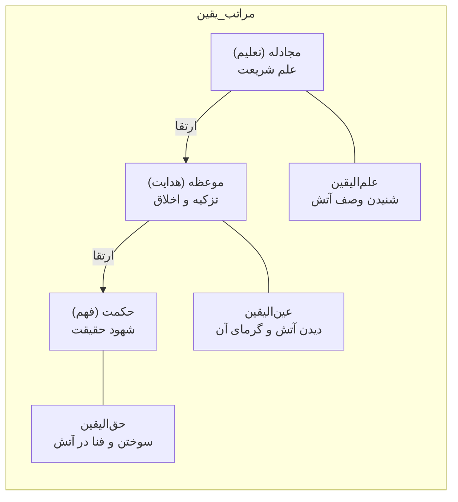

| روش کشفی | معادل روایی و قرآنی | مرتبه یقین متناظر | تمثیل آتش | قلمرو و کارکرد |
|:--- |:--- |:--- |:--- |:--- |
| **۱. مجادله** | **تعلیم** (علم شریعت) | **علم‌الیقین** | کسی که وصف آتش و خاصیت سوزانندگی آن را از دیگران شنیده است | استدلال‌های مفهومی و کلامی |
| **۲. موعظه** | **هدایت** (تزکیه نفس) | **عین‌الیقین** | کسی که آتش را از دور دیده و گرمای مطبوع آن را با حواس خود لمس کرده است | تهذیب اخلاق و موعظه دل |
| **۳. حکمت** | **فهم** (حقیقت‌شناسی) | **حق‌الیقین** | کسی که درون آتش رفته، سوخته و حقیقت آتش با وجودش یکی شده است | شهود باطنی و معرفت قلبی |
| **۴. استقراء** | مشاهده و توصیف طبیعت | مشترک بین مؤمن و کافر | مشاهده اثرات مادی عناصر | کشف روابط فیزیکی بدون نگاه توحیدی |

---

## ۲۱. منظومه پنج‌گانه روش‌شناسی مطالعات مدیریت اسلامی (نمودار ۲-۲ مقیمی، ص ۸۶)

در پژوهش‌های مدیریت اسلامی، پنج روش علمی به صورت طولی و هم‌افزا به کار گرفته می‌شوند:

```mermaid
flowchart TD
    subgraph روش‌شناسی_جامع_مدیریت_اسلامی
        W["۱. روش وحیانی<br>دستیابی به علم یقینی، ثابت و مصون از خطا<br>ترسیم جهان‌بینی و اهداف غایی"]
        N["۲. روش نقلی<br>استخراج قواعد و سیره عملی معصومین<br>انطباق با کتاب و سنت"]
        A["۳. روش عقلی<br>تدوین اصول کلی، قیاس برهانی<br>تبیین حوزه شمول احکام و گزاره‌ها"]
        S["۴. روش شهودی<br>الهامات باطنی، امدادهای غیبی<br>تقوای اداری و بصیرت مدیریتی"]
        T["۵. روش تجربی<br>استقراء، پیمایش‌های میدانی و مشاهده عینی<br>کشف روابط علّی سازمانی و کارایی عملیاتی"]
    end

    W --> A
    N --> A
    S --> A
    T --> A
    A --> OUT["الگوی جامع مدیریت اسلامی سازمان"]
```

> [!important] قاعده کنکوری رابطه روش‌های پنج‌گانه
> اقسام و روش‌های شناخت در مدیریت اسلامی **در عرض هم و در تعارض با یکدیگر نیستند**؛ بلکه رابطه‌ای **طولی، انفکاک‌ناپذیر و پیوسته** دارند. به عنوان مثال:
> - در مکتب مشاء، ترکیب روش «حسی» و «عقلی» حاکم است.
> - در مکتب اشراق، ترکیب روش «عقلی» و «شهودی» میدان‌دار است.
> - در مدیریت اسلامی، عقل به عنوان تنظیم‌کننده و قاضی، داده‌های تجربی، رهنمودهای نقلی و افق‌های وحیانی را در یک سامانه کارآمد ترکیب می‌نماید.

---

## ۲۲. کالبدشکافی روش وحیانی؛ ملکه روش‌های شناخت (مقیمی، ص ۸۷)

در سلسله‌مراتب روش‌شناسی معرفت اسلامی، روش وحیانی در بالاترین مرتبه قرار دارد و به منزله «سلطان و ملکه همه اشکال معرفت» شناخته می‌شود.

### الف) ویژگی‌های بنیادین معرفت وحیانی:
۱. **عینیت و خطاناپذیری مطلق:** عالی‌ترین روش شناخت آن است که انسان را مستقیماً به مقصد برساند بدون آنکه ذره‌ای شک، وهم یا خیال در آن راه یابد.
۲. **عصمت سه‌گانه انسان معصوم:** انسان معصوم تحت تدبیر مستقیم ذات اقدس الهی است؛ لذا در سه مرحله از لغزش مصون است:
   - **فهم درست** حقایق.
   - **حفظ کامل** پیام بدون فراموشی (نسیان).
   - **انشای صحیح** و ابلاغ بی‌نقص آن به مردم.
۳. **ترازوی سنجش سایر علوم:** همه معرفت‌های آسیب‌پذیر بشری (اعم از تجربی، عقلی یا شهودی) باید به معرفت وحیانی عرضه شده و با آن وزن و سنجیده شوند.
۴. **شاهد نهج‌البلاغه:** امیرالمؤمنین علی (ع) در خطبه ۹۷ می‌فرمایند: **«وَ إِنِّي لَعَلَى بَيِّنَةٍ مِنْ رَبِّي»** (همانا من از سوی پروردگارم دارای دلیلی روشن و آشکار هستم).

### ب) تمایز ژرف الفاظ و مضامین وحی (دیدگاه آیت‌الله جوادی آملی):
- **عینیت الفاظ و معانی:** در قرآن کریم، هم الفاظ و هم معانی مستقیماً وحی الهی هستند. هنگامی که یک انسان عادی قرآن می‌خواند، الفاظ عین وحی است؛ اما **فهم مفسر، متکلم و فیلسوف هرگز با فهم پیامبر (ص) و اهل‌بیت (ع) قابل مقایسه نیست**.
- **انحصار عمق وحی در معصومان:** محتوا و ژرفای حقیقی وحی فقط در دسترس گیرندگان معصوم آن قرار دارد؛ چرا که پیامبران همانند «دستگاه‌های گیرنده اختصاصی» در پیکره بشریت تعبیه شده‌اند.

### ج) نظریه ثبات وحی و نظریه مدیریتی ابوریحان بیرونی:
- ابوریحان بیرونی معتقد است **وحی بر خلاف عقل دارای ثبات و بقاء است**؛ زیرا منشأ آن ماورای عقول متغیر بشری است.
- **تفکیک ثابت و متغیر:** وحی متکفل اصول ثابت و مبانی زیست بشر است، در حالی که عقل متکفل فروع و متغیراتی است که در بستر زمان تکامل می‌یابد.
- **نظریه پیوند ملک و دین بیرونی:** از نگاه بیرونی، «سیرت فاضل همان است که دین آن را بایسته گرداند» و زندگی سیاسی و مدیریتی جامعه در صورتی به کمال می‌رسد که **ملک و دین با یکدیگر پیوند خورند (اجتماع ملک و دین)**.

---

## ۲۳. روش شهودی و عرفانی؛ قلب به مثابه کانون ادراک حضوری (مقیمی، ص ۸۷-۸۸)

پس از وحی معصومانه، عالی‌ترین روشی که می‌تواند گره‌های جهان‌بینی را بگشاید، روش کشف و شهود عارفانه است.

### الف) دوگانه شهود صادق و شهود کاذب:
| نوع شهود | منشأ و ماهیت | ویژگی و حکم شناختی |
|:--- |:--- |:--- |
| **شهود کاذب** | هوای نفس، خیالات و القائات شیطانی | باطل و گمراه‌کننده؛ همانند خواب‌های پریشان و توهمات فردی |
| **شهود صادق** | القائات ملکی، رحمانی و حقایق عینی | معرفت‌بخش و حقیقی؛ ادراک باطنی نظم پنهان هستی |

> [!important] معیار تمایز شهود صادق از کاذب (نکته تستی کلیدی)
> ترازوی سنجش و تفکیک شهود صادق از کاذب، **کشف انسان کامل معصوم (ع)** است. از آنجا که کشف معصوم با متن واقع پیوند دارد و مصون از خطاست، هر شهود عارفی تنها در صورتی معتبر است که با میزان معصوم هماهنگ باشد.

### ب) قلب؛ ابزار معرفت حضوری:
- در معرفت‌شناسی اسلامی، «قلب (فؤاد)» ابزاری عقل‌گریز نیست، بلکه **ابزاری فرارعقلانی** است.
- انسان از طریق تزکیه باطن، تقوا و صفا بخشیدن به دل، به سروش‌های غیبی و الهاماتی دست می‌یابد که پای حس و عقل استدلالی به آن نمی‌رسد.
- معرفت قلبی از سنخ **علم حضوری** است و از آنجا که واقعیت مستقیماً پیش روی نفس حاضر می‌شود، خطا در ادراک آن راه ندارد (خطا صرفاً هنگام تفسیر مفهومی آن به علم حصولی رخ می‌دهد).
- **دیدگاه ابوریحان بیرونی:** بیرونی راه وصول به حقایق قلبی را متکی بر «وجدان نورانی و وجود اشراق‌یافته» می‌داند که بر خلاف سایر علوم، منحصراً از مسیر **زهد و پارسایی** به دست می‌آید.

---

## ۲۴. روش نقلی و تفکیک حیاتی «وحی» از «نقل» (مقیمی، ص ۸۸-۸۹)

روش نقلی، پل ارتباطی توده انسان‌ها با سرچشمه دست‌نیافتنی وحی است. از آنجا که آحاد بشر به وحی مستقیم دسترسی ندارند، باید از شواهد روایی معتبر و نصوص منقول بهره گیرند.

### شروط و آسیب‌شناسی روش نقلی:
۱. **شرط اساسی منقول‌عنه:** نقل تنها در صورتی دارای حجیت و سندیت است که «منقول‌عنه» حتماً **معصوم و حجت الهی** باشد.
۲. **تفکیک مفهومی وحی از نقل (دام تستی پرتکرار):**
   - **وحی:** متن پیوند مستقیم معصوم با عالم غیب است و **مطلقاً خطاناپذیر** است.
   - **نقل:** عبارت است از **فهم و ادراک بشر از متون وحیانی** که در قالب اسناد تاریخی و متون روایی به ما رسیده است.
   - بنابراین، علم نقلی همانند علم عقلی **در معرض خطا، سوءفهم، تصحیف و آسیب‌های بشری** قرار دارد و نباید آن را با خود وحی یکسان انگاشت.
۳. **جایگاه حکیم در برابر پیامبر (آیت‌الله جوادی آملی):**
   - هیچ‌گاه نباید عقل را در برابر وحی، یا فیلسوف و حکیم را در برابر پیامبر قرار داد.
   - در منظومه توحیدی، تمام حکما و دانشمندان **رعیت ساحت وحی پیامبر (ص)** هستند؛ زیرا وحی سلطان علوم است و عقل در پرتو هدایت وحی بالنده می‌شود.

---

## ۲۵. روش عقلی و سطوح سه‌گانه درک فلسفی (مقیمی، ص ۸۹-۹۰)

عقل، ممیّز بنیادین انسان از حیوان و چراغ هدایت اندیشه است. در حالی که حس با امور جزئی سر و کار دارد، عقل وظیفه ارتقای ادراکات جزئی به کلیات و نظام‌سازی را بر عهده دارد.

```mermaid
flowchart TD
    subgraph سطوح_سه‌گانه_ادراک_عقلی
        L1["۱. شناخت تغایری<br>نازل‌ترین سطح: درک تفاوت‌ها و اختلافات ظاهری پدیده‌ها"]
        L2["۲. شناخت تغییری<br>سطح میانی: درک روند تحولات و تغییرات پدیده در طول زمان"]
        L3["۳. شناخت علّی<br>عالی‌ترین سطح: کشف علل، عوامل و چرایی دگرگونی‌ها"]
    end
    L1 --> L2 --> L3
```

### الف) سطوح سه‌گانه فهم عقل:
۱. **شناخت تغایری (پایین‌ترین سطح):** تشخیص شباهت‌ها و تفاوت‌های میان اشیاء و پدیده‌ها.
۲. **شناخت تغییری:** تحلیل فرایند دگرگونی، حرکت و صیرورت یک پدیده در یک دوره زمانی مشخص.
۳. **شناخت علّی (عمیق‌ترین سطح):** شناسایی زنجیره علل و اسباب فاعلی و غایی پدیده‌ها.

### ب) جایگاه عقل و نقل نسبت به قانون‌گذاری الهی:
- **عقل و نقل «کاشف» هستند نه «مُقنِّن»:** نه عقل و نه نقل هیچ‌کدام واضع قانون نیستند؛ قانون‌گذار انحصاری خداوند متعال است و وظیفه عقل و نقل، کشف قوانین الهی است.
- **تأویل نقلیات با عقل برهانی:** هرگاه ظاهر یک نقل با حکم قطعی و صریح عقل ناسازگار باشد (مانند آیه «یَدُ اللَّهِ فَوْقَ أَيْدِيهِمْ»)، به حکم عقل، ظاهر آیه تأویل برده می‌شود تا تجسیم و نقص از ساحت حق نفی گردد.
- **فلسفه بعثت و شوراندن عقل:** بر اساس کلام امیرالمؤمنین (ع)، هدف بعثت انبیا شکوفا کردن عقل‌هاست: **«وَ يُثِيرُوا لَهُمْ دَفَائِنَ الْعُقُولِ»** (تا گنجینه‌های پنهان خرد آدمیان را برانگیزند). عقل همانند معدنی پر از گوهر است که پیامبران با انقلاب وحیانی، آن را استخراج می‌کنند.
- **عقل برهانی در برابر عقل وهمی:** تنها عقلی حجت شرعی محسوب می‌شود که برهانی، خالص و پیراسته از اوهام و تمایلات نفسانی باشد.

---

## ۲۶. روش تجربی و حسی؛ محدودیت‌ها و جایگاه آن (مقیمی، ص ۹۰-۹۱)

روش تجربی، تکیه بر ابزارهای حسی برای مطالعه جهان ماده است. اگرچه این روش در حوزه فیزیک و صنعت کارایی فوق‌العاده دارد، اما به تنهایی ابزاری ناتوان در حوزه جهان‌بینی و مدیریت راهبردی کلان است.

### الف) آسیب‌شناسی تکیه انحصاری بر روش حسی:
۱. **تمثیل سنجش کوه‌ها با باسکول کوچک:** استفاده از حس تجربی برای شناخت کل جهان هستی و ابعاد غیبی، همانند آن است که کسی بخواهد وزن سلسله‌کوه‌های البرز یا کره زمین را با ترازوی بقالی بسنجد!
۲. **تفکر اسرائیلی در علم‌شناسی مدرن (دیدگاه آیت‌الله جوادی آملی):**
   - دانشمندانی که انسان را به یک سیستم زیستی-مادی تقلیل داده و تنها مشاهدات آزمایشگاهی را باور دارند، دچار «تفکر اسرائیلی» هستند.
   - این تفکر ریشه در آیه ۵۵ سوره بقره دارد که بنی‌اسرائیل گفتند: **«لَن نُّؤْمِنَ لَكَ حَتَّىٰ نَرَى اللَّهَ جَهْرَةً»** (ما هرگز به تو ایمان نمی‌آوریم تا زمانی که خدا را آشکارا با چشم خود ببینیم).
   - چنین دانشمندانی انسان را با حیوانات آزمایشگاهی مقایسه کرده و بعد روحی و متعالی او را نادیده می‌گیرند.

### ب) نظریه دانشمندان اسلامی پیرامون پیوند حس و عقل:
- **ابوریحان بیرونی:** روش حسی محصول حواس پنج‌گانه و ادراکی ابتدایی است که فقط ظواهر را می‌بیند و حتماً باید توسط عقل تکمیل شود تا به شناخت کلی تبدیل گردد.
- **علامه قطب‌الدین شیرازی:** ادراکات حسی فی‌نفسه «علم» نیستند؛ تنها زمانی حس به «علم تجربی» ارتقا می‌یابد که تجارب تکرار شده و عقل در درون خود **یک قیاس خَفِی (پنهان)** تشکیل دهد تا حکمی کلی و قاعده‌مند استنتاج گردد.
- **ابونصر فارابی:** اگرچه حواس را «منبع آغازین معرفت» می‌داند که ادراک کلیات از طریق تماس حسی با جزئیات کلید می‌خورد، اما برای درک نهایی بر «فیض الهی و اتصال به عقل فعال و روح اشراقی» تکیه می‌کند.
- **اصل اعتبار حس:** شناخت حسی تا زمانی که به علیت و مبادی عقلی پیوند نخورد، فاقد ارزش معرفتی پایدار است.

---

## ۲۷. تعاضد منابع معرفتی و نظریه «سیاست نبی» قطب‌الدین شیرازی (مقیمی، ص ۹۲)

علامه قطب‌الدین شیرازی (۶۳۴–۷۱۰ هـ.ق) به زیبایی تعاضد و هم‌افزایی قوای ادراکی انسان را تبیین می‌نماید:

### الف) تفکیک قلمروهای شناختی:
- هیچ‌یک از منابع معرفتی معاند، ضارب و متضاد با دیگری نیستند، بلکه همگی **محرک انسان و معاضد (پشتیبان) یکدیگرند**:
  - **عقل، وحی و شهود:** متکفل بررسی «بودها و هست‌ها» و پاسخ‌گویی به غایت‌شناسی، معنای حیات و مبدأ و معادند.
  - **حس و تجربه:** متکفل بررسی «نمودها، علل مادی و صوری، ابزارها و پدیدارهای عینی» هستند.
- **عنصر محوری انسانیت:** روح ملکوتی انسان محور اصلی هویت اوست و سایر ابعاد مادی باید تحت اشراف و هدایت روح سازمان یابند (جوادی آملی).

### ب) ضرورت وضع قوانین و نظریه «سیاست نبی»:
- زندگی جمعی بشر مرکب از دو سطح از نیازهاست: ۱) نیازهای طبیعی و ضروری، ۲) نیازهای معنوی و عقلانی.
- این زندگی نیازمند احکامی است که روابط اجتماعی را عادلانه تنظیم کند، تکالیف را مشخص سازد و مانع ستمگری و افعال قبیح شود.
- **عجز عقل بشری:** عقل بشر به تنهایی از وضع تمامی قوانین سعادت‌آفرین دنیا و آخرت ناتوان است؛ لذا نیازمند معرفت وحیانی رسولان الهی است.
- **تعبیر قطب‌الدین شیرازی:** سعادت دنیوی و اخروی جامعه منحصراً در سایه **«سیاستِ نبی»** محقق می‌گردد؛ یعنی مدیران باید عمران و مدیریت دنیوی را در چارچوب سیاست‌گذاری هدایت‌بخش انبیای الهی بنا نهند.

---

## ۲۸. پیوند بنیادین جهان‌بینی (حکمت نظری) و ایدئولوژی (حکمت عملی) در سازمان (مقیمی، ص ۹۲-۹۳)

هر مکتب فکری یا مدل مدیریتی که برای نجات، انگیزش، هدایت و کمال انسان برنامه‌ای ارائه می‌دهد، ناگزیر است «بایدها و نبایدهایی» را تعریف کند:

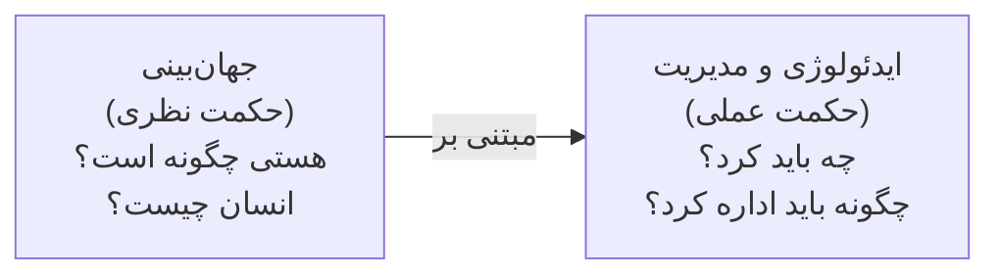

- **جهان‌بینی (حکمت نظری - شهید مطهری):** منظومه‌ای از بینش‌ها و تبیین‌های فلسفی درباره کل هستی و انسان (آیا جهان هدفی دارد؟ انسان سرشت الهی دارد یا مادی؟ آیا مختار است یا مجبور؟).
- **ایدئولوژی (حکمت عملی):** سیستم ارزش‌ها، احکام رفتاری و خط‌مشی‌های مدیریتی.
- **قاعده علیّت بینش و عمل:** «چون هستی چنین است و انسان چنان است، پس رفتار مدیریتی و سازمانی باید این‌چنین باشد.» هر تغییر در جهان‌بینی، بلادرنگ جهت‌گیری تصمیم‌گیری‌های مدیریتی را دگرگون می‌سازد.
- **روش‌شناسی ترکیبی مدیریت اسلامی:** مدیریت اسلامی بر خلاف الگوهای صرفاً پوزیتیویستی غربی، از یک «روش‌شناسی ترکیبی و چندبُعدی» سود می‌برد و با بهره‌گیری متوازن از تجربه، عقل و وحی، نظامی منسجم بنا می‌کند.

---

## ۲۹. رویکردهای چهارگانه به علم مدیریت اسلامی (مقیمی، ص ۹۳-۹۶)

برای پاسخ به این پرسش که «چگونه می‌توان مدیریت اسلامی را تدوین و نظریه‌پردازی کرد؟»، اندیشمندان چهار رویکرد متمایز ارائه کرده‌اند:

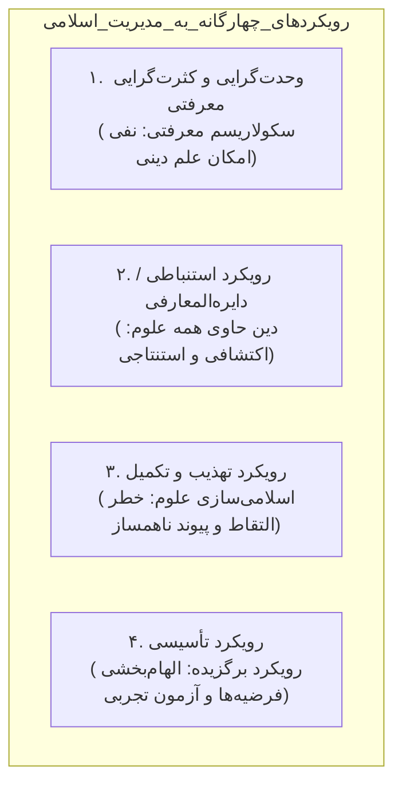

### رویکرد اول: وحدت‌گرایی و کثرت‌گرایی معرفت‌شناختی (نفی امکان علم دینی)
این دو موضع فلسفی، هر دو به یک نتیجه مشترک می‌رسند: **تعبیر «علم دینی» بی‌معنا و ناسازگار است (نگرش سکولار به علم):**
1. **وحدت‌گرایی معرفت‌شناختی:** معرفت بشری سنخیت واحد و یکدستی دارد که مشخصه انحصاری آن «تجربی و ابطال‌پذیر بودن» است. دین خارج از قلمرو علم است؛ پس علم دینی امکان‌پذیر نیست.
2. **کثرت‌گرایی معرفت‌شناختی:** معرفت انسان همانند «پارچه‌ای چهل‌تکه» است که هر تکه هویت، زبان و کارکرد مستقل خود را دارد و هیچ تداخلی بین آنها نیست. معرفت دینی نسبت «تباین و تغایر» با علم دارد و نباید با آن آمیخته شود.

---

### رویکرد دوم: رویکرد استنباطی بر پایه دین‌شناسی دایره‌المعارفی
بر این اساس، دین تمام دانش‌های مورد نیاز انسان را در بر دارد. این رویکرد به دو قرائت تقسیم می‌شود:
- **قرائت دایره‌المعارفی افراطی (کاملاً اکتشافی):** دین همه علوم را با تمام جزئیات در بر دارد و کار عالم، کشف فرمول‌های علمی و اداری از دل متون دینی است.
- **قرائت استنباطی معتدل (اکتشافی - استنتاجی):** اصول کلی علوم در دین آمده و دانشمند باید با روش اجتهادی و استنباطی، فروع تجربی و مدیریتی را از آن کلیات استخراج کند.

> [!important] نقد مبنایی علامه طباطبایی بر دایره‌المعارف‌پنداری قرآن
> علامه طباطبایی در تفسیر المیزان، در ذیل آیه ۸۹ سوره نحل (**«وَنَزَّلْنَا عَلَيْكَ الْكِتَابَ تِبْيَانًا لِّكُلِّ شَيْءٍ وَهُدًى وَرَحْمَةً وَبُشْرَىٰ لِلْمُسْلِمِينَ»**) تذکر می‌دهد:
> «چنین نیست که هر چه بخواهیم در قرآن یافت شود؛ بلکه قرآن تبیانِ هر چیزی است که **در ارتباط با هدایت و سعادت انسان** باشد.» قرآن کتاب فیزیک، شیمی یا تکنیک‌های لجستیک نیست؛ بلکه کتاب انسان‌سازی و خط‌مشی‌گذاری کلان هدایتی است.

---

### رویکرد سوم: رویکرد تهذیب و تکمیل علوم موجود (رابطه امتزاج)
- **منطق رویکرد:** علوم انسانی و مدیریت غربی را می‌گیریم، بخش‌های متعارض با اسلام را حذف (تهذیب) کرده و ارزش‌های اسلامی را به آن اضافه (تکمیل) می‌کنیم.
- **مروجان شاخص:** سید محمد نقیب العطاس و اسماعیل راجی الفاروقی تحت نهضت «اسلامی‌سازی دانش» (Islamization of Knowledge) در مالزی و جهان اسلام.
- **رابطه حاکم:** **«رابطه امتزاج»** میان مفاهیم وارداتی و ارزش‌های دینی.
- **آسیب‌های خطیر و نقد تستی:**
  ۱. **مخاطره التقاط (مهم‌ترین دام):** تئوری‌های علمی دارای شاکله و پیش‌فرض‌های بنیادین متصل به هم هستند. نمی‌توان سر یک نظریه را برید و سر اسلامی به آن چسباند؛ چنین جراحی ناسنجیده‌ای، «معجونی شگفت‌آور و کاریکاتوری» از اجزای ناهمساز پدید می‌آورد.
  ۲. **تطبیق‌های تکلف‌آمیز:** تحمیل زورکی آیات و روایات بر نظریه‌های زودگذر علمی.
  ۳. **احساس بی‌نیازی کاذب یا وهن دین:** خلاصه کردن دین در اشارات مجمل کنار تئوری‌های حجیم غربی، شأن شریعت را سبک می‌سازد.

---

### رویکرد چهارم: رویکرد تأسیسی (الگوی برگزیده و علمی مدیریت اسلامی)
این الگو، پیوند روشمند، بالنده و راستین میان مبانی وحیانی و روش‌شناسی تجربی است:

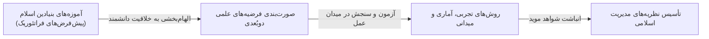

#### ارکان سه‌گانه رویکرد تأسیسی:
۱. **آموزه‌های دینی در جایگاه پیش‌فرض‌ها:** آیات و روایات مستقیماً خود فرضیه تجربی نیستند، بلکه «پیش‌فرض‌ها و مبادی متافیزیکی الهام‌بخش» هستند که جهت فکری دانشمند را شکل می‌دهند.
۲. **فرضیه‌های دوبُعدی (دورگه):**
   - از یک جهت **وابسته به دین** هستند؛ زیرا منبع الهام آنها آموزه‌های قدسی اسلام است.
   - از جهت دیگر **وابسته به عالم** هستند؛ زیرا خلاقیت ذهن دانشمند و قدرت پردازش اوست که آنها را صورت‌بندی کرده است.
۳. **ابطال‌پذیری فرضیه بدون خدشه به دین (نکته طلایی کنکور):**
   - اگر فرضیه‌ای در بوته آزمون رد یا ابطال شد، این ابطال **متعلق به پردازش و خطای فهم عالم است نه خطای دین**!
   - دانشمند پس از شکست فرضیه، آن را کنار نهاده و با تدبر عمیق‌تر، مجدداً از سرچشمه نصوص برای صورتبندی فرضیه‌ای کارآمدتر الهام می‌گیرد.
۴. **مراحل سه‌گانه عملیاتی:**
   - مرحله ۱: پذیرش آموزه‌های دینی به مثابه پیش‌فرض‌های بنیادین.
   - مرحله ۲: خلاقیت دانشمند در الهام‌گیری و تبدیل پیش‌فرض به فرضیه‌های قابل سنجش.
   - مرحله ۳: اجرای آزمایش‌ها و پیمایش‌های تجربی و استخراج مدل نهایی مدیریت اسلامی.

---

## ۳۰. طیف پیوسته رویکردهای پنج‌گانه به مدیریت اسلامی (نمودار ۳-۲ مقیمی، ص ۹۷)

بر اساس دو شاخص «میزان توجه به متون دینی» و «میزان توجه به تئوری‌های غربی»، رویکردها روی یک پیوستار پنج‌گانه قرار می‌گیرند:

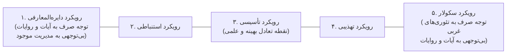

| رویکرد روی پیوستار | میزان توجه به آیات و روایات | میزان توجه به تئوری‌های موجود | وضعیت و حکم علمی |
|:--- |:--- |:--- |:--- |
| **۱. دایره‌المعارفی** | حداکثری و مطلق | صفر و نفی کامل | اخباری‌گری افراطی، علم را ناممکن می‌داند |
| **۲. استنباطی** | بالا (استخراج کلیات) | کم (استنباط فروع) | متکی بر اجتهاد، اما بدون آزمون تجربی |
| **۳. تأسیسی** | مبنایی (به عنوان پیش‌فرض) | فعال (آزمون فرضیه در میدان) | **روش علمی برگزیده و مورد تأیید** |
| **۴. تهذیبی** | گزینشی و تکمیلی | بالا (پذیرش اسکلت نظریه غربی) | خطر افتادن در دام التقاط و وصله‌پینه‌کردن |
| **۵. سکولار** | صفر و بی‌توجهی کامل | حداکثری و مطلق | غرب‌زدگی و نفی هویت مدیریت اسلامی |

> [!danger] دام تستی مهلک: تبدیل مستقیم متن آیه به فرضیه پژوهشی!
> برخی به غلط تصور می‌کنند برای تأسیس علم دینی، باید یک آیه را برداشته و به عنوان «فرضیه پژوهشی» به آزمون بگذاریم! این کار از دو جهت باطل و فاجعه‌بار است:
> ۱. **حرمت و قداست وحی:** قرآن کریم کلام قطعی حق و «لَا رَيْبَ فِيهِ» است؛ در حالی که فرضیه، حدسی مشکوک است که صحت آن را نمی‌دانیم و ممکن است ابطال شود. آزمون‌پذیر کردن متن وحی، اهانت به قرآن است.
> ۲. **نقش واسط دانشمند:** آنچه آزمون می‌شود، متن آیه نیست؛ بلکه **فرضیه‌ای دورگه** است که ذهن انسان خطاپذیر از روی پیش‌فرض‌های دینی پردازش کرده است.

---

## ۳۱. نقد ساده‌انگاران مذهبی و رابطه «مدیریت فقهی» و «مدیریت علمی» (مقیمی، ص ۹۷-۹۸)

### الف) نقد نگرش سطحی به مدیریت اسلامی (دیدگاه آیت‌الله مصباح یزدی):
- برخی افراد ساده‌انگار تصور می‌کنند اسلام کلید حل تمام فرمول‌ها و مشکلات خرد اجرایی را به صورت آماده در جیب دارد و منتظرند برای هر معضل اداری، یک نسخه حاضر و آماده در یک حدیث پیدا کنند!
- آیت‌الله مصباح یزدی تأکید می‌کند این افراد **نه اسلام را شناخته‌اند و نه مدیریت را**. 
- بزرگ‌ترین نقش اسلام در مدیریت، **تعیین نظام ارزشی، جهت‌گیری غایی، اخلاق بندگی و اصول عدالت** است؛ نه دادن فرمول‌های مهندسی یا تکنیک‌های انبارداری.

### ب) تقابل‌انگاری باطل میان مدیریت فقهی و مدیریت علمی:
- قرار دادن «مدیریت فقهی» در برابر «مدیریت علمی» یک مغالطه آشکار است.
- اسلام هیچ مخالفتی با استفاده از تجارب عقلایی دیگران ندارد؛ حتی اگر حاصل کار دشمن باشد (همان‌طور که از تکنولوژی و ابزارهایی چون رایانه استفاده می‌کنیم).
- اما تمایز در اینجاست: **استفاده از تجارب ابزاری مجاز است، اما پذیرش جهان‌بینی اومانیسم و لذت‌گرایی نهفته در تئوری‌های رفتاری غرب کاملاً مردود است**.

---

## ۳۲. اصول چهارگانه نظریه‌پردازی بومی در رویکرد تأسیسی (دیدگاه‌های آیت‌الله خامنه‌ای) (مقیمی، ص ۹۸-۱۰۱)

برای تدوین نظریه‌های بومی و تأسیسی در مدیریت اسلامی، رعایت چهار اصل راهبردی ضروری است:

```mermaid
flowchart TD
    subgraph اصول_چهارگانه_نظریه‌پردازی_بومی
        P1["۱. انسان دو ساحتی<br>(تلفیق عمران دنیا و تعالی آخرت در برابر انسان تک‌ساحتی مادی غرب)"]
        P2["۲. قرآن‌پژوهی و سیره‌پژوهی بنیادین<br>(بنا کردن سازه‌های علوم انسانی بر پایه‌های نصوص دینی)"]
        P3["۳. اجتهاد نوآورانه<br>(ترکیب قدرت علمی + جرأت علمی در شکستن قالب‌های وارداتی)"]
        P4["۴. تراز بازرگانی علم متوازن<br>(رابطه دوسویه صادرات و واردات علم؛ نفی ریزه‌خواری انفعالی)"]
    end
```

### ۱. انسان دو ساحتی در برابر انسان تک‌ساحتی:
- در مدیریت غربیِ مبتنی بر اومانیسم، انسان موجودی «تک‌ساحتی» است و غایت پیشرفت، صرفاً رفاه مادی و سود دنیوی است و اخلاق قربانی منافع می‌شود.
- در مدیریت اسلامی، انسان موجودی **«دو ساحتی» (دنیا و آخرت)** است؛ مدیر اسلامی مکلف است هم رفاه مادی و آبادانی دنیا را محقق کند و هم زمینه تقوا، رشد معنوی و سعادت ابدی را فراهم سازد.

### ۲. قرآن‌پژوهی و سیره‌پژوهی با هدف بنیان‌گذاری تئوری:
- علم انسانی نباید به صورت ترجمه بی‌قید و شرط متون غربی به دانشگاه‌ها تزریق شود.
- متفکران باید مبانی هستی‌شناختی و قواعد انسان‌شناسی را از قرآن و سیره ائمه استخراج کرده و سپس سازه‌های مدیریتی را بر آن پایه‌ریزی کنند.

### ۳. اجتهاد توأم با «قدرت علمی» و «جرأت علمی»:
- نوآوری علمی در فرهنگ اسلامی همان **اجتهاد پویا** است که نیازمند دو رکن جدایی‌ناپذیر است:
  - **قدرت علمی:** تسلط عمیق بر مبانی، ادبیات موضوع و هوش تحلیلی وافر.
  - **جرأت علمی:** شجاعت شکستن بت تئوری‌های وارداتی، خطرپذیری علمی و ابداع مدل‌های نوین.
  - *نکته کلیدی:* قدرت علمی بدون جرأت علمی، ذخیره‌ای راکد است که هرگز جامعه را به جلو نمی‌برد.

### ۴. تراز متوازن در تبادل علم (صادرات و واردات دانش):
- روابط علمی با غرب باید رابطه‌ای **دوسویه و متوازن** باشد.
- همانند بازرگانی بین‌المللی که فزونی واردات بر صادرات موجب تراز منفی و غبن اقتصادی می‌شود، تکیه مطلق بر واردات تئوری‌های غربی نیز «فقر و ریزه‌خواری علمی» به همراه دارد؛ جامعه اسلامی باید در کنار فراگیری تجارب، خود صادرکننده نظریه‌های اصیل انسانی باشد (تمثیل جام جم حافظ: *آنچه خود داشت ز بیگانه تمنا می‌کرد*).

---

## ۳۳. اندیشمندان متقدم؛ نظریه مدینه فاضله و رهبری ابونصر فارابی (مقیمی، ص ۱۰۱)

ابونصر فارابی (۲۵۰–۳۳۰ هـ.ق)، ملقب به «معلم ثانی»، نخستین فیلسوف دوره اسلامی است که به تبیین فلسفه سیاسی، اخلاق و مدیریت جامعه پرداخته است.

### الف) بستر تاریخی و انگیزه فارابی:
- در دوره اوج تشتت سیاسی، بحران مشروعیت خلافت عباسی و چالش‌های فرقه‌ای (اسماعیلیان و اهل سنت)، فارابی با تلفیق آموزه‌های اسلامی-شیعی و فلسفه یونان (افلاطون و ارسطو)، طرح آرمانی **«مدینه فاضله»** را تدوین کرد.

### ب) ویژگی‌های مدینه فاضله و جایگاه رهبر:
- **فلسفه وجودی سازمان و مدینه فاضله:** رساندن آحاد انسان‌ها به **«سعادت حقیقی»**.
- **رهبر مدینه فاضله (رئیس اول):** فارابی اداره این جامعه را منحصراً در شایستگی فردی می‌داند که آراسته به **«دوازده ویژگی و فضیلت بنیادین»** (سلامت جسم، هوش سرشار، حافظه قوی، راستگویی، عدالت‌خواهی، شجاعت و اتصال به عقل فعال از طریق وحی یا فیض الهی) باشد؛ الگویی که کاملاً با مفهوم «امام معصوم» در تفکر شیعی هم‌پوشانی دارد.

### ج) سطوح سه‌گانه جامعه سیاسی از دیدگاه فارابی (مقیمی، ص ۱۰۲):
۱. **مدینه فاضله:** شهر آرمانی بر پایه همکاری و تعاون برای نیل به سعادت حقیقی.
۲. **امت فاضله:** جامعه بزرگ‌تری مرکب از چندین مدینه هم‌فکر و هم‌مسیر.
۳. **معموره فاضله:** جامعه جهانی و کل کره زمین که تحت لوای عدالت و سعادت اداره شود (دهکده جهانی سعادت).

### د) ساختار طبقاتی سه‌گانه مدینه فاضله و تمرکز مسئولیت:
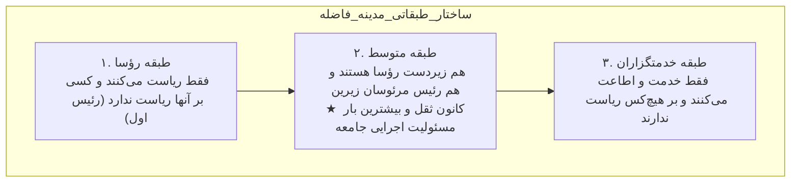
- **نکته تستی:** بیشترین مسئولیت اداره جامعه بر دوش **«طبقه متوسط»** است؛ حاکم تمامی اوامر و تدابیر حکومتی را از طریق این طبقه به اجرا درمی‌آورد.

### هـ) دو معنای سیاست و تمثیل طبیب فارابی:
- **سیاست به معنای اخص:** قدرت زمامداری و حکومت ناشی از دانش و تجربه دولتمردان.
- **سیاست به معنای اعم:** شامل سه حوزه تعاملی است: ۱) سیاست در قبال زیردستان، ۲) سیاست در قبال بالادستان، ۳) سیاست در قبال هم‌ردیفان.
- **سودمندترین روش در علم سیاست:** مطالعه در احوال و رفتارهای ظاهری و باطنی انسان‌ها.
- **تمثیل طبیب:** فارابی سیاستمدار را با پزشک مقایسه می‌کند: *«کسی که ابدان و جسم‌ها را معالجه می‌کند، طبیب است؛ و آن‌کس که نفوس و جان‌های مردمان را معالجه و هدایت می‌نماید، انسان مدنی و فرمانرواست.»*

---

## ۳۴. ابوعلی مسکویه رازی؛ معلم ثالث و پدر اخلاق مدنی (مقیمی، ص ۱۰۲-۱۰۳)

ابوعلی مسکویه رازی (۳۲۰–۴۲۱ هـ.ق) دانشمند برجسته شیعه در عصر آل بویه است که نامش در تاریخ تفکر اسلامی با چند شاخصه بنیادین گره خورده است:

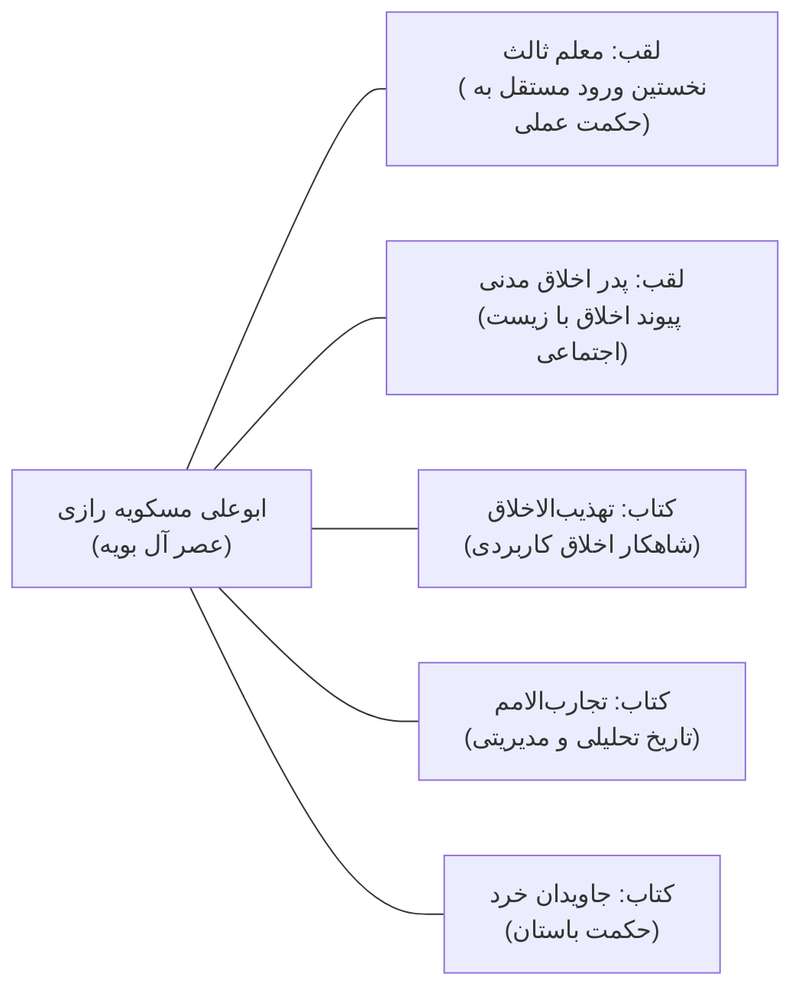

### الف) القاب و جایگاه تاریخی:
۱. **معلم ثالث:** پس از ارسطو (معلم اول) و فارابی (معلم ثانی)، مسکویه را «معلم ثالث» نامیده‌اند؛ زیرا **نخستین فیلسوفی است که به صورت تخصصی و مستقل به حکمت عملی و اخلاق پرداخت**.
۲. **پدر اخلاق مدنی:** او اخلاق را از کنج عزلت و رهبانیت فردی بیرون کشید و نشان داد که انسان به حکم «طبیعت»، «شریعت» و «عقلانیت» موجودی مدنی‌الطبع است و تکامل اخلاقی تنها در بستر تعاون اجتماعی و اداره جامعه امکان‌پذیر است.

### ب) آثار برجسته و کارکرد آنها در مدیریت:
- **تهذیب‌الاخلاق:** مرجع بی‌بدیل تربیت رفتاری و اخلاق سازمانی؛ هیچ فاضل و مدیری از آن بی‌نیاز نیست.
- **تجارب‌الامم:** رویکردی مدیریتی و تحلیلی به تاریخ؛ مسکویه در پی کشف سنت‌های تاریخی و درس‌های مدیریتی فرمانروایان پیشین است تا تجارب گذشته چراغ راه آینده باشد.
- **جاویدان خرد (الحکمة الخالدة):** گردآوری گزیده‌های ناب حکمای ایران باستان، هند، روم و عرب.

---

## ۳۵. مکتب عقل‌گرای بغداد؛ شیخ مفید و سید مرتضی علم‌الهدی (مقیمی، ص ۱۰۳-۱۰۴)

در قرن چهارم و پنجم هجری، حوزه علمیه شیعه در بغداد با دو شخصیت تاریخ‌ساز از مرحله نقل روایات صرف به مرحله اجتهاد عقلانی ارتقا یافت:

### الف) شیخ مفید (۳۳۸–۴۱۳ هـ.ق)؛ معمار کلام استدلالی:
- نام: محمد بن محمد بن نعمان، معروف به **«ابن‌المعلم»**. ریاست و مرجعیت عامه شیعه در عصر خویش.
- **تحول روش‌شناختی:** پیش از او، شیخ صدوق فقه را به سبکی ساده، روایی و املایی تصنیف می‌کرد؛ اما شیخ مفید **روش استدلال عقلانی و براهین کلامی** را وارد فقه امامیه کرد و راه مناظره علمی را گشود.
- **آثار:** تألیف بیش از ۲۰۰ جلد کتاب؛ در فقه کتاب مشهور **«المَقنَعَه»**، *الفرائض الشرعیه* و *احکام النساء*.
- **تربیت شاگردان تراز اول:** سید مرتضی، سید رضی (گردآورنده نهج‌البلاغه)، شیخ طوسی و نجاشی.

### ب) سید مرتضی علم‌الهدی (۳۵۵–۴۳۶ هـ.ق)؛ پدر عقل‌گرایی شیعه:
- علامه حلی او را **«معلم شیعه امامیه»** لقب داده است.
- در ادبیات، کلام و فقه سرآمد عصر بود؛ کتب معروف او در فقه: **«الانتصار»** و **«جُمَلُ العِلمِ وَ العَمَل»**.
- **لقب کنکوری شاخص:** در مکتب عقل‌گرای بغداد، سید مرتضی به عنوان **«پدر عقل‌گرایی در مکتب شیعه»** شناخته می‌شود که با تکیه بر اصول عقلی، پایه‌های محکمی برای امامت و سیاست مدون ساخت.

---

## ۳۶. ابوریحان بیرونی؛ نظریه «دولت عقل» و مطالعه تطبیقی فرهنگ‌ها (مقیمی، ص ۱۰۴-۱۰۵)

ابوریحان بیرونی (۳۶۲–۴۴۰ هـ.ق) همه‌چیزدان نابغه جهان اسلام و پیشگام روش‌شناسی علمی است:

### الف) شاهکارهای علمی:
- در سن ۳۰ سالگی کتاب بی‌نظیر تقویم و فرهنگ‌شناسی **«آثار الباقیه»** را درباره رسوم و تاریخ ایرانیان، عرب‌ها، رومی‌ها و یهودیان نگاشت.
- همراهی با غزنویان در هند و تألیف کتاب جاودان **«تحقیق ما للهند»**؛ بیرونی به دلیل بررسی بی‌طرفانه و دقیق ادیان و عقاید هندوان، یونانیان و ایرانیان، **«بنیان‌گذار مطالعه تطبیقی فرهنگ‌ها در جهان»** شناخته می‌شود.
- در ریاضیات و ستاره‌شناسی، کتاب گران‌سنگ **«قانون مسعودی»** را به رشته تحریر درآورد.

### ب) نظریه سیاسی و مدیریتی «دولت عقل»:
۱. **فطری بودن تدبیر و مدیریت:** هستی و جهان خالی از تدبیر نیست و انسان نیازمند حکومت و تشکیلات مدیریتی است.
۲. **دولت آرمانی؛ دولت عقل:**
   - دولت آرمانی بیرونی، حکومتی زمینی است که بر محور «عقل و شایسته‌سالاری نخبگان» اداره می‌شود و غایت آن تأمین سعادت، عدالت و آسایش رعیت است.
   - این دولت در زمان پیامبر (ص) و ائمه (ع) در مرتبه‌ای ظهور کرد و کمال نهایی آن در آخرالزمان با ظهور حضرت مهدی (عج) رقم خواهد خورد.
۳. **مشروعیت دوگانه (عقل و دین) با اولویت دین:**
   - مشروعیت دولت به دو پایه متکی است: **عقل** و **دین**.
   - در صورت مقایسه، **بیرونی اولویت مطلق را به دین می‌دهد**؛ زیرا احکام وحیانی دارای «ثبات و جاودانگی» است و طبع طغیان‌گر بشر تنها در پرتو احکام الهی مهار می‌شود.

---

## ۳۷. ابوعلی سینا و شیخ طوسی؛ پیوند عدالت، تخصص و فقه مدون (مقیمی، ص ۱۰۵-۱۰۶)

### الف) ابوعلی سینا (۳۷۰–۴۲۸ هـ.ق)؛ تقسیم حکمت و محوریت عدالت:
- مشهور به «شیخ‌الرئیس» با بیش از ۵۰۰ اثر؛ در کتاب *قانون* مباحث روان‌شناسی کاربردی را مطرح کرد.
- **طبقه‌بندی علوم از نگاه ابن‌سینا:**
  - **حکمت نظری:** الهیات، ریاضیات، طبیعیات.
  - **حکمت عملی:** اخلاق (فرد)، تدبیر منزل (خانواده)، سیاست مدن (جامعه).
- **معادله طلایی:** ابن‌سینا **حکمت عملی را مساوی با «عدالت» می‌داند** و مهم‌ترین وظیفه سلطان این است که «حکیم کامل» باشد.
- **دو رکن جامعه و مدینه:** جامعه نیازمند دو عنصر حیاتی است: ۱) **قانون**، ۲) **عدالت**؛ قوانین عادلانه بستر داد و ستد و همکاری متمدنانه را فراهم می‌آورند.

### ب) شیخ طوسی (۳۸۵–۴۶۰ هـ.ق)؛ تخصص‌گرایی اداری و فقه المبسوط:
- ملقب به **«شیخ‌الطائفه»**، مؤسس حوزه علمیه نجف و تدوین‌کننده کتاب ماندگار **«المبسوط»** به عنوان **«نخستین کتاب مدون فقهی شیعه»**.
- **نظریه شایسته‌سالاری و تفکیک تخصصی صلاحیت‌ها (تست قطعی):**
  - شیخ طوسی معتقد است هر فردی که مسئولیتی را می‌پذیرد (قضاوت، فرمانداری، خراج و مالیات)، **فقط در حیطه مأموریت تخصصی خود باید صاحب دانش کافی باشد**.
  - برای مثال: فرماندار یا فرمانده سیاسی ضرورتی ندارد احکام پیچیده قضایی را بداند؛ ملاک انتصاب، داشتن تخصص دقیق در همان حوزه مأموریت است.

---

## ۳۸. خواجه نظام‌الملک طوسی و جریان «سیاست‌نامه‌نویسی» (مقیمی، ص ۱۰۶)

خواجه نظام‌الملک طوسی (۴۰۸–۴۸۵ هـ.ق) وزیر مقتدر سلجوقیان و برجسته‌ترین چهره جریان سیاست‌نامه‌نویسی در تمدن اسلامی است:

```mermaid
flowchart TD
    subgraph جریان‌های_سه‌گانه_اندیشه_سیاسی_و_اداری
        J1["۱. شریعت‌نامه‌ها<br>نگاشته شده توسط فقها<br>محوریت: احکام شرعی و تکالیف الهی"]
        J2["۲. فلسفه‌نامه‌ها<br>نگاشته شده توسط فلاسفه (فارابی و ابن‌سینا)<br>محوریت: مدینه فاضله، سعادت غایی و حکمت نظری"]
        J3["۳. سیاست‌نامه‌ها (اندرزنامه‌ها)<br>نگاشته شده توسط دیوان‌سالاران و وزرا (خواجه نظام‌الملک)<br>محوریت: فنون عملی حکومت‌داری، حفظ قدرت و واقع‌گرایی"]
    end
```

### الف) اثر جاویدان و نوآوری خواجه نظام‌الملک:
- تألیف کتاب ماندگار **«سیرالملوک (سیاست‌نامه)»**.
- **نظریه دوبرادری حکومت و دین:** خواجه نظام‌الملک نهاد حکومت و مذهب را به هم پیوند زد و معتقد بود: **«ملک و دین دو برادرند؛ هرگاه در یکی خللی پدید آید، دیگری به فساد کشیده می‌شود.»**

### ب) ویژگی‌های رویکرد سیاست‌نامه‌نویسی (اندرزنامه‌نویسی):
۱. **واقع‌گرایی عمل‌گرایانه در برابر آرمان‌گرایی:** بر خلاف فلاسفه که به دنبال «مدینه فاضله» آرمانی در دوردست‌ها بودند، سیاست‌نامه‌نویسان با مسائل روزمره حکومت سر و کار داشتند و در پی **«حفظ قدرت، ثبات نظم و آداب ملک‌داری»** بودند.
۳. **سایر چهره‌های جریان سیاست‌نامه‌نویسی:**
   - **ابن‌مُقَفَّع** (۱۴۳ هـ.ق) با کتاب *الادب الکبیر*.
   - **محقق سبزواری** با کتاب *روضة الانوار*.
۴. **روش معکوس خواجه نظام‌الملک در تحلیل:** او به جای حرکت از گذشته به حال، از مشاهده اوضاع و احوال زمانه خویش به نتایج مدیریتی دست می‌یابد و سپس آن تجارب را به تاریخ گذشته پیوند می‌زند.

---

## ۳۹. اخوان‌الصفا و اقسام پنج‌گانه سیاست و مدیریت (مقیمی، ص ۱۰۷)

در قرن چهارم هجری، انجمن سرّی دانشمندان با گرایش‌های شیعی به نام «اخوان‌الصفا» مجموعه‌ای دایره‌المعارفی مرکب از **۵۲ رساله** (در علوم طبیعی، منطق، ریاضی، الهیات و حکمت عملی) با نام **«رسائل اخوان‌الصفا»** تدوین کردند.

```mermaid
flowchart TD
    subgraph اقسام_پنج‌گانه_سیاست_اخوان‌الصفا
        P1["۱. سیاست نبوی<br>(کشورداری پیامبران و ناموس الهی)"]
        P2["۲. سیاست ملوکیه<br>(کشورداری سلاطین و شهریاران)"]
        P3["۳. سیاست عامیه<br>(مدیریت و هدایت توده مردم)"]
        P4["۴. سیاست خاصه<br>(اداره خانواده و تدبیر منزل)"]
        P5["۵. سیاست ذاتیه<br>(خودشناسی، کنترل امیال و مدیریت خویشتن)"]
    end
```

### ویژگی‌های بنیادین نظریه اخوان‌الصفا:
- **انسان؛ موضوع اصلی سیاست:** انسان موجودی دو بُعدی با صفات متضاد (روحانی و جسمانی) است.
- **منشأ سیاست:** ریاست‌طلبی در آغاز امری غریزی و نفسانی است؛ اما با تربیت عقلانی، به مراتب نفوس قدسی ارتقا یافته و به ابزار تدبیر خلایق بر پایه ناموس الهی تبدیل می‌شود.
- **صنایع:** اخوان‌الصفا بر خلاف ابن‌خلدون (که بین علم و صنعت تفکیک قائل است)، تمامی دانستنی‌ها و علوم بشری را تحت عنوان **«صنایع»** تعریف می‌کنند.
- **تعریف سیاست:** سیاست عبارت است از **«روش رفتار و معامله با دیگران»**.

---

## ۴۰. راغب اصفهانی و امام محمد غزالی؛ نظریه دوقلوی دین و دولت (مقیمی، ص ۱۰۸)

### الف) راغب اصفهانی (قرن چهارم و پنجم هـ.ق):
- ادیب، حکیم و فقیه بزرگ؛ صاحب کتاب کم‌نظیر **«مفردات الفاظ قرآن»**.
- اثر اخلاقی و مدیریتی شاخص: **«الذریعة الی مکارم الشریعة»** که مبنای بسیاری از مفاهیم رفتاری در مدیریت اسلامی قرار گرفته است.

### ب) امام محمد غزالی (۴۵۰–۵۰۵ هـ.ق)؛ تمثیل دوقلوی دین و حکومت:
- فیلسوف، متکلم و عارف برجسته در خراسان.
- **نظریه دوقلوی دین و سیاست (تست پرتکرار کنکور):**
  > **«دین و سیاست فرزندان دوقلو هستند؛ هیچ‌یک بی‌نیاز از دیگری نیست. دین، پایه و اساس حکومت است و حکومت، نگهبان و پاسدار دین. آنچه پایه ندارد ویران می‌شود، و آنچه نگهبان ندارد از میان می‌رود.»**
- **نقش دین به عنوان امام سیاست:** در نگاه غزالی، دین باید «امام و خط‌مشی‌گذار» سیاست باشد.
- **دو وجه سیاست:** غزالی سیاست را زندگی اجتماعی مطلوب می‌داند که:
  - وجه عقلی آن: **«حکمت عملی»** است.
  - وجه شرعی آن: **«فقه سیاسی»** است.

---

## ۴۱. ابن‌رشد و نجم‌الدین رازی؛ تقابل «ملوک دنیا» و «ملوک دین» (مقیمی، ص ۱۰۸)

### الف) ابن‌رشد اندلسی (۵۲۰–۵۹۵ هـ.ق):
- فیلسوف خردگرای جهان اسلام، مدافع پیوند دین و عقلانیت و بازخوانی آرای فارابی در اداره مدینه فاضله.

### ب) نجم‌الدین رازی (نجم دایه) (۵۷۳–۶۵۴ هـ.ق):
- از بزرگان تصوف و نویسنده کتاب *مرصاد العباد*؛ اثبات همراهی ذاتی شریعت با مدیریت جامعه.
- **تفکیک دو نوع حکومت و زمامداری:**
  ۱. **ملوک دنیا:** حاکمانی که جامعه را صرفاً ابزاری برای تأمین غرایز و ضرورت‌های اولیه مادی می‌دانند.
  ۲. **ملوک دین:** زمامدارانی که حکومت را ابزار نیل به کمال، صلاح و تقرب الهی می‌شمارند و به حکم عقل و شریعت، جامعه را به سوی تعالی رهبری می‌کنند.

---

## ۴۲. خواجه نصیر، قطب‌الدین شیرازی و قطب‌الدین رازی (مقیمی، ص ۱۰۹)

۱. **خواجه نصیرالدین طوسی (۵۹۷–۶۷۲ هـ.ق):** فیلسوف و مدیر عمل‌گرای برجسته؛ نویسنده شاهکارهایی چون **«اخلاق ناصری»**، *تجرید الاعتقاد* و *رساله امامت*.
۲. **علامه قطب‌الدین شیرازی (۶۳۴–۷۱۰ هـ.ق):** متفکر جامع که در عصر ایلخانان مغول، سیاست را از تجرید محض رهانید و با شریعت آمیخت؛ او جامع سه مشرب فلسفه مشاء، فلسفه اشراق و عرفان ابن‌عربی بود.
۳. **قطب‌الدین رازی بویهی (۶۶۶–۷۲۱ هـ.ق):** دانشمند منطق و فلسفه در ورامین و ری؛ تبیین نظام‌مند بایدها و نبایدهای حکمت عملی در سه‌گانه تهذیب نفس، تدبیر منزل و سیاست مدن.

---

## ۴۳. ابن‌خلدون؛ جامعه‌شناسی سازمان و نظریه عصبیت (مقیمی، ص ۱۰۹-۱۱۰)

ابوزید عبدالرحمن ابن‌خلدون (۷۳۲–۸۰۸ هـ.ق) متولد تونس، بزرگ‌ترین مورخ و بنیان‌گذار جامعه‌شناسی و علم عمران در تاریخ تمدن اسلامی است:

```mermaid
flowchart TD
    subgraph نظریه_دولت_و_عمران_ابن‌خلدون
        A["عمران (جامعه و تمدن)"] --> B["عصبیت (همبستگی گروهی)<br>شیرازه و هسته محرک"]
        B --> C["دولت (سازمان و تشکیلات سیاسی)"]
        
        C --- S1["ستون اول: شوکت و نیروی نظامی (سپاه)"]
        C --- S2["ستون دوم: مال، اقتصاد و خراج (پشتیبان سپاه)"]
    end
```

### الف) معانی کلیدی اصطلاحات در واژگان ابن‌خلدون:
- **دولت:** در اصطلاح ابن‌خلدون دقیقاً به معنای **«سازمان و تشکیلات اداری-حکومتی»** است.
- **عصبیت:** به معنای **«همبستگی گروهی، انسجام جمعی و روحیه پیوستگی»** است که موتور محرک تأسیس سازمان‌هاست.
- **عمران:** بستر کلان جامعه و زیست تمدنی.

### ب) دو ستون اصلی بقای دولت و تشکیلات:
۱. **شوکت و عصبیت (نیروی سپاهی و وفاداری جمعی).**
۲. **مال و ثروت (تأمین‌کننده معاش و انگیزش سپاهیان).**
اختلال در هر یک از این دو پایه، بلافاصله زوال سازمان را رقم می‌زند.

### ج) آسیب‌شناسی و چرخه انحطاط دولت‌ها:
- گذار از بادیه‌نشینی (سادگی، شجاعت و عصبیت نیرومند) به شهرنشینی، سرآغاز سقوط است:
  - رواج تجمل‌پرستی، تن‌پروری و تفنن‌جویی.
  - گسترش انحرافات، فقر، بیکاری و غیردینی شدن رفتارها.
  - **فرسایش عصبیت و پیوندهای ایمانی** که به فروپاشی نهایی سازمان می‌انجامد.

---

## ۴۴. جلال‌الدین دوانی و محقق کَرکی (مقیمی، ص ۱۱۰-۱۱۱)

### الف) جلال‌الدین دوانی (۸۳۰–۹۰۸ هـ.ق):
- حکیم و متکلم نامدار؛ نویسنده کتاب مشهور **«لوامع الاشراق فی مکارم الاخلاق» (معروف به اخلاق جلالی)**.
- تلاش برای هم‌پیوندی اندیشه‌های فیلسوفان اخلاق با متون سیاست‌نامه‌نویسان.

### ب) محقق کَرکی (محقق ثانی) (۸۷۰–۹۴۰ هـ.ق)؛ پیوند شریعت و مدیریت صفوی:
- فقیه نامدار جبل عامل لبنان که نقش کلیدی در ساختار فقهی حکومت صفویه ایفا کرد (بیش از ۶۰ اثر).
- **نقد مبنایی تلقی اهل سنت از امامت:** نظریه اهل سنت را که امامت را منصبی صرفاً عرفی، مشروط به بیعت ظاهری یا غلبه قهری حاکم فاسق می‌داند، به شدت رد کرد.
- **نفی تز جدایی دین از سیاست:** تأکید کرد که بخش اعظم احکام فقهی اسلام مستقیماً مربوط به «نظام زندگی اجتماعی و اداره دنیای مردم» است (مانند عزل و نصب استانداران، قضاوت، بیت‌المال و مدیریت امور عمومی).

---

## ۴۵. محقق اردبیلی؛ احیای نظریه ولایت فقیه در نجف (مقیمی، ص ۱۱۱)

مولی احمد مقدس اردبیلی (۹۲۰–۹۹۳ هـ.ق) فقیه وارسته حوزه نجف اشرف:
- **احیاگر ولایت فقیه در عصر غیبت:** در عصر تسلط صفویان، به تدوین چارچوب‌های فقه سیاسی و راهکارهای زیست مسلمانان پرداخت.
- **ماهیت یگانه و الهی حکومت (نکته تستی سرنوشت‌ساز):**
  - از نگاه محقق اردبیلی، ماهیت حکومت در سه دوره: **حکومت پیامبر (ص)**، **حکومت ائمه معصومین (ع)** و **حکومت فقیه جامع‌الشرایط**، **کاملاً الهی، ماهیتی یکسان و فاقد هرگونه تغایر ذاتی است**.
  - تنها تفاوت، اختصاص مقام «نبوت و عصمت» به پیامبر و امام است؛ اما در اصل **ولایت، حق سرپرستی و ضرورت اداره جامعه بر پایه شریعت**، هیچ تفاوتی وجود ندارد و فقیه به نیابت از معصوم متولی امور است.

---

## ۴۶. ملاصدرا (صدرالمتألهین) و حکمت صدرایی در مدیریت (مقیمی، ص ۱۱۱)

صدرالدین محمد شیرازی (۹۷۹–۱۰۴۵ هـ.ق) بنیان‌گذار مکتب **«حکمت متعالیه»**:
- تلفیق موزون و بی‌نظیر عقل استدلالی (برهان)، شهود باطنی (عرفان) و نصوص وحیانی (قرآن).
- **نقش حکمت صدرایی در حل بحران‌های تمدنی:** اشاره تاریخی امام خمینی در پیام به میخائیل گورباچف مبنی بر اینکه رهایی از بن‌بست کمونیسم و ماتریالیسم، در گرو بازگشت به اندیشه‌های صدرالمتألهین است.
- **پیوند اسفار اربعه با سیاست و مدیریت:**
  - ملاصدرا سیر استکمالی انسان را در قالب چهار سفر روحانی طراحی کرد:
    ۱. **سفر اول (من الخلق الی الحق):** گذر از کثرات مادی به سوی وحدت و بارگاه قدس الهی. انسان حتی در همین گام نخست، برای آماده‌سازی زاد و توشه معنوی نیازمند سامان‌بخشی به معاش، نظم اجتماعی و مدیریت دنیاست.
    ۲ و ۳. **سفر دوم و سوم (فی الحق بالحق و من الحق الی الحق):** سیر در اسماء، صفات و ذات باری‌تعالی.
    ۴. **سفر چهارم (من الحق الی الخلق بالحق):** بازگشت انسان به میان خلق در حالی که به کمال و اتصال توحیدی نائل آمده است.
  - **احراز شایستگی رهبری جامعه در سفر چهارم:** در این مرحله، انسان وارسته به مقام **«خلیفةاللهی، رهبری و تدبیر جامعه»** نائل می‌شود و با عناوینی چون **«حکیم»، «رئیس اول»، «ولی»، «نبی» و «منذر»** نامیده می‌شود. انسان‌ها در دنیایی که آکنده از فتنه‌ها، مفاسد و تزاحم‌هاست، ضرورتاً نیازمند چنین رهبر هدایت‌گری هستند.

---

## ۴۷. فقیهان و حکیمان عهد صفوی و پس از آن (مقیمی، ص ۱۱۲-۱۱۴)

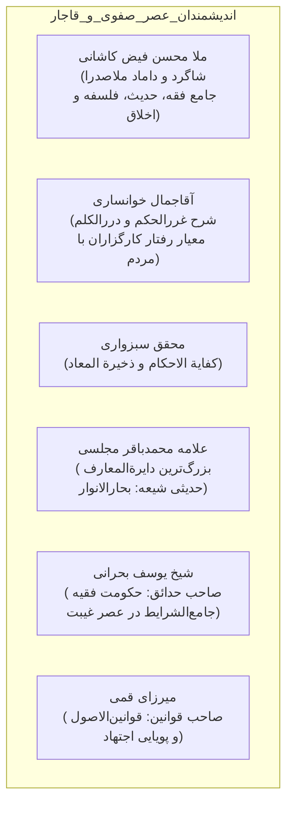

### ۱. ملا محسن فیض کاشانی (۱۰۰۶–۱۰۹۱ هـ.ق):
- داماد و دست‌پرورده ۱۰ ساله صدرالمتألهین؛ جامع منقول و معقول با بیش از ۱۰۰ اثر ماندگار.

### ۲. آقاجمال خوانساری (۱۰۱۶–۱۰۹۸ هـ.ق)؛ تدوین منشور رفتار کارگزاران:
- متکلم و فقیه نامدار عهد صفوی؛ ناظر بر کژی‌ها و ناهنجاری‌های دیوان‌سالاری صفوی.
- **شاهکار مدیریتی:** کتاب سترگ **«شرح غرر الحکم و درر الکلم»** بر کلمات قصار امیرالمؤمنین علی (ع)؛ این اثر به منزله **«آیین‌نامه و منشور جامع سنجش رفتار اداری کارگزاران و حقوق متقابل شهروندان»** تلقی می‌شود.

### ۳. محقق سبزواری (۱۰۱۷–۱۰۹۰ هـ.ق):
- صاحب کتاب‌های فقهی-سیاسی نامدار **«کفایة الاحکام»** و **«ذخیرة المعاد فی شرح الارشاد»**.

### ۴. علامه محمدباقر مجلسی (۱۰۳۷–۱۱۱۱ هـ.ق):
- تدوین‌کننده اعظم احادیث اهل‌بیت با نگارش دایرةالمعارف جهانی **«بحارالانوار»** (بیش از ۲۰۰ مجلد).

### ۵. شیخ یوسف بحرانی (۱۱۰۷–۱۱۸۶ هـ.ق):
- فقیه پرآوازه بحرین و نویسنده کتاب عظیم *الحدائق الناضرة*؛ وی منشأ مشروعیت حکومت را منحصراً «اذن الهی» دانسته و در عصر غیبت، تنها حکومت مشروع و مطلوب را **«حکومت فقیه جامع‌الشرایط»** می‌داند.

### ۶. میرزای قمی (۱۱۵۱–۱۲۳۱ هـ.ق):
- میرزا ابوالقاسم گیلانی، مشهور به **«صاحب قوانین»** به دلیل کتاب درسی و ماندگار **«قوانین الاصول»** در اصول فقه شیعه.

---

## ۴۸. سید جعفر کشفی؛ مهندسی قوای سه‌گانه حکمت و عقل عملی (مقیمی، ص ۱۱۳)

سید جعفر دارابی (۱۱۹۱–۱۲۶۷ هـ.ق) ملقب به «کشفی»، در یک ساختار معرفتی بی‌نظیر، قوای شناختی و اجرایی انسان را تفکیک می‌نماید:

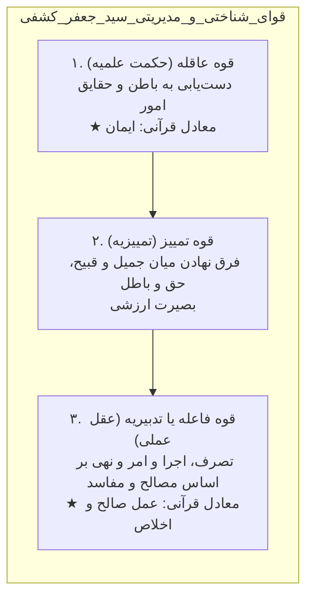

- **تطبیق مفاهیم با ادبیات قرآن:** کشفی عقل نظری (حکمت علمیه) را در آیات قرآن معادل **«ایمان»**، و عقل عملی (قوه تدبیریه) را معادل **«عمل صالح و اخلاص»** معرفی می‌کند.

---

## ۴۹. صاحب جواهر، ملاهادی سبزواری و ملا محمدمهدی نراقی (مقیمی، ص ۱۱۴)

### الف) شیخ محمدحسن نجفی (صاحب جواهر) (۱۲۰۰–۱۲۶۶ هـ.ق):
- مؤلف دائرةالمعارف عظیم **«جواهر الکلام فی شرح شرائع الاسلام»**؛ شهید مطهری این کتاب را جامع‌ترین گنجینه فقه شیعه می‌داند.
- امام خمینی مبنای روش‌شناسی استنباط خود را **«فقه سنتی و اجتهاد جواهری»** نامیده‌اند که اشاره به روش متقن، مستدل و همه‌جانبه صاحب جواهر دارد.

### ب) ملاهادی سبزواری (۱۲۱۲–۱۲۸۹ هـ.ق):
- حکیم نامدار عصر قاجار و شارح بزرگ حکمت متعالیه (منظومه)؛ پیونددهنده اندیشه ولایت شیعی با نظریه حاکم حکیم در مدینه فاضله افلاطون.

### ج) ملا محمدمهدی نراقی (۱۱۹۷–۱۲۱۵ هـ.ق)؛ نظریه «دولت عدل» و تمثیل کشور تن:
- فیلسوف و فقیه اخلاقی بزرگ، نویسنده کتاب جاودان **«جامع السعادات»**.
- **نظریه سیاسی و سازمانی:** الگوی آرمانی او **«دولت عدل»** است.
- **تمثیل مشهور کشور تن و سلطان عقل (تست کنکور):**
  > **«عقل در وجود انسان به منزله سلطان و فرمانروای کشور تن است، و حواس پنج‌گانه به منزله جاسوسان، بازرسان و مأموران گزارشگری هستند که در نواحی گوناگون این کشور گمارده شده‌اند تا اطلاعات محیطی را به سمع و نظر پادشاه عقل برسانند.»**
- **موازنه دین و دنیا:** نراقی نفی رهبانیت کرده و معتقد است دنیا بستر کشت و سازندگی برای سعادت ابدی است؛ لذت‌پرستی مادی مطرود است، اما رفاه معقول اقتصادی و تدبیر معاش لازمه بندگی است.

---

## ۵۰. اندیشمندان معاصر مدیریت اسلامی (مقیمی، ص ۱۱۵-۱۱۸)

تمدن اسلامی در سده اخیر با بازتولید فقه سیاسی و رویارویی مستقیم با امواج تجدد و نظام‌های غربی، چهره‌های تابناکی در عرصه مدیریت به خود دیده است:

### ۱. امام خمینی (۱۲۸۱–۱۳۶۸ هـ.ش)؛ معمار حکومت اسلامی و نظام ولایت فقیه:
- فقیه، فیلسوف، عارف و بنیان‌گذار جمهوری اسلامی ایران.
- **نظریه بنیادین:** امتداد ولایت الهی در عصر غیبت در قالب **«اصل ولایت فقیه»**؛ مبارزه با استکبار و تشکیل حکومت اسلامی از اوجب واجبات شرعی.
- **آثار جامع:** در فقه استدلالی: *تحریر الوسیله*، *کتاب البیع*، *المکاسب المحرمه*؛ در اخلاق و عرفان: *چهل حدیث*، *شرح دعای سحر*، *آداب الصلاة*؛ در مدیریت و سیاست: مجموعه سترگ ۲۲ جلدی **«صحیفه امام»**.

### ۲. آیت‌الله سید علی خامنه‌ای (متولد ۱۳۱۸ هـ.ش)؛ نظریه‌پرداز پیشرفت بومی و علم دینی:
- دومین رهبر انقلاب اسلامی و ادامه‌دهنده خط اجتهاد جواهری.
- **نوآوری‌های راهبردی:**
  - تدوین الگوی اسلامی-ایرانی پیشرفت مبتنی بر هویت «انسان دو ساحتی».
  - تأکید بر تولید علم بومی و مقابله بنیادین با ترجمه‌زدگی انفعالی علوم انسانی غرب.
  - ضرورت نوآوری و اجتهاد بر پایه تلفیق **«قدرت علمی» و «جرأت علمی»**.
  - ایجاد کرسی‌های نظریه‌پردازی، اقتصاد مقاومتی و نگاه تمدنی به مدیریت جهادی.

---

## ۵۱. آیت‌الله مدرس و علامه طباطبایی (مقیمی، ص ۱۱۶)

### الف) آیت‌الله سید حسن مدرس (۱۲۴۹–۱۳۱۷ هـ.ش):
- فقیه آزاداندیش، شجاع و نماینده نستوه مجلس شورای ملی که به شهادت رسید.
- **شعار جاودان و اصل بنیادین فقه سیاسی:**
  > **«دیانت ما عین سیاست ماست و سیاست ما عین دیانت ماست.»**
  این عبارت خط بطلانی قطعی بر فرضیه سکولاریسم و جدایی مدیریت جامعه از تعالیم شریعت کشید.

### ب) علامه سید محمدحسین طباطبایی (۱۲۸۱–۱۳۶۰ هـ.ش):
- حکیم و فیلسوف الهی، مؤلف دائرةالمعارف ۲۰ جلدی **«تفسیر المیزان»** طی ۲۰ سال تحقیق.
- **روش‌شناسی تفسیری:** ابداع روش بدیع **«تفسیر قرآن به قرآن»**.
- **نظریه ادراکات اعتباری:** شاهکار معرفت‌شناختی علامه در کتاب *اصول فلسفه و روش رئالیسم* که پایه‌گذار فهم چگونگی پیدایش قراردادها، سازمان‌ها و اعتبارات مدیریتی در زندگی جمعی بشر است.

---

## ۵۲. علامه شهید مرتضی مطهری؛ معمار ایدئولوژی انقلاب اسلامی (مقیمی، ص ۱۱۶)

شهید آیت‌الله مرتضی مطهری (۱۲۹۸–۱۳۵۸ هـ.ش):
- استاد دانشگاه تهران، ایدئولوگ و فیلسوف برجسته‌ای که با قلمی روان و مستدل، بنیان‌های فکری نظام اسلامی را تدوین کرد.
- **جامعیت آثار:** بیش از ۳۰ مجلد در ۱۰ محور تخصصی (کلام، فلسفه، تاریخ و سیره معصومین، فقه، اخلاق، عرفان، سیاست، جامعه و اقتصاد).
- **قضاوت تاریخی امام خمینی:** امام خمینی آثار شهید مطهری را **«بی‌استثناء مفید و انسان‌ساز»** دانستند و او را پاره تن و حاصل عمر خویش نامیدند.
- **تعبیر رهبر انقلاب:** تفکرات شهید مطهری، مبنای فکری انقلاب اسلامی است و آثار او نادره زمانه است.

---

## ۵۳. علامه محمدتقی جعفری؛ حیات معقول و روابط چهارگانه انسان (مقیمی، ص ۱۱۷)

علامه محمدتقی جعفری (۱۳۰۴–۱۳۷۷ هـ.ش) فیلسوف و اندیشمند بزرگ معاصر در تبریز و تهران:
- بیش از ۱۰۰ مجلد اثر در فقه، فلسفه، عرفان و علوم انسانی، از جمله شرح ۱۵ جلدی *مثنوی معنوی* و شرح ۲۷ جلدی *نهج‌البلاغه*.
- **نظریه «حیات معقول»:** حیات معقول حیاتی است هدفدار، آگاهانه و سازمان‌یافته که در آن قوای مادی و جسمانی انسان تحت هدایت و اشراف ارزش‌های متعالی الهی قرار می‌گیرد.
- **روابط چهارگانه انسان:** تنظیم هماهنگ رابطه انسان با خویشتن، خدا، جهان طبیعت، و همنوعان؛ زیربنای مدیریت و تعاملات سازمانی انسان‌محور.

---

## ۵۴. آیت‌الله عبدالله جوادی آملی؛ روش‌شناسی علم دینی و تفسیر تسنیم (مقیمی، ص ۱۱۷)

آیت‌الله جوادی آملی (متولد ۱۳۱۲ هـ.ش) فقیه، فیلسوف، مفسر قرآن و مدرس بزرگ حوزه علمیه قم:
- **شاهکار تفسیری:** دائرةالمعارف عظیم **«تفسیر تسنیم»** در بیش از ۳۴ مجلد.
- **نظریه‌پردازی علم دینی و هندسه معرفتی:**
  - نفی توهم تعارض علم و دین.
  - تفکیک علوم میزبان (فطری-حضوری) از علوم میهمان (حصولی-تجربی).
  - تثبیت جایگاه عقل برهانی در درون هندسه معرفت دینی.
  - هشدار نسبت به «تفکر اسرائیلی» در علم تجربی و تاکید بر طولی بودن روش‌های وحیانی، نقلی، عقلی و تجربی.

---

## ۵۵. آیت‌الله محمدتقی مصباح یزدی؛ جامعه‌شناسی قرآنی و نقد سطحی‌نگری (مقیمی، ص ۱۱۷)

آیت‌الله مصباح یزدی (۱۳۱۳–۱۳۹۹ هـ.ش) استاد برجسته فلسفه اسلامی و مفسر قرآن در حوزه علمیه قم:
- تحقیقات بنیادین در فلسفه، اخلاق، حقوق، حکومت اسلامی، جهاد، قضا و کتاب مرجع **«جامعه و تاریخ از دیدگاه قرآن»**.
- **نقدهای ساختاری به مدیریت اسلامی:**
  - مبارزه با سطحی‌نگری کسانی که مدعی فرمول‌های آماده اجرایی در نصوص دینی بودند.
  - تفکیک حوزه ارزش‌ها از فرمول‌های مهندسی.
  - دفاع از عقلانیت و بهره‌گیری از تجارب مفید بشری در چارچوب جهان‌بینی توحیدی.

---

## ۵۶. سید منیرالدین حسینی الهاشمی و فرهنگستان علوم اسلامی (مقیمی، ص ۱۱۷-۱۱۸)

استاد سید منیرالدین حسینی الهاشمی (۱۳۲۲–۱۳۷۹ هـ.ش) در شیراز و قم:
- بنیان‌گذار **«فرهنگستان علوم اسلامی قم»** به منظور پاسخ‌گویی به خلأهای تئوریک انقلاب اسلامی.
- **نوآوری‌های اندیشه‌ای و روش‌شناختی:**
  ۱. پایه‌گذاری متدولوژی و روش‌شناسی تحقیقات علوم بر مبنای جهت‌داری علوم.
  ۲. تدوین نظریه **«فقه حکومتی»** و **«اخلاق حکومتی»**.
  ۳. ارائه مدل توسعه اسلامی و طراحی ساختارهای تمدن نوین اسلامی در برابر الگوهای توسعه غربی.

---

## ۵۷. ماتریس جامع و تطبیقی اندیشمندان تاریخ مدیریت اسلامی (خلاصه مدیریتی فصل ۲)

| اندیشمند / جریان | قرن و خاستگاه | مهم‌ترین اثر | نظریه، مفهوم محوری و کد واژگانی |
|:--- |:--- |:--- |:--- |
| **ابونصر فارابی** | قرن ۳-۴ / بغداد | *آراء اهل المدینة الفاضلة* | معلم ثانی / رئیس اول با ۱۲ فضیلت / طبقات ۳گانه (رؤسا، متوسط، خدمتگزاران) / تمرکز اداره در طبقه متوسط |
| **ابوعلی مسکویه** | قرن ۴-۵ / ری (آل بویه) | *تهذیب‌الاخلاق* و *تجارب‌الامم* | معلم ثالث / پدر اخلاق مدنی / تاریخ تحلیلی تجارب گذشته / انسان مدنی‌الطبع به حکم طبیعت، شریعت و عقل |
| **شیخ مفید** | قرن ۴-۵ / بغداد | *المقنعة* | ابن‌المعلم / ورود استدلال و کلام عقلی به فقه شیعه / ارتقای سبک املایی صدوق به شیوه برهانی |
| **سید مرتضی** | قرن ۴-۵ / بغداد | *الانتصار* و *جمل العلم والعمل*| معلم شیعه امامیه / **پدر عقل‌گرایی شیعه** در مکتب بغداد |
| **ابوریحان بیرونی** | قرن ۴-۵ / خوارزم | *آثار الباقیه* و *تحقیق ماللهند*| بنیان‌گذار مطالعه تطبیقی فرهنگ‌ها / **دولت عقل** زمینی / مشروعیت دوگانه عقل و دین با اولویت دین |
| **ابوعلی سینا** | قرن ۴-۵ / بلخ و همدان | *قانون* و *نجات* | شیخ‌الرئیس / حکمت عملی = عدالت / حاکم باید حکیم کامل باشد / دو رکن مدینه: قانون و عدالت |
| **شیخ طوسی** | قرن ۴-۵ / طوس و نجف | *المبسوط* | شیخ‌الطائفه / نخستین کتاب مدون فقهی شیعه / **تخصصی‌سازی مدیریت:** الزام تخصص فقط در حیطه مأموریت |
| **خواجه نظام‌الملک**| قرن ۵ / سلجوقیان | *سیرالملوک (سیاست‌نامه)* | جریان سیاست‌نامه‌نویسی / نظریه دوبرادری حکومت و مذهب / عمل‌گرایی و حفظ قدرت / تحلیل معکوس تاریخ |
| **اخوان‌الصفا** | قرن ۴ / بصره و بغداد | *رسائل اخوان‌الصفا* (۵۲ رساله) | انجمن سرّی / صنایع به جای علم / اقسام ۵گانه سیاست (نبوی، ملوکیه، عامیه، خاصه، ذاتیه) |
| **راغب اصفهانی** | قرن ۴-۵ / اصفهان | *مفردات* و *الذریعة* | تدوین واژگان قرآن و قواعد مکارم شریعت در اخلاق کار |
| **امام محمد غزالی**| قرن ۵ / طوس | *احیاء علوم‌الدین* | **نظریه دوقلوی دین و سیاست** (دین پایه و حکومت نگهبان) / دین امامِ سیاست است |
| **نجم‌الدین رازی** | قرن ۶-۷ / ری | *مرصاد العباد* | تفکیک حاکمان به دو دسته: **«ملوک دنیا»** (تأمین غرایز) و **«ملوک دین»** (تعالی و قرب الهی) |
| **خواجه نصیر طوسی**| قرن ۷ / طوس و مراغه | *اخلاق ناصری* | فیلسوف، منجم و مدیر عمل‌گرا / سازمان‌دهی حکمت عملی و رصدخانه مراغه |
| **ابن‌خلدون** | قرن ۸ / تونس | *مقدمه* (کتاب العبر) | پدر جامعه‌شناسی / دولت = سازمان و تشکیلات / عصبیت = همبستگی گروهی / دو ستون: سپاه و مال / انحطاط در شهر |
| **محقق کَرکی** | قرن ۹-۱۰ / جبل عامل | کتب فقهی و سیاسی | محقق ثانی / رد تفکیک دین از سیاست / اثبات اینکه اکثر احکام شرعی متعلق به اداره دنیای مردم است |
| **محقق اردبیلی** | قرن ۱۰ / نجف | کتب فقهی استدلالی | مقدس اردبیلی / احیای ولایت فقیه در نجف / **یگانگی ماهیت حکومت الهی** در نبوت، امامت و فقاهت |
| **ملاصدرا** | قرن ۱۰-۱۱ / شیراز | *الحکمة المتعالیة (اسفار)* | حکمت متعالیه / سفر چهارم (من الحق الی الخلق) مبنای خلیفةاللهی، ولایت و رهبری جامعه |
| **آقاجمال خوانساری**| قرن ۱۱ / اصفهان | *شرح غررالحکم و دررالکلم* | تدوین منشور رفتار کارگزاران علوی با شهروندان در عهد صفوی |
| **سید جعفر کشفی** | قرن ۱۲-۱۳ / داراب | *تحفة الملوک* | مراتب ۳گانه یقین (علم، عین، حق) / قوای ۳گانه: قوه عاقله (ایمان)، قوه تمییز، قوه فاعله (عمل صالح) |
| **ملا محمدمهدی نراقی**| قرن ۱۲-۱۳ / کاشان | *جامع السعادات* | **دولت عدل** / تمثیل کشور تن (عقل = سلطان، حواس پنج‌گانه = جاسوسان و گزارشگران) |
| **صاحب جواهر** | قرن ۱۳ / نجف | *جواهر الکلام* | دایرةالمعارف فقه استدلالی شیعه / روش فقه سنتی و اجتهاد جواهری |
| **آیت‌الله مدرس** | معاصر / تهران | نطق‌های مجلس | شعار تاریخی: **«دیانت ما عین سیاست ماست و سیاست ما عین دیانت ماست»** |
| **علامه طباطبایی**| معاصر / قم | *المیزان فی تفسیر القرآن* | روش تفسیر قرآن به قرآن / گزیده‌گویی قرآن در هدایت / نظریه اعتباریات و اصول فلسفه |
| **شهید مطهری** | معاصر / دانشگاه تهران | مجموعه آثار (۳۰ جلد) | ایدئولوگ انقلاب / آثار بی‌استثناء مفید / رابطه جهان‌بینی و ایدئولوژی / نقد التقاط |
| **سید منیرالدین حسینی**| معاصر / قم | مباحث فرهنگستان | بنیان‌گذار فرهنگستان علوم اسلامی / متدولوژی علوم اسلامی / فقه حکومتی و تمدن‌سازی |

---

## ۵۸. بانک تست‌های جامع و تله‌های کنکور کارشناسی ارشد (با پاسخ تشریحی)

### تست ۱ (سراسری ارشد مدیریت):
**بر اساس رویکرد تأسیسی در تدوین علم مدیریت اسلامی، نسبت آموزه‌های دینی با فرضیه‌های علمی چگونه است؟**
۱) آموزه‌های دینی خود به عنوان فرضیه‌های علمی در بوته آزمون تجربی قرار می‌گیرند.
۲) آموزه‌های دینی نقش پیش‌فرض‌های بنیادین الهام‌بخش را ایفا کرده و دانشمند فرضیه‌های دوبُعدی را پردازش می‌کند.
۳) آموزه‌های دینی با حذف بخش‌های ناکارآمد تئوری‌های غربی، با آنها امتزاج می‌یابند.
۴) فرضیه‌های علمی مستقیماً از نصوص استنباط شده و نیازی به آزمون تجربی و پیمایش میدانی ندارند.

> **پاسخ تشریحی: گزینه ۲ صحیح است.**
> *کالبدشکافی تله:* در رویکرد تأسیسی، آموزه‌های دینی «پیش‌فرض» هستند نه «فرضیه». تبدیل متن وحی به فرضیه غلط و موهن است؛ فرضیه توسط ذهن محقق پردازش می‌شود و دو جنبه دارد (از حیث محتوا ملهم از دین، از حیث پردازش متعلق به محقق). گزینه ۱ مربوط به دام تحویل آیه به فرضیه، گزینه ۳ رویکرد تهذیبی (امتزاج و التقاط)، و گزینه ۴ رویکرد استنباطی محض است.

---

### تست ۲ (سراسری ارشد مدیریت):
**کدام متفکر مسلمان در تاریخ تفکر اسلامی به «معلم ثالث» و «پدر اخلاق مدنی» ملقب شده و بیشترین تأکید را بر استخراج تجارب مدیریتی از تاریخ داشته است؟**
۱) ابونصر فارابی در کتاب *المدینة الفاضلة*
۲) ابوعلی مسکویه در کتاب *تجارب الامم* و *تهذیب الاخلاق*
۳) ابوعلی سینا در کتاب *قانون*
۴) خواجه نظام‌الملک طوسی در کتاب *سیرالملوک*

> **پاسخ تشریحی: گزینه ۲ صحیح است.**
> *نکته کلیدی:* پس از ارسطو (معلم اول) و فارابی (معلم ثانی)، ابوعلی مسکویه به دلیل اینکه نخستین بار به صورت تخصصی و مستقل به حکمت عملی و اخلاق اجتماعی پرداخت، «معلم ثالث» و «پدر اخلاق مدنی» نام گرفت. اثر تاریخی او نیز *تجارب الامم* نام دارد.

---

### تست ۳ (کنکور ارشد مدیریت):
**در منظومه معرفتی آیت‌الله جوادی آملی، تفاوت بنیادین «علوم میزبان» و «علوم میهمان» در چیست؟**
۱) علوم میزبان دانش‌های تجربی-حصولی هستند و علوم میهمان معارف فطری-حضوری.
۲) علوم میزبان فطری و پایدار در نهاد جان انسانند (شمس ۸)، در حالی که علوم میهمان حصولی و اکتسابی‌اند و با کهنسالی فراموش می‌شوند (نحل ۷۸).
۳) علوم میزبان متعلق به تمدن غرب و علوم میهمان متعلق به فرهنگ اسلامی است.
۴) علوم میزبان از طریق عقل استدلالی به دست می‌آیند و علوم میهمان از طریق کشف و شهود عرفانی.

> **پاسخ تشریحی: گزینه ۲ صحیح است.**
> *تحلیل تستی:* علامه جوادی آملی آیاتی نظیر «فالهمها فجورها و تقواها» را ناظر بر سرمایه‌های همیشگی و درونی انسان یعنی «علوم میزبان» دانسته، و آیاتی چون «والله اخرجکم من بطون امهاتکم لا تعلمون شیئا» را ناظر بر علوم تجربی، مدیریتی و فنی یعنی «علوم میهمان» می‌داند که ذهن در ابتدا فاقد آنهاست و ممکن است در پیری نیز زایل شوند.

---

### تست ۴ (سراسری ارشد مدیریت):
**در نظریه اجتماعی ابن‌خلدون، مفهوم «دولت» و مؤلفه «عصبیت» به ترتیب به چه معناست و چه عواملی موجب فروپاشی آن می‌گردد؟**
۱) حکومت آسمانی - تعصب قومی کور - قحطی و جنگ
۲) سازمان و تشکیلات - همبستگی گروهی - شهرنشینی، تجمل‌پرستی و تضعیف عصبیت
۳) قلمرو جغرافیایی - دینداری فردی - فقر مادی و بیابان‌نشینی
۴) حاکمیت فقهی - شریعت نبوی - هجوم دشمنان خارجی

> **پاسخ تشریحی: گزینه ۲ صحیح است.**
> *تله واژگانی:* ابن‌خلدون واژه دولت را دقیقاً به معنای تشکیلات و ساختار سازمانی، و عصبیت را به معنای روح همبستگی گروهی به کار می‌برد. وی گذار از بادیه‌نشینی به شهرنشینی، تجمل‌خواهی و تفنن را عامل فرسایش عصبیت و انحطاط دولت می‌داند.

---

### تست ۵ (تألیفی سطح بالا):
**در مدل سید جعفر کشفی، تطبیق مراتب سه‌گانه یقین بر روش‌های کشفی و تمثیل آتش به چه ترتیب است؟**
۱) مجادله (علم‌الیقین / شنیدن وصف آتش) - موعظه (عین‌الیقین / دیدن و حس آتش) - حکمت (حق‌الیقین / سوختن در آتش)
۲) موعظه (علم‌الیقین) - حکمت (عین‌الیقین) - مجادله (حق‌الیقین)
۳) حکمت (علم‌الیقین) - مجادله (عین‌الیقین) - موعظه (حق‌الیقین)
۴) استقراء (علم‌الیقین) - موعظه (عین‌الیقین) - مجادله (حق‌الیقین)

> **پاسخ تشریحی: گزینه ۱ صحیح است.**
> *کدگذاری:* مجادله = تعلیم شریعت = علم‌الیقین (شنیدن وصف آتش)؛ موعظه = تزکیه و هدایت دل = عین‌الیقین (دیدن گرما و نور آتش)؛ حکمت = فهم حقیقت = حق‌الیقین (فنا و سوختن در آتش).

---

## ۵۹. کپسول جمع‌بندی سریع ۱۰ دقیقه‌ای (شب آزمون)

- **تعریف علم نافع (علامه طباطبایی):** دانشی که مبدأ و معاد را به یاد آورد و در مسیر اصلاح جامعه و خودسازی به کار رود؛ در غیر این صورت «حجاب اکبر» است.
- **احکام تکلیفی علوم ۵گانه:** واجب عینی (اصول عقاید)، واجب کفایی (پزشکی، مدیریت، اقتصاد)، مستحب (کاوش‌های تکمیلی جهان‌آفرینش)، مکروه (شعر بی‌محتوا)، حرام (سحر، تنجیم زیان‌بار و کتب ضلال).
- **دیدگاه جوادی آملی در رفع تعارض علم و دین:** علم و دین در عرض هم نیستند؛ علم زیرمجموعه جهان تکوین است و کاشف اراده تکوینی خداست. عقل سراج (چراغ) است نه صراط؛ صراط شریعت و دین است.
- **تثلیث دینداری:** عقاید (کلام) + احکام (فقه) + اخلاق (ارزش‌ها).
- **مدل‌های ۴گانه نسبت علم و دین:** تعارض، تفکیک، ترکیبی، تکمیلی (مدل برگزیده اسلامی).
- **قرائت‌های دین حداکثری:** ۱) گزاره‌ای (اخباری‌گری جدید)، ۲) عقل و نقل اجتهادی (اصولی)، ۳) هدایت کلان و مقاصد شریعت.
- **فقه حکومتی:** امام خمینی فرمود فقه تئوری واقعی اداره انسان از گهواره تا گور است. حکمت ۴۴۷ نهج‌البلاغه: *من اتجر بغیر فقه ارتطم فی الربا*.
- **اضلاع ۴گانه علم دینی:** هستی‌شناسی (توحید ربوبی)، معرفت‌شناسی (عقل، وحی، نقل، حس)، انسان‌شناسی (فطرت)، روش‌شناسی (ترکیبی).
- **علم حضوری در برابر حصولی:** علم حضوری بی‌واسطه و خطاناپذیر (ترس، عشق، شهود معصوم)؛ علم حصولی با واسطه صورت ذهنی و خطاپذیر.
- **پنج روش شناخت:** وحیانی (سلطان علوم، خطاناپذیر)، شهودی (قلب، کشف صادق در ترازوی معصوم)، نقلی (فهم بشر از نصوص، با شرط عصمت منقول‌عنه)، عقلی (شناخت‌های تغایری، تغییری و علّی؛ کاشف نه مقنن)، تجربی (ضعیف‌ترین برای جهان‌بینی؛ تمثیل باسکول و تفکر اسرائیلی).
- **رویکردهای ۴گانه به مدیریت اسلامی:**
  ۱. وحدت/کثرت‌گرایی (سکولار: نفی علم دینی).
  ۲. استنباطی/دایره‌المعارفی (اکتشافی و استنتاجی؛ نقد علامه: قرآن تبیان هدایت است نه فنون).
  ۳. تهذیبی (العطاس و فاروقی: اسلامی‌سازی، رابطه امتزاج، خطر التقاط).
  ۴. تأسیسی (آموزه‌های دینی = پیش‌فرض؛ فرضیه = دورگه؛ ابطال = متوجه عالم؛ آزمون تجربی).
- **کلیدواژه‌های متفکران:**
  - فارابی: مدینه فاضله، طبقه متوسط (بیشترین بار مسئولیت)، تمثیل طبیب نفوس.
  - مسکویه: معلم ثالث، پدر اخلاق مدنی، *تهذیب الاخلاق*، *تجارب الامم*.
  - مفید: ابن‌المعلم، کلام استدلالی، *المقنعه*.
  - سید مرتضی: پدر عقل‌گرایی شیعه، *الانتصار*.
  - بیرونی: دولت عقل، مطالعه تطبیقی فرهنگ‌ها، *تحقیق ماللهند*، مشروعیت دوگانه با اولویت دین.
  - ابن‌سینا: حکمت عملی = عدالت، حاکم = حکیم کامل.
  - شیخ طوسی: تخصصی‌سازی مدیریت (صلاحیت در حیطه مأموریت)، *المبسوط*.
  - خواجه نظام‌الملک: *سیاست‌نامه*، ملک و دین دو برادرند، حفظ عمل‌گرایانه قدرت.
  - اخوان‌الصفا: ۵۲ رساله، صنایع، ۵ سیاست (نبوی، ملوکیه، عامیه، خاصه، ذاتیه).
  - غزالی: دوقلوی دین و سیاست (دین اساس، حکومت نگهبان)، دین امام سیاست است.
  - ابن‌خلدون: دولت (تشکیلات)، عصبیت (همبستگی)، سپاه و مال، سقوط در شهر.
  - ملاصدرا: سفر چهارم (من الحق الی الخلق) = خلیفةاللهی و رهبری جامعه.
  - نراقی: دولت عدل، عقل سلطان کشور تن و حواس پنج‌گانه جاسوسان آن.
  - مدرس: دیانت ما عین سیاست ماست.
  - طباطبایی: تفسیر قرآن به قرآن، ادراکات اعتباری.
  - مطهری: پیوند جهان‌بینی و ایدئولوژی، نفی التقاط.

---

## ۶۰. آزمون خودارزیابی فعال (پرسش‌های Active Recall)

برای تثبیت پایدار مفاهیم در حافظه بلندمدت، تلاش کنید به پرسش‌های زیر پیش از نگاه به متن پاسخ دهید:
۱. چرا در نگاه علامه جوادی آملی، سخن گفتن از «تعارض علم و دین» سالبه به انتفاء موضوع و ناشی از قیاس مع‌الفارق است؟
۲. سه قرائت درون رویکرد «دین حداکثری» کدامند و تفاوت اخباری‌گری جدید با رویکرد اصولی در چیست؟
۳. تفاوت جوهری «روش وحیانی» با «روش نقلی» چیست و چرا علم نقلی خطاپذیر است اما وحی مصون از خطاست؟
۴. سه سطح درک و فهم عقلی از دیدگاه متفکران اسلامی به ترتیب چیستند؟
۵. منظور از «تفکر اسرائیلی» در نقد روش‌شناسی پوزیتیویستی چیست و به کدام آیه قرآن استناد دارد؟
۶. چرا رویکرد «تأسیسی» از خطر «التقاط» مصون است در حالی که رویکرد «تهذیبی» به شدت در معرض آن قرار دارد؟
۷. چرا بیشترین بار مسئولیت اداره جامعه در مدینه فاضله فارابی بر دوش طبقه متوسط است؟
۸. تمثیل کشور تن و جاسوسان سلطان در اندیشه ملا محمدمهدی نراقی ناظر به چیست؟
۹. دو ستون اصلی بقای دولت و تشکیلات در جامعه‌شناسی ابن‌خلدون کدامند و چه نقشی دارند؟
۱۰. استدلال محقق اردبیلی در اثبات یگانگی ماهیت حکومت الهی در عصر نبوت، امامت و غیبت چیست؟
